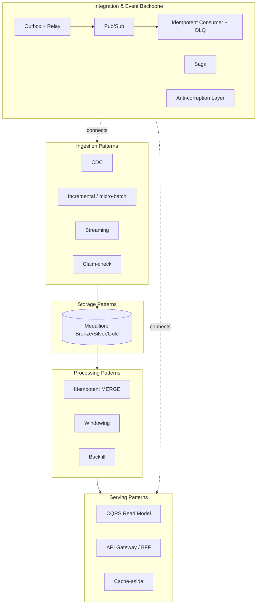
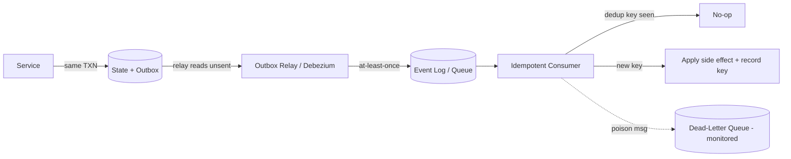
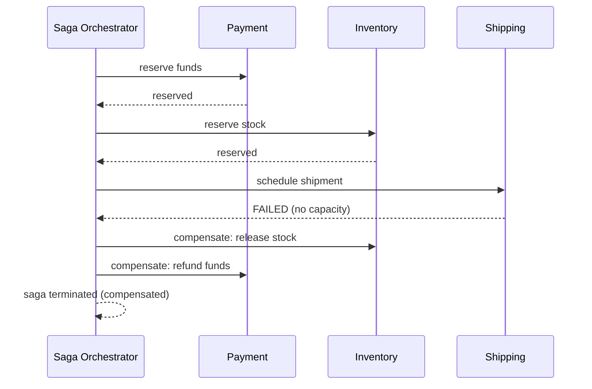

# Architecture Patterns Catalog

> Part of the **Enterprise Data & AI Architecture Handbook** — Resources / Architecture, Chapter 02.
> A reusable, opinionated catalog of the data and integration *patterns* — the recurring, named building blocks — from which the whole-platform reference architectures are assembled, with Azure-first implementations, enterprise open-source alternatives, honest trade-offs, and clear "when NOT to use this" guidance.

---

## Executive Summary

Where the companion [Reference Architectures Catalog](01_Reference_Architectures_Catalog.md) selects **whole-platform architectures** (the batch lakehouse, the streaming stack, the RAG stack, the agentic platform), this chapter goes one level down: it catalogs the **individual, named patterns** those architectures are built from — the ingestion, storage, processing, serving, integration, and event patterns an engineer wires together every day.

A pattern is a **named, reusable solution to a recurring problem in a stated context**, with known consequences. Naming matters: a team that recognizes "this is a claim-check pattern" or "this is a transactional outbox" solves the problem with a mature, battle-tested approach and communicates it in one word, instead of re-deriving a worse version from scratch and giving it no name (which makes it unmaintainable the day its author leaves — a real failure this catalog is designed to prevent).

The single most consequential message of this chapter mirrors the handbook's recurring thesis at pattern granularity: **choose the least powerful pattern that meets the requirement, and never let a fast or derived path make a decision the authoritative path is responsible for.** A denormalized read model is for reads, never the source of truth; an at-least-once delivery guarantee requires an idempotent consumer, not wishful thinking; an agent's autonomy is a risk multiplier. This chapter builds directly on [Phase-14 (Event-Driven Architecture & Integration)](../../Phase-14/01_Event_Driven_Architecture.md), which develops the event, microservice, CQRS, event-sourcing, API, integration, and messaging patterns in full depth — this catalog is the consolidated selection-and-trade-off layer above them, extended with the data-platform ingestion/storage/processing/serving patterns.

---

## Learning Objectives

After working through this chapter you will be able to:

- **Recognize and name** the recurring ingestion, storage, processing, serving, integration, and event patterns rather than re-deriving bespoke versions.
- **Select** the correct pattern for a requirement using the Pattern Selection Matrix, and articulate the "when NOT to use this" boundary for each.
- **Compose** patterns correctly — e.g. transactional outbox + idempotent consumer + dead-letter queue as one reliable-delivery unit.
- **Distinguish** patterns that are genuinely different (queue vs log; choreography vs orchestration; CQRS vs event sourcing) rather than conflating them.
- **Implement** each pattern on Azure with concrete services, and name the enterprise-OSS equivalent and its trade-off.
- **Detect and remediate** the classic anti-patterns (distributed monolith, dual-write, God service, shared mutable database, at-least-once-without-idempotency).
- **Write** an ADR that selects a pattern with named alternatives and an explicit invalidation condition.

---

## Business Motivation

Patterns are the vocabulary of a maintainable, communicable architecture. The business consequences of *not* having a shared pattern vocabulary are concrete and recurring:

- **Reinvented, unnamed, unmaintainable solutions.** A bespoke if/else content-based router built without recognizing it as a named [Enterprise Integration Pattern](../../Phase-14/06_Enterprise_Integration_Patterns.md) becomes unmaintainable the moment its original author leaves — nobody else recognizes the shape.
- **The dual-write data-corruption class.** A service writes to its database *and* publishes an event as two separate operations; a crash between them silently loses the event or leaves the two stores permanently inconsistent — a whole class of hard-to-debug incidents that the transactional-outbox pattern eliminates by construction.
- **The distributed monolith.** Microservices drawn along the wrong boundaries produce a system with all the operational cost of distribution and none of the independent-deployment benefit — the single most expensive integration anti-pattern ([Microservices Architecture](../../Phase-14/02_Microservices_Architecture.md)).
- **Duplicate-charge / oversell incidents.** An at-least-once message that is redelivered without an idempotent consumer causes a phantom order or a double charge — a direct revenue and trust cost.
- **Over-engineering.** A full CQRS + event-sourcing pipeline built for a query a single composite index would have served in <50ms — permanent complexity for zero benefit.

A pattern catalog turns these from per-project mistakes into pre-solved, named, reviewable decisions. It is the mechanism that makes "we chose the outbox pattern because dual-write is unsafe here" a one-line, defensible statement in an architecture review.

---

## History and Evolution

The patterns in this catalog are the accumulated, named solutions of four decades of software and data engineering:

- **1994–1996 — the software design-pattern movement.** The Gang of Four (*Design Patterns*, 1994) established that recurring solutions deserve names and catalogs. This is the intellectual template for every catalog since, including this one.
- **2002–2004 — enterprise integration patterns.** Hohpe & Woolf's *Enterprise Integration Patterns* (2003) named the messaging vocabulary — channels, routers, translators, aggregators, splitters, sagas — that still governs integration today ([Enterprise Integration Patterns](../../Phase-14/06_Enterprise_Integration_Patterns.md)). The same era's ESB over-centralization taught the lasting lesson that the *deployment topology* (centralized/heavyweight) was the failure, not the patterns themselves.
- **2003–2010 — Domain-Driven Design and CQRS.** Evans' DDD (2003) gave bounded contexts as the source of correct service boundaries; Young/Fowler formalized CQRS and its (independent) pairing with event sourcing around 2010, a conflation this catalog still has to untangle ([CQRS](../../Phase-14/03_CQRS.md), [Event Sourcing](../../Phase-14/04_Event_Sourcing.md)).
- **2011–2015 — the streaming and log era.** Kafka (LinkedIn, 2011) made the durable replayable log a first-class primitive; Kreps' "The Log" (2013) reframed data integration around it, giving rise to the ingestion and processing patterns (CDC, stream processing, materialized views) that dominate modern data platforms.
- **2017–2020 — the lakehouse and medallion patterns.** ACID table formats (Delta/Iceberg/Hudi) made warehouse-grade patterns — idempotent upsert, time travel, incremental processing — available on object storage, and the medallion (Bronze/Silver/Gold) refinement pattern became the default data-platform shape ([Medallion Architecture](../../Phase-05/03_Medallion_Architecture.md)).
- **2020–present — the AI-integration patterns.** RAG, tool-calling, and agentic loops added a new family of patterns — retrieve-then-rerank, bounded-agent-loop, bundle-as-release-unit — that are integration patterns in a new domain, not a break from the tradition ([Phase-12](../../Phase-12/05_Agentic_AI_Architecture.md)).

The through-line: patterns **accumulate and get named**; they rarely die. A modern platform is a specific composition of patterns spanning all six eras.

---

## Why This Technology Exists

Patterns exist to solve a **communication and reuse** problem, not a technology problem. The underlying mechanisms (queues, logs, tables, indexes, endpoints) are individually well understood. What is scarce and valuable is the *named, reusable judgment* about:

1. **Which solution** fits a recurring problem in a given context (delivery guarantee, consistency need, coupling tolerance, query shape).
2. **What its known consequences are** — every pattern buys something and costs something.
3. **When it stops being the right answer** — the "when NOT to use this" boundary that separates a Staff+ engineer from a pattern-cargo-culter.

Without a catalog, every team re-derives these — inconsistently, usually optimizing for the mechanism they already know rather than the requirement in front of them, and often reinventing a named pattern badly. The catalog makes pattern selection **reproducible, communicable in one word, and defensible** in review.

---

## Problems It Solves

- **Reuse of proven solutions.** Recognizing "this is a claim-check / outbox / saga" applies a mature, edge-case-tested approach instead of a fragile bespoke one.
- **Shared vocabulary.** Patterns compress a design decision into one communicable word, making reviews and handovers fast.
- **Correct composition.** The catalog shows which patterns must be used *together* (at-least-once delivery + idempotent consumer; outbox + relay + DLQ).
- **Right-sizing.** Explicit "when NOT to use" boundaries prevent both over-engineering (CQRS for a lookup) and under-engineering (dual-write instead of outbox).
- **Anti-pattern avoidance.** Naming the distributed monolith, dual-write, and God service makes them recognizable and preventable.
- **Trade-off transparency.** Each pattern carries its explicit cost, so selection is evidence-based.

---

## Problems It Cannot Solve

- **It cannot choose your domain boundaries.** Patterns tell you the *shape* of an integration, not the correct bounded contexts — that is DDD/domain-modeling work ([Domain-Driven Design](../../Phase-01/05_Domain_Driven_Design.md)).
- **It cannot substitute for measurement.** A pattern's performance/cost profile is a starting point; the actual bottleneck must still be profiled ([Performance Engineering](../../Phase-18/05_Performance_Engineering.md)).
- **It cannot make the organizational decisions.** Ownership, funding, and team topology determine whether patterns are applied consistently ([Data Mesh Principles](../../Phase-15/01_Data_Mesh_Principles.md)).
- **It cannot escape physics.** Consistency/latency/availability trade-offs (CAP/PACELC) are constraints a pattern helps you *place yourself on*, not evade ([CAP and PACELC](../../Phase-02/04_CAP_and_PACELC.md)).
- **It cannot guarantee correctness on its own.** A correctly-named pattern applied to the wrong requirement is still wrong; naming is necessary, not sufficient.

---

## Core Concepts

Patterns are organized into families by the stage of the data/integration lifecycle they address. In-prose cross-references to other sections of this chapter use the section's position number (e.g. §25 Decision Matrix, §27 Anti-patterns).

### 2.1 Ingestion patterns

How data enters the platform:

- **Full/batch load** — periodic reload of a dataset; simple, idempotent by replacement, but expensive and stale between runs.
- **Incremental / micro-batch** — load only what changed since a watermark; the default for cost-efficient batch.
- **Change Data Capture (CDC)** — capture row-level changes from a source's transaction log (Debezium, native connectors); low-impact, near-real-time replication of an operational store ([Change Data Capture](../../Phase-07/06_Change_Data_Capture.md)).
- **Streaming ingestion** — continuous append from an event log (Kafka/Event Hubs); use when freshness is a named requirement, not by default ([Streaming Fundamentals](../../Phase-07/01_Streaming_Fundamentals.md)).
- **Claim-check** — for large payloads, put the payload in object storage and pass only a reference (claim check) through the messaging system, so the broker isn't a bulk-data pipe.

### 2.2 Storage patterns

How data is organized at rest:

- **Medallion (Bronze/Silver/Gold)** — layered refinement as ownership/trust boundaries, not a mandatory three-hop ([Medallion Architecture](../../Phase-05/03_Medallion_Architecture.md)).
- **Lakehouse table (ACID on object storage)** — open table format (Delta/Iceberg) giving transactions, schema, time travel.
- **Polyglot persistence** — use the right store per access pattern (relational for transactions, KV/Redis for hot reads, vector for similarity, graph for traversal) rather than one store for everything.
- **Lambda vs Kappa** — dual batch+speed paths (Lambda) vs one streaming path that also backfills batch by replay (Kappa, preferred); a storage-and-processing topology choice.

### 2.3 Processing patterns

How data is transformed:

- **ETL vs ELT** — transform-then-load (schema-on-write) vs load-then-transform (schema-on-read, lakehouse default); ELT lets the warehouse/lakehouse do the compute.
- **Idempotent upsert (MERGE)** — conform data with a natural + version key so re-runs are safe — the foundation of reliable batch.
- **Windowing** (tumbling/sliding/session) — bound stream computation over time; watermarks set the freshness-vs-completeness dial ([Streaming Patterns and Delivery Semantics](../../Phase-07/08_Streaming_Patterns_and_Delivery_Semantics.md)).
- **Backfill / reprocessing** — replay historical data through current logic; a first-class capability, not an afterthought (the classic `catchup=True` mass-backfill footgun lives here — [Orchestration with Airflow](../../Phase-09/07_Orchestration_with_Airflow.md)).

### 2.4 Serving patterns

How data reaches consumers:

- **CQRS read models / materialized views** — purpose-built, denormalized projections for fast reads; **display-only, never authoritative for a decision** ([CQRS](../../Phase-14/03_CQRS.md)).
- **API Gateway / Backend-for-Frontend (BFF)** — a single entry point (gateway) and per-client aggregation layer (BFF) in front of services ([API Design](../../Phase-14/05_API_Design_REST_GraphQL_gRPC.md)).
- **Data-product / published-contract serving** — expose data behind a versioned contract + SLA, not raw table access ([Data Contracts](../../Phase-08/07_Data_Contracts.md)).
- **Cache-aside** — read-through/write-around caching with explicit invalidation (and stampede protection).

### 2.5 Integration & event patterns

How services and systems talk:

- **Publish/subscribe & event notification** — decoupled fan-out; a topic can be queue-backed-per-subscription (Service Bus) or log-backed-per-consumer-group (Kafka) — pub/sub is orthogonal to queue-vs-log ([Message Brokers and Queues](../../Phase-14/07_Message_Brokers_and_Queues.md)).
- **Saga (choreography vs orchestration)** — manage a multi-service transaction via compensating actions; choreography for simple fan-out, orchestration for higher branching/compensation complexity ([Event-Driven Architecture](../../Phase-14/01_Event_Driven_Architecture.md)).
- **Transactional outbox + relay** — write the event to an outbox table in the *same* local transaction as the state change, then relay it — the correct fix for dual-write.
- **Idempotent consumer + dead-letter queue (DLQ)** — the mandatory companions to at-least-once delivery; dedupe on a message key, and quarantine poison messages.
- **Anti-corruption layer (ACL)** — a translation boundary protecting a clean domain model from a legacy/third-party model ([Microservices Architecture](../../Phase-14/02_Microservices_Architecture.md)).
- **Content-based router / message translator / aggregator / splitter** — the classic EIP transformation and routing vocabulary.

---

## Internal Working

This section describes how the load-bearing patterns actually execute at the mechanism level. Subsections are numbered 3.x per the handbook convention.

### 3.1 How the transactional outbox eliminates dual-write

Dual-write fails because "update DB" and "publish event" are two independent operations with no shared transaction — a crash between them loses one. The outbox pattern makes the event write **part of the same local ACID transaction** as the state change: the service inserts the domain row *and* an `outbox` row atomically. A separate **relay** process (a poller, or a CDC connector like Debezium reading the DB log) then reads unpublished outbox rows and publishes them to the broker, marking them sent. Because the outbox insert committed with the state change, the event can never be lost; because the relay is at-least-once, the *consumer* must be idempotent (3.2). This composition — outbox + relay + idempotent consumer + DLQ — is the reliable-delivery unit; no single piece is sufficient alone.

### 3.2 How idempotent consumption survives at-least-once delivery

No broker examined in this handbook provides true unconditional exactly-once ([Message Brokers and Queues](../../Phase-14/07_Message_Brokers_and_Queues.md)); the achievable target is **at-least-once delivery + idempotent consumption**. The consumer records a durable de-duplication key (message ID or a business idempotency key) — often in the same transaction as the side effect — and treats a redelivered key as a no-op. The subtle failure is a *per-instance* (non-shared, non-durable) dedup cache under competing consumers, which does not actually dedupe across a redelivery to a different instance — the real cause of "phantom order" duplicate-charge incidents. The dedup store must be shared and durable.

### 3.3 How CQRS read models and saga compensation execute

A CQRS read model is a projection built by **consuming the write model's events** and applying incremental upserts into a denormalized store shaped for a specific query. It is eventually consistent (a designed, bounded staleness), rebuildable from the event history, and never the source of truth. A subtle correctness bug: if deletion/cancellation events are never tested, the projection silently diverges while lag monitoring shows healthy — so a write-to-read discrepancy spot-check is a distinct monitoring control from lag. A **saga** executes a multi-service transaction as a sequence of local transactions, each with a **compensating action** for rollback; orchestration centralizes the sequence in a coordinator, choreography distributes it via events. Compensations must themselves be idempotent because the saga may retry.

---

## Architecture

At the composition level, the patterns assemble into a layered pipeline where each layer is a family of interchangeable patterns:

- **Ingestion layer** — one or more of {batch, incremental, CDC, streaming, claim-check} landing into governed storage.
- **Storage layer** — medallion tiers on ACID lakehouse tables, with polyglot serving stores fed from Gold.
- **Processing layer** — {ETL/ELT, idempotent upsert, windowing, backfill} transforming Bronze→Silver→Gold.
- **Serving layer** — {CQRS read models, materialized views, API gateway/BFF, data-product contracts, cache-aside} exposing data to consumers by access pattern.
- **Integration/event backbone (cross-cutting)** — {pub/sub, saga, outbox+relay, idempotent-consumer+DLQ, ACL, EIP routers/translators} connecting producers, services, and the platform.

The defining property is **correct composition**: patterns are chosen not in isolation but as *sets* that satisfy a delivery/consistency contract end-to-end. An at-least-once ingestion pattern paired with a non-idempotent processing pattern is a defect regardless of how good each is individually.

---

## Components

| Pattern component | Role | Azure primary | OSS equivalent |
|---|---|---|---|
| Event log / broker | Durable pub/sub + replay | Event Hubs (Kafka API) / Service Bus | Apache Kafka / RabbitMQ |
| CDC connector | Capture source changes | ADF/Fabric CDC, Debezium on AKS | Debezium |
| Stream processor | Windowing, stateful transforms | Databricks Structured Streaming / Stream Analytics | Apache Flink |
| Table format | Idempotent upsert, time travel | Delta Lake | Delta / Iceberg / Hudi |
| Orchestrator | Schedule, backfill, dependencies | ADF / Databricks Workflows | Airflow / Dagster |
| Outbox relay | Reliable event publishing | Debezium / Functions poller | Debezium |
| API gateway | Single entry, policy, routing | Azure API Management | Kong / Nginx / Envoy |
| Read-model store | Denormalized fast reads | Cosmos DB / Azure SQL | PostgreSQL / Redis |
| Cache | Hot-read acceleration | Azure Cache for Redis | Redis / Memcached |
| Integration/iPaaS | EIP routers/translators (low-code) | Azure Logic Apps | Apache Camel |
| Dead-letter store | Poison-message quarantine | Service Bus DLQ / Event Hubs capture | Kafka DLQ-topic convention |
| Schema registry | Contract enforcement at the boundary | Azure Schema Registry (Event Hubs) | Confluent/Apicurio Schema Registry |

Each substitution is an explicit lock-in-vs-operational-burden trade-off, discussed in §31–§32 and §35.

---

## Metadata

Metadata is what makes patterns governable and composable rather than opaque plumbing:

- **Schema & contract metadata** — the schema registry enforces the message/event contract at the ingestion boundary (backward-compatible, additive-only evolution; consumer-driven contract tests as the CI gate). A CloudEvents envelope standardizes event metadata (id, source, type, time) across the backbone.
- **Delivery & dedup metadata** — message IDs, idempotency keys, delivery counts, and DLQ reason codes are first-class metadata the idempotent-consumer and DLQ patterns depend on.
- **Lineage metadata** — OpenLineage/Purview lineage across ingestion → processing → serving lets you trace a served figure back to its source events; essential for CQRS-projection debugging and audit ([Data Catalog and Lineage](../../Phase-08/02_Data_Catalog_and_Lineage.md)).
- **Classification metadata** — must propagate through every pattern (CDC → Silver → read model → cache) with a CI check; an un-propagated classification is the recurring access-control-propagation defect.

See [Metadata Management](../../Phase-08/04_Metadata_Management_OpenMetadata_and_Atlas.md).

---

## Storage

Pattern-specific storage considerations:

- **Event log** — durable storage with a retention window (hours to infinite/compacted); a compacted topic can serve as a materialized latest-state store.
- **Outbox table** — a regular table in the source DB, written transactionally; kept small by the relay marking/deleting sent rows.
- **Lakehouse tables** — Parquet under an ACID format, partitioned and clustered for data skipping; idempotent MERGE targets. Table maintenance (OPTIMIZE/VACUUM/statistics) is a first-class scheduled pattern — the small-files problem is the dominant silent regression ([Columnar Storage Internals](../../Phase-04/02_Columnar_Storage_Internals.md)).
- **Read-model / cache stores** — *derived and rebuildable*; never the system of record. A read model rebuilt from event history can silently **resurrect already-erased data** unless erasure is reflected in the event stream/rebuild path — a right-to-be-forgotten hazard shared with event sourcing ([Data Privacy and PII Protection](../../Phase-10/07_Data_Privacy_and_PII_Protection.md)).
- **DLQ store** — durable, monitored, and *drained* — a DLQ nobody watches is a silent data-loss sink.

The unifying discipline: **derived storage (read models, caches, projections) is disposable; the log/outbox/authoritative table is the source of truth.**

---

## Compute

- **Stream-processing compute** is long-running and stateful (RocksDB-backed keyed state, checkpointed); sized to sustained-peak throughput, does not scale to zero.
- **Batch/ELT compute** scales elastically and to zero between runs; the primary FinOps lever (spot for fault-tolerant jobs, right-sizing).
- **Relay/consumer compute** is typically lightweight (Functions/containers) but must be sized so the outbox/DLQ don't back up; competing consumers scale horizontally, bounded by per-key ordering.
- **Gateway/BFF compute** sits on the hot path; size for tail latency and protect with bulkheads so one slow downstream doesn't starve the whole gateway ([Retail and E-Commerce Data](../../Phase-17/05_Retail_and_Ecommerce_Data.md)).

Separation of storage and compute lets each pattern's compute be sized independently against the same governed data.

---

## Networking

Every pattern runs on the platform's **private-endpoint-only, default-deny-egress** baseline ([Network Security and Zero Trust](../../Phase-10/04_Network_Security_and_Zero_Trust.md)):

- Brokers, gateways, databases, and caches are reached over **Private Link**; public access disabled (the recurring "added a private endpoint, forgot to disable public access" gotcha).
- The API gateway is the controlled north-south entry point; service-to-service (east-west) traffic uses gRPC/mTLS on the internal network.
- CDC connectors need network access to the source DB's log endpoint — a privileged path that must be tightly scoped.
- Cross-org/partner integration terminates at a controlled gateway or ACL, never direct database access.

---

## Security

Security woven through the patterns:

- **Identity & authorization** — managed identities/workload identity federation, never long-lived secrets ([IAM with Entra](../../Phase-10/02_Identity_and_Access_Management_with_Entra.md)); the gateway enforces authN/authZ (validate-jwt) so services don't each reinvent it; the caller's identity propagates through the integration backbone to the backing system's native access check ([MCP](../../Phase-12/06_Model_Context_Protocol_MCP.md)).
- **Message integrity & confidentiality** — encrypt payloads in transit; for sensitive data, the claim-check pattern keeps bulk sensitive payloads out of the broker entirely.
- **The shared-database anti-pattern is a security failure** — a service reading another's database directly bypasses the owner's access controls; the ACL/API pattern is the fix.
- **Injection defense at integration boundaries** — treat inbound messages, retrieved documents, and tool observations as untrusted input; validate at the boundary ([Prompt Engineering](../../Phase-12/02_Prompt_Engineering.md), [Evaluation and Guardrails](../../Phase-12/09_Evaluation_and_Guardrails.md)).

---

## Performance

Performance is measured, not assumed ([Performance Engineering](../../Phase-18/05_Performance_Engineering.md)):

- **Ingestion** — CDC and micro-batch minimize source impact vs full reload; claim-check keeps the broker fast by not carrying bulk payloads.
- **Processing** — idempotent MERGE + partition/predicate pruning + skew mitigation (salting/AQE); windowing/watermark settings bound stream latency.
- **Serving** — CQRS read models and materialized views trade write amplification and staleness for read speed; the classic mistake is building one where a composite index would serve the query in <50ms. Cache-aside must guard against stampede.
- **Integration** — the GraphQL N+1 resolver problem (DataLoader batching is the near-mandatory fix), gRPC's serialization efficiency for high-volume internal calls, and Kafka hot-partition throughput collapse (a poorly-chosen partition key) are the recurring performance failures ([API Design](../../Phase-14/05_API_Design_REST_GraphQL_gRPC.md), [Message Brokers and Queues](../../Phase-14/07_Message_Brokers_and_Queues.md)).

Report the tail (p95/p99), never the average.

---

## Scalability

- **Pub/sub & streaming** scale by partitioning; the ceiling is per-key ordering (a hot partition can't be split without changing the key) and stateful-operator memory.
- **CQRS** scales reads by adding independent, differently-shaped projections off one write model.
- **Sagas** scale multi-service workflows but add coordination and compensation complexity that grows with step count.
- **API gateway/BFF** scale horizontally; bulkheads and priority load-shedding protect the critical path under overload.
- **Read models/caches** scale reads cheaply but multiply the surfaces that must be invalidated correctly.

The meta-principle: scale by **decoupling and partitioning**, and by choosing the least-coupling pattern that meets the requirement.

---

## Fault Tolerance

- **Reliable delivery** = outbox + relay + idempotent consumer + DLQ, composed; no single piece suffices.
- **Sagas** provide multi-service atomicity via compensating actions where a distributed ACID transaction is impossible.
- **Idempotency** everywhere makes retries safe; retries use exponential backoff + jitter and a circuit breaker to avoid retry storms.
- **CQRS/event-sourcing recovery** rebuilds read models/state from the durable log (bounded by retention/erasure reflection).
- **Bulkheads + timeouts + fallbacks** isolate failures so one slow dependency doesn't cascade ([Fault Tolerance and Resilience](../../Phase-02/07_Fault_Tolerance_and_Resilience.md)).

Reliability is governed by explicit SLOs and error budgets, not maximized ([Reliability and SRE](../../Phase-18/04_Reliability_and_SRE.md)).

---

## Cost Optimization

Cost (FinOps) is a first-class pattern-selection input ([FinOps and Cost Optimization](../../Phase-18/01_FinOps_and_Cost_Optimization.md)). The dominant cost driver differs by pattern family:

- **Ingestion** — full reload is the most expensive; incremental/CDC minimize compute and source impact. Right-size streaming to sustained (not spike) throughput.
- **Processing** — spot/low-priority compute for fault-tolerant batch; OPTIMIZE to kill small-file overhead; ELT pushes compute to elastic engines that scale to zero.
- **Serving** — every read model and cache is extra storage + write amplification + an invalidation surface; add them only when a measured read requirement justifies it.
- **Integration** — an always-on iPaaS/broker for a job a scheduled Function would do is permanent cost; conversely, a bespoke integration where a mature EIP tool exists is a maintenance cost.

**Worked FinOps example.** A team defaulted to a full nightly reload of a large dimension table (~2 TB) at roughly €900/month of compute plus heavy source-DB load during the window. Switching to **CDC + idempotent MERGE** (capture only the ~1–2% of rows that change daily) cut the nightly compute to ~€120/month and removed the source-DB contention entirely — a ~85% reduction on that pipeline plus an unquantified reliability win (no more window overruns). The lesson is the recurring right-sizing one: **the ingestion pattern, not the cluster size, was the dominant cost variable** — profile the change rate before paying to reprocess unchanged data.

---

## Monitoring

Alert on SLO-tied symptoms, not causes ([Monitoring with Prometheus and Grafana](../../Phase-18/03_Monitoring_with_Prometheus_and_Grafana.md)):

- **Ingestion/processing** — freshness (time since last successful load vs SLA), row-count/volume anomalies, and **absence** alerting (a job that silently didn't run).
- **Integration backbone** — consumer lag, DLQ depth and growth rate (a rising DLQ is a poison-message or downstream-outage signal), outbox backlog, and redelivery/duplicate rates.
- **CQRS** — projection lag *and* a write-to-read discrepancy spot-check (lag can be healthy while the projection is logically wrong).
- **Serving** — gateway/BFF tail latency, cache hit ratio, and stampede signals.
- **Cross-cutting** — hot-partition detection (a single key dominating throughput) and cost anomalies.

Anything that pages a human is an SLO-based burn-rate alert.

---

## Observability

Observability is the ability to ask new questions of existing telemetry ([Observability with OpenTelemetry](../../Phase-18/02_Observability_with_OpenTelemetry.md)):

- **OpenTelemetry + W3C Trace Context** must propagate across every pattern boundary — including the **async/message seam**, where a trace most commonly breaks silently: a producer's context must be injected into the message header and extracted by the consumer (via span links where parent-child doesn't fit), or the consumer starts an orphaned trace and end-to-end latency becomes invisible.
- **Saga observability** — a correlation ID threaded through every step so a stuck or compensating saga is traceable end-to-end.
- **Data observability** — freshness/volume/schema/distribution/lineage across ingestion→processing→serving ([Data Catalog and Lineage](../../Phase-08/02_Data_Catalog_and_Lineage.md)).

The recurring failure this guards against: a latency or correctness regression living at the *seam* between two well-instrumented components, invisible on either one's own dashboard — the classic broken-trace-across-the-queue incident.

---

## Governance

Governance turns a pattern zoo into a governed platform:

- **Contracts at every boundary** — schema-registry CI gates, consumer-driven contract tests, published data-product SLAs with deprecation protocols ([Data Contracts](../../Phase-08/07_Data_Contracts.md)).
- **Classification propagation** through every pattern (CDC → Silver → read model → cache) with a CI check.
- **Federated computational governance** — global policies (naming, retention, PII handling, DLQ retention) enforced as fail-closed code; local pattern choices left to domains ([Federated Governance](../../Phase-15/04_Federated_Governance.md)).
- **Pattern standards as golden paths** — the approved outbox/idempotent-consumer/gateway templates are paved so teams adopt them by default rather than reinventing ([Self-Serve Data Platform](../../Phase-15/05_Self_Serve_Data_Platform.md)).

See [Data Governance Foundations](../../Phase-08/01_Data_Governance_Foundations.md).

---

## Trade-offs

| Pattern | Buys you | Costs you | When NOT to use |
|---|---|---|---|
| **CDC ingestion** | Near-real-time, low source impact | Connector operational complexity, schema-change handling | Low-change-rate or genuinely batch sources |
| **Streaming** | Sub-second freshness | Always-on stateful compute, high op burden | Low-volume / daily-consumed data |
| **Medallion** | Clear trust/ownership boundaries | Storage duplication across tiers | Trivial single-hop transforms |
| **CQRS read model** | Fast, purpose-built reads | Eventual consistency, extra store, invalidation | A composite index already serves the query |
| **Event sourcing** | Full audit/temporal history | Upcasting, erasure/crypto-shred complexity | No named audit/temporal requirement |
| **Saga (orchestration)** | Multi-service atomicity | Coordinator + compensation complexity | Simple fan-out (use choreography) |
| **Transactional outbox** | Eliminates dual-write loss | An outbox table + relay to operate | Single-store writes with no event to publish |
| **API gateway/BFF** | Central policy, per-client shaping | A hop on the hot path, a component to run | Trivial single-service, single-client access |
| **Claim-check** | Broker stays fast for large payloads | An extra object-store round trip | Small payloads |
| **Polyglot persistence** | Right store per access pattern | Operational surface of many stores | One access pattern; one store suffices |

The meta-trade-off: **every pattern buys a capability and costs coupling, consistency, or operational surface.** Choose the least powerful pattern that meets the requirement.

---

## Decision Matrix

Select from requirements. Read top-to-bottom; the first row whose condition is genuinely met is usually your answer.

| If the requirement is… | …then the pattern is | Key qualifier |
|---|---|---|
| Replicate an operational store with low impact, near-real-time | **CDC ingestion** | Prefer over full reload above a trivial change rate |
| Only a small fraction of rows change each run | **Incremental + idempotent MERGE** | Profile change rate first (see §20) |
| Sub-second freshness is a named revenue/safety requirement | **Streaming ingestion + windowing** | Justify with a freshness SLA and its value |
| A large payload must traverse messaging | **Claim-check** | Put payload in object storage, pass a reference |
| Publish a state change reliably alongside a DB write | **Transactional outbox + relay** | Never dual-write |
| Consume at-least-once delivery safely | **Idempotent consumer + DLQ** | Shared, durable dedup store — not per-instance |
| Coordinate a multi-service transaction | **Saga** | Choreography (simple) vs orchestration (complex/branching) |
| Fast reads with a query shape the write model serves poorly | **CQRS read model / materialized view** | Try a composite index first |
| Full audit trail / point-in-time reconstruction | **Event sourcing** | Scope to specific aggregates with a named requirement |
| Protect a clean domain from a legacy/third-party model | **Anti-corruption layer** | At the integration boundary |
| Route/transform/aggregate messages between systems | **EIP router/translator/aggregator** | Use a mature tool (Camel/Logic Apps), don't reinvent |
| Single entry point + per-client aggregation | **API gateway + BFF** | Don't add for trivial single-client access |
| A simple lookup | **A database/index — no pattern ceremony** | Don't reach for CQRS/streaming/RAG |

---

## Design Patterns

Consolidated, named, with their one-line intent:

- **Medallion** — layered refinement (Bronze/Silver/Gold) as trust boundaries.
- **Idempotent upsert (MERGE)** — safe re-runnable conforming on a natural + version key.
- **Transactional outbox + relay** — atomic state-change + event publish; the dual-write fix.
- **Idempotent consumer + DLQ** — safe at-least-once consumption + poison-message quarantine.
- **Saga (choreography/orchestration)** — multi-service transaction via compensating actions.
- **CQRS + read model** — separate write model from denormalized, display-only read projections.
- **Event sourcing** — append-only event log as the aggregate's only durable state (scoped).
- **Claim-check** — reference-not-payload through the broker for large objects.
- **Anti-corruption layer** — translation boundary protecting the domain model.
- **Content-based router / message translator / aggregator / splitter** — the EIP transformation vocabulary.
- **API gateway / BFF** — central entry + per-client aggregation.
- **Cache-aside** — read-through caching with explicit invalidation and stampede protection.
- **Strangler fig** — incrementally replace a legacy system by routing slices to the new one until the old is strangled.

---

## Anti-patterns

- **Dual-write** — writing to a DB and a broker as two operations; loses events / diverges stores. Fix: transactional outbox.
- **Distributed monolith** — microservices with hidden synchronous coupling and shared release cadence; all the cost of distribution, none of the benefit. Fix: DDD-driven boundaries + async decoupling ([Microservices Architecture](../../Phase-14/02_Microservices_Architecture.md)).
- **Shared mutable database** — one service reading/writing another's database directly; bypasses ownership and access control, breaks on any schema change. Fix: API/ACL boundary.
- **At-least-once without idempotency** — trusting redelivery won't happen; produces duplicate charges/phantom orders. Fix: idempotent consumer with a shared dedup store.
- **God service / God table** — one service or table that everything depends on; a change-amplification and availability SPOF.
- **Unnamed bespoke integration** — reinventing a content-based router / saga poorly, with no name, unmaintainable after its author leaves. Fix: recognize and apply the named pattern.
- **Chatty synchronous chains** — deep synchronous call chains (or GraphQL N+1) that couple availability and amplify latency. Fix: async events, DataLoader batching, or a coarser API.
- **Over-engineering** — CQRS + event sourcing for a query a composite index serves; streaming for a daily dashboard. Fix: the least-powerful-pattern rule.
- **The unwatched DLQ** — a dead-letter queue nobody monitors or drains; a silent data-loss sink.
- **Ungoverned iPaaS sprawl** — adopting a heavyweight integration platform for a job a 50-line Function would do.

---

## Common Mistakes

- Choosing a pattern from familiarity rather than requirements (RabbitMQ-everywhere when the workload needs Kafka's log/replay).
- Implementing at-least-once delivery and forgetting the idempotent consumer.
- A per-instance (non-shared, non-durable) dedup cache that doesn't actually dedupe across redelivery.
- Building a CQRS pipeline where a composite index would serve the query.
- Never testing deletion/cancellation events, so a projection silently diverges while lag looks healthy.
- Choosing a partition/session key that creates a hot partition under real-world skew.
- Leaving a DLQ unmonitored and undrained.
- Not injecting/extracting trace context across the async seam, orphaning the trace.
- Reinventing a named EIP instead of using a mature implementation — or adopting a full iPaaS where a Function suffices (both directions are anti-patterns).

---

## Best Practices

- **Recognize and name the pattern** before building; apply the mature version.
- **Compose reliable-delivery patterns as a set** — outbox + relay + idempotent consumer + DLQ.
- **Make derived stores disposable** (read models, caches, projections); keep one authoritative source of truth.
- **Right-size ruthlessly** — least powerful pattern that meets the requirement; try a composite index before CQRS, batch before streaming.
- **Enforce contracts at boundaries** with schema registries and consumer-driven contract tests.
- **Propagate trace context and classification** through every pattern, checked in CI.
- **Choose partition keys against real-world skew**, and monitor for hot partitions.
- **Monitor and drain DLQs**; treat DLQ growth as a first-class signal.
- **Pave pattern golden paths** so the correct pattern is the default, and reserve capacity for platform work so it isn't starved.

---

## Enterprise Recommendations

For a typical enterprise standardizing its integration and data patterns on Azure:

1. **Publish a paved pattern library** (outbox, idempotent consumer, gateway, medallion, CQRS-lite templates) as golden paths on the self-serve platform.
2. **Ban dual-write by policy**; mandate the transactional outbox (or CDC-based relay) for state-change-plus-event.
3. **Mandate idempotent consumers + monitored DLQs** wherever at-least-once delivery is used.
4. **Default to the least powerful pattern**; require a named justification for streaming, CQRS, and event sourcing.
5. **Enforce contracts computationally** (schema registry + consumer-driven contract tests in CI); propagate classification with a CI check.
6. **Instrument every seam with OpenTelemetry**, especially async message boundaries.
7. **Run FinOps against pattern choices** — profile change rate before reprocessing, right-size streaming, and count read-model/cache invalidation surfaces as cost.
8. **Choose service boundaries from DDD bounded contexts**, not technical layers, to avoid the distributed monolith.

---

## Azure Implementation

The Azure-first implementation (~60%) of the core patterns:

- **Ingestion:** **Azure Event Hubs** (Kafka-compatible) for streaming; **ADF / Microsoft Fabric** or **Debezium on AKS** for CDC; **Auto Loader** for incremental file ingestion (schema rescue, `trigger=availableNow`); Blob/ADLS for claim-check payloads.
- **Storage & processing:** **ADLS Gen2 + Delta Lake** medallion tiers; idempotent `MERGE INTO` on a natural + commit key; **Databricks Structured Streaming** / **Stream Analytics** / **Fabric Real-Time Intelligence** for windowing; **Databricks Workflows / ADF** for orchestration and backfill.
- **Integration/event backbone:** **Azure Service Bus** for ordered/transactional queues with a **native DLQ sub-queue** and sessions; **Event Hubs** for high-throughput replayable streams; **Azure Schema Registry** for contract enforcement; **Azure Logic Apps** as the low-code EIP/iPaaS layer (content-based routing, translation, ACL to legacy systems); **Azure Functions** for lightweight outbox relays and consumers.
- **Serving:** **Azure API Management** as the gateway (validate-jwt, rate-limit, routing); **Cosmos DB** (tunable consistency) or **Azure SQL** for CQRS read models; **Azure Cache for Redis** for cache-aside.
- **Cross-cutting:** **Azure Monitor + Managed Prometheus/Grafana** (consumer lag, DLQ depth, projection lag), **Azure Policy** for fail-closed governance, private endpoints + managed identities throughout.

Illustrative idempotent-upsert (the processing-pattern foundation):

```sql
MERGE INTO silver_orders AS t
USING staged_orders AS s
  ON t.order_id = s.order_id AND t.source_commit_lsn = s.source_commit_lsn
WHEN MATCHED AND s.op = 'DELETE' THEN DELETE
WHEN MATCHED THEN UPDATE SET *
WHEN NOT MATCHED AND s.op <> 'DELETE' THEN INSERT *;
```

Illustrative transactional-outbox insert (same local transaction as the state change):

```sql
BEGIN TRANSACTION;
  UPDATE orders SET status = 'CONFIRMED' WHERE order_id = @id;
  INSERT INTO outbox (event_id, aggregate_id, type, payload, created_at)
  VALUES (NEWID(), @id, 'OrderConfirmed', @payload, SYSUTCDATETIME());
COMMIT;  -- a relay/Debezium then publishes unsent outbox rows at-least-once
```

---

## Open Source Implementation

The enterprise OSS-equivalent stack (~30%):

- **Ingestion/backbone:** **Apache Kafka** (log/replay) + **RabbitMQ** (flexible routing/queues) + **Debezium** (CDC and outbox relay via the DB log) + **Confluent/Apicurio Schema Registry** for contracts.
- **Processing:** **Apache Flink** (stateful windowing, RocksDB, checkpointed) or **Spark Structured Streaming**; **Delta/Iceberg/Hudi** for idempotent upsert and time travel; **dbt Core** for ELT; **Apache Airflow / Dagster** for orchestration and backfill ([Orchestration with Airflow](../../Phase-09/07_Orchestration_with_Airflow.md)).
- **Integration/EIP:** **Apache Camel** (the reference EIP implementation — embeddable per-service, correcting the ESB centralization mistake).
- **Serving:** **Kong / Nginx / Envoy** as gateway; **PostgreSQL / Redis** for read models and cache-aside; **Trino / DuckDB / ClickHouse** query engines over the governed tables.
- **Cross-cutting:** **OpenTelemetry + Prometheus + Grafana + Tempo/Loki** (lag, DLQ, trace across the async seam); **OpenLineage/Marquez** for lineage; **Great Expectations** for boundary data quality.

The open message format (CloudEvents), open table format (Delta/Iceberg), and open telemetry (OTel) are the durable, portable core; brokers and gateways are the swappable layer.

---

## AWS Equivalent (comparison only)

For selection and migration reasoning — **not** a build target.

| Pattern component | Azure | AWS equivalent | Notes |
|---|---|---|---|
| High-throughput log | Event Hubs | Kinesis / MSK (managed Kafka) | MSK for Kafka-API parity |
| Ordered/transactional queue | Service Bus | SQS (FIFO) + SNS | SNS+SQS fan-out; SQS redrive = DLQ |
| CDC | ADF/Debezium | DMS / Debezium on MSK Connect | — |
| Stream processing | Structured Streaming / Stream Analytics | Kinesis Data Analytics / Flink on KDA | — |
| API gateway | API Management | API Gateway | — |
| Read-model store | Cosmos DB | DynamoDB | — |
| iPaaS / EIP | Logic Apps | Step Functions / EventBridge / AppFlow | Step Functions = orchestrated saga |

**Advantages of AWS:** SQS/SNS + EventBridge are mature, granular event primitives; Step Functions is a strong managed saga orchestrator. **Disadvantages:** DLQ/redrive semantics differ per service (SQS redrive vs Kafka DLQ-topic convention). **Migration strategy:** keep CloudEvents envelopes and OTel instrumentation; re-map broker and gateway. **Selection criterion:** choose by existing footprint and whether Step Functions' visual orchestration fits your saga complexity.

---

## GCP Equivalent (comparison only)

| Pattern component | Azure | GCP equivalent | Notes |
|---|---|---|---|
| Pub/sub backbone | Event Hubs / Service Bus | Pub/Sub | Single unified pub/sub, at-least-once |
| Stream/batch processing | Structured Streaming | Dataflow (Apache Beam) | Beam = unified batch+stream |
| CDC | ADF/Debezium | Datastream | — |
| API gateway | API Management | Apigee / API Gateway | Apigee = full lifecycle |
| Read-model store | Cosmos DB | Firestore / Bigtable | — |
| Orchestration/saga | Logic Apps / Durable Functions | Workflows / Eventarc | Eventarc = CloudEvents-native routing |

**Advantages of GCP:** Pub/Sub's simplicity and Dataflow's genuinely unified batch/stream (Beam) reduce the Lambda-vs-Kappa split; Eventarc is CloudEvents-native. **Disadvantages:** Pub/Sub lacks Kafka's per-partition-key ordering guarantees by default (ordering keys are opt-in); fewer log-replay semantics than Kafka. **Migration strategy:** Beam abstracts processing; CloudEvents keep event portability. **Selection criterion:** favor GCP where unified batch/stream and CloudEvents-native routing are priorities.

---

## Migration Considerations

- **The portable core** across clouds: **CloudEvents** (event envelope), **open table formats** (Delta/Iceberg), **OpenTelemetry** (tracing), and **consumer-driven contracts** — these survive a broker/gateway swap. Migration effort concentrates in the broker, gateway, and iPaaS layers, not the event/table formats.
- **Dual-write → outbox** is itself a migration: introduce the outbox table and relay, then remove the direct publish.
- **Lambda → Kappa** collapses dual code paths once the streaming path can replay history to rebuild batch outputs — verify parity before decommissioning batch.
- **Strangler fig** is the safe pattern for migrating a legacy monolith: route slices to the new system behind a facade until the old is fully strangled — never a big-bang cutover.
- **Platform-longevity risk is real:** the handbook's running list of retired/consolidated managed services — Google Cloud IoT Core (2023), AWS QLDB (end of support 2025), Azure Orbital Ground Station, Azure Personalizer, standalone Azure API for FHIR (consolidated) — is why the durable core should be **open standards**, with managed brokers/gateways treated as replaceable.

---

## Mermaid Architecture Diagrams

**Diagram 1 — Pattern families composed into one pipeline.**



**Diagram 2 — End-to-end reliable-delivery flow (outbox + relay + idempotent consumer + DLQ).**



**Diagram 3 — Saga (orchestration) with compensation.**



---

## End-to-End Data Flow

Tracing a business event through the composed patterns:

1. **State change + event (outbox).** A service confirms an order, writing the order row *and* an `OrderConfirmed` outbox row in one local transaction — no dual-write.
2. **Relay + pub/sub.** A relay (or Debezium reading the DB log) publishes the outbox event at-least-once to the event log; classification and a CloudEvents envelope are attached.
3. **Ingestion.** The event streams (or is CDC-captured) into **Bronze** as-is, with trace context and classification metadata preserved.
4. **Processing.** An idempotent MERGE conforms Bronze → **Silver** (safe under redelivery); windowed aggregation produces **Gold** marts; backfill can replay history through current logic.
5. **Serving.** A CQRS read model projects the events into a denormalized store shaped for a specific query; the API gateway/BFF serves it to clients, with cache-aside for hot reads. The read model is display-only — a purchase decision reserves against the authoritative inventory service, not the projection.
6. **Reliability & observability.** Idempotent consumers dedupe redeliveries, poison messages go to a monitored DLQ, a correlation ID threads the saga, and OpenTelemetry spans give one end-to-end trace across every seam.

The invariant: **at no seam does a derived copy (read model, cache) make a decision the authoritative store owns, and every at-least-once hop is paired with idempotent consumption.**

---

## Real-world Business Use Cases

- **Order fulfillment (saga + outbox).** A multi-service checkout (payment → inventory → shipping) coordinated by a saga with compensations, each state change published via the outbox pattern, consumed idempotently.
- **Operational replication (CDC + medallion).** An operational database replicated near-real-time into the lakehouse via CDC + idempotent MERGE for analytics without loading the source.
- **Real-time dashboards (streaming + CQRS read model).** Clickstream events windowed into a denormalized read model serving a live operations dashboard ([Retail and E-Commerce Data](../../Phase-17/05_Retail_and_Ecommerce_Data.md)).
- **Legacy modernization (strangler fig + ACL).** Incrementally replacing a legacy ERP by routing slices to new services behind an anti-corruption layer.
- **Partner integration (EIP + gateway).** Content-based routing, message translation, and an API gateway mediating heterogeneous partner formats via Logic Apps/Camel.

---

## Industry Examples

- **LinkedIn** — origin of Kafka and the "log as the backbone of data integration" pattern; heavy CDC and stream-processing use.
- **Uber** — created Hudi for incremental lakehouse upserts; large-scale Flink windowing and saga-style trip orchestration.
- **Netflix** — Kafka + SQS dual-broker use (log for replay, queue for work), a real precedent for choosing the broker by need rather than standardizing on one.
- **Amazon / retail** — saga-based order orchestration and idempotent payment processing at extreme scale; the canonical duplicate-charge-avoidance case.
- **Hohpe & Woolf / enterprise integration** — the named EIP vocabulary now implemented in Apache Camel and Azure Logic Apps across virtually every enterprise.

---

## Case Studies

**Case Study 1 — The dual-write phantom-order incident (motivates the ADR).**
A checkout service updated its orders database and *separately* published an `OrderPlaced` event to the broker as two independent operations. Under normal load this looked fine. During a broker blip, some orders were written to the database but the publish failed silently — downstream fulfillment never saw them, and customers who were charged received nothing. Worse, a naive retry that re-ran the whole handler *republished* already-committed orders, and because the downstream consumer used a **per-instance** (non-shared) dedup cache, competing consumers double-processed some events, producing duplicate charges. A blameless review identified two composed defects: **dual-write** (no atomicity between DB and broker) and **at-least-once without a shared idempotent consumer**. The fix was the composed reliable-delivery unit: a **transactional outbox** (event written in the same DB transaction as the order) + a relay + an **idempotent consumer with a shared, durable dedup store** + a monitored DLQ. The incident class disappeared. This is the canonical integration-pattern lesson: **reliable delivery is a composition of patterns, and every at-least-once hop needs idempotency.**

**Case Study 2 — CQRS over-engineering for a simple query.**
A team, enthusiastic about event-driven architecture, built a full CQRS pipeline — a separate event stream, a projection consumer, and a denormalized read store — to serve an "orders by customer, sorted by date" query. It worked, but it added an eventually-consistent store, a projection to operate and monitor, and a class of subtle bugs (the projection silently diverged for weeks because cancellation events were never tested, while lag monitoring showed healthy). A later review found the query was served in under 50ms by a single composite index on the existing operational store at zero additional operational cost. The CQRS pipeline was decommissioned for that query and reserved for the two read paths that genuinely had a write-model-hostile query shape. The lesson: **try the least powerful pattern (an index) first; CQRS is justified by a measured read/write asymmetry, not by architectural enthusiasm** — the right-sizing discipline that runs through this handbook.

### Architecture Decision Record (ADR-0213): Standardize Reliable-Delivery and Right-Sized Pattern Selection

**Context.** Teams were independently implementing state-change-plus-event as **dual-write** (causing the Case Study 1 phantom-order/duplicate-charge incident) and reaching for heavyweight patterns (CQRS, event sourcing, streaming) where a simpler pattern would serve (Case Study 2). There was no standing standard for reliable delivery or for right-sizing pattern selection, and bespoke unnamed integrations were becoming unmaintainable.

**Decision.** Adopt this catalog as the standing pattern-selection standard, with these binding clauses:
1. **No dual-write.** Any state change that must publish an event uses the **transactional outbox + relay** pattern (or CDC-based relay); publishing an event as a separate operation from the state-change transaction is prohibited.
2. **At-least-once implies idempotency.** Every consumer of an at-least-once channel is an **idempotent consumer** with a **shared, durable** dedup store (never per-instance), and every such channel has a **monitored, drained DLQ**.
3. **Least powerful pattern.** Selection follows the Pattern Selection Matrix (§25) from requirements; CQRS, event sourcing, and streaming each require a named, documented justification (a measured read/write asymmetry, an audit/temporal requirement, or a freshness SLA respectively). Try a composite index before CQRS; try batch before streaming.
4. **Contracts at boundaries.** Message/event schemas are enforced by a schema registry with consumer-driven contract tests in CI; classification propagates through every pattern with a CI check.
5. **Named patterns only.** Bespoke integrations must map to a named catalog pattern (or the catalog is extended); no unnamed one-off routers/sagas.
6. **Consequential choices produce an ADR** naming the pattern, alternatives, and an invalidation condition; right-sized so reversible/local choices stay fast.

**Consequences.** Positive: the dual-write and duplicate-charge incident classes are eliminated by construction; over-engineering is prevented; integrations are communicable and maintainable; contracts and classification are enforced. Negative/cost: teams must operate outbox relays and shared dedup stores (a modest, paved, golden-path cost), and consequential pattern choices carry a review step (kept right-sized). **Invalidation condition:** revisit if the platform adopts a broker/runtime that provides genuine end-to-end exactly-once with transactional publish (removing the outbox/idempotency burden for those paths), or if a new pattern family emerges that the catalog does not cover.

**Alternatives considered.** (a) *Allow dual-write with best-effort retries* — rejected; it is exactly Case Study 1's defect and cannot be made safe. (b) *Standardize on one heavyweight pattern (event sourcing everywhere)* — rejected; it is over-engineering as policy and recreates Case Study 2 at scale. (c) *No standard, per-team choice* — rejected; it is the status quo that produced both case studies. (d) *Rely on broker "exactly-once" claims* — rejected; no broker in scope provides unconditional exactly-once, so idempotent consumption remains necessary.

---

## Hands-on Labs

- **Lab 1 — Transactional outbox + idempotent consumer.** Implement an order service that writes state + an outbox row in one transaction; add a relay (poller or Debezium) to Event Hubs/Kafka; build an idempotent consumer with a shared dedup table; force a redelivery and confirm no duplicate side effect; route a poison message to a DLQ and alert on DLQ depth.
- **Lab 2 — CDC + idempotent MERGE.** Stream row-level changes from a source DB via Debezium/ADF into Bronze; conform into Silver with a `MERGE` on natural + commit key; re-run and confirm idempotency; measure the compute delta vs a full reload.
- **Lab 3 — Saga with compensation.** Orchestrate a payment → inventory → shipping saga (Durable Functions or a Camel/Temporal-style coordinator); induce a shipping failure and verify inventory and payment compensations run; thread a correlation ID and trace it end-to-end.
- **Lab 4 — CQRS read model vs index.** Build a read-model projection for a query, then serve the same query from a composite index; compare latency, staleness, operational surface, and cost — and decide which the requirement actually justifies.

---

## Exercises

1. For three integrations in your organization, name the pattern each currently uses. Identify any dual-writes, unwatched DLQs, or per-instance dedup caches.
2. Take one at-least-once channel and prove its consumer is idempotent (or fix it). Describe the dedup key and store.
3. Find one CQRS/event-sourcing/streaming usage and state its named justification. If none exists, propose the simpler pattern and estimate the cost/complexity delta.
4. Design the compensating actions for a real multi-service workflow and confirm each compensation is idempotent.
5. For one bespoke integration, map it to a named catalog pattern (or propose a catalog extension) and note what maintainability you gain.

---

## Mini Projects

- **Reliable-delivery reference slice:** outbox + relay + idempotent consumer + monitored DLQ, end-to-end, with OpenTelemetry tracing across the async seam and a Grafana dashboard for lag/DLQ/duplicate rate.
- **Pattern selection tool:** encode the Pattern Selection Matrix as an interactive questionnaire (requirement in → recommended pattern + trade-offs + "when NOT to use" out).
- **Right-sizing audit:** take one over-engineered pipeline (CQRS-for-a-lookup or streaming-for-a-daily-dashboard) and one under-engineered one (dual-write), and produce before/after designs with quantified cost/reliability deltas.

---

## Capstone Integration

This catalog is the pattern-granularity companion to the [Reference Architectures Catalog](01_Reference_Architectures_Catalog.md): the whole-platform architectures there are specific compositions of the patterns here. It builds directly on [Phase-14](../../Phase-14/01_Event_Driven_Architecture.md) (events, microservices, CQRS, event sourcing, APIs, EIPs, brokers), and connects to the **storage/table formats** of [Phase-04](../../Phase-04/04_Delta_Lake.md), the **lakehouse/medallion** of [Phase-05](../../Phase-05/03_Medallion_Architecture.md), the **streaming/CDC** of [Phase-07](../../Phase-07/06_Change_Data_Capture.md), the **governance/contracts** of [Phase-08](../../Phase-08/07_Data_Contracts.md), the **orchestration** of [Phase-09](../../Phase-09/07_Orchestration_with_Airflow.md), the **AI-integration patterns** of [Phase-12](../../Phase-12/05_Agentic_AI_Architecture.md), and the **FinOps/observability/reliability** disciplines of [Phase-18](../../Phase-18/02_Observability_with_OpenTelemetry.md), under the **decision/review** disciplines of [Phase-19](../../Phase-19/02_Architecture_Reviews.md). The Phase-20 capstones ([Enterprise Data Platform](../../Phase-20/01_Capstone_Enterprise_Data_Platform.md), [Enterprise AI Platform](../../Phase-20/02_Capstone_Enterprise_AI_Platform.md)) are concrete pattern compositions. The unifying thread, applied at pattern granularity: **the fast, convenient, or novel pattern must never substitute for the correct, right-sized, composed one — and every at-least-once hop pairs with idempotency.**

---

## Interview Questions

1. What is dual-write and why is it unsafe? What pattern fixes it, and how?
2. Explain why at-least-once delivery requires an idempotent consumer. What makes a dedup implementation correct vs broken?
3. When would you choose choreography over orchestration for a saga?
4. What is the difference between a queue and a log, and how does that change your pattern choice?
5. Give an example of over-engineering with CQRS and how you'd right-size it.

---

## Staff Engineer Questions

1. Design end-to-end reliable delivery for a state-change-plus-event. Name every pattern in the composition and explain what breaks if you drop one.
2. A CQRS projection's lag monitoring is healthy but the read model is wrong. What happened, and what monitoring control would have caught it?
3. A Kafka topic's throughput collapsed. Diagnose the likely partition-key problem and the fix without adding hardware.
4. How do you propagate trace context and access classification across an async message boundary, and how do you detect when it's broken?
5. Justify, with a change-rate number, moving an ingestion from full reload to CDC + idempotent MERGE.

---

## Architect Questions

1. You are standardizing integration patterns across ten teams. Which patterns do you make golden-path defaults, which do you ban, and how do you enforce it?
2. How do you migrate a dual-write system to the outbox pattern without downtime or event loss?
3. Design the boundary strategy (ACL, API, strangler fig) for incrementally replacing a legacy monolith.
4. How do you keep pattern choice governed (neither rubber-stamp nor central bottleneck) across a federated organization?
5. Present the trade-off of standardizing on one broker vs choosing per-need (log vs queue) to a skeptical platform team.

---

## CTO Review Questions

1. What is our exposure to dual-write data-corruption and duplicate-charge incident classes, and what is the remediation plan?
2. Where are we over-engineered (paying complexity for CQRS/event-sourcing/streaming we can't justify) and under-engineered (unsafe delivery)?
3. Which integrations are bespoke and unnamed — i.e. unmaintainable if their author leaves — and what is the plan to map them to standard patterns?
4. How portable are our integrations if we change brokers or clouds? What is our durable core?
5. Are our DLQs monitored and drained, and what is our data-loss exposure if they aren't?

---

## References

- Gamma, Helm, Johnson, Vlissides. *Design Patterns* (Gang of Four), 1994.
- Hohpe, G. & Woolf, B. *Enterprise Integration Patterns*, 2003.
- Evans, E. *Domain-Driven Design*, 2003.
- Fowler, M. — CQRS, Event Sourcing, and Strangler Fig pattern writings.
- Kreps, J. "The Log: What every software engineer should know about real-time data's unifying abstraction," 2013.
- Richardson, C. *Microservices Patterns* (saga, outbox, API composition), 2018.
- CloudEvents specification; Debezium, Apache Kafka, Apache Flink, Apache Camel documentation.
- Handbook prerequisite: [Phase-14 — Event-Driven Architecture & Integration](../../Phase-14/01_Event_Driven_Architecture.md) (chapters [01](../../Phase-14/01_Event_Driven_Architecture.md), [02](../../Phase-14/02_Microservices_Architecture.md), [03](../../Phase-14/03_CQRS.md), [04](../../Phase-14/04_Event_Sourcing.md), [05](../../Phase-14/05_API_Design_REST_GraphQL_gRPC.md), [06](../../Phase-14/06_Enterprise_Integration_Patterns.md), [07](../../Phase-14/07_Message_Brokers_and_Queues.md)).

---

## Further Reading

- Companion resource: [Reference Architectures Catalog](01_Reference_Architectures_Catalog.md) — the whole-platform architectures these patterns compose into.
- [Medallion Architecture](../../Phase-05/03_Medallion_Architecture.md) and [Change Data Capture](../../Phase-07/06_Change_Data_Capture.md) — deeper storage and ingestion pattern treatment.
- [Streaming Patterns and Delivery Semantics](../../Phase-07/08_Streaming_Patterns_and_Delivery_Semantics.md) — delivery-guarantee mechanics.
- [CQRS](../../Phase-14/03_CQRS.md) and [Event Sourcing](../../Phase-14/04_Event_Sourcing.md) — the read-model and event-log patterns in depth.
- [Enterprise Integration Patterns](../../Phase-14/06_Enterprise_Integration_Patterns.md) — the full EIP vocabulary.
- [Data Contracts](../../Phase-08/07_Data_Contracts.md) — enforcing contracts at pattern boundaries.
- [ROADMAP.md](../../../ROADMAP.md) — the full handbook curriculum.
