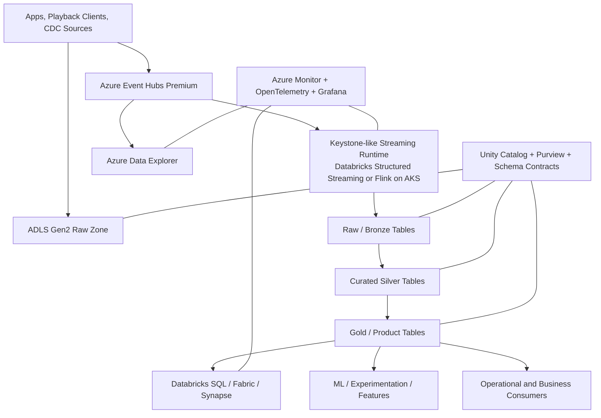
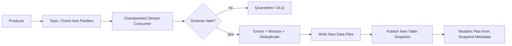
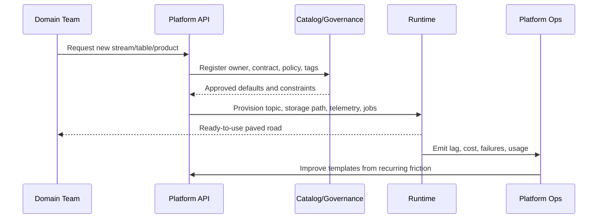

# Netflix Data Platform Case Study

> Part of the **Enterprise Data & AI Architecture Handbook** — Resources / CaseStudies, Chapter 01.
> A senior-level case study of how Netflix evolved its data platform, why Iceberg and platformized streaming mattered, and how to reuse the principles on Azure without cargo-culting Netflix's AWS-specific stack.

---

## Executive Summary

Netflix's data platform is important not because every enterprise should copy Netflix's stack, but because Netflix surfaced three lessons earlier and more clearly than most organizations at comparable scale.

First, **metadata is part of the database**, not a sidecar. Apache Iceberg emerged because path-based partitions, Hive-compatible table assumptions, and object-store listing semantics stopped being operationally acceptable at Netflix scale. Second, **streaming only scales organizationally when it is platformized**. Keystone represents the move from "every team hand-builds its own stream processors" to "teams consume a governed, self-service real-time platform with defaults, quotas, contracts, and operational automation." Third, **self-service only works with guardrails**. Netflix's success came from making the good path easier than the custom path, not from removing standards.

The most transferable lesson for an Azure-first enterprise is therefore not "use the exact tools Netflix used." It is:

- treat the metadata plane as a first-class product;
- use streaming where freshness has named business value;
- expose the platform through paved roads and templates rather than ticket queues;
- keep table abstractions open enough that compute engines can evolve independently;
- and never confuse object storage files with a safe table abstraction.

On Azure, that usually means **ADLS Gen2 + Azure Databricks + Unity Catalog + Microsoft Purview + Event Hubs + a controlled streaming runtime** as the default path, with an **Iceberg-based open lane by exception** when cross-engine neutrality is a first-order requirement. The core judgment is to reuse Netflix's **principles** while resisting the common mistake of copying Netflix's **historical implementation details** without Netflix's scale, staffing model, or AWS-native context.

---

## Learning Objectives

After working through this case study you should be able to:

- explain why Netflix created or adopted platform primitives such as Keystone and Apache Iceberg rather than treating them as isolated tools;
- distinguish the reusable architectural lessons from the non-transferable, Netflix-specific implementation details;
- design an Azure-first data platform that captures Netflix's strengths in metadata management, streaming, and self-service;
- justify when an Iceberg lane is warranted versus when Delta-oriented Azure defaults are simpler and better;
- identify the failure modes Netflix's platform evolution was reacting to: metadata scaling pain, bespoke pipeline sprawl, governance gaps, and privacy risk;
- produce an ADR that says what to reuse, what not to reuse, and under which conditions the decision should be revisited.

---

## Business Motivation

Netflix's data platform served a business that was simultaneously global, highly experimental, operationally real-time, and data-hungry. Recommendation quality, playback quality, content investment decisions, customer retention, experimentation, and studio analytics all depended on getting reliable data to many teams with different latency requirements.

That business pressure created several non-negotiable needs:

- **high-volume event ingestion** from user interaction, playback telemetry, application behavior, and content operations;
- **self-service analytics and data science** for many internal teams without a central data team becoming the delivery bottleneck;
- **multiple execution modes**: scheduled batch, near-real-time processing, and interactive or operational analytics;
- **multi-engine access** to the same datasets as compute choices evolved;
- **strong enough governance** that platform scale did not collapse under accidental inconsistency.

Netflix's platform journey matters because these are not uniquely Netflix problems. Large Azure enterprises face the same shape of challenge: too many teams, too much telemetry, too much business pressure to centralize all delivery, and too much risk to allow each team to invent its own platform.

---

## History and Evolution

Netflix's public engineering material describes a progression rather than a single grand design.

- **Early cloud-native data lake era.** Netflix moved aggressively to cloud-native data storage and large-scale analytics on object storage, with a strong batch orientation and broad internal access to data-processing infrastructure.
- **Self-service batch maturation.** Internal platform layers such as job submission and metadata services made it possible for teams to run Spark-, Presto-, and Hive-like analytical workflows without every team becoming a platform team.
- **Streaming expansion.** As operational and customer-facing use cases demanded fresher data, Netflix invested in platformized streaming rather than letting real-time processing remain bespoke.
- **Iceberg era.** As table metadata volume, partition-management burden, and concurrent-engine usage grew, Netflix contributed Apache Iceberg as a table abstraction designed for object storage, large analytic datasets, and engine independence.
- **Platform-as-product mindset.** The mature lesson was not merely technical. The platform itself became an internal product with APIs, automation, quotas, support expectations, and clear separation between workload logic and platform plumbing.

This evolution mirrors the deep background in [Modern Data Stack Overview](../../Phase-05/01_Modern_Data_Stack_Overview.md), [Lakehouse Architecture](../../Phase-05/02_Lakehouse_Architecture.md), and [Streaming Fundamentals](../../Phase-07/01_Streaming_Fundamentals.md): object storage, open table formats, batch and streaming coexistence, and self-service platform engineering are converging threads, not disconnected trends.

---

## Why This Technology Exists

Netflix did not build or drive these components because new technology was fashionable. Each existed to remove a specific scaling constraint.

- **Keystone-like streaming platformization exists** because raw Kafka topics and raw stream processors do not themselves create organizational scale. Without a platform layer, each team inherits deployment, checkpointing, contracts, observability, and failure-handling complexity.
- **Iceberg exists** because files on object storage are not enough. Large analytical tables need snapshot-based metadata, schema evolution, partition evolution, concurrency control, and predictable planning behavior.
- **Self-service platform abstractions exist** because central teams do not scale linearly with the number of downstream data users.
- **Metadata systems exist** because discovery, lineage, ownership, and contract information become as operationally important as the data files themselves.

The common theme is simple: at platform scale, the bottleneck moves from raw storage or raw compute to **control-plane correctness**.

---

## Problems It Solves

Netflix's platform approach solves a set of recurring enterprise problems:

- **Metadata explosion and planning pain.** Iceberg removes many of the operational hazards of path-based partitions and directory-driven table semantics on object storage.
- **Per-team reinvention of real-time processing.** Keystone-like platformization reduces repeated work around stream job creation, deployment, scaling, and operational safety.
- **Tight coupling between compute engine and table layout.** Open table formats let multiple engines read and write the same analytical datasets safely.
- **Slow delivery from central platform bottlenecks.** Self-service APIs and paved roads let application and analytics teams move independently inside guardrails.
- **Inconsistent operational quality.** Standardized templates, contracts, and observability make the platform more predictable than bespoke pipelines.
- **Platform evolution risk.** Decoupling logical table semantics from physical files and decoupling workload teams from infra details make it easier to change runtimes over time.

---

## Problems It Cannot Solve

Netflix's approach also has clear limits.

- It does **not** remove the need for disciplined data modeling. Open tables and streaming do not define business entities or trustworthy metrics for you.
- It does **not** make every workload real-time by default. Many workloads remain economically best-served by batch.
- It does **not** eliminate platform-team responsibility. Self-service without maintained paved roads decays into unsupported sprawl.
- It does **not** make privacy or governance optional. The Netflix Prize de-anonymization lesson demonstrates that high-utility datasets can still create real disclosure risk.
- It does **not** mean every enterprise needs Iceberg everywhere. Many Azure estates are better served by Delta-first defaults unless multi-engine neutrality is a hard requirement.
- It does **not** justify copying Netflix's AWS choices into an Azure estate. The right abstraction is the lesson, not the brand name of the component.

---

## Core Concepts

This case study turns Netflix's platform story into five load-bearing ideas.

### 1.1 Metadata is part of the database

Netflix's Iceberg contribution is the clearest expression of this principle. Large analytical systems fail when the table abstraction is implicit in storage paths, manually coordinated partitions, or recursive listings. The table's metadata graph, snapshots, manifests, and evolution rules are part of the system of record, not optional implementation detail.

### 1.2 Streaming must be platformized to scale socially

Keystone matters because it shifted streaming from a specialist craft to an internal platform. A durable log and a stream processor are necessary but insufficient. Teams also need safe defaults for contracts, deployment, SLOs, replay, quota, and incident handling. That is the same platformization logic you see in [Apache Kafka](../../Phase-07/02_Apache_Kafka.md), [Apache Flink](../../Phase-07/04_Apache_Flink.md), and [Spark Structured Streaming](../../Phase-07/05_Spark_Structured_Streaming.md), expressed as a product rather than as raw primitives.

### 1.3 Self-service means paved roads, not freedom from standards

Netflix's strong platform reputation did not come from giving every team unconstrained freedom. It came from building a good default path that was faster than hand-rolling infrastructure. The reusable principle is that self-service must be backed by automation, templates, support, and policy.

### 1.4 Batch and streaming are complementary lanes

A mature Netflix-like estate uses both. Some business decisions justify seconds-level freshness; many do not. The architectural question is not "are we a streaming shop?" It is "which decisions lose enough value over time that streaming pays for itself?" That is the same latency-economics logic covered in [Batch Pipeline Design](../../Phase-05/09_Batch_Pipeline_Design.md) and [Streaming Patterns and Delivery Semantics](../../Phase-07/08_Streaming_Patterns_and_Delivery_Semantics.md).

### 1.5 Open abstractions matter more than branded components

Iceberg's strategic value is that it decouples analytical tables from a single engine. The transferable principle on Azure is to preserve optionality where it matters, but not to pay portability tax where it does not. That means defaulting to the simplest governed lane and opening an interoperability lane only when the workload justifies it.

---

## Internal Working

This section explains how Netflix's platform lessons work mechanically.

### 2.1 Event-first ingestion and replay

A streaming-centric platform treats durable events as a recoverable source for near-real-time derivatives. Producers publish immutable events. Platform runtimes manage checkpointing, consumer-group progress, backpressure, replay, and downstream idempotency. This is what makes low-latency materialization and reprocessing possible without inventing new ingestion logic for each use case.

### 2.2 Table commits as metadata transactions

Iceberg's core move is that writing a table means creating new immutable files plus a new metadata snapshot that atomically defines the table's latest state. Readers plan from snapshots and manifests rather than from directory scans. That is why hidden partitioning, partition evolution, and time travel are operationally feasible at large scale.

### 2.3 Self-service as a control loop

Netflix-style self-service is not a provisioning portal by itself. It is a loop:

- a team declares a dataset, stream, or job;
- the platform applies contracts, permissions, quotas, and defaults;
- workloads emit platform-standard telemetry;
- operators and owners observe cost, lag, correctness, and adoption;
- the platform team improves the golden path based on recurring friction.

The key lesson is that the platform learns from workload behavior. Without that feedback loop, self-service decays into unmanaged entropy.

---

## Architecture

The Netflix data platform can be understood as six cooperating planes.

- **Ingestion plane.** Event producers, CDC sources, and batch extracts land data into durable logs and raw object storage.
- **Streaming plane.** Keystone-like services create governed real-time transformations, enrichments, and materializations.
- **Table plane.** Iceberg-like open table abstractions publish trustworthy, snapshot-based analytical datasets.
- **Compute plane.** Batch engines, interactive query engines, notebooks, experimentation frameworks, and ML pipelines consume governed tables.
- **Serving plane.** BI dashboards, recommendation features, operational analytics, experimentation analysis, and partner or internal APIs read optimized serving surfaces.
- **Control plane.** Metadata, lineage, ownership, quotas, security, cost attribution, quality gates, and observability span everything.

The architectural insight is that **the control plane is what makes the rest of the platform safe to decentralize**.

---

## Components

| Netflix lesson or component | What it represented | Azure-first equivalent | Enterprise OSS equivalent |
|---|---|---|---|
| Cloud object data lake | Durable low-cost analytical storage | ADLS Gen2 | MinIO or S3-compatible object storage |
| Iceberg | Open table abstraction over object storage | Iceberg on ADLS, or Delta as Azure default with an Iceberg exception lane | Apache Iceberg + Polaris or Nessie |
| Keystone | Platformized real-time processing | Event Hubs Premium + Databricks Structured Streaming or Flink on AKS | Kafka + Flink + platform templates |
| Mantis-like operational streaming analytics | Low-latency operational insight | Azure Data Explorer + Event Hubs | Apache Druid / ClickHouse / Pinot |
| Self-service job execution | Shared runtime for many teams | Azure Databricks Workflows, Synapse pipelines, Fabric pipelines | Airflow / Argo Workflows / Kubernetes jobs |
| Metadata service | Dataset discovery, lineage, ownership | Unity Catalog + Microsoft Purview | OpenMetadata / DataHub / Atlas |
| Interactive SQL access | Broad analytical consumption | Databricks SQL / Fabric Warehouse / Synapse serverless SQL | Trino / Presto |
| Platform guardrails | Golden paths and quotas | Azure Policy, Private Link, RBAC, policy in CI/CD | OPA, Kyverno, Terraform, GitHub Actions |

Netflix's specific component list has changed over time. The stable pattern is the split between **data movement**, **table semantics**, **compute**, and **control plane**.

---

## Metadata

Metadata is the center of this story.

Iceberg's design is fundamentally a metadata story: manifests, manifest lists, snapshots, schema versions, partition specs, and table properties make large analytical tables operable without forcing engines to infer table state from the object-store namespace.

At enterprise scale, the metadata plane must also answer:

- who owns this table or stream;
- what contract governs it;
- what PII or regulated attributes it contains;
- which downstream products depend on it;
- which snapshot, schema version, or checkpoint produced a given result;
- and whether the asset is approved, deprecated, experimental, or broken.

On Azure, the most practical combination is often **Unity Catalog for enforcement and table-level control** plus **Microsoft Purview for discovery, classification, glossary, and broader lineage**. In a more open stack, the equivalent is **Iceberg catalog + OpenMetadata/DataHub + schema registry**.

The Netflix lesson to preserve is that **metadata must be machine-readable and operationally current**, not a wiki afterthought.

---

## Storage

Storage in the Netflix model is cheap, durable object storage with stronger table semantics layered above it.

The critical storage lessons are:

- do not bind analytical truth to folder layouts;
- do not rely on recursive listing as your table-planning mechanism;
- keep data files immutable and move coordination into metadata transactions;
- separate raw retention, curated analytical publication, and serving surfaces;
- and maintain file sizes, compaction, and retention as first-class operations.

For Azure, use **ADLS Gen2 StorageV2 with hierarchical namespace enabled**. Default to **ZRS** for regional durability, move to **RA-GZRS** only where the business case justifies cross-region read access. If implementing an Iceberg lane, store data on ADLS and keep catalog state in a managed catalog or a well-operated REST/JDBC catalog rather than embedding semantics in the filesystem path.

The anti-pattern Netflix helped discredit is "S3/ADLS is the table." It is not. The files are necessary, but the table is the files **plus metadata rules plus transactional publication semantics**.

---

## Compute

Netflix's data platform never had a single compute engine for every job. That is another core lesson.

- **Batch compute** is for scheduled transformation, experimentation analysis, model training, finance reporting, and large-scale curation.
- **Streaming compute** is for telemetry enrichment, real-time anomaly detection, freshness-sensitive materializations, and low-latency feature production.
- **Interactive compute** is for SQL exploration, notebooks, and troubleshooting.
- **Operational analytics compute** is for sub-second or low-second exploratory analytics over recent events.

On Azure, the practical equivalents are:

- **Azure Databricks** for Spark-heavy batch and structured streaming;
- **Azure Data Explorer** for high-ingest operational analytics and recent time-series exploration;
- **Synapse or Fabric SQL surfaces** where SQL-serving semantics matter;
- **AKS or Azure Container Apps Jobs** when a custom Flink or supporting service runtime is required.

The reusable rule is not engine uniformity. It is **shared data contracts and shared control plane across multiple engines**.

---

## Networking

Networking is rarely the glamorous part of a data-platform case study, but it becomes decisive at scale.

Netflix's architectural lessons imply three networking rules for an Azure estate:

- **privatize control-plane-to-data-plane traffic** wherever the service supports it;
- **isolate ingestion, compute, and serving paths** so that a misbehaving analytical job does not have unrestricted network reach;
- **treat cross-region data movement as an explicit cost and governance decision**, not a default.

For Azure, that normally means a hub-spoke design with:

- Private Link / private endpoints for ADLS, Event Hubs, Key Vault, Azure Data Explorer, and Databricks control paths where applicable;
- VNet injection or secure cluster connectivity for Databricks workspaces;
- egress controls through Azure Firewall or equivalent policy-enforced boundaries;
- and DNS discipline for private resolution.

The point is not that Netflix's exact AWS network design should be reproduced. The point is that a self-service platform must still have a deterministic network trust model.

---

## Security

Netflix's data-platform story does not excuse weak security because engineers are trusted. It actually demonstrates why trust without control does not scale.

The essential security takeaways are:

- **identity-based access** beats shared secrets and static credentials;
- **dataset-level ownership and access policies** must propagate into derived tables, serving layers, and streaming sinks;
- **platform-managed secrets** are mandatory for self-service to remain safe;
- **sensitive data publication must have an explicit review path**;
- and **privacy risk is not solved by naive anonymization**.

The Netflix Prize incident is a durable warning: a dataset may look de-identified and still be re-identifiable when linked with external information. For an Azure implementation, that means sensitive analytic datasets need policy gates well before publication, plus Purview classification, column/row controls, masking where appropriate, and a default assumption that broad release increases inference risk.

Recommended Azure baseline:

- Entra ID groups and managed identities everywhere possible;
- Key Vault-backed secret distribution for the exceptions;
- Unity Catalog privileges or equivalent fine-grained control at the table, row, and column level;
- private networking to storage and event infrastructure;
- logging of access attempts and permission changes;
- and a clear process for de-identification, retention, and re-identification risk review.

---

## Performance

Netflix's platform evolution is as much about performance of the control plane as performance of data scans.

The performance bottlenecks that matter here are:

- **query planning latency** from oversized partition maps or expensive table discovery;
- **small-file proliferation** that punishes scans and metadata handling;
- **checkpoint or state-store pressure** in streaming jobs;
- **hot partitions or skewed stream keys** that collapse throughput;
- **multi-engine cache incoherence or stale serving copies**;
- **interactive latency** when operational analytics runs on the wrong serving surface.

Iceberg specifically helps by making partition evolution and hidden partitioning operationally sane, and by making table planning less dependent on raw path enumeration. Keystone-like platformization helps by standardizing how streaming jobs handle backpressure, checkpoints, and replay.

Azure guidance:

- compact tables aggressively enough to keep file counts healthy;
- use ADX or a dedicated operational analytics surface rather than forcing every recent-event query through Spark;
- keep Event Hubs partition strategy aligned with throughput and ordering needs;
- use autoscaling with floor/ceiling controls for stream runtimes;
- and measure **planning time**, **commit time**, **lag**, and **small-file count**, not just job runtime.

---

## Scalability

Netflix's platform scaled because it separated what had to be centralized from what could be delegated.

What should be centralized:

- metadata and catalog standards;
- identity and policy models;
- shared platform automation;
- observability conventions;
- quota and budget enforcement;
- golden-path templates.

What can be decentralized:

- workload-specific transformation logic;
- stream consumers that stay inside the platform contract;
- dataset-specific business rules;
- local serving models for well-defined products.

That is the real meaning of self-service. Teams scale when the **workload logic** is theirs, while the **platform invariants** remain common.

On Azure, the scaling pattern is similar:

- a small but serious platform team owns the paved road;
- domain teams onboard through templates and catalogs;
- premium or dedicated tiers are used selectively for truly high-scale streaming;
- and multi-engine table access is allowed through controlled publication contracts rather than ad hoc copies.

---

## Fault Tolerance

Netflix's public platform direction favors replayability, idempotency, and rollback over fragile exactly-once fantasies.

The key fault-tolerance mechanisms are:

- immutable event logs that support replay;
- checkpointed streaming state;
- idempotent writes into analytical tables;
- snapshot-based table rollback and time travel;
- schema compatibility gates to stop breaking changes early;
- and platform-standard incident recovery motions.

For Azure, a Netflix-like fault-tolerance posture means:

- Event Hubs retention sized to realistic replay windows;
- Databricks or Flink jobs designed for restartable, idempotent sinks;
- snapshot-aware table operations on Delta or Iceberg;
- explicit dead-letter or quarantine paths for malformed records;
- and regional recovery plans that distinguish what can be rebuilt from durable storage from what needs hot redundancy.

The principle to preserve is that platform resilience should not depend on every workload engineer remembering every subtle recovery step.

---

## Cost Optimization

Netflix's platform story is often told as a pure scale story. The better reading is that it is a **unit-economics discipline story**. Self-service without cost guardrails quickly becomes a tax.

The practical cost rules are:

- do not run always-on streaming for a business problem that only needs hourly or daily freshness;
- reserve expensive operational analytics surfaces for genuinely interactive, recent-event workloads;
- compact files to reduce scan and planning cost;
- tier raw retention, curated retention, and serving retention differently;
- and price platform portability explicitly rather than pretending it is free.

**Worked example.** Suppose a media-streaming enterprise copies 11 moderate-volume pipelines into a 24x7 streaming lane "for future use". Each pipeline runs on a modest but always-on real-time stack costing about €4,500/month across broker share, compute, and observability, or about €49,500/month total. A requirements review finds only 4 of the 11 flows have a named business value for sub-5-minute freshness. The remaining 7 move to event-captured micro-batch every 30 minutes on job clusters at about €900/month each, bringing that subset to €6,300/month. Total cost becomes about €24,300/month. The savings are not from heroic tuning. They come from **not paying real-time tax where real-time is not valuable**.

On Azure, the highest-leverage cost levers are usually:

- Event Hubs Premium only for workloads that need predictable tenant isolation or higher feature ceilings;
- Databricks job clusters or serverless where bursty execution beats long-lived clusters;
- ADLS lifecycle rules for raw retention;
- ADX reserved or autoscaled capacity only where the query pattern truly needs it;
- and cost-allocation tags enforced at provisioning time.

---

## Monitoring

Netflix-style data platforms need monitoring that reflects platform failure modes, not generic CPU dashboards.

Minimum platform signals:

- event ingress rate and producer error rate;
- consumer lag by stream and by tenant;
- checkpoint age and restore time;
- table commit failure count and commit latency;
- small-file count and compaction backlog;
- query p95/p99 by serving surface;
- schema-validation failures;
- and per-team cost, throughput, and error-budget consumption.

Recommended Azure monitoring split:

- **Azure Monitor** and **Log Analytics** for managed-service metrics and logs;
- **Managed Prometheus and Managed Grafana** for workload-standard metrics and dashboards;
- **ADX dashboards or KQL queries** for operational event telemetry;
- and service-specific alerts tied to lag, commit latency, and ingestion backlog rather than only infrastructure symptoms.

---

## Observability

Monitoring tells you when the platform crossed a threshold. Observability tells you why.

Netflix's platform lessons imply that the most important observability joins are:

- producer event -> broker partition -> streaming job -> table commit -> serving query;
- schema version -> pipeline deployment -> downstream breakage;
- dataset snapshot -> experiment result -> business metric;
- and cost spike -> tenant workload -> code or configuration change.

On Azure, use OpenTelemetry for workload traces where possible, correlate platform events with KQL, and make catalog lineage part of the observability story. A self-service platform is only mature when an on-call engineer can answer "which upstream contract change produced this downstream incident?" without launching a detective novel.

---

## Governance

Netflix's platform maturity is often misread as minimal governance. The better interpretation is **embedded governance**.

Strong governance here means:

- ownership attached to datasets and streams;
- contract expectations attached to published interfaces;
- exception paths that are explicit and time-bound;
- platform defaults that encode secure, cost-aware, supportable behavior;
- and broad access that is mediated through auditable controls rather than personal relationships.

For an Azure estate, governance should appear in three places:

- **catalog and identity policy**: who can see or change what;
- **CI/CD gates**: schema, quality, security, and IaC policy checks;
- **runtime controls**: quotas, network boundaries, and lineage emission.

The wrong takeaway from Netflix is "move fast and let teams figure it out." The right takeaway is "govern the platform once so teams can move fast many times."

---

## Trade-offs

Netflix's platform direction involves real trade-offs.

- **Iceberg vs simpler path-based tables.** You pay metadata-system complexity to gain scale, evolution, and multi-engine safety.
- **Streaming vs batch.** You pay always-on operational cost and cognitive overhead to gain freshness.
- **Self-service vs central delivery.** You pay upfront platform engineering cost to reduce downstream waiting and reinvention.
- **Open abstractions vs single-vendor optimization.** You pay some interoperability overhead to preserve strategic optionality.
- **Operational analytics specialization vs one-engine uniformity.** You pay platform diversity to put the right latency profile behind the right workload.

The architect's job is not to eliminate these trade-offs. It is to make them explicit and priced.

---

## Decision Matrix

| Situation | Freshness need | Recommended pattern | Azure default | Why not the alternative |
|---|---|---|---|---|
| Executive BI, finance, content planning | Hours to daily | Batch lakehouse | ADLS + Databricks + Databricks SQL/Fabric | Streaming adds cost without business return |
| Playback telemetry enrichment, anomaly detection | Seconds to minutes | Keystone-like governed streaming lane | Event Hubs Premium + Structured Streaming or Flink on AKS | Batch is too stale for operational response |
| Shared analytical tables used by several engines | Medium to high | Open table publication lane | Iceberg on ADLS when cross-engine neutrality is mandatory | Vendor-tight table semantics reduce portability |
| Most Azure-native analytics teams | Hourly to near-daily | Delta-first governed lakehouse | Databricks + Unity Catalog | Iceberg everywhere adds complexity if engine neutrality is not needed |
| Operational drill-down on recent events | Sub-second to low seconds | Dedicated operational analytics surface | Azure Data Explorer | Spark-only serving is too slow and costly for recent-event exploration |
| ML features with mixed freshness | Mixed | Batch default plus selective streaming features | Databricks + feature pipelines + targeted stream jobs | Making every feature real-time multiplies cost and failure surface |

The most important row in practice is the fourth one. Many Azure organizations should **reuse Netflix's reasoning while not choosing Netflix's exact artifact**.

---

## Design Patterns

- **Metadata-first tables.** Publish analytical truth through snapshot-based table formats, not raw folder conventions.
- **Paved-road streaming.** Expose stream processing through templates, deployment automation, quota, and platform-owned observability.
- **Replay plus idempotent materialization.** Combine durable event retention with restartable consumers and idempotent sink writes.
- **Dedicated operational analytics surface.** Use a low-latency analytical store for recent-event drill-down instead of forcing every query through batch compute.
- **Golden path onboarding.** New tenants declare intent; the platform provisions identities, topics, storage locations, schemas, and telemetry automatically.
- **Selective open lane.** Keep an Iceberg or similarly open publication path available by exception for genuine multi-engine needs.

---

## Anti-patterns

- **Cargo-cult Netflix.** Copying Iceberg, Kafka, or bespoke stream-platform terminology without the workload, team size, or business need.
- **Path-coupled consumers.** Letting downstream code depend on storage layout instead of table metadata and catalog APIs.
- **Streaming by prestige.** Treating real-time as a maturity badge rather than an economics decision.
- **Self-service without budgets.** Allowing teams to provision or run continuously without quota, tagging, or ownership.
- **One engine for everything.** Refusing specialized serving surfaces even when latency classes are clearly different.
- **Naive anonymization.** Publishing high-dimensional user data as if removing obvious identifiers were sufficient.

---

## Common Mistakes

- Migrating to Iceberg before fixing ownership, quality, and contract discipline.
- Moving a dashboard workload onto always-on streaming because the platform team already has Kafka.
- Treating catalog work as documentation work instead of as runtime control-plane work.
- Forgetting compaction and metadata maintenance until planning time collapses.
- Rolling out self-service but keeping every exception manual, which recreates the queue in a different form.
- Assuming Netflix's AWS history maps directly to an Azure tenancy without reinterpretation.

---

## Best Practices

- Default to **batch and Delta-oriented Azure golden paths** unless the workload proves it needs something else.
- Make **Iceberg a supported exception lane**, not a shadow lane.
- Put **schema and quality validation in CI/CD and ingestion** rather than in analyst cleanup.
- Keep **cost ownership, lag, and small-file health** visible per tenant.
- Treat **streaming platform APIs** as product surfaces with versioning, support, and deprecation policy.
- Design **recent-event exploration** as a separate latency class with its own serving technology.
- Review **privacy publication risk** before any broad dataset release.

---

## Enterprise Recommendations

What to reuse from Netflix:

- metadata-first thinking;
- open table abstractions where interoperability is strategically important;
- self-service through paved roads rather than through centralized ticket queues;
- platformized streaming rather than bespoke stream engineering per team;
- and specialization of serving surfaces by latency and access pattern.

What to avoid copying blindly:

- a reflexive decision to standardize on streaming;
- a reflexive decision to standardize on Iceberg everywhere;
- AWS-specific implementation assumptions;
- internal platform sprawl with unclear product boundaries;
- and the cultural assumption that expert engineers alone are a substitute for machine-enforced controls.

If you are Azure-first, the winning pattern is usually: **managed Azure primitives for the common path, open abstractions for the justified exception path, and strong platform ownership of both**.

---

## Azure Implementation

This section translates Netflix's lessons into an Azure-first design. It is not a claim about Netflix's own estate.

**Recommended default lane**

- **Storage:** ADLS Gen2 StorageV2, hierarchical namespace enabled, `ZRS` by default.
- **Catalog and governance:** Unity Catalog for enforcement, Purview for enterprise discovery and classification.
- **Batch compute:** Azure Databricks Premium or above, using job clusters or serverless where appropriate.
- **Streaming ingress:** Event Hubs Premium; use Dedicated only when throughput isolation or fleet scale requires it.
- **Streaming runtime:** Databricks Structured Streaming for the common path; Flink on AKS for the exception path where fine-grained stateful stream processing is required.
- **Operational analytics:** Azure Data Explorer for sub-second analysis over recent data.
- **Identity and secrets:** Entra ID + managed identities + Key Vault.
- **Observability:** Azure Monitor, Managed Prometheus, Managed Grafana, Log Analytics, OpenTelemetry.

**Reference Terraform sketch**

```hcl
resource "azurerm_storage_account" "lake" {
  name                            = "stnetflixazurelake01"
  resource_group_name             = azurerm_resource_group.rg.name
  location                        = azurerm_resource_group.rg.location
  account_tier                    = "Standard"
  account_replication_type        = "ZRS"
  account_kind                    = "StorageV2"
  is_hns_enabled                  = true
  public_network_access_enabled   = false
  shared_access_key_enabled       = false
  min_tls_version                 = "TLS1_2"

  tags = {
    cost_center = "data-platform"
    platform    = "netflix-lessons"
  }
}

resource "azurerm_eventhub_namespace" "streaming" {
  name                = "evh-netflix-lessons-prd"
  location            = azurerm_resource_group.rg.location
  resource_group_name = azurerm_resource_group.rg.name
  sku                 = "Premium"
  capacity            = 2

  tags = {
    cost_center = "streaming"
  }
}

resource "azurerm_eventhub" "playback_events" {
  name                = "playback-events"
  namespace_name      = azurerm_eventhub_namespace.streaming.name
  resource_group_name = azurerm_resource_group.rg.name
  partition_count     = 16
  message_retention   = 3
}
```

**Structured Streaming materialization sketch**

```python
from pyspark.sql import functions as F

raw = (
    spark.readStream
    .format("eventhubs")
    .option("eventhubs.connectionString", dbutils.secrets.get("kv", "eventhubs-playback"))
    .load()
)

parsed = (
    raw.selectExpr("cast(body as string) as json")
       .select(F.from_json("json", playback_schema).alias("r"))
       .select("r.*")
       .withColumn("event_date", F.to_date("event_time"))
)

(
    parsed.writeStream
    .format("delta")
    .option("checkpointLocation", "abfss://checkpoints@stnetflixazurelake01.dfs.core.windows.net/playback_silver")
    .option("mergeSchema", "false")
    .trigger(processingTime="1 minute")
    .toTable("streaming.playback_silver")
)
```

**When to open an Iceberg lane on Azure**

Use Iceberg on ADLS only when at least one of the following is materially true:

- the same curated tables must be safely consumed by several engines outside a Databricks-centered estate;
- you need table neutrality as a strategic hedge;
- table publication is shared across multiple platform teams or products;
- or your table semantics need to outlive a likely engine transition.

If those are not true, copying Netflix's Iceberg choice into an Azure estate is often complexity without return.

---

## Open Source Implementation

An enterprise OSS interpretation of Netflix's lessons typically looks like this:

- **Storage:** MinIO or S3-compatible object store.
- **Stream backbone:** Apache Kafka.
- **Stream processing:** Apache Flink.
- **Batch and curation:** Apache Spark + dbt.
- **Open tables:** Apache Iceberg.
- **Catalog:** Polaris or Nessie.
- **Interactive SQL:** Trino.
- **Operational analytics:** ClickHouse, Pinot, or Druid.
- **Metadata and lineage:** OpenMetadata or DataHub, plus schema registry.
- **Observability:** OpenTelemetry, Prometheus, Grafana, Loki, Tempo.

**Flink SQL sketch**

```sql
CREATE TABLE playback_events (
  account_id STRING,
  profile_id STRING,
  title_id STRING,
  event_time TIMESTAMP(3),
  watch_seconds BIGINT,
  WATERMARK FOR event_time AS event_time - INTERVAL '30' SECOND
) WITH (
  'connector' = 'kafka',
  'topic' = 'playback-events',
  'properties.bootstrap.servers' = 'kafka:9092',
  'format' = 'json'
);

CREATE TABLE playback_minute_rollup (
  title_id STRING,
  minute_bucket TIMESTAMP(3),
  total_watch_seconds BIGINT
) WITH (
  'connector' = 'iceberg',
  'catalog-name' = 'main',
  'catalog-type' = 'rest',
  'uri' = 'http://polaris:8181/api/catalog',
  'warehouse' = 's3://lakehouse/'
);

INSERT INTO playback_minute_rollup
SELECT
  title_id,
  TUMBLE_START(event_time, INTERVAL '1' MINUTE),
  SUM(watch_seconds)
FROM playback_events
GROUP BY title_id, TUMBLE(event_time, INTERVAL '1' MINUTE);
```

The OSS story is strongest when the organization is deliberately optimizing for interoperability and has the platform team depth to operate these components as a product rather than as a pile of software.

---

## AWS Equivalent (comparison only)

This is the closest comparison to Netflix's public cloud history, but it is provided here only for contrast.

| Azure-first lesson | AWS comparison | Notes |
|---|---|---|
| ADLS Gen2 lake | S3 | Historically closest to Netflix's own environment |
| Event Hubs Premium | MSK or Kinesis depending on model | MSK is the closer Kafka-oriented analog |
| Databricks Structured Streaming | EMR / Databricks on AWS / managed Flink | Choice depends on runtime preference |
| Unity Catalog + Purview | Lake Formation + Glue + DataZone-style catalog layers | Governance split differs materially |
| ADX for recent-event analytics | OpenSearch, ClickHouse, Druid, or purpose-built analytics layers | No single perfect one-to-one analog |
| Iceberg on ADLS | Iceberg on S3 with Glue, REST catalog, or EMR ecosystem | Strong native ecosystem support |

If an enterprise is already heavily AWS-centric, Netflix's public history is more directly relatable. If not, it is still safer to transpose the principles than to imitate the product map.

---

## GCP Equivalent (comparison only)

| Azure-first lesson | GCP comparison | Notes |
|---|---|---|
| ADLS Gen2 lake | GCS | Durable object storage equivalent |
| Event Hubs Premium | Pub/Sub | Strong messaging service but a different mental model from Kafka |
| Databricks / Spark lane | Dataproc | Common Spark/Flink/Kafka-oriented execution path |
| Unity Catalog + Purview | BigLake metastore + Dataplex + Data Catalog patterns | Governance model differs from Azure stack |
| ADX recent-event analytics | BigQuery streaming + specialized serving choices | Strong analytics, but latency and cost profiles differ |
| Iceberg on ADLS | Iceberg on GCS / BigQuery Iceberg tables | Interop has improved, but control-plane choices still matter |

GCP can implement the same broad lessons, but the nearest equivalents are often less "Netflix-like" in feel because Pub/Sub and BigQuery encourage different defaults than Kafka-plus-open-engine estates.

---

## Migration Considerations

Most enterprises will not migrate from a blank slate. The common migrations are:

- **legacy Hive-style tables to open table formats;**
- **bespoke stream jobs to a platformized streaming lane;**
- **central delivery model to self-service golden paths;**
- **single-engine curated datasets to multi-engine publication;**
- **tool-centric governance to metadata-centric governance.**

Practical guidance:

- do not migrate to Iceberg everywhere in one wave;
- start with the highest-pain shared tables where metadata scale, planning time, or engine interoperability is already a bottleneck;
- separate runtime migration from contract stabilization;
- and keep a compatibility lane while consumers are moved off path-coupled assumptions.

On Azure, the most common mistake is converting table format before deciding whether a Databricks-centered Delta-first golden path already solves 90 percent of the estate.

---

## Mermaid Architecture Diagrams

**Diagram 1 - Netflix lessons translated to an Azure-first platform**



**Diagram 2 - Streaming to governed table publication**



**Diagram 3 - Self-service control loop**



---

## End-to-End Data Flow

An end-to-end Netflix-like flow on Azure looks like this:

1. Playback clients, app services, or operational systems emit events or source records.
2. Events land in Event Hubs; batch or CDC extracts land in ADLS.
3. A Keystone-like platform runtime validates schema, applies enrichment, manages replay, and writes curated stream derivatives.
4. Curated stream outputs and scheduled batch transformations publish into Bronze and Silver tables.
5. Trusted business or product-level datasets are published as Gold tables with owners, lineage, and quality expectations.
6. Recent-event investigative use cases query ADX; analytical BI uses Databricks SQL or equivalent; ML and experimentation consume governed tables.
7. Catalog, lineage, access policy, and cost attribution follow the data across the path.
8. Operators monitor lag, commit latency, compaction backlog, query p95, and tenant cost. Platform improvements feed back into the paved road.

The business-critical observation is that the flow is **one platform with several latency classes**, not separate ungoverned mini-platforms.

---

## Real-world Business Use Cases

- **Playback quality analytics.** Detect buffering or client degradation fast enough to mitigate customer pain.
- **Recommendation and personalization features.** Blend large historical behavior with targeted freshness-sensitive features.
- **Experimentation and A/B analysis.** Make high-volume event data easy to trust and query.
- **Content operations and studio analytics.** Join large historical datasets for investment and licensing decisions.
- **Operational anomaly detection.** Use streaming and recent-event analytics to spot system or product anomalies before business dashboards catch up.
- **Partner and internal product datasets.** Publish stable, discoverable, governed data products to many internal consumers.

---

## Industry Examples

Netflix's lessons echo well beyond Netflix itself.

- **LinkedIn** made the durable event log mainstream through Kafka and showed how event streams become platform substrate rather than app-local integration.
- **Uber** pushed a different table-format answer with Hudi, reinforcing the same broader lesson: files alone are not an adequate analytical table abstraction.
- **Airbnb** built Minerva to standardize metric computation and trust, showing the same platform-as-product logic on a different analytical layer.
- **Many Trino, Spark, and cloud-vendor ecosystems** now treat Iceberg as a neutral publication format, which validates Netflix's original concern about engine-independent table semantics.
- **Modern Azure-first enterprises** that adopt Databricks + Unity Catalog + Event Hubs + Purview are solving the same core platform problem even when they do not use Netflix's names.

---

## Case Studies

**Case Study 1 - Metadata scaling pain and the birth of Iceberg (motivates the ADR).**
Netflix helped create Apache Iceberg because large analytical tables built on object storage and legacy metastore assumptions were hitting structural limits: too much path-driven partition bookkeeping, too much planning overhead, awkward partition evolution, and poor separation between file layout and table semantics. The lesson was not just "use Iceberg." It was that **table metadata must be designed as a first-class system**.

**Case Study 2 - From bespoke stream jobs to Keystone-like platformization.**
Netflix's public platform narrative shows the limits of letting each team become its own streaming platform team. Real-time processing only becomes scalable when deployment, checkpointing, contracts, observability, and operational response are standardized. The lesson is that a streaming platform is not just broker infrastructure; it is a governed product surface.

**Case Study 3 - The Netflix Prize de-anonymization lesson.**
Netflix released a movie-ratings dataset for research, believing it was sufficiently anonymized. Subsequent academic work demonstrated re-identification risk through linkage with external information. The lesson for any modern platform is blunt: **broad data utility does not imply safe publication**. Privacy risk assessment must exist as an explicit control, not as optimism.

### Architecture Decision Record (ADR-0214): Reuse Netflix's Principles Through a Metadata-First, Guardrailed Self-Service Platform Rather Than Copying Netflix's Stack Literally

**Context.** The organization wants to learn from Netflix's platform evolution, especially Iceberg, streaming, and self-service. It is Azure-first, not AWS-first, and does not have Netflix's exact scale, operating model, or historical stack. The risk is adopting Netflix-branded technologies or patterns wholesale without distinguishing between reusable architectural principles and Netflix-specific implementation history.

**Decision.** Adopt the following policy:
1. **Metadata-first platform.** All shared analytical publication happens through governed table abstractions and catalog APIs, never through path-coupled conventions alone.
2. **Azure-managed default path.** The default lane is ADLS Gen2 + Azure Databricks + Unity Catalog + Purview + Event Hubs. This is the paved road for most teams.
3. **Iceberg by justified exception.** Support an Iceberg lane on ADLS when multi-engine neutrality, platform independence, or shared publication requirements make it materially valuable.
4. **Streaming by business value.** A Keystone-like streaming lane is available only where named freshness requirements justify always-on real-time cost and operational complexity.
5. **Self-service with guardrails.** Platform onboarding must apply ownership, cost tags, schema contracts, telemetry, and quota automatically. No self-service path bypasses control-plane registration.
6. **Privacy is a platform gate.** Broad data publication requires explicit re-identification risk review; naive anonymization is insufficient.

**Consequences.** Positive: the enterprise captures Netflix's strongest lessons without overfitting to Netflix's AWS context; platform sprawl is constrained; interoperability is preserved where it matters; teams get a fast default path; and the platform team keeps a clear product boundary. Negative: this requires operating two lanes of thought at once - a simple Azure default lane and a more complex open lane by exception. The platform team must be explicit about when the exception lane is worth its additional cognitive and operational load.

**Alternatives considered.** (a) Copy Netflix's historical stack more literally - rejected because it imports AWS-specific decisions and complexity without the same context. (b) Ignore Netflix and stay fully vendor-tight - rejected because it understates the long-term value of metadata-first table design and open publication where interoperability matters. (c) Standardize on Iceberg and streaming for everything - rejected because it pays portability and real-time tax where requirements do not justify it.

**Invalidation condition.** Revisit this decision if the organization's workload mix becomes predominantly multi-engine and cross-platform, or if the Azure default lane materially loses its productivity advantage over an open-table-first baseline.

---

## Hands-on Labs

- **Lab 1 - Build the Azure default lane.** Provision ADLS Gen2, Event Hubs Premium, a Databricks workspace, Unity Catalog, and Purview integration. Publish one Bronze, Silver, and Gold dataset with ownership and lineage.
- **Lab 2 - Add a Keystone-like stream product.** Ingest clickstream or playback-like events into Event Hubs, process with Structured Streaming, and materialize a recent-event view plus a curated analytical table.
- **Lab 3 - Compare Delta-first and Iceberg-exception lanes.** Publish the same curated dataset through your standard Azure lane and through an Iceberg lane on ADLS; compare governance, performance, and operating burden.
- **Lab 4 - Privacy release review.** Take a user-behavior dataset and perform a mock publication review that includes de-identification assumptions, linkage risk discussion, and decision outcome.

---

## Exercises

1. Identify one workload in your estate that claims it needs streaming. Write the explicit business value of lower latency and test whether the claim survives cost review.
2. Identify one dataset in your estate whose consumers are coupled to storage paths or folder conventions. Design the migration path to a metadata-first publication model.
3. Pick one curated table and determine whether it truly needs an Iceberg/open publication lane or whether your Azure default lane is sufficient.
4. List the control-plane checks a self-service tenant must pass before creating a new stream or published dataset.
5. Write a one-page argument for or against publishing a high-dimensional de-identified dataset broadly inside your enterprise.

---

## Mini Projects

- **Netflix lessons on Azure reference slice.** Build a minimal but governed implementation with Event Hubs, ADLS, Databricks, Unity Catalog, Purview, and ADX.
- **Open table comparison.** Stand up an Iceberg publication lane and compare it to your Delta-first default path for planning time, operating burden, and consumer flexibility.
- **Streaming economics dashboard.** Build a dashboard that shows cost, lag, error rate, and business freshness value per streaming product to make real-time tax visible.

---

## Capstone Integration

This case study sits at the intersection of the handbook's modern platform and streaming phases. The batch and table lessons align with [Lakehouse Architecture](../../Phase-05/02_Lakehouse_Architecture.md), [Medallion Architecture](../../Phase-05/03_Medallion_Architecture.md), [Apache Spark Internals](../../Phase-05/04_Apache_Spark_Internals.md), and [Batch Pipeline Design](../../Phase-05/09_Batch_Pipeline_Design.md). The real-time and log-centric lessons align with [Streaming Fundamentals](../../Phase-07/01_Streaming_Fundamentals.md), [Apache Kafka](../../Phase-07/02_Apache_Kafka.md), [Azure Event Hubs and Stream Analytics](../../Phase-07/03_Azure_Event_Hubs_and_Stream_Analytics.md), [Apache Flink](../../Phase-07/04_Apache_Flink.md), [Spark Structured Streaming](../../Phase-07/05_Spark_Structured_Streaming.md), and [Streaming Patterns and Delivery Semantics](../../Phase-07/08_Streaming_Patterns_and_Delivery_Semantics.md).

The larger integration lesson is that Netflix's platform story is a concrete example of what those chapters argue abstractly: **open table semantics, log-centric ingestion, and self-service platform engineering must be designed together**.

---

## Interview Questions

1. Why was Apache Iceberg strategically important to Netflix beyond raw query performance?
2. What problem does a Keystone-like streaming platform solve that Kafka alone does not?
3. Why is "self-service" not equivalent to "no governance"?
4. When would you adopt an Iceberg lane on Azure, and when would you stay on the default Databricks/Delta path?
5. What did the Netflix Prize incident teach about analytical data publication?

---

## Staff Engineer Questions

1. Design an Azure-first platform that reuses Netflix's metadata and streaming lessons without overfitting to Netflix's AWS history.
2. How would you decide whether a recent-event operational use case belongs on Spark, ADX, or a streaming materialized view?
3. Your organization wants "real-time everywhere." What cost and reliability evidence do you require before agreeing?
4. How do you keep an Iceberg exception lane from becoming a second unmanaged platform?
5. Describe the control-plane signals you would treat as first-class for a Keystone-like internal product.

---

## Architect Questions

1. How would you phase the migration from path-coupled Hive-style tables to governed table abstractions without breaking dozens of consumers?
2. If your estate is 90 percent Databricks and 10 percent mixed-engine, how do you price the option value of Iceberg?
3. Where should self-service boundaries sit between the central platform team and domain teams?
4. What is the minimum viable control plane required before letting teams self-provision streams and published tables?
5. Which Netflix lessons are durable architectural truths, and which are contingent on Netflix's business and cloud context?

---

## CTO Review Questions

1. Are we paying real-time tax on workloads whose business value does not justify it?
2. Which parts of our platform are still path-coupled or metadata-weak, and what operational or compliance risk does that create?
3. Do we have a genuine platform product, or just a collection of tools our teams are expected to operate themselves?
4. Where are we strategically over-locked to one engine or one vendor, and where is portability not worth its cost?
5. Could we defend our de-identification and broad internal data-sharing posture under an executive or regulatory challenge?

---

## References

- Netflix Technology Blog, "Evolution of the Netflix Data Pipeline."
- Netflix Technology Blog, "Keystone: Real-time Stream Processing Platform" and related public engineering material on streaming-platform evolution.
- Apache Iceberg project documentation and specification.
- Narayanan, A. and Shmatikov, V. "Robust De-anonymization of Large Sparse Datasets," 2008.
- Background chapters in this handbook: [Modern Data Stack Overview](../../Phase-05/01_Modern_Data_Stack_Overview.md), [Lakehouse Architecture](../../Phase-05/02_Lakehouse_Architecture.md), [Medallion Architecture](../../Phase-05/03_Medallion_Architecture.md), [Apache Spark Internals](../../Phase-05/04_Apache_Spark_Internals.md), [Databricks Platform](../../Phase-05/05_Databricks_Platform.md), [Batch Pipeline Design](../../Phase-05/09_Batch_Pipeline_Design.md), [Streaming Fundamentals](../../Phase-07/01_Streaming_Fundamentals.md), [Apache Kafka](../../Phase-07/02_Apache_Kafka.md), [Azure Event Hubs and Stream Analytics](../../Phase-07/03_Azure_Event_Hubs_and_Stream_Analytics.md), [Apache Flink](../../Phase-07/04_Apache_Flink.md), [Spark Structured Streaming](../../Phase-07/05_Spark_Structured_Streaming.md), and [Streaming Patterns and Delivery Semantics](../../Phase-07/08_Streaming_Patterns_and_Delivery_Semantics.md).

---

## Further Reading

- [Modern Data Stack Overview](../../Phase-05/01_Modern_Data_Stack_Overview.md) for the broader ecosystem context.
- [Lakehouse Architecture](../../Phase-05/02_Lakehouse_Architecture.md) and [Medallion Architecture](../../Phase-05/03_Medallion_Architecture.md) for the batch publication model.
- [Apache Spark Internals](../../Phase-05/04_Apache_Spark_Internals.md) for compute and small-file performance discipline.
- [Databricks Platform](../../Phase-05/05_Databricks_Platform.md) for Azure-first governed Spark operations.
- [Batch Pipeline Design](../../Phase-05/09_Batch_Pipeline_Design.md) for when not to pay streaming tax.
- [Streaming Fundamentals](../../Phase-07/01_Streaming_Fundamentals.md), [Apache Kafka](../../Phase-07/02_Apache_Kafka.md), and [Apache Flink](../../Phase-07/04_Apache_Flink.md) for the stream-processing substrate.
- [Spark Structured Streaming](../../Phase-07/05_Spark_Structured_Streaming.md) and [Streaming Patterns and Delivery Semantics](../../Phase-07/08_Streaming_Patterns_and_Delivery_Semantics.md) for replay, checkpointing, ordering, and exactly-once-effective design.