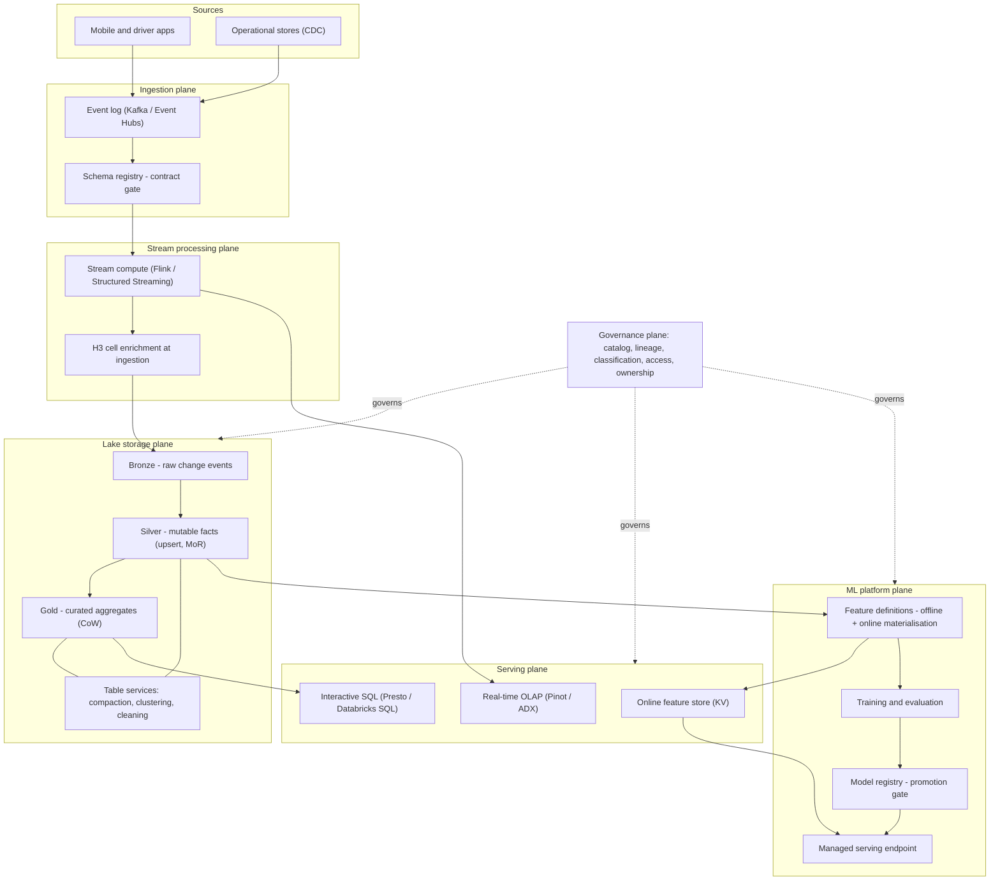
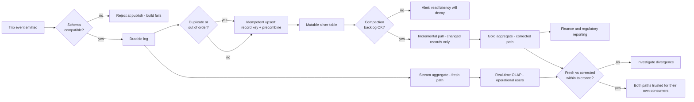
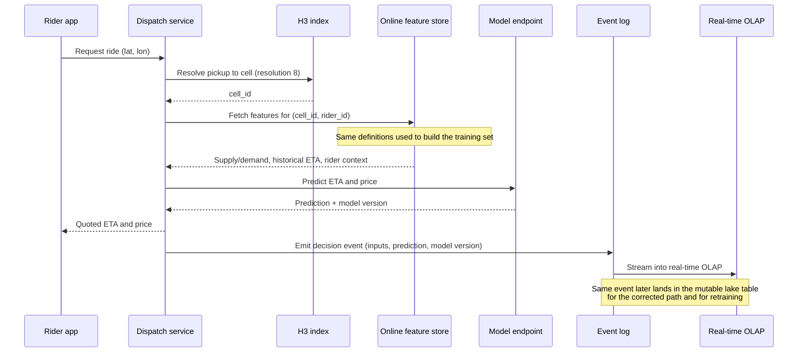

# Uber Data Infrastructure Case Study

> Part of the **Enterprise Data & AI Architecture Handbook** — Resources / CaseStudies, Chapter 02.
> A senior-level case study of Uber's big-data platform, the origins of Apache Hudi, the Michelangelo ML platform, Uber's real-time and geospatial systems, and which of those lessons transfer to an Azure-first enterprise.

---

## Executive Summary

Uber's data infrastructure is worth studying because Uber hit three constraints earlier and harder than almost anyone else, and its responses to those constraints became industry-standard building blocks.

The first constraint was **mutability at analytical scale**. Uber's business is not append-only. A trip record changes after it is first written: fares are adjusted, ratings arrive later, disputes are resolved, driver payouts are corrected, and privacy requests require physical deletion of specific rows. A classic Hadoop/Hive data lake handles this badly — the only cheap operation is "append", and correcting one row means rewriting a partition. Uber's answer was **Apache Hudi**: record-level upserts, deletes, and incremental pulls on top of files in a distributed store. That is the direct ancestor of the open table format layer covered in [Apache Hudi](../../Phase-04/06_Apache_Hudi.md), [Delta Lake](../../Phase-04/04_Delta_Lake.md), and [Apache Iceberg](../../Phase-04/05_Apache_Iceberg.md).

The second constraint was **machine learning as an operational dependency, not a research activity**. Uber's core product decisions — ETA, pricing, dispatch, fraud, and safety — are model outputs on the critical path of a physical-world transaction. Uber's answer was **Michelangelo**, an end-to-end ML platform with a shared feature store (Palette), managed training, a model registry, and managed serving. Michelangelo is one of the earliest production examples of the lifecycle described in [Machine Learning Foundations](../../Phase-11/01_Machine_Learning_Foundations.md), [Feature Stores with Feast](../../Phase-11/02_Feature_Stores_with_Feast.md), [MLOps and MLflow](../../Phase-11/03_MLOps_and_MLflow.md), and [ML Pipeline Architecture](../../Phase-11/06_ML_Pipeline_Architecture.md).

The third constraint was **freshness with physical consequences**. Surge pricing, driver positioning, ETA, and marketplace balancing are worthless if they are an hour stale, because the world has physically moved. Uber's answer was a real-time stack of Kafka, Flink, and Pinot — the architecture described in [Streaming Fundamentals](../../Phase-07/01_Streaming_Fundamentals.md), [Apache Kafka](../../Phase-07/02_Apache_Kafka.md), [Apache Flink](../../Phase-07/04_Apache_Flink.md), and [Real-Time Analytics with ClickHouse and Druid](../../Phase-07/07_Real_Time_Analytics_ClickHouse_and_Druid.md) — plus **H3**, a hexagonal geospatial index that made "space" a first-class join key.

The transferable lesson is not the stack. It is the **shape of the problem**: Uber's architecture is the consequence of a mutable, real-time, spatially-indexed, ML-driven marketplace running on hardware Uber owned. An Azure-first enterprise with a fraction of that volume should reuse the *principles* — mutable table formats, a shared feature store, an explicit freshness tier, a spatial index as a join key — while rejecting the *implementation*, which was shaped by on-premises Hadoop economics and a platform organisation of a size most enterprises will never staff.

---

## Learning Objectives

After working through this case study you should be able to:

- explain the specific business and physical constraints that made Uber's architecture look the way it does, and identify which of those constraints your own organisation actually shares;
- describe why Apache Hudi was created, what "upsert on a data lake" means mechanically, and how Copy-on-Write and Merge-on-Read trade write amplification against read amplification;
- explain the incremental-pull model and why it is a materially cheaper pipeline primitive than repeated full-partition recomputation;
- describe Michelangelo's end-to-end architecture and articulate why a shared feature store is a structural — not conventional — fix for training/serving skew;
- explain the Kafka → Flink → Pinot real-time pattern, and when a real-time OLAP store is genuinely required versus when a batch table plus a cache is sufficient;
- explain H3's hierarchical hexagonal indexing, why hexagons are used, and how spatial indexing converts an expensive geometric join into a cheap key join;
- translate each Uber component into a defensible Azure-first equivalent, and state where the translation is exact and where it is only approximate;
- write an ADR that states what to reuse from Uber, what to explicitly refuse to copy, and the conditions under which that decision should be revisited.

---

## Business Motivation

Uber's platform requirements come from the marketplace itself, not from a technology preference.

- **Two-sided real-time marketplace.** Supply (drivers, couriers) and demand (riders, eaters) must be matched continuously in physical space. A matching decision made on stale state is not merely suboptimal — it is wrong, because the vehicles have moved.
- **Physical-world settlement.** A trip is a financial event with a long correction tail: fare adjustments, tolls, tips, refunds, driver incentives, and disputes arrive after the trip row was first written. Analytics that assume immutability will silently disagree with finance.
- **ML on the critical path.** ETA, pricing, dispatch, fraud detection, and safety systems are model-driven. Model quality is directly a revenue and safety property, and model *latency* is a user-experience property.
- **Global, multi-city, heterogeneous operations.** Each city is a semi-independent marketplace with its own regulation, supply curve, and pricing behaviour, but the platform must be one platform.
- **Regulatory and privacy obligation.** Deletion requests, data residency, and driver/rider PII made "we cannot delete a row from the lake" an unacceptable answer.
- **Cost of scale.** At hundreds of petabytes on owned hardware, storage and compute efficiency is not a hygiene item; it is a line on the P&L large enough to justify dedicated engineering.

Each of these produced a specific architectural response, and the responses are the substance of this case study.

---

## History and Evolution

Uber's own engineering publications describe the platform as a sequence of generations rather than a single design.

- **Pre-2014 — relational beginnings.** Early Uber ran analytics on a small number of relational databases. This worked until data volume and the number of internal consumers made it impossible.
- **~2014-2015 — first Hadoop-era platform ("Gen 1/Gen 2").** Uber built a Hadoop data lake with Vertica and later Hive/Spark/Presto for analytics, ingesting from operational stores. The dominant complaint quickly became **latency and mutability**: ingestion ran in large batches, and updating existing records meant rewriting large partitions.
- **2016 — Hudi is created internally.** "Hadoop Upserts, Deletes and Incrementals" was built to give the lake record-level upsert semantics, a commit timeline, and an incremental read API. Uber's public account of this generation ("Uber's Big Data Platform: 100+ Petabytes with Minute Latency", 2018) frames the goal explicitly as moving from hours of data latency to minutes.
- **2016-2018 — the ecosystem around it.** Uber open-sourced a cluster of supporting infrastructure: **uReplicator** (cross-cluster Kafka replication), **Chaperone** (Kafka end-to-end auditing / message-loss detection), **Marmaray** (a generic ingestion-and-dispersal framework), **AthenaX** (SQL-based streaming on Flink), and **Cadence** (durable workflow orchestration, later forked into Temporal).
- **2017 — Michelangelo is published.** Uber described its end-to-end ML platform publicly, including the Palette feature store, managed training, model registry and managed serving. Follow-on work (for example PyML) added support for less constrained Python model development while keeping platform-managed deployment.
- **2017-2018 — Hudi and H3 go open source.** Hudi entered the Apache Incubator in 2019 and became a top-level Apache project in 2020. H3 was open-sourced in 2018 and became a widely adopted geospatial indexing library well beyond Uber.
- **~2018-2021 — real-time analytics consolidation.** Uber standardised on Kafka for transport, Flink for stream processing, and Apache Pinot for low-latency real-time OLAP serving; the SIGMOD 2021 paper "Real-time Data Infrastructure at Uber" is the authoritative published description of that architecture and its trade-offs.
- **2021 onward — efficiency and cloud.** Uber published substantial work on file-format and storage cost efficiency (compression and encoding choices at petabyte scale), and in 2023 announced multi-year partnerships to move workloads from its own data centres onto public cloud.

The arc is important: Uber did not start with this architecture. Each component is a scar from a specific failure of the previous generation.

---

## Why This Technology Exists

Each Uber-originated component exists to remove one specific constraint. Naming the constraint is the only way to judge whether you share it.

- **Hudi exists** because a data lake built on immutable files cannot cheaply express "this row changed" or "delete this person". Without record-level upserts, the only correct implementations are full-partition rewrite (expensive) or an append-plus-dedup convention re-implemented, differently and incorrectly, by every team.
- **Incremental pull exists** because recomputing a downstream table from scratch every hour is quadratic waste when only a tiny fraction of records changed. A commit timeline turns "what changed since I last ran?" into a cheap, exact question.
- **Michelangelo exists** because Uber had hundreds of models owned by many teams, and every team was independently solving feature computation, training orchestration, deployment, and monitoring — badly and inconsistently. The platform exists to make the governed path the easy path.
- **Palette (the feature store) exists** because the same feature was being computed twice: once in a batch training pipeline and once in an online serving service. Two independently maintained computation paths *will* diverge; that divergence is training/serving skew, and the structural fix is one definition serving both paths, exactly as described in [Feature Stores with Feast](../../Phase-11/02_Feature_Stores_with_Feast.md).
- **Pinot in the serving path exists** because the query pattern — highly concurrent, low-latency, filtered aggregations over recent events, exposed to operational users and even to external partners — is not what a data-warehouse query engine is built for.
- **H3 exists** because geospatial queries expressed as polygon intersection are expensive and hard to aggregate consistently, while queries expressed as "join on cell ID" are cheap, uniformly bucketed, and hierarchically aggregatable.

The recurring theme: at Uber's scale, the expensive thing stopped being raw storage or raw compute and became **the semantics of change** — how the platform represents mutation, freshness, and location.

---

## Problems It Solves

- **Late-arriving and corrected records.** Upserts on the lake mean a fare correction or a late rating updates one record, not a partition.
- **Right-to-erasure on a data lake.** Record-level delete plus compaction gives a defensible physical-deletion story, rather than "we filtered it out of the view".
- **Data freshness without abandoning the lake.** Minute-level latency into queryable tables, instead of an hours-long batch cadence.
- **Downstream pipeline cost.** Incremental pull removes repeated full recomputation of derived tables.
- **Training/serving skew.** A shared feature definition with paired offline and online stores eliminates the dual-implementation failure mode by construction.
- **ML delivery bottleneck.** A managed path from feature to training to registry to endpoint means model teams do not each build a bespoke MLOps stack.
- **Operational analytics at high concurrency.** A real-time OLAP store serves dashboards and in-product analytics that a batch warehouse would answer far too slowly.
- **Spatial aggregation consistency.** A single hierarchical cell system gives every team the same spatial buckets, so supply, demand, pricing, and ETA analyses are actually comparable.

---

## Problems It Cannot Solve

Being explicit about the limits is more valuable than the capability list.

- **It does not give you Uber's organisation.** This architecture assumes a dedicated platform organisation continuously operating Kafka, Flink, Pinot, Hudi compaction, and an ML platform. Adopting the components without the staffing produces an under-operated version of each.
- **A table format does not make your data correct.** Upsert semantics require a well-chosen record key and precombine field. A wrong key silently produces duplicates or lost updates; the format will not warn you.
- **A feature store does not fix a bad feature.** It guarantees the same computation offline and online. It does not detect target leakage or a feature that is unavailable at inference time — see [Machine Learning Foundations](../../Phase-11/01_Machine_Learning_Foundations.md).
- **Streaming does not fix a stale business process.** Sub-minute data delivered into a decision loop that runs weekly is expensive theatre.
- **Real-time OLAP is not a general-purpose warehouse.** Pinot-class stores are excellent at bounded, pre-modelled, high-concurrency queries and poor at large ad-hoc joins.
- **H3 does not remove geometric reasoning.** Cells approximate shapes. Routing, precise geofence boundaries, and legal boundary questions still require real geometry.
- **Nothing here addresses the hardest part**, which is ownership: who owns a table, who is accountable when a feature drifts, who is paged when compaction falls behind.

---

## Core Concepts

### 2.1 The mutable data lake: upserts, deletes, and the commit timeline

The core Hudi idea is that a table is not a directory of files; it is a **timeline of commits over a keyed dataset**. Three primitives matter:

- **Record key** — the identity of a row (for example `trip_uuid`). Upsert is defined relative to this key.
- **Precombine (ordering) field** — when two versions of the same key arrive, the one with the higher ordering value wins. This is what makes ingestion idempotent and out-of-order tolerant.
- **Timeline** — an ordered log of commits, compactions, cleans, and rollbacks that defines the table's state at any instant.

Two table types express the central trade-off, and this is the single most examinable Hudi concept:

| Table type | Write behaviour | Read behaviour | Best for |
|---|---|---|---|
| **Copy-on-Write (CoW)** | Rewrites the affected columnar file on every update — **high write amplification** | Reads pure columnar files — **fast, no merge cost** | Read-heavy tables, moderate update rates, analytics consumers |
| **Merge-on-Read (MoR)** | Appends updates to row-based delta logs, compacts asynchronously — **low write latency** | Query-time merge of base + delta files — **higher read cost** until compaction | Write-heavy, high-mutation, freshness-critical tables |

MoR is what makes minute-level freshness affordable on a high-mutation table; CoW is what makes downstream analytics fast. Choosing per table, rather than globally, is the mature pattern. The comparison against Delta Lake and Iceberg is in [Table Format Comparison](../../Phase-04/07_Table_Format_Comparison.md).

### 2.2 Incremental processing as the default pipeline primitive

Because the timeline records what changed in each commit, a consumer can ask for *only the records changed since commit N*. This turns a derived-table pipeline from "recompute the last 7 days every hour" into "apply the delta". Three consequences:

- cost scales with **change volume**, not with **table size**;
- pipelines become naturally incremental and therefore cheaper to run more often, which is what actually buys freshness;
- the pipeline must be **idempotent** — replaying a commit range must produce the same result — which is the same discipline required in [Streaming Patterns and Delivery Semantics](../../Phase-07/08_Streaming_Patterns_and_Delivery_Semantics.md).

Incremental pull is best understood as **change data capture for the lake itself**, complementing source-system CDC as covered in [Change Data Capture](../../Phase-07/06_Change_Data_Capture.md).

### 2.3 The ML platform as a paved road: Michelangelo

Michelangelo's contribution is not any single algorithm; it is the assertion that the *lifecycle* is the product. Its stages map one-to-one onto the reference lifecycle in [ML Pipeline Architecture](../../Phase-11/06_ML_Pipeline_Architecture.md):

1. **Manage data** — shared feature definitions in Palette, materialised to both an offline store (for training) and an online store (for serving).
2. **Train** — managed, reproducible training jobs with logged parameters, metrics, and lineage.
3. **Evaluate** — a comparable, recorded evaluation for every candidate model, which is what makes a promotion gate possible at all ([MLOps and MLflow](../../Phase-11/03_MLOps_and_MLflow.md)).
4. **Deploy** — a registry-mediated promotion into managed serving rather than a bespoke per-team service.
5. **Predict** — online, batch, and near-real-time serving from the same registered artefact ([Model Serving and Ray](../../Phase-11/04_Model_Serving_and_Ray.md)).
6. **Monitor** — prediction and feature monitoring feeding back into retraining.

The critical design decision is that **features are a first-class, shared, versioned asset with two synchronised materialisations**. Everything else follows from that.

### 2.4 Real-time architecture: transport, compute, and serving are three different jobs

Uber's real-time stack separates concerns that are frequently — and wrongly — collapsed into one system:

- **Transport (Kafka).** Durable, replayable, partitioned log. Ordering is per partition, never global; see [Apache Kafka](../../Phase-07/02_Apache_Kafka.md).
- **Stream compute (Flink).** Event-time windowing, watermarks, keyed state, and exactly-once *state* semantics via checkpointing; see [Apache Flink](../../Phase-07/04_Apache_Flink.md). AthenaX's contribution was letting most users express streaming jobs in SQL rather than hand-written operators.
- **Real-time serving (Pinot).** A columnar store that ingests directly from Kafka and answers highly concurrent, low-latency filtered aggregations, including queries exposed to operational users and partners.

The seam that matters: **the same logical metric is often computed twice**, once for the fresh path and once for the corrected historical path, and the two must be reconciled rather than assumed identical. That is the Lambda-architecture tax, and it is a real cost, not a footnote.

### 2.5 Geospatial indexing with H3

H3 tiles the globe with hexagons at 16 resolutions (0 through 15) by projecting an icosahedron onto the sphere. Every cell has a 64-bit ID that encodes its resolution and position, and cells nest hierarchically, so a fine cell's parent at a coarser resolution is a cheap bit operation.

Why hexagons rather than squares:

- **Uniform adjacency.** A hexagon has six neighbours, all sharing an edge and all equidistant from the centre. A square grid has two classes of neighbour (edge and corner) at different distances, which distorts any "spread from here" computation such as supply diffusion or radius search.
- **Better approximation of circles.** Movement and demand fields are roughly radial; hexagons approximate that far better than squares.
- **Consistent aggregation.** Rolling up child cells to a parent is exact and cheap.

The unavoidable caveat, which interviewers like: because you cannot perfectly tile a sphere with hexagons, **H3 contains exactly 12 pentagons**, one at each icosahedron vertex. They are deliberately positioned over ocean, but code that assumes "every cell has six neighbours" is wrong.

Architecturally, H3 converts an expensive geometric predicate into a **cheap equality join on an integer key** — which means spatial data can be partitioned, bucketed, and pre-aggregated with the same techniques as any other dimension.

---

## Internal Working

### 3.1 How an upsert actually executes

A Hudi write proceeds roughly as follows:

1. **Index lookup.** For each incoming record key, the engine determines whether the key already exists and, if so, in which file group. The index is the performance-critical component; a poorly chosen index turns every write into a full-table probe.
2. **Tagging and routing.** Records are tagged as insert or update and routed to file groups.
3. **Write.** Under CoW, the affected base file is rewritten with merged content. Under MoR, updates are appended to a delta log file belonging to the file group.
4. **Commit.** A commit is written to the timeline. Readers see either the whole commit or none of it — this is the atomicity boundary.
5. **Table services.** Compaction merges delta logs into base files, clustering reorganises data for read locality, and cleaning removes obsolete file versions subject to a retention window.

Two consequences that people learn painfully:

- **Table services are not optional.** If compaction falls behind on an MoR table, read latency degrades continuously and silently — the queries still return correct results, just slower and slower. This is a classic gradual-degradation failure mode: no single event marks the break.
- **Retention and erasure interact.** Old file versions retained for time travel may still contain data you were asked to delete. Deletion is only complete after the retention window has passed and cleaning has run — the same lesson as physical deletion in any versioned table format ([Delta Lake](../../Phase-04/04_Delta_Lake.md)).

### 3.2 How the feature store keeps offline and online in sync

The mechanism is one definition, two materialisations:

- A feature is defined once, with its source, transformation, entity key, and freshness expectation.
- The **offline materialisation** writes to a columnar analytical store used for training, with the timestamp preserved so that training joins can be **point-in-time correct** — the training row must see only feature values that were knowable at the label's timestamp.
- The **online materialisation** writes the current value to a low-latency key-value store, keyed by the entity, for retrieval within the serving latency budget.

The subtle failure this prevents is not "two teams wrote different code". It is that even *identical-looking* code diverges over time when maintained separately — one path gets a bug fix, a timezone correction, or a null-handling change, and the other does not. The feature store removes the possibility of divergence rather than relying on discipline to avoid it.

### 3.3 How the real-time path and the batch path reconcile

The fresh path (Kafka → Flink → Pinot) optimises for latency and accepts approximation: some events are late, some are duplicated, and windows close before every straggler arrives. The corrected path (Kafka → lake table → batch aggregation) optimises for completeness.

Reconciliation requires three explicit decisions, and skipping any of them is where teams get hurt:

1. **A stated tolerance.** "Real-time and corrected figures may differ by up to X% for up to Y hours" must be written down, because otherwise every discrepancy becomes an incident.
2. **A designated authoritative source per consumer.** Operational dashboards read the fresh path; finance, regulatory, and executive reporting read the corrected path. Never both for the same number.
3. **A standing reconciliation check** that alerts when divergence exceeds the stated tolerance — otherwise the two paths drift apart silently and the first person to notice is an external stakeholder.

---

## Architecture

The Uber-shaped platform is best read as five planes.

| Plane | Purpose | Uber components | Key property |
|---|---|---|---|
| **Ingestion** | Get operational change into the platform once | Kafka, CDC from operational stores, Marmaray | Idempotent, at-least-once, schema-checked |
| **Stream processing** | Enrich, window, aggregate in motion | Flink (AthenaX for SQL users) | Event-time correctness, keyed state, checkpointing |
| **Lake storage** | Mutable, queryable historical truth | Hudi tables on distributed storage | Record-level upsert/delete, commit timeline |
| **Serving** | Answer the question at the latency the consumer needs | Pinot (real-time OLAP), Presto (interactive), online KV store (features) | Consumption-pattern-specific, not one-size-fits-all |
| **ML platform** | Feature to model to prediction | Michelangelo, Palette | Shared features, registry-mediated promotion |

Cutting across all five: a metadata and governance plane (catalog, schema registry, lineage, ownership, access control) and a spatial convention (H3) used consistently by every plane.

The architectural principle worth stealing: **the serving plane is decomposed by consumption pattern, not by dataset**. The same underlying data is materialised into a real-time OLAP store, an interactive query engine, and an online key-value store because those three consumers have irreconcilable latency, concurrency, and query-shape requirements.

---

## Components

- **Kafka** — durable partitioned transport for every event. At Uber's scale this includes cross-cluster replication (uReplicator) and end-to-end audit for message loss (Chaperone).
- **Flink** — stateful stream processing; AthenaX exposed it as SQL so that streaming was not restricted to the few engineers who could write operator code.
- **Hudi** — the mutable table layer: record keys, precombine, CoW/MoR, timeline, compaction, clustering, cleaning, incremental pull.
- **Marmaray** — a generic ingestion-and-dispersal framework: any source into the lake, lake into any sink, so that each new connector was not a bespoke pipeline.
- **Presto (Trino lineage)** — interactive federated SQL over lake data for analysts.
- **Spark** — large-scale batch transformation and ML data preparation.
- **Pinot** — real-time OLAP for low-latency, high-concurrency operational analytics, including in-product analytics for restaurant and merchant partners.
- **Michelangelo** — the ML platform: training orchestration, model registry, deployment, and serving.
- **Palette** — the feature store: shared feature definitions with paired offline and online materialisations.
- **Cadence** — durable workflow orchestration for long-running, stateful business processes (later forked as Temporal).
- **H3** — hierarchical hexagonal geospatial index used as a shared join and aggregation key.

---

## Metadata

Metadata is the component that quietly determines whether the rest of the platform is usable.

- **Table metadata.** The commit timeline is metadata that is *load-bearing at query time*: it defines snapshot isolation, time travel, and incremental reads. It must be treated with the same operational care as the data ([Apache Hudi](../../Phase-04/06_Apache_Hudi.md)).
- **Schema registry.** Event schemas are contracts. Enforcing compatibility at publish time is the difference between an evolvable stream and a downstream outage; this is the discipline in [Streaming Patterns and Delivery Semantics](../../Phase-07/08_Streaming_Patterns_and_Delivery_Semantics.md).
- **Feature metadata.** Owner, definition, source, freshness expectation, entity key, and — critically — **PII classification**, which must propagate from source data into every derived feature.
- **Model metadata.** Training dataset version, code version, hyperparameters, evaluation results, and the serving endpoints a model version is deployed to. Without dataset version, a model is only partially reproducible.
- **Lineage.** Which raw topic feeds which lake table feeds which feature feeds which model feeds which decision. This chain is what makes impact analysis and incident scoping possible.
- **Spatial metadata.** Which H3 resolution a table is indexed at, since mixing resolutions across datasets silently breaks joins and aggregations.

---

## Storage

- **Columnar base files.** Analytical base files are columnar, giving projection and predicate efficiency ([Columnar Storage Internals](../../Phase-04/02_Columnar_Storage_Internals.md), [File Formats](../../Phase-04/01_File_Formats.md)).
- **Row-oriented delta logs (MoR).** Updates land in append-friendly log files and are merged into base files by compaction. This is the mechanism that decouples write latency from read layout.
- **Partitioning.** Usually time-based, often combined with a spatial or city dimension. Over-partitioning is the classic failure: it produces the small-file problem, which inflates metadata, planning time, and per-file read overhead.
- **File sizing and clustering.** Target file size and clustering by frequently filtered columns are the levers that keep scans efficient as the table ages.
- **Compression and encoding.** At Uber's scale, encoding and codec choices are a genuine engineering programme with material cost impact — dictionary and delta encodings plus a modern codec can move total storage cost by a large fraction ([Compression and Encoding](../../Phase-04/08_Compression_and_Encoding.md)).
- **Object-store realities.** Listing cost, eventual-consistency history, and per-request pricing are why metadata-first table formats replaced directory-scanning table semantics ([Object Storage and Data Lakes](../../Phase-04/03_Object_Storage_and_Data_Lakes.md)).

---

## Compute

Compute in this architecture is deliberately heterogeneous, because the workloads genuinely differ.

- **Streaming compute** is long-running, stateful, and latency-sensitive. Its cost profile is "always on", so right-sizing parallelism and state backend configuration dominates.
- **Batch compute** is bursty and throughput-oriented, and is the natural home for interruptible/spot capacity.
- **Table-service compute** (compaction, clustering, cleaning) is a *third* category that teams routinely forget to budget for. It is not optional work, and if it is starved, read performance decays.
- **Training compute** is bursty and often accelerator-bound.
- **Serving compute** is latency-bound and must be isolated from analytical workloads — sharing a cluster between a batch backfill and an online feature lookup is how a training job takes down a production endpoint.

Uber ran this on its own scheduling and container infrastructure. The generalisable rule is **workload isolation by class**, not the specific scheduler.

---

## Networking

- **Cross-region and cross-cluster replication.** Kafka replication across clusters and regions (uReplicator's purpose) is required both for locality and for resilience. Replication introduces ordering caveats — cross-cluster order is not guaranteed the way per-partition order is.
- **Data locality.** Compute close to storage matters enormously; cross-region reads of analytical data are usually a cost and latency error rather than an architecture choice.
- **Private connectivity.** Analytical and ML services should not traverse public endpoints; private networking plus identity-based access is the baseline expectation for enterprise deployments.
- **Egress economics.** In a cloud deployment, cross-region and cross-cloud egress can dominate the bill for a high-volume streaming platform. This is a first-order design input, not a post-hoc surprise.
- **Edge ingestion.** Mobile clients emit events over unreliable networks, which means duplicates and out-of-order arrival are normal, which is exactly why idempotency and event-time processing are mandatory rather than nice-to-have.

---

## Security

- **PII is pervasive.** Rider and driver identity, precise location traces, and payment-adjacent data are all present. Location history is among the most re-identifiable data an enterprise can hold — coarse aggregation is a privacy control, not just a performance technique.
- **Deletion must be physical.** A defensible erasure story requires record-level delete, followed by expiry of retained file versions and cleaning. "It is filtered out of the view" is not erasure.
- **Classification must propagate.** A PII column that feeds a feature makes that feature PII. If classification stops at the raw table, every derived asset is unclassified by default — this is the most common governance defect in ML platforms.
- **Least privilege across planes.** Streaming, lake, serving, and ML planes each need their own identities and scoped grants; a single over-privileged platform service account undoes every other control.
- **Model and feature access.** The online feature store answers "what do we know about this entity right now", which makes it a high-value target and requires the same access discipline as the source data.
- **Secrets and credentials.** Connectors and streaming jobs are long-running credential holders; managed identity rather than static secrets is the correct default.

---

## Performance

- **Index selection dominates upsert throughput.** The cost of an upsert is dominated by locating existing keys. A key with poor locality forces broad probing.
- **Compaction lag is the hidden read-latency variable** on Merge-on-Read tables. Monitor it as a first-class SLI.
- **Small files are the classic lake performance killer** — too many files inflates planning, metadata, and per-file overhead. Target file sizes and periodic clustering are the fix.
- **Partition pruning and data skipping** deliver the biggest scan reductions; a query that cannot prune reads everything.
- **State size governs streaming performance.** Large keyed state with long windows drives checkpoint duration and recovery time; unbounded state is the most common Flink production failure.
- **Real-time OLAP performance comes from pre-modelling**, not from query optimisation. If a Pinot-class store is asked to do large ad-hoc joins, it will disappoint — that is the wrong tool, not a tuning problem.
- **Spatial joins collapse to key joins** once H3 is applied; choosing the right resolution is the main performance lever, because too fine a resolution explodes cardinality and too coarse a resolution destroys signal.

---

## Scalability

- **Storage scales trivially; metadata does not.** The scaling wall in a large lake is usually metadata and file count, not bytes.
- **Partition count is a scaling dimension.** Kafka partition count sets maximum consumer parallelism and cannot be reduced without disruption.
- **Skew is the real limit.** A hot city, a hot merchant, or a default/null key concentrates load on one partition or task, and horizontal scaling cannot fix it — only re-keying, salting, or skew-aware execution can.
- **Table count scales organisationally, not technically.** Thousands of tables is a governance and discoverability problem before it is a storage problem.
- **The ML platform scales by paved road.** Uber's ability to support hundreds of models came from templating the lifecycle, not from adding platform engineers per model.
- **Multi-tenancy needs quotas.** Without per-team quotas on streaming slots, compaction capacity, and query concurrency, one team's backfill degrades everyone.

---

## Fault Tolerance

- **At-least-once transport plus idempotent consumption.** This is the achievable target; unconditional end-to-end exactly-once is not, and designing as though it were is a recurring source of duplicate-processing bugs ([Streaming Patterns and Delivery Semantics](../../Phase-07/08_Streaming_Patterns_and_Delivery_Semantics.md)).
- **Atomic commits and rollback.** The timeline makes a failed write recoverable: readers never observe a partial commit, and a bad commit can be rolled back.
- **Time travel as an operational tool.** Snapshot reads let you diagnose "what did this table look like when the job ran", which is often the fastest route to root cause.
- **Checkpointing and savepoints** allow a streaming job to recover state after failure and to be upgraded without losing accumulated state.
- **Replay as the recovery mechanism.** Because Kafka retains a replayable log, most stream-processing failures are recoverable by reprocessing rather than by data reconstruction — provided downstream writes are idempotent.
- **Graceful degradation in serving.** If the online feature store is unavailable, a model server must have a defined behaviour — default features, a simpler fallback model, or an explicit failure — decided in advance rather than improvised during an incident.
- **Backfill discipline.** A backfill is a controlled fault-recovery operation and must be rate-limited, since an unthrottled backfill is functionally a self-inflicted denial-of-service on the platform.

---

## Cost Optimization

- **Incremental over full recomputation.** This is the single largest structural saving: pipeline cost tracks change volume rather than table size.
- **Storage tiering and retention.** Raw event retention is usually the largest single storage line; a deliberate tier and retention policy per table, rather than a global default, is where the savings are.
- **Compression and encoding.** Codec and encoding choices at petabyte scale are worth an engineering programme in their own right — Uber published exactly this work.
- **Right-size the freshness requirement.** Sub-minute freshness is dramatically more expensive than 15-minute freshness. Freshness should be purchased where a decision loop actually consumes it.
- **Interruptible compute for batch and training**; never for the low-latency serving path.
- **Budget table services explicitly.** Compaction and clustering compute is real spend; hiding it makes the platform look cheaper than it is and leads to it being starved.
- **Per-tenant cost attribution.** Tagging by team and data product is what turns a platform bill into an accountable one.

**Worked example.** A trip-facts table receives roughly 40 million changed records per day against a 20-billion-row history. A naïve pipeline recomputes the last 7 days of partitions hourly: 24 runs × ~7 days of data scanned, dominated by re-reading unchanged rows. Moving the downstream aggregate to incremental pull means each run processes only the ~1.7 million records changed in that hour. Even allowing generously for compaction overhead of the Merge-on-Read source table, compute for that pipeline typically falls by an order of magnitude, and — the more valuable second-order effect — because each run is now cheap, it becomes affordable to run it every 15 minutes instead of hourly. The freshness improvement is a *consequence* of the cost reduction, not a separate investment.

---

## Monitoring

Monitor the things that fail silently, not just the things that page.

- **Ingestion lag** per topic and per table: how far behind real time is the freshest committed record.
- **Compaction backlog**: number and age of un-compacted delta files per table. This is the leading indicator of read-latency decay.
- **Small-file count and average file size** per partition.
- **Write and upsert throughput**, plus index lookup time.
- **Streaming job health**: checkpoint duration and failure rate, backpressure, state size growth, watermark lag.
- **Serving latency percentiles** — p95/p99, never averages — for both the OLAP store and the online feature store.
- **Feature freshness and null rate**, per feature, per materialisation.
- **Model prediction distribution and input drift**.
- **Reconciliation delta** between the real-time and corrected paths, alerting on breach of the stated tolerance.

---

## Observability

Monitoring tells you a threshold was crossed; observability lets you ask why when the failure is one nobody predicted.

- **End-to-end correlation.** A trace identifier that survives the async hop — from the mobile event, through Kafka, through the Flink job, into the table, into the feature, into the prediction — is what makes cross-plane debugging possible. Correlation breaking at the message-queue boundary is the single most common gap, because each component's own dashboards remain green while the end-to-end picture is lost.
- **Lineage as an incident tool.** When a table is found to be wrong, the immediate question is which features, models, and dashboards consumed it. Without lineage this is archaeology.
- **Data-level observability.** Freshness, volume, schema, distribution, and lineage are the standing signals for a data platform; a row-count that silently halves is a data incident even though every job succeeded.
- **Query-level observability.** Per-tenant query cost and latency attribution is what allows a noisy-neighbour problem to be diagnosed rather than argued about.
- **Prediction logging.** Logging inputs and outputs of production predictions is what makes post-hoc model debugging and drift analysis possible at all — and it must respect the same PII controls as the source data.

---

## Governance

- **Ownership per table, feature, and model.** An asset with no named owner will not be maintained, deprecated, or fixed.
- **Contracts at plane boundaries.** Event schema contracts at ingestion, table schema contracts at the lake, feature contracts at the ML boundary — each enforced in CI rather than by convention ([Streaming Patterns and Delivery Semantics](../../Phase-07/08_Streaming_Patterns_and_Delivery_Semantics.md)).
- **Classification propagation.** PII classification must flow automatically from source through derived tables into features, with a check that fails the build when it does not.
- **Erasure workflow.** A documented, tested path from a deletion request to verified physical removal across every derived copy — including features, training sets, and retained file versions.
- **Retention policy per dataset**, not a single global default, since retention is simultaneously a cost, a privacy, and a reproducibility decision and those three pull in different directions.
- **Model governance.** Registry-mediated promotion, recorded evaluation, and a documented intended use — including explicit out-of-scope uses — as covered in [Responsible AI](../../Phase-11/07_Responsible_AI.md).
- **Fairness and safety review** for models whose decisions affect earnings, access, or safety. For a marketplace this is not a compliance checkbox; it is a direct business and reputational exposure.

---

## Trade-offs

| Decision | Gain | Cost |
|---|---|---|
| Merge-on-Read over Copy-on-Write | Low write latency, high mutation throughput | Read amplification; hard dependency on compaction operations |
| Incremental pull over full recompute | Large cost reduction, enables higher frequency | Requires strict idempotency and careful checkpoint/watermark handling |
| Dedicated real-time OLAP store | Sub-second, high-concurrency operational analytics | Another system to operate; limited ad-hoc join capability; data duplicated |
| Shared feature store | Eliminates training/serving skew structurally | Platform investment; coordination cost; a new dependency in the serving path |
| Fresh path plus corrected path | Both speed and completeness | Two computations of the same metric; permanent reconciliation obligation |
| H3 spatial index | Cheap, consistent spatial joins and roll-ups | Approximation error at cell boundaries; pentagon edge cases; resolution choice is a real design decision |
| Open-source platform components | Control, portability, no vendor pricing exposure | Substantial operational staffing — the cost most enterprises underestimate |

---

## Decision Matrix

Use this to decide which Uber lesson applies to you.

| If your situation is... | Adopt | Do not adopt |
|---|---|---|
| Append-only data, no corrections, no erasure obligation | Standard lake tables; keep it simple | Merge-on-Read complexity you will not use |
| Frequent late corrections, deletion requests, CDC-driven ingestion | Mutable table format with record-level upsert/delete | A bespoke append-and-dedup convention re-invented per team |
| Derived tables recomputed on a schedule over mostly-unchanged data | Incremental processing | Continued full recomputation "because it is simpler" |
| One or two models, one team | Managed training and registry; a lightweight feature pipeline | A full shared feature-store platform |
| Many models across many teams sharing features | A shared feature store with paired offline/online stores | Per-team feature computation, which guarantees skew |
| Dashboards refreshed daily, low concurrency | Batch tables plus a BI cache | A real-time OLAP cluster |
| In-product or partner-facing analytics, high concurrency, sub-second | Real-time OLAP store | Pointing a warehouse at a customer-facing UI |
| Occasional map visualisation | Standard geospatial functions | A full spatial-index programme |
| Repeated spatial aggregation, supply/demand analysis, radius search at scale | H3 as a shared join key with an agreed resolution | Ad-hoc polygon joins computed differently by each team |

---

## Design Patterns

- **Mutable bronze, incremental silver.** Land raw change events into an upsertable table keyed by business identity; drive downstream tables from the change stream rather than by rescanning.
- **Table type per workload.** Merge-on-Read for high-mutation ingestion tables, Copy-on-Write for read-heavy serving tables — chosen per table, with the reason recorded.
- **Idempotent consumer.** Every write path is safe to replay, using a deterministic key and a precombine ordering field. This is what makes at-least-once transport acceptable.
- **One feature definition, two materialisations.** The structural fix for training/serving skew.
- **Point-in-time-correct training joins.** Always join features as of the label's timestamp, never as of now.
- **Consumption-pattern-specific serving.** Materialise into the store that matches the query shape rather than forcing one engine to serve every consumer.
- **Spatial index as a join key.** Compute the cell ID once at ingestion, store it as a column, and join and aggregate on it thereafter.
- **Reconciliation as a standing control.** A scheduled comparison between fresh and corrected paths with an alert on tolerance breach.
- **Platform as paved road.** Templates and defaults that make the governed path the easiest path, with adherence rate measured as a platform KPI.

---

## Anti-patterns

- **Copying the stack without the constraint.** Deploying Kafka, Flink, Pinot, and Hudi for a workload measured in a few events per second — all the operational burden, none of the benefit.
- **Upserting with a non-unique or unstable record key.** Produces silent duplicates or lost updates; the format will not tell you.
- **Treating compaction as optional.** Guarantees slow, silent read-latency decay.
- **Over-partitioning.** Partitioning by a high-cardinality column produces the small-file problem and destroys planning performance.
- **Streaming everything.** Applying a streaming pipeline to data consumed by a daily report is a permanent operational cost for no decision value.
- **Two independently maintained feature implementations.** Skew is not a risk here; it is a certainty over a long enough horizon.
- **A real-time OLAP store used as a general warehouse.** Ad-hoc large joins on a store built for pre-modelled aggregations.
- **Mixing H3 resolutions across datasets** without recording the resolution in metadata — joins silently return nothing or, worse, something wrong.
- **Trusting the fresh path for financial or regulatory figures.** The approximate path must never be authoritative for a number someone will be audited on.
- **Building the platform without funding its operation.** Every component here is a standing operational commitment, not a one-off project.

---

## Common Mistakes

- Choosing Merge-on-Read for everything because it sounds faster, then discovering read latency has doubled because compaction was never resourced.
- Selecting a record key that is unique in the source system but not in the delivered event (for example a key that is only unique per region).
- Forgetting that time-travel retention keeps deleted data physically present, and reporting an erasure as complete before cleaning has run.
- Sizing a streaming job for average load and discovering that peak, which is when it matters, drives 5-10x the throughput.
- Letting Flink state grow unbounded because no retention was set on keyed state, then failing at checkpoint time.
- Building a feature offline for training and separately in the serving service, then spending weeks debugging a model that "works in training".
- Joining features as of *now* rather than as of the label timestamp, leaking future information into training.
- Picking an H3 resolution by intuition rather than by measuring cardinality and signal at each candidate resolution.
- Backfilling at full speed into a shared cluster and degrading production serving.
- Measuring platform success by number of components deployed rather than by adoption of the paved road.

---

## Best Practices

- Record the **record key, precombine field, and table type** for every table as an explicit, reviewed design decision, not a default.
- Treat **compaction, clustering, and cleaning as scheduled, monitored, budgeted workloads** with their own SLIs.
- Make every write path **idempotent by construction**, and test it by deliberately replaying a commit range in a lower environment.
- Enforce **schema compatibility in CI** at the publish boundary, so an incompatible producer change fails the build rather than the consumer.
- Define **freshness SLOs per table** and buy freshness only where a decision consumes it.
- Use **one feature definition with paired materialisations**, and make point-in-time correctness a property of the platform's join API rather than of each user's SQL.
- **Version the training dataset** alongside the code and parameters; without it, reproducibility is partial.
- **Propagate classification automatically** and fail the pipeline when a derived asset inherits PII without a classification.
- **Isolate workload classes** — serving, streaming, batch, and table services — so that one cannot starve another.
- **Measure paved-road adherence** as the primary indicator that the platform is genuinely self-service rather than a new bottleneck.

---

## Enterprise Recommendations

For a large Azure-first enterprise, the defensible reading of Uber's experience is:

1. **Adopt the semantics, not the stack.** You almost certainly need record-level upsert and delete on your lake. You almost certainly do not need to operate Uber's specific component set.
2. **Default to the managed Azure path.** ADLS Gen2 with Azure Databricks and Delta Lake gives you the mutability, time travel, and incremental-read semantics that motivated Hudi, with a fraction of the operational load. Reserve Hudi specifically for the case where its Merge-on-Read write profile or an existing Hudi estate is a genuine requirement.
3. **Build the feature store before the fifth model, not after the fiftieth.** The cost of retrofitting shared features onto an estate of divergent per-team implementations grows superlinearly.
4. **Introduce a real-time OLAP tier only against a named, quantified requirement** — a specific consumer with a specific concurrency and latency need. Otherwise a batch table plus a cache is the correct answer.
5. **Adopt a spatial index if and only if you have repeated spatial aggregation.** If you do, standardise the resolution centrally, because the value comes from every team using the same buckets.
6. **Fund operations explicitly.** Each streaming and table-service component is a standing commitment. A platform business case that omits the run cost is not a business case.
7. **Write down the reconciliation tolerance** between fresh and corrected paths on day one, before anyone builds a dashboard on either.
8. **Treat the ML platform as a product** with paved roads, adherence metrics, and named owners — the actual reason Michelangelo scaled was organisational, not algorithmic.

---

## Azure Implementation

The Azure-first translation of each Uber capability:

| Uber capability | Azure default | Notes |
|---|---|---|
| Kafka transport | **Azure Event Hubs** (Kafka-protocol compatible) or Kafka on AKS | Event Hubs removes broker operations; keep Kafka-on-AKS only where a specific Kafka feature is required ([Azure Event Hubs and Stream Analytics](../../Phase-07/03_Azure_Event_Hubs_and_Stream_Analytics.md)) |
| Flink stream processing | **Azure Databricks Structured Streaming**, or Flink on AKS/HDInsight where Flink-specific semantics are required | Structured Streaming is the lower-operations default ([Spark Structured Streaming](../../Phase-07/05_Spark_Structured_Streaming.md)) |
| Hudi mutable tables | **Delta Lake on ADLS Gen2 via Azure Databricks** | `MERGE INTO`, `DELETE`, change data feed, and time travel cover the same semantics ([Delta Lake](../../Phase-04/04_Delta_Lake.md)) |
| Incremental pull | **Delta change data feed** consumed by Structured Streaming | Same primitive: read only what changed since a version |
| Pinot real-time OLAP | **Azure Data Explorer (ADX)** | Direct Event Hubs ingestion, sub-second filtered aggregations at high concurrency ([Real-Time Analytics with ClickHouse and Druid](../../Phase-07/07_Real_Time_Analytics_ClickHouse_and_Druid.md)) |
| Presto interactive SQL | **Databricks SQL** | Serves the analyst query pattern over lake tables |
| Palette feature store | **Databricks Feature Store** (catalog-native) or **Feast** for cross-platform neutrality | The offline/online pairing is the point ([Feature Stores with Feast](../../Phase-11/02_Feature_Stores_with_Feast.md)) |
| Online feature serving | **Azure Cosmos DB** or **Azure Cache for Redis** | Latency-budget-driven choice |
| Michelangelo lifecycle | **MLflow on Databricks** plus **Azure Machine Learning** endpoints | Registry-mediated promotion with a shared evaluation gate ([MLOps and MLflow](../../Phase-11/03_MLOps_and_MLflow.md), [Azure Machine Learning](../../Phase-11/05_Azure_Machine_Learning.md)) |
| Model serving | **Databricks Model Serving** or **Azure ML managed online endpoints** | Isolate from analytical compute ([Model Serving and Ray](../../Phase-11/04_Model_Serving_and_Ray.md)) |
| H3 spatial index | **H3 library in Spark/Databricks**, native H3 functions where available | The index is a library, not a service — fully portable |
| Cadence workflows | **Azure Durable Functions** or Temporal on AKS | For long-running stateful business workflows |

A minimal, representative implementation of the mutable-table and incremental-consumption core:

```sql
-- Silver trip facts: idempotent upsert from a change stream.
-- The record key is the trip identity; the precombine field decides
-- which version wins when two updates for the same trip arrive together.
MERGE INTO silver.trip_facts AS t
USING (
  SELECT
    trip_uuid,
    city_id,
    h3_cell_r8,
    fare_amount,
    trip_status,
    updated_at,
    ROW_NUMBER() OVER (PARTITION BY trip_uuid ORDER BY updated_at DESC) AS rn
  FROM bronze.trip_changes
  WHERE ingest_date = current_date()
) AS s
ON t.trip_uuid = s.trip_uuid AND s.rn = 1
WHEN MATCHED AND s.updated_at > t.updated_at THEN UPDATE SET *
WHEN NOT MATCHED THEN INSERT *;
```

```python
# Incremental consumption: process only what changed since the last run,
# rather than rescanning the last N days of partitions.
changes = (
    spark.readStream
    .format("delta")
    .option("readChangeFeed", "true")
    .option("startingVersion", last_processed_version)
    .table("silver.trip_facts")
)

(
    changes
    .filter("_change_type in ('insert', 'update_postimage')")
    .writeStream
    .option("checkpointLocation", "abfss://checkpoints@lake.dfs.core.windows.net/city_demand")
    .trigger(availableNow=True)          # incremental batch, not always-on
    .foreachBatch(upsert_city_demand)    # idempotent sink write
    .start()
)
```

```python
# Spatial indexing at ingestion: compute the H3 cell once and store it
# so that every downstream spatial aggregation is a cheap key join.
from pyspark.sql import functions as F

RESOLUTION = 8  # recorded in table metadata; must be consistent across datasets

trips_indexed = trips.withColumn(
    "h3_cell_r8",
    F.expr(f"h3_longlatash3(pickup_lon, pickup_lat, {RESOLUTION})"),
)

demand_by_cell = (
    trips_indexed
    .groupBy("h3_cell_r8", F.window("requested_at", "5 minutes"))
    .agg(F.count("*").alias("requests"))
)
```

Operational guardrails that belong in the same deployment:

- `OPTIMIZE` and `VACUUM` scheduled per table with retention set deliberately, and monitored for backlog.
- Table properties enforcing target file size, with small-file count alerted on.
- Private endpoints for storage, Event Hubs, and ML endpoints; managed identity rather than keys or SAS.
- Purview registration as a precondition for a table being discoverable, with classification propagation checked in CI.
- Separate compute pools for serving, streaming, batch, and table services.

---

## Open Source Implementation

For an organisation that wants Uber's portability characteristics and is prepared to fund the operations:

- **Transport:** Apache Kafka, with cross-cluster replication (MirrorMaker 2 or equivalent) and end-to-end audit for message loss.
- **Stream compute:** Apache Flink, with SQL as the primary interface for most users — AthenaX's real lesson is that a streaming platform only reaches broad adoption when most users do not have to write operator code.
- **Table layer:** Apache Hudi, with per-table CoW/MoR selection, explicit index configuration, and table services (compaction, clustering, cleaning) scheduled and monitored as first-class jobs. [Apache Hudi](../../Phase-04/06_Apache_Hudi.md) and [Table Format Comparison](../../Phase-04/07_Table_Format_Comparison.md) cover when Hudi is the right choice over Delta or Iceberg — in short, its distinctive strength is high-mutation, upsert-heavy ingestion with tunable write/read amplification.
- **Batch compute:** Apache Spark.
- **Interactive SQL:** Trino (Presto lineage).
- **Real-time OLAP:** Apache Pinot, or Druid/ClickHouse depending on query shape and operational preference.
- **Orchestration:** Apache Airflow for pipelines; Temporal (Cadence's lineage) for long-running stateful business workflows.
- **Feature store:** Feast, backed by an offline columnar store and an online key-value store.
- **ML lifecycle:** MLflow for tracking and registry, Ray for distributed training and serving.
- **Spatial:** H3, which is a library and therefore the single most portable component in the entire stack.
- **Platform substrate:** Kubernetes, with per-workload-class node pools and quotas.
- **Observability:** Prometheus, Grafana, and OpenTelemetry, with correlation propagated across async boundaries.

The honest assessment: this stack is genuinely more portable and avoids managed-service pricing, and it requires a standing platform team. That trade — control and portability against operational headcount — is the actual decision, and it should be made explicitly rather than by default.

---

## AWS Equivalent (comparison only)

| Capability | Azure | AWS equivalent | Comment |
|---|---|---|---|
| Event transport | Event Hubs | Amazon MSK, Kinesis Data Streams | MSK is Kafka-compatible; Kinesis has a different partition/shard model |
| Stream processing | Databricks Structured Streaming | Managed Service for Apache Flink | AWS's managed Flink is the closest match to Uber's actual runtime |
| Lake storage | ADLS Gen2 | Amazon S3 | Equivalent for this purpose |
| Mutable tables | Delta Lake on Databricks | Hudi/Iceberg on EMR or Glue; Hudi is natively supported | AWS has the strongest first-party Hudi support of the three clouds |
| Interactive SQL | Databricks SQL | Athena, Redshift Spectrum | Comparable analyst experience |
| Real-time OLAP | Azure Data Explorer | OpenSearch, or self-managed Pinot/Druid | No exact first-party Pinot equivalent |
| Feature store | Databricks Feature Store / Feast | SageMaker Feature Store | Direct equivalent |
| ML lifecycle | Azure ML / MLflow | SageMaker | Direct equivalent |

**Advantages of AWS for this specific workload:** native, mature Hudi integration in EMR and Glue, and a managed Flink service — the closest commercial approximation of Uber's own runtime.
**Disadvantages:** no first-party real-time OLAP store in the Pinot class, so that tier is self-managed.
**Migration strategy:** the portable assets are the table format, the H3 index, the Spark and Flink job code, and the MLflow-format models. The non-portable assets are the managed-service configuration, IAM/identity model, and networking. Migrate by re-pointing storage and re-creating the control plane, not by rewriting the transformations.
**Selection criteria:** choose AWS if you have an existing Hudi estate and want first-party support for it; otherwise the decision should be made on your enterprise's overall cloud posture, not on this workload.

---

## GCP Equivalent (comparison only)

| Capability | Azure | GCP equivalent | Comment |
|---|---|---|---|
| Event transport | Event Hubs | Pub/Sub (or Managed Kafka) | Pub/Sub has different ordering semantics from Kafka — ordering keys rather than partitions |
| Stream processing | Databricks Structured Streaming | Dataflow (Apache Beam) | Beam's model is portable but is a genuinely different programming model |
| Lake storage | ADLS Gen2 | Cloud Storage | Equivalent |
| Mutable tables | Delta Lake | Iceberg/Hudi on Dataproc; BigQuery for warehouse-native mutation | BigQuery's native `MERGE` is a strong warehouse-side answer but is not a lake table format |
| Interactive SQL | Databricks SQL | BigQuery | BigQuery is the standout capability in this comparison |
| Real-time OLAP | Azure Data Explorer | BigQuery with streaming inserts, or self-managed Pinot/Druid | No first-party Pinot-class store |
| Feature store | Databricks Feature Store / Feast | Vertex AI Feature Store | Direct equivalent |
| ML lifecycle | Azure ML / MLflow | Vertex AI | Direct equivalent |

**Advantages of GCP:** BigQuery is exceptionally strong for the analytical query tier and can absorb workloads that would otherwise require a separate engine; Vertex AI is a coherent ML platform.
**Disadvantages:** Pub/Sub's semantics differ enough from Kafka that a Kafka-oriented design does not port unchanged; no first-party real-time OLAP store in the Pinot class.
**Migration strategy:** the same portability rule applies — table format, H3, and model artefacts port cleanly; transport semantics and stream-processing code do not, and Beam versus Structured Streaming is a genuine rewrite rather than a configuration change.
**Selection criteria:** GCP is attractive when the analytical tier dominates and BigQuery can subsume several other components; it is less attractive when Kafka semantics are load-bearing in the existing design.

---

## Migration Considerations

Moving toward this architecture — or away from a copy of it:

- **Sequence: mutability first.** Introducing an upsertable table format is the highest-value, lowest-risk first step, because it removes the partition-rewrite tax without changing any consumer's query.
- **Choose the format deliberately.** Hudi, Delta, and Iceberg all provide upsert and time travel; they differ in write profile, ecosystem support, and managed-service integration. Decide with [Table Format Comparison](../../Phase-04/07_Table_Format_Comparison.md), and record the decision and its invalidation condition.
- **Migrate pipelines to incremental after, not before, the format change.** Incremental pull depends on the commit timeline existing.
- **Do not lift Flink jobs into a different streaming engine casually.** Windowing, watermark, and state semantics differ, and a "port" that ignores this produces subtly wrong aggregates.
- **Feature store migration is a re-registration exercise**, and it is the right moment to audit which features are actually used — in most estates a large fraction are not.
- **Backfill is the dominant cost and risk** of any migration here. Rate-limit it, run it on isolated compute, and validate with row-level reconciliation against the source, not just row counts.
- **Run in parallel and reconcile before cutting over.** Dual-run with an explicit tolerance and a reconciliation report; cut over only when the report is clean for a sustained period.
- **Retire deliberately.** The old pipeline stays running long after it should unless a retirement date and an owner are recorded at cutover time.

---

## Mermaid Architecture Diagrams

**Diagram 1 — Reference architecture, five planes.**



**Diagram 2 — End-to-end flow with the enforcement and reconciliation gates.**



**Diagram 3 — Sequence: a real-time marketplace decision using features and spatial index.**



---

## End-to-End Data Flow

Following one trip through the platform:

1. **Emission.** The rider app emits a request event; the driver app emits location updates. Networks are unreliable, so duplicates and out-of-order arrival are expected.
2. **Publish with contract check.** Events are published to the durable log against a registered schema. An incompatible producer change fails at publish time, not at consumption time.
3. **Stream enrichment.** A stream job attaches the H3 cell at the agreed resolution, joins reference data, and computes windowed supply/demand aggregates on event time with watermarks for late arrivals.
4. **Fresh serving.** Windowed aggregates flow into the real-time OLAP store, where operational users and in-product surfaces query them at sub-second latency and high concurrency.
5. **Landing in the lake.** The same events land in a bronze table. A silver `trip_facts` table is upserted with `trip_uuid` as the record key and `updated_at` as the precombine field, so a later fare correction updates one record.
6. **Table services.** Compaction merges delta logs into base files; clustering improves locality on the columns most filtered; cleaning expires obsolete file versions subject to the retention window, which is also what makes deletion physically complete.
7. **Incremental derivation.** Gold aggregates consume only records changed since the last processed version. Cost tracks change volume, which is what makes a 15-minute cadence affordable.
8. **Feature materialisation.** Shared feature definitions materialise from silver into the offline store (timestamped, for point-in-time-correct training joins) and into the online store (current value, for serving).
9. **Training and promotion.** A training run reads point-in-time-correct features, logs parameters, metrics, and the dataset version, and registers a candidate. The candidate passes the same evaluation gate regardless of whether the run was triggered manually or by automated retraining.
10. **Serving.** The promoted model version serves predictions using online features. Inputs, outputs, and model version are logged for drift analysis and debugging.
11. **Feedback.** Realised outcomes — actual trip duration versus predicted ETA — flow back as labels, closing the loop.
12. **Reconciliation.** A scheduled job compares fresh-path and corrected-path figures against the stated tolerance and alerts on breach.

---

## Real-world Business Use Cases

- **ETA prediction.** A model consuming live traffic, historical cell-level travel times, and supply state; wrong ETAs directly damage conversion and trust.
- **Dynamic pricing / marketplace balancing.** Cell-level supply and demand computed in near real time, driving incentives to move supply where it is needed.
- **Dispatch and matching.** Choosing which driver to offer a trip to, based on live position, predicted arrival, and acceptance likelihood.
- **Fraud detection.** Streaming detection of collusive or anomalous trip patterns, where the decision must be made before payment settles.
- **Delivery logistics.** Courier batching and route sequencing, where prediction error compounds across a multi-stop route.
- **Merchant- and partner-facing analytics.** In-product dashboards for restaurants and fleet partners — a high-concurrency, low-latency, externally exposed workload that a batch warehouse cannot serve.
- **Financial reconciliation.** Trip-level revenue, driver payout, and adjustment history, where completeness and auditability outrank freshness and the corrected path is the only acceptable source.
- **Safety analytics.** Incident detection and investigation, with strict access control and retention requirements.

---

## Industry Examples

- **Uber** — the originator of Hudi and H3, and the publisher of the reference real-time architecture and the Michelangelo platform description.
- **Other ride-hailing and delivery marketplaces** face structurally identical problems — real-time spatial matching with a mutable transactional tail — and have converged on similar architectures independently.
- **Logistics and freight** operators use the same pattern for load matching, ETA, and network optimisation, with a longer physical time constant but the same mutability characteristics.
- **Retail and quick commerce** apply the demand-cell pattern to store catchments and micro-fulfilment.
- **Financial services** adopted Hudi-class table formats primarily for a different reason — regulatory correction and erasure on a data lake — which is a useful reminder that the same primitive can be justified by completely different requirements.
- **Telecommunications** uses cell-based spatial aggregation for network planning, effectively the same indexing pattern for a different physical asset.

Comparing these is instructive: the ones that succeeded adopted the *primitive* that matched their constraint. The ones that struggled adopted the *stack* because a well-known company used it.

---

## Case Studies

**Case Study 1 — The upsert that silently duplicated.**

A logistics company adopted a mutable table format to handle shipment status corrections. They configured the record key as `shipment_id`, which was unique in the primary operational database. What they missed was that the ingestion pipeline also consumed a secondary regional system where `shipment_id` was only unique *within a region*. For the small overlap of ID ranges between the two systems, upserts silently overwrote each other: some shipments took on another shipment's status, and the affected row count was far too small to move any aggregate metric.

Every job succeeded. Every dashboard looked plausible. The problem surfaced four months later when a customer disputed a delivery record and the investigation found a status that belonged to a different shipment. The remediation required reprocessing from raw events with a corrected composite key (`region_code || shipment_id`), and a customer-facing correction.

The blameless diagnosis found the root cause was not the engineer who chose the key — it was that **the platform provided no mechanism to validate a record key's uniqueness assumption**. The durable fix was a mandatory key-uniqueness assertion, run at ingestion against the incoming batch and alerting on any key collision that arrives from more than one source system, plus a required design-review field recording the key's uniqueness scope and the evidence for it. This is the same shape as every "confident wrong answer" failure in this handbook: the system was working exactly as configured, and the configuration encoded an unverified assumption.

**Case Study 2 — Streaming infrastructure for a daily report.**

A mid-sized enterprise, ~120 engineers total, read Uber's real-time architecture material and built a faithful reproduction: a Kafka cluster, a Flink deployment, a real-time OLAP store, and a Merge-on-Read lake table. The workload it served peaked at roughly 60 events per second, and the sole downstream consumer was an operations dashboard reviewed each morning.

The system worked, and it consumed most of a four-person platform team's capacity: Kafka rebalances, Flink checkpoint tuning, OLAP cluster upgrades, and compaction backlog. Meanwhile the actual data-quality problems the business complained about — inconsistent customer definitions across three source systems — went unaddressed for over a year because there was no capacity left.

A review reframed the decision by asking what the *consumer* required: a dashboard read once daily needs hourly freshness at most. The replacement was Event Hubs for ingestion, a scheduled incremental Databricks job, a Copy-on-Write-equivalent table, and a BI cache. Operational load fell to a fraction of the prior level, infrastructure cost fell substantially, and the platform team redeployed onto the customer-definition problem — which delivered more business value in one quarter than the streaming platform had in six.

The lesson is not that Uber's architecture is wrong. It is that Uber's architecture is an *answer to Uber's constraints*, and adopting an answer without the constraint imports all of the cost and none of the benefit. This is the same right-sizing failure that appears throughout this handbook, here at the level of an entire platform.

### Architecture Decision Record (ADR-0215): Adopt Uber's Data-Platform Principles on Managed Azure Services, Not Uber's Stack

**Status:** Accepted

**Context.**
Our marketplace platform has a genuinely mutable analytical dataset: transaction records receive corrections for up to 90 days, we are subject to erasure requests, and our source systems deliver change events rather than immutable facts. We have 18 models across 6 teams, with at least 4 features independently implemented in both training and serving code — we have already had one production incident traced to divergence between those implementations. We have one operational analytics consumer with a genuine sub-second, high-concurrency requirement (a partner-facing dashboard), and repeated spatial aggregation across teams that is currently done with ad-hoc polygon joins producing inconsistent buckets.

We do not have Uber's volume (our peak is roughly 3,000 events per second), and we have a platform team of 5, not 500. Several engineers have proposed reproducing Uber's published stack directly.

**Decision.**
We will adopt the following Uber-originated **principles**, implemented on managed Azure services:

1. **Mutable lake tables.** All silver-layer fact tables use a table format with record-level upsert and delete, implemented as Delta Lake on ADLS Gen2 via Azure Databricks. Every such table must record, in a reviewed design document, its **record key, the uniqueness scope of that key and the evidence for it, its precombine field, and its retention window**. A key-uniqueness assertion runs at ingestion and alerts on cross-source collisions.
2. **Incremental by default.** Derived tables consume change data feed rather than rescanning partitions. Any pipeline that performs full recomputation requires a recorded justification.
3. **Table services are funded workloads.** Compaction, clustering, and cleaning are scheduled, monitored jobs with compaction backlog as a named SLI and an alert threshold. Their compute cost is shown in the platform budget, not hidden.
4. **One feature definition, two materialisations.** All shared features move to Databricks Feature Store with paired offline and online stores. Point-in-time-correct joins are provided by the platform API. Duplicate per-team feature implementations are prohibited for shared features and must be retired on a recorded schedule.
5. **Registry-mediated model promotion** through a single evaluation gate that applies identically to manually triggered and automatically retrained candidates. Training dataset version is logged alongside code version.
6. **Freshness purchased per named consumer.** A real-time OLAP tier (Azure Data Explorer) is provisioned **only** for the partner-facing dashboard, against its documented concurrency and latency requirement. All other consumers use scheduled incremental tables. Adding a workload to the real-time tier requires a documented consumer requirement.
7. **A single spatial convention.** H3 at resolution 8 for demand and supply aggregation, computed once at ingestion and stored as a column. The resolution is recorded in table metadata, and mixing resolutions across joined datasets is blocked by a CI check.
8. **A written reconciliation tolerance** between the fresh path and the corrected path, with a scheduled reconciliation job and an alert on breach. Financial and regulatory figures read the corrected path only; this is enforced by access control, not by convention.
9. **We explicitly refuse** to self-operate Kafka, Flink, Pinot, or Hudi at our current scale and staffing. This refusal is revisited if — and only if — one of the invalidation conditions below is met.

**Consequences.**

*Positive.* Corrections and erasure become a single-record operation. Pipeline cost tracks change volume. The class of incident we already suffered (training/serving divergence) is structurally eliminated rather than mitigated by discipline. Spatial analyses become comparable across teams. Platform team capacity is preserved for data-quality work rather than consumed by broker and cluster operations.

*Negative.* We accept managed-service pricing and a degree of platform coupling in exchange for operational leverage. Delta Lake's write profile differs from Hudi's Merge-on-Read and is a worse fit for extremely high-mutation ingestion — if we reach that regime, this decision must be reopened. The feature-store migration is real work and will slow model delivery for approximately one quarter. The real-time tier is a second copy of some data with a permanent reconciliation obligation.

*Neutral.* H3 is a library and imposes no platform lock-in; it ports unchanged to any engine.

**Alternatives considered.**

- *Reproduce Uber's stack (Kafka + Flink + Hudi + Pinot, self-operated).* Rejected: our published-scale gap is roughly three orders of magnitude, and our platform team is 5 people. Case Study 2 in this chapter is precisely this failure mode. Estimated standing operational cost exceeds the entire platform team's capacity.
- *Change nothing; continue append-and-dedup conventions.* Rejected: it does not give a defensible erasure story, and the per-team dedup conventions already differ, which is a latent correctness problem.
- *Adopt Hudi specifically, on managed Azure compute.* Rejected for now, but this is the closest alternative and the most likely future revision. Hudi's Merge-on-Read profile is genuinely superior for high-mutation ingestion; our current mutation rate does not justify the additional integration and operational surface.
- *Put everything on the real-time tier for consistency.* Rejected: it multiplies cost and adds a reconciliation obligation for consumers who do not need freshness.

**Invalidation conditions.** Reopen this ADR if any of the following becomes true: (a) sustained ingestion exceeds 50,000 events per second; (b) the mutation rate on any silver table exceeds 30% of rows per day, where Merge-on-Read's write profile becomes materially advantageous; (c) more than three consumers present documented sub-second, high-concurrency requirements; (d) a cross-engine neutrality requirement emerges that Delta Lake cannot satisfy; or (e) the platform team grows past 15 engineers with an explicit mandate to operate open-source infrastructure.

---

## Hands-on Labs

**Lab 1 — Build a mutable fact table.**
Create a Delta table with a `trip_uuid` record key. Ingest an initial batch, then a second batch containing corrections and one deletion. Verify with time travel that the pre-correction state is still readable, then set retention, run `VACUUM`, and verify the deleted record is physically gone. Deliverable: a notebook and a short note on what "deleted" meant at each stage.

**Lab 2 — Prove idempotency.**
Take the merge from Lab 1 and deliberately replay the same batch three times, including a batch with two versions of the same key in one file. Confirm the row count and the winning version are unchanged. Then break it: remove the precombine condition and observe the wrong version winning. Deliverable: before/after row counts and an explanation of the mechanism.

**Lab 3 — Incremental versus full recomputation.**
Build the same gold aggregate twice: once by rescanning 7 days of partitions, once via change data feed. Measure runtime, data scanned, and cost for both at three different change ratios (1%, 10%, 50% of rows changed). Deliverable: a chart showing where the two curves cross, and the change ratio at which incremental stops being worth the complexity.

**Lab 4 — Compaction backlog and read latency.**
On a high-mutation table, disable optimisation for a period while writing continuously. Measure query latency hourly. Re-enable and measure recovery. Deliverable: a latency-over-time chart and a proposed alert threshold with the reasoning for that number.

**Lab 5 — Feature store and skew.**
Register a feature in Databricks Feature Store with offline and online materialisations. Train a model with a point-in-time-correct join, serve it, and confirm training and serving values match for the same entity. Then deliberately introduce a divergent transformation in a separate serving path and quantify the resulting prediction difference. Deliverable: the measured prediction delta caused by the skew.

**Lab 6 — Spatial indexing.**
Index a public trip or point dataset at H3 resolutions 6, 7, 8, and 9. For each: measure distinct cell count, aggregate query runtime, and the variance of your target metric within cells. Deliverable: a recommended resolution with quantitative justification, plus a note on where the pentagons are and whether your data touches them.

**Lab 7 — Fresh versus corrected reconciliation.**
Compute a metric on both a streaming path and a batch path over the same source. Introduce late-arriving events. Measure the divergence over time and write the tolerance statement you would actually publish, plus the alert query that enforces it.

---

## Exercises

1. Explain, in terms a non-specialist finance stakeholder would accept, why deleting a row from a data lake was historically hard, and what a table format changed.
2. Given a table with 500 million rows and 2 million daily updates spread evenly across partitions, argue for Copy-on-Write or Merge-on-Read. Now change the update distribution to 90% concentrated in the last day and redo the argument.
3. Your ingestion pipeline sometimes delivers the same event twice and sometimes out of order. Specify exactly which configuration makes the write correct, and prove why.
4. A team reports that a query which took 3 seconds last month now takes 40 seconds, with no code change and only 5% data growth. List your diagnostic order and the most likely cause.
5. Describe a training/serving skew bug that a feature store would *not* catch, and what control would.
6. You are asked to add a fourth consumer to the real-time OLAP tier. Write the questions you would require answered first.
7. Choose an H3 resolution for (a) city-level supply/demand balancing and (b) precise pickup-point recommendation. Justify each with a cardinality estimate.
8. Your fresh-path revenue figure differs from the corrected-path figure by 2.3%. Walk through your diagnosis, and state under what conditions this is expected rather than an incident.
9. Argue both sides of "we should self-host Kafka and Flink" for a 10-person platform team, then state which side you would take and the single fact that would change your mind.
10. Write the invalidation conditions for a decision to *not* adopt a real-time OLAP store.

---

## Mini Projects

**Project A — Mutable marketplace lakehouse.**
Build bronze/silver/gold layers over a synthetic trip dataset with a realistic correction tail (5% of trips corrected within 7 days, 0.5% within 90 days). Implement idempotent upserts, incremental gold derivation, scheduled table services with backlog monitoring, and an erasure workflow that you verify physically. Deliver a runbook and an SLI dashboard.

**Project B — Feature store and model lifecycle.**
Implement a shared feature set with paired offline/online materialisation, train an ETA-style regression model with point-in-time-correct joins, register it, gate promotion on a recorded evaluation, and serve it behind an endpoint. Add feature-freshness and prediction-drift monitoring. Deliver evidence that training and serving values agree for a sampled set of entities.

**Project C — Real-time marketplace analytics.**
Stream synthetic demand events into a real-time OLAP store with H3 cell enrichment, and build a sub-second cell-level supply/demand view. In parallel, compute the corrected version from the lake. Publish a reconciliation report with an explicit tolerance and an alert.

**Project D — The right-sizing review.**
Take Project C and write the counter-proposal: the simplest architecture that satisfies a stated consumer requirement of "refreshed every 30 minutes". Quantify the cost and operational-load difference. Deliver a one-page recommendation that a CTO could act on, including which requirement would flip the decision.

---

## Capstone Integration

This case study connects the three phases it depends on into one working system.

From [Phase-04](../../Phase-04/06_Apache_Hudi.md), the table format is the layer that made a data lake behave like a database: record-level mutation, snapshot isolation, time travel, and a commit timeline that turns "what changed?" into a cheap question. Uber is the origin story for why that layer had to exist, and [Table Format Comparison](../../Phase-04/07_Table_Format_Comparison.md) is where the choice among Hudi, Delta, and Iceberg is actually made.

From [Phase-07](../../Phase-07/01_Streaming_Fundamentals.md), the streaming layer supplies freshness — and the delivery-semantics discipline from [Streaming Patterns and Delivery Semantics](../../Phase-07/08_Streaming_Patterns_and_Delivery_Semantics.md) is what makes the mutable table layer correct under replay. The two phases are not independent: **at-least-once transport is only safe because the table layer supports idempotent upserts**, and idempotent upserts are only useful at speed because the transport is replayable.

From [Phase-11](../../Phase-11/06_ML_Pipeline_Architecture.md), the ML platform is the consumer that makes both of the above load-bearing. A feature store needs point-in-time-correct history (Phase-04's time travel) and fresh online values (Phase-07's streaming). A model-serving endpoint's latency budget is what forces the online/offline split in the first place.

The unifying judgement that this case study adds to the handbook: **Uber's architecture is the correct answer to Uber's constraints, and the engineering skill being tested is the ability to identify which of those constraints you actually share.** The two case studies above are the same lesson from opposite directions — one team encoded an unverified assumption into a configuration and got confident wrong answers; another team encoded an unverified assumption about *scale* into an entire platform and got confident wrong architecture. In both cases the system worked exactly as built. Neither failure was a technology failure.

---

## Interview Questions

1. What problem was Apache Hudi created to solve, and why was that problem hard on a classic Hive-style data lake?
2. Explain Copy-on-Write versus Merge-on-Read. When would you choose each?
3. What are the record key and the precombine field, and what goes wrong if either is chosen badly?
4. What is incremental pull, and why is it cheaper than recomputing a partition?
5. Why does a feature store need both an offline and an online store?
6. What is training/serving skew, and why is a feature store a structural rather than a procedural fix for it?
7. What is point-in-time correctness in a training join, and what bug does it prevent?
8. Why does Uber use hexagons rather than squares for spatial indexing?
9. What does Kafka guarantee about ordering, and what does it not?
10. When is a real-time OLAP store the right tool, and when is it the wrong one?

---

## Staff Engineer Questions

1. A Merge-on-Read table's query latency has been climbing for six weeks with no code change. Give your diagnostic sequence and the one metric you would have alerted on to catch it earlier.
2. You inherit a lake where three teams have each built their own append-and-dedup convention. Design the migration to a single mutable table format, including how you validate correctness during the transition.
3. Design an idempotent ingestion path from an at-least-once source into a mutable table, and identify every place a duplicate could survive.
4. A model performs well offline and poorly in production. Enumerate the possible causes in order of likelihood, and the specific check that discriminates each.
5. How would you detect that a record key's uniqueness assumption is being violated, without knowing in advance which key is wrong?
6. Design the reconciliation control between a streaming aggregate and a batch aggregate, including what tolerance you would publish and how you would derive that number.
7. Your Flink job's checkpoints have grown from 20 seconds to 4 minutes over three months. What is happening and what are your options?
8. Choose an H3 resolution for a new use case, and show the calculation and the measurements you would use to defend it.
9. A backfill degraded production serving. Give both the immediate mitigation and the structural fix.
10. Argue for and against adopting Hudi specifically, rather than Delta or Iceberg, in an Azure-first enterprise.

---

## Architect Questions

1. Your organisation runs at 1/1000th of Uber's volume. Which of Uber's architectural decisions still apply, and how do you defend each to an engineering team that wants to copy the whole stack?
2. Design the freshness tiering for a platform with 40 consumers. How do you decide which consumers get sub-minute data, and how do you prevent that tier from growing by default?
3. What is the total cost of ownership of a self-operated Kafka + Flink + Pinot + Hudi stack for a 200-engineer organisation, including headcount, and what would justify it over managed services?
4. How do you enforce that PII classification propagates from source tables into derived features and training sets, and how do you *prove* it to an auditor?
5. Design the erasure workflow across a lakehouse, a feature store, an online key-value store, retained file versions, and previously trained models. Where is it hardest, and what do you tell legal about that part?
6. You must support both a real-time path and a corrected path. Write the governance rule that determines which consumers may use which, and how you enforce it technically rather than by policy document.
7. A team wants to adopt a spatial index. What organisational decisions must be made centrally for it to deliver value, and what happens if they are not?
8. How do you structure platform ownership so that table services, streaming jobs, and feature pipelines all have accountable owners without creating a central bottleneck?
9. Evaluate the migration risk of moving this architecture from one cloud to another. What is genuinely portable, what is not, and how do you price the difference?
10. Design the paved road for a new data product on this platform, and state the single metric you would use to judge whether the paved road is working.

---

## CTO Review Questions

1. What business capability does this platform enable that we cannot deliver today, and what is that capability worth annually?
2. What is the fully loaded run cost — infrastructure plus headcount — and how does it compare to the managed-service alternative over three years?
3. Which of these components creates a standing operational commitment, and do we have the team to honour it in eighteen months, not just at launch?
4. What is our exposure if we cannot demonstrate physical deletion of personal data on request, and does this architecture close that gap or merely appear to?
5. Which decisions in this architecture are one-way doors, and what would it cost to reverse each?
6. How would we know within a quarter that this investment is not working, and what is the pre-agreed action if that happens?
7. Models are on the critical path of our product. What is our governance over model promotion, and who is personally accountable when a model causes harm?
8. Are we buying freshness that any decision loop in this business actually consumes, or are we buying it because it sounds modern?
9. What is our concentration risk on this platform team, and what happens if the three people who understand the streaming layer leave?
10. If a competitor published their entire architecture tomorrow, what would we responsibly do with it — and what does our answer to that question say about how we handled Uber's?

---

## References

- Uber Engineering, *Uber's Big Data Platform: 100+ Petabytes with Minute Latency* (2018) — the primary account of the generational evolution and the motivation for Hudi.
- Uber Engineering, *Meet Michelangelo: Uber's Machine Learning Platform* (2017) — the end-to-end ML platform description, including the Palette feature store.
- Uber Engineering, *H3: Uber's Hexagonal Hierarchical Spatial Index* (2018) — the geospatial index and the rationale for hexagons.
- *Real-time Data Infrastructure at Uber*, SIGMOD 2021 — the authoritative published description of the Kafka/Flink/Pinot architecture and its trade-offs.
- Apache Hudi project documentation — table types, record keys, indexes, timeline, and table services.
- Apache Flink documentation — event time, watermarks, keyed state, and checkpointing.
- Apache Pinot documentation — real-time ingestion and low-latency OLAP serving.
- H3 project documentation — resolutions, cell hierarchy, and the pentagon caveat.
- Uber Engineering publications on open-sourced infrastructure: uReplicator, Chaperone, Marmaray, AthenaX, and Cadence.
- Uber Engineering publications on file-format and storage cost efficiency at petabyte scale.

---

## Further Reading

Within this handbook, the chapters this case study builds on directly:

- [File Formats](../../Phase-04/01_File_Formats.md) and [Columnar Storage Internals](../../Phase-04/02_Columnar_Storage_Internals.md) — why analytical base files are columnar.
- [Object Storage and Data Lakes](../../Phase-04/03_Object_Storage_and_Data_Lakes.md) — the substrate whose limitations produced metadata-first table formats.
- [Delta Lake](../../Phase-04/04_Delta_Lake.md), [Apache Iceberg](../../Phase-04/05_Apache_Iceberg.md), [Apache Hudi](../../Phase-04/06_Apache_Hudi.md) — the three table formats compared in [Table Format Comparison](../../Phase-04/07_Table_Format_Comparison.md).
- [Compression and Encoding](../../Phase-04/08_Compression_and_Encoding.md) — the lever behind Uber's published storage-efficiency work.
- [Streaming Fundamentals](../../Phase-07/01_Streaming_Fundamentals.md) and [Apache Kafka](../../Phase-07/02_Apache_Kafka.md) — transport semantics.
- [Azure Event Hubs and Stream Analytics](../../Phase-07/03_Azure_Event_Hubs_and_Stream_Analytics.md) and [Spark Structured Streaming](../../Phase-07/05_Spark_Structured_Streaming.md) — the managed Azure path.
- [Apache Flink](../../Phase-07/04_Apache_Flink.md) — event-time processing and state.
- [Change Data Capture](../../Phase-07/06_Change_Data_Capture.md) — how change arrives from source systems.
- [Real-Time Analytics with ClickHouse and Druid](../../Phase-07/07_Real_Time_Analytics_ClickHouse_and_Druid.md) — the Pinot-class serving tier.
- [Streaming Patterns and Delivery Semantics](../../Phase-07/08_Streaming_Patterns_and_Delivery_Semantics.md) — why idempotency is mandatory.
- [Machine Learning Foundations](../../Phase-11/01_Machine_Learning_Foundations.md) and [Feature Stores with Feast](../../Phase-11/02_Feature_Stores_with_Feast.md) — the skew problem and its structural fix.
- [MLOps and MLflow](../../Phase-11/03_MLOps_and_MLflow.md), [Model Serving and Ray](../../Phase-11/04_Model_Serving_and_Ray.md), [Azure Machine Learning](../../Phase-11/05_Azure_Machine_Learning.md) — the lifecycle Michelangelo pioneered.
- [ML Pipeline Architecture](../../Phase-11/06_ML_Pipeline_Architecture.md) and [Responsible AI](../../Phase-11/07_Responsible_AI.md) — the assembled pipeline and its governance obligations.
