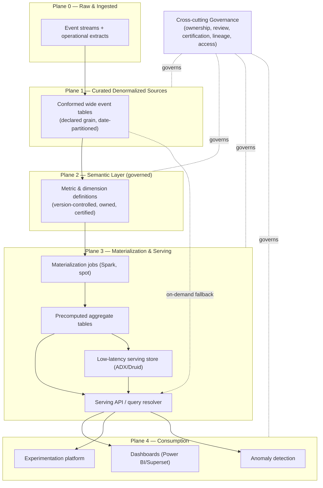
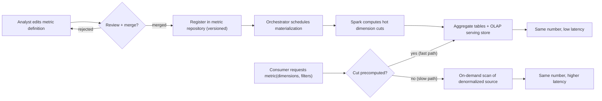
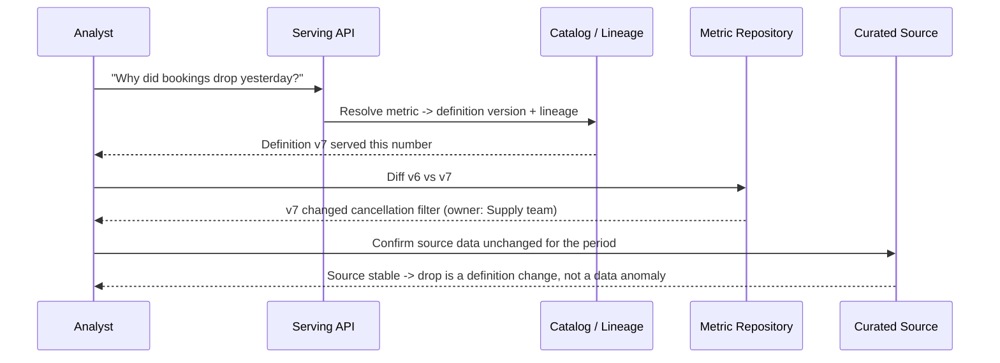

# Airbnb Minerva Case Study

> Part of the **Enterprise Data & AI Architecture Handbook** — Resources / CaseStudies, Chapter 03.
> A senior-level case study of Airbnb's metrics platform, **Minerva**: the metric-consistency problem it was built to solve, its architecture as a centralized semantic layer, how it governs metric definitions, how it drove adoption across the company, and which of those lessons transfer to an Azure-first enterprise.

---

## Executive Summary

Airbnb's Minerva is worth studying because it is the most complete public account of what happens when a data-driven company takes metric consistency seriously enough to build a dedicated platform for it, rather than treating it as a documentation or discipline problem.

The problem Minerva solves is deceptively mundane and universally expensive: **the same business metric computed two different ways produces two different numbers, and nobody can say which is correct.** At Airbnb around 2018, "bookings", "nights booked", "active listings", and "revenue" each had multiple competing definitions scattered across hundreds of Hive/Spark pipelines, dashboards, and ad-hoc queries. Two analysts answering the same executive question would derive different totals because they filtered cancellations differently, attributed a booking to a different date, or joined a slightly different listings table. The cost was not the arithmetic — it was the meetings spent reconciling the numbers, the erosion of trust in data, and the decisions delayed or made on the wrong figure. This is the exact failure mode that a governed **semantic layer** exists to prevent, as described in [The Semantic Layer and Metrics](../../Phase-06/06_Semantic_Layer_and_Metrics.md).

Minerva's answer was to make the **metric definition itself the governed artifact**. Instead of every dashboard re-deriving "net booked nights" from raw event tables, a metric is defined **once**, in a version-controlled configuration, as a named measure over a named dimension set anchored to a curated denormalized event source. Minerva then **materializes** the aggregates and serves them to every consumer — dashboards, experimentation, anomaly detection, and executive reporting — from that single definition. The dimensional grammar underneath it (facts, dimensions, measures, grain) is exactly the vocabulary of [Dimensional Modeling](../../Phase-06/01_Dimensional_Modeling.md); Minerva's contribution is to lift that grammar out of hand-written SQL and into a declarative, centrally-owned, machine-checked layer.

The transferable lesson is not Minerva's specific technology (Airbnb-internal, built on Hive, Spark, Airflow, Druid, and a bespke configuration system). It is the **shape of the discipline**: a metric is a *contract*, not a query; that contract has *one owner and one definition*; the definition is *decoupled from every physical query that consumes it*; and the aggregates are *precomputed and cached* so that consistency and performance are delivered together rather than traded against each other. An Azure-first enterprise with a fraction of Airbnb's analyst headcount should reuse the *principles* — a single metric repository, a curated source-of-truth denormalized layer, precomputed dimensional aggregates, and a governance process around definition changes — while rejecting the *implementation*, which was shaped by a large in-house data-platform organization and a pre-cloud Hadoop estate that most enterprises should not and cannot reproduce.

---

## Learning Objectives

After working through this case study you should be able to:

- explain the metric-consistency problem precisely — why the *same* business question yields *different* numbers — and locate its four recurring root causes (definition drift, source drift, filter/attribution drift, and grain drift);
- describe Minerva's layered architecture (curated denormalized event sources → declarative metric/dimension definitions → materialized aggregates → a serving API) and explain why decoupling the definition from the physical query is the load-bearing design choice;
- explain what a **semantic layer** is, how it differs from a BI tool's per-report calculated fields, and why centralizing it is a structural fix rather than a conventional one, connecting it to [The Semantic Layer and Metrics](../../Phase-06/06_Semantic_Layer_and_Metrics.md);
- articulate why Minerva **precomputes** aggregates instead of always querying raw data, and how that decision trades storage and pipeline complexity for query latency and guaranteed consistency;
- describe the governance model — metric ownership, definition review, certification tiers, and change management — and explain why governance is what makes the platform trustworthy, not the compute;
- explain how a metrics platform is *adopted* (the migration from thousands of bespoke queries to a single definition) and why adoption, not construction, is the hard part;
- translate each Minerva concept into a defensible Azure-first equivalent (a lakehouse curated layer, dbt/semantic-model metric definitions, precomputed gold tables and cubes, and a governed catalog), and state where the translation is exact and where it is only approximate;
- write an ADR that states what to reuse from Minerva, what to explicitly refuse to copy, and the conditions under which a dedicated metrics platform is justified versus over-engineering.

---

## Business Motivation

Minerva's requirements come from Airbnb's operating model, not from a technology preference.

- **Data-driven decision culture at scale.** Airbnb ran the company on metrics: growth, host supply, guest demand, pricing, trust and safety, and the outcomes of thousands of experiments. When metrics are the substrate of every decision, *disagreement about the metric is disagreement about reality*, and it paralyses decision-making.
- **Explosive growth in analysts and consumers.** The number of people writing queries, building dashboards, and running experiments grew far faster than any central team could coordinate by convention. Tribal knowledge ("everyone knows to exclude host-cancelled bookings") does not survive that growth; it fragments.
- **A booking is a mutable, long-tailed event.** A reservation is created, then possibly altered, cancelled, refunded, or disputed. "How many bookings did we have on Tuesday?" depends on *which* booking state you count and *which date* you attribute it to (booking date vs. check-in date vs. checkout date). Different reasonable people make different reasonable choices, and the numbers diverge.
- **Experimentation as a core competency.** Airbnb's experimentation platform needed metrics that were *defined identically* for the control and treatment arms and *identical* to the metrics leadership saw on dashboards. If the experiment's "conversion" differs from the executive dashboard's "conversion", the experiment's conclusions are not trusted.
- **The cost of reconciliation is real and recurring.** Every divergence triggers an investigation: two analysts, a data scientist, and often a manager spend hours tracing two query lineages to find the one filter that differs. That labour is pure waste, and it scales linearly with the number of metrics and consumers.
- **Trust is the actual asset.** The strategic goal was never "faster queries". It was that *when a number appears in front of a decision-maker, it is the number, and everyone knows it.* Trust in data is a company-level capability, and it was eroding.

Each of these produced a specific architectural response, and the responses are the substance of this case study.

---

## History and Evolution

Airbnb's own engineering writing describes the metrics problem as one that grew until it demanded a platform rather than a policy.

- **Pre-2016 — the fragmentation era.** Analytics ran on a Hadoop/Hive data warehouse with Spark and Presto for querying. Metrics lived wherever they were computed: inside dashboard queries, inside notebook cells, inside downstream ETL. There was no single place where "revenue" was *defined*; there were only hundreds of places where it was *computed*.
- **The "core data" and certification response.** Airbnb first attacked the problem with data-quality and trust initiatives — a "Data Quality Initiative", certified datasets, and the internal **Dataportal** discovery tool (open-sourced ideas that influenced the wider data-catalog movement). Certification told you a *table* was trustworthy, but it did not stop two trustworthy tables from encoding two different definitions of the same metric.
- **~2018-2019 — Minerva is conceived.** The insight that crystallised Minerva was that the unit of governance had to move up a level: from the *table* to the *metric definition*. Airbnb published the "How Airbnb Standardized Metric Computation at Scale" account (the Minerva announcement) describing a single system that owns metric and dimension definitions and computes them consistently.
- **Minerva 1.0 — configuration-driven materialization.** The first generation was built around declarative configuration: analysts defined *data sources*, *dimensions*, and *measures*, and Minerva's backend (Airflow-orchestrated Spark jobs writing to Hive, with Druid and later a dedicated serving layer for low-latency access) materialized the cross-products that consumers needed. The dominant early complaint was **combinatorial explosion**: precomputing every dimension cut of every metric produced an unmanageable number of aggregate tables.
- **Minerva 2.0 — denormalization and on-demand computation.** The second generation rearchitected around **curated denormalized event sources** and a smarter materialization strategy: precompute the common, expensive cuts, and compute the rare cuts on demand from the denormalized source. This is the version most publicly described, and it is the one whose *principles* transfer cleanly.
- **Integration with the consumption surface.** Minerva became the backend for Airbnb's dashboards (Superset-derived internal tooling), the experimentation platform, anomaly detection, and data exploration — so that *one definition* fed *every* surface. This integration, not the compute engine, is what made Minerva change the company's behaviour.
- **Influence on the industry.** Minerva, alongside Google's practices and later products like the metrics/semantic layers in dbt, LookML, Cube, and the short-lived Transform/MetricFlow lineage, helped establish the **metrics layer** (a.k.a. **headless BI** / **semantic layer**) as a recognised architectural component — the subject of [The Semantic Layer and Metrics](../../Phase-06/06_Semantic_Layer_and_Metrics.md).

The arc is important: Airbnb did not start with a metrics platform. Minerva is a scar from a specific, repeated, expensive failure — two numbers, no arbiter — that documentation and discipline could not heal.

---

## Why This Technology Exists

Each part of Minerva exists to remove one specific cause of metric divergence. Naming the cause is the only way to judge whether you share it.

- **The central metric definition exists** because the same metric was defined differently in hundreds of places. Without a single definition, "consistency" is an aspiration enforced by human memory, and human memory does not scale past a few dozen metrics and a handful of analysts.
- **The curated denormalized event source exists** because divergence often came not from the metric formula but from the *inputs* — two analysts joined slightly different listing or booking tables, or applied the join at a different point in time. A single, curated, wide event table removes the "which source did you use?" degree of freedom, applying the dimensional discipline of [Dimensional Modeling](../../Phase-06/01_Dimensional_Modeling.md) to produce one authoritative fact source.
- **Precomputed aggregates exist** because a governed definition that is slow to query will be bypassed. If asking Minerva for "net booked nights by market by week" takes 90 seconds, analysts will write their own faster query — and re-introduce divergence. Materialization makes the *governed* path also the *fast* path, so there is no incentive to defect.
- **The dimension registry exists** because a metric is only comparable if its *slicing attributes* are also standardized. "Revenue by region" is meaningless if two teams define "region" differently. Dimensions are first-class governed objects for the same reason measures are, echoing the conformed-dimension principle of [Dimensional Modeling](../../Phase-06/01_Dimensional_Modeling.md).
- **The serving API exists** because consumers should ask for a *metric by dimensions*, not write SQL against physical tables. The API is the enforcement boundary: if the only way to get "bookings" is to ask Minerva, then there is only one "bookings". A BI tool that lets users write arbitrary calculated fields re-opens every door the definition closed.
- **The governance and certification layer exists** because a definition is only trustworthy if someone *owns* it, changes to it are *reviewed*, and consumers can see its *certification status*. Ownership converts a metric from an orphaned query into an accountable contract.

The recurring theme: at Airbnb's scale, the expensive thing was never computing an aggregate — Spark did that fine. The expensive thing was **agreeing on what the aggregate meant**, and keeping that agreement stable as the company grew. Minerva industrialises that agreement.

---

## Problems It Solves

A metrics/semantic-layer platform in the Minerva mould solves a specific, bounded set of problems:

- **Metric inconsistency across consumers.** The headline problem: dashboards, experiments, reports, and ad-hoc analysis all read the same metric from the same definition, so they agree by construction.
- **Definition drift over time.** When a metric's definition legitimately changes (e.g., a policy change alters what counts as a "completed booking"), the change is made *once*, versioned, reviewed, and propagated to every consumer — rather than updated in some queries and missed in others.
- **Source drift.** By anchoring every metric to a curated denormalized source, the platform eliminates the "which table did you join?" class of divergence.
- **Slow governed queries.** Precomputation delivers sub-second reads for the common cuts, removing the performance incentive to bypass the governed path.
- **Discoverability of trusted metrics.** A metric registry lets an analyst find "the" definition of a metric, see who owns it, and see whether it is certified — instead of copying a colleague's query of unknown provenance.
- **Experiment/reporting alignment.** The same metric feeds the experimentation platform and the executive dashboard, so an experiment's lift is expressed in the exact metric leadership tracks.
- **Auditability and lineage of metrics.** Because a metric is a declared object with a source and a formula, its lineage is machine-readable — you can answer "what feeds this number and who changed it?"

---

## Problems It Cannot Solve

A metrics platform is not a universal remedy, and pretending otherwise is how it becomes shelfware.

- **It cannot make a bad definition correct.** If the *agreed* definition of "active listing" is wrong for a given decision, Minerva will consistently serve the wrong number. Consistency is not correctness; it only guarantees everyone is wrong the same way.
- **It cannot resolve genuine definitional disagreement.** When two teams *legitimately* need "revenue" to mean different things (gross vs. net, recognised vs. booked), the platform can host both as distinct named metrics, but it cannot decide which one a given decision should use. That is a human governance question.
- **It cannot fix upstream data quality.** If the curated source has missing or wrong events, every metric derived from it inherits the defect. A metrics layer sits *above* data quality; it does not replace [Data Warehouse Architecture](../../Phase-06/07_Data_Warehouse_Architecture.md)-level ingestion and validation discipline.
- **It cannot serve truly arbitrary, unbounded exploration cheaply.** Precomputation covers anticipated cuts. A novel high-cardinality slice that was never materialized falls back to querying the denormalized source, which can be slow. The platform optimises the *common* case, not every case.
- **It cannot eliminate the need for modelling skill.** Someone still has to design the curated event source, choose the grain, and model the dimensions correctly — the [Dimensional Modeling](../../Phase-06/01_Dimensional_Modeling.md) work does not disappear; it is centralized.
- **It cannot substitute for adoption.** A perfect definition nobody uses changes nothing. If consumers keep writing raw queries, divergence persists regardless of how good the platform is. Adoption is an organizational problem the technology only enables.

The honest framing: Minerva makes it *possible* and *convenient* for an organization to have one definition of each metric. It does not make the organization *want* that, nor does it make the definitions *good*.

---

## Core Concepts

The Minerva model rests on a small number of concepts that recur throughout the rest of this chapter. The subsection numbering below matches this chapter (Chapter 03).

### 3.1 The metric as a governed contract, not a query

The foundational shift is that a **metric** is a named, owned, versioned *definition* — a measure (an aggregation such as `SUM(booking_value)`), applied to a curated source, sliceable by a declared set of dimensions, with an explicit grain and an explicit filter/state policy. It is not a SQL string in a dashboard. Every consumer references the *metric name*; no consumer re-derives the formula. This is the same conceptual move that [The Semantic Layer and Metrics](../../Phase-06/06_Semantic_Layer_and_Metrics.md) makes: separate *what a metric means* from *how any given tool queries it*.

### 3.2 The curated denormalized event source

Under every metric is a **curated, denormalized event table** at a well-defined grain (e.g., one row per booking-state-change, or one row per booking at its terminal state, enriched with the listing, host, guest, market, and pricing attributes needed for slicing). Denormalization is deliberate: it removes join-time degrees of freedom (the "source drift" cause) and makes aggregation cheap. The trade is storage and pipeline cost for consistency and speed, and it is the physical embodiment of a conformed fact table from [Dimensional Modeling](../../Phase-06/01_Dimensional_Modeling.md).

### 3.3 Dimensions as first-class conformed objects

A **dimension** ("market", "listing type", "guest segment", "device") is defined once and reused across every metric. Because dimensions are conformed, "bookings by market" and "revenue by market" use the *same* market definition and are therefore comparable and joinable. This is the conformed-dimension bus-matrix idea made operational.

### 3.4 Materialization: precompute the expensive, common cuts

Minerva **materializes** aggregates — it precomputes metric values across the common dimension combinations and stores them as physical aggregate tables (and, for low-latency serving, in an OLAP store). Rare or novel cuts are computed on demand from the denormalized source. This hybrid is the resolution to the v1.0 combinatorial-explosion problem: you do not precompute *every* cut, only the ones worth precomputing, echoing the aggregate-navigation ideas in [OLAP and Cube Modeling](../../Phase-06/04_OLAP_and_Cube_Modeling.md).

### 3.5 The serving API as the single entry point

Consumers request `metric(dimensions, filters, time_range)` through a **serving layer**, not by writing SQL against tables. The API is what makes the single definition *enforceable*: if the governed path is the only path, there is only one answer. Dashboards, the experimentation platform, anomaly detection, and exploration tools all consume through it.

---

## Internal Working

This section traces how a request becomes a number, and how a definition becomes a materialized aggregate. Subsection numbering continues as 4.x.

### 4.1 From definition to materialized aggregate (the build path)

1. An analyst authors or edits a **definition file** (declarative config: the source, the measures, the dimensions, the grain, the filters) and opens it for review.
2. On merge, the definition is registered in the **metric repository**. A change here is a governed event — reviewed, versioned, and lineage-tracked.
3. An **orchestrator** (Airflow at Airbnb) schedules **Spark** jobs that read the curated denormalized source and compute the declared aggregates for the configured dimension cuts, writing them to **aggregate tables** in the warehouse (Hive) and loading the low-latency cuts into a **serving store** (Druid / a dedicated fast store).
4. Backfills and definition changes trigger recomputation of affected aggregates. Because the definition is the single source, a change propagates deterministically to every downstream aggregate — the key advantage over hand-edited queries where a change is missed somewhere.

### 4.2 From request to answer (the serve path)

1. A consumer (dashboard, experiment, API caller) requests a metric by name, with dimensions, filters, and a time range.
2. The **serving layer** resolves the request against available materializations. If a precomputed aggregate covers the requested cut, it is served directly (fast path). If not, the request falls back to an on-demand query against the denormalized source (slow path).
3. The answer is identical regardless of path because both derive from the *same* definition and the *same* curated source. Latency differs; the number does not.

### 4.3 Why decoupling is load-bearing

The property that makes the whole system work is the **decoupling of the logical metric from the physical query**. A consumer never knows (or cares) whether its number came from a precomputed Druid cube or an on-demand Spark scan. That indirection is what lets Airbnb change *how* a metric is computed (add a materialization, repartition the source, switch the serving store) without changing *what* the metric means or breaking any consumer. It is the same principle that makes a well-designed [semantic layer](../../Phase-06/06_Semantic_Layer_and_Metrics.md) durable: the definition is the stable interface; the physical implementation is free to evolve behind it.

---

## Architecture

At a reference level, Minerva-style platforms have five planes stacked from raw data up to consumption:

- **Plane 0 — Raw & ingested data.** Event streams and operational extracts landing in the warehouse/lake. Out of Minerva's scope but its foundation.
- **Plane 1 — Curated denormalized sources.** The governed, wide, conformed event tables at a declared grain. This is where modelling discipline lives.
- **Plane 2 — Metric & dimension definitions.** The declarative, version-controlled repository of measures and dimensions — the semantic layer proper. This is the governed heart of the system.
- **Plane 3 — Materialization & serving.** Orchestrated jobs that precompute aggregates, the aggregate tables, the low-latency OLAP serving store, and the API that resolves requests across them.
- **Plane 4 — Consumption.** Dashboards, the experimentation platform, anomaly detection, data exploration, and programmatic consumers — all reading through the Plane 3 API.
- **Cross-cutting — Governance.** Ownership, review, certification, lineage, and access control spanning Planes 1-4.

The critical architectural property is that **Plane 2 is the only place a metric is defined**, and **Plane 3's API is the only way a metric is consumed.** Those two constraints, held together, are what deliver consistency. Every design decision elsewhere serves those two constraints.

---

## Components

- **Metric repository / definition store.** The version-controlled home of measure and dimension definitions. The system of record for *meaning*.
- **Curated source tables.** Denormalized, conformed event facts at a declared grain (Plane 1).
- **Orchestrator.** Airflow (at Airbnb) scheduling and dependency-managing the materialization jobs.
- **Compute engine.** Spark for the heavy aggregation and backfills.
- **Aggregate store.** Hive/warehouse tables holding precomputed cuts.
- **Low-latency serving store.** Druid (and successors) for sub-second dashboard reads of common cuts.
- **Serving API / query resolver.** Routes a `metric(dimensions, filters)` request to the right materialization or to an on-demand computation.
- **Consumption integrations.** Dashboarding (Superset-derived), the experimentation platform, anomaly detection, and exploration tools.
- **Catalog / discovery.** Metric discovery, ownership, certification status, and lineage (Airbnb's Dataportal lineage informing this).
- **Governance tooling.** Definition review workflow, certification tiers, and access control.

---

## Metadata

Metadata is not a side concern in a metrics platform — it *is* the product. The valuable artifact Minerva produces is not aggregate rows; it is the governed *description* of what those rows mean.

- **Definition metadata:** the measure formula, the source, the grain, the allowed dimensions, the filter/state policy, and the version history.
- **Ownership metadata:** the named owner (person/team) accountable for the metric's correctness and change management.
- **Certification metadata:** the trust tier (e.g., certified / in-review / deprecated) surfaced to consumers so they know how much to rely on a number.
- **Lineage metadata:** what curated source feeds the metric, what aggregates materialize it, and which dashboards/experiments consume it — enabling impact analysis before a definition change.
- **Freshness metadata:** when each materialization last ran and how current it is, so a consumer can judge staleness.
- **Semantic metadata:** human-readable descriptions, business context, and links to the policy that motivates the definition.

In Azure terms this metadata belongs in the governed catalog — Microsoft Purview and Unity Catalog — where it becomes discoverable and enforceable rather than trapped in a wiki.

---

## Storage

- **Curated denormalized sources** are large, wide, columnar tables. In a lakehouse these are Parquet/Delta tables in ADLS Gen2; at Airbnb they were Hive/Parquet on HDFS/S3. Denormalization deliberately trades storage for query simplicity and consistency.
- **Aggregate tables** are much smaller than the sources but multiply with the number of dimension cuts — the storage cost of materialization. The design discipline is to precompute only cuts that justify their storage and refresh cost.
- **Low-latency serving store** (Druid, or ADX/Azure Analysis Services in an Azure translation) holds the hot, common cuts in a format optimised for sub-second slice-and-dice, at the cost of a second copy of the data — the classic [OLAP and Cube Modeling](../../Phase-06/04_OLAP_and_Cube_Modeling.md) trade of storage and refresh latency for query speed.
- **Partitioning and time** matter enormously: metrics are overwhelmingly queried by time, so sources and aggregates are partitioned by date, and backfills operate per-partition. This is the same partitioning discipline that governs any [Data Warehouse Architecture](../../Phase-06/07_Data_Warehouse_Architecture.md).

The storage story is a deliberate *duplication*: raw → curated → aggregate → serving copy. Each copy exists to serve a different consistency/latency requirement, and the pipeline that keeps them coherent is the price of that duplication.

---

## Compute

- **Batch aggregation** dominates: Spark jobs scan the curated source and compute measures across dimension cuts. These are throughput-bound, embarrassingly parallel jobs.
- **Backfill compute** is the expensive tail: when a definition changes or a historical correction lands, potentially years of partitions must be recomputed. Backfill cost is a first-order design consideration, and it is why definitions are changed deliberately, not casually.
- **On-demand query compute** serves the rare cuts not covered by materializations, using the interactive query engine (Presto/Trino at Airbnb; Databricks SQL / Synapse serverless in Azure).
- **Serving compute** in the low-latency store answers dashboard reads with minimal CPU per query because the heavy work was done at materialization time.

The central compute trade-off is **materialization-time cost vs. query-time cost**. Minerva pushes cost to materialization (done once, scheduled, amortised over many reads) so that query-time cost is near zero for common cuts. This is only worthwhile when the read-to-write ratio is high — which, for a metric consumed by hundreds of dashboards, it overwhelmingly is.

---

## Networking

Networking is not the interesting axis of a metrics platform, but it matters at the enterprise boundary:

- **Data locality.** Compute (Spark/Databricks) should run in the same region as the storage (ADLS) to avoid egress cost and latency; cross-region reads of large curated sources are a common, avoidable cost.
- **Private connectivity.** In an Azure implementation, the lakehouse, serving store, and API should communicate over private endpoints within the platform VNet rather than the public internet, consistent with landing-zone networking practice.
- **Serving-layer proximity.** The low-latency serving store and the BI/API tier should be network-close to keep dashboard reads sub-second; a round trip across regions defeats the point of precomputation.
- **API gateway.** The metric serving API is the ingress for programmatic consumers and benefits from a gateway for authentication, rate limiting, and observability.

---

## Security

- **Access control on metrics and dimensions.** Not every consumer should see every metric or every slice. Some dimensions (e.g., host PII, granular geography) are sensitive; the platform must enforce row- and column-level access, ideally through the catalog (Unity Catalog grants, Purview classifications) rather than per-dashboard.
- **The serving API as a policy enforcement point.** Because all consumption flows through the API, it is the natural place to enforce entitlement — a consumer's identity is propagated and checked before a metric is returned. This is the same "single governed path is the enforcement boundary" property that makes the consistency guarantee work, now applied to security.
- **Definition-change authorization.** Editing a metric definition is a privileged operation gated by review and by write access to the metric repository. An unauthorized definition change is as dangerous as a data breach because it silently corrupts every downstream number.
- **Auditability.** Every definition change and every access is logged, because in a metrics platform the audit question "who changed what this number means, and when?" is as important as "who read it".
- **Sensitive-metric handling.** Financial and trust-and-safety metrics may carry regulatory weight; their definitions and access are governed more tightly, and their materializations may be isolated.

---

## Performance

- **Read latency is the headline metric.** The whole precomputation strategy exists to make common-cut reads sub-second. If governed reads are slow, adoption collapses and divergence returns.
- **The fast-path / slow-path split.** Precomputed cuts serve from the OLAP store in milliseconds; on-demand cuts scan the denormalized source in seconds-to-minutes. The performance design is really a *coverage* design: which cuts are hot enough to justify materialization.
- **Materialization latency (freshness).** Precomputed aggregates are only as fresh as their last scheduled run. A metric materialized daily is stale intraday; a metric that must be near-real-time needs a streaming materialization path, at higher cost.
- **Cardinality is the enemy.** High-cardinality dimensions (e.g., individual listing IDs) blow up both aggregate storage and serving-store performance. The design discipline is to precompute low-cardinality cuts and keep high-cardinality slicing on the on-demand path.
- **Source width vs. scan cost.** A very wide denormalized source is convenient but expensive to scan; columnar storage and projection pushdown mitigate this, but source design still governs materialization cost.

---

## Scalability

- **Scaling consumers is nearly free** — the value proposition. Adding the thousandth dashboard that reads "bookings" costs almost nothing because it reads the same precomputed aggregate; there is no new pipeline, no new definition, no new divergence.
- **Scaling metrics is linear-ish** in definition and materialization cost. Each new metric adds a definition, aggregates, and refresh compute. Governance keeps this from becoming a swamp of near-duplicate metrics.
- **Scaling dimensions is the dangerous axis.** Because materialization cost is roughly the product of metrics × dimension-cut combinations, adding widely-used dimensions multiplies aggregate volume. This combinatorial pressure is exactly what forced Minerva's v1→v2 rearchitecture toward selective materialization plus on-demand fallback.
- **Scaling history (backfill).** More years of data means more partitions to recompute on a definition change; this scales with time and is bounded by choosing definitions carefully and partitioning by date.
- **Organizational scaling.** The platform scales the *company's* ability to stay consistent as headcount grows — arguably its most important scalability property, and one no amount of compute alone provides.

---

## Fault Tolerance

- **Materialization job failures** are recoverable because jobs are idempotent per partition: a failed daily aggregate re-runs for that date without corrupting others. Orchestrator retries and per-partition writes are the mechanism.
- **Stale-serving under upstream failure.** If a materialization fails, the serving store holds the last good value; consumers see *stale* data (with a freshness signal) rather than *wrong* or *missing* data — a deliberate degradation choice.
- **Definition-change safety.** Because a definition change recomputes downstream aggregates, a *bad* definition change can corrupt every consumer at once. The mitigation is review, staged rollout, and the ability to revert to a prior definition version — governance as fault tolerance.
- **Fallback path.** If a materialization is missing, the serving layer can fall back to on-demand computation from the source, trading latency for availability of an answer.
- **Backfill isolation.** Long backfills run without blocking daily serving, so a large recomputation degrades freshness of the affected metric rather than taking the platform down.

The subtle point: in a metrics platform, the most dangerous fault is not a crashed job — it is a *silently wrong definition* that computes successfully and confidently serves the wrong number. Fault tolerance here is as much about *governance controls on meaning* as about *retry logic on compute*.

---

## Cost Optimization

- **Precompute only what earns its keep.** The dominant cost lever is *which* cuts to materialize. Precomputing every dimension combination is the v1.0 mistake; precompute hot cuts, serve cold cuts on demand.
- **Right-size refresh frequency.** Not every metric needs hourly materialization. Match refresh cadence to the decision cadence — daily for most executive metrics, more frequent only where a decision genuinely needs it.
- **Spot/low-priority compute for materialization.** Batch aggregation and backfills are fault-tolerant and non-urgent, so they are ideal for spot/low-priority VMs (Azure Spot, Databricks spot instances) at a large discount.
- **Tier the serving store.** Keep only hot, recent, common cuts in the expensive low-latency store; let older or rarer data live in cheaper warehouse tables.
- **Storage tiering of sources and aggregates.** Age old partitions to cool/archive tiers; they are rarely queried but occasionally needed for backfills.
- **Deprecate unused metrics.** A metric no one consumes still costs materialization and storage. Adoption metrics (which metrics/cuts are actually read) drive retirement.

**Worked FinOps example (illustrative Azure figures).** Suppose a naïve implementation precomputes 60 metrics × ~200 dimension-cut combinations daily on on-demand Databricks clusters, running ~10 hours/day at roughly €35/hour of cluster cost ≈ **€10,500/month** in compute, plus a large low-latency store holding every cut. A selective redesign precomputes only the ~30 hot cuts per metric (covering ~90% of reads), moves materialization to **spot** instances (~70% discount → the same 10 hours costs closer to €10/hour ≈ €3,000/month), serves the remaining ~10% of reads on demand from Delta via serverless SQL, and keeps only recent hot cuts in ADX. Compute drops to roughly **€3,000/month** and the serving-store footprint shrinks by more than half — a ~65-70% reduction — while common-cut read latency is unchanged, because the reads that mattered were always the hot cuts. The lesson mirrors Minerva's own v1→v2 evolution: *materialize selectively, fall back on demand, and run the batch on interruptible compute.*

---

## Monitoring

- **Materialization success and freshness.** Is every metric's aggregate up to date? A missed refresh is the most common operational failure and must page or ticket based on the metric's tier.
- **Serving latency.** Are common-cut reads staying sub-second? p95/p99 read latency per metric is the health signal for adoption.
- **Fallback rate.** How often are requests falling to the slow on-demand path? A rising fallback rate signals that materialization coverage no longer matches consumption — a prompt to materialize newly-hot cuts.
- **Definition-change events.** Every change to a metric definition is a monitored event with before/after values, so an unexpected shift in a number can be correlated to a definition change rather than a data anomaly.
- **Metric-value anomaly detection.** Because Minerva feeds anomaly detection, a sudden jump in a metric triggers an alert — often the first sign of an upstream data issue *or* an unintended definition change.
- **Adoption/usage.** Which metrics and cuts are actually consumed, by whom — the input to both cost optimization (retire unused) and value measurement (prove the platform is used).

---

## Observability

Observability in a metrics platform is about answering *why a number is what it is*, not just whether the pipeline ran:

- **End-to-end metric lineage.** From a dashboard number back through the serving API, the materialization, the definition version, and the curated source — so a discrepancy can be traced to its cause in minutes rather than a multi-hour investigation.
- **Definition provenance.** For any served number, which *version* of the definition produced it, and who last changed that version. This is the single most valuable observability property because it collapses the "why did this number change?" investigation.
- **Freshness transparency.** Every served metric carries its last-materialized timestamp so consumers can judge staleness without asking.
- **Query provenance.** Whether a given answer came from a precomputed aggregate or an on-demand computation, for debugging latency and correctness.
- **Consumption graph.** Which consumers depend on which metrics, so a definition owner can assess blast radius *before* changing a definition.

The contrast with the pre-Minerva world is stark: previously, tracing a discrepancy meant diffing two opaque SQL queries by hand. With a governed definition and lineage, the platform *tells you* what feeds the number and what changed.

---

## Governance

Governance is not a bolt-on to a metrics platform — it is the reason the platform is trustworthy.

- **Ownership.** Every metric has a named owner accountable for its definition, correctness, and changes. An unowned metric is an orphan, and orphaned metrics are how divergence creeps back in.
- **Definition review.** Changes to a definition go through review (a pull-request-style workflow against the metric repository), because a definition change silently affects every consumer.
- **Certification tiers.** Metrics carry a trust tier — certified, in-review, experimental, deprecated — surfaced to consumers so they know how much to rely on a number. Certification moves the trust question from tribal knowledge to explicit metadata.
- **Change management and communication.** When a certified metric's definition changes, affected consumers are notified (via lineage-driven impact analysis) so no one is surprised by a shifted number.
- **Deprecation.** Metrics are retired deliberately, with notice, rather than silently removed — because something, somewhere, depends on almost every metric.
- **Conformed-dimension governance.** Shared dimensions are governed centrally so that "by market" means the same thing everywhere, upholding the conformed-dimension discipline from [Dimensional Modeling](../../Phase-06/01_Dimensional_Modeling.md).
- **Access governance.** Who can define, who can read, who can read sensitive slices — enforced through the catalog, not per-tool.

The governance model is what turns a materialization engine into a *source of truth*. Without it, Minerva would just be another way to compute aggregates — faster, but no more authoritative.

---

## Trade-offs

- **Consistency vs. flexibility.** Centralizing definitions guarantees consistency but constrains analysts who want a bespoke variant. The resolution is to make it *easy* to propose a new governed metric, not to allow ungoverned local variants.
- **Precomputation vs. freshness.** Materialized aggregates are fast but as stale as their last run. Freshness costs refresh compute; you buy speed with staleness or staleness-reduction with cost.
- **Storage duplication vs. query speed.** Raw → curated → aggregate → serving copy multiplies storage. You pay in storage and pipeline complexity for consistency and latency.
- **Coverage vs. cost.** Materializing more cuts improves latency coverage but multiplies cost; the on-demand fallback bounds this but with a latency cliff.
- **Central ownership vs. team autonomy.** A central metrics team ensures conformance but can become a bottleneck; a federated model scales but risks divergence. The governance design is really a point on this spectrum.
- **Build vs. buy.** Airbnb built Minerva because no product existed. Today, dbt's semantic layer, Cube, LookML, and warehouse-native metric layers exist — so most enterprises should *buy/adopt* the pattern, not rebuild the platform.

---

## Decision Matrix

When is a Minerva-style metrics platform the right call?

| Situation | Signal | Recommendation |
|---|---|---|
| Handful of metrics, small team, one BI tool | Divergence is rare and cheap to reconcile | **Do not build a platform.** Use conformed gold tables + a BI-tool semantic model. |
| Metric divergence causes recurring, expensive reconciliation | Analysts argue about numbers weekly | **Adopt a semantic/metrics layer** (dbt Semantic Layer / Cube / warehouse-native). |
| Many consumers of the same metrics (dashboards + experiments + reports) | The same metric must be identical everywhere | **Centralized metric definitions + serving layer.** The core Minerva value. |
| High read volume, latency-sensitive dashboards | Governed queries are too slow, users bypass them | **Add precomputed aggregates / OLAP serving** (ADX, Azure Analysis Services, cubes). |
| Experimentation is a core competency | Experiment metrics must match reporting metrics | **Single definition feeding both** — non-negotiable. |
| Massive scale, no suitable product, large platform org | You are Airbnb/Uber/Netflix-scale | **Consider building**, but this is rare and expensive. |
| Definitions genuinely differ by team and cannot be unified | The disagreement is real, not accidental | **Host multiple named metrics**; do not force false consistency. |

The default for a typical Azure enterprise sits in the middle rows: **adopt the pattern using existing tools (Delta gold tables + dbt/semantic model + a governed catalog + optional OLAP acceleration)**, not build a bespoke Minerva.

---

## Design Patterns

- **Single metric repository.** One version-controlled home for all metric and dimension definitions. The system of record for meaning.
- **Curated denormalized source per subject area.** One wide, conformed event table per business process, at a declared grain, as the single input for its metrics.
- **Conformed dimensions.** Shared, centrally-governed dimensions reused across metrics for comparability.
- **Selective materialization with on-demand fallback.** Precompute hot cuts; serve cold cuts on demand. The v2.0 resolution.
- **Definition-as-code with review.** Metric changes flow through a code-review workflow; the definition lives in Git.
- **Serving API as the single consumption boundary.** Consumers request metrics by name; no consumer writes raw SQL against physical tables.
- **Certification tiers as visible metadata.** Trust status travels with the metric.
- **Lineage-driven impact analysis.** Assess blast radius before changing a definition.

---

## Anti-patterns

- **Per-dashboard calculated fields.** Letting every BI report define its own version of a metric — the exact fragmentation the platform exists to prevent.
- **Precompute everything.** Materializing every dimension combination — the combinatorial explosion that sank Minerva v1.0.
- **Semantic layer without adoption enforcement.** Building the definitions but still allowing raw queries against physical tables, so the governed path is optional and therefore ignored.
- **Unowned metrics.** Definitions with no accountable owner drift and decay.
- **Consistency theater.** Declaring metrics "standardized" in a wiki while the actual queries still diverge — governance without enforcement.
- **Forcing false consensus.** Collapsing two legitimately different metrics into one to appear consistent, producing a number that is wrong for both use cases.
- **Ignoring freshness expectations.** Serving daily-stale aggregates to a decision that needs intraday data, without signalling the staleness.
- **Rebuilding Minerva from scratch** when an off-the-shelf semantic layer would deliver 90% of the value at a fraction of the cost.

---

## Common Mistakes

- **Treating it as a tooling project, not a governance project.** The hard part is agreeing on definitions and enforcing ownership, not standing up Spark jobs.
- **Skipping the curated source.** Defining metrics directly over messy raw tables re-introduces source drift; the denormalized conformed layer is not optional.
- **Under-investing in adoption/migration.** Building the platform and expecting analysts to migrate thousands of queries on their own. Migration must be resourced and incentivised.
- **Over-materializing.** Precomputing rarely-read cuts, burning compute and storage for latency no one benefits from.
- **No fallback path.** Requiring every cut to be precomputed, so novel exploration is impossible or breaks.
- **Weak change management.** Changing a certified definition without impact analysis, silently shifting numbers under decision-makers.
- **Ignoring cardinality.** Precomputing high-cardinality dimension cuts and blowing up the serving store.
- **Confusing consistency with correctness.** Assuming that because everyone now gets the same number, the number must be right.

---

## Best Practices

- **Define the metric once, consume it everywhere, through one API.** The single non-negotiable rule.
- **Anchor every metric to a curated denormalized conformed source.** Remove source drift at the foundation.
- **Materialize selectively; fall back on demand.** Precompute hot cuts, serve cold cuts live.
- **Make definitions code, reviewed in Git.** Version, review, and roll back definitions like software.
- **Assign every metric an owner and a certification tier.** No orphans; trust status is explicit.
- **Run impact analysis before definition changes.** Know the blast radius; notify affected consumers.
- **Surface freshness with every number.** Let consumers judge staleness.
- **Measure adoption and retire the unused.** Prove value and control cost.
- **Enforce access through the catalog, at the serving boundary.** Security and consistency share the same enforcement point.
- **Buy/adopt the pattern before building it.** Use dbt/Cube/warehouse-native semantic layers unless you have Airbnb-scale reasons not to.

---

## Enterprise Recommendations

For a typical Azure-first enterprise, the recommendation is to **implement the Minerva *pattern* on managed services, and explicitly refuse to build a Minerva-scale bespoke platform**:

1. **Build one curated, conformed, denormalized gold layer** per subject area in Delta on ADLS Gen2, applying [Dimensional Modeling](../../Phase-06/01_Dimensional_Modeling.md) discipline.
2. **Define metrics once** in a version-controlled semantic layer — dbt's Semantic Layer / MetricFlow, a warehouse-native metrics model, or an equivalent — reviewed via pull request.
3. **Govern definitions, dimensions, ownership, and certification in the catalog** (Unity Catalog for enforcement, Microsoft Purview for discovery/classification/lineage).
4. **Accelerate the hot cuts** with precomputed gold aggregates and, where sub-second interactivity is needed, an OLAP serving store (Azure Data Explorer or Azure Analysis Services / Power BI import models), per [OLAP and Cube Modeling](../../Phase-06/04_OLAP_and_Cube_Modeling.md).
5. **Make the governed path the only path** — point Power BI and the experimentation tooling at the semantic layer, not at raw tables, so consistency is enforced by construction.
6. **Resource the migration explicitly.** Adoption is the hard part; treat moving consumers off bespoke queries as a funded programme, not a hope.
7. **Measure adoption and reconciliation-time saved** to prove the platform's value and drive retirement of unused metrics.

The strategic message: you almost certainly need Minerva's *discipline*; you almost certainly do not need Minerva's *codebase*.

---

## Azure Implementation

This section maps each Minerva component to a concrete Azure service and configuration. The emphasis is Azure-first because that is the primary target platform for this handbook.

**Curated denormalized sources (Plane 1).**
- **Azure Databricks + Delta Lake on ADLS Gen2** as the curated gold layer. One wide, conformed event table per subject area, partitioned by date.
- Build it with Spark/Databricks jobs orchestrated by **Azure Data Factory** or **Databricks Workflows**; enforce schema and quality with Delta constraints and expectations.
- Governed by **Unity Catalog** so the curated source has one authoritative definition, grants, and lineage.

**Metric & dimension definitions (Plane 2).**
- **dbt (with the dbt Semantic Layer / MetricFlow)** running against Databricks SQL or Synapse as the version-controlled metric repository. Metrics and dimensions are declared in YAML/SQL, reviewed via pull request in **Azure Repos** or GitHub, and CI-tested.
- Alternatively, a **Power BI shared semantic model** (formerly "dataset") published to a workspace can serve as the enterprise semantic layer for the BI surface, with measures defined once in DAX and reused by every report.
- The key rule: *one* place defines each measure; every consumer references it.

**Materialization & serving (Plane 3).**
- Precompute hot aggregate tables as **Delta gold aggregates** via scheduled Databricks jobs (use **Azure Spot** / Databricks spot instances for the batch to cut cost).
- For sub-second interactive slicing, load hot cuts into **Azure Data Explorer (ADX/Kusto)** — the closest managed analogue to Airbnb's Druid serving store — or into **Power BI import-mode models** / **Azure Analysis Services** tabular models.
- Serve cold/novel cuts on demand via **Databricks SQL** or **Synapse serverless SQL** against the denormalized Delta source — the on-demand fallback path.
- Expose a **metric API** (if programmatic access beyond BI is needed) via **Azure API Management** in front of a query service, so entitlement and rate limiting are enforced at one boundary.

**Consumption (Plane 4).**
- **Power BI** dashboards bound to the shared semantic model / ADX, never to raw tables.
- The experimentation and anomaly-detection tooling reads the *same* metric definitions, so experiment metrics equal reported metrics.

**Governance (cross-cutting).**
- **Unity Catalog** for grants, row/column security, and metric/table lineage (enforcement).
- **Microsoft Purview** for cataloging, business glossary (metric definitions as glossary terms with owners and certification), classification of sensitive dimensions, and end-to-end lineage (discovery).
- **Microsoft Entra ID** for identity; entitlement propagated through the serving API/BI to enforce per-metric and per-slice access.
- **Azure Monitor / Log Analytics** for materialization success, freshness, serving latency, and fallback-rate monitoring.

**Illustrative IaC / config sketch.** The curated storage and its private networking would be provisioned with Terraform/Bicep (HNS-enabled ADLS Gen2, `shared_access_key_enabled = false`, private endpoints), the Databricks materialization jobs defined as Workflows with spot instance pools, the metric layer as a dbt project in a Git repo with CI, and the ADX serving cluster sized to the hot working set with a retention/caching policy that keeps only recent hot cuts in hot cache.

The through-line: **Unity Catalog + Purview hold the meaning, Delta holds the curated source, Databricks materializes, ADX/Power BI serve, and every consumer reads through the semantic layer** — the Minerva architecture, assembled entirely from managed Azure services rather than a bespoke platform.

---

## Open Source Implementation

For an enterprise open-source (non-managed) stack, the same architecture assembles from well-known projects (~30% of the platform's mindshare, per this handbook's emphasis):

- **Curated sources & storage:** **Apache Spark** + **Delta Lake** (or **Apache Iceberg** / **Apache Hudi**) on object storage (**MinIO** or cloud blob). Iceberg/Hudi are natural if incremental upsert semantics are needed on the curated source.
- **Metric definitions / semantic layer:** **dbt** (with MetricFlow) or **Cube** (Cube.dev) as the headless semantic layer, defining metrics once and serving them via SQL/REST/GraphQL to any consumer.
- **Orchestration:** **Apache Airflow** (Airbnb's own choice) or **Dagster** for materialization scheduling and dependency management.
- **Compute / query:** **Trino** (or Presto) for on-demand federated queries against the denormalized source; Spark for heavy batch aggregation.
- **Low-latency serving store:** **Apache Druid** (Airbnb's actual choice), **ClickHouse**, or **Apache Pinot** for sub-second slice-and-dice of hot cuts.
- **Catalog / governance:** **OpenMetadata** or **Apache Atlas** for metric/dataset cataloging, ownership, glossary, and lineage; **Great Expectations** for source data-quality validation.
- **Consumption:** **Apache Superset** (derived from the same lineage as Airbnb's internal BI) bound to the semantic layer.
- **Observability:** **Prometheus + Grafana** for pipeline/serving metrics; **OpenLineage/Marquez** for metric lineage.

The open-source path reproduces Minerva's architecture faithfully — indeed several of these projects (Airflow, Druid, Superset) *are* the components Airbnb used or influenced — but the operational burden of running Druid/ClickHouse, Trino, Airflow, and a catalog yourself is precisely the cost the Azure managed path avoids. Choose it when data-sovereignty, multi-cloud portability, or cost-at-extreme-scale genuinely justify the operational ownership.

---

## AWS Equivalent (comparison only)

This is a comparison, not an implementation blueprint. The mapping from the Azure design to AWS:

| Concern | Azure (primary) | AWS equivalent |
|---|---|---|
| Curated lakehouse | Databricks + Delta on ADLS Gen2 | Databricks on AWS / EMR + Delta/Iceberg on **S3**; **Glue** catalog |
| Metric/semantic layer | dbt Semantic Layer / Power BI model | dbt Semantic Layer / **Amazon QuickSight** datasets; **LookML** (Looker) |
| Orchestration | ADF / Databricks Workflows | **Amazon MWAA** (managed Airflow) / Step Functions |
| On-demand query | Databricks SQL / Synapse serverless | **Amazon Athena** (Trino/Presto) |
| Low-latency serving | Azure Data Explorer (Kusto) | **Amazon Redshift** (+ materialized views) / **Druid on EC2/EMR** / **Amazon OpenSearch** for some slice patterns |
| Catalog/governance | Unity Catalog + Purview | **AWS Glue Data Catalog** + **Lake Formation** (fine-grained access) + **DataZone** (governance/discovery) |
| Identity | Microsoft Entra ID | **AWS IAM** / IAM Identity Center |

**Advantages of AWS:** Athena's serverless Presto is a strong, cheap on-demand fallback; Lake Formation offers mature fine-grained lake access control; the Redshift + materialized-view pattern is a well-trodden aggregate-serving path.
**Disadvantages / friction:** the semantic-layer story is more fragmented (Looker/LookML vs. QuickSight vs. dbt) with no single native "metrics API"; Druid-class sub-second serving usually means self-managing Druid/Pinot on EC2/EMR.
**Migration strategy:** because the metric definitions are the portable asset (dbt/YAML) and the storage is open table format (Delta/Iceberg on object storage), a move between clouds is primarily a re-pointing of compute and serving, not a redefinition of metrics — which is exactly the portability benefit of decoupling meaning from physical query.

---

## GCP Equivalent (comparison only)

Comparison only, not an implementation blueprint:

| Concern | Azure (primary) | GCP equivalent |
|---|---|---|
| Curated lakehouse | Databricks + Delta on ADLS Gen2 | **BigQuery** (native) or Databricks/Dataproc + Iceberg on **GCS** |
| Metric/semantic layer | dbt Semantic Layer / Power BI model | **dbt Semantic Layer** / **LookML (Looker)** — Google's flagship semantic layer |
| Orchestration | ADF / Databricks Workflows | **Cloud Composer** (managed Airflow) / Dataform |
| On-demand query | Databricks SQL / Synapse serverless | **BigQuery** on-demand (serverless by default) |
| Low-latency serving | Azure Data Explorer (Kusto) | **BigQuery BI Engine** (in-memory acceleration) / **Bigtable** for some patterns |
| Catalog/governance | Unity Catalog + Purview | **Dataplex** (governance/catalog) + BigQuery IAM/policy tags |
| Identity | Microsoft Entra ID | **Google Cloud IAM** |

**Advantages of GCP:** **Looker/LookML** is arguably the most mature enterprise semantic layer of any hyperscaler and maps very directly to Minerva's "define once, serve everywhere" thesis; BigQuery's serverless model plus **BI Engine** collapses the on-demand/serving distinction (fast queries without a separate Druid-class store), simplifying the architecture; **materialized views** in BigQuery provide native selective precomputation.
**Disadvantages / friction:** heavy reliance on BigQuery can create lock-in; Looker is a licensed product; the "serving store" and "query engine" being the same thing is convenient but couples you to BigQuery economics.
**Migration strategy:** Looker's LookML and dbt definitions are the portable meaning; BigQuery's SQL is largely portable; the main re-engineering on a move is BI Engine/materialized-view acceleration, which has different mechanics on other clouds.

**Selection criteria across clouds.** Choose based on where your gravity already is: if your BI standard is Looker, GCP's semantic-layer story is the most native; if it is Power BI, Azure's shared-semantic-model path is the most native; the metric *definitions* (dbt) and *storage* (open table formats) should be kept portable regardless, so the semantic layer — the actual Minerva value — travels with you.

---

## Migration Considerations

Migrating *to* a Minerva-style metrics platform is overwhelmingly an **adoption and definition-reconciliation** exercise, not a compute migration:

- **Inventory the divergence first.** Catalog the existing definitions of your top metrics across dashboards, pipelines, and notebooks. The number of distinct definitions of "revenue" you find *is* the size of the problem and the business case.
- **Reconcile definitions with the owners, not in a vacuum.** For each metric, converge on one governed definition through the business owners; some divergences are accidental (fix by unifying) and some are legitimate (host as distinct named metrics).
- **Build the curated source before the metrics.** The denormalized conformed source is the foundation; metrics defined over messy sources will not converge.
- **Migrate consumers incrementally, hot metrics first.** Move the highest-traffic, most-disputed metrics to the governed path first for maximum trust ROI; leave the long tail for later.
- **Run old and new in parallel and reconcile.** During migration, compute the metric both ways and diff, so you *prove* the governed definition matches the intended legacy behaviour (or deliberately corrects it) before switching consumers over.
- **Close the ungoverned path deliberately.** The migration is not done until raw-table querying for governed metrics is discouraged/restricted, because an open bypass re-introduces divergence.
- **Treat it as a programme with executive sponsorship.** Metric standardization changes numbers people have used for years; without sponsorship, the reconciliation stalls in political disputes about whose number was "right".

The hardest migrations are not technical failures — they are stalled reconciliations where two teams cannot agree on a definition and no one is empowered to decide. Plan for that as the primary risk.

---

## Mermaid Architecture Diagrams

**Diagram 1 — Reference architecture (five planes on one governed foundation).**

**Diagram 2 — End-to-end flow: from definition change to served number, with the fast/slow path split.**

**Diagram 3 — Sequence: tracing a metric discrepancy to its cause (the observability payoff).**

---

## End-to-End Data Flow

Following a single metric — "net booked nights by market by week" — end to end:

1. **Ingestion.** Booking lifecycle events (created, altered, cancelled, completed) land in the lake from the operational systems and event streams (Plane 0).
2. **Curation.** A Databricks/Spark job builds the curated denormalized booking fact: one authoritative row per booking at its resolved state, enriched with listing, host, market, and pricing dimensions, at a declared grain, partitioned by week (Plane 1). This removes source drift.
3. **Definition.** "Net booked nights" is defined once in the semantic layer as `SUM(nights)` over the curated booking fact, filtered to non-cancelled completed bookings, attributed to the check-in week, sliceable by "market" (a conformed dimension) — reviewed, owned, and certified (Plane 2).
4. **Materialization.** A scheduled job precomputes net booked nights by market by week (a hot, low-cardinality cut) into an aggregate table and loads it into the OLAP serving store (Plane 3), running on spot compute.
5. **Serving.** A Power BI executive dashboard and the experimentation platform both request `net_booked_nights` by `market`, weekly — through the serving layer — and both receive the identical, sub-second number from the precomputed cut (Plane 4).
6. **A novel cut.** An analyst asks for net booked nights by *listing amenity* (a rare, high-cardinality slice never materialized). The serving layer falls back to an on-demand scan of the curated source, returning the *same* definition's number in seconds rather than milliseconds.
7. **A definition change.** Policy changes what counts as "completed". The owner edits the definition; review runs impact analysis (lineage shows 40 dashboards and 3 experiments depend on it); on merge, the aggregates recompute and every consumer's number shifts *together*, with consumers notified — no silent divergence.
8. **Observability.** When leadership questions the shift, lineage traces the number to definition v-next and the owning team's change, closing the investigation in minutes.

Every consumer, every path, and every point in time derives from *one* definition over *one* curated source — which is the entire point.

---

## Real-world Business Use Cases

- **Executive reporting.** A single, trusted set of company KPIs where leadership never has to reconcile two versions of "revenue" in a meeting.
- **Experimentation.** A/B test metrics that are *identical* to reporting metrics, so an experiment's measured lift is expressed in the exact number the business tracks — the foundation of trustworthy experimentation.
- **Anomaly detection and alerting.** Because metrics are centrally defined and materialized, a monitoring system can watch *the* definition of each metric and alert on genuine anomalies rather than on artifacts of a particular query.
- **Self-service analytics with guardrails.** Analysts explore metrics by dimension through the governed layer, getting speed and consistency without needing to know the underlying physical model.
- **Financial and regulatory reporting.** Metrics with audit and compliance weight benefit most from a single certified definition, versioned change history, and lineage.
- **Operational dashboards.** Supply, demand, pricing, and trust-and-safety teams all slice the same conformed metrics for their operational decisions.

---

## Industry Examples

- **Airbnb — Minerva.** The subject of this chapter: a centralized metrics platform born from booking-metric fragmentation, now a reference for the "metrics layer" pattern.
- **Uber — uMetric / Metrics standardization.** Uber built a comparable metrics-standardization system (uMetric) for the same reason — thousands of divergent metric definitions across a huge analyst population.
- **LinkedIn, Spotify, and others** built internal metric/semantic layers on the same principle of decoupling metric definition from physical query.
- **The dbt Semantic Layer / MetricFlow** (the productized descendant of the Transform "MetricFlow" lineage) brought the metrics-layer pattern to the mainstream data stack.
- **Looker / LookML** popularised the governed semantic model in BI, defining measures once for reuse across reports.
- **Cube (Cube.dev)** productized "headless BI" — a semantic layer serving metrics to any front end via API.
- **Power BI shared semantic models** brought define-once measures to the Microsoft BI ecosystem.

The convergence is telling: many independent organizations, facing the same metric-divergence problem, arrived at the same architecture — one governed definition, decoupled from consumption. That convergence is the strongest evidence that the *pattern* (not any specific platform) is the durable lesson.

---

## Case Studies

**Case Study 1 — The two-definitions-of-revenue reconciliation loop (motivating the pattern).**
A mid-size Azure enterprise ran its business on Power BI. "Monthly revenue" appeared on the CFO's board deck, on the sales team's dashboard, and in the data-science churn model — computed three different ways. The board number recognised revenue on booking date and excluded refunds; the sales dashboard used invoice date and included pending refunds; the churn model used a third variant from a stale copy of the fact table. Each month-end, a finance analyst and a data engineer spent the better part of two days reconciling the three numbers before the board meeting, and twice a wrong figure reached a draft deck before being caught. The root cause was textbook **definition drift + source drift**: three definitions over three slightly different sources, none owned, none certified. The fix was pure Minerva pattern: build one curated denormalized revenue fact in Delta, define "monthly revenue" *once* in a Power BI shared semantic model (and dbt for non-BI consumers), certify it, and repoint all three consumers at it. The month-end reconciliation loop disappeared, and the recurring two-day investigation became a zero-day non-event — the concrete value of moving the unit of governance from the table to the metric definition. This is the exact failure the semantic-layer discipline in [The Semantic Layer and Metrics](../../Phase-06/06_Semantic_Layer_and_Metrics.md) exists to prevent.

**Case Study 2 — Rebuilding Minerva when a semantic layer would have sufficed (right-sizing / justification-before-adoption).**
A data team of six at a Series-B company, impressed by Airbnb's engineering blog, set out to build "our Minerva": a bespoke config-driven materialization engine with a custom metric DSL, a hand-rolled aggregate scheduler, and a homegrown serving API. Nine months and most of the team's roadmap later, they had a fragile system that materialized ~20 metrics — for a company with one BI tool, ~30 analysts, and a metric-divergence problem that a dbt Semantic Layer plus a Power BI shared model would have solved in a few weeks. The bespoke DSL had one expert; when he went on leave, definition changes stalled. The system was eventually abandoned and replaced with dbt + Power BI, delivering the *same* consistency guarantee with a fraction of the code and no bus-factor-of-one. The lesson is the recurring justification-before-adoption discipline of this handbook: **Airbnb built Minerva because in ~2018 no product existed; today the pattern is available off the shelf, and rebuilding the platform is over-engineering unless you are at a scale and with an org that genuinely has no product fit.** Adopt Minerva's *principles*; do not reproduce its *codebase*.

### Architecture Decision Record (ADR-0216): Adopt Airbnb Minerva's Metrics-Layer Principles on Managed Azure Services, Not a Bespoke Metrics Platform

**Context.**
Our analytics estate has the pre-Minerva symptoms: the same business metrics ("bookings", "revenue", "active listings") are defined differently across dashboards, pipelines, and models; month-end reconciliation is a recurring multi-day cost; experiment metrics do not match reporting metrics; and trust in data is eroding. Airbnb's Minerva demonstrably solves this class of problem, but it is a large bespoke platform built for a pre-cloud Hadoop estate and a very large data-platform organization. We must decide *what to reuse* and *what to refuse to copy*.

**Decision.**
1. **Adopt Minerva's principles:** one governed definition per metric; a curated denormalized conformed source per subject area; conformed dimensions; selective materialization with on-demand fallback; a single consumption path; and governance (ownership + certification + reviewed definition changes + lineage-driven impact analysis).
2. **Implement on managed Azure services:** curated Delta gold layer on ADLS Gen2 via Databricks; metric definitions in dbt Semantic Layer and/or Power BI shared semantic models, reviewed in Git; hot-cut acceleration in ADX / Power BI import models; on-demand fallback via Databricks SQL; governance in Unity Catalog (enforcement) + Microsoft Purview (discovery/glossary/certification/lineage).
3. **Explicitly refuse to build a bespoke Minerva** — no custom metric DSL, no homegrown materialization engine, no hand-rolled serving API — unless the invalidation conditions below are met.
4. **Make the governed path the only path** for standardized metrics: BI and experimentation read the semantic layer, not raw tables.
5. **Resource migration as a sponsored programme**, hot/disputed metrics first, running old-and-new in parallel to prove equivalence before cutover.

**Consequences.**
- Positive: metric consistency by construction; reconciliation labour eliminated; experiment/reporting alignment; auditable definition history; far lower build/operate cost than a bespoke platform; portability (metric definitions in dbt, storage in Delta) if we ever change clouds.
- Negative / cost: we depend on the maturity and roadmap of the chosen semantic-layer tooling; we accept storage duplication (curated → aggregate → serving copy) and materialization refresh cost; migration requires executive sponsorship to resolve definitional disputes; some very-novel exploration falls to the slower on-demand path.

**Alternatives considered.**
- *Build a bespoke Minerva-style platform* — rejected as over-engineering for our scale (Case Study 2); revisit only under the invalidation conditions.
- *Documentation + discipline only* (a wiki of "official" definitions, no enforcement) — rejected; this is the pre-Minerva state that failed, because a definition that is not enforced at the consumption boundary is ignored.
- *Per-BI-tool semantic models with no shared source* — rejected; solves the BI surface but leaves experiments, models, and non-BI consumers to diverge.

**Invalidation conditions (when to revisit and consider building).**
- We reach a scale (thousands of metrics, thousands of consumers, multiple BI ecosystems) at which no available semantic-layer product fits.
- Our latency/serving requirements exceed what ADX/Power BI/BigQuery-class acceleration can deliver against our data volumes.
- Regulatory or data-residency constraints force a fully self-operated open-source stack (Spark + dbt/Cube + Druid/ClickHouse + OpenMetadata), which we would still assemble from projects, not write from scratch.
- The chosen managed semantic-layer tooling is discontinued or its roadmap diverges from our needs, forcing a re-platform onto the open-source equivalents.

---

## Hands-on Labs

- **Lab 1 — Build a curated denormalized fact.** Using Databricks (or Spark locally) and Delta, build a wide, conformed "bookings" fact from a set of raw booking/listing/host CSVs, at a declared grain, partitioned by date. Verify that all metrics will read from this one source.
- **Lab 2 — Define a metric once with dbt.** Create a dbt project with a semantic model / MetricFlow metric for "net booked nights" over your curated fact, with a conformed "market" dimension. Query it two ways and confirm the numbers match.
- **Lab 3 — Selective materialization.** Precompute the hot cut (net booked nights by market by week) into a Delta aggregate table on a schedule; serve a rare cut on demand from the source. Compare query latency of the two paths.
- **Lab 4 — OLAP acceleration.** Load the hot aggregate into Azure Data Explorer (or a Power BI import model) and measure sub-second slice latency versus the on-demand path.
- **Lab 5 — Governance in the catalog.** Register the metric as a Purview glossary term with an owner and a certification status; capture lineage from source → definition → aggregate → dashboard; simulate a definition change and use lineage to list affected consumers.
- **Lab 6 — Consistency proof.** Point two different consumers (a Power BI report and a notebook) at the same metric definition; change the definition; confirm both shift together and neither can diverge.

---

## Exercises

1. Enumerate the four root causes of metric divergence (definition, source, filter/attribution, grain) and give a concrete Airbnb-style example of each for the metric "bookings".
2. Explain why precomputing *every* dimension combination is an anti-pattern, and describe the selective-materialization + on-demand-fallback resolution.
3. For a metric of your choice, write its definition as a contract: source, grain, measure, allowed dimensions, filter/state policy, owner, certification tier.
4. Describe a scenario where two teams *legitimately* need different definitions of "revenue" and explain how a metrics platform should represent that (versus forcing false consensus).
5. Given a definition change to a certified metric, describe the impact-analysis and change-management steps before merging.
6. Compare the storage/latency trade-offs of serving a metric from (a) an on-demand scan, (b) a precomputed Delta aggregate, (c) an ADX/OLAP cube.
7. Explain why "consistency is not correctness" and give an example where a consistently-served metric is still the wrong number for a decision.

---

## Mini Projects

- **Mini Project A — A minimal semantic layer.** Build a curated fact + a dbt semantic model + one precomputed aggregate + one on-demand fallback, and expose both to a Superset/Power BI dashboard. Demonstrate that two dashboards cannot diverge.
- **Mini Project B — Definition-as-code with review.** Put your metric definitions in Git with a CI check that validates them and a pull-request review workflow. Make a definition change through the workflow and show the versioned history.
- **Mini Project C — Reconciliation harness.** Take an existing "diverged" metric with two definitions, compute both against the same source, diff them, and produce a reconciliation report that identifies exactly which filter/attribution differs.
- **Mini Project D — Cost-aware materialization.** Instrument materialization compute and serving-store size; move the batch to spot instances and trim to hot cuts; measure the cost reduction while proving common-cut latency is unchanged.

---

## Capstone Integration

Integrate the metrics layer into the broader handbook architecture. Design an end-to-end platform in which:

- a **curated conformed gold layer** (built with [Dimensional Modeling](../../Phase-06/01_Dimensional_Modeling.md) discipline and living in a governed [Data Warehouse Architecture](../../Phase-06/07_Data_Warehouse_Architecture.md)) is the single source for metrics;
- a **semantic/metrics layer** ([The Semantic Layer and Metrics](../../Phase-06/06_Semantic_Layer_and_Metrics.md)) defines every metric once, with conformed dimensions and [Slowly Changing Dimensions](../../Phase-06/05_Slowly_Changing_Dimensions.md) handled consistently so historical slices are correct;
- **OLAP acceleration** ([OLAP and Cube Modeling](../../Phase-06/04_OLAP_and_Cube_Modeling.md)) serves the hot cuts sub-second;
- **governance** (ownership, certification, lineage, access) makes the layer a trusted source of truth rather than merely a faster aggregate engine.

The capstone deliverable is an architecture and an ADR that states which metrics are governed, how definitions are reviewed, how consumers are prevented from diverging, and how the platform is right-sized (adopt-the-pattern vs. build) for the organization's actual scale.

---

## Interview Questions

1. What is the metric-consistency problem, and why can't documentation and discipline alone solve it at scale?
2. What is a semantic (metrics) layer, and how does it differ from a BI tool's per-report calculated fields?
3. Why does Minerva anchor every metric to a curated denormalized source rather than to raw tables?
4. Explain selective materialization with on-demand fallback and the problem it solves (versus precomputing everything).
5. Why is decoupling the logical metric from the physical query the load-bearing design decision?
6. What is a conformed dimension and why does it matter for metric comparability?
7. Give an example where two "correct" definitions of the same metric legitimately coexist. How should the platform represent them?

---

## Staff Engineer Questions

1. Design the materialization strategy: given 50 metrics and a set of dimensions with wildly different cardinalities and read frequencies, which cuts do you precompute, and how do you decide? What signals drive re-materialization?
2. A definition change to a certified metric must ship. Walk through the mechanism end to end — review, impact analysis, backfill, staged rollout, consumer notification, rollback — and where each can fail.
3. How do you keep the governed path *faster* than any bypass so analysts have no incentive to write raw queries? What happens to consistency if you fail at this?
4. Discuss freshness: how do you serve some metrics near-real-time and others daily from the same platform without doubling the architecture?
5. How would you detect that a metric's number changed due to a *definition* change versus a *data* anomaly, at 3 a.m., from an alert?

---

## Architect Questions

1. Right-size the decision: for an organization with N analysts, M metrics, and one/many BI tools, when do you adopt an off-the-shelf semantic layer, when do you add OLAP acceleration, and when (if ever) do you build a bespoke platform? Defend the thresholds.
2. Where do meaning, enforcement, and discovery live in your governance design (e.g., dbt vs. Unity Catalog vs. Purview), and why is separating them the right or wrong call?
3. Design the migration from a fragmented estate to a governed metrics layer as a programme: sequencing, parallel-run reconciliation, closing the bypass, and the organizational sponsorship required.
4. Argue the build-vs-buy decision for a metrics platform in front of a skeptical CTO, using Airbnb's history and today's product landscape.
5. How does the metrics layer interact with the experimentation platform, and what breaks if their metric definitions are allowed to differ?

## CTO Review Questions

1. What is the *business* cost of metric divergence in our organization today (reconciliation labour, delayed/wrong decisions, eroded trust), and what would a governed metrics layer save?
2. Are we buying/adopting the metrics-layer pattern, or are we about to over-engineer a bespoke platform we don't need? What is the evidence for the choice?
3. Who *owns* our top 20 metrics, and can any of them currently be defined two ways? If so, that is the risk this platform exists to remove.
4. What is our exposure if a certified metric's definition changes silently under a board-level decision — and does our governance make that impossible?
5. How portable are our metric definitions and curated sources if we change BI tools or clouds — and are we accepting lock-in we don't need to?

---

## References

- Airbnb Engineering — "How Airbnb Achieved Metric Consistency at Scale" / "Airbnb's Metric Computation with Minerva" (Airbnb tech blog, Minerva announcements and follow-ups).
- Airbnb Engineering — "Democratizing Data at Airbnb" and the **Dataportal** data-discovery writing (metric/dataset trust and lineage).
- Ralph Kimball & Margy Ross — *The Data Warehouse Toolkit* (dimensional modeling, conformed dimensions, the bus matrix) — foundational to the curated-source and dimension design.
- Uber Engineering — writing on **uMetric** / metrics standardization (a parallel industry example).
- dbt Labs — dbt Semantic Layer / MetricFlow documentation (the productized metrics-layer pattern).
- Cube.dev — Cube "headless BI" / semantic-layer documentation.
- Looker — LookML and the governed semantic-model model.
- Microsoft — Power BI shared semantic models, Azure Data Explorer, Unity Catalog, and Microsoft Purview documentation (the Azure implementation surface).

---

## Further Reading

- [The Semantic Layer and Metrics](../../Phase-06/06_Semantic_Layer_and_Metrics.md) — the pattern this case study is a real-world instance of.
- [Dimensional Modeling](../../Phase-06/01_Dimensional_Modeling.md) — facts, dimensions, conformed dimensions, and grain: the grammar underneath every metric.
- [OLAP and Cube Modeling](../../Phase-06/04_OLAP_and_Cube_Modeling.md) — aggregate navigation and cube serving, the acceleration layer for hot cuts.
- [Slowly Changing Dimensions](../../Phase-06/05_Slowly_Changing_Dimensions.md) — getting historical dimension slices right so metrics-over-time are correct.
- [Data Warehouse Architecture](../../Phase-06/07_Data_Warehouse_Architecture.md) — the warehouse foundation the curated source and aggregates live in.
