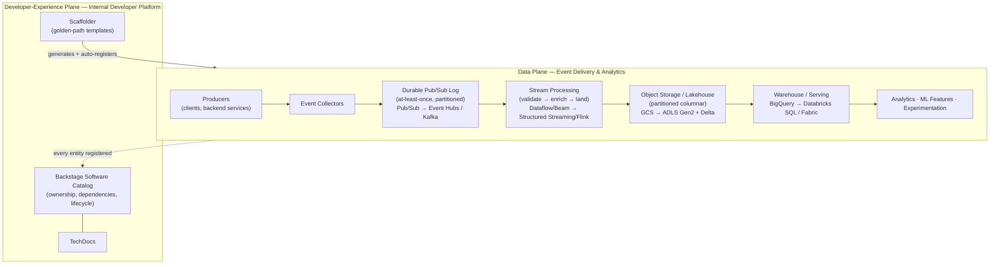
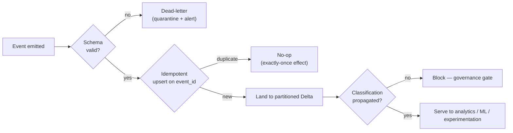
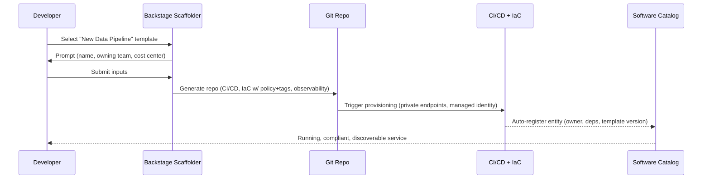

# Spotify Data Platform Case Study

> Part of the **Enterprise Data & AI Architecture Handbook** — Resources / CaseStudies, Chapter 04.
> A senior-level case study of Spotify's data platform and platform-engineering practice: the event-delivery pipeline that moves hundreds of billions of events per day, **Backstage** and the internal developer platform, the "**Golden Path**" / paved-road model for reconciling team autonomy with organizational consistency, and which of those lessons transfer to an Azure-first enterprise.

---

## Executive Summary

Spotify is worth studying not because of any single clever system, but because it is the most complete public account of an organization that grew from a few hundred to several thousand engineers while trying to preserve **team autonomy** — and discovered that autonomy at scale is only affordable when the platform team makes the *right* way to build also the *easy* way to build. Two artifacts came out of that journey and entered the wider industry vocabulary: the **event-delivery system** (a pipeline that reliably ships hundreds of billions of client and backend events per day into the analytics estate) and **Backstage** (the open-source internal developer platform that Spotify built to tame the sprawl those autonomous teams produced, later donated to the CNCF). Both are covered here, but the real subject is the *discipline* that connects them: **paved roads and golden paths**, discussed in the handbook as [platform-as-a-product](../../Phase-09/02_Platform_Engineering.md).

The problem Spotify's platform practice solves is the central tension of every scaling engineering organization. Give teams full autonomy and you get velocity but also fragmentation: dozens of bespoke CI/CD setups, incompatible event schemas, unowned pipelines, and a security posture that must be audited team-by-team. Mandate a single standard from the center and you get consistency but also a bottleneck, resentment, and shadow IT as teams route around the mandate. Spotify's answer — the same answer articulated in [DataOps Foundations](../../Phase-09/01_DataOps_Foundations.md) and [Platform Engineering](../../Phase-09/02_Platform_Engineering.md) — is that you resolve the tension not by choosing autonomy *or* consistency but by building a **golden path**: an opinionated, well-supported, self-service default that is genuinely faster and safer than rolling your own, so that teams adopt it *because it is better*, not because they are forced to. The governing law, stated bluntly in the Platform Engineering chapter, is that **a platform succeeds only when using it is easier than not using it.**

The event-delivery story is the concrete proving ground for this. Spotify's original pipeline wrote gzipped event files to local disk on every host and consolidated them hourly into Hadoop/HDFS; it worked at small scale but coupled event collection to batch cadence and to the operational health of a self-managed Hadoop estate. Around 2016 Spotify migrated its infrastructure to a public cloud and rebuilt event delivery around a managed streaming substrate (a globally-scaled publish/subscribe service feeding a managed stream-processing engine and a serverless warehouse). The lesson that transfers is not the specific cloud services — it is the *architectural move*: decouple event **collection** from event **processing** with a durable, at-least-once, horizontally-scalable log, and let idempotent consumers derive whatever they need downstream.

The transferable lesson, as with every case study in this collection, is the **shape of the discipline, not the stack**. Spotify runs on a particular public cloud with particular open-source frameworks (Scio for Apache Beam, Luigi and later Styx for orchestration, Backstage for the developer portal). An Azure-first enterprise should reuse the *principles* — treat the platform as a product with measured adoption, make the golden path measurably easier than the alternative, register everything in a discoverable catalog, bake governance into scaffolder templates rather than bolting it on, and decouple event collection from processing behind a durable log — while explicitly **refusing to copy** Spotify's specific GCP data stack *and*, critically, its famous "squad/tribe/chapter/guild" org model, which Spotify itself later publicly cautioned was a *snapshot of a moment*, not a reusable template.

---

## Learning Objectives

After working through this case study you should be able to:

- explain the autonomy-versus-consistency tension that defines every scaling engineering organization, and articulate why **paved roads / golden paths** resolve it structurally rather than by decree, connecting the argument to [Platform Engineering](../../Phase-09/02_Platform_Engineering.md);
- describe the evolution of Spotify's **event-delivery system** from file-based hourly batch consolidation to a managed streaming pipeline, and explain why decoupling event *collection* from event *processing* behind a durable at-least-once log is the load-bearing design choice;
- explain what **Backstage** is (software catalog, scaffolder/templating, TechDocs), why an internal developer platform is what makes golden paths *self-service*, and how catalog registration turns "who owns this pipeline?" from an archaeology problem into a lookup;
- articulate the "**platform-as-a-product**" mindset — user research, adoption metrics, developer-experience surveys, a roadmap — and explain why a golden path that nobody wants to use is worse than no golden path;
- reason precisely about **event delivery semantics** at scale (at-least-once delivery, idempotent consumption, why no examined system offers true unconditional exactly-once), connecting to the delivery-guarantee discussion in [DataOps Foundations](../../Phase-09/01_DataOps_Foundations.md);
- translate each Spotify concept into a defensible Azure-first equivalent (a managed event-streaming substrate, managed stream processing, a lakehouse/warehouse serving layer, Backstage-on-AKS as the internal developer platform, scaffolder templates that encode policy), and state where the translation is exact and where it is only approximate;
- explain why the **Spotify squad model must not be copied as an org template**, connecting the caution to Conway's Law and the Inverse Conway Maneuver;
- write an ADR that states what to reuse from Spotify, what to explicitly refuse to copy, and the conditions under which a full internal-developer-platform investment is justified versus premature.

---

## Business Motivation

Spotify's platform investments come from its operating model and its growth curve, not from a technology preference.

- **Autonomy is a deliberate product strategy, not an accident.** Spotify bet early that small, autonomous, end-to-end-owning teams would ship faster and stay more motivated than teams gated behind central approval. That bet only pays off if autonomy does not degrade into chaos — which requires a platform that makes good defaults free.
- **The scale of events is enormous and revenue-relevant.** Every play, skip, pause, search, playlist edit, and recommendation impression is an event. These events feed personalization (Discover Weekly, Daily Mix), royalty accounting, A/B experimentation, and operational dashboards. When the product *is* a data-driven recommendation experience, the reliability and freshness of the event pipeline is a first-class business concern, not plumbing.
- **Explosive engineer growth outpaces coordination-by-convention.** As the number of teams grew, tribal knowledge ("everyone knows to use this deployment script", "everyone knows the event schema convention") fragmented. Convention does not survive that growth; only encoded, self-service defaults do.
- **Fragmentation is a security and compliance multiplier.** Without a paved road, every team's bespoke CI/CD, provisioning, and event-schema approach must be independently reviewed — multiplying audit effort and the chance a gap is missed, exactly as argued in [Platform Engineering](../../Phase-09/02_Platform_Engineering.md).
- **Discoverability collapses without a catalog.** At thousands of services and pipelines, "does this already exist?" and "who owns this?" become unanswerable, producing duplicated builds and unowned "mystery" pipelines that nobody dares to touch or turn off.
- **The strategic goal was never a single tool.** It was that a new engineer could go from idea to a running, compliant, observable service *in the time it takes to fill out a form* — that the golden path was so good that going off it felt like a deliberate, costly choice rather than the default.

Each of these produced a specific architectural response, and the responses are the substance of this case study.

---

## History and Evolution

Spotify's own engineering writing describes a journey from self-managed batch infrastructure to a managed streaming-and-platform estate, and from informal convention to an encoded developer platform.

- **Pre-2016 — the self-managed Hadoop era.** Spotify ran one of Europe's larger Hadoop clusters on-premises. Event collection worked by writing gzipped event files to local disk on each producing host, then consolidating them **hourly** into HDFS, where Hive/Scalding/Luigi-orchestrated jobs processed them. It worked, but it coupled event availability to an hourly cadence and to the operational burden of a large self-managed cluster.
- **2012 — Luigi is open-sourced.** Spotify built and released **Luigi**, a Python workflow-orchestration library for stitching together long batch pipelines with dependency resolution — an intellectual ancestor of the DAG-based orchestration culture later dominated by Airflow, covered in [Orchestration with Airflow](../../Phase-09/07_Orchestration_with_Airflow.md).
- **2016 — the public-cloud migration.** Spotify announced it was moving its infrastructure to a public cloud, and over the following years rebuilt its data platform on managed services: a global publish/subscribe service for event transport, a managed stream-processing engine, object storage, and a serverless data warehouse. The multi-part "**Event Delivery — The Road to the Cloud**" engineering series documented the rebuild of the event pipeline around a managed streaming substrate.
- **Scio and the Beam bet.** Spotify built and open-sourced **Scio**, a Scala API over Apache Beam (and its managed Dataflow runner), so its large Scala data-engineering population could write unified batch-and-streaming pipelines idiomatically. This reflected a deliberate portability hedge — Beam's model is runner-agnostic.
- **Styx and containerized scheduling.** As orchestration needs grew, Spotify built **Styx** to schedule containerized (Docker) batch executions, reflecting the broader industry shift toward container-native workloads covered in [Containers with Docker](../../Phase-09/05_Containers_with_Docker.md) and [Kubernetes](../../Phase-09/06_Kubernetes.md).
- **2019 — Backstage is open-sourced.** Spotify open-sourced **Backstage**, the internal developer portal it had built to catalog its sprawling service estate and make its "Golden Path" onboarding self-service. This is the single most influential artifact of Spotify's platform practice for the wider industry.
- **2020-2023 — Backstage enters and matures within the CNCF.** Backstage was accepted into the CNCF (Sandbox in 2020, Incubating in 2022), accelerating an ecosystem of plugins (Kubernetes, CI/CD, cost, cloud-provider integrations) and cementing the term "internal developer platform."
- **The squad-model arc — and its honest retraction.** A widely-circulated 2012 whitepaper described Spotify's "squads, tribes, chapters, and guilds" organizational model, which the industry then treated as a template to copy. Spotify itself later publicly cautioned that the paper was **a snapshot of one moment**, that the company had moved on, and that copying the org chart wholesale was a mistake — a caution this case study treats as a first-class lesson.

The arc is important: Spotify did not begin with Backstage or a streaming pipeline. Both are scars from a specific, repeated, expensive problem — autonomous teams producing fragmentation faster than any central group could coordinate — that convention and documentation could not heal.

---

## Why This Technology Exists

Each part of Spotify's platform exists to remove one specific cause of scaling pain. Naming the cause is the only way to judge whether you share it.

- **The golden path exists** because, without an opinionated well-supported default, every autonomous team reinvents CI/CD, provisioning, and observability — multiplying cost, inconsistency, and security surface. The golden path trades a small amount of flexibility for a large reduction in cognitive load and a baked-in compliant configuration.
- **Backstage exists** because a golden path is only real if it is *self-service*. A wiki page describing the right way to build is not the same as a scaffolder template that *generates* a working, compliant, deployable project in minutes — and the difference between the two is usually the difference between low and high adoption.
- **The software catalog exists** because at thousands of entities, ownership and existence become unknowable. A catalog turns "who owns this and what does it depend on?" from an archaeology dig into a lookup, which is a prerequisite for incident response and for avoiding duplicate builds.
- **The streaming event-delivery system exists** because coupling event collection to an hourly batch cadence and to a self-managed cluster's health made freshness and reliability hostage to operational toil. A durable, managed, at-least-once log decouples collection from processing so each can scale and fail independently.
- **Scio and the Beam abstraction exist** because Spotify wanted its engineers to write pipelines in a portable, unified batch-and-streaming model rather than binding every pipeline to one engine's proprietary API.
- **The platform-as-a-product practice exists** because a platform built without user research produces a golden path nobody wants — the most expensive failure mode, because it consumes platform-team effort *and* fails to reduce fragmentation.

If you do not share these causes — if you have three teams, one CI/CD pipeline, and an event volume a single managed service absorbs without thought — then most of this machinery is over-engineering, and this case study's ADR says so explicitly.

---

## Problems It Solves

- **Fragmentation of tooling and practice.** A golden path collapses N bespoke CI/CD, provisioning, and observability setups into one well-supported default that every adopting team inherits, including its security and governance posture.
- **The autonomy-versus-consistency false choice.** Paved roads let teams stay autonomous (they retain the ability to go off-road for genuine edge cases) while making the consistent path the path of least resistance, so consistency is *earned* rather than *mandated*.
- **Ownership and discoverability collapse at scale.** A software catalog makes ownership, dependencies, and existence queryable, which is a precondition for fast incident response and for not rebuilding things that already exist.
- **Slow, ticket-driven onboarding.** A scaffolder replaces a multi-week, human-fulfilled provisioning ticket with a minutes-long self-service template run, removing the platform team from the critical path of every new project.
- **Event freshness coupled to batch cadence.** A streaming event-delivery substrate decouples collection from processing, so events are available with low latency and the pipeline's throughput scales horizontally rather than being gated by an hourly consolidation step.
- **Operational toil of self-managed big-data infrastructure.** Migrating event transport, stream processing, and warehousing to managed services removes a large class of cluster-babysitting toil, freeing platform engineers to improve the paved road itself.
- **Inconsistent, un-auditable security posture.** When provisioning flows through one paved road with built-in tagging, policy, and access defaults, compliance is inherited rather than reinvented — dramatically shrinking the audit surface.

---

## Problems It Cannot Solve

- **It cannot fix a golden path nobody wants to use.** If the paved road is more restrictive, slower, or missing a critical capability, teams route around it regardless of how well it is built or marketed. Platform engineering requires *continuous* user research, not a one-time build.
- **It cannot force adoption through documentation alone.** A described golden path is not a self-service one; without a scaffolder that generates working projects, adoption stays low.
- **It cannot substitute an org chart for a discipline.** Copying Spotify's squad/tribe/chapter/guild names does nothing without the underlying autonomy, funded platform investment, and paved roads — a lesson Spotify itself emphasized.
- **It cannot deliver true unconditional exactly-once event delivery.** The streaming substrate provides *at-least-once* delivery; exactly-once *effects* are achieved only by making consumers idempotent, never by assuming the transport dedupes for you.
- **It cannot fix a broken team topology.** If teams are drawn along the wrong boundaries, Conway's Law makes the system mirror those boundaries; a developer portal makes the friction visible but does not redraw the boundaries.
- **It cannot eliminate the cost of the platform team.** A genuine internal developer platform is a *funded, staffed, ongoing product*, not a project that ships once; under-funding it is the most common way the whole model fails.
- **It cannot make a small organization's problems big enough to justify it.** For a handful of teams, the paved-road machinery is heavier than the fragmentation it prevents.

---

## Core Concepts

### 4.1 The golden path as an opinionated, self-service default

A **golden path** (Spotify's term; Netflix's near-synonym is "paved road") is the platform team's single, opinionated, well-supported way to accomplish a common task — "create a new backend service", "stand up a new data pipeline", "publish a new event type". Its design goal, as stated in [Platform Engineering](../../Phase-09/02_Platform_Engineering.md), is to be simultaneously *the easiest*, *the safest*, and *not strictly mandatory but strongly incentivized*. Going off-road remains possible for genuine edge cases, but it means opting out of the automatic support (scaffolding, upgrades, built-in observability) the golden path supplies, making the trade-off explicit rather than invisible.

### 4.2 Backstage and the internal developer platform

An **internal developer platform (IDP)** is the concrete tooling surface that makes golden paths self-service. **Backstage** (originated at Spotify, now CNCF) is the leading open-source reference implementation, comprising a **Software Catalog** (ownership, relationship, and dependency metadata for every registered entity), a **Scaffolder** (templated project generation), **TechDocs** (documentation-as-code rendered into the catalog), and a plugin ecosystem (CI/CD, Kubernetes, cost, cloud-resource integrations). The catalog is the substrate; the scaffolder is what turns a *described* golden path into a *self-service* one.

### 4.3 Event delivery: decouple collection from processing behind a durable log

The load-bearing architectural move in Spotify's event pipeline is the separation of event **collection** (clients and services emit events) from event **processing** (jobs derive metrics, features, and tables) by a durable, horizontally-scalable, **at-least-once** publish/subscribe log. Producers are decoupled from consumers in time and in failure domain: a slow or failed consumer does not back-pressure event collection, and multiple independently-paced consumers can read the same stream. This is the streaming counterpart of the delivery-semantics discussion in [DataOps Foundations](../../Phase-09/01_DataOps_Foundations.md).

### 4.4 At-least-once delivery and idempotent consumption

At Spotify's scale, the transport guarantees **at-least-once** delivery: an event may be delivered more than once (after a retry, a rebalance, or a redelivery). No examined streaming system provides true unconditional *exactly-once* across arbitrary sinks. The only robust way to get exactly-once *effects* is to make consumers **idempotent** — deduplicate on a stable event key, or use an idempotent upsert/`MERGE` keyed on `(event_id)` — so that a redelivered event produces no additional effect. Assuming the transport dedupes is the classic, silent, correctness-destroying mistake.

### 4.5 Platform-as-a-product and paved-road autonomy

The discipline that ties everything together is treating the platform as a **product**: the platform team does user research, measures adoption (golden-path adherence rate), runs developer-experience surveys, and maintains a roadmap exactly as an external-facing product team would. The governing insight — **a platform succeeds only when using it is easier than not using it** — reframes autonomy: teams remain free, and the platform *competes for their adoption* by being genuinely better than the bespoke alternative. Mandates without a better paved road produce shadow IT; a better paved road without a mandate produces organic adoption.

---

## Internal Working

### 5.1 From event emission to queryable table (the collection-to-serve path)

A client or backend service emits an event to a lightweight collector endpoint. The collector publishes the event to a durable publish/subscribe topic partitioned for throughput. A managed stream-processing job subscribes, validates the event against its registered schema, enriches it (for example, joining a geo or device dimension), and writes it — via an idempotent, keyed upsert — into object storage as partitioned columnar files and/or into a warehouse table. Downstream batch and streaming jobs derive metrics, ML features, and experimentation aggregates from that consistent landing layer. Each hop is a designed interface: schema-validated at ingestion, idempotent at the sink, partitioned for the dominant read pattern.

### 5.2 From idea to running service (the scaffolder path)

A developer opens the Backstage catalog and selects a golden-path template ("New Data Pipeline"). The scaffolder prompts for inputs (name, owning team, cost center), then generates a fully-wired repository from an opinionated template: CI/CD pipeline, infrastructure-as-code with policy and tagging defaults baked in (per [Infrastructure as Code with Terraform](../../Phase-09/04_Infrastructure_as_Code_with_Terraform.md)), observability wiring, and TechDocs. The new entity **auto-registers in the catalog** with ownership, cost-center, and dependency metadata populated from the scaffolder inputs. The template itself is versioned, so an improvement to the golden path can be rolled out to existing scaffolded projects as an upgrade campaign.

### 5.3 Why decoupling and self-service are load-bearing

The two mechanisms above share one property: they move the platform team **off the critical path**. Decoupling event collection from processing means a consumer failure is not a collection outage. Self-service scaffolding means a new project does not wait on a provisioning ticket. In both cases the platform team's job shifts from *fulfilling requests* to *improving the paved road* — which is the only way a small central team can serve a large, growing, autonomous population without becoming the bottleneck the autonomy was designed to avoid.

---

## Architecture

At the highest level, Spotify's platform is best understood as two interlocking planes: a **data plane** (the event-delivery and analytics pipeline) and a **developer-experience plane** (the internal developer platform that governs how everything in the data plane is built and operated).

The data plane is a classic decoupled streaming architecture: **producers** (clients, backend services) → **collectors** → a **durable pub/sub log** → **stream processing** → **object storage + warehouse** → **derived analytics/ML/experimentation**. The defining choice is the durable log in the middle, which turns a tightly-coupled batch pipeline into a set of independently-scalable, independently-failing stages.

The developer-experience plane is the internal developer platform: a **software catalog** (system of record for entities and ownership), a **scaffolder** (golden-path project generation), **TechDocs** (docs-as-code), and **plugins** that surface CI/CD, Kubernetes, and cost data inline. This plane does not process a single event; its job is to ensure that everything in the data plane was built on the paved road, is registered, is owned, and is observable.

The two planes meet at the golden-path templates: a "new pipeline" template scaffolds a data-plane component *and* registers it in the developer-experience plane in one action, so that consistency is a property of *how things are created*, not a policy applied after the fact.

---

## Components

- **Event collectors** — lightweight endpoints that receive events from clients and services and publish them to the durable log.
- **Durable publish/subscribe log** — the horizontally-scalable, at-least-once transport that decouples collection from processing (Google Cloud Pub/Sub at Spotify; Azure Event Hubs / Apache Kafka as the enterprise analogues).
- **Stream-processing engine** — validates, enriches, and lands events (Cloud Dataflow / Apache Beam at Spotify, authored via **Scio**; Azure Stream Analytics, Databricks Structured Streaming, or Apache Flink as analogues).
- **Object storage + warehouse** — the analytics landing and serving layer (GCS + BigQuery at Spotify; ADLS Gen2 + a lakehouse/warehouse engine as the analogue).
- **Orchestration** — dependency-aware scheduling of batch pipelines (**Luigi**, then **Styx** for containerized executions at Spotify; Airflow as the industry standard, per [Orchestration with Airflow](../../Phase-09/07_Orchestration_with_Airflow.md)).
- **Backstage Software Catalog** — the discoverable inventory of services, pipelines, and ownership metadata.
- **Backstage Scaffolder** — generates new, fully-wired projects from opinionated golden-path templates.
- **Backstage TechDocs** — versioned, in-repo documentation rendered into the catalog.
- **Backstage plugins** — CI/CD, Kubernetes, cost, and cloud-provider integrations that surface operational context inline.
- **Schema registry / event schema definitions** — the contracts that make event validation at ingestion possible.

---

## Metadata

Metadata is the connective tissue of the whole platform, and it lives in two systems that must stay in sync.

- **Catalog metadata (Backstage).** Every entity — service, pipeline, data product, library — carries ownership (team, on-call rotation), lifecycle (experimental/production/deprecated), dependency relationships, and the template version it was scaffolded from. This is what makes "who owns this?" and "what breaks if I change this?" answerable.
- **Event schema metadata.** Each event type has a registered, versioned schema that the stream-processing stage validates against at ingestion. Backward-compatible, additive-only evolution is the norm; a breaking schema change is a governed event, not a silent one.
- **Lineage metadata.** Which pipeline produced which table from which event stream — captured so that a definition or schema change can be impact-analyzed before it ships, and so that a data incident can be traced to its source.
- **Provenance for reproducibility.** The input log offsets / storage versions a derived table was built from, so a computation can be reproduced or a bad batch reprocessed deterministically.
- **Cost and tagging metadata.** Cost-center and data-product tags populated at scaffold time and enforced at provisioning, so spend is attributable per team and per product from the first day of a project's life.

The single most valuable piece of metadata is *ownership tied to a currently-staffed team*, because it is the difference between a pipeline you can safely change and a "mystery" pipeline nobody dares touch.

---

## Storage

- **Durable log storage** is the retained buffer of the pub/sub substrate — events are held (for a configured retention window) so that a consumer can be replayed or a new consumer can backfill from the stream.
- **Object storage (data lake)** holds landed events as partitioned, compressed, columnar files — the cheap, durable, open-format substrate over which every downstream computation runs. At Spotify this is GCS; the Azure analogue is ADLS Gen2.
- **Warehouse storage** holds curated, query-optimized tables for interactive analytics and experimentation (BigQuery at Spotify; a lakehouse or serverless warehouse engine on Azure).
- **Catalog storage** — Backstage persists catalog entities, relationships, and metadata in a relational store (PostgreSQL, e.g., Azure Database for PostgreSQL Flexible Server), and at scale integrates a search backend for fast discovery over thousands of entities.
- **Partitioning for the read pattern.** Landed event data is partitioned (typically by event date and often by event type) so that the dominant analytical read pattern prunes efficiently — the columnar-storage discipline that keeps scan cost proportional to data actually needed rather than to total corpus size.

The storage principle throughout is **cheap, open-format, partitioned durable storage as the source of truth**, with query-optimized copies derived from it — never the reverse.

---

## Compute

- **Stream-processing compute** runs the continuous validation-enrichment-land jobs. It must autoscale with event volume and degrade gracefully under a spike rather than dropping events (the durable log absorbs the burst).
- **Batch/derivation compute** runs the scheduled jobs that build metrics, features, and experimentation aggregates from the landed data. This is the elastic, often spot/preemptible-friendly workload where cost optimization has the most leverage.
- **Serverless warehouse compute** answers interactive and experimentation queries, scaling per-query so that idle capacity is not paid for.
- **Backstage application compute** is a comparatively tiny, steady workload — a Node.js application typically run as a container on Kubernetes (AKS) or a container-app platform, sized for catalog reads (frequent) rather than scaffolder runs (infrequent).
- **The compute/collection decoupling matters most under stress.** Because collection publishes to a durable log, a surge in event volume or a slow consumer does not stall event emission; compute can fall behind and catch up from the retained log without data loss, which is exactly the fault-isolation property that batch-coupled collection lacked.

---

## Networking

- **Producer-to-collector.** Clients and services reach the collector endpoints over the network; at Spotify's client scale this is a globally-distributed ingestion problem, handled by regionally-close, horizontally-scaled collector fleets.
- **Managed-service connectivity.** In the Azure analogue, the pub/sub substrate (Event Hubs), stream processing, storage, and warehouse are reached over **private endpoints** with public network access disabled, so no analytics data traverses the public internet inside the estate — the private-connectivity baseline expected of any enterprise data platform.
- **Backstage as an internal-only surface.** The developer portal is an internal tool, exposed via a private ingress (private AKS ingress or a front door with a private origin), not a public endpoint — it holds the organization's entire service topology and ownership map, which is sensitive.
- **Egress control.** Default-deny egress with explicit allow-lists prevents a compromised pipeline component from exfiltrating data, consistent with the zero-trust posture the handbook expects.
- **Cross-region considerations.** Event collection is regionally distributed for latency and availability; the analytics estate is typically consolidated, so cross-region transport cost and data-residency constraints become explicit design inputs.

---

## Security

- **Identity, not keys.** Every component authenticates with a managed workload identity to the pub/sub substrate, storage, warehouse, and catalog — not shared account keys or long-lived secrets. Storage account keys are disabled; SAS-style shared secrets are prohibited.
- **Least-privilege access to the streams and tables.** Producers can publish to their topics; consumers can read the streams they need; nobody has ambient broad access. The catalog's ownership metadata is what makes least-privilege grants maintainable.
- **The catalog itself is access-controlled.** Backstage's permission framework restricts who can register, modify, or delete entities and who can trigger which scaffolder templates — preventing an unauthorized user from self-service-provisioning into a sensitive environment.
- **Security baked into the golden path.** Because provisioning flows through scaffolder templates, the compliant configuration (tagging, policy, private networking, managed identity) is *inherited* by every scaffolded project rather than reinvented and potentially under-secured per team — the single biggest security dividend of the paved-road model.
- **Event data is classified and governed.** Events carrying personal data are classified at ingestion, and that classification propagates into every derived table and feature so that access controls and retention rules follow the data rather than being applied only at the perimeter.
- **Encryption everywhere.** Data is encrypted in transit (private endpoints, TLS) and at rest (platform-managed or customer-managed keys), as a non-negotiable baseline.

---

## Performance

- **Throughput is a partitioning problem.** The pub/sub log's throughput scales with partition count; the stream-processing job's throughput scales with parallelism aligned to those partitions. A skewed partition key (one event type or one tenant dominating a partition) is the classic throughput collapse, and the fix is a compound or hashed key, not more hardware.
- **Latency is decoupled from batch cadence.** Because processing reads a durable stream continuously rather than waiting for an hourly file consolidation, end-to-end latency from event emission to queryable landing drops from *hours* to *seconds-to-minutes*, which is the entire point of the streaming rebuild.
- **Read performance is a storage-layout problem.** Partitioned, columnar, compressed landed data lets analytical queries prune to the partitions and columns they need; the warehouse serves interactive queries from query-optimized copies. Performance is engineered at the storage layout, not bolted on with more query compute.
- **Catalog performance.** A Backstage catalog with thousands of entities needs adequate database indexing and a search backend to keep discovery fast — a degraded catalog silently erodes the developer experience that is the whole platform's reason to exist.
- **Measure at the consumer.** The performance metric that matters is end-to-end freshness and query latency as *experienced by a downstream consumer*, not the internal throughput of any single stage.

---

## Scalability

- **Horizontal scale by partition.** Event volume scales by adding partitions to the log and parallelism to the consumers; the architecture has no central chokepoint that must scale vertically.
- **Organizational scale by paved road.** The platform team scales *sub-linearly* with the number of product teams precisely because the golden path absorbs most growth — a new team adopts the paved road rather than requiring bespoke platform attention. This is the organizational analogue of horizontal scaling.
- **Template/plugin marketplace.** Mature platform organizations let *other* internal teams contribute scaffolder templates and Backstage plugins, scaling golden-path coverage beyond what the central team alone could build — the platform-team equivalent of federating the load.
- **Catalog scale.** The catalog must remain fast and available as entity count grows into the thousands, which is a database-indexing and search-backend problem addressed before it becomes a discovery bottleneck.
- **The scaling failure mode is under-investment, not architecture.** The most common way this model fails to scale is not a technical ceiling — it is a platform team funded as a project rather than a product, so the paved road stops improving and teams start routing around it.

---

## Fault Tolerance

- **The durable log is the primary fault-isolation mechanism.** A failed or slow consumer does not lose events or stall collection; it falls behind and catches up from the retained stream. This single property is what makes the streaming architecture more resilient than the batch-coupled predecessor.
- **At-least-once + idempotency = no data loss and no double-counting.** Because delivery is at-least-once and consumers are idempotent, a redelivery after a crash produces no duplicate effect, and no event is silently dropped.
- **Replay and backfill.** Retained log offsets let a corrupted downstream table be rebuilt by replaying from a known offset, and let a new consumer backfill history — a recovery capability the file-based hourly system lacked.
- **Catalog availability independence.** The catalog's read path (discovery, ownership lookup during an incident) should remain available even if the provisioning backend is degraded, because browsing is far more frequent and more incident-critical than new provisioning.
- **Graceful degradation under spike.** Under an event surge, the log buffers and consumers lag rather than the system dropping events — the correct behavior, provided retention is sized to absorb realistic bursts.
- **Blameless recovery.** When a pipeline does fail, the catalog's ownership metadata routes the incident to the right team immediately, turning a "whose is this?" scramble into a lookup — a fault-tolerance property of the *organization*, not just the software.

---

## Cost Optimization

- **Decouple to right-size each stage.** Because collection, processing, and warehousing are independent, each is sized and paid for according to its own load — the log for peak throughput, batch compute elastically, the warehouse per-query — rather than provisioning one monolith for the worst case.
- **Spot/preemptible for elastic batch.** The derivation and backfill workloads are interruption-tolerant and belong on spot/preemptible compute, typically a 60-90% discount versus on-demand for that portion.
- **Tiered storage.** Hot landed data stays in performant storage; older partitions tier to cool/archive storage, and columnar compression keeps the whole corpus cheap.
- **Attribute cost at scaffold time.** Because cost-center and data-product tags are populated by the scaffolder and enforced at provisioning, every workload is attributable from day one — which is what makes showback/chargeback and unit-economics (cost per event, cost per pipeline) possible at all.
- **The platform's own cost is a feature, not overhead — if measured.** A paved road with built-in tagging and policy makes FinOps *dramatically* easier than auditing dozens of independently-built provisioning scripts after the fact.
- **Worked example.** Consider a nightly derivation job over landed events running on on-demand cloud compute at roughly €3,000/month for its compute portion. Moving the interruption-tolerant portion to spot (~75% discount) and applying a savings-plan commitment to the small steady baseline brings the same work to roughly €900/month — a ~70% reduction — with no change to the pipeline logic, only to *where* it runs. The precondition for even seeing this opportunity is the tagging that attributes the €3,000 to this pipeline in the first place.

---

## Monitoring

- **Pipeline health signals.** Consumer lag (how far behind real time each consumer is), throughput, error/retry rates, and dead-letter volume are the primary health signals of the event pipeline — consumer lag is the leading indicator that processing is falling behind collection.
- **Freshness SLOs.** The metric consumers actually feel is *landing freshness* — the delay from event emission to queryable data. A freshness-SLO breach alert (data older than the agreed threshold) is the symptom-level alert that should page, rather than any single stage's internal metric.
- **Schema-validation failure rate.** A spike in events failing schema validation is an early warning of a producer that shipped a breaking change, and it should alert before the malformed data corrupts downstream aggregates.
- **Catalog and portal health.** Because the developer platform *is* the developer experience, its availability and search latency are monitored as a product metric, not an afterthought.
- **Adoption as a monitored metric.** Golden-path adherence rate and scaffolder-run counts are monitored as the platform's north-star product metrics — a falling adherence rate is the earliest signal that the paved road has stopped being the easy path.

---

## Observability

Monitoring answers "is a known signal out of bounds?"; observability answers "why is this behaving in a way I did not anticipate?" — the distinction drawn in [DataOps Foundations](../../Phase-09/01_DataOps_Foundations.md).

- **End-to-end tracing across the async seam.** The hardest observability problem in an event pipeline is correlating a downstream anomaly back through the durable log to the producing service. Propagating a correlation/trace context through the event's metadata across the async boundary is what makes end-to-end latency and error attribution possible; without it, each stage's dashboards can be green while the end-to-end experience is broken.
- **Data observability.** Freshness, volume, schema, distribution, and lineage of the landed data are observed as first-class signals — a sudden drop in event volume or a shift in a value distribution is often the first sign of an upstream producer bug, well before any job errors.
- **Lineage-driven root cause.** When a metric looks wrong, lineage lets you trace it to the exact pipeline, event stream, and schema version that produced it, turning root-cause analysis from a guessing game into a traversal.
- **Ask unanticipated questions.** Rich, high-cardinality event and pipeline telemetry lets an engineer ask a question nobody pre-built a dashboard for ("did this anomaly correlate with a specific client version in one region?") — the defining capability of observability over monitoring.

---

## Governance

- **Ownership is the root of governance.** Every entity in the catalog has an accountable owning team; an unowned pipeline is a governance failure to be remediated, not tolerated. This is the precondition for every other governance control.
- **Event schemas are governed contracts.** A registered, versioned schema evolves backward-compatibly by default; a breaking change is reviewed, communicated, and versioned — never shipped silently to consumers who depend on the old shape.
- **Classification propagates with the data.** Personal-data classification applied at event ingestion flows into every derived table and feature, so access and retention rules follow the data rather than stopping at the perimeter — the recurring access-control-propagation discipline that appears throughout the handbook.
- **Governance encoded in the paved road.** The most durable governance is the kind baked into scaffolder templates and policy-as-code: a scaffolded project is *born* tagged, private-networked, and least-privileged, so compliance is the default rather than an after-the-fact audit finding.
- **Federated, not centralized.** Governance is expressed as automated guardrails and standards that autonomous teams inherit, not as a central board that reviews every decision — the federated-computational-governance posture that lets autonomy and control coexist.
- **The catalog is the audit surface.** Because ownership, lifecycle, dependencies, and template versions are all in one queryable system, "show me every production pipeline that touches personal data and who owns it" is a query, not an investigation.

---

## Trade-offs

- **Autonomy vs. consistency.** Paved roads deliberately trade a small amount of team flexibility for a large gain in consistency, security, and reduced cognitive load. The trade is only positive if the golden path genuinely fits real workflows; a bad paved road gets the worst of both worlds.
- **Managed services vs. control.** Migrating to managed streaming and warehousing removes operational toil but cedes some control and creates provider dependency. Spotify hedged this with portable abstractions (Beam/Scio) so pipeline logic is not welded to one runner.
- **Streaming vs. batch.** Streaming buys freshness and fault isolation at the cost of more operational sophistication (partitioning, idempotency, consumer-lag management) than a simple batch job. For workloads that genuinely need only daily freshness, streaming is over-engineering.
- **Build vs. buy the developer platform.** Backstage is powerful but is itself a product you must staff and operate; the alternative is a lighter-weight cloud-native platform primitive with less flexibility. The right choice depends on the number of teams and the diversity of golden paths.
- **Platform investment vs. feature velocity.** Every engineer on the platform team is one not shipping product features. The bet is that the platform's leverage across all teams exceeds that opportunity cost — true at scale, false with three teams.
- **Central template control vs. federated contribution.** Letting other teams contribute templates and plugins scales coverage but requires governance to keep quality high; keeping the central team as the sole author keeps quality high but caps coverage.

---

## Decision Matrix

| If your situation is… | Then… | Because… |
|---|---|---|
| 3-5 teams, one shared CI/CD, modest event volume | Do **not** build an IDP; use a shared repo template and one managed event service | The paved-road machinery is heavier than the fragmentation it would prevent |
| 10+ autonomous teams, fragmenting tooling | Invest in a platform-as-product: golden-path templates + a catalog (Backstage or a managed IDP) | Fragmentation cost now exceeds platform-team cost; adoption is earned by a better path |
| Event freshness needs are hourly/daily | Batch pipeline into the lakehouse; skip streaming | Streaming's operational sophistication is unjustified for batch-cadence needs |
| Event freshness needs are seconds-to-minutes, high volume | Durable at-least-once log + stream processing + idempotent sinks | Decoupling collection from processing is the only way to get freshness *and* fault isolation |
| You admire the Spotify squad model | Adopt the *autonomy + paved-road discipline*, **not** the org chart | Spotify itself disowned the model as a copyable template; copy the discipline, design your own topology |
| You want exactly-once event effects | At-least-once transport + idempotent consumers | No examined system offers true unconditional exactly-once; idempotency is the achievable path |
| Heavy existing bespoke pipelines | Introduce the golden path for *new* work first; migrate opportunistically | A forced rewrite of working pipelines is rarely worth it; new work proves the paved road |

---

## Design Patterns

- **Golden path / paved road.** An opinionated, self-service, genuinely-easier default that earns adoption rather than mandating it.
- **Internal developer platform.** A catalog + scaffolder + docs surface that makes golden paths self-service and moves the platform team off the critical path.
- **Decoupled event delivery.** Producers → durable at-least-once log → idempotent consumers, isolating collection from processing in time and failure domain.
- **Idempotent consumer.** Deduplicate on a stable event key or use a keyed upsert so at-least-once delivery yields exactly-once effects.
- **Schema-on-ingest validation.** Validate every event against a registered, versioned schema at the ingestion boundary, quarantining violations rather than corrupting downstream data.
- **Scaffolded compliance.** Bake tagging, policy, private networking, and managed identity into scaffolder templates so every new project is born compliant.
- **Catalog-as-system-of-record.** Make the software catalog the authoritative source for ownership, dependencies, and lifecycle, so incident routing and impact analysis are lookups.
- **Versioned golden-path templates.** Version templates so improvements can be rolled out to existing scaffolded projects as upgrade campaigns.

---

## Anti-patterns

- **Golden path by documentation.** A wiki page describing the right way, with no scaffolder — produces low adoption because it is not self-service.
- **The mandated paved road nobody wants.** Forcing teams onto a path that is slower or more restrictive than their bespoke alternative — produces shadow IT and resentment.
- **Copying the org chart.** Adopting squad/tribe/chapter/guild names as a template without the autonomy, funded platform, and paved roads underneath — "Spotify model in name only."
- **Assuming exactly-once transport.** Building consumers that are not idempotent because "the queue handles duplicates" — silently double-counts on every redelivery.
- **Coupling collection to batch cadence.** Emitting events only into an hourly file consolidation — makes freshness hostage to the batch schedule and to a self-managed cluster's health.
- **Under-funding the platform team.** Staffing the platform as a one-time project rather than an ongoing product — the paved road stops improving and teams route around it.
- **Unowned pipelines.** Tolerating catalog entities with no accountable owner — creates "mystery" pipelines nobody can safely change or retire.
- **Perimeter-only classification.** Classifying personal data at ingestion but not propagating the classification into derived tables — leaks controlled data through the analytics layer.

---

## Common Mistakes

- **Building the platform nobody asked for.** Investing in an IDP without user research, producing a golden path that does not match real workflows and is consequently ignored.
- **Measuring outputs instead of adoption.** Tracking how many templates the platform team shipped rather than how many teams actually use them and how satisfied they are.
- **Skewed partition keys.** Choosing an event partition key (single tenant, single event type) that concentrates load on one partition, causing throughput collapse that no amount of added compute fixes.
- **No dead-letter path.** Failing to route un-processable events to a dead-letter destination, so a single poison event stalls a consumer or is silently dropped.
- **Schema changes shipped silently.** Producers evolving an event shape without versioning or consumer notification, corrupting downstream aggregates.
- **Treating Backstage as a wiki.** Deploying the catalog but not the scaffolder, so the "self-service" platform is really just a directory.
- **Reproducing the full Spotify stack at small scale.** Standing up pub/sub + stream processing + a data warehouse + an IDP for a workload a single managed service and a repo template would serve.
- **Over-rigid golden paths.** A paved road so opinionated it cannot accommodate a legitimate recurring use case, forcing every real edge case off-road and eroding trust in the path.

---

## Best Practices

- **Treat the platform as a product.** Do user research, measure golden-path adherence, run developer-experience surveys, maintain a roadmap, and market the platform internally.
- **Make the golden path measurably easier.** Instrument the time-to-first-deploy on the paved road versus the bespoke alternative; if the paved road is not faster and safer, fix it before promoting it.
- **Register everything.** Make catalog registration a precondition of production, so ownership and discoverability are universal, not best-effort.
- **Bake governance into templates.** Encode tagging, policy, private networking, and managed identity in scaffolder templates so compliance is inherited.
- **Design for at-least-once from day one.** Make every consumer idempotent and give every stream a dead-letter path; never assume the transport dedupes.
- **Version schemas and templates.** Evolve event schemas backward-compatibly and version golden-path templates so improvements propagate as upgrade campaigns.
- **Decouple collection from processing.** Put a durable log between producers and consumers so freshness and fault isolation come for free.
- **Widen the paved road when it fails a real need.** Revisit the golden path when it demonstrably fails a legitimate, recurring use case, rather than forcing that case off-road permanently.
- **Right-size the investment.** Only build the full IDP when the number of teams and the fragmentation cost justify it; start with a repo template and one managed event service otherwise.

---

## Enterprise Recommendations

- **Adopt the discipline, not the stack.** Reuse Spotify's platform-as-product mindset, paved-road model, and decoupled event delivery; do not reproduce its specific GCP services or its org model.
- **Start the golden path with new work.** Prove the paved road on greenfield projects, then migrate existing pipelines opportunistically rather than mandating a disruptive rewrite.
- **Fund the platform team as a product, permanently.** The single highest-leverage decision is treating the platform as an ongoing, staffed product with a roadmap and adoption targets — under-funding it is the dominant failure mode.
- **Make Backstage-or-equivalent the system of record for ownership.** Whether Backstage-on-AKS or a managed IDP primitive, ensure every production entity is registered, owned, and discoverable before it ships.
- **Enforce idempotency and schema governance as platform defaults.** Ship idempotent-consumer and schema-validation patterns in the golden-path template so no team has to rediscover them.
- **Instrument adoption and developer experience.** Golden-path adherence rate and DX survey results are the metrics that tell you whether the platform is working; review them on a standing cadence.
- **Refuse to copy the squad org chart.** Design your team topology to your desired architecture (Inverse Conway Maneuver); treat Spotify's model as a cautionary snapshot, per Spotify's own guidance.

---

## Azure Implementation

An Azure-first enterprise reproduces Spotify's *principles* on managed Azure services. The mapping is direct:

- **Event transport (Pub/Sub → Azure Event Hubs / Kafka).** Use **Azure Event Hubs** (optionally with the Kafka-compatible endpoint) as the durable, at-least-once, partitioned log that decouples collection from processing. Size partitions for peak throughput and choose a compound/hashed partition key to avoid skew.
- **Stream processing (Dataflow/Beam → Structured Streaming / Stream Analytics / Flink).** Use **Azure Databricks Structured Streaming** (or **Azure Stream Analytics** for simpler SQL transforms, or **Flink** on AKS/HDInsight) to validate against the registered schema, enrich, and land events via an idempotent `MERGE` keyed on `event_id` into Delta tables.
- **Storage + warehouse (GCS + BigQuery → ADLS Gen2 + lakehouse/warehouse).** Land events as partitioned Delta on **ADLS Gen2**; serve interactive analytics and experimentation from **Databricks SQL**, **Microsoft Fabric**, or **Synapse serverless**. Disable storage account keys; use managed identity and private endpoints.
- **Orchestration (Luigi/Styx → Airflow / ADF).** Use **Azure Data Factory Managed Airflow** or self-managed Airflow on AKS for dependency-aware batch scheduling, per [Orchestration with Airflow](../../Phase-09/07_Orchestration_with_Airflow.md).
- **Internal developer platform (Backstage → Backstage-on-AKS or Azure primitives).** Run **Backstage** as a container on **AKS** or **Azure Container Apps**, backed by **Azure Database for PostgreSQL Flexible Server**, exposed via a private ingress. Alternatively/complementarily, use **Azure Deployment Environments** and **Azure Developer CLI (azd) templates** as the scaffolder and **Azure API Center** for API discovery — the native primitives referenced in [Platform Engineering](../../Phase-09/02_Platform_Engineering.md).
- **Scaffolded compliance (IaC).** Golden-path scaffolder templates generate **Terraform/Bicep** with **Azure Policy**, tagging, private endpoints, and managed identity baked in (per [Infrastructure as Code with Terraform](../../Phase-09/04_Infrastructure_as_Code_with_Terraform.md)), and a CI/CD pipeline per [DevOps and CI/CD](../../Phase-09/03_DevOps_and_CI_CD.md).
- **Governance.** **Unity Catalog** (or Fabric/Purview) enforces access and propagates classification; **Microsoft Purview** provides glossary, lineage, and catalog-level discovery complementary to Backstage's service catalog.
- **Containers and clusters.** The IDP and any self-managed stream processors run on containers (per [Containers with Docker](../../Phase-09/05_Containers_with_Docker.md)) orchestrated by **AKS** (per [Kubernetes](../../Phase-09/06_Kubernetes.md)), promoted across environments via GitOps (per [GitOps and Environment Management](../../Phase-09/08_GitOps_and_Environment_Management.md)).

The Azure translation is *exact* for the decoupled-streaming and scaffolded-compliance patterns, and *approximate* for the developer portal — Backstage is portable and runs anywhere, while the native Azure primitives (Deployment Environments, API Center) cover a subset of Backstage's catalog/scaffolder surface with less operational burden.

---

## Open Source Implementation

A fully open-source reproduction of Spotify's principles, cloud-agnostic by construction:

- **Event transport.** **Apache Kafka** (or Redpanda) as the durable, partitioned, at-least-once log, with **Schema Registry** enforcing event contracts.
- **Stream processing.** **Apache Flink** or **Spark Structured Streaming** (authored via Scala/PySpark), or **Apache Beam** with the Flink/Spark runner and **Scio** for a Spotify-faithful Scala experience.
- **Storage + query.** Landed data as **Delta Lake / Apache Iceberg / Apache Hudi** on **MinIO** or HDFS-compatible object storage, queried by **Trino** / **DuckDB** / **ClickHouse**.
- **Orchestration.** **Apache Airflow** (or Dagster/Prefect) for dependency-aware batch scheduling.
- **Internal developer platform.** **Backstage** itself — the open-source original — as catalog + scaffolder + TechDocs, backed by **PostgreSQL**, with community plugins for Kubernetes, CI/CD, and cost.
- **Infrastructure and delivery.** **Terraform** + **OPA/Conftest** for policy-as-code, **Kubernetes** for orchestration, **Argo CD/Flux** for GitOps, **GitHub Actions** reusable workflows for CI/CD.
- **Governance and quality.** **OpenMetadata** or **Apache Atlas** for catalog/lineage, **Great Expectations** for data quality, **OpenLineage/Marquez** for lineage capture.
- **Observability.** **Prometheus/Grafana** for pipeline metrics, **OpenTelemetry** + **Tempo/Jaeger** for tracing across the async seam, **Loki** for logs.

This stack is the closest to what Spotify actually runs in spirit (Backstage, Beam/Scio, Kafka-style transport), and its portability — everything is open-standard — is precisely what keeps the managed backend replaceable.

---

## AWS Equivalent (comparison only)

Mapping the same principles onto AWS, for comparison — not as a build target:

- **Event transport:** Amazon Kinesis Data Streams or Amazon MSK (managed Kafka) as the durable at-least-once log.
- **Stream processing:** Amazon Managed Service for Apache Flink (formerly Kinesis Data Analytics) or Spark on EMR / Glue streaming.
- **Storage + warehouse:** S3 (with Iceberg/Delta) + Amazon Athena/Redshift.
- **Orchestration:** Amazon MWAA (managed Airflow) or Step Functions.
- **Internal developer platform:** AWS Proton (opinionated service templates) as a partial native analogue, or Backstage self-hosted on EKS; AWS Service Catalog for governed provisioning.
- **Governance:** AWS Lake Formation + Glue Data Catalog for access and lineage.

**Advantages:** deep managed-streaming maturity (Kinesis/MSK), and Backstage runs equally well on EKS. **Disadvantages:** Proton is narrower than Backstage's catalog/scaffolder surface; the developer-portal experience is less unified than Backstage. **Migration strategy:** the open-standard core (Kafka/Beam/Backstage) is portable, so a move is a backend re-point plus IAM/networking rework, not a re-architecture. **Selection criterion:** choose AWS-native streaming only if already AWS-committed; the platform *discipline* is identical regardless of provider.

---

## GCP Equivalent (comparison only)

GCP is the platform Spotify actually runs on, so the "equivalent" here is essentially the original:

- **Event transport:** **Google Cloud Pub/Sub** — the globally-scaled, at-least-once publish/subscribe log at the heart of Spotify's rebuilt event delivery.
- **Stream processing:** **Cloud Dataflow** (managed Apache Beam), authored via **Scio** — Spotify's actual toolchain.
- **Storage + warehouse:** **Google Cloud Storage** + **BigQuery** — the serverless warehouse Spotify's analytics estate is built on.
- **Orchestration:** **Cloud Composer** (managed Airflow); Spotify additionally built **Styx** for containerized scheduling.
- **Internal developer platform:** **Backstage** self-hosted on GKE — Backstage originated at Spotify and remains cloud-agnostic.
- **Governance:** **Dataplex** + **Data Catalog** for access, classification, and lineage.

**Advantages:** BigQuery's serverless model and Pub/Sub's global scale are genuine strengths, and this is the *reference* implementation of the whole case study. **Disadvantages:** deeper coupling to one provider's proprietary warehouse (BigQuery), which is why Spotify hedged with the portable Beam/Scio abstraction. **Migration strategy:** Beam pipelines are runner-portable and Backstage is provider-agnostic, limiting lock-in to the warehouse and Pub/Sub semantics. **Selection criterion:** GCP is the natural home if BigQuery's serverless analytics are the priority; the *principles* transfer to any cloud.

---

## Migration Considerations

- **What is portable.** The *discipline* (platform-as-product, paved roads, decoupled event delivery, idempotent consumers, catalog-as-system-of-record) is fully portable across clouds and stacks — it is architecture and practice, not a product. Backstage, Beam/Scio, and Kafka-compatible transport are open and portable by construction.
- **What is not portable.** The specific managed services (Pub/Sub semantics, BigQuery's serverless model, provider-specific IAM and networking) and — critically — the *organizational* model. A team topology tuned to one company's product structure does not transplant.
- **Migrate new work first.** Introduce the golden path for greenfield projects, prove it earns adoption, then migrate existing pipelines opportunistically. A forced big-bang rewrite of working pipelines is rarely justified.
- **Sequence the event-delivery rebuild carefully.** Moving from batch-coupled collection to a streaming log is best done by dual-writing (old and new paths in parallel) and cutting over consumers once the new path is proven at parity — the pattern Spotify's own multi-phase migration reflected.
- **Do not migrate the org chart.** The most common and most damaging migration mistake is importing Spotify's squad model as a template. Design team boundaries to your desired architecture (Inverse Conway Maneuver); let the platform reduce the coordination cost of those boundaries rather than pretending the boundaries themselves are copyable.
- **Externalize the catalog early.** Ownership and lineage metadata is the hardest thing to reconstruct after the fact; capture it in the catalog from the first scaffolded project rather than back-filling it during an incident.

---

## Mermaid Architecture Diagrams

**Reference architecture — the two interlocking planes:**

**End-to-end flow with enforcement gates:**

**Scaffolder sequence — idea to running, compliant service:**

---

## End-to-End Data Flow

1. **Emission.** A client or backend service emits a typed event (a play, skip, or search) to a nearby collector endpoint.
2. **Transport.** The collector publishes the event to a partitioned, durable, at-least-once pub/sub topic; the event is now safely buffered independent of any consumer's health.
3. **Validation.** A stream-processing job reads the topic and validates the event against its registered, versioned schema; violations route to a dead-letter destination and raise an alert rather than corrupting downstream data.
4. **Enrichment.** The job enriches the event (geo, device, or session dimensions) and classifies any personal data.
5. **Idempotent landing.** The event is written via a keyed upsert (`MERGE` on `event_id`) into partitioned columnar storage, so a redelivery produces no duplicate — an exactly-once *effect* over at-least-once *delivery*.
6. **Derivation.** Scheduled batch and streaming jobs derive metrics, ML features, and experimentation aggregates from the consistent landing layer.
7. **Serving.** Curated tables serve interactive analytics, personalization models, and A/B experiment analysis; classification and access controls follow the data into every derived copy.
8. **Governance and discovery.** Throughout, every pipeline and table is registered in the catalog with ownership and lineage, so an anomaly can be traced to its producing event stream and schema version, and an incident routed to its owning team by lookup.

---

## Real-world Business Use Cases

- **Personalization at scale.** Play, skip, and search events feed the models behind Discover Weekly, Daily Mix, and radio — the freshness and completeness of the event pipeline directly shape recommendation quality.
- **A/B experimentation.** Product changes are evaluated against metrics *defined identically* for control and treatment arms and identical to the metrics leadership sees on dashboards; the event pipeline is the substrate of the experimentation platform.
- **Royalty and rights accounting.** Play events underpin royalty calculations, making the pipeline's correctness and auditability a financial, not merely analytical, concern.
- **Operational and product analytics.** Dashboards for engagement, retention, and feature adoption are built on the same landed events, so consistency across surfaces matters.
- **Developer onboarding velocity.** The internal developer platform is itself a business use case: it compresses time-to-first-deploy for every new engineer and every new team across the company.
- **Cost attribution.** Scaffold-time tagging makes per-team, per-product spend attributable, enabling FinOps showback that would be impossible across dozens of independently-built provisioning scripts.

---

## Industry Examples

- **Spotify — the event-delivery rebuild.** The migration from file-based hourly consolidation into Hadoop to a managed, streaming, at-least-once pub/sub pipeline is the canonical example of decoupling event collection from processing at scale.
- **Spotify — Backstage.** Open-sourced in 2019 and donated to the CNCF, Backstage is now the reference internal developer platform, adopted across the industry as the concrete implementation of golden-path self-service.
- **Netflix — the paved road.** Netflix publicized the "paved road" concept — a platform team making one well-supported path so much better than the alternatives that teams choose it voluntarily — the near-synonym of Spotify's golden path, referenced in [Platform Engineering](../../Phase-09/02_Platform_Engineering.md).
- **The squad-model cautionary tale.** Numerous organizations copied Spotify's squad/tribe/chapter/guild names as an org template and struggled, because they imported the artifact without the underlying autonomy and platform investment — a widely-cited lesson in *not* copying org charts.
- **CNCF ecosystem.** Backstage's move into the CNCF spawned a plugin ecosystem (Kubernetes, CI/CD, cost, cloud-provider integrations) that made the internal-developer-platform pattern accessible to organizations far smaller than Spotify.

---

## Case Studies

**Case Study 1 — "The Spotify model in name only."** A ~600-engineer company, admiring Spotify's autonomy, reorganized overnight into "squads", "tribes", "chapters", and "guilds", adopting the vocabulary wholesale from the 2012 whitepaper. What it did *not* do was fund a platform team, build any golden path, or invest in a developer portal. Within a year, coordination had gotten *worse*: squads were nominally autonomous but shared no paved road, so each reinvented CI/CD, provisioning, and event schemas; "chapters" and "guilds" became meeting overhead with no decision authority; and cross-squad dependencies had no owner. Leadership concluded "the Spotify model doesn't work." The correct diagnosis was the opposite: they had copied the *artifact* (the org chart) and skipped the *discipline* (autonomy made affordable by a funded platform and paved roads). This is the platform-engineering instance of the recurring handbook lesson that copying a surface form without its underlying substrate produces the appearance of the practice with none of its benefit — directly paralleling the platform-as-product argument in [Platform Engineering](../../Phase-09/02_Platform_Engineering.md). It motivates the ADR's explicit refusal to copy the org model and its insistence on funded platform investment.

**Case Study 2 — the paved road nobody drove on.** A data-platform team at a large enterprise built a Backstage catalog and a "new pipeline" scaffolder, then mandated its use. Six months later, golden-path adherence was under 30% and shadow pipelines were proliferating. A developer-experience survey found the cause: the scaffolded pipeline was *more* restrictive and *slower to iterate* than a team wiring up its own — it forced an opinionated framework teams found awkward, and a template change took the platform team two weeks to ship. Teams were rationally routing around a paved road that was worse than the dirt path beside it. The fix was to treat the platform as a product: the team ran user research, discovered the three friction points, widened the golden path to accommodate two legitimate recurring patterns it had excluded, and cut template-change latency from weeks to hours. Adherence climbed past 80% within a quarter — not because of the mandate, but because the paved road finally became the genuinely easier path. This is the direct, real-world enactment of the governing law from [Platform Engineering](../../Phase-09/02_Platform_Engineering.md): *a platform succeeds only when using it is easier than not using it.* Both case studies motivate the ADR below.

### Architecture Decision Record (ADR-0217): Adopt Spotify's Paved-Road / Internal-Developer-Platform Principles on Managed Azure, Not Spotify's Stack or Org Model

**Context.** We are a scaling enterprise (12+ autonomous data and ML teams) experiencing tooling fragmentation, unowned pipelines, inconsistent event schemas, and a growing security-audit burden — the exact conditions Spotify's platform practice was built for. We admire Spotify's outcomes (event delivery at scale, Backstage, high team autonomy) and must decide what to actually adopt. Spotify runs on GCP-specific managed services and famously described a squad/tribe/chapter/guild org model that it later publicly cautioned was a non-copyable snapshot.

**Decision.** Adopt Spotify's *principles* on managed Azure services, with seven binding clauses:
1. **Platform-as-a-product.** Fund a permanent, staffed platform team; the primary success metric is **golden-path adherence rate** plus developer-experience survey results, reviewed on a standing cadence — not the count of templates shipped.
2. **The golden path must be measurably easier.** Instrument time-to-first-deploy on the paved road versus the bespoke alternative; a golden path that is not demonstrably faster and safer is a defect to fix before it is promoted, never a mandate to enforce.
3. **Catalog registration is a production precondition.** Every production entity is registered in Backstage (on AKS) with an accountable owning team, dependencies, and template version; unowned entities are remediated, not tolerated.
4. **Autonomy bounded by scaffolded guardrails.** Tagging, Azure Policy, private networking, and managed identity are baked into scaffolder templates so every new project is born compliant; going off-road means explicitly opting out of that support.
5. **Do not copy the org chart.** Team topology is designed to our desired architecture (Inverse Conway Maneuver); Spotify's squad model is treated as a cautionary snapshot, per Spotify's own guidance — never adopted as a template.
6. **At-least-once + idempotent consumers.** Event delivery on Azure Event Hubs / Kafka assumes at-least-once delivery; every consumer is idempotent (`MERGE` on `event_id`) with a dead-letter path — no exactly-once transport assumption.
7. **Priced portability.** Keep the open-standard core (Backstage, Beam/Kafka-compatible abstractions, open table formats) so the managed backend is replaceable and lock-in is limited to services we consciously chose.

**Consequences.** *Positive:* fragmentation and audit surface shrink as adoption grows; the platform team scales sub-linearly with product teams; ownership and lineage become queryable; event correctness is guaranteed by idempotency rather than assumed. *Negative:* a permanent platform-team cost; Backstage is itself a product to operate; discipline is required to keep the golden path genuinely better than the alternative. *Risks:* under-funding the platform (mitigated by clause 1's standing adoption review) and org-chart cargo-culting (mitigated by clause 5).

**Alternatives considered.** *(a) Copy Spotify's GCP stack and squad model literally* — rejected: imports lock-in and an org model Spotify itself disowned, and Case Study 1 shows the org copy fails without the discipline. *(b) Mandate a single standard from the center with no paved road* — rejected: produces shadow IT, exactly Case Study 2's failure before the fix. *(c) Do nothing / convention-only* — rejected: convention does not survive past a few dozen teams, which is the condition that triggered this ADR.

---

## Hands-on Labs

- **Lab 1 — Decoupled event delivery.** Stand up Azure Event Hubs (or local Kafka), write a producer that emits typed events, and a Structured Streaming consumer that validates against a schema and lands to Delta via an idempotent `MERGE` on `event_id`. Prove exactly-once *effect* by deliberately redelivering an event and confirming no duplicate row.
- **Lab 2 — Dead-letter and schema evolution.** Extend Lab 1 with a dead-letter path for schema-invalid events, then ship a backward-compatible additive schema change and confirm old and new consumers both work; then attempt a breaking change and observe the validation failures.
- **Lab 3 — Backstage catalog + scaffolder.** Deploy Backstage on AKS (or locally), register two services in the catalog, and build a scaffolder template that generates a new pipeline repo with tagging and CI/CD baked in and auto-registers the entity.
- **Lab 4 — Golden-path adherence metric.** Instrument time-to-first-deploy on your scaffolded golden path versus manually wiring an equivalent pipeline, and compute the delta — the number that decides whether your paved road is real.
- **Lab 5 — Partition-key skew.** Load an event stream with a skewed partition key, observe consumer-lag concentration on one partition, then switch to a compound/hashed key and confirm the lag rebalances.

---

## Exercises

- Write the four recurring causes of event-schema drift and, for each, the platform mechanism that prevents it.
- Given a consumer that is not idempotent, describe two distinct redelivery scenarios that would corrupt a downstream aggregate, and rewrite the consumer to be idempotent.
- Draft a golden-path template's input schema (fields, defaults, validations) for "new streaming pipeline" and list the compliance defaults it should bake in.
- Explain, in three sentences, why "a platform succeeds only when using it is easier than not using it" makes adoption rate — not template count — the correct platform metric.
- Identify three things that are portable and three that are not portable when migrating Spotify's principles to Azure.

---

## Mini Projects

- **Project A — Event-delivery reference pipeline.** Build a complete producer → Event Hubs → Structured Streaming → Delta → Databricks SQL pipeline with schema validation, dead-lettering, idempotent landing, and a freshness-SLO alert. Deliverable: a runnable repo plus a one-page architecture note.
- **Project B — Minimal internal developer platform.** Deploy Backstage, build two golden-path scaffolder templates (a batch pipeline and a streaming pipeline), enforce catalog registration, and instrument a golden-path adherence dashboard. Deliverable: the platform plus an adoption-metric readout.
- **Project C — Governance-in-the-template.** Extend a scaffolder template so every generated project is born with tagging, Azure Policy, private endpoints, and managed identity, and write the policy-as-code that fails CI if any is missing. Deliverable: the template plus a passing/failing CI demonstration.

---

## Capstone Integration

This case study integrates directly with the platform-engineering arc of the handbook. It is the real-world proof of the [Platform Engineering](../../Phase-09/02_Platform_Engineering.md) chapter's central claim — that paved roads reconcile autonomy and consistency — and it operationalizes the [DataOps Foundations](../../Phase-09/01_DataOps_Foundations.md) disciplines of ownership, observability, and delivery semantics at extreme scale. The scaffolded-compliance pattern is [Infrastructure as Code](../../Phase-09/04_Infrastructure_as_Code_with_Terraform.md) plus [DevOps and CI/CD](../../Phase-09/03_DevOps_and_CI_CD.md) made self-service; the runtime substrate is [Containers with Docker](../../Phase-09/05_Containers_with_Docker.md) on [Kubernetes](../../Phase-09/06_Kubernetes.md), promoted via [GitOps and Environment Management](../../Phase-09/08_GitOps_and_Environment_Management.md); and the batch-derivation layer is scheduled per [Orchestration with Airflow](../../Phase-09/07_Orchestration_with_Airflow.md). The unifying thread, consistent across the whole handbook, is that **the fast/convenient path must never be allowed to make the decisions the correct/governed path exists to make** — here expressed as: a golden path earns adoption by being genuinely better, event correctness is guaranteed by idempotency rather than assumed, and a copied org chart is no substitute for a funded platform discipline.

---

## Interview Questions

- What problem does a golden path solve, and why is "a platform succeeds only when using it is easier than not using it" the governing constraint?
- Explain the difference between at-least-once delivery and exactly-once effects, and how you achieve the latter.
- What is Backstage, and what are its three core capabilities?
- Why did Spotify decouple event collection from event processing, and what fault-isolation property does that buy?
- Why should you *not* copy Spotify's squad model as an org template?
- What is the single most important piece of metadata in a software catalog, and why?
- How would you detect and fix a skewed event partition key?

---

## Staff Engineer Questions

- Design an event-delivery pipeline for 100k events/second with a 60-second freshness SLO. Justify your partitioning, delivery-semantics, and dead-lettering choices.
- Your golden-path adherence rate is 40% and falling. Walk through how you diagnose whether the problem is the paved road's quality, its discoverability, or a mismatch with real workflows.
- A downstream metric is wrong and every stage's dashboard is green. Explain how end-to-end tracing across the async seam and lineage let you find the root cause.
- Argue both sides of building Backstage-on-AKS versus using native Azure platform primitives (Deployment Environments, API Center) for a 15-team organization.
- How do you evolve an event schema used by dozens of consumers without breaking any of them?

---

## Architect Questions

- Draw the two-plane architecture (data plane + developer-experience plane) and explain where they meet and why that meeting point is what makes consistency a property of *creation* rather than *audit*.
- Under what team count and fragmentation cost does an internal-developer-platform investment become justified, and how do you make that case to a CFO?
- How do you design governance so that autonomy and control coexist — federated guardrails versus a central review board — and what does each cost?
- Where is the Spotify-to-Azure translation exact, and where is it only approximate? Defend each judgment.
- How would you sequence a migration from batch-coupled event collection to a streaming log without a data-loss window?

---

## CTO Review Questions

- What is the total cost of ownership of a permanent platform team, and what is the fragmentation cost it offsets — expressed as unit economics (cost per team, cost per pipeline)?
- What is our exposure to provider lock-in in this design, and what is the priced value of the portability hedges (Backstage, Beam/Kafka abstractions, open table formats)?
- How do we avoid the "Spotify model in name only" failure — what funding and governance commitments must we make so the paved road keeps improving?
- What is our event-delivery correctness guarantee, and how do we prove (not assume) exactly-once effects to auditors handling royalty-grade or financial data?
- If we adopt this and the platform team is under-resourced in two years, what is the failure mode, and how do we detect it early?

---

## References

- Spotify Engineering — "Spotify's Event Delivery — The Road to the Cloud" (multi-part series on the migration from file-based batch collection to a managed streaming pub/sub pipeline).
- Spotify Engineering — Backstage announcement and documentation (backstage.io); CNCF Backstage project.
- Spotify Engineering — Scio (Scala API for Apache Beam / Cloud Dataflow) open-source project.
- Spotify — Luigi and Styx workflow-orchestration open-source projects.
- Henrik Kniberg & Anders Ivarsson — "Scaling Agile @ Spotify" (2012 squad/tribe/chapter/guild whitepaper), and Spotify's own later public cautions that it was a snapshot, not a template.
- Apache Beam, Apache Kafka, and Apache Flink project documentation (streaming substrate analogues).
- [Platform Engineering](../../Phase-09/02_Platform_Engineering.md) — the handbook's treatment of paved roads, golden paths, and platform-as-a-product.
- [DataOps Foundations](../../Phase-09/01_DataOps_Foundations.md) — ownership, delivery semantics, and observability.

---

## Further Reading

- [Platform Engineering](../../Phase-09/02_Platform_Engineering.md) — internal developer platforms, Backstage, and the platform-as-product discipline that this case study proves in the field.
- [DataOps Foundations](../../Phase-09/01_DataOps_Foundations.md) — the ownership, observability, and delivery-guarantee foundations the event pipeline rests on.
- [DevOps and CI/CD](../../Phase-09/03_DevOps_and_CI_CD.md) — the build/test/deploy machinery scaffolder templates encode.
- [Infrastructure as Code with Terraform](../../Phase-09/04_Infrastructure_as_Code_with_Terraform.md) — how compliance is baked into golden-path templates.
- [Containers with Docker](../../Phase-09/05_Containers_with_Docker.md) and [Kubernetes](../../Phase-09/06_Kubernetes.md) — the runtime substrate for Backstage and self-managed stream processors.
- [Orchestration with Airflow](../../Phase-09/07_Orchestration_with_Airflow.md) — dependency-aware scheduling, the successor discipline to Spotify's Luigi and Styx.
- [GitOps and Environment Management](../../Phase-09/08_GitOps_and_Environment_Management.md) — how scaffolded projects are promoted across environments.
