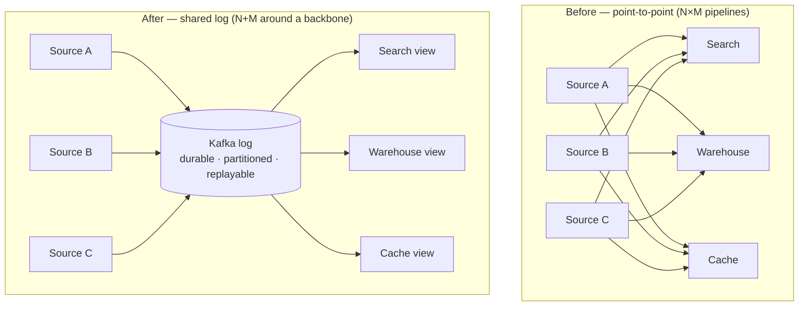
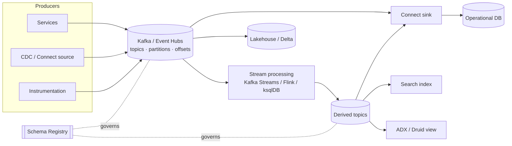
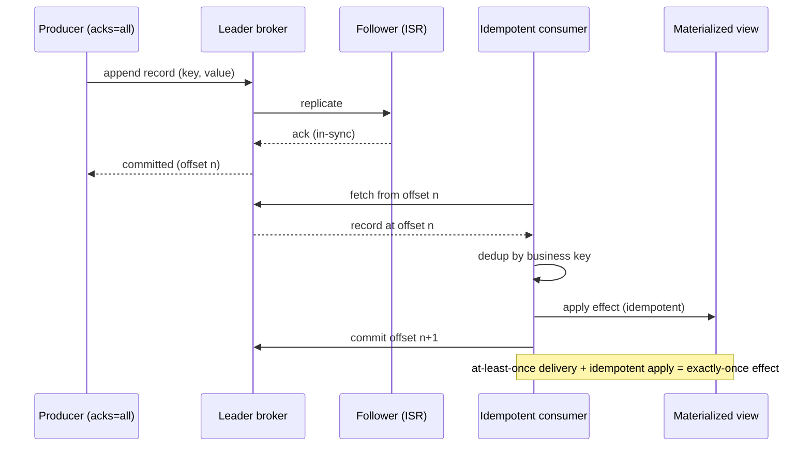

# LinkedIn and the Birth of Kafka

> Part of the **Enterprise Data & AI Architecture Handbook** — Resources / CaseStudies, Chapter 05.
> A senior-level case study of how LinkedIn's data-integration crisis produced **Apache Kafka**, why the **log** turned out to be the unifying abstraction for real-time data, how Kafka grew into a stream-processing platform and an industry (Confluent), and which of those lessons transfer to an Azure-first enterprise. Grounded throughout in the streaming foundations of [Streaming Fundamentals](../../Phase-07/01_Streaming_Fundamentals.md), [Apache Kafka](../../Phase-07/02_Apache_Kafka.md), and [Streaming Patterns and Delivery Semantics](../../Phase-07/08_Streaming_Patterns_and_Delivery_Semantics.md).

---

## Executive Summary

LinkedIn is worth studying because it is the clearest public account of an organization that hit the **data-integration wall** head-on and, in solving its own problem, produced an abstraction that reorganized how the entire industry moves data. Around 2010 LinkedIn was a mid-sized social network drowning not in a single hard technical problem but in a combinatorial one: every new data system — a search index, a recommendation engine, a monitoring pipeline, a data warehouse, a caching tier, a graph store — needed to be fed from every source system, and each of those pipelines was built bespoke, point-to-point, with its own delivery semantics, its own failure modes, and its own on-call rotation. The number of pipelines was growing as the *product* of sources and destinations, not their sum, and it was strangling the company's ability to ship. The answer, built by a team led by **Jay Kreps** with **Neha Narkhede** and **Jun Rao**, was **Apache Kafka**: a distributed, durable, partitioned **commit log** that every source writes to once and every destination reads from independently, collapsing an `N×M` mesh of fragile pipelines into an `N+M` set of producers and consumers around a shared backbone.

The deeper contribution — the one that outlived any specific version of the software — was conceptual. In his 2013 essay *"The Log: What every software engineer should know about real-time data's unifying abstraction,"* Kreps argued that the humble append-only log is not an implementation detail but *the* primitive underlying databases (the write-ahead log), replication (ship the log), distributed consensus (agree on a log), and stream processing (transform a log into another log). If every important change in an organization is published to a durable, ordered, replayable log, then databases, search indexes, caches, and analytics systems are all just **materialized views** of that log, each free to fall behind and catch up at its own pace. This is the intellectual root of the **log-centric architecture** and of what Kreps later named the **Kappa architecture** — the idea, developed in [Streaming Patterns and Delivery Semantics](../../Phase-07/08_Streaming_Patterns_and_Delivery_Semantics.md), that you can serve both real-time and historical needs from a single replayable stream rather than maintaining parallel batch and streaming code paths.

Kafka was open-sourced through the Apache Software Foundation in 2011 and became a top-level project in 2012. The stream-processing layer followed — **Apache Samza** at LinkedIn, then the embeddable **Kafka Streams** library and **KSQL/ksqlDB** — and in 2014 the core team left to found **Confluent**, building a commercial platform and, with it, an entire "event streaming" product category. Today Kafka's wire protocol is a de-facto standard implemented far beyond the original codebase, including by **Azure Event Hubs**, which exposes a [Kafka-compatible endpoint](../../Phase-07/03_Azure_Event_Hubs_and_Stream_Analytics.md).

The transferable lesson, as with every case study in this collection, is the **shape of the discipline, not the stack**. LinkedIn built and operated Kafka at a scale — trillions of messages per day across thousands of brokers — that almost no enterprise shares, and it self-manages the clusters, the schema registry, the replication tooling (Brooklin, Cruise Control), and the operational muscle that goes with them. An Azure-first enterprise should reuse the *principles* — publish every important change once to a durable ordered log, treat downstream systems as independent replayable consumers, standardize schemas at the boundary, and make the log the organization's shared source of truth for change — while, in the overwhelming majority of cases, **refusing to self-operate a Kafka cluster** when a managed Kafka-protocol substrate absorbs the same workload with a fraction of the operational burden.

---

## Learning Objectives

After working through this case study you should be able to:

- explain the **data-integration problem** in precise terms — why point-to-point pipelines grow as `N×M` and why a shared log collapses them to `N+M` — and recognize the same crisis in your own estate before it becomes unmanageable;
- articulate the **log as a unifying abstraction**: why an append-only, ordered, durable, replayable log is the primitive underlying write-ahead logging, replication, consensus, and stream processing, connecting the argument to [Streaming Fundamentals](../../Phase-07/01_Streaming_Fundamentals.md);
- describe Kafka's core model — **topics, partitions, offsets, brokers, producers, consumer groups, the partition as the unit of ordering and parallelism** — as developed in depth in [Apache Kafka](../../Phase-07/02_Apache_Kafka.md), and explain why ordering is only ever guaranteed *within* a partition;
- reason precisely about **delivery semantics** (at-least-once, at-most-once, effectively-exactly-once via idempotent producers and transactions) and why idempotent consumption is the only durable path to correct effects, connecting to [Streaming Patterns and Delivery Semantics](../../Phase-07/08_Streaming_Patterns_and_Delivery_Semantics.md);
- explain the **log-centric / Kappa architecture** — databases, indexes, and caches as materialized views of one replayable log — and state honestly when it is and is not the right model versus a batch or Lambda approach;
- trace the evolution from **Kafka-as-transport** to **Kafka-as-platform** (Kafka Connect for integration, Samza/Kafka Streams/ksqlDB for processing, Schema Registry for governance) and explain what each layer added and why;
- translate each concept into a defensible **Azure-first equivalent** (Event Hubs' Kafka endpoint, Stream Analytics, Databricks Structured Streaming, ADX, a schema registry) and state where the translation is exact and where it is only approximate;
- write an **ADR** that states what to reuse from LinkedIn's Kafka journey, what to explicitly refuse to copy (self-operating a cluster at LinkedIn's scale), and the conditions under which self-managed Kafka is justified over a managed substrate.

---

## Business Motivation

LinkedIn's investment in Kafka came from an operational crisis, not a technology preference. Every driver below has a direct analogue in any organization growing past a handful of data systems.

- **The pipeline count was growing multiplicatively.** With `N` source systems and `M` destination systems, a point-to-point integration strategy requires up to `N×M` pipelines. LinkedIn had dozens of each, and every new system multiplied — not added to — the integration burden. This is the single fact that motivates everything else.
- **Each bespoke pipeline was a liability.** Every point-to-point connector had its own serialization format, its own retry and backpressure behavior, its own delivery guarantee, and its own failure modes. There was no shared notion of "what happened," only many inconsistent partial views.
- **Real-time and batch were diverging.** LinkedIn needed low-latency data for product features (activity feeds, "people you may know," search freshness) *and* high-throughput bulk movement into Hadoop for analytics. Maintaining two entirely separate integration stacks doubled the cost and guaranteed the two would disagree.
- **Monitoring and operational data had the same shape as product data.** Metrics, logs, and user activity events were all high-volume streams of immutable facts. Treating them with different, incompatible infrastructure was wasteful; they wanted one substrate for all event-like data.
- **The company's velocity depended on decoupling teams.** As long as adding a new consumer of user-activity data required coordinating with the producing team and building a new pipeline, teams were coupled and slow. The strategic goal was that a new system could subscribe to an existing stream *without the producer knowing or caring*.
- **Data volume was already enormous and revenue-relevant.** Activity data drove the core product (feed ranking, recommendations, search) and the analytics that ran the business. The freshness and reliability of that data was a first-class business concern, not plumbing.

Each of these produced a specific architectural response, and the responses are the substance of this case study.

---

## History and Evolution

LinkedIn's own engineering writing, and the founders' subsequent work at Confluent, document a journey from a point-to-point integration mess to a log-centric platform and, from there, to an industry.

- **Pre-2010 — the integration mess.** LinkedIn moved data with a patchwork of bespoke pipelines, batch-oriented ETL into a data warehouse, and ad-hoc messaging. Existing message queues (traditional JMS/AMQP brokers) were built for low-volume, per-message-acknowledged enterprise messaging and did not scale to the throughput, retention, and replay LinkedIn's activity data demanded; existing log-aggregation tools were built for offline consumption, not real-time serving.
- **~2010 — Kafka is built.** A team led by **Jay Kreps**, with **Neha Narkhede** and **Jun Rao**, built Kafka to be a high-throughput, horizontally-partitioned, durable **commit log** that decoupled producers from consumers. The design deliberately borrowed from the internals of databases (the log) and from filesystem economics (sequential disk I/O, the OS page cache, zero-copy transfer) rather than from the message-broker tradition.
- **2011 — open-sourced via Apache.** Kafka was released as open source and entered the Apache Incubator. Its name (a nod to the writer Franz Kafka) reflected the team's view of it as "a system optimized for writing."
- **2012 — Apache top-level project.** Kafka graduated to a top-level Apache project, and adoption spread quickly beyond LinkedIn.
- **2013 — "The Log" essay.** Jay Kreps published *"The Log: What every software engineer should know about real-time data's unifying abstraction,"* which reframed Kafka from "a better message queue" into the concrete implementation of a general principle: the log is the backbone of data integration and stream processing. This essay, more than any release, defined the movement.
- **2013 — Apache Samza.** LinkedIn built and open-sourced **Samza**, a stream-processing framework tightly integrated with Kafka (for transport) and YARN (for execution), introducing durable local state and the idea of stream processing as long-lived jobs consuming and producing Kafka topics.
- **2014 — Confluent is founded, and "Kappa" is named.** Kreps, Narkhede, and Rao left LinkedIn to found **Confluent**, a company built around Kafka. The same year, Kreps articulated the **Kappa architecture** as a deliberate simplification of the then-popular Lambda architecture: rather than maintaining separate batch and speed layers, serve everything from a single replayable log by reprocessing history when logic changes.
- **2015-2016 — Kafka Connect and Kafka Streams.** The ecosystem matured into a platform: **Kafka Connect** standardized source/sink integration (turning the `N+M` connector problem into reusable, configuration-driven connectors), and **Kafka Streams** delivered an *embeddable* stream-processing library — no separate cluster, just a JVM application — that made stream processing accessible without Samza's YARN dependency.
- **2017-2019 — KSQL/ksqlDB and Schema Registry maturity.** **KSQL** (later **ksqlDB**) added a SQL interface over Kafka Streams, and the **Confluent Schema Registry** with Avro/Protobuf/JSON-Schema became the standard way to govern the contracts flowing through topics.
- **2019-2023 — ZooKeeper removal (KRaft).** Kafka's dependence on an external **ZooKeeper** ensemble for metadata and controller election was replaced by **KRaft** (Kafka Raft), a self-managed consensus quorum inside Kafka itself — simplifying operations and improving metadata scalability. Tiered storage (offloading older log segments to object storage) followed, decoupling retention from broker disk.
- **The protocol becomes a standard.** Kafka's wire protocol is now implemented far beyond the Apache codebase — by **Azure Event Hubs**, by Redpanda, by WarpStream, and others — so "speaking Kafka" no longer implies running Apache Kafka brokers.

The arc is important: Kafka did not begin as a grand platform vision. It began as a scar from a specific, repeated, expensive problem — an `N×M` integration mesh growing faster than any team could maintain it — that no existing message broker or ETL tool could heal.

---

## Why This Technology Exists

Each part of the Kafka story exists to remove one specific cause of pain. Naming the cause is the only way to judge whether you share it.

- **Kafka (the log) exists** because point-to-point integration grows multiplicatively and no traditional message broker offered the throughput, retention, and independent-replay that activity-scale data demanded. A shared durable log lets every source publish once and every destination consume independently.
- **Partitioning exists** because a single ordered log cannot scale past one machine's throughput. Splitting a topic into partitions trades global ordering (which almost no workload actually needs) for horizontal scalability and per-key ordering (which most workloads do need).
- **Consumer groups exist** because the same stream must serve many independent consumers at different paces — a real-time feature, a batch load into Hadoop, a monitoring sink — without any of them interfering with the others or with the producer.
- **Long retention and replay exist** because treating the log as durable *storage* (not a transient queue) is what makes downstream systems into materialized views: a new consumer, or a rebuilt index, can replay history from the beginning rather than needing a separate batch backfill path.
- **Kafka Connect exists** because even `N+M` connectors are wasteful if every team hand-builds them; standardized, configuration-driven, restartable connectors turn integration into a solved, reusable problem.
- **Kafka Streams / Samza / ksqlDB exist** because once data is a log, the natural next question is transforming one log into another (joins, aggregations, windowing) — and doing so with durable state and exactly-once semantics rather than bespoke consumer code.
- **The Schema Registry exists** because a shared log without shared, evolvable contracts is just a shared way to produce incompatible data; enforcing schema compatibility at the boundary is what keeps the backbone trustworthy.

If you do not share these causes — if you have three systems, one integration pattern, and an event volume a single managed service absorbs without thought — then most of this machinery is over-engineering, and this case study's ADR says so explicitly.

---

## Problems It Solves

- **The `N×M` integration explosion.** A shared log collapses point-to-point pipelines into `N` producers and `M` consumers around one backbone, so each new system adds one integration, not `N` or `M`.
- **Producer-consumer coupling in time and failure domain.** A durable log decouples producers from consumers: a slow, failed, or newly-added consumer never backpressures or blocks event collection, and consumers read at their own pace.
- **The batch-versus-real-time duplication.** A single replayable log serves both low-latency consumers and high-throughput bulk loads, removing the need for two parallel integration stacks that inevitably disagree.
- **Loss of history / no replay.** Treating the log as durable storage lets a new or rebuilt consumer replay from any offset, turning "backfill" from a separate ETL project into a matter of resetting an offset.
- **Ordering at scale.** Per-partition ordering gives strict ordering *where it matters* (per key) while allowing horizontal scale-out, resolving the tension between ordering and throughput.
- **Integration boilerplate.** Kafka Connect turns source/sink integration into reusable, configuration-driven, fault-tolerant connectors instead of bespoke per-team code.
- **Stream transformation with correct state.** Kafka Streams / ksqlDB provide durable, partitioned local state and effectively-exactly-once processing, so joins and aggregations survive failures without hand-rolled checkpointing.
- **Contract drift on the backbone.** A schema registry enforces compatibility rules at produce time, so the shared log stays trustworthy as producers evolve independently.

---

## Problems It Cannot Solve

- **It cannot provide true unconditional exactly-once *delivery*.** Kafka provides at-least-once delivery and *effectively-exactly-once processing* within Kafka via idempotent producers and transactions; end-to-end exactly-once *effects* across external systems still require **idempotent consumers**. Assuming the transport dedupes for you is the classic, expensive mistake.
- **It cannot give global ordering across a topic.** Ordering is guaranteed only within a partition. Any design that assumes total ordering across a multi-partition topic is broken; ordering must be scoped to a partition key.
- **It cannot fix a bad partition-key choice.** A key that concentrates volume on one partition (a "hot partition") caps throughput at one broker regardless of cluster size, exactly as covered in [Apache Kafka](../../Phase-07/02_Apache_Kafka.md).
- **It cannot make itself operationally free.** Self-managed Kafka is a serious operational commitment — broker sizing, partition rebalancing, replication, ZooKeeper/KRaft quorum health, consumer-lag monitoring, upgrades. Underestimating this is the most common way self-hosting goes wrong.
- **It cannot be a system of record for point queries.** Kafka is a log, not a database; it is optimized for sequential append and range consumption, not random key lookups or updates. Downstream materialized views (a database, an index) serve queries.
- **It cannot substitute for modeling.** A log of poorly-designed events (missing keys, ambiguous semantics, absolute values where deltas are needed) produces a shared way to spread bad data. The event schema *is* the contract.
- **It cannot make a small organization's problems big enough to justify it.** For a handful of systems, a shared log's operational and cognitive weight can exceed the fragmentation it prevents; a lighter queue or a managed substrate may be the right-sized answer.

---

## Core Concepts

### 5.1 The data-integration problem and the `N×M` → `N+M` collapse

The founding insight is arithmetic. With point-to-point integration, connecting `N` sources to `M` destinations requires up to `N×M` pipelines, each independently built and operated. Insert a durable shared log in the middle and the topology becomes `N` producers plus `M` consumers — `N+M` — with the log absorbing the fan-out. The log is not merely a message bus; it is the **organizing principle** that makes the integration cost additive rather than multiplicative. Every other Kafka concept exists to make this shared log fast, durable, ordered-enough, and independently-consumable.

### 5.2 The log as a unifying abstraction

An **append-only, totally-ordered, durable log** is the primitive Kreps argued underlies the whole data stack. A database's **write-ahead log** *is* the authoritative record of changes; the table is a cache of the log's latest values. **Replication** is shipping one machine's log to another and replaying it. **Consensus** (Paxos/Raft) is a protocol for agreeing on the contents of a log. **Stream processing** is a function that consumes one log and produces another. If every meaningful change in an organization is published to a shared log, then databases, search indexes, and caches become **materialized views** — each derived deterministically from the log, each free to lag and catch up. This reframing, developed in [Streaming Fundamentals](../../Phase-07/01_Streaming_Fundamentals.md), is the conceptual core of the entire case study.

### 5.3 Topics, partitions, offsets — ordering and parallelism

A **topic** is a named log. It is split into **partitions**, each an independent ordered sequence of records addressed by a monotonically increasing **offset**. The partition is simultaneously the **unit of ordering** (records within a partition are strictly ordered) and the **unit of parallelism** (partitions of a topic are consumed independently and in parallel). The producer's **partition key** determines which partition a record lands in, and therefore which records are ordered relative to each other. This design — detailed in [Apache Kafka](../../Phase-07/02_Apache_Kafka.md) — is why "Kafka guarantees ordering" is always shorthand for "**within a partition**," and why key selection is the single most consequential design decision.

### 5.4 Brokers, producers, and consumer groups

A **broker** is a Kafka server that stores partition data and serves reads and writes; a cluster is a set of brokers. **Producers** append records to partitions. **Consumers** read them; a **consumer group** is a set of cooperating consumers that divide a topic's partitions among themselves so each partition is processed by exactly one member, giving horizontal consumer scaling with automatic rebalancing on membership change. Multiple *independent* groups each get their own full copy of the stream at their own offset — this is what lets a real-time feature, a Hadoop loader, and a monitoring sink all consume the same topic without interfering.

### 5.5 Log-centric (Kappa) architecture and delivery semantics

The **log-centric / Kappa architecture** treats the durable log as the single source of truth from which all serving systems are derived, and handles "reprocess history because the logic changed" by *replaying the log through new code*, rather than maintaining a separate batch layer (the Lambda approach). Its viability rests on **delivery semantics**: Kafka delivers **at-least-once** by default, offers **idempotent producers** and **transactions** for effectively-exactly-once *within Kafka*, but correct end-to-end *effects* still require **idempotent consumers**. These trade-offs, and the Lambda-versus-Kappa decision, are developed in [Streaming Patterns and Delivery Semantics](../../Phase-07/08_Streaming_Patterns_and_Delivery_Semantics.md).

---

## Internal Working

### 6.1 Why the log is fast: sequential I/O, page cache, zero-copy

Kafka's throughput comes from refusing to fight the operating system. Records are **appended sequentially** to a per-partition segment file, and sequential disk writes are orders of magnitude faster than random ones. Reads are served largely from the **OS page cache** rather than a JVM-managed cache, so Kafka avoids duplicating data and garbage-collection pressure. Delivery to consumers uses **zero-copy** (`sendfile`) to move bytes from the page cache to the network socket without copying through user space. Records are batched and optionally compressed end-to-end (the broker stores the compressed batch and ships it compressed). The result is a system whose per-broker throughput is bounded by disk and network sequential bandwidth, not by per-message CPU — the economic basis for treating the log as durable storage, not a transient queue.

### 6.2 Replication, the ISR, and durability guarantees

Each partition has a **leader** replica and zero or more **follower** replicas on other brokers. Producers write to the leader; followers pull to stay current. The set of replicas caught up to the leader is the **in-sync replica (ISR)** set. The producer's `acks` setting chooses the durability/latency trade-off: `acks=0` (fire-and-forget, may lose data), `acks=1` (leader-only, loses data if the leader fails before replication), or `acks=all` (the leader waits for all ISR members, the durable choice). Combined with `min.insync.replicas`, `acks=all` guarantees a committed record survives the loss of up to `replicas − min.insync.replicas` brokers. This is Kafka's answer to the fault-tolerance and consistency questions raised in [Streaming Fundamentals](../../Phase-07/01_Streaming_Fundamentals.md): durability is a tunable property of the write, not a fixed guarantee.

### 6.3 Metadata, the controller, and the ZooKeeper → KRaft transition

A cluster needs agreement on which broker leads which partition, cluster membership, and configuration. Historically Kafka delegated this to an external **ZooKeeper** ensemble, and one broker acted as the **controller** managing leader elections. Operating a second distributed system (ZooKeeper) alongside Kafka was a persistent source of complexity and a scalability ceiling on the number of partitions. **KRaft** (Kafka Raft) removes ZooKeeper by running a **Raft consensus quorum inside Kafka itself** to manage metadata, with a set of controller nodes maintaining the metadata log. This simplifies deployment (one system, not two), speeds failover, and raises the practical partition-count ceiling — a direct example of the log-as-consensus principle from §5.2 turned inward on Kafka's own metadata.

---

## Architecture

At the architectural level, LinkedIn's log-centric platform is best understood as a **central nervous system** with a small number of planes:

- **Producers plane** — application services, database change-data-capture connectors, and instrumentation agents that publish immutable event and change records to topics. In LinkedIn's estate this included user-activity events, operational metrics, and database changelogs.
- **The log plane (Kafka)** — the durable, partitioned, replicated backbone. This is the source of truth for *change*: everything important that happens is written here once.
- **Stream-processing plane** — long-lived jobs (Samza, later Kafka Streams / ksqlDB) that consume topics, join and aggregate them with durable local state, and produce derived topics. This is where "one log becomes another log."
- **Serving / materialized-view plane** — the databases, search indexes, caches, OLAP stores, and the Hadoop data warehouse that each *subscribe* to the relevant topics and maintain themselves as materialized views of the log, each lagging and catching up independently.
- **Integration plane (Kafka Connect)** — standardized, restartable connectors that move data between external systems and the log without bespoke code, in both directions.
- **Governance plane (Schema Registry)** — the contract layer that validates and evolves the schemas of records on the backbone.

The defining property is that **no consumer knows or cares about any producer**. A new serving system is added by subscribing to an existing topic; the producing team is neither consulted nor affected. This decoupling — not any single component — is the architecture's value.

---

## Components

- **Broker.** Stores partition segments, serves produce/fetch requests, hosts partition leaders and followers.
- **Topic / partition / offset.** The named log, its parallel ordered shards, and the address of a record within a shard.
- **Producer.** Client that appends records, chooses partitions via a key, and selects durability via `acks`.
- **Consumer / consumer group.** Client(s) that read records and commit offsets; a group divides partitions among members for scaling.
- **Controller (KRaft quorum).** Manages partition leadership, membership, and metadata via internal Raft consensus.
- **Kafka Connect (source & sink connectors).** Configuration-driven, fault-tolerant integration workers for external systems.
- **Kafka Streams / ksqlDB.** Embeddable library / SQL layer for stateful stream transformation with exactly-once processing.
- **Schema Registry.** Stores and enforces Avro/Protobuf/JSON-Schema contracts and compatibility rules for topics.
- **MirrorMaker / Brooklin.** Cross-cluster and cross-datacenter replication (Brooklin was LinkedIn's own multi-source streaming/mirroring service).
- **Cruise Control.** LinkedIn-built cluster balancer that automates partition reassignment and broker load balancing at scale.

---

## Metadata

The log-centric model makes metadata a first-class asset, not an afterthought.

- **Cluster metadata** — the mapping of partitions to leaders and replicas, broker membership, and configuration — lives in the KRaft metadata log (formerly ZooKeeper). Its correctness and availability gate the entire cluster.
- **Schema metadata** — the contract for each topic — lives in the Schema Registry, versioned with compatibility rules (backward, forward, full). This is the metadata that keeps the shared backbone trustworthy as producers evolve.
- **Consumer-offset metadata** — each group's committed position per partition — is itself stored in an internal Kafka topic (`__consumer_offsets`), a neat application of "everything is a log." Offsets are what make replay and independent consumption possible.
- **Lineage and ownership metadata** — which service produces a topic, which systems consume it, and what it means — is exactly the information that becomes unknowable at scale without a catalog. In an enterprise translation this maps to a data catalog such as the one discussed in the governance sections below, and to the discovery discipline of [Streaming Patterns and Delivery Semantics](../../Phase-07/08_Streaming_Patterns_and_Delivery_Semantics.md).

The lesson: a shared log is only as governable as its metadata. Publishing everything to Kafka without schema governance and ownership metadata reproduces the integration mess *inside* the backbone.

---

## Storage

Kafka's most important architectural decision is that **the log is storage, not a buffer**.

- **Segmented, append-only files.** Each partition is a sequence of immutable **segment** files; writes append to the active segment, and closed segments are candidates for retention or compaction.
- **Retention policy.** Records are retained by **time** (e.g., 7 days) or **size**, independent of whether they have been consumed. Long retention is what makes replay and late-joining consumers possible.
- **Log compaction.** For changelog-style topics (where only the latest value per key matters — a database mirror, a materialized state), **compaction** retains the most recent record per key indefinitely while garbage-collecting superseded values, so the topic becomes a durable snapshot of current state plus recent history.
- **Tiered storage.** Modern Kafka offloads older segments to cheap **object storage** (e.g., ADLS/S3), decoupling retention from broker local disk. This lets an organization keep effectively unbounded history for replay without paying for it on broker SSDs — economically, it is what makes "the log is the source of truth forever" affordable.

The storage model is the difference between Kafka and a traditional queue: a queue deletes a message once acknowledged; Kafka keeps it for the retention window regardless, so consumption is a *reading position*, not a destructive dequeue.

---

## Compute

Compute in a log-centric platform is deliberately separated from storage of the log:

- **Broker compute** is mostly I/O orchestration — appending batches, serving fetches via zero-copy, managing replication. It is intentionally *thin*: brokers do not run user logic. This keeps the backbone stable and predictable.
- **Producer/consumer compute** lives in the applications, not the cluster. Backpressure, retries, and idempotency are client concerns.
- **Stream-processing compute** is where transformation happens. **Samza** ran as YARN-managed jobs with durable local state; **Kafka Streams** moved this into ordinary JVM applications (no cluster to manage — scaling is just running more instances of your app, and partitions are the unit of parallelism); **ksqlDB** runs Streams topologies behind a SQL surface. The key idea is **partitioned, co-located state**: each processing instance owns a subset of partitions and the local state (backed by a changelog topic for fault tolerance) for exactly those keys, so joins and aggregations are local and fast.

Separating broker compute (stable, thin) from processing compute (elastic, stateful, owned by teams) is what lets the backbone stay reliable while transformation logic evolves rapidly — the same storage/compute separation principle that runs through the lakehouse chapters of the handbook.

---

## Networking

- **Protocol.** Kafka speaks a custom **binary TCP protocol**, batched and pipelined for throughput. Its stability and openness are why the protocol became a de-facto standard implemented by non-Apache systems (Event Hubs, Redpanda, etc.).
- **Partition-aware routing.** Clients fetch cluster metadata and connect **directly to the leader broker** for each partition, avoiding a routing proxy in the hot path — a major throughput advantage, but one that means clients need network reachability to every broker.
- **Rack awareness and placement.** Replica placement can be made **rack-aware** so that a partition's replicas span failure domains (racks, availability zones), and consumers can **fetch from the nearest replica** to reduce cross-zone traffic and cost.
- **Cross-datacenter replication.** MirrorMaker 2 and LinkedIn's **Brooklin** move data between clusters and regions for disaster recovery, aggregation, and locality — a necessary but operationally heavy capability at LinkedIn's multi-datacenter scale.
- **Cost of chatty topologies.** Because clients talk directly to leaders across zones, careless placement produces expensive cross-zone network traffic; rack-aware placement and nearest-replica fetching are the levers, mirroring the networking-cost discussion in [Azure Event Hubs and Stream Analytics](../../Phase-07/03_Azure_Event_Hubs_and_Stream_Analytics.md).

---

## Security

A shared backbone that carries *every important change in the organization* is a concentrated, high-value target and a concentrated governance obligation.

- **Authentication.** Kafka supports **TLS mutual auth** and **SASL** mechanisms (SCRAM, GSSAPI/Kerberos, OAUTHBEARER). At LinkedIn's scale, integrating Kafka auth with the corporate identity system was essential.
- **Authorization.** Topic-level **ACLs** (and pluggable authorizers) control which principals may produce to or consume from which topics — the mechanism that prevents the shared log from becoming a shared free-for-all.
- **Encryption.** TLS **in transit** is standard; encryption **at rest** is handled at the storage layer (broker disk / tiered object storage). Field-level encryption for sensitive attributes is an application concern above Kafka.
- **The access-control-propagation obligation.** This is the recurring handbook lesson applied to streaming: if a topic carries records derived from an access-controlled source, the *downstream materialized views* (indexes, caches, warehouses) inherit the obligation to enforce the same access controls. A log makes propagation easy to forget precisely because it decouples producer from consumer — the very property that makes it valuable. Classification and entitlement must travel with the event contract, enforced at every consuming boundary, not assumed.
- **Auditability.** Because the log is durable and ordered, it is also an excellent **audit substrate** — the record of what happened is, by construction, retained and replayable.

---

## Performance

- **Throughput.** Kafka's per-broker throughput is bounded by sequential disk and network bandwidth, not per-message CPU, thanks to batching, compression, page-cache reads, and zero-copy. This is why LinkedIn could push activity-scale volumes through it.
- **Latency.** End-to-end latency is typically single-digit to low-tens of milliseconds, tunable against durability: `acks=all` and larger batches trade latency for durability and throughput; `linger.ms` and `batch.size` are the producer-side dials.
- **The ordering-versus-parallelism trade-off.** More partitions = more parallelism and throughput, but also more open file handles, more replication overhead, longer rebalances, and more metadata. Partition count is a capacity-planning decision, not a set-and-forget default.
- **Hot partitions.** A skewed key concentrates load on one partition/broker and caps throughput regardless of cluster size — the streaming instance of the data-skew problem covered in [Apache Kafka](../../Phase-07/02_Apache_Kafka.md). The fix is a better (compound or hashed) key, not more brokers.
- **Consumer lag as the key signal.** The health of a streaming platform is measured by **consumer lag** (how far behind the latest offset each group is). Rising lag means consumers cannot keep up — the first thing to watch, discussed under Monitoring below.

---

## Scalability

- **Horizontal by partition.** Producers, brokers, and consumers all scale by adding partitions and machines; the partition is the atomic unit of both storage distribution and consumer parallelism.
- **Independent consumer scaling.** Because each consumer group tracks its own offsets, adding a new consumer (a new serving system, a new analytics job) imposes only *read* load — it never affects producers or other consumers. This is the scalability property that made LinkedIn's team-decoupling goal achievable.
- **Retention decoupled from consumption.** With tiered storage, retention (and therefore replay depth) scales on cheap object storage rather than broker disk, so keeping long history no longer forces bigger brokers.
- **Metadata scalability.** Partition-count ceilings historically came from ZooKeeper metadata handling; **KRaft** raised those ceilings substantially, letting a single cluster host far more partitions.
- **Operational scalability is the real limit.** At LinkedIn's scale the binding constraint was not the software's ability to scale but the *human* ability to operate thousands of brokers — which is precisely why LinkedIn built automation (Cruise Control for rebalancing, Brooklin for replication) and why an enterprise without that automation should think hard before self-operating at scale.

---

## Fault Tolerance

- **Replication.** Partition replicas across brokers (and, with rack awareness, across availability zones) mean the loss of a broker or a zone does not lose committed data, provided `acks=all` and adequate `min.insync.replicas`.
- **Leader failover.** If a leader broker fails, the controller elects a new leader from the ISR; producers and consumers transparently reconnect to the new leader.
- **At-least-once by default.** On failure, records may be redelivered; **idempotent producers** (deduplicating by producer ID and sequence number) prevent duplicate *appends*, and **transactions** give atomic multi-partition writes, but correct *effects* on external systems still require **idempotent consumers**.
- **Consumer recovery via offsets.** A crashed consumer restarts from its last committed offset and reprocesses forward; combined with idempotent handling, this yields effectively-exactly-once end-to-end.
- **Stateful-processing recovery.** Kafka Streams / Samza back local state with a **changelog topic**, so a failed processing instance rebuilds its state by replaying the changelog on another instance — the log-as-recovery-mechanism principle again.
- **Disaster recovery.** Cross-cluster replication (MirrorMaker 2 / Brooklin) provides regional failover, though offset translation across clusters is a genuine operational subtlety.

---

## Cost Optimization

- **Right-size partitions.** Over-partitioning wastes memory, file handles, and replication bandwidth and slows rebalances; under-partitioning caps throughput. Size partitions to actual target throughput, not to a round number.
- **Tiered storage for long retention.** Offload old segments to object storage instead of keeping months of history on broker SSDs — the single biggest storage-cost lever for organizations that want deep replay.
- **Compression end-to-end.** Producer-side compression (zstd/lz4/snappy) reduces network *and* storage *and* replication cost because the broker stores and ships the compressed batch; it is almost always worth it.
- **Rack-aware placement and nearest-replica fetch.** Cut cross-zone network egress — often a dominant and under-monitored cost in cloud Kafka — by keeping replication and consumption zone-local where possible.
- **Consolidate clusters, but bound blast radius.** Fewer, larger clusters amortize operational cost but concentrate risk; the trade-off is a governance decision.
- **Prefer managed for most workloads.** *Worked example.* Self-operating a modest 6-broker HA Kafka cluster in the cloud carries the VM/disk cost **plus** the fully-loaded cost of the on-call engineering time to operate it (upgrades, rebalancing, incident response) — realistically several days of senior engineering per month once you count it honestly. A managed Kafka-protocol substrate (Event Hubs or a managed Kafka service) that absorbs the same throughput typically costs more in *service* fees but eliminates most of that operational labor. For the majority of enterprises whose volume is well within a managed tier, the *total cost of ownership* favors managed by a wide margin; self-hosting only wins at sustained very-high scale where the per-unit infrastructure saving finally exceeds the operational premium.

---

## Monitoring

- **Consumer lag** is the headline metric: the delta between the latest produced offset and each group's committed offset, per partition. Sustained or growing lag is the earliest sign consumers cannot keep up.
- **Broker health** — under-replicated partitions, offline partitions, ISR shrink/expand rate, request latency percentiles (p99 produce/fetch), disk and network utilization.
- **Controller/quorum health** — active-controller count (should be exactly one), metadata log lag on KRaft controllers.
- **Producer metrics** — batch size, compression ratio, record-error rate, retry rate.
- **Throughput and retention** — bytes in/out per topic, message rate, and disk headroom against the retention policy.
- **End-to-end freshness** — the age of the newest record a critical downstream view has processed, which ties broker metrics back to a business SLO. This is the streaming counterpart of the freshness-SLO discipline in [Streaming Patterns and Delivery Semantics](../../Phase-07/08_Streaming_Patterns_and_Delivery_Semantics.md).

---

## Observability

Monitoring answers "is a known metric within threshold?"; observability answers "why is this behaving strangely?" — and a log-centric platform has a distinctive observability property and a distinctive risk.

- **The log is itself an observability substrate.** Because every change is a durable, ordered, replayable record, you can *reconstruct exactly what happened* by replaying the relevant topics — a capability bespoke pipelines rarely offer. Post-incident, "replay the log through an instrumented consumer" is a uniquely powerful debugging move.
- **End-to-end tracing across the async boundary is the hard part.** A request that crosses from a synchronous service into Kafka and out to a stream processor loses its trace context unless the context is **propagated in the record headers**. Without that, distributed traces break at the topic boundary and end-to-end latency becomes invisible — the exact failure mode developed in the observability chapters of Phase-18. Propagating W3C trace context through Kafka headers and correlating producer, broker, and consumer spans is what makes the platform observable rather than just monitored.
- **Schema-registry-driven decoding.** Because records carry a schema ID, observability tooling can decode any topic's records without bespoke parsers — the schema registry doubles as an observability enabler.
- **Lag-by-partition, not just lag-by-group.** Aggregate group lag hides a single hot or stuck partition; observability requires per-partition visibility to distinguish "consumer is slow overall" from "one partition is stuck."

---

## Governance

- **Schema governance is non-negotiable.** A shared backbone without enforced, evolvable contracts is a shared way to produce incompatible data. The Schema Registry with a defined **compatibility policy** (backward-compatible additive changes as the default) is the governance foundation — the streaming instance of the data-contract discipline.
- **Topic ownership and naming.** Every topic needs a named owning team, a documented meaning, and a naming convention that encodes domain and data classification; without this, "who owns this topic and what does it mean?" becomes unanswerable at scale — LinkedIn's original integration mess reappearing inside the log.
- **Classification propagation.** Data classification (PII, confidential) must be attached to the event contract and **propagated to every downstream materialized view**, so a consumer building an index or a warehouse table inherits the correct handling. This is the recurring access-control-propagation lesson, applied to streaming.
- **Retention and erasure.** Right-to-be-forgotten is structurally awkward on an append-only log: you cannot surgically delete one person's record from an immutable segment cheaply. The standard patterns are **log compaction with tombstones** (for keyed changelog topics) and **crypto-shredding** (encrypt per-subject, destroy the key on erasure) — the immutability-versus-erasure tension covered in the event-sourcing material of the handbook.
- **Lineage.** Because consumers are decoupled from producers, lineage (which topics feed which systems) must be actively catalogued, not inferred — a job for a data catalog integrated with the schema registry.

---

## Trade-offs

- **Shared backbone vs. concentrated risk.** One log for all change is enormously simplifying but concentrates a huge blast radius; it must be operated and secured accordingly.
- **Ordering vs. scalability.** Partitioning buys horizontal scale at the cost of global ordering; you get per-key ordering, and any design needing more must be rethought.
- **Durability vs. latency.** `acks=all` and replication buy durability at the cost of write latency; the right point depends on the data's value.
- **At-least-once simplicity vs. exactly-once complexity.** At-least-once + idempotent consumers is simpler and more robust than chasing transactional exactly-once for every path; reserve transactions for where they genuinely pay.
- **Retention/replay power vs. storage cost and governance load.** Long retention enables replay and late consumers but costs storage and complicates erasure; tiered storage mitigates the cost but not the governance obligation.
- **Kappa simplicity vs. Lambda familiarity.** A single replayable log removes duplicated batch/speed code but demands that *all* logic be expressible as stream reprocessing and that history be retained deep enough to replay — not always true.
- **Self-managed control vs. managed operational relief.** Running your own Kafka gives maximum control and, at extreme scale, the best unit economics; a managed substrate gives most of the value with a fraction of the operational burden. For most enterprises the latter wins.

---

## Decision Matrix

Use a **shared log (Kafka-model)** backbone when:

- you have (or clearly will have) **multiple producers and multiple independent consumers** of the same event data — the `N×M` condition;
- consumers need to **replay history** or join the stream late, making durable retention (not a transient queue) essential;
- you need **per-key ordering at high throughput**, which partitioned logs provide and traditional queues do not;
- you want to **decouple teams** so new consumers are added without touching producers;
- both **real-time and bulk/analytical** consumers must be served from one source of truth.

Prefer a **simpler queue or managed message bus** (Service Bus / SQS-style) when:

- you have **one producer and one consumer** and need work-queue semantics (per-message ack, competing consumers) rather than a replayable log;
- you need **transactional, ordered, low-volume** enterprise messaging with dead-lettering more than you need replay and throughput;
- your volume is modest and the operational or cognitive weight of a log backbone exceeds the fragmentation it would prevent.

Prefer **managed Kafka-protocol (Event Hubs / managed Kafka)** over **self-hosted Apache Kafka** unless:

- your sustained scale is high enough that self-hosting's per-unit infrastructure saving decisively beats the operational premium, **and** you have a funded platform team with real Kafka operational depth; **or**
- you need a specific capability or deployment topology the managed service does not offer.

---

## Design Patterns

- **Log as source of truth / materialized views.** Publish every change to the log once; treat databases, indexes, and caches as independently-rebuildable materialized views of it.
- **Change Data Capture to the log.** Stream database changelogs into Kafka (via Connect/Debezium) so downstream systems consume changes rather than polling — the pattern developed in [Change Data Capture](../../Phase-07/06_Change_Data_Capture.md).
- **Event carried state transfer vs. event notification.** Decide deliberately whether events carry full state (consumers need nothing else) or just a notification (consumers fetch details) — a contract-design decision with major coupling consequences.
- **Idempotent consumer.** Make every consumer safe to reprocess (dedup by a business key or event ID), turning at-least-once delivery into exactly-once effects.
- **Compacted changelog topic.** Use log compaction for topics that represent current state per key (a table mirror), so the topic is a durable snapshot plus recent history.
- **Outbox pattern.** Write business state and the event to publish in one local transaction to an outbox table, then relay to Kafka — avoiding the dual-write inconsistency between a database and the log.
- **Kappa reprocessing.** Handle logic changes by replaying the retained log through new code into a new output topic/table, then cutting over — no separate batch layer.
- **Dead-letter topic.** Because Kafka has no native DLQ, route unprocessable records to an explicit dead-letter *topic* by application convention, with monitoring on it.

---

## Anti-patterns

- **Assuming exactly-once delivery.** Treating the transport as deduplicating and skipping idempotent consumers — the single most common and expensive Kafka mistake.
- **Assuming global ordering.** Designing logic that needs total order across a multi-partition topic; ordering is per-partition only.
- **Bad partition keys.** Keys that concentrate volume (hot partitions) or that don't group the records that must be ordered together.
- **Using Kafka as a database.** Expecting random point lookups or updates from the log instead of maintaining a serving materialized view.
- **Publishing without schema governance.** A shared log without an enforced schema-compatibility policy reproduces the integration mess inside the backbone.
- **Unbounded, unowned topics.** Topics with no owner, no documented meaning, and default retention — the discoverability collapse LinkedIn built Kafka to escape, recreated within Kafka.
- **Dual writes.** Writing to a database and to Kafka in two separate operations and hoping they stay consistent; use the outbox pattern instead.
- **Self-operating at scale without the muscle.** Standing up self-managed Kafka clusters without the automation and on-call depth LinkedIn had to build — signing up for LinkedIn's operational burden without LinkedIn's operational investment.

---

## Common Mistakes

- **Under-monitoring consumer lag**, so a falling-behind consumer is discovered only when a downstream view is visibly stale.
- **Setting `acks=1` (or `0`) for data that matters**, then losing records on a leader failure.
- **Over-partitioning "to be safe,"** paying in rebalance time, memory, and metadata overhead for parallelism never used.
- **Ignoring the async trace-context gap**, so end-to-end latency and errors become invisible at the topic boundary.
- **Treating retention as infinite for free**, then being surprised by broker disk pressure — before adopting tiered storage.
- **Forgetting classification propagation**, so PII flows into downstream indexes and warehouses without the source's access controls.
- **Choosing self-hosted Kafka by default** because it's the famous name, without honestly costing the operational burden against a managed substrate.
- **Modeling events as CRUD table dumps** rather than meaningful domain facts, producing a shared log of low-value, ambiguous records.

---

## Best Practices

- **Publish every important change once, to a well-governed topic**, and treat all serving systems as materialized views of it.
- **Choose partition keys deliberately** for both even distribution and correct per-key ordering; treat the key as a first-class design decision.
- **Default to `acks=all` with `min.insync.replicas ≥ 2`** for data that matters, and make consumers idempotent so at-least-once yields exactly-once effects.
- **Enforce a schema-compatibility policy** (backward-compatible additive changes) via a registry, and gate producers on it in CI.
- **Give every topic an owner, a documented meaning, a naming convention, and a classification**, catalogued for discovery and lineage.
- **Propagate classification and trace context in record headers** so governance and observability survive the async boundary.
- **Adopt tiered storage and end-to-end compression** to make deep retention and replay affordable.
- **Monitor consumer lag per partition and end-to-end freshness against an SLO**, not just aggregate broker health.
- **Prefer a managed Kafka-protocol substrate** unless sustained scale and a funded platform team genuinely justify self-hosting.

---

## Enterprise Recommendations

For a typical Azure-first enterprise adopting log-centric principles:

- **Adopt the *principle*, right-size the *implementation*.** Reuse LinkedIn's insight — publish change once to a durable ordered log; derive everything downstream — but implement it on a managed substrate ([Azure Event Hubs](../../Phase-07/03_Azure_Event_Hubs_and_Stream_Analytics.md) with its Kafka endpoint, or a managed Kafka service) rather than a self-operated cluster, unless a specific, funded, high-scale case says otherwise.
- **Start from the integration pain, not the technology.** Introduce the log where you actually have an `N×M` problem (multiple producers and multiple independent consumers), not everywhere; a single point-to-point path does not need a backbone.
- **Establish schema governance from day one.** Stand up a schema registry and a compatibility policy before topics proliferate; retrofitting governance onto an ungoverned backbone is expensive.
- **Make idempotent consumption a platform default.** Provide a paved-road consumer template with idempotency, dead-letter routing, offset management, and trace-context propagation built in, so every team inherits correctness.
- **Catalogue topics with owners, meanings, and classifications**, integrated with the enterprise data catalog, so the backbone stays governable as it grows.
- **Decide Kappa vs. batch explicitly per workload.** Use log replay for workloads whose logic genuinely fits stream reprocessing and whose history is retained deep enough; keep batch where it is simpler.

---

## Azure Implementation

An Azure-first translation of LinkedIn's log-centric platform, keeping the principles and swapping the self-operated stack for managed services:

- **The log plane → Azure Event Hubs (Kafka endpoint).** [Event Hubs](../../Phase-07/03_Azure_Event_Hubs_and_Stream_Analytics.md) exposes a **Kafka-protocol-compatible endpoint**, so Kafka clients, Connect connectors, and Streams applications can produce and consume against it with minimal change, while Microsoft operates the brokers, replication, and scaling. Partitions, consumer groups, and retention map directly; **Event Hubs Capture** lands raw events into ADLS Gen2 for replay and archival. This is the closest managed analogue and the default recommendation.
- **Self-managed Kafka where genuinely required → HDInsight Kafka or Kafka on AKS.** For workloads that truly need Apache Kafka features Event Hubs does not offer (specific Connect ecosystems, exact Streams/ksqlDB behavior, particular configs), run **Confluent/Apache Kafka on AKS** or HDInsight — accepting the operational burden deliberately, not by default.
- **Stream-processing plane → Azure Stream Analytics, Databricks Structured Streaming, or managed Flink.** [Stream Analytics](../../Phase-07/03_Azure_Event_Hubs_and_Stream_Analytics.md) provides SQL-over-streams (a ksqlDB analogue) for lighter workloads; [Spark Structured Streaming on Databricks](../../Phase-07/05_Spark_Structured_Streaming.md) and [Apache Flink](../../Phase-07/04_Apache_Flink.md) handle heavy stateful processing with exactly-once semantics.
- **Serving / materialized-view plane → ADLS Gen2 + Delta, Azure Data Explorer, Azure SQL / Cosmos DB, Azure AI Search.** Downstream views subscribe to Event Hubs and maintain themselves: Delta tables via Structured Streaming for the lakehouse, **ADX** for real-time analytics (a serving-store analogue to Pinot/Druid, per [Real-Time Analytics](../../Phase-07/07_Real_Time_Analytics_ClickHouse_and_Druid.md)), Cosmos DB/Azure SQL for operational reads, AI Search for indexes.
- **Integration plane → Kafka Connect against the Event Hubs endpoint, or Azure Data Factory / Debezium for CDC.** [Change Data Capture](../../Phase-07/06_Change_Data_Capture.md) into the log uses Debezium (via the Kafka endpoint) or ADF, turning database changelogs into topics.
- **Governance plane → Azure Schema Registry (in Event Hubs) + Microsoft Purview.** Event Hubs includes a **Schema Registry** for Avro/JSON contracts and compatibility; **Purview** supplies cataloguing, classification, and lineage across the estate.
- **Security → Entra ID + Private Link.** Managed identity / Entra ID authentication, RBAC on Event Hubs namespaces and hubs, and Private Link for network isolation replace self-managed SASL/ACL/TLS operational toil.

The translation is *exact* for the log, partitions, consumer groups, retention, and Kafka-protocol clients; it is *approximate* for the deepest Kafka-native features (some Connect connectors, exact ksqlDB semantics), which is precisely where the "self-manage only if genuinely required" judgment applies.

---

## Open Source Implementation

A fully open-source, cloud-portable realization of the same architecture:

- **Log plane:** Apache Kafka (or protocol-compatible Redpanda / WarpStream), with **KRaft** (no ZooKeeper) and **tiered storage** to object storage (MinIO/S3/ADLS).
- **Integration:** **Kafka Connect** with **Debezium** for CDC and community source/sink connectors.
- **Processing:** **Kafka Streams** (embeddable) or **ksqlDB** for SQL-over-streams; **Apache Flink** for heavy stateful/event-time processing; **Apache Samza** remains of historical and some production interest.
- **Governance:** **Confluent/Apicurio Schema Registry** with a compatibility policy; **OpenMetadata** or **Apache Atlas** for catalog and lineage.
- **Cluster operations:** **Cruise Control** (LinkedIn's own, open-sourced) for automated rebalancing; **Strimzi** to run Kafka on Kubernetes declaratively; **MirrorMaker 2** or **Brooklin** for cross-cluster replication.
- **Observability:** JMX metrics → **Prometheus** + **Grafana**, with consumer-lag exporters (Burrow / Kafka Lag Exporter) and OpenTelemetry trace-context propagation through record headers.

This stack is fully portable across clouds — the whole point of the open protocol — but it re-imports the operational burden the Azure-managed translation removes. The choice between them is the ADR below.

---

## AWS Equivalent (comparison only)

- **Amazon MSK (Managed Streaming for Apache Kafka)** runs *actual Apache Kafka* as a managed service — the closest managed analogue to self-hosted Kafka, preserving full Kafka feature and connector compatibility while AWS operates the brokers.
- **Amazon Kinesis Data Streams** is AWS's *proprietary* log/streaming service — conceptually very close to Kafka (shards ≈ partitions, sequence numbers ≈ offsets, retention + replay) but with its own API rather than the Kafka protocol.
- **Advantages:** MSK gives real Kafka with less operational burden; Kinesis is deeply integrated with the AWS ecosystem (Lambda triggers, Firehose to S3/Redshift) and is fully serverless in its on-demand mode.
- **Disadvantages:** MSK still exposes meaningful operational surface (sizing, some rebalancing); Kinesis's proprietary API is a lock-in and lacks the broad Kafka connector/Streams ecosystem.
- **Migration strategy:** From self-hosted Kafka, MSK is a near-drop-in (same protocol); Kinesis requires re-writing producer/consumer integration to its API. Choose MSK for Kafka-ecosystem fidelity, Kinesis for deepest AWS-native integration.
- **Selection criteria:** Kafka-protocol portability and connector ecosystem → MSK; serverless simplicity and tight AWS integration with modest lock-in tolerance → Kinesis.

---

## GCP Equivalent (comparison only)

- **Google Cloud Pub/Sub** is GCP's fully-managed, serverless, *proprietary* messaging/streaming service — global by default, auto-scaling, with no partitions or capacity to manage — but its model is pub/sub messaging with acknowledgment, not a partitioned replayable log with offsets (though **Pub/Sub Lite** and seek-to-timestamp add log-like replay).
- **Google Cloud Managed Service for Apache Kafka** (a more recent offering) provides *actual managed Kafka* on GCP, the direct MSK analogue.
- **Advantages:** Pub/Sub's serverless global scaling removes all partition/capacity planning and integrates tightly with Dataflow (Apache Beam) and BigQuery; Managed Kafka gives protocol fidelity.
- **Disadvantages:** Pub/Sub's proprietary model and weaker native ordering/replay story make it a less exact Kafka analogue; the fully-managed Kafka offering is newer and less battle-tested than MSK.
- **Migration strategy:** From Kafka, the managed Kafka service is near-drop-in; moving to Pub/Sub means re-modeling around its messaging semantics and using Dataflow for processing.
- **Selection criteria:** zero-ops global serverless with GCP-native analytics (Dataflow/BigQuery) and lock-in tolerance → Pub/Sub; Kafka-protocol portability → Managed Kafka.

---

## Migration Considerations

- **Fully portable:** the **Kafka wire protocol**, producer/consumer application code, Connect connectors, Streams/ksqlDB topologies, Avro/Protobuf schemas, and the *architectural principles* (log as source of truth, materialized views, idempotent consumers). Because the protocol is a standard, moving between Apache Kafka, MSK, Event Hubs' Kafka endpoint, and managed Kafka is largely a connection-string-and-auth change.
- **Not portable:** proprietary APIs (Kinesis, Pub/Sub) require re-writing integration code; some Connect connectors and exact ksqlDB semantics may not exist on a managed substrate; cross-cluster **offset translation** during replication is a genuine subtlety.
- **From self-hosted to managed:** the dominant migration is *offloading operations* — repointing clients to a managed Kafka-protocol endpoint while keeping the same code. The hard parts are auth/network reconfiguration, migrating consumer offsets, and validating that any deep Kafka feature you relied on is supported.
- **From batch integration to log-centric:** the bigger, more valuable migration is conceptual — moving from `N×M` point-to-point pipelines to publish-once-consume-many. Do it incrementally: introduce the log for one high-`N×M` domain, prove the decoupling, and expand, rather than a big-bang re-platform.
- **The retained-history obligation:** a Kappa/replay strategy is only as deep as your retention; migrating to it requires deciding (and paying for, via tiered storage) how much history the log must hold to serve reprocessing.

---

## Mermaid Architecture Diagrams

**Diagram 1 — The `N×M` → `N+M` collapse (the founding insight):**

**Diagram 2 — Log-centric reference architecture (planes):**

**Diagram 3 — Produce/replicate/consume with offsets and idempotency (sequence):**

---

## End-to-End Data Flow

Tracing a single user-activity event from creation to serving, log-centric style:

1. **Emit.** A user action (a profile view, a connection request) produces an event in an application service.
2. **Contract check.** The producer serializes the event against its registered schema; the **schema registry** validates compatibility, rejecting an incompatible producer at the boundary rather than corrupting the log.
3. **Publish.** The producer appends the event to a topic partition chosen by the **partition key** (e.g., member ID, so all events for one member are ordered), with `acks=all` for durability.
4. **Replicate & commit.** The leader broker replicates to in-sync followers; once committed, the record has a durable **offset** and survives broker loss.
5. **Fan-out to independent consumers.** Multiple **consumer groups** read the same partition independently: a real-time feed-ranking consumer, a Structured Streaming job loading the lakehouse, and a monitoring sink — each at its own offset, none affecting the others or the producer.
6. **Transform.** A stream processor joins the event stream with a compacted profile-state topic and aggregates it, writing a **derived topic** — one log becoming another.
7. **Materialize.** Sink connectors and streaming jobs maintain downstream **materialized views**: a search index, an ADX real-time-analytics table, a Delta table in the lakehouse, each rebuildable by replaying from an offset.
8. **Serve.** Product features and dashboards query the materialized views (not Kafka), while the log retains the history that makes any view rebuildable and any new consumer possible.
9. **Replay on change.** When ranking logic changes, the team replays the retained log through the new code into a new derived topic and cuts over — no separate batch backfill path.

At every hop, **classification and trace context travel in the record headers**, so governance and observability survive the async boundaries.

---

## Real-world Business Use Cases

- **Activity streams and feeds** — the original LinkedIn case: user actions as events feeding real-time feed ranking, notifications, and "people you may know."
- **Change Data Capture and database replication** — streaming database changelogs onto the log so caches, search indexes, and warehouses stay current without polling ([Change Data Capture](../../Phase-07/06_Change_Data_Capture.md)).
- **Real-time metrics and monitoring** — treating operational telemetry as event streams on the same backbone as product data.
- **Fraud and anomaly detection** — stateful stream processing over transaction/event streams with low latency.
- **Microservices integration / event-driven architecture** — services communicating via events on the log rather than synchronous point-to-point calls, decoupling teams.
- **Log/clickstream aggregation for analytics** — high-volume clickstream into the lakehouse and real-time OLAP for experimentation and personalization.
- **IoT and telemetry ingestion** — device event streams landing on a durable log for both real-time reaction and historical analysis.

---

## Industry Examples

- **LinkedIn** — the origin: trillions of messages per day across thousands of brokers, with in-house automation (Cruise Control, Brooklin) built specifically to operate Kafka at that scale.
- **Netflix** — an enormous Kafka user for its Keystone data pipeline, moving trillions of events per day for analytics and operational data.
- **Uber** — Kafka as the backbone of its real-time infrastructure (feeding Flink and Pinot), as detailed in the Uber data-infrastructure case study elsewhere in this collection.
- **Confluent** — the company founded by Kafka's creators, which turned Kafka into a commercial platform (Confluent Cloud, ksqlDB, connectors) and defined the "event streaming" category.
- **The protocol ecosystem** — Redpanda, WarpStream, and Azure Event Hubs implementing the Kafka protocol without the Apache brokers, evidence that the *protocol*, not the codebase, became the standard.
- **Pervasive enterprise adoption** — Kafka is standard infrastructure across finance (real-time risk, fraud), retail (clickstream, inventory), and telecom (network telemetry), a testament to how completely the log-centric idea won.

---

## Case Studies

**Case Study 1 — the exactly-once assumption that duplicated payments.**
A payments team built a consumer that applied a charge for each order-placed event, assuming Kafka delivered each event exactly once. During a broker failover, a batch of events was redelivered (at-least-once, exactly as designed), and because the consumer kept no dedup state, a subset of customers were **charged twice**. The incident traced to a category error — treating the *transport's* at-least-once delivery as if it were exactly-once *effects*. The fix was an **idempotent consumer**: dedup by a business idempotency key (order ID) in a durable store before applying the charge, so redelivery is a no-op. This is the streaming instance of the handbook's recurring "the fast/convenient assumption silently produces a wrong result" pattern — and the single most common Kafka mistake, which is why [Streaming Patterns and Delivery Semantics](../../Phase-07/08_Streaming_Patterns_and_Delivery_Semantics.md) treats idempotent consumption as non-negotiable.

**Case Study 2 — self-operating LinkedIn's stack at 1/10,000th of LinkedIn's scale.**
A mid-sized enterprise, inspired by LinkedIn's and Netflix's Kafka writing, stood up and self-operated a multi-broker Apache Kafka cluster (plus ZooKeeper, Schema Registry, MirrorMaker, and Connect) to move roughly **fifty events per second** for a handful of internal dashboards. The cluster consumed a two-to-three-person platform team's attention on upgrades, rebalancing, ZooKeeper quirks, and off-hours incidents — for a workload a single managed Event Hubs namespace on a basic tier would have absorbed without thought. The team had adopted LinkedIn's *operational burden* without LinkedIn's *scale* to justify it or its *automation* to tame it. Re-platforming onto the managed Kafka-protocol endpoint (repointing clients, migrating offsets, retiring the self-managed infrastructure) freed the team and cut total cost, keeping every log-centric *principle* while discarding the self-operation. This is the justification-before-adoption lesson: **copy the principle, right-size the implementation.**

### Architecture Decision Record (ADR-0218): Adopt Log-Centric Principles on a Managed Kafka-Protocol Substrate; Refuse to Self-Operate at LinkedIn's Scale by Default

**Context.** LinkedIn produced Kafka to solve an `N×M` data-integration crisis at a scale — trillions of messages/day, thousands of brokers, dedicated automation and on-call — that our enterprise does not share. The log-centric *principles* (publish change once to a durable ordered log, treat downstream systems as replayable materialized views, decouple teams, govern schemas, make consumers idempotent) are broadly and durably valuable. The self-operated *implementation* (running Apache Kafka clusters, ZooKeeper/KRaft quorums, replication and rebalancing tooling) is a serious, ongoing operational commitment justified only at sustained high scale with a funded platform team. Two failure modes bracket the decision: assuming exactly-once delivery (Case Study 1) and self-operating far below the scale that justifies it (Case Study 2).

**Decision.** We adopt the log-centric architecture with the following clauses:

1. **Log as source of truth.** Every important change is published once to a durable, ordered, partitioned log; databases, indexes, caches, and warehouses are maintained as independently-rebuildable materialized views of it — no new `N×M` point-to-point pipelines.
2. **Managed substrate by default.** We implement the log on a **managed Kafka-protocol service** (Azure Event Hubs' Kafka endpoint, or a managed Kafka service) unless a documented exception applies. Self-operated Apache Kafka requires an explicit, approved justification against the criteria below.
3. **Idempotent consumption is mandatory.** Every consumer is idempotent (dedup by a business key), so at-least-once delivery yields exactly-once *effects*. No design may assume exactly-once delivery or global cross-partition ordering.
4. **Schema governance at the boundary.** A schema registry with a backward-compatible-by-default compatibility policy gates producers in CI; the shared log is never an ungoverned free-for-all.
5. **Every topic is owned, meaningful, classified, and catalogued**, with classification and trace context propagated in record headers so governance and observability survive the async boundary.
6. **Deliberate partition-key and durability choices.** Keys are chosen for even distribution and correct per-key ordering; data that matters is produced with `acks=all` and `min.insync.replicas ≥ 2`.
7. **Retention/replay is a funded, explicit decision** (via tiered storage), sized to the depth of history any Kappa reprocessing genuinely requires — not defaulted.

**Self-operation is justified ONLY when** sustained scale is high enough that self-hosting's per-unit infrastructure saving decisively exceeds the fully-loaded operational cost, **and** a funded platform team with real Kafka operational depth exists, **or** a specific required Kafka-native capability is unavailable on the managed substrate. All three are re-validated annually.

**Consequences.** *Positive:* the integration cost becomes additive not multiplicative; teams decouple; downstream systems become rebuildable; correctness (idempotency) and governance (schemas, classification) are structural, not per-team; operational burden stays proportional to scale. *Negative / accepted:* a managed substrate may not expose every deep Kafka-native feature (some Connect connectors, exact ksqlDB semantics), and the idempotency/schema/ownership discipline is upfront work every producer and consumer must do. *Rejected alternatives:* (a) **self-operate Kafka by default** — rejected as importing LinkedIn's operational burden without LinkedIn's scale (Case Study 2); (b) **assume exactly-once delivery to skip idempotency** — rejected as a category error that produces silent wrong results (Case Study 1); (c) **keep point-to-point integration** — rejected as `N×M` unmaintainable; (d) **a proprietary streaming service (Kinesis/Pub/Sub) as the default** — reasonable but rejected as the default in favor of Kafka-protocol portability across clouds and the broad connector/Streams ecosystem.

---

## Hands-on Labs

- **Lab 1 — Feel the `N×M` collapse.** Wire three producers to three consumers point-to-point (nine hand-built paths), then re-implement via a single Kafka/Event Hubs topic with three independent consumer groups; measure the reduction in integration code and the effort to add a fourth consumer.
- **Lab 2 — Ordering and partition keys.** Produce keyed records to a multi-partition topic; observe per-partition ordering and demonstrate that cross-partition order is not preserved; deliberately create a hot partition with a skewed key and observe the throughput cap.
- **Lab 3 — At-least-once vs. exactly-once effects.** Build a consumer that applies a side effect; force redelivery (restart mid-batch) and observe duplicates; add an idempotency key and dedup store; re-run and observe exactly-once effects — reproducing Case Study 1 safely.
- **Lab 4 — Replay and materialized views.** Set long retention, load a Delta/ADX view from a topic, delete and rebuild the view purely by resetting the consumer offset to zero — proving the log is the source of truth.
- **Lab 5 — Schema evolution.** Register an Avro schema, publish records, evolve the schema with a backward-compatible additive change, and then attempt an incompatible change and watch the registry reject the producer.
- **Lab 6 — Managed vs. self-hosted.** Run the same producer/consumer code against both a self-hosted Kafka (via Strimzi/Docker) and the Event Hubs Kafka endpoint by changing only the connection string and auth — proving protocol portability and the operational-burden difference.

---

## Exercises

- Derive, for your own estate, the current `N×M` integration count and the `N+M` count a shared log would produce; quantify the difference.
- Given a topic that must preserve order per customer but scale across many customers, choose a partition key and justify it; identify a key choice that would create a hot partition.
- Explain, in one paragraph each, why Kafka provides at-least-once (not exactly-once) delivery and what an idempotent consumer must do to compensate.
- For three of your data flows, decide Kappa (log replay) vs. batch, and state the retention depth Kappa would require for each.
- Write the compatibility rules (backward/forward/full) you would enforce for a topic consumed by many independent teams, and justify the default.
- Identify one data flow in your organization where a *shared log is over-engineering* and a simple queue or managed bus is the right-sized answer; defend the choice.

---

## Mini Projects

- **Project A — A right-sized event backbone.** Stand up an Event Hubs namespace with a schema registry, publish one domain's change events, and maintain two independent materialized views (a Delta table and an ADX table) as consumer groups; add classification and trace context to headers; document topic ownership.
- **Project B — CDC to the log.** Use Debezium (against the Kafka endpoint) to stream a database's changelog into a compacted topic, and rebuild a downstream read model purely from the topic; demonstrate that a rebuilt consumer replays from offset zero.
- **Project C — Idempotent consumer library.** Build a small reusable consumer wrapper providing idempotent apply (business-key dedup), dead-letter-topic routing, offset management, and trace-context propagation, and use it in two different consumers.
- **Project D — Kappa reprocessing.** Retain a topic's history, change a stream-processing aggregation, replay the log through the new logic into a new derived topic, and cut a view over to it — with zero separate batch code.

---

## Capstone Integration

This case study integrates the entire Phase-07 streaming arc into one narrative. [Streaming Fundamentals](../../Phase-07/01_Streaming_Fundamentals.md) supplies the log, event-time, and delivery-semantics vocabulary that Kafka made concrete; [Apache Kafka](../../Phase-07/02_Apache_Kafka.md) supplies the topic/partition/offset/consumer-group mechanics that this study frames historically and architecturally; [Azure Event Hubs and Stream Analytics](../../Phase-07/03_Azure_Event_Hubs_and_Stream_Analytics.md) is the managed translation the ADR mandates by default; [Apache Flink](../../Phase-07/04_Apache_Flink.md) and [Spark Structured Streaming](../../Phase-07/05_Spark_Structured_Streaming.md) are the processing engines that turn one log into another; [Change Data Capture](../../Phase-07/06_Change_Data_Capture.md) is the pattern that gets database changes onto the log; [Real-Time Analytics with ClickHouse and Druid](../../Phase-07/07_Real_Time_Analytics_ClickHouse_and_Druid.md) is the serving materialized-view plane (ADX's analogue); and [Streaming Patterns and Delivery Semantics](../../Phase-07/08_Streaming_Patterns_and_Delivery_Semantics.md) supplies the idempotency, Lambda-vs-Kappa, and exactly-once-effects disciplines the ADR makes mandatory.

The unifying handbook thread, applied here: **the fast/convenient path must never make the decision the correct/governed path exists to make.** Assuming exactly-once delivery to skip idempotency, or copying LinkedIn's self-operated stack without LinkedIn's scale, are both instances of trusting the convenient shortcut over the durable discipline — the same lesson that runs from the golden-source discipline of the Financial case study to the medallion trust boundaries of the data-platform capstone. LinkedIn's real contribution was not a piece of software but a *reframing*: that a durable, ordered, replayable log is the organization's shared source of truth for change, from which everything else is derived. Reuse that reframing; right-size the machinery.

---

## Interview Questions

- Explain the `N×M` integration problem and how a shared log turns it into `N+M`. Why is that the founding insight of Kafka?
- What is a topic, a partition, and an offset? Why is ordering guaranteed only within a partition?
- What is a consumer group, and how does it differ from multiple independent consumers of the same topic?
- What delivery guarantee does Kafka provide by default, and what must a consumer do to achieve exactly-once *effects*?
- What is log compaction, and when would you use a compacted topic?
- Why is Kafka fast? Name three mechanisms and explain each.
- What is the difference between using Kafka as a queue and using it as durable storage / a source of truth?
- When would you choose a simple message queue over a Kafka-style log?

---

## Staff Engineer Questions

- Design the partition-key strategy for a multi-tenant event stream that must preserve per-tenant ordering while scaling across tenants of wildly different volumes. How do you avoid hot partitions?
- Walk through achieving exactly-once *effects* end-to-end across Kafka and an external database. Where do idempotent producers, transactions, and idempotent consumers each apply, and where does each stop?
- You must support both real-time and reprocessing-of-history for the same logic. Argue Kappa vs. Lambda for this workload, including the retention and cost implications of each.
- Trace context breaks at the Kafka boundary and end-to-end latency is invisible. Diagnose and design the fix.
- Design a schema-evolution and compatibility policy for a topic consumed by a dozen independent teams. What changes are safe, and how do you gate them in CI?
- Consumer lag is rising on one partition only. Enumerate the possible causes and how you'd distinguish them.

---

## Architect Questions

- Make the buy-vs-build case for self-managed Kafka vs. a managed Kafka-protocol substrate for a specific workload, quantifying the operational cost honestly. Where is the crossover?
- Design the governance model for a log that carries every important change in the organization: schema registry, topic ownership, classification propagation, retention, and right-to-be-forgotten.
- How does the log-centric model change your data architecture's source-of-truth and lineage story compared to a warehouse-centric batch model?
- Design cross-region disaster recovery for the log, including offset translation and the RPO/RTO trade-offs of active-passive vs. active-active replication.
- Where in your architecture does a shared log add value, and where does it add only cost? Draw the boundary and defend it.

---

## CTO Review Questions

- LinkedIn built Kafka at a scale almost no enterprise shares. What, concretely, are we reusing (principles) versus refusing to copy (self-operating at scale), and why?
- What is our organization's `N×M` integration cost today, and what would a log-centric backbone save — in engineering time, not just infrastructure?
- If we adopt a shared event backbone, it carries every important change we make. What is the blast radius, and how do we secure, govern, and operate a target that concentrated?
- Are we buying operational relief (managed substrate) or operational burden (self-hosted Kafka), and does our scale and team justify the choice we're making?
- How do we ensure the discipline (idempotent consumers, schema governance, classification propagation) is enforced as a platform default rather than left to each team to rediscover — including via the two failure modes in this study's case studies?

---

## References

- Jay Kreps, *"The Log: What every software engineer should know about real-time data's unifying abstraction"* (LinkedIn Engineering / O'Reilly, 2013).
- Jay Kreps, *"Questioning the Lambda Architecture"* (O'Reilly Radar, 2014) — the essay that named the Kappa architecture.
- Jay Kreps, Neha Narkhede, Jun Rao, *"Kafka: a Distributed Messaging System for Log Processing"* (NetDB, 2011).
- LinkedIn Engineering, *"Event Delivery — The Road to the Cloud"* multi-part series.
- Apache Kafka documentation — design, replication, KRaft, tiered storage, exactly-once semantics.
- Apache Samza and Kafka Streams documentation.
- Neha Narkhede, Gwen Shapira, Todd Palino, *Kafka: The Definitive Guide* (O'Reilly).
- Martin Kleppmann, *Designing Data-Intensive Applications* (O'Reilly) — logs, replication, and stream processing.
- Handbook cross-references: [Streaming Fundamentals](../../Phase-07/01_Streaming_Fundamentals.md), [Apache Kafka](../../Phase-07/02_Apache_Kafka.md), [Azure Event Hubs and Stream Analytics](../../Phase-07/03_Azure_Event_Hubs_and_Stream_Analytics.md), [Apache Flink](../../Phase-07/04_Apache_Flink.md), [Spark Structured Streaming](../../Phase-07/05_Spark_Structured_Streaming.md), [Change Data Capture](../../Phase-07/06_Change_Data_Capture.md), [Real-Time Analytics with ClickHouse and Druid](../../Phase-07/07_Real_Time_Analytics_ClickHouse_and_Druid.md), [Streaming Patterns and Delivery Semantics](../../Phase-07/08_Streaming_Patterns_and_Delivery_Semantics.md).

---

## Further Reading

- Confluent's engineering blog and the ksqlDB / Kafka Connect documentation for the platform layers built atop the core log.
- Martin Kleppmann, *"Turning the database inside out"* — a companion reframing of the log-as-source-of-truth idea.
- The Kafka Improvement Proposal (KIP) archive — especially the KRaft (ZooKeeper removal) and tiered-storage proposals — for how the system continues to evolve.
- The Uber and Netflix data-platform case studies in this collection for how other organizations built log-centric platforms on the same Kafka foundation.
- Brendan Burns and the Strimzi project documentation for running Kafka on Kubernetes, if self-operation is genuinely justified.
- Gwen Shapira's talks and writing on Kafka reliability and exactly-once semantics for a deeper treatment of the delivery-guarantee material.
