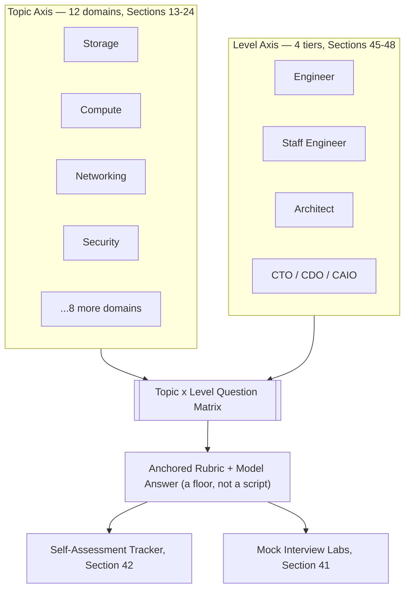
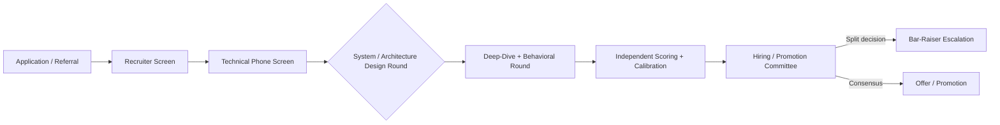
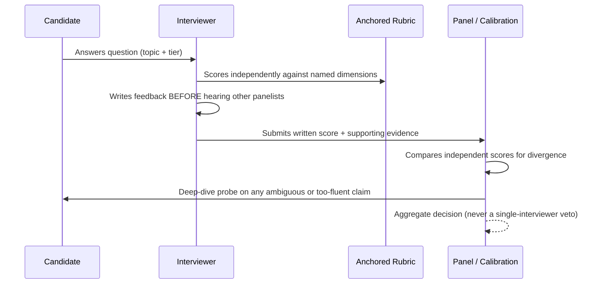

# Interview Question Bank

> Part of the **Enterprise Data & AI Architecture Handbook**.
> Resources — Interview, Chapter 01. Estimated study time: 45-60 min + optional lab.
> Companion "how to perform" chapters: [System Design Interview Prep](../../Phase-20/03_System_Design_Interview_Prep.md), [Architecture Interview Prep](../../Phase-20/04_Architecture_Interview_Prep.md), [Staff and Principal Promotion](../../Phase-20/05_Staff_and_Principal_Promotion.md), and [Portfolio and Case Studies](../../Phase-20/06_Portfolio_and_Case_Studies.md). This chapter is the **content** layer (what to know, organized and rubric-scored); those chapters are the **performance** layer (how to run the round). This bank spans the full handbook curriculum — Phase-00 through Phase-20 — and is cross-referenced throughout rather than restricted to a single phase.

## 1. Executive Summary

This chapter is a curated, cross-cutting question bank for enterprise data and AI architecture roles, organized along two axes: **topic** (12 domains mirroring this handbook's own cross-cutting sections — storage, compute, networking, security, performance, scalability, fault tolerance, cost, monitoring, observability, governance, trade-offs) and **level** (engineer, staff engineer, architect, CTO/CDO/CAIO). Every question carries a model-answer summary, a rubric anchor describing what separates a strong answer from a weak one, and a link back to the handbook chapter that grounds it. The bank is designed to be used two ways: by **candidates** as a targeted gap-diagnosis and rehearsal tool (via the [self-assessment tracker](#42-exercises)), and by **interviewing organizations** as a calibrated, bias-resistant rubric source (per the [Enterprise Recommendations](#30-enterprise-recommendations)). It deliberately excludes generic algorithmic whiteboard-coding puzzles — that skill is covered adequately elsewhere in the industry — and focuses on the applied systems, architecture, and leadership reasoning this handbook builds.

## 2. Learning Objectives

By the end of this chapter you will be able to:
- Diagnose your own preparation gaps across 12 technical/organizational domains and 4 seniority tiers using a single tracker.
- Answer representative engineer-, staff-, architect-, and CTO-tier questions with the reasoning structure (not just the content) that a calibrated panel rewards.
- Distinguish a model answer used as a **rubric floor** from a model answer memorized and recited verbatim — and why the latter fails a deep-dive probe.
- Run a structured mock interview (self- or peer-scored) using an anchored rubric rather than an unstructured "vibe check."
- Explain, as an interviewer or hiring leader, how to build and maintain a question bank that stays reliable, fair, and resistant to leakage over time.

## 3. Business Motivation

Interview signal quality is a direct multiplier on architecture-org outcomes: [Hiring and Interviewing](../../Phase-19/05_Hiring_and_Interviewing.md) established, via the Schmidt & Hunter (1998) meta-analysis, that structured interviews with anchored rubrics measurably out-predict unstructured ones, and that the same structural fixes (independent scoring, blind screening, anchored rubrics) that improve accuracy also improve fairness. A scattered, ad hoc question set — one interviewer's favorite trivia, another's memorized brainteaser — reproduces exactly the low-reliability "vibe check" pattern that chapter's Case Study 1 showed collapsing under retrospective analysis. For candidates, unfocused preparation against generic internet question lists wastes scarce preparation hours on content that does not map to this handbook's Azure-first, trade-off-driven architecture depth. A tiered, topic-tagged bank converts both problems into a measurable, targeted exercise.

## 4. History and Evolution

- **1990s-2000s — the puzzle era.** Brainteaser and algorithmic-puzzle interviews (popularized by Microsoft-era hiring folklore) dominated technical screening; they measured puzzle-solving under pressure more than job-relevant skill.
- **~2013 — the retreat from brainteasers.** Google publicly abandoned brainteasers after internal analysis found no correlation with job performance (documented in Laszlo Bock's *Work Rules!*, 2015) — the same source behind the committee-and-packet hiring model referenced in [Hiring and Interviewing §6.4](../../Phase-19/05_Hiring_and_Interviewing.md).
- **2010s — the system design era.** As distributed systems and cloud architecture became mainstream (see [Phase-02](../../Phase-02/01_Consensus_and_Coordination.md) and [Phase-03](../../Phase-03/01_Cloud_Architecture_Fundamentals.md)), open-ended system design rounds became standard for senior roles, rewarding requirements elicitation and trade-off articulation over recall.
- **2010s-2020s — structured behavioral interviewing.** STAR-format behavioral rounds, formalized industrially by Amazon's Leadership-Principles-anchored loop and its Bar Raiser role (1999), became a parallel standard track alongside technical rounds.
- **2020s — the deep-dive-resistant era.** As AI-assisted interview prep and fluent-but-shallow written answers became common (see [Portfolio and Case Studies §Problems It Cannot Solve](../../Phase-20/06_Portfolio_and_Case_Studies.md)), panels shifted weight toward **deep-dive probing** — "walk me through what *you* decided and why" — as the primary defense against rehearsed or inflated answers. This bank is built for that era: every model answer is explicitly framed as a rubric floor, not a script.

## 5. Why This Technology Exists

Generic online question lists are topic-agnostic and level-agnostic: the same "tell me about a time..." question appears regardless of whether the candidate is interviewing for an engineer or CTO-level role, and technical questions rarely map to a specific architectural depth or an Azure-first enterprise context. This bank exists to close that gap for readers of this specific handbook: every question is tagged to the exact chapter that grounds it, scored against an explicit rubric rather than a single "correct" answer, and organized so a reader can prepare **the 20% of material most likely to be probed at their target level** rather than reading linearly.

## 6. Problems It Solves

- Gives candidates a **structured gap-diagnosis tool** instead of unfocused cramming (§42 tracker).
- Gives interviewers a **shared, anchored rubric** so two panelists scoring the same answer converge (§9, reusing [Hiring ADR-0202](../../Phase-19/05_Hiring_and_Interviewing.md)).
- Covers **both axes** interview prep usually treats separately: what topic, and how deep for this level.
- Provides **cross-topic scenario questions** (§45-48) that mirror how real panels combine domains (e.g., a streaming design question that also probes cost and governance) rather than testing each domain in isolation.
- Gives hiring organizations a documented artifact to **revalidate and rotate** (§30), addressing the standing risk that any published bank becomes stale or leaked.

## 7. Problems It Cannot Solve

- **Cannot substitute for real hands-on experience.** A memorized model answer to a Delta Lake compaction question does not equal having actually diagnosed a small-file problem in production; the [Hands-on Labs](#41-hands-on-labs) in each phase chapter remain the only way to build that.
- **Cannot guarantee on-the-job performance.** Even the best-validated structured interviews have a real but bounded predictive ceiling (Schmidt & Hunter, 1998) — interview signal is evidence, not proof.
- **Cannot detect long-horizon qualities** — collaboration under sustained pressure, judgment across multi-year initiatives — that only reveal themselves after months on the job; see [Staff and Principal Promotion §1](../../Phase-20/05_Staff_and_Principal_Promotion.md) on why promotion ratifies already-demonstrated operation at a level rather than predicting it from a single conversation.
- **Cannot fully resist gaming.** A candidate can memorize this bank's model answers verbatim; the only structural defense is the deep-dive probe (§9, §40 Case Study 2) — no static question bank alone closes this gap.

## 8. Core Concepts

### 8.1 Question Taxonomy

| Type | What it tests | Example |
|---|---|---|
| Knowledge-recall | Does the candidate know a fact/mechanism | "What does Delta Lake's transaction log store?" |
| Applied-scenario | Can the candidate apply a concept under constraints | "Design ingestion for a 500GB/day CDC feed with a 15-minute freshness SLA." |
| Trade-off-articulation | Can the candidate name costs, not just benefits, of a choice | "Why not just use Kafka for everything?" |
| System/architecture design | Can the candidate elicit requirements and reason at scale | See [System Design Interview Prep](../../Phase-20/03_System_Design_Interview_Prep.md) and [Architecture Interview Prep](../../Phase-20/04_Architecture_Interview_Prep.md). |
| Behavioral/STAR | Did the candidate actually do something, with a measured outcome | "Tell me about a time a data pipeline you owned failed silently." |
| Deep-dive probe | Is the claimed answer the candidate's own reasoning | "You said you chose partitioning by customer ID — walk me through the alternative you rejected and why." |

### 8.2 The Four Tiers

| Tier | Scope / blast radius | Time horizon | What changes vs. the tier below |
|---|---|---|---|
| Engineer | Component/service | Days-weeks | Correct implementation and mechanism knowledge |
| Staff Engineer | Cross-team/domain | Weeks-quarters | Trade-off articulation, influence without authority (see [Technical Leadership](../../Phase-19/01_Technical_Leadership.md)) |
| Architect | Multi-domain/platform | Quarters-years | Governance, ADR-quality reasoning, reversibility judgment (see [Architecture Decision Records](../../Phase-01/03_Architecture_Decision_Records.md)) |
| CTO / CDO / CAIO | Organization/portfolio | Years | Mandate, risk ownership, portfolio economics (see [CDO and CAIO Playbook](../../Phase-19/08_CDO_and_CAIO_Playbook.md)) |

### 8.3 Rubric Anchors and Disaggregated Scoring

Every question in this bank is scored against **named, disaggregated dimensions** rather than a single pass/fail — the same discipline established in [Hiring ADR-0202](../../Phase-19/05_Hiring_and_Interviewing.md) and reused in [System Design Interview Prep](../../Phase-20/03_System_Design_Interview_Prep.md)'s and [Architecture Interview Prep](../../Phase-20/04_Architecture_Interview_Prep.md)'s 9-dimension rubrics. A model answer in this bank states what a strong response *covers*, never a verbatim script — collapsing multiple dimensions into one aggregate score (or reciting the model answer's wording) is treated as an anti-pattern (§27).

## 9. Internal Working

A well-run interview loop converts a subjective conversation into a measurable signal through four mechanisms, each already established elsewhere in this handbook and reused here:

1. **Independent written scoring before discussion** — each panelist scores against the anchored rubric before hearing other panelists' opinions, preventing anchoring bias ([Hiring §5.2](../../Phase-19/05_Hiring_and_Interviewing.md)).
2. **Anchored rubric per dimension** — "strong/adequate/weak" is defined in advance for each dimension, not decided in the moment.
3. **Calibration** — a bar-raiser or calibrator role periodically compares scores across panelists and interview loops to keep the bar consistent ([Hiring §5.3](../../Phase-19/05_Hiring_and_Interviewing.md)).
4. **The deep-dive probe as verification** — a fluent, complete-sounding answer is only trusted once the candidate can defend *their own* reasoning under follow-up; this is precisely the mechanism that caught the embellished case study in [Portfolio and Case Studies, Case Study 2](../../Phase-20/06_Portfolio_and_Case_Studies.md). This bank's model answers exist to be probed against, not recited.

## 10. Architecture

This bank is organized as a two-axis matrix: 12 topic domains (§13-24) crossed with 4 seniority tiers (§45-48 give tier-focused cross-topic batches; §13-24 give topic-focused per-tier rows). Each question carries a stable ID of the form `<TOPIC>-<TIER>-<NN>` (e.g., `STOR-ARCH-02`), a phase cross-reference, a difficulty rating, and an estimated time to answer. See the architecture diagram in §36.

## 11. Components

| Component | Where | Purpose |
|---|---|---|
| Topic Question Sets | §13-24 | Depth within one domain, across all four tiers |
| Tiered Question Sets | §45-48 | Cross-topic scenario questions at one tier |
| Model-Answer + Rubric pairs | Throughout | Floor for a strong answer, never a script |
| Self-Assessment Tracker | §42 | Candidate gap-diagnosis instrument |
| Mock Interview Labs | §41 | Applied rehearsal with self- or peer-scoring |

## 12. Metadata

| Tag | Values | Purpose |
|---|---|---|
| Topic | One of the 12 domains in §13-24 | Filter by subject |
| Tier | Engineer / Staff / Architect / CTO | Filter by seniority |
| Phase cross-reference | e.g. `Phase-04/04` | Ground the question in a full chapter |
| Format | Recall / Scenario / Trade-off / Design / Behavioral / Deep-dive | Match to interview round type |
| Difficulty | 1 (foundational) – 5 (principal-level) | Sequence prep |
| Est. time | Minutes to answer well | Budget mock-interview time |

## 13. Storage

Grounded in [Phase-04 (Data Storage & File Formats)](../../Phase-04/01_File_Formats.md).

| Tier | Question | Model Answer Summary | Rubric Anchor |
|---|---|---|---|
| Engineer | What does a Parquet file's footer store, and why does it matter for query pruning? | Row-group statistics (min/max, null counts), schema, offsets; the query engine reads the footer first to skip row groups that cannot match a predicate. | Strong answers name statistics-based pruning specifically, not just "it's columnar." |
| Staff | Compare Delta Lake, Iceberg, and Hudi on concurrency control and pick one for a high-write CDC use case. | Names optimistic concurrency in all three, but Hudi's record-level index and MoR tables are purpose-built for high-frequency upserts; ties to [Table Format Comparison](../../Phase-04/07_Table_Format_Comparison.md). | Strong answers name a concrete requirement (write frequency, reader freshness tolerance) driving the choice, not a general preference. |
| Architect | A platform has silently grown a small-file problem across 40 pipelines. Design the governance fix, not just the technical one. | Technical: scheduled `OPTIMIZE`/compaction, target file-size policy. Governance: a platform-owned default (not per-team opt-in), a monitored metric (avg file size / small-file count), and an owner. | Strong answers treat this as an ownership/enforcement gap, echoing the handbook's recurring "advisory vs. enforced" pattern, not just a maintenance job. |
| CTO | The org has three lakehouses on three table formats after three acquisitions. What's your first move? | Not "standardize immediately" — first quantify the actual interoperability pain (which teams query across boundaries), then decide via [Migration Considerations](../../Phase-04/07_Table_Format_Comparison.md)'s decision matrix; forced full migration is rarely justified in year one. | Strong answers resist the reflex to mandate a rewrite before measuring the real cost of the status quo. |

## 14. Compute

Grounded in [Apache Spark Internals](../../Phase-05/04_Apache_Spark_Internals.md) and [Performance Engineering](../../Phase-18/05_Performance_Engineering.md).

| Tier | Question | Model Answer Summary | Rubric Anchor |
|---|---|---|---|
| Engineer | Why did a Spark job get slower after doubling the cluster size? | Very likely data skew — one partition dominates task time, and horizontal scale-out cannot help a single oversized partition; check the Spark UI task-duration distribution. | Strong answers immediately ask "did you check for skew" rather than assuming under-provisioning. |
| Staff | When would you choose Photon/vectorized execution vs. standard Spark, and what's the actual cost trade-off? | Photon accelerates CPU-bound SQL/DataFrame workloads; benefit is real but priced separately — worth it when compute cost dominates, not for I/O-bound jobs. | Strong answers name the workload shape (CPU-bound vs I/O-bound) as the deciding factor, not "always turn it on." |
| Architect | Design a compute governance policy across 50 teams sharing one Databricks workspace. | Cluster policies enforcing tagging/spot/autoscale defaults, job-vs-interactive cluster separation, per-team budget alerts; reuses the enforced-tagging pattern from [FinOps and Cost Optimization](../../Phase-18/01_FinOps_and_Cost_Optimization.md). | Strong answers make enforcement computational (policy-as-code), not an advisory wiki page. |
| CTO | Compute spend has grown 40% quarter-over-quarter with no corresponding growth in workload count. What do you ask first? | Ask for the unit-economics metric (cost per job/run/query), not the aggregate bill; per [FinOps ADR-0193](../../Phase-18/01_FinOps_and_Cost_Optimization.md), unowned/unmeasured spend compounds silently. | Strong answers reach for a unit metric before reaching for a blanket cost-cutting mandate. |

## 15. Networking

Grounded in [Networking Fundamentals](../../Phase-00/04_Networking_Fundamentals.md), [Azure Networking](../../Phase-03/04_Azure_Networking.md), and [Network Security and Zero Trust](../../Phase-10/04_Network_Security_and_Zero_Trust.md).

| Tier | Question | Model Answer Summary | Rubric Anchor |
|---|---|---|---|
| Engineer | What's the difference between a Private Endpoint and a Service Endpoint in Azure? | Private Endpoint assigns a private IP inside the VNet reachable via Private Link (works cross-region/cross-VNet with peering); Service Endpoint keeps traffic on the Azure backbone but the resource keeps a public IP with restricted access. | Strong answers state which one still requires a public IP on the resource. |
| Staff | A team added a Private Endpoint but a public-access-exposure incident still occurred. Why? | Classic gotcha: adding a Private Endpoint doesn't automatically disable public network access — both must be configured together (per [Network Security and Zero Trust](../../Phase-10/04_Network_Security_and_Zero_Trust.md)). | Strong answers name this specific gap, not a generic "network was misconfigured." |
| Architect | Design network segmentation for a hub-spoke lakehouse spanning three business units with different compliance needs. | Hub for shared egress/firewall/DNS, spokes per business unit, default-deny egress, micro-segmentation via NSGs/Azure Firewall, zero-trust "verify explicitly" at every hop. | Strong answers apply "assume breach" and default-deny as first principles, not just draw a hub-spoke diagram. |
| CTO | A regulator asks how data residency is enforced network-wide, not just documented. What's your answer? | Point to enforced controls (region-locked resource policies, Private Link only, no public egress paths) plus continuous compliance-as-code scanning — not a policy document alone (per [Compliance and Regulatory Frameworks](../../Phase-10/06_Compliance_and_Regulatory_Frameworks.md)). | Strong answers distinguish "documented" from "enforced and continuously verified." |

## 16. Security

Grounded in [Phase-10 (Security, Identity & Compliance)](../../Phase-10/01_Security_Foundations.md).

| Tier | Question | Model Answer Summary | Rubric Anchor |
|---|---|---|---|
| Engineer | What's the difference between RBAC and ABAC? | RBAC grants by role membership; ABAC evaluates attributes (resource sensitivity, requester department, time) at request time — finer-grained but more complex to reason about. | Strong answers give a concrete case where RBAC is insufficient. |
| Staff | Design column-level masking for PII in a shared Databricks Unity Catalog table. | Dynamic column masks/row filters keyed to group membership, tested for both the masked and unmasked path, verified against actual query plans not just documentation. | Strong answers mention verifying the mask actually applies, not just configuring it (echoes the handbook's recurring "verification gap" pattern). |
| Architect | Design the access-control-propagation path for a RAG system over a differentiated-access corpus. | Access control must be evaluated at retrieval time (pre-filtered ANN search), before ranking — never as a downstream check after generation; per [RAG ADR-0157](../../Phase-12/03_Retrieval_Augmented_Generation.md) and [Vector Databases ADR-0164](../../Phase-13/01_Vector_Databases_Qdrant_and_Milvus.md). | Strong answers name pre-filtering specifically and explain why post-filtering silently under-returns or leaks. |
| CTO | An AI feature leaked confidential HR content to an unauthorized user. What's the systemic fix, not just the patch? | The systemic issue is almost always that ingestion never propagated source-system permissions into the index — the fix is a mandated propagation control at ingestion, verified continuously, not a one-time patch (per [RAG Case Study, §Case Studies](../../Phase-12/03_Retrieval_Augmented_Generation.md)). | Strong answers treat it as a recurring architectural class of failure, not an isolated bug. |

## 17. Performance

Grounded in [Performance Engineering](../../Phase-18/05_Performance_Engineering.md).

| Tier | Question | Model Answer Summary | Rubric Anchor |
|---|---|---|---|
| Engineer | What's the difference between p50, p95, and p99 latency, and why does it matter which one you optimize for? | p50 hides tail behavior; SLAs are usually defined on p95/p99 because that's what users actually experience under load; averages hide both. | Strong answers explain why an average can look fine while the SLA is breached. |
| Staff | A benchmark showed p99 of 45ms in load testing but production shows 900ms. What's your first hypothesis? | Coordinated omission — a closed-loop load generator backs off when the system slows, silently omitting the worst requests from the measured distribution; verify with an open-loop tool (per [Performance Engineering §Case Studies](../../Phase-18/05_Performance_Engineering.md)). | Strong answers name coordinated omission specifically, not just "the benchmark was wrong." |
| Architect | A team wants to double a cluster to fix a slow nightly job. What do you ask before approving? | "Have you profiled it — is this actually compute-bound?" Scaling before profiling is the dominant failure mode; per Amdahl's Law, scaling helps only the parallelizable, bottlenecked fraction. | Strong answers insist on measurement before any capacity change is approved. |
| CTO | Performance incidents keep recurring despite "fixes." What governance gap does this suggest? | Missing mandatory CI performance-regression tests after each fix — a fix without a permanent regression test is silently reversible by the next unrelated change. | Strong answers connect this to the handbook's recurring verification-gap pattern (fix without durable enforcement). |

## 18. Scalability

Grounded in [Phase-02 (Distributed Systems)](../../Phase-02/01_Consensus_and_Coordination.md).

| Tier | Question | Model Answer Summary | Rubric Anchor |
|---|---|---|---|
| Engineer | What's the difference between horizontal and vertical scaling, and when does vertical scaling stop working? | Vertical scaling hits a hardware ceiling and a single point of failure; horizontal scaling trades that for coordination complexity (partitioning, consistency). | Strong answers name the coordination cost horizontal scaling introduces, not just "it scales more." |
| Staff | Design partitioning for a multi-tenant table where one tenant is 1000x larger than the median. | Hash or composite key to avoid a hot partition from the large tenant; per-tenant secondary sharding if one tenant alone exceeds a single partition's practical limits. | Strong answers name the hot-partition/hot-key risk explicitly. |
| Architect | Explain the Universal Scalability Law's "coherency" term in plain language and why more nodes can make throughput *worse*. | Beyond contention (queueing for a shared resource), coherency cost (cross-node state synchronization) grows faster than linear, producing a scalability *retrograde* — actual throughput decline past an optimum node count. | Strong answers distinguish contention from coherency as two separate scaling costs. |
| CTO | A "scale it up" ask keeps coming from one product line every quarter. What structural question do you ask? | Whether the actual bottleneck was ever profiled and whether previous scale-ups measurably helped — repeated unverified scale-asks are the org-level instance of the profile-before-scaling pattern. | Strong answers push for a standing measurement discipline, not another one-off approval. |

## 19. Fault Tolerance

Grounded in [Fault Tolerance and Resilience](../../Phase-02/07_Fault_Tolerance_and_Resilience.md) and [Reliability and SRE](../../Phase-18/04_Reliability_and_SRE.md).

| Tier | Question | Model Answer Summary | Rubric Anchor |
|---|---|---|---|
| Engineer | What's the difference between a retry and a circuit breaker? | Retry re-attempts a failed call, possibly worsening a struggling downstream; a circuit breaker stops calling after a failure threshold, giving the downstream time to recover, then probes for recovery. | Strong answers explain why blind retries can amplify an outage. |
| Staff | Design idempotent consumption for an at-least-once message system. | A durable, shared (not per-instance) dedup store keyed on a message/business ID, checked before processing side effects; per-instance caches don't survive redelivery to a different instance. | Strong answers explicitly reject a per-instance cache as insufficient. |
| Architect | What is an error budget, and why is 100% reliability the wrong target? | Error budget = 1 − SLO, an explicit, spent-and-tracked allowance for unreliability; 100% is infeasible, ruinously expensive, and imperceptible to users already gated by their own less-reliable devices/networks (per [Reliability and SRE](../../Phase-18/04_Reliability_and_SRE.md)). | Strong answers explain the error budget as a decision mechanism (ship vs. freeze), not just a metric. |
| CTO | Two orgs are in a chronic ship-vs-stability political conflict. What's the structural fix? | A leadership-endorsed, pre-agreed error-budget policy that arbitrates the decision automatically with data both sides accepted in advance — converting a political fight into a standing mechanism (per [Reliability and SRE ADR-0196](../../Phase-18/04_Reliability_and_SRE.md)). | Strong answers propose a mechanism, not a one-time mediation. |

## 20. Cost Optimization

Grounded in [FinOps and Cost Optimization](../../Phase-18/01_FinOps_and_Cost_Optimization.md).

| Tier | Question | Model Answer Summary | Rubric Anchor |
|---|---|---|---|
| Engineer | What's the difference between Reservations and Spot pricing in Azure, and when would you use each? | Reservations discount steady-state, predictable workloads; Spot discounts interruptible workloads (batch, training) at the risk of preemption; neither suits bursty unpredictable production traffic. | Strong answers name interruption tolerance as the deciding factor. |
| Staff | A 3-year GPU reservation is running at 40% utilization. What do you recommend? | Investigate whether the workload it was sized for still exists; prefer flexible savings plans over long-dated reservations when the underlying architecture is still evolving; track utilization/coverage as a standing KPI, not a one-time purchase. | Strong answers treat utilization tracking as an ongoing discipline, not an annual event. |
| Architect | Design a mandatory tagging and cost-allocation policy for a new data platform. | Enforce tags (cost center, data product owner) computationally at provisioning (Azure Policy/IaC gate), not as a documentation convention; pair with at least one unit-economics metric per workload (per [FinOps ADR-0193](../../Phase-18/01_FinOps_and_Cost_Optimization.md)). | Strong answers make enforcement structural, not advisory. |
| CTO | Cloud spend grew 8-10% a month for a year with no single expensive incident. How did that happen and what's the fix? | Unowned, untagged spend compounds silently across many small unaccountable decisions — the fix is accountable ownership and a unit-economics review cadence, not a year-end reactive cleanup. | Strong answers recognize the "compounds silently across many small decisions" failure shape, common throughout this handbook. |

## 21. Monitoring

Grounded in [Monitoring with Prometheus and Grafana](../../Phase-18/03_Monitoring_with_Prometheus_and_Grafana.md).

| Tier | Question | Model Answer Summary | Rubric Anchor |
|---|---|---|---|
| Engineer | What are the four golden signals? | Latency, traffic, errors, saturation — the minimum signal set for understanding a service's health. | Strong answers name all four without prompting. |
| Staff | Why should a page-worthy alert be SLO-based rather than a static CPU/disk threshold? | Static cause-level thresholds fire on symptoms unrelated to user impact and multiply during correlated failures, training on-call to distrust the pager (alert fatigue); SLO burn-rate alerts page only when user-facing error budget is actually at risk. | Strong answers explain *why* static thresholds cause alert fatigue, not just that SLO alerts are "better." |
| Architect | A nightly batch job failed silently for three nights because it finished between scrape intervals. Design the fix. | Add explicit absence/freshness alerting (a heartbeat or `time() - last_success` check) — a pull-based metrics system cannot see a job it never scraped; per [Monitoring §Case Studies](../../Phase-18/03_Monitoring_with_Prometheus_and_Grafana.md). | Strong answers explicitly name the pull-model blind-spot mechanism. |
| CTO | On-call reports "we get paged constantly but nothing important." What organizational fix do you mandate? | Mandate migration to multi-window multi-burn-rate SLO alerting for anything that pages a human; move cause-level alerts to dashboards/tickets only — this is a policy change, not a per-team tuning exercise. | Strong answers propose an org-wide policy, not a local team fix. |

## 22. Observability

Grounded in [Observability with OpenTelemetry](../../Phase-18/02_Observability_with_OpenTelemetry.md).

| Tier | Question | Model Answer Summary | Rubric Anchor |
|---|---|---|---|
| Engineer | What's the difference between monitoring and observability? | Monitoring answers known-unknowns via pre-defined dashboards/thresholds; observability lets you ask novel questions of existing telemetry after an unanticipated failure. | Strong answers give the known-unknowns vs. unknown-unknowns framing specifically. |
| Staff | A distributed trace broke at a message-queue boundary. Why, and how do you fix it? | Trace context (W3C traceparent) wasn't propagated into the message headers, so the consumer started an orphaned trace; fix is injecting/extracting context across every boundary, sync or async, using span links where parent-child doesn't fit. | Strong answers name the specific async-propagation gap, not "add more logging." |
| Architect | Design a Collector-tier architecture that keeps trace-sampling cost bounded without losing interesting traces. | Tail-sampling at a platform-owned Collector gateway — keep all errors and high-latency traces, sample a small baseline percentage of the rest — a large cost reduction with near-zero loss of diagnostic value. | Strong answers name tail-sampling specifically over head-sampling for this goal. |
| CTO | The observability bill is growing faster than traffic. What do you ask? | Whether cardinality (unique label combinations, e.g., a high-cardinality ID label on a metric) is driving cost — a single mislabeled metric can multiply active series by orders of magnitude. | Strong answers name cardinality explosion as the likely root cause before assuming it's simply "more traffic." |

## 23. Governance

Grounded in [Phase-08 (Data Governance & Quality)](../../Phase-08/01_Data_Governance_Foundations.md) and [Federated Governance](../../Phase-15/04_Federated_Governance.md).

| Tier | Question | Model Answer Summary | Rubric Anchor |
|---|---|---|---|
| Engineer | What's the difference between a data catalog and a data contract? | A catalog is discovery/documentation of what exists; a contract is an enforced, versioned agreement about schema/semantics/SLA between a producer and consumers — a catalog entry can be wrong, a contract breach is detected. | Strong answers distinguish "documented" from "enforced." |
| Staff | Design lineage tracking that survives a schema change three hops downstream. | Column-level lineage capture at each transformation step (OpenLineage or equivalent), automated impact analysis before a breaking schema change ships, not manual tribal knowledge. | Strong answers name automated impact analysis as the actual mechanism, not "we document dependencies." |
| Architect | How do you decide which governance policies should be global vs. domain-local in a federated model? | Apply the explicit test: does varying this policy by domain create cross-domain harm? If yes, it's global; if it's purely a domain's own internal concern, it stays local (per [Federated Governance §4.1](../../Phase-15/04_Federated_Governance.md)). | Strong answers give the concrete test, not a vague "case by case." |
| CTO | A governance council has grown from 4 global policies to 17 over 18 months and teams are building workarounds. What's wrong? | Scope creep is reinstating the exact centralized bottleneck federated governance exists to avoid; the fix is a standing semi-annual portfolio review with equal-weighted removal *and* expansion authority (per [Federated Governance ADR-0179](../../Phase-15/04_Federated_Governance.md)). | Strong answers recognize governance itself needs a governance mechanism to avoid unbounded growth. |

## 24. Trade-offs

Grounded in [Architecture Decision Records](../../Phase-01/03_Architecture_Decision_Records.md) and [Architecture Interview Prep](../../Phase-20/04_Architecture_Interview_Prep.md).

| Tier | Question | Model Answer Summary | Rubric Anchor |
|---|---|---|---|
| Engineer | Why not always use the newest/fastest tool available for every job? | Every tool has an operational cost (learning curve, ecosystem maturity, on-call burden) that must be weighed against a measured requirement, not novelty alone. | Strong answers name a specific cost, not just "it depends." |
| Staff | State one real trade-off in choosing CQRS for a read path, including a cost, not just a benefit. | Benefit: decoupled read scaling; cost: eventual consistency the caller must tolerate, plus a second system to operate and keep in sync — CQRS is justified only for a measured read/write asymmetry ([CQRS §8.5](../../Phase-14/03_CQRS.md)). | Strong answers state an explicit cost in the same breath as the benefit — a benefit-only answer is down-levelled. |
| Architect | What makes a decision a "one-way door," and why does that change how you'd run the decision process? | Reversibility and blast radius: one-way doors (data model choices with years of migration cost, cross-org platform bets) warrant broader socialization, ADR documentation, and explicit alternatives; two-way doors should move fast without ceremony. | Strong answers name reversibility and blast radius as the two deciding factors, not seniority or opinion. |
| CTO | Your team recommends a "transformational" AI investment exempt from normal portfolio discipline. How do you respond? | No investment, however labeled, is exempt from the same OKR/value-realization discipline as the rest of the portfolio, except a narrow, time-boxed, explicitly bounded discovery exception (per [CDO and CAIO Playbook ADR-0205](../../Phase-19/08_CDO_and_CAIO_Playbook.md)). | Strong answers resist the "transformational" label as a bypass for normal governance. |

## 25. Decision Matrix

Use this to prioritize preparation time against a target role and available hours.

| Target level | Prioritize first | Time budget suggestion | Recommended mock format |
|---|---|---|---|
| Engineer | §13-24 Engineer rows; one topic at a time | 60% topic drills, 40% one mock technical round | Peer-scored topic Q&A |
| Staff Engineer | §46 + Staff rows in §13-24 + trade-off articulation (§24) | 40% topic, 40% scenario/trade-off, 20% behavioral | [System Design Interview Prep](../../Phase-20/03_System_Design_Interview_Prep.md) mock |
| Architect | §47 + Architect rows + governance (§23) + ADR practice | 30% topic, 50% architecture-scenario, 20% behavioral | [Architecture Interview Prep](../../Phase-20/04_Architecture_Interview_Prep.md) mock |
| CTO / CDO / CAIO | §48 + business/portfolio framing (§20, §23) | 20% topic, 30% portfolio-scenario, 50% stakeholder/board framing | Reference [CDO and CAIO Playbook](../../Phase-19/08_CDO_and_CAIO_Playbook.md) directly |

## 26. Design Patterns

Good interview-question design shares patterns with good architecture design:
- **Scenario-anchored, not trivia-anchored.** Anchor every question in a concrete workload/constraint set rather than an isolated fact.
- **Requirements-first framing.** The question should reward eliciting requirements before naming a technology, mirroring [System Design Interview Prep §8.1](../../Phase-20/03_System_Design_Interview_Prep.md).
- **Follow-up ladder.** Every question has a planned deep-dive follow-up ("why not X instead?") to distinguish genuine reasoning from recitation.
- **Rubric-anchored, disaggregated scoring.** Never a single pass/fail; score named dimensions independently (§8.3).

## 27. Anti-patterns

- **Brainteasers and trivia with no job relevance** (the pre-2013 pattern this handbook's History section explicitly moved past).
- **Gotcha questions** designed to make the candidate fail rather than to elicit reasoning.
- **Single-interviewer unstructured "vibe check"** with no rubric — the exact failure mode in [Hiring, Case Study 1](../../Phase-19/05_Hiring_and_Interviewing.md).
- **Treating a model answer as a scoring key to match verbatim** rather than a floor to probe against.
- **Testing familiarity with a specific tool's UI/CLI syntax** instead of the underlying concept.
- **Never rotating questions**, allowing a bank to become fully memorized and uninformative over time (§30).

## 28. Common Mistakes

Candidate-side mistakes, consistently observed across the handbook's own interview-prep case studies:
- Naming a technology before eliciting requirements ([System Design Interview Prep, Case Study 1](../../Phase-20/03_System_Design_Interview_Prep.md)).
- Giving trade-offs as benefit-only assertions with no named cost ([System Design Interview Prep, Case Study 2](../../Phase-20/03_System_Design_Interview_Prep.md)).
- Skipping an explicit quantitative estimate, leaving the interviewer no way to see *why* a design choice matters at the stated scale.
- Answering governance questions with named mechanisms that stop at the perimeter and never address propagation into every derived copy ([Architecture Interview Prep, Case Study 2](../../Phase-20/04_Architecture_Interview_Prep.md)).
- Running out of time before addressing failure modes and cost, treating them as an afterthought rather than a first-class design input.
- Overstating individual ownership of team outcomes — collapses under a deep-dive probe ([Portfolio and Case Studies, Case Study 2](../../Phase-20/06_Portfolio_and_Case_Studies.md)).

## 29. Best Practices

**For candidates:**
- Diagnose gaps with the tracker (§42) before reading linearly.
- Rehearse the requirements-first framework from [System Design Interview Prep](../../Phase-20/03_System_Design_Interview_Prep.md) until it is automatic, not just known.
- Prepare STAR stories with a real measured outcome and an honest "I," per [Portfolio and Case Studies §Core Concepts](../../Phase-20/06_Portfolio_and_Case_Studies.md).
- Practice out loud or on video — silent reading does not train the articulation skill actually being scored.

**For interviewers and hiring organizations:**
- Score independently and in writing before any panel discussion (§9).
- Calibrate panelists periodically against recorded or transcribed answers.
- Rotate and retire questions on a standing cadence (§30).
- Revalidate the rubric itself against post-hire/post-promotion outcomes, not just against how "impressive" an answer felt in the room ([Hiring ADR-0202](../../Phase-19/05_Hiring_and_Interviewing.md)).

## 30. Enterprise Recommendations

Organizations adopting a published, structured bank like this one should:
1. **Run calibration sessions before first use** — have multiple interviewers independently score the same recorded answer and reconcile disagreement, per [Hiring §5.3](../../Phase-19/05_Hiring_and_Interviewing.md).
2. **Rotate/retire questions on a cadence.** A publicly documented bank should be assumed leaked; plan rotation rather than relying on secrecy.
3. **Monitor for adverse impact at every stage** using the four-fifths rule (per [Hiring ADR-0202](../../Phase-19/05_Hiring_and_Interviewing.md)), not just at the final decision.
4. **Periodically revalidate the rubric** against real post-hire/post-promotion performance, guarding against both under-rigor (a rubber-stamp bar) and over-rigor (a rubric that rewards matching the panel's own vocabulary over genuine competency, per [Hiring, Case Study 2](../../Phase-19/05_Hiring_and_Interviewing.md)).
5. **Never let a single interviewer hold veto power** — escalate split decisions to a committee, not a hallway vote.

## 31. Azure Implementation

The content depth for this chapter lives in the topic sections (§13-24) and tiered sections (§45-48) above, not here — this section covers only the tooling used to *run* a structured loop. Azure DevOps Boards can track loop stages and store rubric-scoring artifacts per candidate; Microsoft Teams supports structured panel scheduling and (where policy and consent permit) recording for calibration review; Power BI can build adverse-impact and calibration dashboards from anonymized scoring data; Microsoft Purview sensitivity labels should be applied to any stored candidate-evaluation data given its confidentiality requirements.

## 32. Open Source Implementation

A question bank can itself be maintained docs-as-code: Markdown files with YAML front-matter tags (topic, tier, difficulty) versioned in Git, reviewed via pull request like any other documentation (per [Technical Writing](../../Phase-19/04_Technical_Writing.md)'s docs-as-code discipline), and published via MkDocs/Docusaurus or cataloged in Backstage TechDocs for discoverability. Open-source applicant tracking systems (e.g., OpenATS-style tools) can store structured rubric scores rather than free-text impressions.

## 33. AWS Equivalent (comparison only)

An AWS-shop loop differs mainly in cultural artifacts rather than mechanics: behavioral rounds are explicitly anchored to Amazon's Leadership Principles, and the six-page narrative-memo culture (rather than slide decks) bleeds into how technical proposals are expected to be communicated. The Bar Raiser role (an interviewer from outside the hiring team with veto power over the bar, since 1999) is a genuine structural differentiator worth knowing if targeting an AWS-cultured organization. **Advantages:** extremely consistent behavioral bar across a huge hiring volume. **Disadvantages:** the Leadership-Principles framing can feel unnatural to candidates unfamiliar with the vocabulary. **Migration:** candidates moving into this culture should rehearse STAR stories explicitly mapped to named Leadership Principles, not just generic behavioral prep.

## 34. GCP Equivalent (comparison only)

Google originated much of the modern committee-and-packet model: interviewers submit independent written feedback, a hiring committee (not the interviewers themselves) makes the final call, and Google's own internal research found signal plateaus after roughly four interviews (documented in *Work Rules!*, 2015) — additional rounds add cost without added signal. Google's design-doc culture (per [Technical Writing §History](../../Phase-19/04_Technical_Writing.md)) also shapes its architecture-round expectations toward written, reviewable proposals. **Advantages:** committee decisions reduce single-interviewer bias. **Disadvantages:** longer decision latency than a single hiring-manager call. **Migration:** candidates should prepare to present reasoning in a way that reads well in a committee's written summary, not just verbally.

## 35. Migration Considerations

For a **candidate** moving between company interview cultures (e.g., AWS-style Leadership-Principles behavioral rounds to Google-style committee packets), the technical content in this bank transfers directly; only the framing and communication style need adaptation. For an **organization** replacing an unstructured legacy interview process with a bank like this one, migrate incrementally: pilot with one hiring loop, calibrate, measure agreement between interviewers, then expand — do not mandate org-wide adoption before a single calibration cycle has validated the rubric, echoing [Architecture Reviews](../../Phase-19/02_Architecture_Reviews.md)'s right-sized-rollout principle.

## 36. Mermaid Architecture Diagrams

## 37. End-to-End Data Flow

Reframed here as the end-to-end **interview loop flow**, matching §36's second diagram: application/referral → recruiter screen (fit and logistics) → technical phone screen (foundational competence, §13-24 Engineer/Staff rows) → system or architecture design round (§45-47, applying [System Design Interview Prep](../../Phase-20/03_System_Design_Interview_Prep.md) or [Architecture Interview Prep](../../Phase-20/04_Architecture_Interview_Prep.md)) → deep-dive and behavioral round (§45 Behavioral and Leadership Questions, verifying claims from a resume/portfolio per [Portfolio and Case Studies](../../Phase-20/06_Portfolio_and_Case_Studies.md)) → independent scoring and calibration (§9) → committee decision, with bar-raiser escalation reserved for genuine splits, never a hallway vote.

## 38. Real-world Business Use Cases

- **External hiring** — the most common use, covered throughout this chapter.
- **Internal promotion loops** (Staff/Principal/Architect) — reuses the same rubric discipline per [Staff and Principal Promotion](../../Phase-20/05_Staff_and_Principal_Promotion.md), since promotion committees face the identical evidence-vs-embellishment problem as external hiring committees.
- **Architecture review board readiness** — architects preparing to *sit on* a review board, not just pass one, benefit from the Architect-tier questions in §47 as self-calibration against [Architecture Reviews](../../Phase-19/02_Architecture_Reviews.md)'s own rubric.
- **CDO/CAIO succession planning** — boards use CTO-tier scenario questions (§48) to assess internal succession candidates against the mandate-and-risk-ownership bar established in [CDO and CAIO Playbook](../../Phase-19/08_CDO_and_CAIO_Playbook.md).

## 39. Industry Examples

- **Google** abandoned brainteasers after finding no job-performance correlation (~2013) and adopted a hiring-committee model with independent written feedback and a documented four-interview signal plateau (Bock, *Work Rules!*, 2015).
- **Amazon** formalized the Bar Raiser role in 1999 and anchors behavioral interviewing to its Leadership Principles; its real 2018 scrapped internal AI recruiting tool (found to penalize resumes containing "women's," per Reuters/Dastin reporting) is a documented industry case of disparate impact via historical training data, directly paralleling [Responsible AI §7.4](../../Phase-11/07_Responsible_AI.md)'s disparate-impact discussion.
- **Regulatory response to hiring AI:** NYC Local Law 144 (2023) mandates bias audits for automated employment decision tools; the EU AI Act classifies recruitment AI as high-risk — both are real, current constraints on any AI-assisted screening a candidate or organization might encounter.
- **Dobbin & Kalev** (Harvard Business Review, 2016) found standalone unconscious-bias training has limited or even negative standalone effect on hiring outcomes — reinforcing why this chapter emphasizes structural fixes (independent scoring, blind screening, anchored rubrics) over training alone.

## 40. Case Studies

**Case Study 1 — a bank without calibration reproduces the unstructured problem it was meant to fix.** An organization adopted a structured, tiered question bank (much like this one) but skipped calibration: different panelists interpreted "strong" differently for the same rubric dimension, and two candidates with near-identical actual answers received opposite hiring decisions depending on which panelist scored them. A retrospective found the rubric wording alone did not create consistency — only a calibration session comparing scores against recorded answers did. Lesson: publishing a bank is necessary but not sufficient; calibration is the step that actually produces reliability, directly reinforcing [Hiring §5.3](../../Phase-19/05_Hiring_and_Interviewing.md).

**Case Study 2 — a candidate who memorized this bank's model answers failed the deep-dive.** A candidate prepared exclusively by memorizing the model-answer summaries in this chapter verbatim and could recite them fluently for every topic question. In the deep-dive round, the interviewer asked a single follow-up on each answer — "walk me through the alternative you personally considered and rejected" — and the candidate could not go beyond the memorized text. The panel correctly scored this as a "reasoning not demonstrated" flag, not a "topic unknown" flag, and the candidate was down-levelled rather than rejected outright once genuine, if shallower, reasoning was found underneath. Lesson: a model answer in this bank is an explicit rubric **floor**, never a script — the deep-dive probe exists precisely to distinguish the two, echoing the same mechanism that caught embellishment in [Portfolio and Case Studies, Case Study 2](../../Phase-20/06_Portfolio_and_Case_Studies.md).

### Architecture Decision Record (ADR-0219): Structured, Tiered, Topic-Tagged Question Bank as the Standing Interviewing and Preparation Artifact

**Context:** Interview signal quality directly affects both hiring/promotion outcomes and candidate preparation efficiency. An unstructured, ad hoc question set (Case Study 1's starting point) reproduces low reliability even when nominally "structured" on paper; a bank whose model answers are treated as a recitable script (Case Study 2) is trivially gameable and produces false-positive signal.

**Decision:** Adopt this two-axis (topic x tier), rubric-anchored bank as the standing artifact for both interview preparation and interviewer calibration, with the following clauses:
1. Every question is tagged (topic, tier, phase cross-reference, difficulty, format) — never presented as an unlabeled, undifferentiated list.
2. Every model answer is an explicit rubric **floor** describing what a strong answer *covers*, never a verbatim script to recite or a single pass/fail key — a mandatory deep-dive follow-up accompanies every Staff-tier-and-above question.
3. Scoring is independent and written before panel discussion, against named, disaggregated dimensions (§8.3), reusing [Hiring ADR-0202](../../Phase-19/05_Hiring_and_Interviewing.md).
4. Questions are rotated/retired on a standing cadence — a publicly published bank is assumed leaked, not assumed secret.
5. The rubric itself is periodically revalidated against real post-hire/post-promotion outcomes, guarding against both a rubber-stamp bar and an over-rigid rubric that rewards matching the panel's own vocabulary over genuine competency.
6. Adverse-impact monitoring (four-fifths rule) is applied at every stage, not only at the final decision.
7. Candidates are directed to the self-assessment tracker (§42) for targeted gap-diagnosis, not a linear read-through.

**Consequences:** *Positive* — measurably more consistent scoring across panelists, faster candidate ramp-up on relevant material, a documented artifact that can itself be audited and improved. *Negative* — building and maintaining calibration, rotation, and revalidation is real recurring overhead; a bank without that maintenance decays into exactly the weaknesses it was built to avoid.

**Alternatives considered:** *No bank, fully ad hoc questions* — rejected; this is the low-reliability status quo the whole chapter exists to improve on. *A closed/secret bank* — rejected; it does not scale to teach candidates or new interviewers and creates a false sense of leak-proofing. *A single-answer-key bank with no rubric dimensions* — rejected; collapses nuanced reasoning into pass/fail and is maximally gameable by rote memorization, the exact failure Case Study 2 demonstrates.

## 41. Hands-on Labs

1. **Mock system design round.** Using [System Design Interview Prep](../../Phase-20/03_System_Design_Interview_Prep.md)'s six-phase framework and a §46 Staff Engineer question, run a 45-minute timed mock (self-recorded or with a peer), then self-score against the rubric anchors in this chapter.
2. **Mock architecture panel round.** Using [Architecture Interview Prep](../../Phase-20/04_Architecture_Interview_Prep.md)'s seven-phase framework and a §47 Architect question, run a 60-minute timed mock covering business context, constraints, options, governance, and cost — score against the nine-dimension rubric referenced there.
3. **Interviewer-side calibration lab.** Have two people independently score the same recorded answer to a question from §13-24 against this chapter's rubric anchors, then compare scores and reconcile any divergence — a direct hands-on rehearsal of the calibration mechanism in §9 and §30.

## 42. Exercises

### Self-Assessment Tracker

Rate yourself 1 (not ready) – 5 (rehearsed and confident) for each topic at your target tier, then note which handbook phase chapter to revisit for any score below 3.

| Topic | Engineer | Staff | Architect | CTO | Phase chapter to revisit |
|---|---|---|---|---|---|
| Storage | | | | | [Phase-04](../../Phase-04/01_File_Formats.md) |
| Compute | | | | | [Phase-05](../../Phase-05/04_Apache_Spark_Internals.md) |
| Networking | | | | | [Phase-00](../../Phase-00/04_Networking_Fundamentals.md), [Phase-03](../../Phase-03/04_Azure_Networking.md) |
| Security | | | | | [Phase-10](../../Phase-10/01_Security_Foundations.md) |
| Performance | | | | | [Phase-18](../../Phase-18/05_Performance_Engineering.md) |
| Scalability | | | | | [Phase-02](../../Phase-02/01_Consensus_and_Coordination.md) |
| Fault Tolerance | | | | | [Phase-02](../../Phase-02/07_Fault_Tolerance_and_Resilience.md), [Phase-18](../../Phase-18/04_Reliability_and_SRE.md) |
| Cost Optimization | | | | | [Phase-18](../../Phase-18/01_FinOps_and_Cost_Optimization.md) |
| Monitoring | | | | | [Phase-18](../../Phase-18/03_Monitoring_with_Prometheus_and_Grafana.md) |
| Observability | | | | | [Phase-18](../../Phase-18/02_Observability_with_OpenTelemetry.md) |
| Governance | | | | | [Phase-08](../../Phase-08/01_Data_Governance_Foundations.md), [Phase-15](../../Phase-15/04_Federated_Governance.md) |
| Trade-offs / ADRs | | | | | [Phase-01](../../Phase-01/03_Architecture_Decision_Records.md) |

**Written exercises:**
1. Write three STAR stories from your own project history using [Portfolio and Case Studies](../../Phase-20/06_Portfolio_and_Case_Studies.md)'s sanitization discipline (abstract absolute figures to ratios, remove un-permissioned names).
2. Pick one topic scored below 3 above; write your own version of the Architect-tier question and answer it in writing before checking §13-24.
3. For one question in §46 or §47, write down the rejected alternative explicitly — practicing the "cost, not just benefit" habit from §24.

## 43. Mini Projects

1. **Personal tiered question bank.** From your own project history, write 20 questions (5 per tier) with model answers, tagged by topic — the same structure as this chapter, built from material only you can speak to.
2. **Rubric-scoring spreadsheet.** Build a simple spreadsheet implementing the disaggregated-dimension scoring from §8.3, and calibrate it with a peer using the same recorded-answer method as the Hands-on Lab in §41.
3. **Recorded architect-tier rehearsal.** Record yourself answering five questions from §47, then self-score using the rubric anchors — comparing your own recording against your memory of how you answered is a strong reasoning-vs-recitation check.

## 44. Capstone Integration

This chapter is the **content layer** for a set of chapters that together form the handbook's interview-and-promotion capstone arc: [System Design Interview Prep](../../Phase-20/03_System_Design_Interview_Prep.md) and [Architecture Interview Prep](../../Phase-20/04_Architecture_Interview_Prep.md) supply the **live-performance framework** for applying these questions under time pressure; [Staff and Principal Promotion](../../Phase-20/05_Staff_and_Principal_Promotion.md) supplies the **internal conversion** of demonstrated competency into scope and title; [Portfolio and Case Studies](../../Phase-20/06_Portfolio_and_Case_Studies.md) supplies the **external legibility** layer (how the same evidence is packaged for a market audience). This bank's model answers draw their scenario grounding from the deep, real architectures documented in [Reference Architectures Catalog](../Architecture/01_Reference_Architectures_Catalog.md), [Architecture Patterns Catalog](../Architecture/02_Architecture_Patterns_Catalog.md), and the five [Resources/CaseStudies](../CaseStudies/01_Netflix_Data_Platform_Case_Study.md) chapters — using this bank without ever reading those source chapters will produce fluent-sounding but shallow answers, the exact failure this chapter's own Case Study 2 warns against.

## 45. Interview Questions

### Behavioral and Leadership Questions

Grounded in [Phase-19 (Leadership & Technical Strategy)](../../Phase-19/01_Technical_Leadership.md).

| Question | What it tests | Model STAR shape |
|---|---|---|
| Tell me about a time a data pipeline you owned failed silently. | Ownership, root-cause discipline, blameless diagnosis | Situation: what looked healthy but wasn't. Task: your role. Action: how you diagnosed the systemic (not personal-blame) cause. Result: the durable fix and a measured outcome, per [Reliability and SRE](../../Phase-18/04_Reliability_and_SRE.md)'s blameless-postmortem discipline. |
| Describe a decision you made that you'd reverse if you could. | Judgment, humility, learning | Focus on what you'd change about the *decision process* (e.g., skipped socialization, per [Technical Leadership](../../Phase-19/01_Technical_Leadership.md)), not just the outcome. |
| Tell me about a time you had to influence a decision without formal authority. | Influence, stakeholder translation | Reference stakeholder mapping and honest business-language translation, per [Stakeholder Management](../../Phase-19/03_Stakeholder_Management.md). |
| Describe a time you mentored or sponsored someone. | Mentoring vs. sponsorship distinction | Explicitly distinguish advice-giving (mentoring) from advocacy-when-they're-not-in-the-room (sponsorship), per [Mentoring and Team Building](../../Phase-19/06_Mentoring_and_Team_Building.md). |
| Tell me about a roadmap commitment that had to change mid-flight. | Communication honesty, expectation management | Reference Now/Next/Later confidence-decaying communication over date-committed promises, per [Roadmap and Portfolio Planning](../../Phase-19/07_Roadmap_and_Portfolio_Planning.md). |

### General Cross-Topic Technical Questions

| Question | What it tests |
|---|---|
| Design a streaming ingestion pipeline with a 15-minute freshness SLA, an explicit cost ceiling, and a documented access-control-propagation path for a differentiated-access consumer base. | Combines [Phase-07](../../Phase-07/01_Streaming_Fundamentals.md) (streaming), [Phase-18](../../Phase-18/01_FinOps_and_Cost_Optimization.md) (cost), and [Phase-10](../../Phase-10/01_Security_Foundations.md) (access control) in one scenario, mirroring how real panels combine domains. |
| A team wants to adopt a knowledge graph for a reporting use case. Walk through your adoption decision. | Tests the justification-before-adoption discipline reused throughout [Phase-13](../../Phase-13/02_Knowledge_Graphs_with_Neo4j.md). |

## 46. Staff Engineer Questions

| # | Question | Model Answer Summary | Rubric Anchor |
|---|---|---|---|
| 1 | A CQRS read model is drifting from the write model in ways lag metrics don't show. Diagnose and fix. | Lag-healthy but logically-wrong projections need a write-to-read discrepancy spot-check, a distinct monitoring control from lag ([CQRS §Case Studies](../../Phase-14/03_CQRS.md)). | Names the distinct failure mode, not just "check the lag metric." |
| 2 | You inherited a service with an undocumented if/else content-based router. What's your first move? | Recognize it as an unnamed instance of a well-known Enterprise Integration Pattern before rewriting it bespoke ([Enterprise Integration Patterns](../../Phase-14/06_Enterprise_Integration_Patterns.md)). | Names the pattern before proposing a rewrite. |
| 3 | When would you choose gRPC over REST for an internal service boundary, quantified? | Ties the choice to measured serialization/throughput cost at a specific request volume, not a blanket internal-services policy ([API Design §Case Studies](../../Phase-14/05_API_Design_REST_GraphQL_gRPC.md)). | Requires a quantified trigger, not "gRPC is faster." |
| 4 | Design feature-store usage to avoid training-serving skew. | Names the two-independently-maintained-computation-paths root cause and the feature store's structural (not conventional) fix ([Feature Stores with Feast](../../Phase-11/02_Feature_Stores_with_Feast.md)). | Explains *why* a feature store fixes this structurally, not just "use a feature store." |
| 5 | A Prometheus label change caused active time series to jump from hundreds of thousands to tens of millions. What happened? | Names cardinality explosion from a high-cardinality label and the fix (relabel at scrape, move identifier to traces/exemplars) ([Monitoring §Case Studies](../../Phase-18/03_Monitoring_with_Prometheus_and_Grafana.md)). | Names cardinality explicitly as the mechanism. |
| 6 | Why might "add more retries" make an outage worse? | Explains retry amplification against an already-struggling downstream and the circuit-breaker alternative ([Fault Tolerance and Resilience](../../Phase-02/07_Fault_Tolerance_and_Resilience.md)). | Explains the amplification mechanism, not just "retries are risky." |

## 47. Architect Questions

| # | Question | Model Answer Summary | Rubric Anchor |
|---|---|---|---|
| 1 | Design the enforcement boundary for a lakehouse platform serving 40 teams with varying data sensitivity. | Single enforcement point (e.g., Unity Catalog), catalog registration as a precondition of queryability, classification propagation checked in CI ([Capstone Enterprise Data Platform ADR-0206](../../Phase-20/01_Capstone_Enterprise_Data_Platform.md)). | Names a single enforcement point, not multiple overlapping ones. |
| 2 | What is the "evaluated bundle" concept in an AI platform, and why does it matter for rollback? | A model+prompt+index+embedding-model+tool-manifest+dependency-lock+eval-report bundle is the only promotable unit, enabling atomic rollback ([Capstone Enterprise AI Platform ADR-0207](../../Phase-20/02_Capstone_Enterprise_AI_Platform.md)). | Names all major bundle components, not just "the model version." |
| 3 | When does data mesh redistribute complexity rather than remove it, and how do you know if a "mesh" adoption is real? | Distinguishes genuine platform+governance investment from "mesh in name only" (renamed teams, no self-serve platform, rubber-stamp governance) ([Data Mesh Principles §Case Studies](../../Phase-15/01_Data_Mesh_Principles.md)). | Names the "mesh in name only" failure mode explicitly. |
| 4 | Design a right-sized architecture review process for an organization currently bottlenecked by a mandatory central board. | Tiered triggers by reversibility/blast-radius, async-first default, federate low-stakes reviews, board reserved for genuinely high-stakes decisions ([Architecture Reviews ADR-0199](../../Phase-19/02_Architecture_Reviews.md)). | Matches review weight to decision reversibility, not a blanket policy in either direction. |
| 5 | A GraphRAG or agentic AI system aggregates individually-low-sensitivity content into a higher-sensitivity synthesized artifact. What's the governance implication? | Synthesized artifacts (community summaries, agent memory) can cross a classification threshold even when no single source did; erasure must regenerate, not just delete-and-leave-stale, any derived artifact ([GraphRAG §Governance](../../Phase-13/04_GraphRAG.md)). | Names the synthesis-crosses-classification-threshold risk specifically. |
| 6 | Write a one-paragraph ADR for choosing (or explicitly rejecting) event sourcing for one aggregate in a domain. | Scopes to a single, named, regulator-driven aggregate rather than the whole domain, and names the crypto-shredding approach to reconcile append-only history with right-to-be-forgotten ([Event Sourcing ADR-0172](../../Phase-14/04_Event_Sourcing.md)). | Scopes the decision narrowly and names the erasure-tension resolution. |

## 48. CTO Review Questions

| # | Question | Model Answer Summary | Rubric Anchor |
|---|---|---|---|
| 1 | You've just been named CDO. What do you secure before accepting, and why? | A real mandate — reporting line, budget, governance decision rights — secured before or as a condition of appointment; title without mandate is theater ([CDO and CAIO Playbook ADR-0205](../../Phase-19/08_CDO_and_CAIO_Playbook.md)). | Names mandate as a precondition, not something to develop informally over time. |
| 2 | Forty concurrent GenAI pilots are running with no defined Key Results. What do you do? | Apply the same OKR/portfolio value-realization discipline to AI investment as any other bet, with a narrow, bounded, time-boxed exception only for genuine discovery-stage work ([CDO and CAIO Playbook, Case Study 2](../../Phase-19/08_CDO_and_CAIO_Playbook.md)). | Rejects "transformational" as an automatic governance bypass. |
| 3 | How do you personally own AI risk without becoming a bottleneck for every model decision? | A named framework (e.g., NIST AI RMF / ISO 42001), a standing review cadence, and delegated-but-tracked accountability — never an invisible working group with no named owner. | Names a specific framework and cadence, not a vague "we have a review process." |
| 4 | A board asks what concretely changed since you were appointed CDO 18 months ago. How do you answer honestly if the answer is "mostly documents"? | Recognize that documents without structural change indicate a mandate gap, not a competence gap, and renegotiate reporting line/budget/decision rights rather than producing more strategy documents ([CDO and CAIO Playbook, Case Study 1](../../Phase-19/08_CDO_and_CAIO_Playbook.md)). | Diagnoses the mandate gap rather than doubling down on more documentation. |
| 5 | How do you decide the operating model (centralized/federated/hub-and-spoke) for data and AI governance? | Choose deliberately, document it, and fund it as a real platform/governance investment — an unfunded federated model degrades into the same "mesh/fabric in name only" failure documented across [Phase-15](../../Phase-15/01_Data_Mesh_Principles.md). | Names the specific operating-model choice and its funding requirement, not just a label. |
| 6 | Three business units use three different table formats after acquisitions. What's your first-quarter move as CTO? | Quantify actual interoperability pain before mandating a costly full migration — resist the reflex to standardize immediately without measuring the real cost of the status quo ([Table Format Comparison](../../Phase-04/07_Table_Format_Comparison.md)). | Measures before mandating; does not default to "standardize everything now." |

## 49. References

- Schmidt, F. L., & Hunter, J. E. (1998). *The Validity and Utility of Selection Methods in Personnel Psychology*. Psychological Bulletin.
- Bock, L. (2015). *Work Rules!* — Google's hiring-committee model, brainteaser retirement, and four-interview signal-plateau finding.
- Dobbin, F., & Kalev, A. (2016). *Why Diversity Programs Fail*. Harvard Business Review.
- Larson, W. (2021). *Staff Engineer: Leadership Beyond the Management Track*.
- Reilly, T. (2022). *The Staff Engineer's Path*.
- Fournier, C. (2017). *The Manager's Path*.
- Nygard, M. (2011). *Documenting Architecture Decisions* (the original ADR format).
- Kazman, R., et al. — the Architecture Tradeoff Analysis Method (ATAM), SEI, ~1998-2000.
- NIST AI Risk Management Framework 1.0 (2023).
- EU AI Act (2024), recruitment-AI high-risk classification.
- NYC Local Law 144 (2023), automated employment decision tool bias-audit requirement.
- [Hiring and Interviewing](../../Phase-19/05_Hiring_and_Interviewing.md), [System Design Interview Prep](../../Phase-20/03_System_Design_Interview_Prep.md), [Architecture Interview Prep](../../Phase-20/04_Architecture_Interview_Prep.md), and [Staff and Principal Promotion](../../Phase-20/05_Staff_and_Principal_Promotion.md) — this handbook's own primary sources for the interviewing and promotion mechanics reused throughout this chapter.

## 50. Further Reading

- [System Design Interview Prep](../../Phase-20/03_System_Design_Interview_Prep.md) and [Architecture Interview Prep](../../Phase-20/04_Architecture_Interview_Prep.md) — the live-performance framework for applying these questions under time pressure.
- [Staff and Principal Promotion](../../Phase-20/05_Staff_and_Principal_Promotion.md) and [Portfolio and Case Studies](../../Phase-20/06_Portfolio_and_Case_Studies.md) — converting demonstrated competency into internal scope and external legibility.
- [Reference Architectures Catalog](../Architecture/01_Reference_Architectures_Catalog.md) and [Architecture Patterns Catalog](../Architecture/02_Architecture_Patterns_Catalog.md) — the composable-architecture depth this chapter's design questions draw on.
- [Netflix](../CaseStudies/01_Netflix_Data_Platform_Case_Study.md), [Uber](../CaseStudies/02_Uber_Data_Infrastructure_Case_Study.md), [Airbnb](../CaseStudies/03_Airbnb_Minerva_Case_Study.md), [Spotify](../CaseStudies/04_Spotify_Data_Platform_Case_Study.md), and [LinkedIn](../CaseStudies/05_LinkedIn_and_the_Birth_of_Kafka.md) case studies — real-world grounding for scenario-based questions across all tiers.
- System Design Scenarios (Resources/Interview Chapter 02) — a deeper, scenario-only companion to this chapter, not yet generated.
- [ROADMAP.md](../../../ROADMAP.md) — full handbook curriculum tracker.
