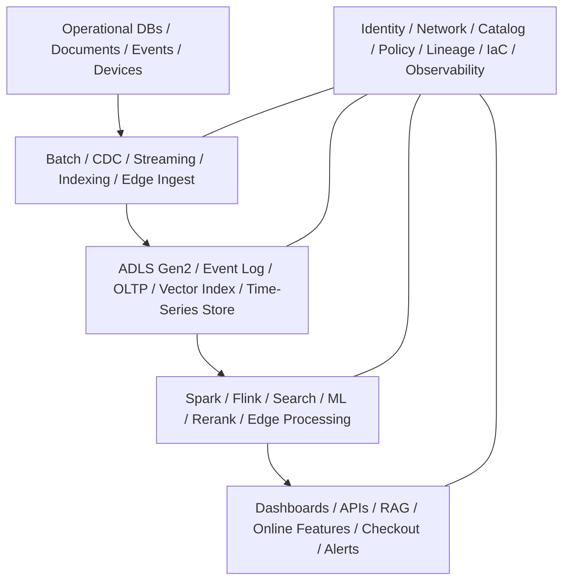
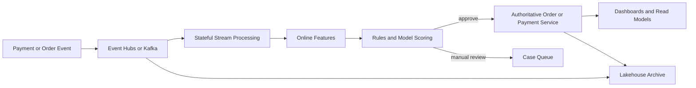
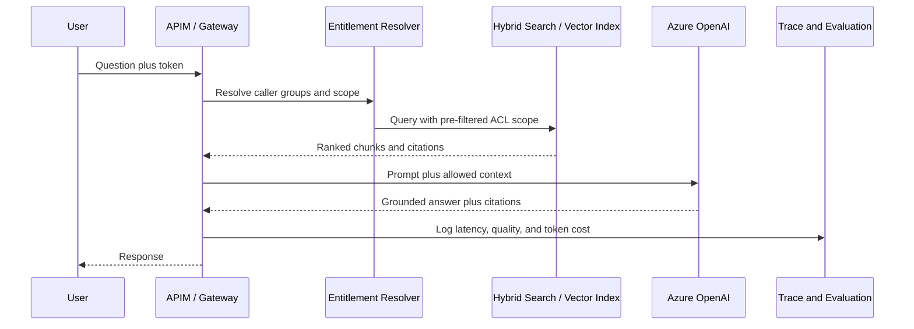

# System Design Scenarios

> Part of the **Enterprise Data & AI Architecture Handbook**.
> Resources — Interview, Chapter 02. Estimated study time: 45-60 min + optional lab.
> Companion chapters: [Interview Question Bank](01_Interview_Question_Bank.md), [System Design Interview Prep](../../Phase-20/03_System_Design_Interview_Prep.md), [Architecture Interview Prep](../../Phase-20/04_Architecture_Interview_Prep.md), [Staff and Principal Promotion](../../Phase-20/05_Staff_and_Principal_Promotion.md), and [Portfolio and Case Studies](../../Phase-20/06_Portfolio_and_Case_Studies.md). This chapter is the scenario-only companion: fewer isolated questions, more complete end-to-end design exercises.

## 1. Executive Summary

This chapter is a scenario bank for enterprise data and AI system design interviews. It assumes the reader already knows the mechanics of how to run a round from [System Design Interview Prep](../../Phase-20/03_System_Design_Interview_Prep.md) and [Architecture Interview Prep](../../Phase-20/04_Architecture_Interview_Prep.md), and already has topic coverage from [Interview Question Bank](01_Interview_Question_Bank.md). Its job is different: to compress realistic, high-signal architecture situations into reusable interview drills that force the candidate to do the hard part live: elicit requirements, quantify scale, separate authoritative paths from projections, choose a right-sized Azure-first design, defend trade-offs, and close with security, cost, operations, and migration.

The chapter centers on six canonical scenarios that cover most modern enterprise data-and-AI interview loops: a governed lakehouse with CDC, a real-time fraud-decisioning platform, an access-controlled enterprise RAG assistant, a shared feature-store and online-inference platform, an industrial IoT predictive-maintenance platform, and a peak-retail dual-path commerce platform. They are deliberately not six unrelated diagrams. They are six permutations of the same underlying architecture problem: how to create one governed substrate that can support batch, streaming, analytics, ML, search, and AI without allowing the fast path, the convenient path, or the fashionable path to replace the correct one.

Throughout, Azure is the primary implementation lane: ADLS Gen2, Databricks, Event Hubs, Service Bus, Azure AI Search, Azure OpenAI, Azure ML, Cosmos DB, APIM, Entra ID, Purview, Azure Monitor, and Managed Prometheus/Grafana. Open-source counterparts are used where they are structurally relevant: Kafka, Spark, Flink, Delta Lake, Iceberg, Feast, MLflow, Qdrant, Milvus, Redis, ClickHouse, Prometheus, Grafana, OpenTelemetry, OpenMetadata, and Kubernetes. AWS and GCP appear only as comparison mappings, not as full primary designs.

## 2. Learning Objectives

By the end of this chapter you will be able to:

- Turn an ambiguous enterprise data/AI prompt into explicit functional requirements, non-functional requirements, and non-goals within the first few minutes of a round.
- Choose a right-sized architecture among batch, CDC, streaming, RAG, feature-store, IoT, and dual-path commerce patterns instead of naming products by habit.
- Explain why authoritative systems and derived read models must be separated in most senior-level designs.
- Surface the hidden hooks interviewers actually care about: access-control propagation, idempotency, replay, evaluation, migration, cost, and operational ownership.
- Defend Azure-first designs while still mapping them clearly to enterprise open-source stacks and to AWS/GCP comparison lanes.
- Self-score your answers using the same dimensions strong panels typically use: requirement capture, quantitative reasoning, decomposition, controls, failure handling, operations, cost, and clarity.

## 3. Business Motivation

Enterprise hiring loops do not fail because candidates have never heard of Kafka or lakehouses. They fail because candidates treat architecture like a naming exercise instead of a decision exercise. A strong resume can still produce a weak system-design round if the candidate cannot distinguish blocking writes from asynchronous projections, throughput from concurrency, security at the edge from access control in derived copies, or a platform worth funding from a platform too early to justify.

Organizations have the inverse problem. Interviewers often know that a scenario is supposed to test "judgment," but unless the scenario is explicit about hidden hooks and scoring anchors, the round drifts into taste, familiarity, or whichever architecture the interviewer saw last quarter. That produces low-signal, low-fairness interviews of exactly the kind [Hiring and Interviewing](../../Phase-19/05_Hiring_and_Interviewing.md) argued against. A scenario bank with constraints, trade-offs, reference solutions, and rubric anchors tightens that signal.

## 4. History and Evolution

- **2000s — object-design and CRUD-system rounds.** Many system-design interviews focused on isolated service modeling, class diagrams, and "design a URL shortener" style prompts, which were useful but too detached from real enterprise data estates.
- **2010s — distributed systems and cloud architecture.** As [Phase-02](../../Phase-02/01_Consensus_and_Coordination.md) and [Phase-03](../../Phase-03/01_Cloud_Architecture_Fundamentals.md) became mainstream operating knowledge, interviews shifted toward partitioning, failure handling, queues, and service boundaries.
- **Late 2010s — data-platform interviews.** The rise of lakehouses, streaming platforms, observability, and data governance made architecture rounds more cross-functional: not just "serve requests," but "ingest, model, govern, monitor, and prove correctness."
- **Early 2020s — MLOps and LLMOps.** [Phase-11](../../Phase-11/01_Machine_Learning_Foundations.md), [Phase-12](../../Phase-12/01_Large_Language_Model_Foundations.md), and [Phase-13](../../Phase-13/01_Vector_Databases_Qdrant_and_Milvus.md) added new failure modes: training-serving skew, evaluation drift, vector-index ACL leaks, prompt/version sprawl, and cost explosion.
- **Current era — architecture as a portfolio of controlled trade-offs.** Senior loops increasingly reward candidates who can integrate cost, security, governance, reliability, and migration into the first answer, not as a cleanup slide at the end.

## 5. Why This Technology Exists

Scenario-driven interview prep exists because topic mastery alone is not enough. Knowing what a feature store is, what CQRS is, or what RAG is does not prove that you can recognize when a scenario actually needs one, when a simpler option is enough, or what hidden operational burden comes with the choice. Scenario packs create a compressed simulation of that decision space.

They also exist because architecture interviews are fundamentally integrative. Real systems are not examined one concept at a time. A "design a fraud platform" question is never only about stream processing; it is also about model serving, online feature freshness, replayability, compliance retention, low-latency data access, incident response, and cost. A scenario bank makes that integration deliberate rather than accidental.

## 6. Problems It Solves

- Converts broad subject knowledge into rehearsed decision patterns under time pressure.
- Forces quantitative reasoning early, so product choices are justified rather than decorative.
- Rehearses the cross-cutting dimensions candidates most often postpone until it is too late: security, governance, observability, reliability, and FinOps.
- Gives interviewers a reusable set of prompts and hidden hooks with consistent scoring anchors.
- Provides reference solutions that are realistic enough for senior/staff/principal loops without pretending there is only one correct answer.
- Bridges pure study chapters such as [Reference Architectures Catalog](../Architecture/01_Reference_Architectures_Catalog.md) and [Architecture Patterns Catalog](../Architecture/02_Architecture_Patterns_Catalog.md) to live interview articulation.

## 7. Problems It Cannot Solve

- It cannot replace hands-on production experience. Knowing the right words for a compaction backlog or a hot partition is not the same as having debugged one at 03:00.
- It cannot predict the exact style of a given interviewer or company loop. Some panels prefer narrower deep dives, others wider architecture trade-offs.
- It cannot reduce senior-level system design to a memorized script. Good panels will mutate the scenario specifically to break memorization.
- It cannot measure dimensions outside the scope of a scenario round, such as sustained execution over months, team leadership quality, or coding depth.
- It cannot justify over-engineering. A scenario bank helps candidates avoid complexity theater, but it cannot prevent an organization from rewarding it if its own rubric is weak.

## 8. Core Concepts

### 8.1 The Scenario Packet

Every strong scenario packet contains five parts:

1. A short prompt with enough business context to anchor the discussion.
2. Explicit constraints: scale, latency, retention, security, residency, budget, and team shape.
3. Hidden hooks the interviewer wants surfaced without prompting.
4. A reference solution that is defensible, not canonical.
5. A scoring model that distinguishes strong reasoning from fluent but shallow diagrams.

### 8.2 Canonical Scenario Catalog

| ID | Scenario | Representative prompt | Dominant constraint | Hidden hook |
|---|---|---|---|---|
| S1 | Governed Lakehouse and CDC | Design a multi-country enterprise lakehouse ingesting 8-12 TB/day from ERP, CRM, and operational databases with 15-minute finance freshness and 7-year retention. | Governance plus incremental correctness | Idempotent MERGE, schema evolution, layer contracts |
| S2 | Real-time Fraud Decisioning | Design a platform that scores payment events at 80k events/s peak with p99 under 150 ms and full replayable audit history. | Low-latency decisions plus auditability | Authoritative path vs derived analytics path |
| S3 | ACL-Aware Enterprise RAG | Design an internal assistant over 25 million documents with department-level ACLs, citations, 3-second p95 latency, and measurable groundedness. | Differentiated access plus evaluation | ACL propagation before retrieval and ranking |
| S4 | Shared Feature Platform | Design a feature platform serving 200 models with point-in-time-correct offline features and sub-40 ms online feature reads. | Online/offline parity | Training-serving skew and feature versioning |
| S5 | Industrial IoT Predictive Maintenance | Design a platform for 500k devices with intermittent connectivity, 10-second critical alerting, and edge processing. | Edge/cloud split plus safety boundaries | Data platform must not become the safety controller |
| S6 | Peak Retail Commerce | Design a Black-Friday-scale platform supporting personalization, inventory visibility, and correct order/payment execution at 20x normal peak. | Dual workload asymmetry | Degrade engagement before commerce |

### 8.3 Shared Scoring Dimensions

Across all six scenarios, strong panels usually score the same dimensions, even if they do not name them explicitly:

- Requirement capture and clarification.
- Quantitative estimation and whether the estimate changes the design.
- Architectural decomposition and interface boundaries.
- Governance and control-plane thinking.
- Failure handling and degradation strategy.
- Operational observability and SLO thinking.
- Cost awareness and right-sizing.
- Migration strategy and reversibility.
- Clarity, pacing, and responsiveness to follow-up.

These dimensions are the live-performance version of the rubrics in [System Design Interview Prep](../../Phase-20/03_System_Design_Interview_Prep.md) and [Architecture Interview Prep](../../Phase-20/04_Architecture_Interview_Prep.md).

### 8.4 Hidden Hooks

Most scenario prompts look simpler than they are. The real signal often lives in whether the candidate surfaces one of these hooks without being dragged there:

- A read model must not become an authoritative decision path.
- Access control must propagate into indexes, features, extracts, caches, and derived tables.
- Streaming does not remove the need for replay, idempotency, and schema discipline.
- "AI system" does not excuse missing evaluation, tracing, and rollback.
- Low latency and low cost often pull in opposite directions; the candidate must name which path gets protected.
- The architecture must fit the team that has to operate it, not the team count implied by a conference talk.

### 8.5 How Seniority Changes the Answer

| Level | What a strong answer emphasizes |
|---|---|
| Engineer | Correct components, sane data flow, and basic operational reasoning |
| Staff Engineer | Trade-offs, failure modes, migration path, and cross-team interfaces |
| Architect | Governance, control-plane design, portfolio fit, and reversibility |
| CTO / CDO / CAIO | Mandate, cost-of-delay, organizational model, risk ownership, and investment sequencing |

## 9. Internal Working

### 9.1 How Strong Answers Are Built

A strong candidate usually follows the same internal loop regardless of the scenario:

1. Clarify business objective, success metric, and non-goals.
2. Estimate scale and convert the estimate into one or two eliminated branches.
3. Draw the simplest architecture that satisfies the hardest constraint.
4. Separate authoritative systems from derived projections.
5. Add the control plane: identity, policy, catalog, lineage, observability, and cost.
6. Choose one critical path for deep dive.
7. Close with risks, migration, and why not the obvious alternative.

### 9.2 How Interviewers Should Evaluate

The interviewer should not ask, "Would I build it exactly this way?" They should ask, "Given the stated constraints, did the candidate construct a coherent system, quantify the decision, name the costs, and show they know which failure mode matters most?" This is why a design that chooses Azure Event Hubs over self-managed Kafka can still be stronger than one that chooses Kafka if the first candidate tied the choice to team size, operating burden, and replay needs while the second treated Kafka as a badge.

### 9.3 Scenario Mutations

Good panels mutate a scenario midstream. Common mutations are:

- The company acquires a second region with data-residency constraints.
- Budget is cut by 40% after the initial design.
- The team is four engineers, not twenty.
- A regulatory reviewer requires deletion proofs for derived artifacts.
- Product now wants an AI assistant or real-time dashboard on top of the same substrate.

The purpose of the mutation is not to "catch" the candidate. It is to test whether the architecture was built on explicit assumptions or on implicit hope.

## 10. Architecture

The reference architecture underlying all six scenarios is a five-plane model:

| Plane | What belongs here | What strong candidates usually say |
|---|---|---|
| Business plane | goals, users, SLA/SLO, constraints, non-goals | "The blocking path is X; the secondary analytics path is Y." |
| Control plane | identity, network posture, catalog, policy, lineage, IaC, observability | "These controls apply to every path, including AI and derived copies." |
| Data movement plane | batch, CDC, streams, document ingestion, telemetry ingestion | "I will preserve replayable history and contracts at ingress." |
| Storage and compute plane | object storage, event log, stream processing, Spark, feature computation, index build | "Storage/compute split follows access pattern, not product fashion." |
| Serving plane | APIs, dashboards, search, online feature reads, order path, model inference | "The read model serves the user; the source of truth makes the irreversible decision." |

This chapter assumes the reader already knows the building blocks from [Reference Architectures Catalog](../Architecture/01_Reference_Architectures_Catalog.md) and [Architecture Patterns Catalog](../Architecture/02_Architecture_Patterns_Catalog.md). The new work here is learning which block to pick, in what order, and under what constraints.

## 11. Components

Every complete answer should account for these components explicitly, even if some are lightweight in a given scenario:

| Component | Why it matters |
|---|---|
| Requirement frame | Prevents the round from collapsing into product naming |
| Workload estimate | Removes implausible branches early |
| Ingestion contract | Prevents garbage, drift, and duplicate semantics at the front door |
| Source-of-truth store | Protects irreversible decisions and replayability |
| Derived-serving layer | Optimizes for users without mutating truth |
| Identity and policy layer | Keeps permissions, residency, and classification coherent |
| Observability layer | Makes latency, failures, and hidden coupling diagnosable |
| Cost model | Stops "senior-looking" architectures from becoming economically incoherent |
| Migration path | Makes adoption realistic rather than greenfield-only |
| Ownership model | A design no team can operate is not a design |

## 12. Metadata

One of the fastest ways to improve a scenario answer is to write explicit metadata at the top-left of the board before drawing the main diagram.

| Metadata field | Example |
|---|---|
| Throughput | `80k events/s peak` |
| Latency | `p99 < 150 ms blocking path` |
| Freshness | `15 min finance`, `T+1 analytics` |
| Retention | `7 years immutable archive` |
| Sensitivity | `PII + PCI`, `department ACLs`, `regulated telemetry` |
| Tenancy | `multi-country`, `multi-BU`, `department scoped` |
| Consistency | `authoritative checkout strong`, `dashboards eventual` |
| Budget | `managed-first unless justified otherwise` |
| Team shape | `6 platform engineers`, `shared SRE`, `central governance` |
| Hidden hook | `ACL propagation`, `idempotency`, `evaluation`, `degrade path` |

Candidates who do this early usually produce more coherent answers because they externalize the assumptions that otherwise remain unstated.

## 13. Storage

Storage choices in senior system-design rounds are rarely about a single database. They are about separating truth, history, projection, and hot serving.

| Scenario | Strong storage choice | Why it fits | Weak-answer smell |
|---|---|---|---|
| S1 | ADLS Gen2 with Delta Lake bronze/silver/gold plus governed serving tables | Replay, ACID updates, schema evolution, lineage, and cost-tiering | "Blob storage with Parquet" and no compaction, retention, or contract plan |
| S2 | Replayable event log plus authoritative payment/order store plus lake archive | Fast decisions need a blocking store; analytics and replay need immutable history | Treating the event log itself as the only durable business authority |
| S3 | Source documents in object storage, index snapshots in vector/search layer, versioned metadata and ACL mappings | Embeddings are derived artifacts, not the source of truth | Storing only embeddings and losing source version, citations, or delete path |
| S4 | Offline feature lake plus low-latency online key-value feature store | Different read/write and latency shapes justify two stores | One shared database for batch training and online feature reads |
| S5 | Hot time-series analytics store plus cold object archive | Recent telemetry is queried differently from long-retained raw history | Keeping all raw telemetry hot forever because it is "safer" |
| S6 | Strongly consistent order/inventory/payment store plus denormalized engagement read models | Checkout correctness and recommendation speed are structurally different | Letting cached availability or recommendation views authorize purchases |

Strong answers often tie these storage choices back to [Delta Lake](../../Phase-04/04_Delta_Lake.md), [Apache Iceberg](../../Phase-04/05_Apache_Iceberg.md), and [CQRS](../../Phase-14/03_CQRS.md): use derived structures aggressively for reads, but do not let them become the place where irreversible business decisions are made.

## 14. Compute

Compute design should follow latency, statefulness, and ownership, not fashion.

| Scenario | Compute default | Why it fits | Interview trap |
|---|---|---|---|
| S1 | Databricks/Spark for CDC normalization, quality checks, and serving-table builds; dbt for semantic transformations | Mature incremental processing and governance integration | Proposing Flink or microservices everywhere for a 15-minute SLA batch/CDC problem |
| S2 | Stateful stream processing plus low-latency rules/model scoring | Fraud depends on keyed state, windows, and bounded synchronous decisions | Sending blocking fraud decisions through a long asynchronous analytics path |
| S3 | Search/retrieval service, optional reranker, LLM inference, evaluation workers | Retrieval and generation are distinct compute steps with distinct scaling curves | Treating the LLM as if it is the retrieval engine |
| S4 | Batch feature computation, model training, and online feature serving/inference | Offline and online paths have different economics and SLOs | Recomputing expensive features synchronously in the request path |
| S5 | Edge filtering and local buffering plus centralized analytics and retraining | Bandwidth, intermittency, and safety boundaries demand edge/cloud split | Shipping all raw device output upstream before any filtering |
| S6 | Separate compute pools for personalization/analytics and protected checkout services | Dual paths need dual isolation domains | Shared autoscale group for recommendations and checkout |

This is where [Apache Spark Internals](../../Phase-05/04_Apache_Spark_Internals.md), [Streaming Fundamentals](../../Phase-07/01_Streaming_Fundamentals.md), and [Azure Machine Learning](../../Phase-11/05_Azure_Machine_Learning.md) should feel connected rather than separate study topics.

## 15. Networking

Networking is where many otherwise-good answers become shallow, because "private endpoint" is named as a slogan rather than a topology.

| Scenario | Strong network posture | Hidden check |
|---|---|---|
| S1 | Hub-spoke or landing-zone-aligned private data plane with private endpoints for storage, Databricks, and serving | Candidate distinguishes private access from merely "Azure-internal" traffic |
| S2 | Public edge only where the business path requires it; broker, state store, and archive on private links | Candidate avoids coupling public-facing APIs to internal stream fabric |
| S3 | APIM or gateway at the edge, private search/index/model services behind it, no public direct access to vector or model endpoints | Candidate disables public access and treats retrieved content as sensitive |
| S4 | Online store and inference close to caller path; offline compute isolated; private control plane | Candidate considers cross-zone latency for features and model serving |
| S5 | Outbound-biased edge connectivity, brokered uplink, strong device identity, no ad hoc inbound control channel | Candidate understands that "connected device" is not permission for inbound reachability |
| S6 | CDN and edge caching for engagement traffic, protected PCI zone for commerce core, bulkheaded internal APIs | Candidate isolates the critical payment path from degradable user experience services |

The relevant mental model is [Azure Networking](../../Phase-03/04_Azure_Networking.md) plus [Network Security and Zero Trust](../../Phase-10/04_Network_Security_and_Zero_Trust.md): private connectivity is necessary but not sufficient; public access must also be disabled where it is not intended.

## 16. Security

Security should change the architecture, not decorate it.

| Scenario | Security-critical design move | Why it matters |
|---|---|---|
| S1 | Classify at ingress, propagate tags and access rules into silver/gold, enforce through catalog and identity | Derived tables are where leaks happen when controls are only documented |
| S2 | Separate payment authority from analyst tooling, make retries idempotent, protect secrets and model endpoints with managed identity | The fraud path is low-latency but still regulated and audit-sensitive |
| S3 | Enforce ACLs before retrieval/ranking, not after generation; least-privilege tools if the assistant can act | Post-filtering either leaks or silently under-returns |
| S4 | Restrict feature access, mask sensitive features, and version training data permissions | Feature reuse is a governance force multiplier only if permissions travel with the feature |
| S5 | Per-device identity, certificate lifecycle, signed edge workloads, and hard safety boundary | A data platform adjacent to control systems must never become the control system |
| S6 | Separate PCI/PII domains, tokenize where needed, and keep recommendation services out of the payment trust boundary | Convenience integration across engagement and commerce is the common failure shape |

The strongest answers reuse the access-control-propagation lesson that appears repeatedly across the handbook, especially [Identity and Access Management with Entra](../../Phase-10/02_Identity_and_Access_Management_with_Entra.md), [Retrieval Augmented Generation](../../Phase-12/03_Retrieval_Augmented_Generation.md), and [Data Privacy and PII Protection](../../Phase-10/07_Data_Privacy_and_PII_Protection.md).

## 17. Performance

Performance reasoning should sound like measurement, not aspiration.

| Scenario | Dominant performance lever | Common incorrect instinct |
|---|---|---|
| S1 | File-size hygiene, partition pruning, data skipping, and skew handling | Adding cluster size before checking small files or skew |
| S2 | Partition-key design, local state size, model-inference path length, and queue latency | Assuming more stream workers alone fix hot keys or slow model calls |
| S3 | Chunking quality, hybrid retrieval, reranking budget, prompt size, and semantic cache hit rate | Sending large contexts to larger models as the default cure |
| S4 | Online feature locality, feature fan-out count, and model endpoint batching | Computing every feature on request because it feels simpler |
| S5 | Edge filtering, compression, batching strategy, and telemetry-cardinality control | Backhauling every raw event at full fidelity by default |
| S6 | Cache placement, dependency shedding, and isolation of recommendation latency from checkout latency | Optimizing p50 page load while missing p99 checkout failures |

Panels reward candidates who reference [Performance Engineering](../../Phase-18/05_Performance_Engineering.md) implicitly: percentile thinking, honest bottleneck isolation, and the refusal to scale hardware before profiling the actual hot path.

## 18. Scalability

Scale is not one number. It is a shape.

| Scenario | Scale axis that matters most | Strong answer pattern |
|---|---|---|
| S1 | Table count, data volume, country/regulatory domains, and consumer diversity | Partition by domain/region/retention needs, not one giant undifferentiated lake |
| S2 | Peak bursts, hot merchants/cards, model concurrency, and replay capacity | Separate synchronous decision path from replay/analytics path |
| S3 | Document corpus size, tenant count, ACL cardinality, and query concurrency | Shard indexes and caches along corpus/tenant/region boundaries |
| S4 | Model count, feature reuse, and online read concurrency | Central registry and reusable feature definitions beat team-by-team duplication |
| S5 | Device fleet size, gateway fan-in, offline buffering, and region spread | Hierarchical ingestion and store-and-forward beat flat fleet designs |
| S6 | Traffic spikes, catalog breadth, and read-vs-write asymmetry | Independent scaling lanes for engagement and commerce |

The key senior move is not saying "horizontal scaling." It is naming which state, which key, or which coordination boundary will stop the system from scaling cleanly.

## 19. Fault Tolerance

Fault tolerance is where architecture becomes honest.

| Scenario | Expected failure | Strong response |
|---|---|---|
| S1 | CDC duplicates, out-of-order updates, schema drift | Idempotent merges, quarantine path, replayable bronze, contract violation alerts |
| S2 | Broker lag, online-store failure, model endpoint timeout | Bounded fallback, manual-review path, replay queue, circuit breakers |
| S3 | Search/index lag, LLM degradation, citation failure | Search-only fallback, fail-closed for protected content, bounded retries, answer suppression when grounding is weak |
| S4 | Online feature-store miss, stale features, training-serving skew | Default/fallback features only where risk permits, skew monitors, versioned rebuild path |
| S5 | Connectivity loss, gateway backlog, certificate expiry | Local buffering, degraded edge mode, staged rollout, device-lifecycle monitoring |
| S6 | Recommendation tier overload, cache cascade, reserve-confirm contention | Shed engagement first, keep reserve-confirm path alive, idempotent order/payment retries |

Strong answers reference [Reliability and SRE](../../Phase-18/04_Reliability_and_SRE.md) implicitly: define what the user-facing service is, decide how the system degrades, and say what freezes when the error budget burns.

## 20. Cost Optimization

Cost answers should be architectural, not post hoc purchasing advice.

| Scenario | Highest-leverage saving | Never do |
|---|---|---|
| S1 | Tier raw data, optimize file sizes, and use job/ephemeral compute where possible | Cut data quality or lineage to save storage or cluster cost |
| S2 | Keep the decision path minimal; use spot or batch savings only on non-blocking retraining/replay | Run the blocking fraud path on interruptible infrastructure |
| S3 | Apply cache, retrieval narrowing, and model routing before reaching for a larger model tier | Remove evaluation or guardrails because they "do not serve users directly" |
| S4 | Reuse shared features, set TTLs, and separate expensive backfills from online serving | Let every model own its own parallel feature pipeline |
| S5 | Downsample aggressively, keep critical events high fidelity, and archive cold telemetry | Centralize high-volume video or telemetry without a value filter |
| S6 | Reserve baseline commerce capacity and autoscale/shadow only engagement workloads aggressively | Share critical checkout resources with degradable recommendation traffic |

This is the scenario form of [FinOps and Cost Optimization](../../Phase-18/01_FinOps_and_Cost_Optimization.md): cost ownership, unit economics, and safe degradation matter more than generic "optimize spend" language.

## 21. Monitoring

Strong monitoring answers define what pages a human and what merely informs a dashboard.

| Scenario | Page-worthy symptoms | Dashboard signals |
|---|---|---|
| S1 | Freshness SLO breach, repeated contract failures, serving-table build failures | Input volume, compaction backlog, data-quality trend |
| S2 | Decision latency burn, replay backlog threatening audit SLA, manual-review queue saturation | Feature freshness, model score distribution, broker throughput |
| S3 | p95 response burn, citation/groundedness breach, entitlement-filter failure | Cache hit rate, token cost, top failing sources |
| S4 | Online feature miss rate, skew detection, inference availability | Training freshness, feature TTL hit rate, registry growth |
| S5 | Device silence beyond threshold, gateway backlog, critical alert delay | Fleet onboarding rate, battery/connectivity trend, certificate aging |
| S6 | Checkout success SLO burn, reserve-confirm conflict spike, payment retry surge | Recommendation CTR, cache hit rate, peak-factor trend |

The panel is often checking whether the candidate knows that cause-level alerts belong mostly on dashboards and tickets, while symptom-level SLO burn belongs on the pager, per [Monitoring with Prometheus and Grafana](../../Phase-18/03_Monitoring_with_Prometheus_and_Grafana.md).

## 22. Observability

Observability answers explain how the team would diagnose an unknown failure after the fact, not just how they would graph known metrics.

| Scenario | Hard-to-diagnose defect | Observability requirement |
|---|---|---|
| S1 | A gold KPI changes because one upstream contract drifted silently | Column/table lineage, data-quality history, and change-event correlation |
| S2 | Fraud latency regresses only for one merchant cohort | Trace event ID through broker, feature lookup, rule engine, and model call |
| S3 | Retrieval looks healthy but groundedness falls | Trace query, filter set, retrieved chunks, reranker decisions, model/citation pair |
| S4 | Model accuracy falls only in production | Point-in-time feature lineage, training-serving parity records, inference traces |
| S5 | Alerts drop for one plant after a firmware rollout | Device identity, firmware version, gateway path, and downstream processing trace |
| S6 | Checkout fails only when personalization load spikes | Cross-service correlation between recommendation saturation and checkout latency |

The strong move is to connect [Observability with OpenTelemetry](../../Phase-18/02_Observability_with_OpenTelemetry.md) to data lineage, not treat them as separate disciplines.

## 23. Governance

Governance is not the section where a candidate says "we would use Purview" and moves on. It is where they explain how policy becomes behavior.

| Governance concern | Strong answer pattern |
|---|---|
| Data classification | Apply at ingress, propagate to every derived artifact, enforce through catalog/policy |
| Contracts | Versioned schema plus semantic/SLA owner; violations quarantine or fail the build |
| AI evaluation | Bundle version plus disaggregated metrics and promotion gate |
| Residency | Named regional boundaries with explicit data-placement and failover choices |
| Deletion and retention | Explain what happens to snapshots, indexes, features, caches, and exports |
| Exceptions | Time-box, record, and review via ADR; do not let "temporary" become architecture |
| Ownership | Every scenario has one owner per contract boundary, not just one platform team for everything |

The relevant supporting chapters are [Data Contracts](../../Phase-08/07_Data_Contracts.md), [Federated Governance](../../Phase-15/04_Federated_Governance.md), [Responsible AI](../../Phase-11/07_Responsible_AI.md), and [CDO and CAIO Playbook](../../Phase-19/08_CDO_and_CAIO_Playbook.md).

## 24. Trade-offs

Trade-offs are where seniority becomes visible. A candidate who names only benefits usually does not yet think architecturally.

| Decision | Benefit | Cost | When not to do it |
|---|---|---|---|
| Batch + CDC instead of full streaming | Simpler operation and lower cost | Higher freshness floor | When the blocking user decision truly needs sub-second propagation |
| Delta Lake / Iceberg table layer | ACID, versioning, replay, quality gates | Extra metadata and operational discipline | When the workload is tiny and a simple warehouse table is enough |
| Managed Event Hubs instead of self-managed Kafka | Lower operating burden, faster secure baseline | Less low-level broker control | When Kafka-native features or portability gaps are truly blocking |
| Azure AI Search instead of self-managed vector DB | Managed hybrid retrieval and enterprise integration | Less knob-level control | When the use case needs specialized ANN behavior the managed lane cannot expose |
| Shared feature platform | Reuse, consistency, and lower skew | Shared governance and platform cost | When the org has too few models to justify the abstraction |
| Separate engagement and commerce paths | Protects revenue-critical correctness | Higher conceptual and integration complexity | When the workload is too small to justify independent lanes |
| Single governed control plane | Lower drift, consistent policy, easier audit | Risk of platform bottleneck if golden paths are weak | When the central team cannot fund and operate the responsibility it claims |

## 25. Decision Matrix

Use this matrix to choose the default scenario skeleton under interview pressure.

| Prompt cue | Start from this scenario | First architectural decision |
|---|---|---|
| `hourly to 15-minute freshness`, `many operational sources`, `auditable analytics` | S1 Governed Lakehouse and CDC | Choose batch + CDC first; escalate to streaming only if a blocking decision path appears |
| `sub-150 ms`, `block or approve transaction`, `must replay history` | S2 Real-time Fraud Decisioning | Split decision path from replay/analytics path immediately |
| `unstructured corpus`, `citations`, `department access`, `AI assistant` | S3 ACL-Aware Enterprise RAG | Put identity and ACL filtering before retrieval/ranking |
| `same features online and offline`, `many models`, `skew` | S4 Shared Feature Platform | Create one feature definition with offline and online materializations |
| `devices`, `intermittent connectivity`, `edge`, `safety` | S5 Industrial IoT Predictive Maintenance | Draw edge/cloud boundary and no-direct-actuation rule early |
| `peak retail`, `personalization`, `inventory`, `payments` | S6 Peak Retail Commerce | Protect checkout path; degrade engagement first |

The best default is almost always the simplest architecture that satisfies the hardest stated constraint, not the architecture with the most branded components.

## 26. Design Patterns

The following patterns recur across most strong answers in this chapter:

- **Authoritative system plus derived projections.** Critical for S2 and S6, but also true of S1 gold tables, S3 indexes, and S4 online features.
- **Transactional outbox plus idempotent consumer.** Safer than dual writes whenever state change must fan out.
- **Bronze/silver/gold with explicit quality gates.** Strong default for S1 and often the offline side of S4 and S5.
- **Hybrid retrieval with pre-filtered ACLs.** Strong default for S3; keyword plus vector plus reranking beats dense-only by default.
- **Offline/online feature pair.** Same logical feature, different materialization targets, as in [Feature Stores with Feast](../../Phase-11/02_Feature_Stores_with_Feast.md).
- **Bulkheads and graceful degradation.** Especially important in S2 and S6 where not every path deserves equal protection.
- **Single control plane across data and AI.** Identity, catalog, lineage, policy, and observability should not bifurcate when AI enters.
- **Golden paths with enforced defaults.** A recurring lesson from [Self-Serve Data Platform](../../Phase-15/05_Self_Serve_Data_Platform.md) and [Platform Engineering](../../Phase-09/02_Platform_Engineering.md).

## 27. Anti-patterns

- Naming Kafka, Flink, vector databases, or agents before stating the workload numbers that justify them.
- Treating the lakehouse, vector index, or read model as the place where irreversible business decisions are made.
- Creating a separate AI stack with copied documents and copied ACLs rather than a governed extension of the existing platform.
- Saying "exactly once" without explaining what is actually guaranteed and where idempotency still lives.
- Building multi-region active-active by default because it sounds senior.
- Using one autoscale pool or shared cache for both degradable and revenue-critical traffic.
- Proposing a feature store before demonstrating that the organization has enough models and reuse to justify one.
- Confusing a system design round with a tool catalog.

## 28. Common Mistakes

- No explicit estimate, or an estimate that never changes the design.
- No non-goals, so the candidate implicitly promises everything.
- No migration path from the current state.
- No cost model other than "use managed services."
- Security added at the perimeter but not carried into derived artifacts.
- Observability described as logging and dashboards, with no traceability or lineage.
- Governance described as a committee rather than an enforcement mechanism.
- No clear explanation of what happens when the hot path fails.
- No rejected alternative, which makes the final choice look unexamined.

## 29. Best Practices

- Write the top-line numbers before drawing the first box.
- State one source of truth and say what is merely a projection.
- Make the control plane visible on the diagram, not implicit.
- Say which path is allowed to degrade and which path is not.
- Keep the first design one level simpler than your ego wants.
- Name the operational owner of every critical boundary.
- Use one or two concrete data contracts or SLIs as examples.
- Include a migration or rollout sequence, not just the end state.
- Close by stating why you rejected the most tempting alternative.

## 30. Enterprise Recommendations

For most enterprise data-and-AI interviews, the strongest default recommendation is this:

1. Start Azure-managed and governed by default.
2. Treat open-source components as targeted exceptions or portability lanes, not ideology.
3. Put identity, network posture, catalog, lineage, policy, and observability on a single control plane.
4. Separate authoritative systems from fast-serving projections everywhere.
5. Do not let AI bypass the controls already required of data systems.
6. Fund platform guardrails only if you also fund platform usability; otherwise teams will route around them.

This is the interview form of a deeper enterprise truth repeated across the handbook: strong architecture is less often about inventing new patterns than about consistently applying the right old ones.

## 31. Azure Implementation

### 31.1 Azure-First Default Stack

The default Azure lane across these scenarios is:

- **Identity and control:** Entra ID, managed identities, Key Vault, Azure Policy, Private DNS, Defender for Cloud, Purview.
- **Storage and analytics:** ADLS Gen2 plus Delta Lake on Databricks; Databricks SQL, Fabric, or Power BI for serving; ADX where hot time-series or log analytics are dominant.
- **Streaming and integration:** Event Hubs for replayable event streams, Service Bus for command/queue semantics, APIM at the edge.
- **AI and ML:** Azure AI Search, Azure OpenAI, Azure ML, MLflow/Unity Catalog integration, Prompt Flow or equivalent evaluation orchestration.
- **Operations:** Azure Monitor, Log Analytics, Managed Prometheus, Managed Grafana, Sentinel.

### 31.2 Scenario-to-Service Mapping

| Scenario | Azure-default path | Why this is the pragmatic default |
|---|---|---|
| S1 | ADLS Gen2 + Databricks Delta + Event Hubs/ADF + Databricks SQL/Power BI | Strong governance, incremental processing, and familiar enterprise operating model |
| S2 | Event Hubs Premium + Databricks Structured Streaming or Flink + Azure ML + Cosmos DB/Redis + ADX | Low-latency stream path plus replay, model hosting, and analytics separation |
| S3 | Azure AI Search + Azure OpenAI + APIM + ADLS Gen2 + Purview | Managed hybrid retrieval, enterprise identity, and easier secure perimeter |
| S4 | Databricks Feature Store or Feast on AKS + Redis/Cosmos DB + Azure ML | Clear offline/online separation with enterprise control points |
| S5 | IoT Hub + DPS + IoT Operations/edge + ADX + ADLS + Azure ML | Native fleet identity plus strong telemetry and cold-storage path |
| S6 | Front Door + APIM + Cosmos DB or Azure SQL + Redis + Event Hubs + Databricks/ADX | Clean split between commerce authority and engagement analytics/personalization |

### 31.3 Secure Substrate Example

```bicep
resource storage 'Microsoft.Storage/storageAccounts@2023-05-01' = {
  name: 'stplatprod001'
  location: resourceGroup().location
  sku: {
    name: 'Standard_ZRS'
  }
  kind: 'StorageV2'
  properties: {
    isHnsEnabled: true
    publicNetworkAccess: 'Disabled'
    allowBlobPublicAccess: false
    allowSharedKeyAccess: false
    minimumTlsVersion: 'TLS1_2'
  }
}
```

That single resource definition already encodes several interview-grade decisions: hierarchical namespace for lakehouse patterns, no public network access, no shared-key shortcuts, and a zone-aware durability choice. A strong candidate would say this gets paired with private endpoints, managed-identity RBAC, and policy-as-code rather than being treated as a standalone security story.

### 31.4 Idempotent CDC Example

```sql
WITH ranked AS (
  SELECT *,
         ROW_NUMBER() OVER (
           PARTITION BY order_id
           ORDER BY commit_lsn DESC
         ) AS rn
  FROM bronze_orders
)
MERGE INTO silver_orders AS target
USING (
  SELECT *
  FROM ranked
  WHERE rn = 1
) AS source
ON target.order_id = source.order_id
WHEN MATCHED AND source.commit_lsn > target.commit_lsn THEN UPDATE SET *
WHEN NOT MATCHED THEN INSERT *
```

This is the kind of concrete example that upgrades an S1 answer from conceptual to operational. It shows replay-safe ingestion, late-arriving update handling, and explicit duplicate collapse.

### 31.5 Azure-Native Monitoring Query Example

```kusto
ScenarioSignals
| where ScenarioId == 'S3-RAG'
| summarize P95LatencyMs = percentile(DurationMs, 95),
            Groundedness = avg(GroundednessScore),
            TokenCostUsd = sum(TokenCostUsd)
  by bin(Timestamp, 15m)
| where P95LatencyMs > 3000
   or Groundedness < 0.85
   or TokenCostUsd > 250
```

This is a strong S3 monitoring pattern because it combines user-facing latency, answer-quality signal, and unit-cost signal in one place. Mature enterprise answers increasingly do this rather than separating cost from quality.

## 32. Open Source Implementation

### 32.1 Reference Open-Source Stack

| Capability | Enterprise open-source default |
|---|---|
| Event transport | Kafka, optionally with Debezium for CDC |
| Batch and stream compute | Spark and Flink |
| Table and lake layer | Delta Lake, Iceberg, or Hudi on object storage such as MinIO or cloud object storage |
| Query and serving | Trino, ClickHouse, Pinot, Druid, PostgreSQL, Redis |
| Search and vectors | Qdrant or Milvus; Elasticsearch/OpenSearch where keyword plus vector unification matters |
| ML and features | MLflow, Feast, Ray Serve, TensorFlow/PyTorch |
| Control plane | Kubernetes, Terraform, GitHub Actions, OPA, OpenMetadata or Atlas, Great Expectations |
| Ops plane | Prometheus, Grafana, OpenTelemetry, Loki, Tempo, Mimir, Alertmanager |

The open-source lane is strongest when the organization already has the platform depth to operate it or when a capability gap justifies the burden. In interviews, candidates score well when they state that burden explicitly.

### 32.2 Stream Baseline Example

```bash
kafka-topics.sh --create \
  --topic payments \
  --partitions 48 \
  --replication-factor 3 \
  --config min.insync.replicas=2 \
  --config cleanup.policy=delete
```

The important interview move here is not the command itself. It is explaining why partition count, replication factor, and `min.insync.replicas` belong in the reasoning: throughput, replay, fault tolerance, and ordering scope are all coupled.

### 32.3 Observability Baseline Example

```yaml
receivers:
  otlp:
    protocols:
      grpc:
      http:

processors:
  memory_limiter:
    check_interval: 1s
    limit_mib: 1024
  batch:
  tail_sampling:
    decision_wait: 10s
    policies:
      - name: errors
        type: status_code
        status_code:
          status_codes: [ERROR]
      - name: high_latency
        type: latency
        latency:
          threshold_ms: 3000

exporters:
  prometheus:
    endpoint: 0.0.0.0:9464

service:
  pipelines:
    traces:
      receivers: [otlp]
      processors: [memory_limiter, tail_sampling, batch]
      exporters: [prometheus]
```

This is relevant across S2-S6 because the best scenario answers do not stop at component selection; they show how to make the chosen system operable at production scale.

## 33. AWS Equivalent (comparison only)

| Azure-first choice | AWS comparison | Notes |
|---|---|---|
| ADLS Gen2 + Databricks Delta | S3 + Databricks or EMR + Iceberg/Hudi/Delta | AWS is strong when the team already accepts more assembly and lakehouse-tool composition |
| Event Hubs | MSK or Kinesis | MSK is closer to Kafka operations; Kinesis is simpler but more proprietary |
| Service Bus | SQS + SNS + EventBridge | AWS often composes multiple services where Azure uses one queue-centric service |
| Azure AI Search | OpenSearch or Bedrock Knowledge Bases | Bedrock lowers integration effort; OpenSearch gives more index control |
| Azure OpenAI | Bedrock | Bedrock is broader across model providers; Azure often wins for Microsoft-estate integration |
| Azure ML | SageMaker | SageMaker is a mature comparison lane, especially for platform-heavy ML teams |
| Purview + Unity Catalog | Lake Formation + Glue + DataZone | AWS governance is capable but more explicitly assembled |
| Azure Monitor / Managed Prometheus | CloudWatch + AMP + AMG + X-Ray | Similar control points, but different default integrations |

AWS is often the stronger comparison when the interviewer wants to probe multi-account operating models, SageMaker depth, or MSK-first streaming strategies. It is weaker if presented as a full alternative implementation when the prompt asked for Azure-primary and comparison-only AWS.

## 34. GCP Equivalent (comparison only)

| Azure-first choice | GCP comparison | Notes |
|---|---|---|
| ADLS Gen2 + Databricks Delta | GCS + Dataproc/Databricks + BigQuery or Iceberg | GCP is especially strong when BigQuery-style serverless analytics is central |
| Event Hubs | Pub/Sub or Managed Kafka | Pub/Sub is strong for fully managed messaging, weaker as a Kafka mental-model substitute |
| Service Bus | Pub/Sub + Cloud Tasks + Workflows | Queue/command semantics are more explicitly composed |
| Azure AI Search | Vertex AI Search | Strong managed search/RAG lane, especially in broader Vertex ecosystems |
| Azure OpenAI | Vertex AI / Gemini | GCP comparison usually emphasizes model ecosystem and SRE heritage |
| Azure ML | Vertex AI | Vertex is a strong peer for managed ML platform capabilities |
| Purview + Unity Catalog | Dataplex + BigQuery governance + Data Catalog | GCP governance is strongest when aligned to BigQuery-native patterns |
| Azure Monitor / Managed Prometheus | Cloud Monitoring + Managed Service for Prometheus + Cloud Trace | GCP's SRE lineage makes the operational story particularly coherent |

GCP is usually the strongest comparison for serverless analytics, SRE-native thinking, and managed AI stacks. In interview answers, it should remain a comparison lane, not displace the Azure design unless the prompt explicitly asks for a multi-cloud decision.

## 35. Migration Considerations

Migration is where many otherwise-good interview answers become greenfield fantasies. Strong candidates show how to get from the current state to the target state safely.

- **Batch to CDC/streaming:** introduce a replayable ingress layer first, then incrementally shrink batch windows. Do not jump directly from nightly ETL to full real-time if no user-facing decision needs it.
- **Single-team scripts to governed lakehouse:** front-load the control plane: identity, storage posture, catalog, contracts, and CI checks. Governance added later usually becomes advisory.
- **Search to enterprise RAG:** start with search-plus-citations and ACL-safe retrieval before adding tool use or agent loops.
- **Per-model feature logic to shared feature platform:** migrate only the reused/high-value features first; do not force every model into a new abstraction on day one.
- **Self-managed OSS to Azure-managed:** preserve stable interfaces, topic names, contracts, and lineage identifiers so the migration is operationally visible but logically boring.
- **Single-region to multi-region:** make data-placement and failover choices explicit per artifact type; not every cache, feature view, or vector shard deserves the same strategy as the authoritative transaction path.

The senior signal is not just naming blue/green, canary, or dual-write. It is knowing when each is safe, expensive, or structurally dangerous.

## 36. Mermaid Architecture Diagrams

### 36.1 Multi-Scenario Reference Architecture



### 36.2 Real-Time Decisioning With Protected Authority



### 36.3 ACL-Aware RAG Request Flow



## 37. End-to-End Data Flow

The following end-to-end flows are worth being able to narrate without hesitation.

### 37.1 S1 Governed Lakehouse and CDC

1. Source systems emit batch files or CDC streams.
2. Ingestion writes immutable bronze data with schema/version metadata.
3. Quality and contract checks validate the feed; violations quarantine.
4. Silver transforms normalize duplicates, late arrivals, and business keys.
5. Gold/serving tables publish stable semantic outputs to dashboards and APIs.
6. Catalog, lineage, freshness SLOs, and cost tags apply end-to-end.

### 37.2 S3 ACL-Aware Enterprise RAG

1. Documents land in object storage with source-system identity and classification.
2. Ingestion chunks and embeds documents, preserving source identifiers and ACLs.
3. Index build writes versioned search/vector artifacts rather than replacing in place blindly.
4. The request path resolves user identity, scopes retrieval, assembles context, and calls the model.
5. Responses include citations and trace metadata.
6. Evaluation continuously measures groundedness, latency, and cost against release versions.

### 37.3 S6 Peak Retail Commerce

1. Catalog, session, clickstream, and recommendation events flow through the engagement lane.
2. Recommendation services compute or fetch ranked results from cached or indexed projections.
3. Checkout calls the authoritative reserve-confirm path against inventory, pricing, and payment systems.
4. Successful authoritative changes publish events to downstream read models and analytics.
5. Under overload, recommendation and analytics lanes shed or degrade before checkout does.
6. Finance, fraud, and customer-support analytics consume replayable history later without sitting in the blocking path.

## 38. Real-world Business Use Cases

| Business use case | Best-fit scenario | Why |
|---|---|---|
| Global finance and operations reporting | S1 | Many upstream systems, strong audit expectations, mixed freshness needs |
| Payment fraud and abuse prevention | S2 | Low-latency decisions with replay and analyst workflows |
| Enterprise knowledge assistant with differentiated access | S3 | Unstructured corpus, citations, and ACL-sensitive retrieval |
| Shared model platform for churn, pricing, and risk | S4 | High feature reuse plus online/offline consistency |
| Predictive maintenance across industrial sites | S5 | Telemetry-heavy, intermittent, edge-aware, safety-adjacent |
| Black-Friday-scale digital commerce | S6 | High read/write asymmetry and the need to protect the payment path |

These use cases are deliberately chosen because they recur across many industries while still being specific enough to force concrete architecture choices.

## 39. Industry Examples

| Public example | Scenario lesson | Related resource |
|---|---|---|
| Netflix data platform and Iceberg evolution | Governed self-service and metadata-first thinking matter more than stack copying | [Netflix](../CaseStudies/01_Netflix_Data_Platform_Case_Study.md) |
| Uber's Hudi, Michelangelo, and real-time stack | Incremental storage correctness, ML platformization, and replayable streaming | [Uber](../CaseStudies/02_Uber_Data_Infrastructure_Case_Study.md) |
| Airbnb Minerva | Semantic consistency is a system-design problem, not a BI naming problem | [Airbnb](../CaseStudies/03_Airbnb_Minerva_Case_Study.md) |
| Spotify paved roads and Backstage | Platform usability is as important as platform governance | [Spotify](../CaseStudies/04_Spotify_Data_Platform_Case_Study.md) |
| LinkedIn and Kafka | Replayable logs solve integration shape problems, not every problem | [LinkedIn](../CaseStudies/05_LinkedIn_and_the_Birth_of_Kafka.md) |

Strong candidates use these examples sparingly. A public case study should support a point, not replace the candidate's own reasoning.

## 40. Case Studies

### Case Study 1: The Daily Dashboard That Somehow Needed Kafka, Flink, and Three SREs

A retailer asked for a next-morning executive dashboard plus a 15-minute operational dashboard for store fulfillment. The candidate presented an architecture with self-managed Kafka, Flink, Kubernetes, Pinot, custom schema registry workflows, and active-active multi-region replication. Nothing in the prompt required sub-second decisioning, always-on replay from many independent consumers, or a dedicated streaming platform team. The actual workload was a few terabytes per day, a six-person data team, and a tolerance for 15-minute lag.

The issue was not that the design was technically impossible. The issue was that it violated the right-sizing discipline of [System Design Interview Prep](../../Phase-20/03_System_Design_Interview_Prep.md) and the platform-ownership lesson of [Platform Engineering](../../Phase-09/02_Platform_Engineering.md). A strong answer would have started from managed CDC plus a lakehouse, only escalating to full streaming infrastructure if a newly stated blocking decision path appeared.

### Case Study 2: The Enterprise RAG Assistant That Inherited Every Document Except Its Permissions

An internal assistant was built quickly on top of a large document corpus. The ingestion pipeline copied documents into a shared retrieval index, but dropped source ACLs on the assumption that the application layer would filter responses later. The system looked fine in staging because test data was broad-access and the retrieval quality metrics improved as the index grew. The production failure came later: a user in Marketing retrieved HR-sensitive content because retrieval occurred before access evaluation.

This is the recurring access-control-propagation defect seen throughout the handbook, especially in [Retrieval Augmented Generation](../../Phase-12/03_Retrieval_Augmented_Generation.md), [Model Context Protocol MCP](../../Phase-12/06_Model_Context_Protocol_MCP.md), and [Healthcare Data Platforms](../../Phase-17/01_Healthcare_Data_Platforms.md). The fix was architectural, not procedural: permissions had to be preserved during ingestion, enforced at retrieval time, and verified continuously with audit queries and evaluation cases.

### Architecture Decision Record (ADR-0220): Single Governed Control Plane Across Scenario Families

**Context:** The six canonical scenarios in this chapter look different on the surface, but they all fail in similar ways when each team builds its own identity, policy, observability, and governance model. The result is duplicated controls, inconsistent access semantics, fragmented lineage, and a separate "AI stack" that drifts from the governed data platform.

**Decision:** Use one governed control plane across batch, streaming, serving, search, ML, and AI paths. In Azure-first terms, that means Entra ID, managed identities, private networking, Purview, catalog enforcement, IaC, observability, and cost tagging apply to every scenario. Scenario-specific stacks are allowed, but only as data/compute/serving variants under the same control plane.

**Consequences:** This reduces ACL drift, shortens audit and incident response, and makes migration and comparison easier. It also increases the burden on the platform team: if the golden path is slow, teams will route around it. The control plane therefore has to be both enforced and usable.

**Alternatives considered:**

- Separate AI platform with copied documents and separate identity model.
- Per-team autonomy over governance and observability, with later central reporting.
- Fully self-managed open-source stack as the default even for small platform teams.

## 41. Hands-on Labs

| Lab | Goal | Deliverable |
|---|---|---|
| Lab 1: 45-Minute Lakehouse Drill | Design S1 in one sitting with explicit estimates and rollout phases | One-page architecture diagram plus one ADR |
| Lab 2: Secure RAG Design | Design S3 with ACL propagation, evaluation, and cost control | Sequence diagram, control-plane list, and evaluation rubric |
| Lab 3: Feature Platform Deep Dive | Design S4 with point-in-time correctness and online serving | Feature flow diagram plus offline/online contract table |
| Lab 4: Peak-Commerce Protection | Design S6 with dual-path degradation and reserve-confirm checkout | Load-shed policy, SLOs, and failure-mode table |

The labs are intentionally small enough to fit inside the same time box as an interview round plus a short retrospective.

## 42. Exercises

- Take any one of the six scenarios and cut the budget in half. What changes first, and what must not change?
- Add a second region with hard residency constraints. Which artifacts replicate, which do not, and why?
- Replace the managed service you chose with an open-source alternative. Name the new operational responsibilities explicitly.
- Force a hidden hook into the answer: deletion proofs for S3, 20x burst for S2, or a four-person team for S1.
- For each scenario, write one sentence that begins, "This projection must never become authoritative because..."
- Redesign one scenario as if the current state is a messy legacy estate, not a greenfield.
- Score your own answer using the dimensions in [System Design Interview Prep](../../Phase-20/03_System_Design_Interview_Prep.md) and compare the weak points to [Interview Question Bank](01_Interview_Question_Bank.md).

## 43. Mini Projects

1. Build a two-page reference design for S1 with a Bicep/Terraform secure substrate, a CDC flow, and a gold-table serving path.
2. Create a design packet for S3 including a retrieval diagram, an evaluation plan, and an ACL propagation test matrix.
3. Model S6 as two independent deployment lanes and write the explicit degradation policy for a Black Friday event.

The point of these projects is not to build a full platform. It is to create a small but defensible artifact that forces precise trade-off language.

## 44. Capstone Integration

This chapter sits in the middle of the handbook's capstone chain:

- [Capstone Enterprise Data Platform](../../Phase-20/01_Capstone_Enterprise_Data_Platform.md) and [Capstone Enterprise AI Platform](../../Phase-20/02_Capstone_Enterprise_AI_Platform.md) provide the underlying architecture patterns.
- [System Design Interview Prep](../../Phase-20/03_System_Design_Interview_Prep.md) and [Architecture Interview Prep](../../Phase-20/04_Architecture_Interview_Prep.md) provide the live-round mechanics.
- [Staff and Principal Promotion](../../Phase-20/05_Staff_and_Principal_Promotion.md) explains how the same judgment becomes internal scope.
- [Portfolio and Case Studies](../../Phase-20/06_Portfolio_and_Case_Studies.md) explains how to make the same judgment legible externally.

In that sense, this chapter is the bridge from knowledge to rehearsal. It is where architecture stops being something you "know about" and becomes something you can defend under pressure.

## 45. Interview Questions

- Design a governed ingestion platform for 5 TB/day of CRM and ERP data with 15-minute freshness for operations and next-day finance reporting.
- Design a telemetry platform for 100k devices where field gateways can be offline for hours at a time.
- Design a simple internal search assistant with citations and explain how you would add AI safely later.
- Design an online feature-serving path for a churn model that needs a sub-50 ms feature lookup.
- Design a reporting platform for a multi-region business where some data cannot leave the EU.
- Explain when you would choose batch plus CDC instead of a full streaming architecture.

## 46. Staff Engineer Questions

- Twelve teams all need analytics from the same operational sources. Design the platform contracts and ownership model, not just the pipeline.
- Your company wants a feature store. What evidence would you require before funding one, and what would you reject as overkill?
- A team wants to introduce Kafka for a workload that currently fits inside Event Hubs and scheduled jobs. How do you decide?
- Design a migration from ad hoc document search to an ACL-aware RAG platform without creating a separate ungoverned AI data estate.
- A product team wants real-time dashboards and fraud decisions from the same event stream. Explain where you split the architecture and why.
- Your retail platform shares a cache between personalization and checkout today. What is the safest evolution path?

## 47. Architect Questions

- Design an enterprise data-and-AI platform for a two-region company with shared global governance and region-specific residency constraints.
- Decide whether the organization should run one governed platform or separate domain-owned platforms with thin central standards.
- Design the control plane that must stay consistent across lakehouse, feature-store, RAG, and API-serving paths.
- A merger adds a second table format, a second BI estate, and a second IAM model. What do you standardize first and what do you leave alone initially?
- Design the deletion and retention model for a system that has raw data, serving tables, extracts, embeddings, caches, and model-training snapshots.
- You are allowed only one additional platform team in the next year. Which scenario family gets funded first and why?

## 48. CTO Review Questions

- Which two of the six scenario families deserve platform investment first for a mid-sized enterprise, and what evidence justifies the order?
- When does the cost of a shared control plane exceed its governance benefit?
- What is the smallest team shape that can responsibly operate an enterprise RAG platform with differentiated access?
- If budget falls 30%, which capabilities are negotiable and which are not, across these scenario families?
- When should the company accept managed-service lock-in because time-to-safe-operation matters more than theoretical portability?
- What metrics would convince you that a platform has become a force multiplier rather than a bottleneck?

## 49. References

- [Interview Question Bank](01_Interview_Question_Bank.md), [System Design Interview Prep](../../Phase-20/03_System_Design_Interview_Prep.md), and [Architecture Interview Prep](../../Phase-20/04_Architecture_Interview_Prep.md).
- [Capstone Enterprise Data Platform](../../Phase-20/01_Capstone_Enterprise_Data_Platform.md) and [Capstone Enterprise AI Platform](../../Phase-20/02_Capstone_Enterprise_AI_Platform.md).
- [Reference Architectures Catalog](../Architecture/01_Reference_Architectures_Catalog.md) and [Architecture Patterns Catalog](../Architecture/02_Architecture_Patterns_Catalog.md).
- [Data Contracts](../../Phase-08/07_Data_Contracts.md), [Retrieval Augmented Generation](../../Phase-12/03_Retrieval_Augmented_Generation.md), [Feature Stores with Feast](../../Phase-11/02_Feature_Stores_with_Feast.md), [CQRS](../../Phase-14/03_CQRS.md), [FinOps and Cost Optimization](../../Phase-18/01_FinOps_and_Cost_Optimization.md), [Observability with OpenTelemetry](../../Phase-18/02_Observability_with_OpenTelemetry.md), [Monitoring with Prometheus and Grafana](../../Phase-18/03_Monitoring_with_Prometheus_and_Grafana.md), [Reliability and SRE](../../Phase-18/04_Reliability_and_SRE.md), and [Performance Engineering](../../Phase-18/05_Performance_Engineering.md).
- Kleppmann, M. *Designing Data-Intensive Applications*.
- Nygard, M. *Documenting Architecture Decisions*.
- Dean, J., and Barroso, L. A. "The Tail at Scale."
- Beyer, B., et al. *Site Reliability Engineering* and *The SRE Workbook*.
- Hohpe, G., and Woolf, B. *Enterprise Integration Patterns*.
- Will Larson, *Staff Engineer*; Tanya Reilly, *The Staff Engineer's Path*.

## 50. Further Reading

- [Interview Question Bank](01_Interview_Question_Bank.md) for broader question coverage and rubric anchors.
- [Reference Architectures Catalog](../Architecture/01_Reference_Architectures_Catalog.md) and [Architecture Patterns Catalog](../Architecture/02_Architecture_Patterns_Catalog.md) for the reusable building blocks behind these scenarios.
- [Netflix](../CaseStudies/01_Netflix_Data_Platform_Case_Study.md), [Uber](../CaseStudies/02_Uber_Data_Infrastructure_Case_Study.md), [Airbnb](../CaseStudies/03_Airbnb_Minerva_Case_Study.md), [Spotify](../CaseStudies/04_Spotify_Data_Platform_Case_Study.md), and [LinkedIn](../CaseStudies/05_LinkedIn_and_the_Birth_of_Kafka.md) case studies for public grounding.
- [Staff and Principal Promotion](../../Phase-20/05_Staff_and_Principal_Promotion.md) and [Portfolio and Case Studies](../../Phase-20/06_Portfolio_and_Case_Studies.md) for converting scenario fluency into internal scope and external legibility.
- Resources/Labs and Resources/References chapters, once generated, are the natural practical follow-ons to this scenario bank.
- [ROADMAP.md](../../../ROADMAP.md) for the full handbook curriculum tracker.