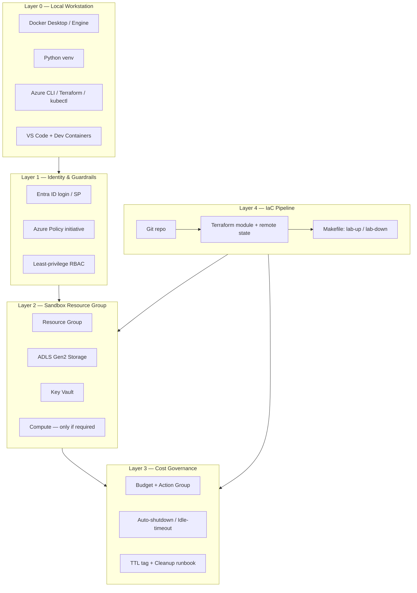
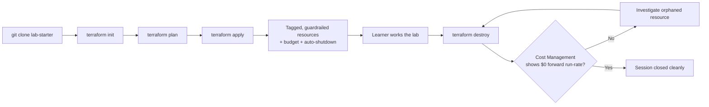
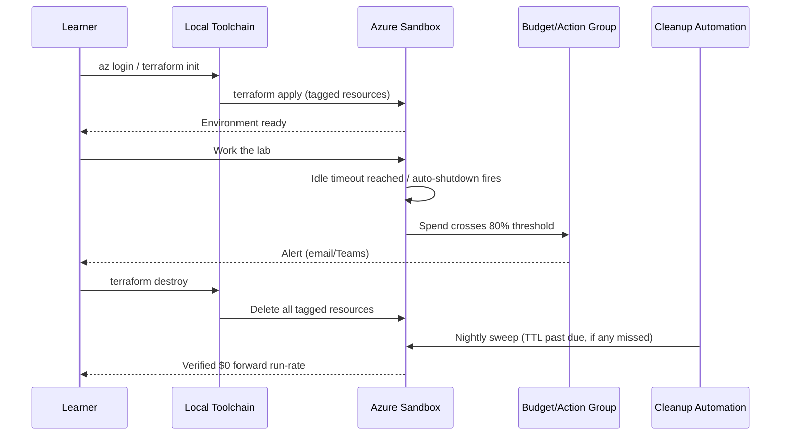

# Lab Environment Setup

> Part of the **Enterprise Data & AI Architecture Handbook** — Resources / Labs, Chapter 01.
> A senior-level, hands-on guide to building a **reproducible, cost-bounded, IaC-defined lab environment** — the local toolchain (Docker, Python, CLIs) plus an Azure sandbox subscription with guardrails, cost controls, auto-shutdown, and disciplined cleanup — that every subsequent hands-on lab in this handbook (End-to-End Lakehouse, Streaming, RAG) builds on top of. Grounded throughout in the platform-engineering, IaC, and containerization foundations of [Platform Engineering](../../Phase-09/02_Platform_Engineering.md), [Infrastructure as Code with Terraform](../../Phase-09/04_Infrastructure_as_Code_with_Terraform.md), [Containers with Docker](../../Phase-09/05_Containers_with_Docker.md), and [GitOps and Environment Management](../../Phase-09/08_GitOps_and_Environment_Management.md).

---

## Executive Summary

Every hands-on lab in this handbook — a lakehouse pipeline, a streaming stack, a RAG assistant — depends on one prior, unglamorous decision: **how the environment it runs in gets created, bounded, and destroyed.** Get that decision wrong and every later lab inherits the consequences: a forgotten always-on VM that quietly burns a training budget over a long weekend, a hand-clicked "golden" sandbox that a second learner cannot reproduce, a shared subscription with no guardrails that one learner's mistake turns into everyone's outage. Get it right, and every later lab is a five-minute `terraform apply` away, bounded by a budget that cannot silently blow past its limit, and torn down as completely and confidently as it was created.

This chapter is the **governed substrate for every lab that follows it** — the same relationship the governed data foundation has to the reference architectures in [Resources/Architecture](../Architecture/01_Reference_Architectures_Catalog.md), applied to the environment you learn *in* rather than the platform you build. The central discipline threaded through every section is the same one that recurs across this handbook: **the fast, convenient path — click-ops in the Azure Portal, an always-on VM "just in case," a shared snowflake environment nobody owns — must never be trusted where the slow, correct, IaC-defined path is what the lab actually needs.** A lab environment that is not reproducible from code and not bounded by cost controls is not really a lab; it is unmanaged production wearing a lab's name.

Concretely, this chapter builds: a **local toolchain** (Docker, Python, the Azure/Terraform/kubectl CLIs, VS Code) that runs entirely offline where possible; an **Azure sandbox subscription** (or a tightly-scoped sandbox resource group) with Azure Policy guardrails, least-privilege RBAC, and a hard **budget with alerts**; **auto-shutdown and idle-termination** for every compute resource so "forgot to turn it off" stops being a cost incident; an **IaC bootstrap** (Terraform) that is the *only* way resources are created; and a **cleanup and teardown** discipline that is a mandatory, verified last step of every lab session, not an optional courtesy.

---

## Learning Objectives

After working through this chapter you will be able to:

- **Install and verify** a reproducible local toolchain (Docker, Python, Azure CLI, Terraform, kubectl, VS Code) that every later lab in this handbook assumes.
- **Provision** an isolated Azure sandbox (subscription or scoped resource group) with Azure Policy guardrails, least-privilege RBAC, and a hard budget with multi-threshold alerts.
- **Bootstrap** any lab environment entirely from Terraform, with remote state, tagged resources, and zero click-ops.
- **Bound cost by construction** — auto-shutdown, idle-timeout, TTL tags, and automated cleanup — rather than by manual discipline or good intentions.
- **Tear down** a lab environment completely and **verify** (via Cost Management and resource queries) that nothing keeps running or billing after the session ends.
- **Diagnose** the two dominant lab-environment failure modes — silent cost overrun and non-reproducible click-ops setup — and design the guardrails that prevent each.
- **Write an ADR** that selects an ephemeral, IaC-defined, cost-bounded sandbox as the default lab environment, with named alternatives and explicit invalidation conditions.

---

## Business Motivation

A training or enablement program does not fail because the *technical content* of its labs is wrong — it fails because the **environment underneath the labs** is expensive, inconsistent, or insecure, and those failures are invisible until the invoice, the security review, or the second cohort's confused support ticket arrives.

- **Unbounded lab spend is a recurring, silent line item.** A single forgotten all-purpose Databricks cluster or an always-on GPU VM can cost more in a weekend than the entire training budget planned for a month, and because it is "just a lab," nobody is watching it the way they would watch production.
- **Non-reproducible environments waste the most expensive resource in a training program: instructor and learner time.** A hand-clicked sandbox that only its creator can recreate turns "follow this lab" into "debug why your environment differs from mine."
- **Lab sandboxes are a real, if smaller, attack surface.** A sandbox subscription with no guardrails, shared broad credentials, or public endpoints is a genuine security exposure, not a harmless toy environment — the same access-control and least-privilege disciplines from [Phase-10](../../Phase-09/02_Platform_Engineering.md) apply, scaled down.
- **Scaling a program from one learner to a cohort multiplies every unmanaged cost and inconsistency.** What is an annoyance for one learner becomes an operational and financial incident for twenty.
- **The environment is also the first lesson.** A learner's first hands-on experience of "how do we provision and govern a cloud environment" *is* this lab setup — if it is click-ops and ungoverned, that is the habit the rest of the program is fighting against.

Treating the lab environment itself as a small, disciplined platform — IaC-defined, cost-bounded, guardrailed, and disposable — turns it from a recurring risk into a repeatable, low-cost, teachable asset.

---

## History and Evolution

- **Pre-2010s — the "here's a VM" era.** Training environments were long-lived shared VMs or physical lab machines, manually configured once and reused indefinitely; drift and "it works on my machine" were the norm, and nobody measured the idle cost because there mostly wasn't one (on-prem hardware was a sunk cost).
- **2010–2015 — cloud sandbox accounts, still mostly click-ops.** Cloud made ephemeral environments possible, but most training programs still provisioned them by hand in the console, because IaC tooling was immature and cloud costs for a single learner still felt negligible.
- **2015–2019 — Infrastructure as Code goes mainstream.** Terraform (2014) and ARM/Bicep matured to the point that "provision the whole environment from a file in version control" became the default expectation for any serious platform team, and that expectation migrated into training/lab tooling.
- **2019–present — containers and Dev Containers standardize the local half.** Docker Compose and, later, the VS Code Dev Containers / Codespaces model made "clone a repo, open it, get an identical local environment" a one-command reality, closing the local-toolchain half of the reproducibility gap.
- **2020–present — FinOps discipline reaches the sandbox.** As cloud spend scrutiny intensified (see [Phase-18 FinOps](../../Phase-09/02_Platform_Engineering.md)), budgets, auto-shutdown, and TTL-tag cleanup automation — previously reserved for production — became standard practice for sandbox and dev/test subscriptions too, precisely because "it's just a sandbox" had proven to be an expensive assumption industry-wide.

The through-line: every era's improvement narrowed the same two gaps — **reproducibility** (can a second person get the same environment from the same source) and **cost boundedness** (can spend be capped by construction rather than by memory). This chapter assumes the current state of the art on both.

---

## Why This Technology Exists

A lab environment exists to answer one question cheaply, repeatedly, and safely: **"can I run this handbook's concepts against something real, without risking cost or data I cannot afford to risk?"** That requires solving three problems that a shared or production environment does not:

1. **Isolation** — a mistake in a lab (a runaway job, an overly-broad IAM grant, a destructive test) must not be able to touch anything outside the lab's own boundary.
2. **Reproducibility** — the same lab, run by a different learner or the same learner a month later, must produce the same environment, because the *lab content* is what is being taught, not the *incidental state of one person's hand-built sandbox*.
3. **Disposability** — the environment's value is in the learning it enables while it exists; it has no reason to exist, or to cost anything, once the lab session ends.

Without a deliberately engineered answer to all three, teams default to the worst of all worlds: a shared, persistent, hand-configured environment that is neither isolated, nor reproducible, nor disposable — and that is exactly the failure mode this chapter's ADR exists to prevent.

---

## Problems It Solves

- **"How do I get from zero to a working lab environment in minutes, not hours?"** — a single `terraform apply` (cloud) or `docker compose up` (local) against a version-controlled definition.
- **"How do I stop a lab from silently costing more than intended?"** — budgets with alerts, auto-shutdown, idle-timeout, and TTL-tagged automated cleanup, layered rather than relied on individually.
- **"How do I make sure my environment matches the instructor's / my teammate's?"** — Infrastructure as Code as the single source of truth, never a hand-clicked "golden" sandbox.
- **"How do I avoid exposing anything sensitive through a training sandbox?"** — least-privilege RBAC, Azure Policy guardrails, no production data, and secret hygiene from day one.
- **"How do I scale from one learner to a cohort without the cost and coordination overhead multiplying linearly (or worse)?"** — a parameterized IaC module and a shared, centrally-governed sandbox subscription rather than N independently-configured snowflakes.

---

## Problems It Cannot Solve

- **It cannot teach the concepts themselves.** This chapter builds the substrate; the lakehouse, streaming, and RAG concepts are the subject of the labs that run *on* it and of the phase chapters those labs draw from.
- **It cannot substitute for a genuine production landing zone.** The guardrails here are deliberately lightweight and scoped to a disposable sandbox; production environments need the full [Azure Landing Zones](../../Phase-09/08_GitOps_and_Environment_Management.md)-grade governance this chapter's Migration Considerations explicitly do not attempt to replicate.
- **It cannot prevent every mistake a learner might make inside the sandbox boundary.** Isolation bounds the *blast radius* of a mistake; it does not prevent the mistake, which is often the point of the lab.
- **It cannot keep itself current for free.** Cloud SKUs, free-tier limits, and pricing change; a lab environment definition is a living artifact that needs the same periodic revalidation discipline this handbook applies everywhere else (see the running retired-service pattern referenced in [Platform Engineering](../../Phase-09/02_Platform_Engineering.md)).
- **It cannot make cost controls optional and still work.** A budget alert with nobody wired to act on it, or an auto-shutdown schedule nobody enabled, is theater — the controls only work layered together and enforced by construction, which is exactly what the Cost Optimization section and the ADR below insist on.

---

## Core Concepts

In-prose cross-references to *other* sections of this chapter use the section's position number (e.g. §20 Cost Optimization, §41 Hands-on Labs).

### 1.1 The three-tier lab topology

Every lab in this handbook runs on the same three tiers: a **local tier** (Docker, Python, CLIs, VS Code — free, fast, offline-capable), a **sandbox cloud tier** (a scoped Azure resource group or subscription with guardrails, used only when a lab genuinely needs a real managed service), and a **shared platform tier** (the centrally-governed sandbox subscription, Azure Policy initiative, and cleanup automation that every learner's sandbox inherits, owned by whoever runs the training program — mirroring the platform-team-as-golden-path pattern from [Platform Engineering](../../Phase-09/02_Platform_Engineering.md)). A lab should default to the local tier and escalate to the cloud tier only for what genuinely requires a managed Azure service.

### 1.2 Ephemeral-by-default, not persistent-by-default

The default assumption for any lab resource — local container or cloud resource — is that it is destroyed at the end of the session and recreated from code next time. Persistence is the exception, requested and justified (e.g., "I want to keep my sample dataset between sessions"), never the default. This inverts the intuitive habit of leaving things running "in case I need them later."

### 1.3 Infrastructure as Code as the *only* source of truth

No lab resource is created by clicking through the Azure Portal. Every resource — the resource group, the storage account, the Key Vault, the budget, the auto-shutdown schedule, the compute — is defined in Terraform, checked into version control, and created via `terraform apply`. This is not a style preference; it is what makes the second half of §1.2 (recreate from code) actually true, and it is the direct extension of [Infrastructure as Code with Terraform](../../Phase-09/04_Infrastructure_as_Code_with_Terraform.md) to a sandbox scale.

### 1.4 Guardrails-as-code, not guardrails-as-good-intentions

The sandbox's boundaries — allowed regions, allowed SKUs (burstable/spot only), no public IP by default, mandatory tags — are enforced by an **Azure Policy initiative** assigned at the sandbox resource-group or subscription scope, evaluated and denied at request time by Azure Resource Manager. A guardrail a learner could simply not follow is not a guardrail; it is a suggestion.

### 1.5 Cost-bounded by construction, not by memory

Cost control is layered, not singular: a **budget** with multi-threshold alerts (monitoring, not blocking), **auto-shutdown/idle-timeout** on every compute resource (the actual enforcement), and a **TTL tag plus automated cleanup** as the safety net for whatever the first two miss. No single control is trusted alone — the Internal Working section explains precisely why the budget alone is insufficient.

---

## Internal Working

Subsections are numbered 2.x per the handbook convention.

### 2.1 How the local toolchain actually runs

Docker Desktop (Windows/macOS) runs containers inside a lightweight Linux VM — on Windows, backed by **WSL2** — so container resource limits are ultimately bounded by the memory/CPU allocation given to that VM in Docker Desktop's settings, not by the host machine's full capacity; under-allocating causes containers to be OOM-killed, over-allocating starves the rest of the laptop. Python's `venv` creates an isolated interpreter + `site-packages` directory per project so dependency versions across labs (Spark clients, LangChain, Delta) never collide; a `requirements.txt` (or `pyproject.toml`) pinned to specific versions is what makes that isolation *reproducible* across machines, not just isolated on one. VS Code **Dev Containers** go one step further: the entire local toolchain (Python version, CLIs, extensions) is itself defined in a `devcontainer.json` and built as a container, so "clone the repo, reopen in container" reproduces the *whole* local environment, not just the Python dependencies.

### 2.2 How the sandbox guardrails are actually enforced — and where they are not

An **Azure Policy** assignment with a `Deny` effect is evaluated by Azure Resource Manager *before* a resource is created; a request that violates an allowed-SKU or allowed-location policy is rejected outright, not merely logged — this is a genuine enforcement point, not advisory. A **budget**, by contrast, is a *monitoring* control: it fires an alert (email, Action Group, webhook) when spend crosses a threshold, but it does **not**, by itself, stop further spend or terminate a resource — this distinction is the single most common lab-cost-control misunderstanding, and it is why the budget must always be paired with an *actual* enforcement mechanism (auto-shutdown, idle-timeout, or an automated cleanup runbook that acts on the alert) rather than trusted alone.

### 2.3 How the IaC bootstrap and teardown lifecycle actually executes

`terraform apply` reconciles the declared configuration against a **state file** (held in a remote backend — an Azure Storage container, even for a lab, so state is never only on one learner's laptop) and against the real Azure resources, creating or updating only what has changed. `terraform destroy` performs the reverse reconciliation, deleting every resource the state file knows about, **in dependency order** (compute before the network it sits in, etc.). This is precisely why teardown must always be driven from the *same* Terraform state that created the resources: a resource deleted by hand in the Portal leaves Terraform's state pointing at something that no longer exists, silently corrupting the next `plan`/`apply` for that workspace — a small-scale instance of the handbook's recurring "manual intervention silently diverges from the system of record" pattern.

---

## Architecture

The lab environment is a five-layer stack, each layer a client of the one below it:

- **Layer 0 — Local workstation.** Docker Desktop/Engine, Python 3.11+ with `venv`, the Azure CLI, Terraform CLI, `kubectl`, `git`, and VS Code (with the Dev Containers extension). Nothing above this layer works without it.
- **Layer 1 — Identity and guardrails.** An Entra ID sign-in (interactive `az login` for individuals, or a scoped service principal / workload identity for automation), an Azure Policy initiative assigned at the sandbox scope, and a least-privilege role assignment (Contributor scoped to the lab resource group only — never subscription Owner).
- **Layer 2 — Sandbox resource group.** The minimal set of Azure resources a given lab needs: a resource group, an ADLS Gen2 storage account, a Key Vault, and whatever compute the lab specifically requires (a burstable VM, a Databricks trial workspace, an AKS cluster) — provisioned only when required, never "just in case."
- **Layer 3 — Cost governance.** A Budget resource with a multi-threshold Action Group, auto-shutdown/idle-timeout configuration on every compute resource, and TTL tags feeding an automated cleanup mechanism.
- **Layer 4 — IaC pipeline.** A version-controlled Terraform module (with a remote state backend) that is the *only* path by which Layers 1–3 are created, changed, or destroyed, optionally wrapped in a `Makefile` (`make lab-up`, `make lab-down`) for a one-command learner experience.

A failure at Layer 3 (missing cost governance) or Layer 4 (click-ops instead of IaC) is the recurring root cause of both case studies in §40 — diagnosing *which* layer failed, rather than assuming "the cloud is expensive" or "learners are careless," is the discipline this chapter builds.

---

## Components

- **Docker Desktop / Docker Engine** — local container runtime for offline-capable labs (MinIO, Postgres, Kafka/Redpanda, a local Spark).
- **Python 3.11+ with `venv`** — isolated, pinned dependency environments per lab.
- **Azure CLI (`az`) and Bicep CLI** — imperative verification and scripting on top of the declarative IaC.
- **Terraform CLI** — the declarative provisioning and teardown engine; the single source of truth (§1.3).
- **`kubectl` and the Databricks CLI** — required only for labs that specifically use Kubernetes or Databricks (later labs in this Resources/Labs series).
- **VS Code + Dev Containers extension** — the reproducible local IDE/toolchain definition.
- **A sandbox Azure subscription (or a tightly-scoped resource group)** — the isolation boundary (Layer 1/2).
- **An Azure Policy initiative** — the guardrails-as-code enforcement point (§1.4).
- **A Budget + Action Group** — the cost-monitoring control (§2.2).
- **Azure Key Vault** — the only place secrets live; never a plaintext `.env` committed to git.
- **An ADLS Gen2 storage account** — sample-dataset staging for labs that need cloud storage.
- **A Terraform remote state backend (Azure Storage)** — so state is never only local (§2.3).

---

## Metadata

- **Tags** are the lab environment's metadata backbone and must be applied to every resource: `owner` (the learner or instructor), `lab_id` (which chapter/lab created it), `ttl` (an ISO date after which it is eligible for automated deletion), `cost_center`, and `environment=lab` (so it is trivially distinguishable from anything real in cost and security reporting).
- **Naming convention**: `rg-lab-<phase>-<lab-id>-<learner-or-cohort>` for resource groups, with matching prefixes for child resources, so a learner's or instructor's resources are identifiable and filterable at a glance in the Portal, Cost Management, and Azure Policy compliance views.
- **Terraform variable files (`*.tfvars`)** double as configuration metadata — the parameters (learner name, region, SKU size, TTL) that make one shared module produce many isolated, correctly-tagged environments (§18 Scalability).

---

## Storage

- **Local**: Docker named volumes for anything a container needs to persist across a `docker compose down`/`up` cycle (a local Postgres's data directory, a MinIO bucket); anonymous/ephemeral volumes for everything else, so `docker compose down -v` is a genuine full reset.
- **Cloud sandbox**: an ADLS Gen2 storage account (Standard, LRS — no need for zone redundancy or Premium in a lab) holding sample datasets staged for later labs (the Lakehouse, Streaming, and RAG labs all read their seed data from here).
- **What never belongs here**: real customer, regulated, or production data of any kind. A lab is, by definition, the wrong place for anything requiring [Phase-10](../../Phase-09/02_Platform_Engineering.md)-grade data protection — use synthetic or public sample datasets only.
- **Lifecycle**: a storage lifecycle management policy (delete blobs older than N days in the lab container) is a cheap, useful second line of defense alongside the TTL-tag cleanup runbook.

---

## Compute

- **Local**: Docker containers with explicit CPU/memory limits set in `docker-compose.yml` (`deploy.resources.limits`), sized to what the lab actually needs (a single-node Spark-in-a-container needs far less than a full cluster) and to what the learner's laptop can spare.
- **Cloud sandbox, when genuinely required**: **Burstable B-series** or **Spot** VMs for anything that tolerates interruption, and Databricks **auto-terminating** all-purpose or job clusters (idle timeout of 20–30 minutes is a sensible default) rather than a persistent interactive cluster.
- **What to avoid by default**: GPU SKUs, "just in case" over-provisioned VM sizes, and any interactive cluster with auto-termination disabled — each is a specific, named line item in §27 Anti-patterns and §28 Common Mistakes.
- Kubernetes for a lab is **`kind` or `minikube` locally** unless the lab's explicit subject is AKS itself (see the later Resources/Labs chapters and [Kubernetes](../../Phase-09/06_Kubernetes.md)) — a full managed AKS cluster is disproportionate compute for most labs.

---

## Networking

- **Local**: the default Docker bridge network is sufficient for almost every lab; a custom Compose network is only needed when containers must resolve each other by a specific hostname.
- **Cloud sandbox**: a single, simple VNet (no hub-spoke, no ExpressRoute) is normally sufficient — the [Azure Networking](../../Phase-09/02_Platform_Engineering.md)-grade topology is a Phase-03 subject, not a lab-sandbox one. Public endpoints are acceptable for sandbox resources holding no real data, but where a lab's explicit subject is networking or security, use the opportunity to practice Private Endpoints for realism rather than defaulting to "public because it's just a lab."
- **What to avoid**: peering the lab sandbox VNet to any corporate or production network — the isolation boundary from §1.1/§Architecture Layer 1 exists specifically to prevent this.

---

## Security

- **No production data, ever.** The single most important security control for a lab is what it does *not* contain.
- **Least-privilege RBAC.** A learner's or automation's role assignment is scoped to the lab resource group (`Contributor` at most), never subscription-level `Owner`; a compromised or misused lab credential then has a bounded blast radius by construction.
- **Secrets only in Key Vault**, referenced by managed identity or a short-lived token — never a plaintext connection string in a `.env` file committed to git. A `.gitignore` entry for `.env`/`*.tfvars` containing secrets, plus a pre-commit **secret-scanning** hook (e.g., Gitleaks), is the layered defense.
- **Short-lived credentials.** Prefer interactive `az login` (device code, short session) or a scoped, expiring service principal over a long-lived shared key; a shared, never-rotated sandbox credential is a real (if often dismissed) exposure.
- **The sandbox subscription itself is isolated** from any production management group, so a policy or RBAC mistake in the lab cannot cascade into anything that matters.

---

## Performance

- **Right-size the local Docker allocation** to the actual lab's needs and the laptop's real spare capacity (commonly 4–8 GB RAM, 2–4 vCPUs) — under-allocating causes mysterious OOM kills that look like application bugs; over-allocating starves the rest of the machine and every other tool running on it.
- **Avoid running a full local Kubernetes cluster** unless a lab specifically needs one; `kind`/`minikube` cost real local resources that most labs do not need to pay.
- **Cloud sandbox SKUs should match the lab's actual workload**, not a round-number "safe" choice — an over-provisioned VM or cluster is wasted spend with no lab benefit, the compute-side instance of the cost discipline in §20.
- **Startup latency matters for the learner experience**: a Databricks cluster with a long cold-start, or a VM with a slow boot, erodes a lab session's usable time — prefer smaller, faster-starting SKUs over larger, slower ones when both satisfy the lab's requirement.

---

## Scalability

A lab environment must scale from **one learner to a cohort** without the cost or coordination overhead growing worse than linearly:

- The Terraform module is **parameterized** (learner/cohort identifier, region, SKU size) so the same code produces N isolated, correctly-tagged, independently-destroyable environments rather than N hand-modified copies.
- The **shared platform tier** (§Architecture Layer 3/4, owned centrally) — the Policy initiative, the budget structure, the cleanup automation — is defined once and inherited by every learner's sandbox, not re-invented per learner.
- **What does not scale**: a single shared always-on environment for an entire cohort. It is cheaper per-learner on paper but reintroduces exactly the coordination overhead, blast-radius, and "who broke this" problems that per-learner isolation exists to avoid — the Decision Matrix (§25) makes this trade-off explicit.

---

## Fault Tolerance

- **Idempotent, rerunnable setup.** `terraform apply` and `docker compose up` must both be safe to run again against an already-partially-created environment — this is what makes "something went wrong, just rerun it" a viable recovery, rather than requiring a manual cleanup first.
- **Reset as a first-class operation.** `docker compose down -v && docker compose up` (local) and `terraform destroy && terraform apply` (cloud) should reliably return the environment to a known-clean state; if a learner is *afraid* to run either because "something might not come back the same," the environment is not disposable enough, and that fear is itself evidence of a Layer 3/4 architecture defect.
- **State-file integrity.** Because Terraform's state is the source of truth for what exists, protect it (remote backend with locking) so two learners or two concurrent CI runs cannot corrupt each other's environment definitions.

---

## Cost Optimization

- **Layer the controls — never rely on one.** A **budget** (monitoring only, §2.2) fires alerts at, e.g., 50/80/100% of a $50/month sandbox budget, routed via an **Action Group** to email/Teams; **auto-shutdown** (VMs) and **idle-timeout** (Databricks clusters) are the actual enforcement that stops spend without anyone needing to notice the alert; a **TTL tag plus a scheduled cleanup runbook** (Azure Automation or a scheduled GitHub Actions/Azure DevOps pipeline running `terraform destroy` against any workspace past its TTL) is the safety net that catches whatever the first two miss.
- **Prefer Burstable/Spot SKUs** for anything that tolerates interruption, and **Standard_LRS** storage (no zone redundancy) — a lab does not need production durability guarantees.
- **Tag everything**, so Cost Management can filter lab spend precisely, and so the cleanup automation has something to key off.
- **Worked example.** A `Standard_DS3_v2` VM left running 24×7 for a month costs roughly **$140–150/month** on pay-as-you-go pricing. The same VM with an auto-shutdown schedule limiting it to an 8-hour training day (and off on weekends) costs roughly **$35–40/month** — a **~75% reduction** from one control alone. Switching the same 8-hour/weekday pattern to a **Spot** instance where the workload tolerates eviction typically cuts the remaining cost by a further **60–90%**, depending on region and SKU availability, bringing a genuinely disposable lab VM down to single-digit dollars per month. The dominant lever is not the SKU choice — it is **eliminating idle hours**, which is exactly what auto-shutdown does by construction rather than by memory.
- **Teardown is a cost control, not a courtesy.** The single highest-leverage cost action is the one in §41 Lab 5: destroy the environment and verify a $0 forward run-rate at the end of every session.

---

## Monitoring

- **Azure Cost Management**, scoped and filtered to the lab resource group's tags, is the primary spend-visibility surface — check it at the start and end of a multi-day lab, not only when a budget alert fires.
- **Budget alert delivery** (email or a Teams/Slack webhook via an Action Group) is the trigger that should prompt a human to check whether auto-shutdown/cleanup did their job, not the only line of defense.
- **Local resource checks**: `docker stats` and `docker ps` are the lab-scale equivalent of infrastructure monitoring — a container silently consuming unexpected CPU/memory is the local analogue of an idle cloud resource.

---

## Observability

Monitoring answers "is spend within threshold?"; observability answers "why did this environment behave unexpectedly?" — and a lab environment has a distinctive, useful observability property: because everything is IaC-defined, **the Terraform plan output and the Azure Activity Log together reconstruct exactly what changed and who changed it.** The Activity Log, scoped to the lab resource group, shows every create/delete/RBAC-change event — including any click-ops action that bypassed Terraform, which is precisely the drift this chapter's ADR treats as a defect to detect, not tolerate. `docker compose logs` and Databricks cluster event logs provide the equivalent local/managed-service visibility when a lab's application code, not its infrastructure, misbehaves.

---

## Governance

- **Azure Policy guardrails** (allowed locations, allowed SKUs, deny-public-IP-by-default, mandatory tags) are assigned once at the sandbox scope and inherited by every learner's environment — governance-as-code, not a checklist a learner is trusted to follow.
- **Least-privilege RBAC** (§16 Security) is itself a governance control: it bounds what a mistake or a misused credential inside the sandbox can reach.
- **The sandbox subscription is governed separately from production** — a distinct management-group placement, its own Policy initiative, its own budget — so lab governance can be lighter-weight than production governance without weakening production's.
- **"Never real data" is a governance rule, not a suggestion**, and is the reason a lab sandbox does not need the full weight of [Phase-10](../../Phase-09/02_Platform_Engineering.md)'s data-protection controls to be safely operated.

---

## Trade-offs

- **Click-ops convenience vs. IaC reproducibility.** Clicking through the Portal is faster the first time; it is unreproducible the second. This chapter always chooses IaC.
- **Always-on "no cold start" vs. cost of idle spend.** An always-on Databricks cluster or VM removes a few minutes of startup latency per session at the cost of every idle hour in between — for a lab, the idle-hour cost dominates.
- **Shared cohort sandbox vs. per-learner sandbox.** A shared sandbox is cheaper on paper and simpler to govern once, but concentrates blast radius and creates coordination friction (one learner's mistake or long-running job affects everyone); a per-learner sandbox isolates blast radius at the cost of provisioning/teardown overhead multiplied by cohort size — mitigated, not eliminated, by the parameterized-module approach in §18.
- **Local-only labs (free, no cloud realism) vs. cloud sandbox labs (real services, real cost/governance lessons).** Local-only is the right default for iterating on logic; cloud sandbox is necessary whenever the lab's actual subject is a managed Azure service, its guardrails, or its cost behavior.

---

## Decision Matrix

| Requirement | Recommended Approach |
|---|---|
| Iterating quickly on pipeline logic, no cloud service needed | Local Docker Compose stack only |
| Lab's explicit subject is a managed Azure service (ADLS, Databricks, Event Hubs, AI Search) | Azure sandbox resource group, minimal SKUs |
| Teaching networking/security realism | Cloud sandbox with Private Endpoints practiced deliberately, not defaulted to public |
| A cohort of 10–30 learners running the same lab | Parameterized Terraform module, per-learner resource groups, shared Policy/budget/cleanup automation |
| A single instructor's demo environment | Per-session ephemeral sandbox, destroyed immediately after |
| GPU-heavy deep-learning or LLM fine-tuning lab | Explicit, separately-approved budget and SKU exception — never a default |
| A lab that must run fully offline (no cloud access) | Local Docker Compose stack (MinIO for object storage, local Spark, local Postgres/Kafka) |

---

## Design Patterns

- **The golden-path lab starter repo.** A single git repository containing a Terraform module, a `docker-compose.yml`, a `Makefile` (`make lab-up` / `make lab-down`), and a README — reused as the starting point for every subsequent lab in this handbook, per the golden-path pattern in [Platform Engineering](../../Phase-09/02_Platform_Engineering.md).
- **Ephemeral-by-default.** Every resource assumes destruction at session end unless explicitly flagged persistent.
- **Cost-bounded-by-construction.** Budget + auto-shutdown/idle-timeout + TTL-tag cleanup, layered together, always.
- **IaC-as-source-of-truth.** No resource exists that Terraform did not create; no resource is deleted except through Terraform.
- **ADR-for-exceptions.** Any deviation from the defaults above (a persistent resource, a non-burstable SKU, a public endpoint used deliberately) is recorded as a short, explicit justification, not a silent one-off.

---

## Anti-patterns

- **Click-ops sandbox setup** — hand-building a "golden" environment in the Portal and documenting it as screenshots instead of code (Case Study 2, §40).
- **The shared always-on dev cluster nobody owns** — provisioned once "for the team," never torn down, drifting further from anyone's mental model every month.
- **Committing secrets or `.tfvars` containing real values to git** — even in a throwaway sandbox, credential hygiene habits are what the lab is (also) teaching.
- **Using a production subscription "just this once" for a lab** — collapses the isolation boundary the whole chapter exists to establish.
- **"I'll remember to delete it" as the only cleanup mechanism** — Case Study 1 (§40) is what this produces.
- **An always-on GPU cluster provisioned for one occasional deep-learning lab** — the single most expensive version of over-provisioning "just in case."

---

## Common Mistakes

- Setting a VM auto-shutdown schedule without checking the **time zone** it applies in, so the VM shuts down (or fails to) at the wrong local time.
- Leaving Docker Desktop's default resource limits unchanged, then debugging a mysterious container crash that is actually an OOM kill.
- Leaving Terraform **state local** rather than in a remote backend, so a second learner's `apply` against "the same" configuration silently creates duplicate, un-tracked resources.
- Forgetting to tag a resource, so it is invisible to both Cost Management filtering and the TTL-based cleanup automation.
- Assuming a **budget alert** stops spend — it only notifies; without a paired enforcement mechanism, the spend continues past every threshold.
- Granting a learner's service principal subscription-level `Contributor` "to save time," collapsing the least-privilege boundary from §16.

---

## Best Practices

- Define **everything** as code — the Terraform module and the `docker-compose.yml` are the environment; nothing exists that isn't in one of the two.
- Use a **remote Terraform state backend** from the very first lab, even though the temptation with "it's just a sandbox" is to skip it.
- **Tag every resource** with owner, lab_id, ttl, and cost_center at creation time, not retroactively.
- Pair a **budget** with an actual enforcement mechanism (auto-shutdown/idle-timeout) and a TTL-based cleanup runbook — never rely on the budget alone.
- Scope every credential to **least privilege** at the lab resource group, and prefer short-lived, interactive login over long-lived shared secrets.
- Make **teardown** a documented, literal, final step of every lab's README — `make lab-down` or `terraform destroy` — and verify (§20, §41 Lab 5) that spend actually stops.

---

## Enterprise Recommendations

- **Standardize a single lab-starter template** (per the golden-path pattern) that every phase's hands-on labs build from, rather than letting each lab author reinvent provisioning and teardown.
- **Centralize ownership of the shared platform tier** (the sandbox subscription's Policy initiative, budget structure, and cleanup automation) with the team running the training program, so individual learners interact only with `make lab-up`/`make lab-down` and never touch the guardrails directly.
- **Review the sandbox's Policy initiative and budget thresholds** on the same cadence recommended for production landing zones (see [Platform Engineering](../../Phase-09/02_Platform_Engineering.md)) — sandboxes drift out of date too.
- **Track a simple adoption/health metric**: the percentage of lab sessions that end with a verified $0 forward run-rate, as the single leading indicator that the cost controls in this chapter are actually working, not merely documented.

---

## Azure Implementation

A concrete, minimal Azure sandbox for this chapter's labs:

- **Resource group** — `rg-lab-<phase>-<learner>`, the isolation and tagging boundary for everything below.
- **Azure Policy initiative**, assigned at the resource-group scope: allowed locations (one region), allowed VM SKUs (Burstable B-series / Spot only), deny public IP by default, and a **require-tag** policy for `owner`, `lab_id`, `ttl`, `cost_center`.
- **RBAC** — the learner (or their service principal) is granted `Contributor` scoped to this resource group only.
- **Storage account** (ADLS Gen2, Standard_LRS, hierarchical namespace enabled) for sample-dataset staging.
- **Key Vault** for any secrets a lab needs (connection strings, API keys), referenced by managed identity — never a plaintext value in `.tfvars`.
- **Budget** (Consumption Budgets API / `azurerm_consumption_budget_resource_group`) — e.g., $50/month, with alert thresholds at 50/80/100% routed to an **Action Group** (email + optional Teams webhook).
- **Compute, only when a lab requires it** — a `Standard_B2s` VM with `az vm auto-shutdown` configured, or a Databricks workspace trial with all-purpose clusters set to auto-terminate after 20–30 minutes idle.
- **Terraform remote state backend** — a small, separate, long-lived storage account (outside the disposable lab resource group) holding the state file with blob locking enabled.

Example Terraform sketch (illustrative, trimmed for length):

```hcl
resource "azurerm_resource_group" "lab" {
  name     = "rg-lab-${var.phase}-${var.learner}"
  location = var.location
  tags = {
    owner       = var.learner
    lab_id      = var.lab_id
    ttl         = var.ttl_date
    cost_center = var.cost_center
    environment = "lab"
  }
}

resource "azurerm_consumption_budget_resource_group" "lab" {
  name              = "budget-${var.learner}"
  resource_group_id = azurerm_resource_group.lab.id
  amount            = 50
  time_grain        = "Monthly"

  notification {
    enabled        = true
    threshold      = 80
    operator       = "GreaterThan"
    contact_emails = [var.instructor_email]
  }
}

resource "azurerm_dev_test_global_vm_shutdown_schedule" "lab_vm" {
  virtual_machine_id = azurerm_linux_virtual_machine.lab.id
  location            = var.location
  enabled             = true
  daily_recurrence_time = "1900"
  timezone              = "UTC"
}
```

```bash
# az cli verification commands used in Lab 4 (§41)
az consumption budget show --resource-group rg-lab-phase09-alex --budget-name budget-alex
az vm auto-shutdown show --resource-group rg-lab-phase09-alex --name vm-lab
```

---

## Open Source Implementation

A fully local, cloud-portable realization of the same environment, used whenever a lab does not specifically require a managed Azure service:

- **MinIO** — an S3/ADLS-compatible object store running in a container, standing in for cloud storage in offline labs.
- **A local single-node Spark (with Delta Lake)** container, or **DuckDB**, for lakehouse-style processing without any cloud dependency.
- **Redpanda or a single-broker Kafka container** for streaming labs that do not need a managed Event Hubs.
- **Postgres** in a container for anything needing a relational store.
- **`kind` or `minikube`** for the rare lab that genuinely needs a local Kubernetes control plane.
- **VS Code Dev Containers** (`devcontainer.json`) defining the whole local toolchain as code, so `git clone` + "Reopen in Container" reproduces it exactly.
- **`pre-commit` with Gitleaks** for secret scanning before every commit.

Example minimal `docker-compose.yml`:

```yaml
services:
  minio:
    image: minio/minio
    command: server /data --console-address ":9001"
    environment:
      MINIO_ROOT_USER: labadmin
      MINIO_ROOT_PASSWORD: labpassword
    ports: ["9000:9000", "9001:9001"]
    volumes: ["minio-data:/data"]

  postgres:
    image: postgres:16
    environment:
      POSTGRES_PASSWORD: labpassword
    ports: ["5432:5432"]
    volumes: ["pg-data:/var/lib/postgresql/data"]

volumes:
  minio-data:
  pg-data:
```

This stack is entirely portable across laptops and clouds — the whole point of keeping the local tier cloud-agnostic — and it is the default starting point for any lab that does not need to touch Azure at all.

---

## AWS Equivalent (comparison only)

- **AWS sandbox account** under AWS Organizations, with **Service Control Policies (SCPs)** as the guardrail-as-code equivalent of an Azure Policy initiative, **AWS Budgets** for alerting, and the **Instance Scheduler** solution for VM auto-stop.
- **Advantages**: AWS Organizations' account-per-sandbox isolation is arguably a stronger isolation boundary than a resource-group-scoped Azure sandbox (a full account vs. a scoped RG).
- **Disadvantages**: provisioning a full account per learner is heavier-weight than a resource group, and SCPs are somewhat less granular than Azure Policy's resource-property-level conditions.
- **Migration strategy**: the Terraform module is portable with a provider swap (`azurerm` → `aws`); the guardrail *logic* (allowed regions/SKUs, mandatory tags, budget thresholds) translates directly even though the enforcement mechanism's shape differs.
- **Selection criteria**: choose AWS's account-per-sandbox model when full-account isolation is required; choose the Azure resource-group model when lighter-weight, faster-to-provision isolation is sufficient (the common lab case).

---

## GCP Equivalent (comparison only)

- **GCP sandbox project** under a folder, with **Organization Policy constraints** as the guardrail equivalent, **Cloud Billing Budgets** for alerting, and Compute Engine instance schedules for auto-stop.
- **Advantages**: GCP's project-as-isolation-boundary is a clean, first-class unit that maps naturally to "one project per learner," and Cloud Billing Budgets integrate tightly with BigQuery export for custom cost dashboards.
- **Disadvantages**: project sprawl (one project per learner, times every cohort) needs its own cleanup discipline, mirroring the resource-group cleanup this chapter builds.
- **Migration strategy**: same pattern as AWS — swap the Terraform provider, keep the guardrail and cost-control logic.
- **Selection criteria**: GCP's project-level isolation is a good fit for organizations already GCP-native; for an Azure-first enterprise (this handbook's default), the Azure resource-group sandbox remains the primary recommendation.

---

## Migration Considerations

- The **Terraform module** is the most portable asset here: written against `azurerm`, it needs only a provider and resource-type swap to target AWS or GCP, while the ephemeral/cost-bounded/guardrailed *principles* transfer unchanged.
- The **local Docker Compose stack is already fully cloud-agnostic** and requires no migration work at all.
- What does **not** transfer directly is the exact guardrail mechanism (Azure Policy vs. SCPs vs. Org Policy) and the exact cost-alerting API shape — these need re-implementation, not just a find-and-replace, when moving cloud.
- Treat this chapter's environment definition as a **living artifact**: SKU availability, free-tier limits, and pricing change, so periodically re-validate the Terraform module against current Azure pricing and policy definitions, the same discipline this handbook applies to every phase chapter's Azure Implementation section.

---

## Mermaid Architecture Diagrams







---

## End-to-End Data Flow

A sample lab dataset's journey through this environment: a small, synthetic dataset (CSV/Parquet) starts on the learner's **local machine** (or is generated by a seed script); `terraform apply` provisions the ADLS Gen2 storage account; `az storage blob upload-batch` (or a Terraform-managed initial upload) stages the dataset into a `raw`/`bronze` container in the sandbox; subsequent labs in this Resources/Labs series (End-to-End Lakehouse, Streaming, RAG) read from this same staged location as their starting point, so this chapter's environment is literally the on-ramp for every dataset used later in the handbook's hands-on track.

---

## Real-world Business Use Cases

- **New-hire onboarding** — a reproducible environment every new data engineer or architect can stand up on day one, identical to every other new hire's.
- **Instructor-led workshops** — a cohort of learners each gets an isolated, cost-bounded sandbox without the training budget being at the mercy of forgotten resources.
- **Proof-of-concept exploration** — a disposable environment to validate an architectural idea (a new table format, a new streaming engine) before committing to a production landing zone.
- **Certification and bootcamp programs** — a standardized, auditable environment definition that scales from a handful of participants to hundreds without linear cost or coordination growth.

---

## Industry Examples

- Cloud providers' own **"sandbox subscription"** or **"dev/test subscription"** offerings (with reduced pricing and stricter default guardrails) are a direct, productized version of this chapter's Layer 1/2/3 pattern.
- **GitHub Codespaces** and **VS Code Dev Containers** popularized the "clone a repo, get an identical environment" experience this chapter's Layer 0 depends on.
- **Databricks Community Edition / trial workspaces** are a managed-service example of an auto-terminating, cost-bounded sandbox for a single specific service.
- Enterprise **"innersource starter-kit"** repositories — a golden-path template repo any team clones to bootstrap a new project's environment — are the internal-platform analogue of this chapter's lab-starter template (§26 Design Patterns).

---

## Case Studies

**Case Study 1 — the forgotten cluster that burned a month's training budget in a weekend.**
A learner started a Databricks all-purpose interactive cluster for a Friday-afternoon lab session and left it running over a long weekend; the cluster had no idle-timeout configured, and the sandbox subscription had a budget defined but **no auto-shutdown or cleanup automation wired to act on its alerts** — the alert emails went to an inbox nobody was monitoring over the weekend. By Monday, the cluster's accumulated compute cost had consumed roughly ten times the entire month's planned training budget for that cohort. The root cause was not the learner's forgetfulness — that is expected and unavoidable at scale — it was that the **only** cost control in place was a monitoring one (the budget), with no *enforcement* control (idle-timeout, auto-shutdown) behind it. This directly motivates the ADR's mandatory pairing of a budget with an actual enforcement mechanism, never one alone.

**Case Study 2 — the hand-clicked "golden" sandbox nobody could reproduce.**
An instructor preparing a new cohort's lab manually clicked through the Azure Portal to build what became known as the "golden" sandbox, then captured the steps as a screenshotted, prose README rather than as code. Two weeks later, a second instructor followed the same document to prepare an identical environment for a different cohort — but a storage account default had changed in the interim, and one non-obvious step (a specific network setting) had been implicitly assumed rather than written down. The second cohort's environment behaved subtly differently from the first's, and several hours of instructor and learner time were spent debugging what turned out to be an environment difference rather than a lab-content problem. The root cause was that the "golden" environment's actual definition existed only in one person's memory and a lossy set of screenshots — not in any reproducible artifact. Re-platforming the same environment onto the Terraform module in this chapter (§31) made every future cohort's environment provably identical to the first, by construction.

### Architecture Decision Record (ADR-0221): Ephemeral, IaC-Defined, Cost-Bounded Sandbox as the Default Lab Environment

**Context.** Every hands-on lab in this handbook needs a place to run. Two failure modes recur when that place is set up informally: silent cost overrun (Case Study 1 — a monitoring-only cost control with no enforcement behind it) and non-reproducible, undocumented environments (Case Study 2 — a hand-clicked "golden" sandbox that only its creator can recreate). Both are avoidable with the same underlying discipline: define the environment as code, bound its cost by construction, and treat teardown as mandatory rather than optional.

**Decision.** The default lab environment for every chapter in this Resources/Labs series is:

1. **IaC-only provisioning.** No lab resource is created via the Azure Portal; every resource is defined in the Terraform module in this chapter and created via `terraform apply` against a remote state backend.
2. **Isolated, least-privilege scope.** Every lab runs in its own tagged resource group with RBAC scoped to `Contributor` on that resource group only — never subscription-level `Owner`, never a shared production subscription.
3. **A budget is mandatory, and it is never trusted alone.** Every sandbox has a Budget with multi-threshold alerts **and** a paired enforcement mechanism (auto-shutdown for VMs, idle-timeout for Databricks clusters, or a TTL-tag-driven automated cleanup runbook) — a budget alert with no enforcement behind it is treated as a defect, not a control.
4. **Secrets live only in Key Vault**, referenced by managed identity; `.env`/`.tfvars` files containing secrets are git-ignored, and a secret-scanning pre-commit hook is mandatory.
5. **Teardown is a required, verified last step of every session** — `terraform destroy`, followed by a check against Cost Management confirming a $0 forward run-rate — not an optional courtesy left to memory.
6. **Local-first by default.** A lab uses the Docker Compose local stack unless it specifically requires a managed Azure service, minimizing both cost and cloud-guardrail surface area for labs that do not need either.

**Consequences.** *Positive*: environments are reproducible across learners and cohorts by construction; cost is bounded by layered, not singular, controls; the isolation boundary means a lab mistake cannot reach production or another learner's environment; teardown is verified, not assumed. *Negative / accepted*: every lab author must maintain the Terraform module and Docker Compose stack as living artifacts (§35 Migration Considerations); provisioning per-learner resource groups for a large cohort has real, if bounded, overhead compared to one shared environment.

**Rejected alternatives.** (a) **Click-ops setup** — rejected as unreproducible (Case Study 2). (b) **A shared, persistent, always-on dev environment for the whole cohort** — rejected as concentrating blast radius and reintroducing exactly the coordination overhead per-learner isolation exists to avoid (§18, §25). (c) **A budget alone with no auto-shutdown/cleanup** — rejected as a monitoring-only control that does not actually stop spend (Case Study 1). (d) **Using an existing production subscription "just for labs"** — rejected as collapsing the isolation boundary that makes every other control in this ADR meaningful.

---

## Hands-on Labs

This section **is** the setup walkthrough — complete it once, and every later lab in this handbook assumes the result.

- **Lab 0 — Verify local prerequisites.** Confirm each tool is installed and at a supported version:
  ```bash
  docker --version        # Docker Desktop/Engine
  python3 --version        # 3.11+
  az --version              # Azure CLI
  terraform --version       # Terraform CLI
  git --version
  code --version            # VS Code
  ```

- **Lab 1 — Local toolchain bootstrap.** Clone the lab-starter repository, create an isolated Python environment, and bring up the local Docker Compose stack:
  ```bash
  git clone <lab-starter-repo-url> && cd lab-starter
  python3 -m venv .venv && source .venv/bin/activate   # or .venv\Scripts\activate on Windows
  pip install -r requirements.txt
  docker compose up -d
  docker compose ps        # confirm minio and postgres are healthy
  ```

- **Lab 2 — Azure sandbox login and guardrail verification.** Sign in, select the sandbox subscription, and confirm the guardrails are actually in place before provisioning anything:
  ```bash
  az login
  az account set --subscription "<sandbox-subscription-id>"
  az policy assignment list --resource-group rg-lab-phase09-<you> -o table
  az role assignment list --resource-group rg-lab-phase09-<you> --assignee <your-upn> -o table
  ```

- **Lab 3 — IaC bootstrap.** Provision the resource group, storage account, Key Vault, budget, and (only if required) compute:
  ```bash
  cd terraform/
  terraform init                          # uses the remote state backend
  terraform plan -var-file="learner.tfvars"
  terraform apply -var-file="learner.tfvars"
  ```

- **Lab 4 — Cost governance verification.** Confirm the layered cost controls are actually active, not just defined:
  ```bash
  az consumption budget show --resource-group rg-lab-phase09-<you> --budget-name budget-<you>
  az vm auto-shutdown show --resource-group rg-lab-phase09-<you> --name vm-lab   # if a VM was provisioned
  # For Databricks: confirm the cluster's Auto Termination setting in the workspace UI or via the Databricks CLI
  ```

- **Lab 5 — Teardown and verification.** The mandatory last step of every session:
  ```bash
  terraform destroy -var-file="learner.tfvars"
  az group show --name rg-lab-phase09-<you>     # expect: ResourceGroupNotFound
  # In the Portal: Cost Management + Billing → Cost analysis, scoped to the deleted RG's tag,
  # confirm no forward run-rate after the destroy timestamp.
  docker compose down -v                          # reset the local stack too
  ```

---

## Exercises

- Parameterize the Terraform module so a second learner can run `terraform apply` with their own `.tfvars` file without any risk of colliding with or clobbering the first learner's resources.
- Add a Teams (or Slack) webhook to the Budget's Action Group so an alert reaches a channel, not just an individual inbox — directly addressing Case Study 1's root cause.
- Write a scheduled Azure Automation runbook (or a scheduled pipeline) that queries for resource groups tagged `environment=lab` with a `ttl` date in the past and runs `terraform destroy` against each.
- Convert the Docker Compose local stack into a VS Code Dev Container (`devcontainer.json`) so the entire local toolchain, not just the application dependencies, is reproducible from a single "Reopen in Container" action.
- Write a `pre-commit` hook that scans staged changes for an Azure connection string or storage account key pattern and blocks the commit if one is found.

---

## Mini Projects

- **Project A — The reusable lab-starter template.** Package the Terraform module, Docker Compose stack, and `Makefile` from this chapter into a standalone, parameterized starter repository intended to be the literal foundation for the End-to-End Lakehouse, Streaming, and RAG labs that follow this chapter.
- **Project B — A fully offline lakehouse practice stack.** Extend the local Docker Compose stack with a single-node Spark container writing Delta tables against the MinIO (ADLS-compatible) endpoint, so lakehouse concepts can be practiced with zero cloud dependency or cost.
- **Project C — Automated TTL-based cleanup.** Build a small Azure Function or Automation runbook that runs nightly, finds every resource group tagged `environment=lab` past its `ttl`, and safely destroys it via the Terraform CLI (or a direct `az group delete` fallback with a documented justification for bypassing Terraform in this one automated-safety-net case).
- **Project D — A lab-spend dashboard.** Build a small script or Power BI report against the Cost Management API, filtered to `environment=lab` tags, showing current spend versus budget per learner/cohort — turning §21 Monitoring into a genuinely usable artifact rather than a per-resource-group Portal click-through.

---

## Capstone Integration

This chapter is the literal, load-bearing foundation for every later chapter in **Resources/Labs**: [End-to-End Lakehouse Lab](02_End_to_End_Lakehouse_Lab.md), [Streaming Lab](03_Streaming_Lab.md), and [RAG Lab](04_RAG_Lab.md) (Resources/Labs Chapters 02–04, not yet generated — referenced here as plain-text forward pointers to what this environment will be reused for) all assume the local toolchain, sandbox guardrails, IaC bootstrap, and teardown discipline built here rather than re-deriving it. It also directly operationalizes three Phase-09 disciplines at lab scale: [Platform Engineering](../../Phase-09/02_Platform_Engineering.md)'s golden-path pattern (the lab-starter template), [Infrastructure as Code with Terraform](../../Phase-09/04_Infrastructure_as_Code_with_Terraform.md)'s provisioning discipline, and [GitOps and Environment Management](../../Phase-09/08_GitOps_and_Environment_Management.md)'s environment-as-code philosophy. The unifying handbook thread, applied here at the smallest possible scale: **the fast/convenient path (click-ops, an always-on resource, a budget with no enforcement behind it) must never be trusted where the slow/correct path (IaC, auto-shutdown, verified teardown) is what the environment actually needs.**

---

## Interview Questions

- What is the difference between a Budget's alert and an actual cost-enforcement mechanism in Azure? Why is the distinction important?
- Why should Terraform state never be stored only on a local machine, even for a "throwaway" sandbox?
- Name three controls you would use together to bound a lab environment's cost, and explain why none of them alone is sufficient.
- What is the difference between `terraform destroy` and manually deleting resources in the Azure Portal, and why does it matter for a team using IaC?
- Why is least-privilege RBAC still important in a disposable sandbox that holds no real data?

---

## Staff Engineer Questions

- Design a Terraform module that provisions an isolated, correctly-tagged, cost-bounded lab environment for a cohort of 25 learners without any manual per-learner configuration. What parameters does it expose, and what does it hard-code?
- A budget alert fired at 100% of a sandbox's threshold, but spend kept climbing. Diagnose the likely architectural gap and the fix.
- Design the automated cleanup mechanism that catches lab resources missed by both auto-shutdown and a learner's manual teardown. What does it need to know, and how often should it run?
- How would you extend this chapter's sandbox design to support a lab that genuinely requires a GPU VM, without making GPU access the accidental default for every future lab?

---

## Architect Questions

- Make the case for per-learner sandbox resource groups versus one shared cohort sandbox, quantifying the cost and coordination trade-off on each side.
- Design the guardrail (Azure Policy) initiative for a training program's sandbox subscription: what do you constrain, what do you leave flexible, and why?
- How does this lab-sandbox governance model differ from, and deliberately avoid replicating, a full production landing zone's governance model — and where would you draw the line if this environment needed to graduate toward something closer to production?
- Where in this architecture would a single point of failure in the cost-control chain (budget → alert → action) go undetected the longest, and how would you instrument against it?

---

## CTO Review Questions

- What is our current exposure to "forgotten lab resource" cost overruns across every training or enablement program we run, and do we have the auto-shutdown/cleanup automation in place to bound it — or only budget alerts?
- If every lab environment in our organization were required to be reproducible from code within one hour, which ones would fail that test today, and what would it cost to fix them?
- What is the isolation boundary between our sandbox/training subscriptions and anything that matters, and has it ever actually been tested?
- How do we know, with evidence rather than assumption, that our lab environments contain no production or regulated data?

---

## References

- HashiCorp, *Terraform* documentation — state, backends, modules, plan/apply/destroy lifecycle.
- Microsoft Learn — *Azure Policy* documentation (initiatives, effects, compliance).
- Microsoft Learn — *Azure Budgets and Cost Management* documentation.
- Microsoft Learn — *Auto-shutdown for Azure VMs* and *Databricks cluster auto-termination* documentation.
- Docker documentation — Docker Compose, resource limits, named volumes.
- VS Code documentation — Dev Containers.
- Gitleaks / `pre-commit` documentation — secret scanning.
- Handbook cross-references: [Platform Engineering](../../Phase-09/02_Platform_Engineering.md), [Infrastructure as Code with Terraform](../../Phase-09/04_Infrastructure_as_Code_with_Terraform.md), [Containers with Docker](../../Phase-09/05_Containers_with_Docker.md), [Kubernetes](../../Phase-09/06_Kubernetes.md), [GitOps and Environment Management](../../Phase-09/08_GitOps_and_Environment_Management.md).

---

## Further Reading

- [Platform Engineering](../../Phase-09/02_Platform_Engineering.md) — the golden-path pattern this chapter's lab-starter template reuses.
- [Infrastructure as Code with Terraform](../../Phase-09/04_Infrastructure_as_Code_with_Terraform.md) — the deep treatment of the provisioning discipline this chapter applies at sandbox scale.
- [Containers with Docker](../../Phase-09/05_Containers_with_Docker.md) — the local-toolchain foundation.
- [GitOps and Environment Management](../../Phase-09/08_GitOps_and_Environment_Management.md) — environment-as-code discipline this chapter's IaC-only rule extends.
- End-to-End Lakehouse Lab (Resources/Labs Chapter 02) — the first lab to run on top of this environment (not yet generated).
- Streaming Lab (Resources/Labs Chapter 03) — extends this environment with a streaming stack (not yet generated).
- RAG Lab (Resources/Labs Chapter 04) — extends this environment with a vector store and LLM endpoint (not yet generated).
