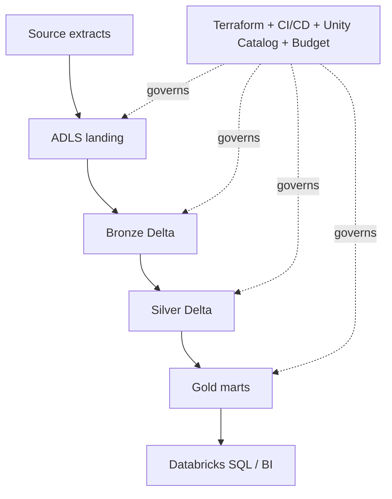
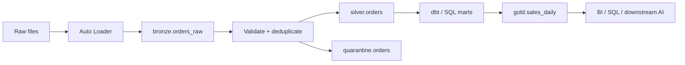
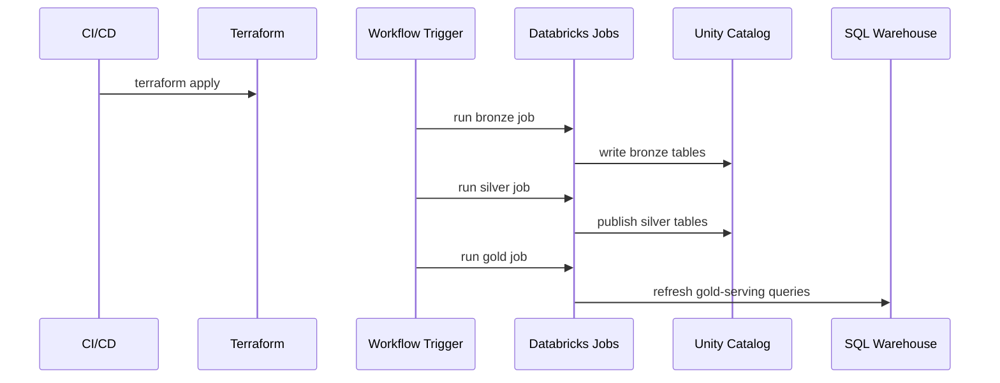

# End-to-End Lakehouse Lab

> Part of the **Enterprise Data & AI Architecture Handbook** - Resources / Labs, Chapter 02.
> A senior-level, hands-on guide to building a **governed bronze-silver-gold lakehouse** on Azure Databricks, with Azure as the primary implementation path and an enterprise open-source path for portability and comparison. The lab is grounded in [Lakehouse Architecture](../../Phase-05/02_Lakehouse_Architecture.md), [Medallion Architecture](../../Phase-05/03_Medallion_Architecture.md), [Apache Spark Internals](../../Phase-05/04_Apache_Spark_Internals.md), [Databricks Platform](../../Phase-05/05_Databricks_Platform.md), [Azure Data Factory and Synapse](../../Phase-05/06_Azure_Data_Factory_and_Synapse.md), [Microsoft Fabric](../../Phase-05/07_Microsoft_Fabric.md), [dbt and Analytics Engineering](../../Phase-05/08_dbt_and_Analytics_Engineering.md), and [Batch Pipeline Design](../../Phase-05/09_Batch_Pipeline_Design.md).

---

## Executive Summary

This lab builds a complete enterprise-style lakehouse from first principles: raw operational extracts land in object storage, bronze Delta tables preserve replayable history, silver transformations enforce trust and business rules, and gold marts publish stable analytics contracts for BI and downstream AI workloads. The specific scenario is a retail order domain with three source feeds - orders, order items, and customers - but the architecture is deliberately shaped so the same pattern can be reused for finance, manufacturing, healthcare, and customer-data workloads.

The Azure-default path uses ADLS Gen2, Azure Databricks with Unity Catalog, Databricks Workflows, dbt, and Databricks SQL. The open-source comparison path keeps the same logical design but swaps the managed control plane for Spark, Delta Lake or Iceberg, Airflow, dbt Core, MinIO, Trino, and Superset. The point of the lab is not merely to move files through three folders; it is to practice the hard parts that distinguish a real lakehouse from a demo: idempotent ingestion, schema evolution, quarantine instead of silent corruption, contract-driven gold marts, automated validation, CI/CD, and verified teardown.

The recurring discipline is the same one that runs through the handbook: the fast path must not be trusted where the correct path exists to keep the system reliable. In this lab that means raw data is never queried directly for business reporting, bronze is never treated as clean, notebooks are never promoted by copy-paste, and a budget alert is never mistaken for a cost control. The outcome is a small but production-shaped platform you can build, operate, break, fix, and destroy repeatedly.

---

## Learning Objectives

After completing this chapter you should be able to:

- Provision a minimal but governed lakehouse substrate on Azure for a hands-on lab.
- Ingest raw source files into replayable bronze Delta tables without losing lineage or schema-drift information.
- Build silver transformations that deduplicate, type-cast, validate, and quarantine bad data rather than silently accepting it.
- Publish gold marts that are optimized for specific analytical questions and stable enough for BI consumption.
- Separate the data plane from the control plane: storage, compute, orchestration, catalog, CI/CD, and teardown each have a distinct role.
- Explain when Azure Databricks is the right managed choice, when an open-source stack is sufficient, and when AWS or GCP equivalents are strategically better fits.
- Validate the full pipeline end to end, including row counts, business assertions, freshness, and teardown verification.
- Defend an ADR that chooses a medallion lakehouse with a single governed control plane over ad hoc file processing or direct-to-reporting shortcuts.

---

## Business Motivation

Enterprises do not build lakehouses because object storage is fashionable; they build them because they need one governed substrate that can satisfy three different constituencies at once:

- **Data engineering** needs a cheap, replayable landing zone where imperfect source data can arrive quickly and safely.
- **Analytics** needs stable, trusted marts with clear semantic meaning and predictable performance.
- **AI and advanced analytics** need historical depth, flexible schema evolution, and access to the same trusted facts rather than a second shadow data stack.

The business value comes from reducing copies, not creating new ones. A conventional anti-pattern is a raw lake for ingestion, a warehouse for BI, separate feature extracts for ML, and notebook-local files for experimentation. Each copy creates a second place where quality, lineage, access control, and refresh logic can diverge. The lakehouse pattern collapses those duplicates into one governed platform with multiple serving shapes.

This lab matters because it forces the learner to work the seam where most platform failures actually occur: the seam between "we landed the data" and "the business can trust the number." That seam is exactly where [Medallion Architecture](../../Phase-05/03_Medallion_Architecture.md), [dbt and Analytics Engineering](../../Phase-05/08_dbt_and_Analytics_Engineering.md), and [Batch Pipeline Design](../../Phase-05/09_Batch_Pipeline_Design.md) become operational rather than theoretical.

---

## History and Evolution

- **Enterprise data warehouse era** - highly curated, expensive, strongly modeled, but slow to ingest new data and expensive to scale.
- **Data lake era** - cheap storage and flexible ingestion, but often devolved into a swamp because governance, semantics, and performance were treated as optional.
- **Lakehouse era** - table formats such as Delta Lake, Apache Iceberg, and Apache Hudi brought transactional guarantees, schema management, and versioned metadata to object storage.
- **Managed platform era** - systems such as Azure Databricks and Microsoft Fabric combined the storage substrate, managed Spark, SQL serving, catalogs, and governance into one operator-friendly plane.

The critical insight was not "put Parquet in object storage." The critical insight was that the missing layer in early lakes was **table semantics plus control-plane discipline**: transactional metadata, schema enforcement, lineage, reproducibility, and serving contracts. That is the thread that connects [Lakehouse Architecture](../../Phase-05/02_Lakehouse_Architecture.md), [Databricks Platform](../../Phase-05/05_Databricks_Platform.md), and [Microsoft Fabric](../../Phase-05/07_Microsoft_Fabric.md).

---

## Why This Technology Exists

This technology exists because neither of the earlier extremes solves the whole enterprise problem by itself:

- A pure warehouse gives good semantics but poor flexibility and often high ingestion friction.
- A raw data lake gives good flexibility but poor trust and poor default governance.

The lakehouse exists to combine:

- low-cost, open-format storage,
- distributed compute for transformation,
- ACID table semantics,
- governed metadata,
- workload separation between engineering and analytics,
- and a single history of truth that downstream AI systems can also consume.

Bronze, silver, and gold are not just folders. They are **trust boundaries**. Bronze says "we received it." Silver says "we understand it well enough to join and reuse it." Gold says "we are willing to make decisions from it." This lab is designed to make those boundaries visible and testable.

---

## Problems It Solves

- Fast ingestion of imperfect source data without forcing business-level data modeling at the front door.
- Replayability: if downstream logic changes, bronze can be reprocessed without asking upstream systems to resend history.
- Schema drift management: new columns and malformed records can be detected, quarantined, and reviewed.
- Separation of concerns between storage, transformation, serving, and governance.
- Reuse of the same trusted silver data for multiple gold marts instead of re-implementing cleansing logic per team.
- Cost control through storage/compute decoupling and workload-specific compute choices.
- Lineage and auditability through Delta transaction logs and catalog metadata.
- A practical foundation for later feature engineering, semantic retrieval, and AI applications without building a parallel platform.

---

## Problems It Cannot Solve

- It cannot fix upstream source ownership or missing business definitions. If "net revenue" means different things in Finance and Sales, the platform cannot invent agreement.
- It cannot make poor partitioning, weak keys, or ambiguous event timestamps harmless. Bad modeling choices remain bad, just at scale.
- It cannot replace OLTP systems for millisecond transactional writes; a lakehouse is not an order-entry database.
- It cannot remove the need for governance review. Bronze-silver-gold is a useful pattern, not a substitute for ownership, classification, and access control.
- It cannot guarantee low cost if users keep long-lived interactive clusters running, over-materialize gold tables, or treat every query as a serverless BI workload.
- It cannot make a bad gold model trustworthy merely because it sits on top of Delta tables.

---

## Core Concepts

In-prose cross-references to other sections of this chapter use the section number, for example §20 Cost Optimization or §41 Hands-on Labs.

### 2.1 Bronze as replayable receipt, not clean truth

Bronze is the system's receipt that data arrived. It preserves source shape, source timestamps, ingestion timestamps, file names, and schema-drift artifacts. Bronze must be replayable and append-oriented; it should not be edited to make it look clean.

### 2.2 Silver as trust boundary

Silver is where the platform decides what it is willing to reuse. This is where types are corrected, duplicates are removed, nullability is enforced, reference data is joined, bad records are quarantined, and late-arriving data policies become explicit.

### 2.3 Gold as decision contract

Gold exists for concrete consumers: a finance dashboard, a customer-lifetime-value model, a fulfillment SLA scorecard. Gold is not "all data but cleaner"; it is curated for stable consumption, with performance tuning and semantic clarity taking precedence over raw flexibility.

### 2.4 Control plane and data plane are different systems

The data plane moves and transforms records. The control plane decides who may do so, where assets are registered, how deployments happen, how jobs are orchestrated, and what gets promoted between environments. Teams often over-focus on Spark code and under-design the control plane; that is how shadow pipelines appear.

### 2.5 Reproducibility is a first-class property

The lakehouse is not reproducible unless all of the following are reproducible together: infrastructure, job definitions, transformation logic, data tests, table metadata, permissions, and teardown. This is why the lab intentionally couples [Databricks Platform](../../Phase-05/05_Databricks_Platform.md) with [Batch Pipeline Design](../../Phase-05/09_Batch_Pipeline_Design.md) and [dbt and Analytics Engineering](../../Phase-05/08_dbt_and_Analytics_Engineering.md).

---

## Internal Working

### 3.1 Delta tables work because the log is the table

A Delta table is not just a directory of Parquet files. The authoritative state is the transaction log, which records adds, removes, schema changes, protocol versions, statistics, and commit metadata. Readers materialize a snapshot from the log, which is why the system can support ACID semantics, time travel, optimistic concurrency, and data skipping on cheap object storage. The implication for the lab is operational: if you treat the file directory as the table and bypass the log, you corrupt the lakehouse.

### 3.2 Idempotent ingestion is a choreography of checkpoints, keys, and merge semantics

Bronze ingestion uses a checkpoint to remember what files or offsets have been processed. Silver refinement uses deterministic keys and ordered deduplication logic so reruns do not multiply records. Gold uses incremental rebuild or deterministic full-refresh logic depending on table shape. The important lesson is that idempotency is not a single toggle; it is a property designed into every boundary.

### 3.3 Orchestration defines run boundaries, not business truth

ADF, Databricks Workflows, Airflow, or another orchestrator tells the platform when to run and in what dependency order. It does not, by itself, make data correct. A successful DAG run with a bad source file is still a bad business outcome. This is why validation gates, tests, and published run status are part of the platform, not decorative add-ons.

---

## Architecture

The lab architecture has five layers:

- **Source layer** - synthetic CSV and JSON feeds that simulate operational systems.
- **Landing and bronze layer** - ADLS Gen2 raw landing plus Delta bronze tables loaded with Auto Loader.
- **Refinement layer** - silver Delta tables with deduplication, quality rules, and quarantine outputs.
- **Serving layer** - gold marts exposed through Databricks SQL and optionally Power BI.
- **Control layer** - Terraform, Unity Catalog, Key Vault, CI/CD, workflow orchestration, tests, budgets, and teardown.

The practical domain model for the lab is intentionally simple:

- `orders_raw` and `order_items_raw` arrive daily as JSON.
- `customers_raw` arrives as a CSV full extract.
- Silver creates conformed `orders`, `order_items`, and `customers` tables.
- Gold publishes `sales_daily`, `customer_lifetime_value`, and `fulfillment_sla` marts.

This makes the lab small enough to run in a sandbox while still exercising the engineering problems that matter in real platforms: incremental loads, surrogate-like business keys, changing customer attributes, quality thresholds, and workload-specific serving.

---

## Components

The concrete components in the Azure path are:

- Azure Resource Group scoped to the lab.
- ADLS Gen2 storage account with `landing`, `delta`, and `checkpoints` containers.
- Azure Databricks workspace with Unity Catalog enabled.
- Databricks job clusters for bronze/silver/gold jobs.
- Databricks SQL warehouse for gold-table serving.
- Databricks Workflows or ADF for orchestration.
- Key Vault for secrets that cannot be replaced by managed identities.
- GitHub Actions or Azure DevOps for CI/CD.
- Optional Power BI semantic model for business-facing consumption.

The open-source path swaps these for MinIO, Spark, Delta Lake or Iceberg, Airflow, Trino, dbt Core, Superset, Great Expectations, and OpenMetadata. The logical pattern stays the same even though the operational burden changes materially.

---

## Metadata

Metadata is the difference between a lakehouse and a pile of files. In this lab the essential metadata layers are:

- **Catalog metadata** - catalog, schema, table, owner, grants, tags, comments.
- **Table metadata** - Delta log entries, schema versions, statistics, partition layout, retention settings.
- **Pipeline metadata** - run IDs, source file names, row counts, expectation outcomes, quality exceptions.
- **Business metadata** - gold-table definitions, freshness targets, owner, consumer commitments.

Unity Catalog is the default Azure control plane because it centralizes table registration, permissions, masking, lineage, and audit. If you skip the catalog and let notebooks write arbitrary paths, you recreate the early-lakehouse failure mode where storage exists but discoverability, access control, and trust do not.

---

## Storage

For the lab, storage is simple but deliberate:

- `landing` holds immutable raw drops by source and date.
- `delta` holds bronze, silver, and gold Delta tables.
- `checkpoints` holds Auto Loader and streaming checkpoints.

Recommended storage design:

- Keep bronze append-only and partitioned coarsely, usually by ingest date rather than every source field.
- Avoid overpartitioning small lab datasets; tiny files are a more common problem than insufficient partition pruning at this scale.
- Use `OPTIMIZE` and retention policies intentionally, not reflexively.
- Keep bronze, silver, and gold physically separate enough that lifecycle policies, permissions, and cleanup can be reasoned about independently.

An enterprise lesson worth making explicit: the cheapest storage choice is usually not the wrong one. The expensive mistakes happen higher up - too many copies, too many small files, and too much unnecessary compute waking up to serve poorly designed layouts.

---

## Compute

The compute design should match the workload, not convenience:

- **Bronze and silver** - scheduled Databricks job clusters, ephemeral and autoscaling.
- **Gold transforms** - dbt or SQL jobs on ephemeral compute.
- **Gold serving** - a small SQL warehouse or serverless SQL endpoint that can scale separately from ETL.
- **Development** - a tiny all-purpose cluster only for interactive debugging, with strict auto-termination.

For a lab, the common waste pattern is to use one medium or large interactive cluster for everything. That collapses development, batch, and serving into one expensive shared failure domain. A more correct design is several cheap, short-lived workloads with different SLAs and billing profiles.

---

## Networking

Even a lab benefits from sane networking discipline:

- Prefer private access from Databricks to storage where the sandbox allows it.
- Disable broad public access to the storage account.
- Keep outbound internet dependencies explicit and minimal.
- Use the lab resource group boundary as a coarse exfiltration boundary.

The key architectural point is not that a single-user lab needs a full hub-spoke landing zone. It is that the path from notebook to storage should not depend on anonymous keys copied into scripts. If a learner later scales this design into production, a managed identity and private-data-path mindset scales; copied access keys do not.

---

## Security

Security in the lab should be simpler than production, but not categorically different:

- Authenticate with Entra ID identities and managed identities where possible.
- Use Unity Catalog grants rather than direct file-path access whenever possible.
- Keep secrets in Key Vault or Databricks secret scopes, not in notebooks.
- Treat customer data as sensitive even when synthetic; build the permission model you would want in production.
- Mask or separate PII-style fields in gold serving outputs that do not need them.

The most common lakehouse security failure is not exotic attack traffic. It is the quiet creation of broad, persistent path-level access because it is convenient during development. The lab should make that anti-pattern visible early.

---

## Performance

Performance matters in a lab for two reasons: the user experience and the habit it teaches.

High-leverage practices for this lab are:

- Use Auto Loader rather than manual file enumeration.
- Keep bronze schemas permissive and silver schemas strict.
- Deduplicate in silver with a deterministic ordering column such as source update timestamp plus ingest timestamp.
- Use file compaction and statistics collection on gold tables that back BI.
- Broadcast small dimensions and avoid wide shuffles when a narrow gold mart will do.
- Keep gold tables consumer-specific; a smaller mart is often faster than a universal one.

The failure mode to avoid is premature optimization in the wrong layer. For a small lab dataset, file layout and job-cluster lifetime usually matter more than elaborate partition strategies.

---

## Scalability

The scaling path for this pattern is straightforward because the design separates concerns cleanly:

- Add more source domains by adding more bronze/silver pipelines, not by rewriting the control plane.
- Scale serving independently from ingestion by using separate SQL compute.
- Add more gold marts without duplicating silver cleansing logic.
- Expand from file-drop batch to near-real-time micro-batch without changing the medallion logic materially.

At enterprise scale the real limiter is usually not Spark. It is metadata quality, ownership clarity, and uncontrolled gold-table proliferation. This is why [dbt and Analytics Engineering](../../Phase-05/08_dbt_and_Analytics_Engineering.md) matters just as much as [Apache Spark Internals](../../Phase-05/04_Apache_Spark_Internals.md).

---

## Fault Tolerance

The lab should tolerate the most likely failures without manual heroics:

- Source files can arrive late or malformed.
- Jobs can fail midway.
- Silver logic can change after bronze has already landed history.
- Gold validation can fail after silver succeeded.

The response pattern is:

- preserve bronze history,
- checkpoint ingestion,
- quarantine bad silver rows,
- make gold promotion conditional on tests,
- and rerun deterministically.

This is materially better than the common shortcut of overwriting tables in place and hoping reruns settle the system back into a good state.

---

## Cost Optimization

The lab's cost discipline should be explicit, not accidental:

- Use job clusters or serverless jobs, not long-lived all-purpose clusters, for bronze/silver/gold runs.
- Turn on strict auto-termination for any interactive development cluster.
- Use a small SQL warehouse and stop it when not in use.
- Store raw history cheaply; spend money on compute only when a run is active.
- Keep the dataset small but structurally realistic.

Worked FinOps example, numbers illustrative and region-dependent:

- A constantly running 4-node dev cluster plus a continuously warm SQL warehouse can easily land in the rough range of **$1,100-$1,800 per month** for a trivial lab.
- The same lab as scheduled 45-minute bronze/silver/gold jobs with a 30-minute BI serving window often falls into the rough range of **$200-$400 per month**.
- The dominant lever is not a more clever storage format; it is eliminating idle compute by design.

This is a good example of a broader principle: a correct workload boundary usually saves more money than a clever SKU tweak.

---

## Monitoring

Monitoring answers known questions with explicit thresholds. For this lab monitor at least:

- pipeline success or failure,
- row counts by layer,
- freshness of each silver and gold table,
- job duration trends,
- cluster start and stop events,
- and resource-group spend against the sandbox budget.

Minimal monitoring assertions:

- `sales_daily` must refresh within the daily SLA.
- silver duplicate rate must remain under an agreed threshold.
- quarantine counts must not exceed a known tolerance without an alert.
- no compute resource should remain running outside lab hours.

If those conditions are not explicit, the platform is not monitored; it is merely logging.

---

## Observability

Observability is what lets you answer the next question after monitoring tells you something is wrong. For this lab, useful observability signals are:

- Databricks job-run logs and task-level run history.
- Delta transaction history for each table.
- Query history on the SQL warehouse.
- A run-audit table that records row counts, file counts, max event time, and validation outcomes per stage.
- Catalog and audit logs for permission changes.

The practical distinction from §21 is important. Monitoring says "gold is late." Observability should let you determine whether the cause was a late source file, a new schema column, a bad join key, an oversized shuffle, or a warehouse that never shut down and exhausted the budget.

---

## Governance

Governance for this lab should be lightweight but real:

- Every bronze, silver, and gold table has an owner.
- Gold tables have named consumers and a purpose.
- Sensitive columns are tagged and governed at the catalog layer.
- Promotion between dev and test is automated, not manual copy-paste.
- Teardown is mandatory and verified.

The key governance idea is that medallion only works when trust boundaries are operationally enforced. If any analyst can build dashboards directly on bronze because it is convenient, the pattern has failed regardless of how pretty the folder names are.

---

## Trade-offs

This design makes several explicit trade-offs:

- **Managed Azure stack vs open-source autonomy** - Azure Databricks and Unity Catalog reduce operational toil but increase platform dependence.
- **Bronze retention vs storage cost** - retaining replayable history is valuable, but not free.
- **Gold specialization vs proliferation** - narrow marts are faster and clearer, but too many of them become a maintenance burden.
- **Strong governance vs experimentation speed** - too little control creates chaos; too much central approval creates shadow work.
- **Delta-first lab vs format neutrality** - Delta is the shortest path on Azure Databricks, but some enterprises need Iceberg or Hudi for broader engine portability.

The right choice depends on what problem dominates your environment: speed of delivery, cross-engine openness, workforce skill profile, or governance burden.

---

## Decision Matrix

| Decision point | Prefer Azure Databricks path when... | Prefer open-source path when... | Avoid both and simplify when... |
| --- | --- | --- | --- |
| Managed lakehouse platform | You want fast time to value, Unity Catalog, and operational simplicity | You need portability and already run Kubernetes or platform engineering at scale | The use case is a small warehouse-only workload better served by a managed SQL platform |
| Bronze ingestion | You want Auto Loader and managed job orchestration | You already run Spark plus object storage and accept more ops burden | The source can be loaded directly into a warehouse table with no replay need |
| Silver quality layer | Multiple consumers need trusted reusable conformed data | You already standardize on Great Expectations, Airflow, and dbt Core | There is only one narrow reporting use case and no reuse requirement |
| Gold serving | BI and ML consumers need contract tables and cost-separated serving | Trino or ClickHouse already exist as governed serving layers | A single semantic model in an existing warehouse is sufficient |
| CI/CD | You already use GitHub Actions or Azure DevOps and want promotion discipline | Your platform team standardizes on GitOps and OSS deployment tooling | The lab is throwaway learning only and no one will ever rerun it |

---

## Design Patterns

- **Replayable bronze** - immutable receipt tables with source metadata preserved.
- **Quarantine instead of silent drop** - invalid silver records routed to a review table with reason codes.
- **Thin gold marts** - consumer-specific marts built from reusable silver foundations.
- **Separation of serving compute** - SQL and BI workloads do not share transformation clusters.
- **Promotion by pipeline** - deploy jobs, SQL assets, and transforms through CI/CD rather than manual notebook edits.
- **Run-audit side tables** - each stage emits counts, max timestamps, and validation results.
- **Teardown as part of the design** - every lab has a destroy path, not just a build path.

---

## Anti-patterns

- Querying bronze directly for executive reporting.
- Putting cleansing logic directly into every dashboard or BI semantic layer.
- One giant gold table intended to satisfy every consumer forever.
- Permanent all-purpose clusters because "it is only a lab."
- Path-level access and copied storage keys instead of catalog-governed table access.
- Manual promotion of notebook changes from dev to test.
- Treating a cost alert as if it were an enforcement control.

---

## Common Mistakes

- Partitioning tiny tables too aggressively and creating thousands of small files.
- Using ingestion timestamp as a business event timestamp.
- Deduplicating without a deterministic ordering rule.
- Overwriting silver or gold tables without preserving run-level validation evidence.
- Forgetting to version test data and then blaming pipeline logic for changed outputs.
- Building gold directly from bronze because the domain is "simple for now."
- Letting teardown depend on memory instead of automation.

---

## Best Practices

- Start with one narrow domain and one or two gold marts.
- Preserve raw lineage columns all the way through silver.
- Keep quality checks close to the transformation that can still explain failure context.
- Use naming that encodes layer and domain clearly.
- Treat gold tables as products with owners and consumers.
- Use synthetic or de-identified data in the lab even when the structure resembles production.
- Keep environment creation and destruction in the same repo as the pipeline logic.

---

## Enterprise Recommendations

- Default to the Azure-managed path for enterprise teams that are already Azure-first and want a governed training substrate quickly.
- Use the open-source path when portability or cost-constrained platform experimentation is itself part of the learning goal.
- Standardize on a single catalog and permission plane; mixing path-based and table-based governance multiplies confusion.
- Make silver the reusable enterprise contract, and gold the consumer-specific contract.
- Require validation before gold publication and require teardown verification after the lab run.
- Keep this lab as the template that later domains clone rather than re-designing the control plane from scratch for each new use case.

---

## Azure Implementation

The Azure path should be concrete, boring, and repeatable. A minimal substrate is:

- Resource group: one per learner or per lab environment.
- ADLS Gen2 storage account: Standard LRS is enough for the lab.
- Azure Databricks workspace with Unity Catalog enabled.
- Databricks job clusters for ETL and a small SQL warehouse for serving.
- Key Vault and managed identity where supported.

Terraform example:

```hcl
resource "azurerm_resource_group" "lab" {
  name     = "rg-lakehouse-lab-02"
  location = "westeurope"
}

resource "azurerm_storage_account" "lake" {
  name                     = "stlakehouselab02"
  resource_group_name      = azurerm_resource_group.lab.name
  location                 = azurerm_resource_group.lab.location
  account_tier             = "Standard"
  account_replication_type = "LRS"
  is_hns_enabled           = true
  shared_access_key_enabled = false
  public_network_access_enabled = false
}

resource "azurerm_databricks_workspace" "lab" {
  name                = "dbw-lakehouse-lab-02"
  resource_group_name = azurerm_resource_group.lab.name
  location            = azurerm_resource_group.lab.location
  sku                 = "premium"
}
```

Bronze ingestion notebook example with Auto Loader:

```python
bronze_orders = (
    spark.readStream
        .format("cloudFiles")
        .option("cloudFiles.format", "json")
        .option("cloudFiles.inferColumnTypes", "true")
        .option("cloudFiles.schemaLocation", "abfss://checkpoints@stlakehouselab02.dfs.core.windows.net/orders_schema")
        .load("abfss://landing@stlakehouselab02.dfs.core.windows.net/orders/")
        .withColumn("ingest_ts", F.current_timestamp())
        .withColumn("source_file", F.input_file_name())
)

(bronze_orders.writeStream
    .option("checkpointLocation", "abfss://checkpoints@stlakehouselab02.dfs.core.windows.net/orders_bronze")
    .trigger(availableNow=True)
    .toTable("bronze.orders_raw"))
```

Silver refinement example with deterministic deduplication:

```python
from pyspark.sql import functions as F, Window

window_spec = Window.partitionBy("order_id").orderBy(F.col("source_updated_ts").desc(), F.col("ingest_ts").desc())

silver_orders = (
    spark.table("bronze.orders_raw")
        .withColumn("rn", F.row_number().over(window_spec))
        .filter("rn = 1")
        .filter("order_status is not null and customer_id is not null")
        .select(
            "order_id",
            "customer_id",
            F.to_timestamp("order_ts").alias("order_ts"),
            F.col("order_status").alias("order_status"),
            F.col("order_total").cast("decimal(18,2)").alias("order_total"),
            "ingest_ts",
            "source_file"
        )
)

silver_orders.write.mode("overwrite").saveAsTable("silver.orders")
```

Gold mart example in SQL:

```sql
create or replace table gold.sales_daily as
select
  cast(o.order_ts as date) as order_date,
  c.country_code,
  count(distinct o.order_id) as order_count,
  sum(o.order_total) as gross_sales
from silver.orders o
join silver.customers c
  on o.customer_id = c.customer_id
where o.order_status = 'COMPLETED'
group by cast(o.order_ts as date), c.country_code;
```

GitHub Actions validation and deployment example:

```yaml
name: lakehouse-ci
on:
  pull_request:
  push:
    branches: [main]

jobs:
  validate:
    runs-on: ubuntu-latest
    steps:
      - uses: actions/checkout@v4
      - uses: actions/setup-python@v5
        with:
          python-version: '3.11'
      - run: pip install dbt-databricks
      - run: terraform fmt -check
      - run: terraform init -backend=false
      - run: terraform validate
      - run: dbt deps
      - run: dbt build --select state:modified+
```

Operationally, the right Azure habit is simple: land in ADLS, transform in Databricks, govern in Unity Catalog, test in CI, serve through gold tables, and destroy what you no longer need.

---

## Open Source Implementation

The open-source implementation keeps the same logical shape while accepting more operational burden:

- MinIO or cloud object storage for landing and table data.
- Spark with Delta Lake or Iceberg for bronze, silver, and gold processing.
- Airflow for orchestration.
- dbt Core for gold transformation discipline.
- Trino or ClickHouse for interactive serving.
- Superset for BI visualization.
- Great Expectations and OpenMetadata for quality and governance.

This path is strong when the real learning objective is platform composition itself: container networking, Spark packaging, Airflow DAG operation, and metadata tooling integration. It is weaker when the objective is to learn the data pattern quickly, because the operator burden steals time from the business and modeling lessons.

A sensible compromise for many enterprises is to teach the pattern on Azure first, then re-run the same bronze-silver-gold logic on an open-source stack to make the portability boundaries explicit.

---

## AWS Equivalent (comparison only)

Azure-to-AWS mapping for this lab looks like this:

- ADLS Gen2 -> S3
- Azure Databricks -> Databricks on AWS or EMR
- Unity Catalog -> Lake Formation plus Glue Data Catalog
- Databricks Workflows / ADF -> MWAA, Step Functions, or Glue Workflows
- Databricks SQL / Power BI -> Redshift, Athena, QuickSight, or Databricks SQL on AWS

Advantages on AWS:

- Deep S3 ecosystem maturity.
- Strong optionality between Databricks, EMR, Athena, and Redshift.
- Lake Formation is a credible centralized governance plane when used consistently.

Disadvantages relative to the Azure-default lab:

- More governance assembly work if you do not stay within one opinionated platform.
- Easier to drift into a multi-catalog, multi-serving-tool sprawl.

Migration strategy: keep the table-format and transformation semantics portable, and treat cloud-specific IAM, workflow, and serving layers as replaceable adapters rather than as the lakehouse's identity.

---

## GCP Equivalent (comparison only)

Azure-to-GCP mapping for this lab looks like this:

- ADLS Gen2 -> GCS
- Azure Databricks -> Databricks on GCP or BigQuery plus Dataproc/Dataflow for supporting transforms
- Unity Catalog -> Dataplex plus BigQuery governance patterns
- ADF / Databricks Workflows -> Cloud Composer or Dataform orchestration patterns
- Databricks SQL / Power BI -> BigQuery plus Looker

Advantages on GCP:

- BigQuery is extremely strong if the gold-serving requirement dominates and you want less infrastructure management.
- Looker provides a mature semantic and BI layer.

Disadvantages relative to the Azure-default lab:

- A BigQuery-centric design can tempt teams to skip a distinct silver contract and jump straight from landed files to consumption models.
- Object-store openness and Spark-centric flexibility are less naturally the center of gravity if the organization standardizes on BigQuery first.

Selection criterion: choose GCP when analytics serving simplicity is dominant, choose Azure Databricks when an engineering-first medallion platform with shared BI and AI reuse is the stronger requirement.

---

## Migration Considerations

Common migration paths into this lab pattern are:

- **From a warehouse-only estate** - start by landing raw extracts into bronze and rebuilding one gold mart through silver, not all marts at once.
- **From a raw data lake** - catalog first, then silver trust boundaries, then consumer-specific gold.
- **From a tool-sprawl modern data stack** - identify duplicate cleansing logic and collapse it into silver.
- **From another managed platform** - preserve open file formats, business keys, and test logic; re-implement provider-specific workflow and IAM edges last.

Migration should be parallel-run, not big-bang:

- validate silver against the old trusted report,
- validate gold against the business consumer,
- cut over one mart at a time,
- and retain bronze replay history during the transition.

The main risk is semantic drift during migration, not technical table creation. Most failed migrations produce data that loads but numbers that no one trusts.

---

## Mermaid Architecture Diagrams







---

## End-to-End Data Flow

The end-to-end flow in this lab is intentionally explicit:

1. Source files are copied to a dated landing path.
2. Auto Loader ingests them into bronze tables with ingestion metadata preserved.
3. Silver jobs apply typing, deduplication, reference joins, and quarantine logic.
4. Gold jobs materialize marts aligned to business questions.
5. SQL serving consumes gold, never bronze.
6. Validation queries assert row counts, freshness, and business rules.
7. Monitoring and cost checks confirm the environment behaves as expected.
8. Teardown destroys the environment and verifies nothing keeps billing.

This sequence is more important than the specific product names. If your platform skips steps 3, 6, or 8, it is fragile even if the rest is modern.

---

## Real-world Business Use Cases

- Retail order, return, and fulfillment analytics.
- Finance spend and invoicing marts with governed historical replay.
- Manufacturing supply-chain and inventory reconciliation.
- Subscription and customer-lifecycle analytics.
- Marketing attribution where raw event data must become reusable conformed facts.
- Shared analytical foundations for feature engineering and AI enrichment.

The common thread is the same: high-volume raw data lands quickly, but business decisions must run on stable curated tables, not raw source noise.

---

## Industry Examples

- **Uber** demonstrated why mutable, replayable lake storage and low-latency serving matter once raw event volume and derived products multiply.
- **Airbnb** showed that the hard problem is often metric consistency and governed serving, not just ingestion throughput.
- **Netflix** showed that metadata scale and open table semantics become first-order concerns long before object storage itself stops scaling.
- **Large retailers and consumer platforms** repeatedly converge on the same pattern: raw landing for flexibility, curated middle layers for trust, and narrow marts for decision speed.

The lesson is not to copy one company's exact stack. It is to copy the structure of their solved problems: replayability, semantics, governance, and workload separation.

---

## Case Studies

**Case Study 1 - Airbnb Minerva and why gold semantics matter**

Airbnb built Minerva because the expensive failure was not lack of data; it was inconsistent business numbers across teams. Multiple definitions of the same KPI caused endless reconciliation loops. The direct lesson for this lab is that gold is not a cosmetic reporting layer. Gold is where a platform decides which business definitions it will stand behind. If this lab ends with ten dashboards all rebuilding their own revenue logic from silver, it has reproduced the problem Minerva was built to solve.

**Case Study 2 - Target Canada's data-quality failure and why silver quarantine exists**

Target Canada's well-documented operational failure had many causes, but one recurring theme was poor product and supply-chain data quality that propagated into downstream decisions. The relevant lesson here is architectural: if the platform has no explicit trust boundary where malformed, incomplete, or semantically inconsistent data is stopped and reviewed, downstream systems will make confident wrong decisions at scale. Silver quarantine is not bureaucratic overhead. It is the mechanism that keeps raw-data defects from turning into board-level defects.

### Architecture Decision Record (ADR-0222): Default to a governed medallion lakehouse with one control plane

**Context:** The lab needs to teach end-to-end platform thinking, not only Spark syntax. Learners need to ingest imperfect data, refine it, publish stable marts, automate validation, and tear everything down in a bounded sandbox. Alternatives include querying raw landed files directly, building gold tables straight from bronze, or using a purely local open-source stack as the default.

**Decision:** Use a medallion lakehouse on Azure Databricks as the default path for the lab, with ADLS Gen2 storage, Unity Catalog as the governance plane, job-based bronze/silver/gold processing, and CI/CD plus teardown as mandatory workflow steps. Bronze remains replayable and append-oriented, silver is the reusable trust boundary with quarantine, and gold is a contract for specific consumers.

**Consequences:**

- Positive: the learner experiences the whole platform, not only one notebook.
- Positive: later BI and AI scenarios can reuse the same substrate.
- Positive: governance, cost, and teardown become visible engineering responsibilities.
- Negative: the Azure path is less portable than an OSS-only default.
- Negative: the control plane adds complexity compared with a one-notebook demo.

**Alternatives considered:**

- Directly query raw files with serverless SQL: fastest demo path, but it collapses trust boundaries and teaches the wrong habit.
- Build gold directly from bronze: fewer tables, but quality logic becomes duplicated and opaque.
- Make the open-source stack the default: better portability lesson, but too much operator burden for the core objective of this chapter.

---

## Hands-on Labs

This chapter assumes the environment from Resources / Labs Chapter 01 already exists.

### Lab 1 - Provision the substrate

1. Create the resource group, storage account, and Databricks workspace with Terraform.
2. Create Unity Catalog schemas `bronze`, `silver`, and `gold`.
3. Create a tiny dev cluster and verify auto-termination.

```powershell
terraform init
terraform apply -auto-approve
```

### Lab 2 - Land sample source data

Use three sample feeds:

- `orders/*.json`
- `order_items/*.json`
- `customers/*.csv`

Upload them into dated landing paths and record their manifest in a small audit file.

### Lab 3 - Build bronze

Run the Auto Loader notebooks for each source. Verify:

- bronze tables exist,
- source file name and ingest timestamp are present,
- schema drift fields are preserved rather than discarded.

### Lab 4 - Build silver

Run silver transformations that:

- remove duplicates,
- cast timestamps and numeric types,
- enforce not-null constraints on key fields,
- and route invalid rows to quarantine tables.

Validation checks:

- no duplicate `order_id` in `silver.orders`,
- `order_total >= 0`,
- all `customer_id` values join to `silver.customers` or are explicitly quarantined.

### Lab 5 - Build gold and serve

Create at least three marts:

- `gold.sales_daily`
- `gold.customer_lifetime_value`
- `gold.fulfillment_sla`

Point a SQL warehouse at them and run consumer queries only against gold.

### Lab 6 - Orchestrate, validate, and tear down

Build a workflow with bronze -> silver -> gold dependencies, then run:

```powershell
dbt build
terraform destroy -auto-approve
```

Post-teardown verification:

- resource group no longer exists,
- SQL warehouse is stopped,
- no cluster remains running,
- budget trend returns to zero forward spend.

---

## Exercises

1. Inject a new nullable source column into `orders_raw` and observe how bronze and silver respond.
2. Deliberately send a duplicate order record with a later update timestamp and verify silver keeps only the correct row.
3. Add a bad `customer_id` and verify it lands in quarantine rather than gold.
4. Create a gold mart directly from bronze, compare the logic with the silver-based version, and document why the shortcut is unsafe.
5. Benchmark a small always-on cluster versus ephemeral job clusters and calculate the monthly cost difference.
6. Replace the SQL gold mart with a dbt model and compare deployment discipline.

---

## Mini Projects

- **Mini Project 1:** Convert the retail domain into a subscription-billing domain with invoices, payments, and dunning events.
- **Mini Project 2:** Add a slowly changing customer segment dimension and decide whether it belongs in silver, gold, or both.
- **Mini Project 3:** Re-run the same bronze/silver/gold flow on an open-source stack and document which parts were logically portable and which were operationally Azure-specific.

---

## Capstone Integration

This lab is where the Phase-05 chapters become one working system:

- [Lakehouse Architecture](../../Phase-05/02_Lakehouse_Architecture.md) supplies the platform shape.
- [Medallion Architecture](../../Phase-05/03_Medallion_Architecture.md) supplies the trust boundaries.
- [Apache Spark Internals](../../Phase-05/04_Apache_Spark_Internals.md) explains why the transformation engine behaves the way it does.
- [Databricks Platform](../../Phase-05/05_Databricks_Platform.md) supplies the managed operator surface.
- [Azure Data Factory and Synapse](../../Phase-05/06_Azure_Data_Factory_and_Synapse.md) informs orchestration and integration alternatives.
- [Microsoft Fabric](../../Phase-05/07_Microsoft_Fabric.md) provides a comparison point for a more tightly integrated Microsoft-native experience.
- [dbt and Analytics Engineering](../../Phase-05/08_dbt_and_Analytics_Engineering.md) gives gold the discipline it needs.
- [Batch Pipeline Design](../../Phase-05/09_Batch_Pipeline_Design.md) turns isolated notebooks into an operable pipeline.

If later labs add streaming, RAG, or AI-serving patterns, they should build on this substrate rather than bypassing it.

---

## Interview Questions

1. Why should bronze remain replayable even if silver and gold already exist?
2. What is the architectural difference between a silver contract and a gold contract?
3. Why is a budget alert not sufficient as a cost control?
4. When should a team use dbt for gold rather than a pure notebook flow?
5. Why is direct dashboard access to bronze data a platform anti-pattern?

---

## Staff Engineer Questions

1. How would you partition ownership of bronze, silver, and gold across multiple domain teams without recreating a central bottleneck?
2. What signals would tell you the gold layer is proliferating faster than the platform can govern it?
3. How would you introduce CI/CD and promotion discipline into a notebook-heavy team without freezing delivery?
4. When would you accept an open-source exception path instead of the Azure-managed default?
5. How would you prove that silver is actually reusable and not just an expensive pass-through layer?

---

## Architect Questions

1. Under what conditions would you choose Iceberg or Hudi over Delta for this lab's logical design?
2. How would you adapt the architecture if near-real-time ingestion became mandatory but BI freshness requirements stayed hourly?
3. What is the right boundary between catalog governance and storage-account governance?
4. How would you design cross-region disaster recovery for the gold-serving layer without duplicating the whole operator burden?
5. What migration approach would you use to move a legacy warehouse mart into this medallion pattern with low business risk?

---

## CTO Review Questions

1. Why is this platform worth funding instead of allowing each analytics team to keep building direct pipelines into their own marts?
2. What is the operating-cost difference between a governed shared lakehouse and duplicated team-local analytical stacks?
3. How much platform lock-in is acceptable, and what portability mechanisms are preserved anyway?
4. What controls ensure that this lab pattern scales into an enterprise platform rather than a training-only artifact?
5. What evidence would prove the platform improves decision speed without reducing trust?

---

## References

- Delta Lake documentation and transaction-log design notes.
- Databricks medallion architecture guidance.
- Apache Spark SQL and Structured Streaming documentation.
- Kimball and Ross, *The Data Warehouse Toolkit*.
- dbt documentation on testing, exposures, and deployment patterns.
- Public engineering material on Airbnb Minerva, Uber data infrastructure, and Netflix metadata-first table evolution.

---

## Further Reading

- Revisit [Modern Data Stack Overview](../../Phase-05/01_Modern_Data_Stack_Overview.md) for the broader tooling landscape around this lab.
- Revisit [Lakehouse Architecture](../../Phase-05/02_Lakehouse_Architecture.md) and [Medallion Architecture](../../Phase-05/03_Medallion_Architecture.md) before adapting this lab to a new domain.
- Revisit [Databricks Platform](../../Phase-05/05_Databricks_Platform.md) for workspace, jobs, SQL, and governance details.
- Revisit [dbt and Analytics Engineering](../../Phase-05/08_dbt_and_Analytics_Engineering.md) and [Batch Pipeline Design](../../Phase-05/09_Batch_Pipeline_Design.md) before extending the lab into a team-shared environment.
- Continue to the sibling labs as plain-text next steps: Streaming Lab and RAG Lab.