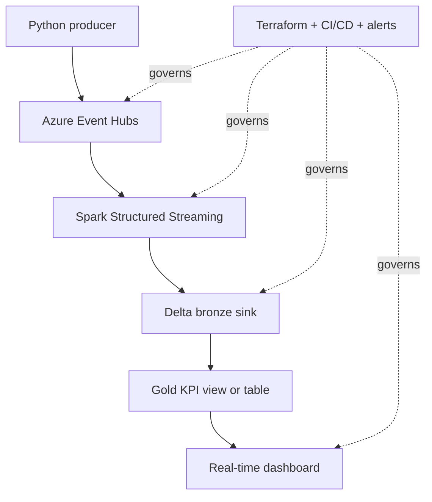
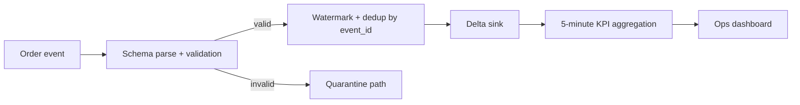
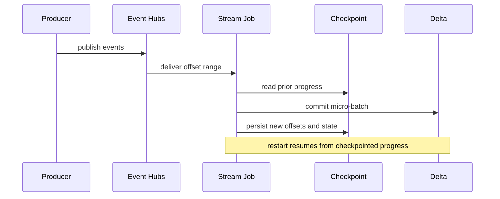

# Streaming Lab

> Part of the **Enterprise Data & AI Architecture Handbook** - Resources / Labs, Chapter 03.
> A senior-level, hands-on guide to building a **real-time streaming pipeline** with Azure Event Hubs, Spark Structured Streaming, Delta Lake, and a near-real-time dashboard, grounded in [Streaming Fundamentals](../../Phase-07/01_Streaming_Fundamentals.md), [Apache Kafka](../../Phase-07/02_Apache_Kafka.md), [Azure Event Hubs and Stream Analytics](../../Phase-07/03_Azure_Event_Hubs_and_Stream_Analytics.md), [Apache Flink](../../Phase-07/04_Apache_Flink.md), [Spark Structured Streaming](../../Phase-07/05_Spark_Structured_Streaming.md), [Change Data Capture](../../Phase-07/06_Change_Data_Capture.md), [Real Time Analytics ClickHouse and Druid](../../Phase-07/07_Real_Time_Analytics_ClickHouse_and_Druid.md), and [Streaming Patterns and Delivery Semantics](../../Phase-07/08_Streaming_Patterns_and_Delivery_Semantics.md).

---

## Executive Summary

This lab builds a small but production-shaped real-time platform: a producer emits order events, Azure Event Hubs receives them, Spark Structured Streaming validates and enriches them, Delta Lake stores them with replayable exactly-once sink semantics, and a real-time dashboard exposes operational KPIs such as orders per minute, gross merchandise value, and payment-failure rate. The subject is not merely how to send messages to a topic. The subject is how to design the seam between ingestion, stateful processing, storage, and real-time consumption so that failures are visible, bounded, and recoverable.

The Azure-default path uses Event Hubs as the managed broker, Azure Databricks for processing, Delta tables as the durable sink, and Databricks SQL for dashboarding. The open-source comparison path preserves the same logical shape with Kafka or Redpanda, Spark or Flink, Delta or Iceberg on object storage, and ClickHouse or Superset for the serving edge. The reason to make Azure primary is practical: it keeps the lab focused on streaming-system behavior rather than on operating brokers and clusters for their own sake.

The recurring discipline is the one that matters most in stream processing: **the fast path must not be trusted where the correct path exists to protect business outcomes.** That means offsets are not business truth, checkpointing is not optional, duplicate events are expected rather than denied, dashboards never read directly from the raw ingress log, and failure injection is part of the design, not an afterthought. The point of the lab is to teach how a real-time pipeline behaves when the system is under stress, not only when the happy path is smooth.

---

## Learning Objectives

After completing this chapter you should be able to:

- Provision a minimal real-time ingestion substrate on Azure for a streaming lab.
- Produce well-formed events into Event Hubs using the Kafka protocol endpoint.
- Build a Spark Structured Streaming job that parses, validates, deduplicates, and sinks events to Delta.
- Explain precisely what "exactly-once sink to Delta" means, and where its boundaries are.
- Publish a near-real-time operational dashboard from streaming-derived Delta tables.
- Inject realistic failures such as duplicates, poison records, lag spikes, cluster termination, and source pause/resume.
- Compare the Azure managed streaming path with an enterprise open-source path and with AWS/GCP equivalents.
- Defend an ADR that chooses a managed broker plus Delta-backed stream processing over direct dashboard-on-broker shortcuts or fully self-operated defaults.

---

## Business Motivation

Enterprises build streaming pipelines because some decisions lose value if they wait for the next batch window. Fraud signals, payment failures, fleet anomalies, customer-experience regressions, and marketplace imbalances all have a half-life measured in minutes or seconds, not in tomorrow morning's refresh cycle. The problem is not that batch is bad; it is that the business sometimes needs an operational view while the event is still actionable.

The challenge is that real-time systems make engineering shortcuts more expensive, not less. A duplicate event in a daily batch report is often annoying. A duplicate event in a real-time financial or operational dashboard can trigger the wrong human response immediately. That is why this lab centers exactly-once sink behavior, lag visibility, and failure injection rather than producer throughput benchmarks alone.

This chapter operationalizes the ideas from [Streaming Fundamentals](../../Phase-07/01_Streaming_Fundamentals.md), [Apache Kafka](../../Phase-07/02_Apache_Kafka.md), [Spark Structured Streaming](../../Phase-07/05_Spark_Structured_Streaming.md), and [Streaming Patterns and Delivery Semantics](../../Phase-07/08_Streaming_Patterns_and_Delivery_Semantics.md): time matters, delivery semantics matter, replay matters, and the serving contract matters just as much as the ingestion layer.

---

## History and Evolution

- Early enterprise integration relied on queues and message brokers optimized for decoupling, not for durable replay.
- Distributed log systems such as Kafka shifted the center of gravity from transient message delivery to replayable event history.
- Managed cloud brokers such as Event Hubs made durable high-throughput ingestion easier to adopt without operating ZooKeeper, brokers, and storage nodes directly.
- Stream processors such as Spark Structured Streaming and Flink matured state handling, watermarks, checkpointing, and event-time computation into mainstream production patterns.
- The modern real-time analytics stack added a serving edge - Delta, ClickHouse, Druid, or SQL dashboards - so users could act on streams without reading raw topics directly.

The important historical lesson is that the industry moved from "message passing" to "replayable event systems with explicit semantics." That is the exact difference between a demo that prints events to a console and a platform that can survive failure and answer operational questions accurately.

---

## Why This Technology Exists

This technology exists because there are decision loops that are neither best served by OLTP systems nor well served by overnight ETL. A streaming platform occupies the middle ground:

- durable ingest at high frequency,
- replayable history,
- low-latency transformation,
- stateful enrichment and aggregation,
- and operational serving for humans or downstream services.

Without that platform, teams usually fall into one of two broken extremes:

- polling operational databases too frequently and damaging OLTP systems, or
- pretending that a daily or hourly batch is "real-time enough" even when the business consequence of waiting is visible and costly.

Streaming technology exists to make that middle path safe and repeatable.

---

## Problems It Solves

- Low-latency detection of business and operational signals.
- Durable replay and reprocessing when transformation logic changes.
- Decoupling producers from downstream processors and dashboards.
- Windowed aggregation and event-time handling for real-world out-of-order data.
- State-aware deduplication and idempotent sinks.
- Near-real-time dashboards without granting analysts access to the raw ingress log.
- Explicit failure handling for poison messages, lag, and processing restarts.
- A practical bridge between event-driven systems and analytical storage.

---

## Problems It Cannot Solve

- It cannot make a poor event contract trustworthy. If event keys, timestamps, or schema ownership are weak, the stream will only fail faster.
- It cannot replace transactional source systems for strong consistency and point updates.
- It cannot guarantee business-level exactly-once behavior if producers reuse event IDs carelessly or if downstream consumers ignore deduplication boundaries.
- It cannot remove the need for batch backfills and historical correction paths; real-time and batch almost always coexist.
- It cannot make a real-time dashboard valuable if no one is prepared to act on it.
- It cannot justify its own complexity for use cases where hourly or daily batch is genuinely sufficient.

---

## Core Concepts

In-prose cross-references to other sections of this chapter use the section number, for example §19 Fault Tolerance or §41 Hands-on Labs.

### 3.1 Event time is not processing time

Real business interpretation depends on when the event happened, not when the processor saw it. [Streaming Fundamentals](../../Phase-07/01_Streaming_Fundamentals.md) and [Spark Structured Streaming](../../Phase-07/05_Spark_Structured_Streaming.md) make this distinction explicit because late arrival and out-of-order arrival are normal, not exceptional.

### 3.2 The log is ingress truth, not decision truth

The broker is the durable receipt that an event arrived. It is not the serving contract for operators, analysts, or finance. The serving contract belongs in Delta tables and dashboard queries designed for operational interpretation.

### 3.3 Exactly-once is a system property, not a checkbox

No single toggle on a broker or framework creates unconditional end-to-end exactly-once semantics. What this lab achieves is an exactly-once sink to Delta relative to replayable offsets plus checkpoint state, and business-level protection against duplicates through event identifiers and watermark-aware deduplication. That is more useful and more honest than vague claims of "exactly once everywhere."

### 3.4 Checkpoints are part of the data plane

A checkpoint is not incidental runtime state. It is the mechanism that ties source offsets, state-store progress, and sink commits together. If the checkpoint is lost or corrupted, the semantics of the pipeline change.

### 3.5 A dashboard is another consumer with its own contract

Real-time dashboards must be treated as consumers with freshness and correctness requirements. A dashboard that reads raw topics directly, or that cannot distinguish data lag from true zero activity, is architecturally incomplete.

---

## Internal Working

### 4.1 How the exactly-once Delta sink works in practice

Spark Structured Streaming persists source offsets and query progress in its checkpoint directory. For each micro-batch, the engine reads a deterministic offset range, processes that range, and commits the output to Delta together with progress metadata. On restart, the engine resumes from the last successful checkpointed state rather than guessing what happened. This is why Delta is such a strong sink for streaming labs: the transaction log and the streaming checkpoint cooperate to prevent silent partial writes from becoming normal behavior.

### 4.2 Why event ID deduplication still matters even with an exactly-once sink

The source system may retry publishes, a producer may reconnect and resend, or upstream business processes may legitimately emit the same logical event twice with slightly different metadata. The sink can be exactly once at the offset-processing level and still surface duplicate business events if the event contract does not define a stable key. This is why the lab uses `event_id` plus watermark-aware `dropDuplicates` in the processing path.

### 4.3 Why failure injection is part of the architecture

Streaming systems fail in ways batch systems often do not: consumer lag rises while the system still appears alive, watermarks stall, malformed records poison one partition but not others, or a dashboard shows zero because the stream is dead rather than because the business is quiet. The fastest way to understand whether the system is robust is to force those states deliberately and verify that they are detectable, bounded, and recoverable.

---

## Architecture

The lab architecture has five planes:

- **Producer plane** - a Python event generator emitting order and payment events.
- **Ingress plane** - Azure Event Hubs namespace and hub, exposing a Kafka-compatible endpoint.
- **Processing plane** - Spark Structured Streaming job for parsing, validation, deduplication, enrichment, and aggregation.
- **Storage and serving plane** - Delta bronze and gold tables plus a SQL dashboard over near-real-time metrics.
- **Control plane** - Terraform, CI/CD, secrets, alerts, cost guardrails, and teardown.

The domain is intentionally small: e-commerce order events with fields such as `event_id`, `order_id`, `event_ts`, `customer_region`, `payment_status`, and `order_total`. That is enough to exercise partitioning, event-time windows, deduplication, exactly-once sinks, and operational dashboards without hiding the lesson in domain complexity.

---

## Components

The concrete Azure path components are:

- Azure Resource Group scoped to the lab.
- Azure Event Hubs namespace and a single event hub, `orders-stream`.
- Consumer group, `stream-lab`.
- ADLS Gen2 storage account for Delta tables and checkpoints.
- Azure Databricks workspace and an ephemeral job cluster.
- Databricks SQL warehouse for the dashboard.
- Key Vault or Databricks secret scope for the Event Hubs connection string.
- GitHub Actions or Azure DevOps pipeline for validation and deployment.

The open-source analogs are Kafka or Redpanda, Spark or Flink, Delta or Iceberg on MinIO, ClickHouse, Superset or Grafana, and standard Git-based CI.

---

## Metadata

The metadata that matters in this lab is operational, not decorative:

- broker metadata: topic or hub name, partitions, retention, consumer group,
- event metadata: `event_id`, `event_type`, event timestamp, schema version,
- processing metadata: checkpoint path, query ID, watermark progress, lag,
- Delta metadata: table version, commit history, schema evolution, statistics,
- dashboard metadata: freshness threshold, owner, runbook link.

If these items are not captured, the platform may still move events but it becomes hard to answer basic operational questions: where are we stuck, what did we process, and can we replay it safely?

---

## Storage

Storage is intentionally split by purpose:

- `delta/bronze/orders_events` stores the replayable stream sink.
- `delta/silver/orders_valid` stores validated and deduplicated events if you choose a separate silver layer.
- `delta/gold/orders_kpi_1m` stores the near-real-time serving table.
- `checkpoints/orders_bronze` and `checkpoints/orders_kpi` store stream progress and state.

The storage design lesson from this lab is subtle but important: the checkpoint path is operationally as important as the Delta table path. Teams often protect data files and treat checkpoints as disposable. That is the wrong priority if semantics matter.

---

## Compute

The compute roles should stay separate:

- **Producer compute** - a tiny local or containerized process.
- **Stream processing compute** - a small Databricks job cluster or serverless compute for the streaming query.
- **Serving compute** - a small SQL warehouse for dashboard reads.
- **Validation compute** - CI runners or notebook tests that do not share the stream cluster's lifecycle.

For a lab, a single small autoscaling cluster is usually enough for stream processing, but it must still be treated as ephemeral job compute with strict auto-termination. Long-lived shared clusters blur cost boundaries and complicate failure analysis.

---

## Networking

The relevant networking details are pragmatic:

- Event Hubs Kafka traffic uses TLS over port `9093`.
- Spark workers need private or controlled access to Event Hubs and storage.
- SQL serving should be reachable by the learner while still bounded to the lab workspace.
- If the sandbox permits private endpoints, prefer them; if not, at least keep secrets and public network exposure minimal.

In a lab the network is simpler than production, but the discipline is the same: a stream processor should authenticate and connect through explicit, least-privilege paths rather than ad hoc copied connection strings in notebooks.

---

## Security

Security priorities for the streaming lab are:

- use Entra-backed workspace access,
- keep the Event Hubs SAS key in a secret store rather than in source code,
- avoid broad shared credentials for producers and processors,
- protect dashboard access because near-real-time operational data is still sensitive,
- and treat the Kafka endpoint as an authenticated service, not an open socket.

Streaming security failures are often quiet: a leaked producer credential or a dashboard exposed to the wrong audience leaks live business telemetry, not just stale reports. The lab should normalize secure defaults from the start.

---

## Performance

High-leverage performance levers for this lab are:

- choose a partition count that matches intended parallelism,
- keep event payloads compact and schema-stable,
- avoid overly small micro-batches that spend more time scheduling than processing,
- checkpoint to stable storage,
- and compact the Delta sink if small files start dominating query cost.

The most common mistake is to focus on raw producer throughput before validating correctness. A fast stream that duplicates business events or lags invisibly is not high performance; it is high-rate confusion.

---

## Scalability

This pattern scales by extending each plane independently:

- more producers or domains can publish to additional hubs or partitions,
- processing parallelism can scale with partitions and cluster workers,
- storage can retain more history without forcing always-on compute,
- and dashboard serving can scale separately from ingestion.

The real scaling constraint is often not broker throughput. It is state growth, hot partitions, bad keys, and operational blind spots. That is why [Streaming Patterns and Delivery Semantics](../../Phase-07/08_Streaming_Patterns_and_Delivery_Semantics.md) matters as much as broker selection.

---

## Fault Tolerance

The lab should be robust against the failures most streaming systems actually experience:

- duplicated events,
- malformed events,
- producer pauses and reconnects,
- stream-cluster restarts,
- lag spikes,
- and dashboard staleness.

The response strategy is:

- durable broker retention,
- replayable sink,
- checkpoint preservation,
- event-level deduplication,
- poison-record quarantine,
- and explicit stale-data detection.

This is better than the common anti-pattern of assuming that because the stream restarted successfully, the business semantics must still be correct.

---

## Cost Optimization

Streaming is dangerous from a FinOps perspective because it tempts teams into permanent compute. The lab should stay cost-bounded by design:

- Event Hubs Standard tier with a small number of throughput units is sufficient for the lab.
- The streaming cluster should be the smallest configuration that demonstrates stable processing.
- The SQL warehouse should be tiny and stopped outside active dashboard use.
- The producer should run locally or in a tiny container, not on a dedicated VM.

Worked FinOps example, numbers illustrative and region-dependent:

- Event Hubs Standard namespace with 1 throughput unit, a small Databricks streaming job cluster active only during the lab window, and a small SQL warehouse typically stays in the rough range of **$150-$350 per month** for repeated lab use.
- The same lab with an always-on interactive cluster and a permanently running SQL warehouse commonly lands in the rough range of **$900-$1,500 per month**.
- The dominant lever is not broker price. It is whether compute is ephemeral or left warm all day.

The streaming version of the same platform lesson holds: idle compute is the real tax, not storage.

---

## Monitoring

Minimum monitoring signals for the lab are:

- Event Hubs incoming messages and ingress throughput,
- consumer lag by partition or consumer group,
- streaming query status and restart count,
- watermark progression,
- records written to Delta,
- dashboard freshness,
- and sandbox spend.

Operational thresholds should distinguish between "no business activity" and "pipeline is unhealthy." A flat dashboard with a healthy live stream is a business signal. A flat dashboard with a dead consumer is an incident.

---

## Observability

Observability asks why the stream is behaving the way it is. Useful signals are:

- per-batch processing duration,
- input rows per second and processed rows per second,
- state-store size,
- skew or lag by partition,
- malformed-record counts,
- Delta commit history,
- and dashboard-query history.

If monitoring tells you the stream is late, observability should let you determine whether the cause is source surge, underpartitioning, a poison-message retry loop, checkpoint corruption, or a dashboard warehouse that is stopped.

---

## Governance

Governance for a streaming lab is narrower than enterprise production, but it is still real:

- define the event schema and event ownership,
- assign ownership for the stream job and the dashboard,
- define retention and replay expectations,
- define what counts as a production-grade duplicate event,
- and document who may read the live operational dashboard.

Real-time pipelines often bypass governance because they are framed as operational rather than analytical. That is precisely how shadow telemetry systems appear.

---

## Trade-offs

- **Managed Event Hubs vs self-operated Kafka** - faster learning and less ops, but less control over broker internals.
- **Structured Streaming vs Flink** - simpler Spark ecosystem continuity versus richer event-time and state-control flexibility.
- **Delta sink vs direct operational store** - stronger replay and analytical reuse versus one more layer before a dashboard.
- **Real-time dashboard vs batch report** - faster actionability versus higher operational complexity.
- **Strict deduplication and quarantine vs speed-first ingestion** - better correctness versus added processing and state costs.

The right choice depends on the business urgency, platform maturity, and willingness to own operational complexity.

---

## Decision Matrix

| Decision point | Prefer Azure managed path when... | Prefer open-source path when... | Prefer simpler batch or non-streaming path when... |
| --- | --- | --- | --- |
| Broker | You want managed ingest quickly and are Azure-first | You already run Kafka or Redpanda at scale | The source can be polled hourly with no loss of value |
| Processor | Spark skills already exist and Delta reuse matters | Flink or Kafka-native stream expertise is a strategic asset | The pipeline only needs simple file movement or CDC snapshots |
| Sink | You want replayable analytical reuse in Delta | Iceberg or Hudi portability is the stronger concern | An operational cache is enough and no history is needed |
| Dashboard | Operators need near-real-time KPI visibility | ClickHouse or Superset already exists as a serving edge | Users do not act differently based on minute-level data |
| Failure strategy | You want managed recovery with minimal broker ops | You need low-level control and accept the run burden | The use case is tolerant of delayed correction |

---

## Design Patterns

- **Replayable broker plus durable sink** - ingest once, replay as needed.
- **Stateful deduplication by event ID with watermark** - duplicates are expected and explicitly handled.
- **Raw-to-serving separation** - broker ingress is not the dashboard source.
- **Checkpoint preservation** - checkpoint directories treated as first-class operational assets.
- **Poison-record quarantine** - malformed events routed to an error table or dead-letter path.
- **Dashboard staleness indicator** - every dashboard shows data freshness, not just KPI values.
- **Failure-injection drills** - restart, duplicate, lag, and malformed-event scenarios tested on purpose.

---

## Anti-patterns

- Treating at-least-once delivery as if it were business-level exactly once.
- Building dashboards directly on the raw event log.
- Using processing time when business interpretation depends on event time.
- Sharing one cluster for producer tests, streaming processing, ad hoc analysis, and dashboard serving.
- Hiding malformed records instead of quarantining them.
- Losing checkpoints and calling the resulting replay "just a rerun."
- Assuming zero throughput means zero business activity without freshness context.

---

## Common Mistakes

- Choosing too few partitions and then interpreting lag as a compute problem rather than a keying problem.
- Using a non-stable or missing event ID.
- Forgetting to watermark stateful deduplication, causing unbounded state growth.
- Stopping the SQL warehouse and then diagnosing the dashboard as a stream failure.
- Writing huge amounts of tiny files to Delta from overly frequent micro-batches.
- Forgetting that producer retries can create semantically duplicate business events.
- Treating a stream restart as proof that the recovered output is correct.

---

## Best Practices

- Define the event contract and ID strategy before sending load.
- Keep the initial stream domain narrow and observable.
- Use Event Hubs retention and Delta history intentionally so replay is real, not theoretical.
- Make freshness visible in the dashboard itself.
- Separate invalid-event handling from valid-event processing.
- Keep compute ephemeral and minimal for the lab.
- Run failure drills as part of normal validation, not emergency-only practice.

---

## Enterprise Recommendations

- Default to managed broker plus Delta sink when the organization is Azure-first and the goal is to learn or deliver quickly.
- Prefer Spark Structured Streaming when the downstream estate already centers on Delta and analytical reuse.
- Use Flink when stateful event-time control or streaming-native operational sophistication is the real platform priority.
- Treat near-real-time dashboards as governed products with owners, SLAs, and runbooks.
- Preserve a replayable path even if the business consumer only sees the live dashboard.
- Do not greenlight streaming by default; make teams defend the need for sub-hour actionability.

---

## Azure Implementation

The Azure-default implementation is:

- Event Hubs Standard namespace with 1 or 2 throughput units.
- One event hub, `orders-stream`, with 4 partitions and 1 day retention for the lab.
- Azure Databricks Premium workspace with Unity Catalog enabled if available in the sandbox.
- Small job cluster or serverless compute for the stream query.
- ADLS Gen2 for Delta tables and checkpoints.
- Small SQL warehouse for dashboard queries.

Terraform example:

```hcl
resource "azurerm_resource_group" "lab" {
  name     = "rg-stream-lab-03"
  location = "westeurope"
}

resource "azurerm_storage_account" "lake" {
  name                            = "ststreamlab03"
  resource_group_name             = azurerm_resource_group.lab.name
  location                        = azurerm_resource_group.lab.location
  account_tier                    = "Standard"
  account_replication_type        = "LRS"
  is_hns_enabled                  = true
  shared_access_key_enabled       = false
  public_network_access_enabled   = false
}

resource "azurerm_eventhub_namespace" "stream" {
  name                = "evhns-stream-lab-03"
  location            = azurerm_resource_group.lab.location
  resource_group_name = azurerm_resource_group.lab.name
  sku                 = "Standard"
  capacity            = 1
}

resource "azurerm_eventhub" "orders" {
  name                = "orders-stream"
  namespace_name      = azurerm_eventhub_namespace.stream.name
  resource_group_name = azurerm_resource_group.lab.name
  partition_count     = 4
  message_retention   = 1
}

resource "azurerm_eventhub_consumer_group" "lab" {
  name                = "stream-lab"
  namespace_name      = azurerm_eventhub_namespace.stream.name
  eventhub_name       = azurerm_eventhub.orders.name
  resource_group_name = azurerm_resource_group.lab.name
}

resource "azurerm_databricks_workspace" "lab" {
  name                = "dbw-stream-lab-03"
  resource_group_name = azurerm_resource_group.lab.name
  location            = azurerm_resource_group.lab.location
  sku                 = "premium"
}
```

Python producer example using the Kafka endpoint:

```python
import json
import random
import time
import uuid
from datetime import datetime, timezone

from confluent_kafka import Producer

config = {
    "bootstrap.servers": "evhns-stream-lab-03.servicebus.windows.net:9093",
    "security.protocol": "SASL_SSL",
    "sasl.mechanism": "PLAIN",
    "sasl.username": "$ConnectionString",
    "sasl.password": "Endpoint=sb://evhns-stream-lab-03.servicebus.windows.net/;SharedAccessKeyName=send;SharedAccessKey=REDACTED",
    "client.id": "stream-lab-producer"
}

producer = Producer(config)

while True:
    event = {
        "event_id": str(uuid.uuid4()),
        "order_id": random.randint(100000, 999999),
        "event_ts": datetime.now(timezone.utc).isoformat(),
        "customer_region": random.choice(["NL", "DE", "FR", "UK"]),
        "payment_status": random.choice(["AUTHORIZED", "FAILED"]),
        "order_total": round(random.uniform(10, 400), 2)
    }
    producer.produce("orders-stream", key=str(event["order_id"]), value=json.dumps(event).encode("utf-8"))
    producer.poll(0)
    time.sleep(0.2)
```

Spark Structured Streaming sink to Delta:

```python
from pyspark.sql import functions as F
from pyspark.sql.types import StructType, StructField, StringType, DoubleType

schema = StructType([
    StructField("event_id", StringType(), False),
    StructField("order_id", StringType(), False),
    StructField("event_ts", StringType(), False),
    StructField("customer_region", StringType(), True),
    StructField("payment_status", StringType(), True),
    StructField("order_total", DoubleType(), True),
])

raw = (
    spark.readStream
        .format("kafka")
        .option("kafka.bootstrap.servers", "evhns-stream-lab-03.servicebus.windows.net:9093")
        .option("subscribe", "orders-stream")
        .option("kafka.security.protocol", "SASL_SSL")
        .option("kafka.sasl.mechanism", "PLAIN")
        .option("kafka.sasl.jaas.config", "kafkashaded.org.apache.kafka.common.security.plain.PlainLoginModule required username=\"$ConnectionString\" password=\"Endpoint=sb://evhns-stream-lab-03.servicebus.windows.net/;SharedAccessKeyName=listen;SharedAccessKey=REDACTED\";")
        .load()
)

events = (
    raw.selectExpr("CAST(value AS STRING) AS json_payload")
       .select(F.from_json("json_payload", schema).alias("e"))
       .select("e.*")
       .withColumn("event_ts", F.to_timestamp("event_ts"))
       .withWatermark("event_ts", "10 minutes")
       .dropDuplicates(["event_id"])
       .withColumn("ingest_ts", F.current_timestamp())
)

(events.writeStream
    .format("delta")
    .outputMode("append")
    .option("checkpointLocation", "abfss://checkpoints@ststreamlab03.dfs.core.windows.net/orders_bronze")
    .trigger(processingTime="30 seconds")
    .toTable("bronze.orders_events"))
```

Gold dashboard query example:

```sql
create or replace view gold.orders_kpi_5m as
select
  window(event_ts, '5 minutes').start as window_start,
  customer_region,
  count(*) as orders,
  sum(order_total) as gross_value,
  sum(case when payment_status = 'FAILED' then 1 else 0 end) as payment_failures,
  max(ingest_ts) as last_refresh_ts
from bronze.orders_events
where event_ts >= current_timestamp() - interval 2 hours
group by window(event_ts, '5 minutes'), customer_region;
```

The key Azure lesson is that Event Hubs, Spark, Delta, and SQL each do one job well. Keep those jobs separate and the platform stays explainable.

---

## Open Source Implementation

The open-source equivalent keeps the same logical pipeline but changes who owns the operational burden:

- Kafka or Redpanda for the event log.
- Spark Structured Streaming or Flink for processing.
- MinIO plus Delta Lake or Iceberg for the sink.
- ClickHouse or Druid for low-latency serving.
- Grafana or Superset for the dashboard.

Minimal bootstrap shape:

```bash
docker compose up -d redpanda minio spark-master spark-worker clickhouse grafana
```

Representative topic setup:

```bash
kafka-topics.sh --bootstrap-server localhost:9092 --create --topic orders-stream --partitions 4 --replication-factor 1
```

This path is ideal when the learning goal includes broker operations, topic lifecycle, connector packaging, and multi-component failure recovery. It is a worse default when the main lesson is stream semantics and platform contracts rather than self-hosting skills.

---

## AWS Equivalent (comparison only)

Azure-to-AWS mapping for this lab:

- Event Hubs -> Kinesis Data Streams or MSK
- Azure Databricks -> Databricks on AWS, EMR, or Glue Streaming
- ADLS Gen2 + Delta -> S3 + Delta or Hudi/Iceberg
- Databricks SQL -> Athena, Redshift, or ClickHouse-based serving

Advantages on AWS:

- Strong choice between proprietary managed streams and real Kafka.
- Mature ecosystem for S3-centered lake storage.
- Good optionality for real-time serving stacks.

Disadvantages relative to the Azure-default lab:

- Easier to drift into separate governance planes for stream, lake, and serving.
- More design choices means more opportunity for platform sprawl in a learning environment.

Selection criterion: choose AWS when the organization already standardizes on S3 plus Kinesis or MSK and wants the lab to mirror that reality; otherwise the Azure path remains the faster learning lane.

---

## GCP Equivalent (comparison only)

Azure-to-GCP mapping for this lab:

- Event Hubs -> Pub/Sub or managed Kafka offering where appropriate
- Azure Databricks -> Databricks on GCP, Dataproc, or Dataflow depending on processing style
- ADLS Gen2 + Delta -> GCS + Delta or BigQuery serving edge
- Databricks SQL -> BigQuery and Looker or another serving layer

Advantages on GCP:

- Strong real-time analytics end state if BigQuery is already the organizational center of gravity.
- Mature managed streaming services for teams that prefer serverless patterns.

Disadvantages relative to the Azure-default lab:

- A BigQuery-first mindset can blur the distinction between the replayable stream sink and the serving contract.
- Spark and Delta can become secondary patterns rather than the primary teaching surface.

Selection criterion: choose GCP when serverless real-time serving simplicity dominates; choose the Azure path when the platform lesson centers on broker-plus-Delta reuse and a more explicit medallion analytical landing zone.

---

## Migration Considerations

Common migration paths into this pattern are:

- from database polling to event streaming,
- from queue-based transient messaging to replayable log ingestion,
- from raw-stream consumers directly feeding dashboards to Delta-backed serving,
- and from self-hosted proof-of-concept brokers to managed enterprise services.

The safest migration sequence is:

1. establish the event contract and identifiers,
2. dual-publish or shadow-consume into the new stream,
3. validate sink outputs against the old operational report,
4. introduce the new dashboard with freshness markers,
5. cut over the action loop,
6. retain replay capability during and after the transition.

The biggest migration risk is semantic drift, not message transport. Teams usually know how to move bytes. They often fail at preserving meaning.

---

## Mermaid Architecture Diagrams







---

## End-to-End Data Flow

1. The producer emits an order event keyed by `order_id` and identified by `event_id`.
2. Event Hubs durably appends the event to one partition of `orders-stream`.
3. Spark Structured Streaming consumes from the `stream-lab` consumer group.
4. The stream job parses JSON, validates schema, assigns event time, and quarantines malformed records.
5. The stream job applies watermark-aware deduplication by `event_id`.
6. The valid deduplicated stream is committed to Delta with checkpoint-backed exactly-once sink behavior.
7. A gold query or downstream incremental aggregate derives operational KPIs.
8. A dashboard reads those KPIs together with freshness markers.
9. Failure drills verify replay, recovery, lag detection, and duplicate protection.
10. Teardown destroys the environment and verifies no broker, cluster, or SQL serving remains active.

---

## Real-world Business Use Cases

- Payment authorization and failure-rate monitoring.
- Fraud-signal enrichment before a downstream human or model decision.
- E-commerce checkout health dashboards.
- Fleet or IoT anomaly monitoring where operational teams respond quickly.
- Customer-experience telemetry such as latency, errors, or abandoned flows.
- Low-latency order or inventory imbalance detection.

The unifying rule is simple: choose streaming when acting sooner materially changes the business outcome.

---

## Industry Examples

- LinkedIn's Kafka story showed why durable replayable logs beat brittle point-to-point integration.
- Uber's dispatch and marketplace systems demonstrated the importance of low-latency event pipelines tied to operational decisions.
- Confluent and cloud-provider managed-broker offerings normalized the idea that many enterprises should buy the broker substrate and differentiate higher up the stack.
- Real-time analytics platforms such as ClickHouse and Druid showed that stream processing is incomplete without a serving edge designed for fast operational questions.

The consistent lesson is that a broker alone is not a streaming platform. The sink, state, and serving contract complete the design.

---

## Case Studies

**Case Study 1 - LinkedIn and the birth of Kafka**

LinkedIn's original problem was not simply throughput. It was integration collapse: too many producers and consumers coupled through fragile point-to-point pipes with no durable replayable history. Kafka mattered because it turned integration into a shared log with retention and independent consumers. The lesson for this lab is direct: Event Hubs is valuable not because it can receive messages, but because it gives the stream processor a durable, replayable ingress boundary that decouples producers from analytical and operational consumers.

**Case Study 2 - Knight Capital and why kill switches and failure drills matter**

Knight Capital's 2012 trading failure was not a Delta or Event Hubs incident, but it is still a real-time-systems lesson worth carrying into this lab. A fast automated system with weak deployment and stop-loss discipline can amplify damage before humans catch up. The lesson here is architectural: every real-time lab should include a bounded failure mode, an observable stale-state signal, and a clearly documented stop path. A real-time system without a tested shutdown and recovery path is only performing well until the first bad deploy or bad event contract arrives.

### Architecture Decision Record (ADR-0223): Use a managed broker plus Delta-backed stream sink as the lab default

**Context:** The lab must teach producer setup, ingest, stateful processing, exactly-once sink behavior, real-time serving, and failure injection without spending most of the learner's time on broker operations. Alternatives include self-hosted Kafka as the default, direct dashboard reads from the broker, or a queue-plus-imperative-consumer design with no replayable analytical sink.

**Decision:** Use Azure Event Hubs as the default ingress service, Spark Structured Streaming as the processing engine, and Delta Lake as the durable sink. Publish dashboards from Delta-backed derived tables or views, not from raw broker topics. Require event IDs, checkpoint preservation, deduplication, and failure drills as first-class parts of the lab.

**Consequences:**

- Positive: learners focus on stream semantics, not operating brokers.
- Positive: replay, validation, and dashboard serving stay explainable.
- Positive: the pattern ports cleanly to Kafka and open-source stacks later.
- Negative: Event Hubs hides some broker internals that a platform engineer may eventually need to learn.
- Negative: the managed path is less infrastructure-portable than an OSS-only default.

**Alternatives considered:**

- Self-hosted Kafka default: stronger broker-operations lesson, but too much operator burden for the core objective of this chapter.
- Direct dashboard from raw topic: superficially simpler, but it collapses durability, replay, and serving contracts into one fragile boundary.
- Queue consumer writing directly to an operational store: acceptable for some narrow operational apps, but poor as a lab for replayable analytical streaming patterns.

---

## Hands-on Labs

This chapter assumes you already have a sandbox resource group or subscription where Event Hubs, storage, and streaming compute can be created.

### Lab 1 - Provision the stream substrate

1. Create the resource group, storage account, Event Hubs namespace, event hub, and Databricks workspace with Terraform.
2. Create a secret scope or secret entry for the Event Hubs connection string.
3. Confirm the namespace, event hub, and consumer group exist.

```powershell
terraform init
terraform apply -auto-approve
```

### Lab 2 - Start the producer

1. Run the Python producer locally or in a container.
2. Verify events are appearing in Event Hubs metrics.
3. Intentionally note the event schema and the chosen event key.

```powershell
python producer.py
```

### Lab 3 - Start the streaming sink

1. Launch the Structured Streaming job.
2. Verify `bronze.orders_events` receives records.
3. Restart the job once and confirm record counts do not double from replay alone.

Validation checks:

- checkpoint files exist,
- Delta table history advances,
- duplicate `event_id` count remains zero after restart.

### Lab 4 - Build the real-time dashboard

1. Create `gold.orders_kpi_5m`.
2. Build a SQL dashboard showing orders, gross value, failed payments, and freshness.
3. Stop the stream temporarily and verify the dashboard's freshness signal reveals staleness.

### Lab 5 - Inject failures

Run at least four drills:

- duplicate publish,
- malformed JSON event,
- stream-cluster termination,
- producer pause and resume.

For each drill, record:

- what monitoring detected,
- what observability explained,
- whether the sink stayed correct,
- and how recovery was verified.

### Lab 6 - Teardown

1. Stop the producer.
2. Stop the SQL warehouse.
3. Destroy the infrastructure.

```powershell
terraform destroy -auto-approve
```

Post-teardown verification:

- Event Hubs namespace removed,
- no Databricks cluster still running,
- no active SQL warehouse,
- sandbox budget returning to zero forward run rate.

---

## Exercises

1. Change the event schema by adding a new nullable field and observe which parts of the pipeline tolerate it and which require adjustment.
2. Publish duplicate business events with the same `event_id` and verify the sink stays semantically clean.
3. Publish duplicate events with different `event_id` values but the same `order_id`, then document why the platform needs both technical and business-level duplicate thinking.
4. Increase event volume 10x for five minutes and measure lag behavior.
5. Delete or corrupt the checkpoint in a non-production copy of the lab and document exactly how the pipeline behavior changes.
6. Replace the real-time SQL dashboard with a ClickHouse or Druid serving edge in the open-source path.

---

## Mini Projects

- **Mini Project 1:** Convert the stream from e-commerce orders to fraud-scoring events with a real-time failure-rate dashboard.
- **Mini Project 2:** Add a CDC stream for inventory changes and join it with order events to expose stock-pressure signals.
- **Mini Project 3:** Rebuild the same pipeline with Kafka or Redpanda plus Spark on a local container stack and document what changed logically versus operationally.

---

## Capstone Integration

This lab is where the Phase-07 chapters become a working operational system:

- [Streaming Fundamentals](../../Phase-07/01_Streaming_Fundamentals.md) defines the concepts of event time, windows, and out-of-order data.
- [Apache Kafka](../../Phase-07/02_Apache_Kafka.md) explains log-based streaming and consumer groups.
- [Azure Event Hubs and Stream Analytics](../../Phase-07/03_Azure_Event_Hubs_and_Stream_Analytics.md) provides the managed Azure ingress model.
- [Apache Flink](../../Phase-07/04_Apache_Flink.md) sharpens the comparison point for stateful stream processing.
- [Spark Structured Streaming](../../Phase-07/05_Spark_Structured_Streaming.md) explains the engine used in the default implementation.
- [Change Data Capture](../../Phase-07/06_Change_Data_Capture.md) informs how operational systems can eventually feed this pattern.
- [Real Time Analytics ClickHouse and Druid](../../Phase-07/07_Real_Time_Analytics_ClickHouse_and_Druid.md) explains why the serving edge matters.
- [Streaming Patterns and Delivery Semantics](../../Phase-07/08_Streaming_Patterns_and_Delivery_Semantics.md) frames replay, idempotency, and consumer correctness.

The broader lesson is that a streaming platform is only complete when ingress, state, sink, and serving all obey the same semantic contract.

---

## Interview Questions

1. What does exactly-once sink to Delta mean in Spark Structured Streaming, and what does it not mean?
2. Why is a replayable stream log different from a traditional queue?
3. Why should a real-time dashboard not read directly from the broker?
4. What role do watermarks play in deduplication and windowing?
5. How would you distinguish producer duplicates from consumer reprocessing duplicates?

---

## Staff Engineer Questions

1. How would you decide whether a use case genuinely needs streaming rather than micro-batch or hourly batch?
2. What signals tell you the real bottleneck is partitioning strategy rather than raw compute size?
3. How would you standardize checkpoint, schema, and failure-drill practices across many domain teams?
4. When would you accept a direct operational store sink instead of Delta as the primary replayable sink?
5. How would you prevent real-time dashboard sprawl from becoming a second ungoverned analytics estate?

---

## Architect Questions

1. When is Event Hubs the right managed choice, and when is self-operated Kafka justified despite the added burden?
2. How would you evolve this lab from one event domain to a multi-domain streaming platform without collapsing governance?
3. What is the right split between Spark Structured Streaming and Flink in an enterprise that already uses both?
4. How would you design disaster recovery for the broker, checkpoint, and Delta sink together rather than separately?
5. What migration path would you use to move a polling-based operational dashboard to an event-driven one safely?

---

## CTO Review Questions

1. What business decisions become materially better when this pipeline is live instead of daily?
2. What is the steady-state cost of real-time capability, and how is it bounded?
3. What failure modes remain even after using managed services, and who owns them?
4. What evidence would prove the streaming platform is improving actionability rather than simply increasing system complexity?
5. What portability is preserved if the organization changes broker or cloud strategy later?

---

## References

- Tyler Akidau, Slava Chernyak, and Reuven Lax, *Streaming Systems*.
- Martin Kleppmann, *Designing Data-Intensive Applications*.
- Apache Kafka documentation and protocol design notes.
- Apache Spark Structured Streaming documentation.
- Azure Event Hubs service documentation.
- Delta Lake transaction log and streaming sink documentation.

---

## Further Reading

- Revisit [Streaming Fundamentals](../../Phase-07/01_Streaming_Fundamentals.md) and [Streaming Patterns and Delivery Semantics](../../Phase-07/08_Streaming_Patterns_and_Delivery_Semantics.md) before changing sink semantics or duplicate-handling logic.
- Revisit [Azure Event Hubs and Stream Analytics](../../Phase-07/03_Azure_Event_Hubs_and_Stream_Analytics.md) for Azure-specific broker design choices.
- Revisit [Spark Structured Streaming](../../Phase-07/05_Spark_Structured_Streaming.md) before extending the stateful processing logic.
- Revisit [Real Time Analytics ClickHouse and Druid](../../Phase-07/07_Real_Time_Analytics_ClickHouse_and_Druid.md) if you replace the default dashboard-serving edge.
- Continue to the sibling Resources/Labs plain-text next step: RAG Lab.