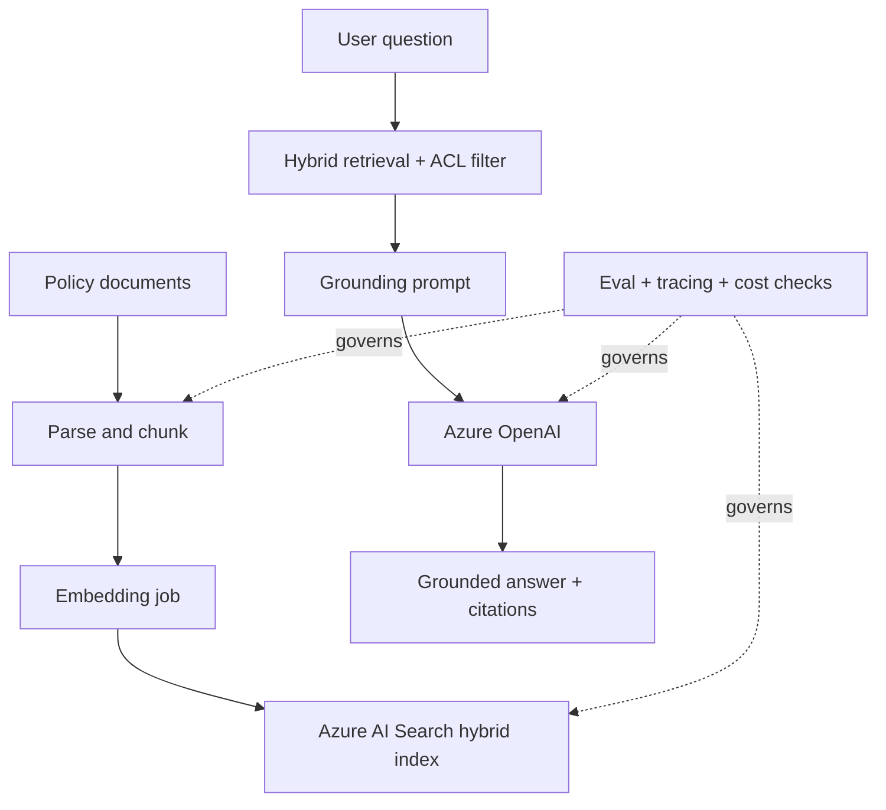
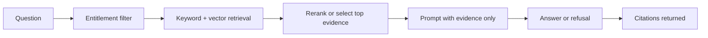
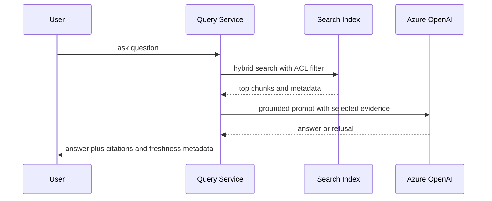

# RAG Lab

> Part of the **Enterprise Data & AI Architecture Handbook** - Resources / Labs, Chapter 04.
> A senior-level, hands-on guide to building a **production-style Retrieval Augmented Generation system** on Azure, grounded in [Retrieval Augmented Generation](../../Phase-12/03_Retrieval_Augmented_Generation.md), [LLMOps](../../Phase-12/04_LLMOps.md), [Azure OpenAI and AI Foundry](../../Phase-12/07_Azure_OpenAI_and_AI_Foundry.md), [Evaluation and Guardrails](../../Phase-12/09_Evaluation_and_Guardrails.md), [Vector Databases Qdrant and Milvus](../../Phase-13/01_Vector_Databases_Qdrant_and_Milvus.md), [Embeddings and Semantic Search](../../Phase-13/03_Embeddings_and_Semantic_Search.md), and [GraphRAG](../../Phase-13/04_GraphRAG.md).

---

## Executive Summary

This lab builds a production-shaped RAG application over an enterprise policy corpus: documents are ingested from storage, normalized and chunked, embedded into a vector-enabled retrieval index, filtered by access metadata, retrieved via hybrid search, grounded through Azure OpenAI, evaluated against a labeled question set, and instrumented for latency, token cost, grounding quality, and failure behavior. The lab is deliberately narrow in domain and broad in architecture. The domain is policy and knowledge-assistant Q and A because it forces the two constraints that matter most in enterprise RAG: **truth must come from retrieved evidence, and not every user should retrieve every document**.

The Azure-default implementation uses Azure Blob or ADLS Gen2 as the source store, Azure AI Search as the hybrid vector store and retrieval engine, Azure OpenAI for embeddings and grounded answer synthesis, and a small Python service or notebook runner for ingestion and query orchestration. Evaluation is not treated as a postscript. It is part of the platform: retrieval recall, answer groundedness, citation quality, jailbreak resistance, latency, and token spend are all measured explicitly.

The recurring discipline is the same one emphasized in [Retrieval Augmented Generation](../../Phase-12/03_Retrieval_Augmented_Generation.md) and [Evaluation and Guardrails](../../Phase-12/09_Evaluation_and_Guardrails.md): **the system must not trust plausibility where evidence is required.** Retrieval must be ACL-aware, citations must point to the actual supporting chunk, the model must decline when evidence is weak, and evaluation must test the whole pipeline rather than congratulating a polished answer that cannot be justified. This lab exists to make those boundaries concrete and runnable.

---

## Learning Objectives

After completing this chapter you should be able to:

- Provision a minimal Azure RAG substrate with storage, Azure AI Search, Azure OpenAI, and observability hooks.
- Design an ingestion pipeline that chunks documents intentionally rather than mechanically.
- Generate embeddings and load a vector-capable index with metadata needed for filtering, citations, and evaluation.
- Implement hybrid retrieval with lexical plus vector search and ACL-aware filtering.
- Ground an Azure OpenAI response only on retrieved evidence and return citations with the answer.
- Evaluate a RAG system using retrieval quality, groundedness, correctness, and safety signals rather than a single vague "quality" score.
- Inject realistic failure modes such as overchunking, stale indexes, ACL leaks, adversarial prompts, and missing evidence.
- Defend an ADR that chooses hybrid ACL-aware RAG over naive long-context prompting or direct chatbot-over-documents shortcuts.

---

## Business Motivation

Enterprises adopt RAG because the business often needs answers over proprietary, changing, access-controlled knowledge without paying the cost and governance risk of fine-tuning every new corpus into a model. Policies, runbooks, product manuals, contract clauses, incident histories, and knowledge-base articles all change faster than fine-tuning cycles should. RAG gives the organization a way to keep answers current by retrieving from governed content at request time.

The attraction is obvious. The failure mode is also obvious once seen: a model that sounds authoritative while citing irrelevant or unauthorized content can create faster, more scalable wrong answers than a keyword search ever could. That is why the lab emphasizes ingestion quality, ACL propagation, evidence-first prompting, and evaluation. In enterprise RAG the expensive mistake is rarely "the model was too small." It is usually "the platform did not know which evidence to trust or who was allowed to see it."

This chapter turns the ideas from [Retrieval Augmented Generation](../../Phase-12/03_Retrieval_Augmented_Generation.md), [Azure OpenAI and AI Foundry](../../Phase-12/07_Azure_OpenAI_and_AI_Foundry.md), [Embeddings and Semantic Search](../../Phase-13/03_Embeddings_and_Semantic_Search.md), and [GraphRAG](../../Phase-13/04_GraphRAG.md) into one controlled lab where correctness, authorization, and cost can all be tested explicitly.

---

## History and Evolution

- Enterprise search began with keyword indexes, metadata filters, and document portals.
- Embeddings and vector search added semantic retrieval over meaning rather than exact lexical match.
- Large language models made natural-language synthesis over retrieved evidence viable at user-facing quality.
- Hybrid retrieval architectures combined keyword, vector, reranking, and grounding because no single retrieval mode dominates every query type.
- Modern RAG systems added evaluation, guardrails, access propagation, and observability after early prototypes proved that a fluent answer is not the same thing as a safe or correct answer.

The important historical lesson is that RAG is not search plus a chat box glued on top. It is the convergence of search, retrieval, identity, orchestration, evaluation, and prompt discipline into one answer-generation system. Most failures occur in the seams between those pieces rather than inside any single component.

---

## Why This Technology Exists

RAG exists because organizations need all of the following at once:

- answers over private and changing corpora,
- no repeated model retraining for every document update,
- the ability to restrict retrieval by entitlements,
- evidence-backed responses rather than parametric memory guesses,
- and a platform that can be measured, updated, and governed continuously.

Long-context prompting alone does not solve this for most enterprise settings. It is expensive, hard to govern, difficult to keep synchronized with document updates, and poor at entitlement scoping when many users share one corpus. RAG exists to make the knowledge layer external, versioned, searchable, filterable, and refreshable.

---

## Problems It Solves

- Answering questions over proprietary documents without fine-tuning for every content change.
- Combining lexical and semantic retrieval for better coverage across exact-term and concept queries.
- Keeping answers current by updating the index rather than retraining the model.
- Restricting access by document metadata and caller entitlements.
- Returning evidence with answers so users can inspect the supporting source.
- Reducing hallucination risk relative to ungrounded prompting.
- Enabling systematic evaluation of retrieval and answer generation as separate layers.
- Creating a reusable knowledge foundation for copilots, assistants, and agentic systems.

---

## Problems It Cannot Solve

- It cannot rescue a bad or ambiguous corpus. If the documents disagree or are outdated, the assistant may faithfully ground a wrong answer.
- It cannot make weak access-control design safe. Post-generation authorization checks are too late if unauthorized content was already retrieved.
- It cannot prove causal truth. RAG systems provide grounded textual evidence, not certainty that the source itself is correct.
- It cannot eliminate the need for human review in high-stakes legal, medical, safety, or regulatory workflows.
- It cannot make evaluation optional. Without a labeled question set and regression harness, every model or chunking change is guesswork.
- It cannot justify itself when ordinary search is already good enough for the user task.

---

## Core Concepts

In-prose cross-references to other sections of this chapter use the section number, for example §20 Cost Optimization or §41 Hands-on Labs.

### 4.1 Retrieval quality and generation quality are separate variables

The assistant can fail because retrieval missed the right chunk, because retrieved chunks were irrelevant, or because the model answered badly despite receiving the right evidence. [Retrieval Augmented Generation](../../Phase-12/03_Retrieval_Augmented_Generation.md) makes this split explicit because it is the foundation of useful diagnosis.

### 4.2 Chunking is an upstream ceiling on answer quality

Chunk size, overlap, heading preservation, table handling, and metadata richness determine what retrieval can even return. [Embeddings and Semantic Search](../../Phase-13/03_Embeddings_and_Semantic_Search.md) is clear on this point: a bad chunking policy lowers the maximum possible recall before the model ever sees a prompt.

### 4.3 Access control must be enforced during retrieval, not after answer generation

If unauthorized chunks are eligible for ranking, the system is already too late. ACL-aware filtering is a precondition of safe enterprise RAG, not a downstream nice-to-have. This principle appears throughout [Retrieval Augmented Generation](../../Phase-12/03_Retrieval_Augmented_Generation.md) and [GraphRAG](../../Phase-13/04_GraphRAG.md).

### 4.4 Hybrid retrieval is usually the enterprise default

Exact lexical terms such as policy IDs, product names, or clause numbers are poorly served by dense retrieval alone. Semantically phrased questions are poorly served by keyword alone. Enterprise RAG usually needs both, often with reranking.

### 4.5 Evaluation is part of the application, not only the model

The system being evaluated is the entire RAG bundle: chunking policy, embedding model, index configuration, filters, prompt, model, and guardrails. [LLMOps](../../Phase-12/04_LLMOps.md) and [Evaluation and Guardrails](../../Phase-12/09_Evaluation_and_Guardrails.md) treat this as the promotable unit for a reason.

---

## Internal Working

### 5.1 Why hybrid retrieval beats single-mode retrieval in most enterprise corpora

Vector retrieval is strong when a user phrases a concept differently from the source text. Keyword retrieval is strong when exact identifiers, acronyms, product names, legal clauses, or rare domain terms matter. Enterprise corpora usually contain both query types, often in the same session. That is why Azure AI Search hybrid retrieval - vector plus lexical with semantic ranking - is so often the shortest correct path for production RAG.

### 5.2 Why chunk metadata is as important as chunk text

Title, section heading, source document, version, classification, ACL group, language, product, and effective date can all drive retrieval quality, filtering, and evaluation. A vector without metadata is just a point in space. A retrievable enterprise knowledge record needs provenance and policy, not only similarity.

### 5.3 Why evaluation must include "answer refusal when evidence is weak"

The assistant is not successful merely because it returned text. In enterprise settings, one of the most valuable correct behaviors is to refuse or defer when retrieved evidence is absent, contradictory, stale, or unauthorized. This is one of the clearest differences between a chatbot demo and a governed assistant.

---

## Architecture

The lab architecture has five planes:

- **Corpus plane** - enterprise policy, HR, travel, and procurement documents stored in Blob or ADLS Gen2.
- **Ingestion plane** - parsers, chunkers, metadata enrichers, and embedding jobs.
- **Retrieval plane** - Azure AI Search hybrid index with vector fields, lexical fields, semantic configuration, and ACL filters.
- **Generation plane** - Azure OpenAI chat model grounded only on retrieved context, with citations and refusal behavior.
- **Control plane** - Terraform or CLI bootstrap, secrets, evaluation harness, cost controls, tracing, and teardown.

The domain is intentionally narrow: enterprise policy Q and A. That keeps the knowledge graph small enough for a lab while still exercising the hard parts that matter in production RAG: changing documents, section-based chunking, entitlement filters, no-answer cases, stale indexes, and adversarial user prompts.

---

## Components

The concrete Azure path components are:

- Resource group scoped to the lab.
- Blob Storage or ADLS Gen2 account for the document corpus and ingestion manifests.
- Azure AI Search service with vector search and semantic ranking enabled.
- Azure OpenAI resource with one embedding deployment and one chat deployment.
- Python ingestion and query service, local or containerized.
- Optional Application Insights or Azure Monitor logging for latency, token, and query traces.
- Optional small web UI or notebook front-end for manual testing.

The open-source path swaps these for MinIO, Qdrant or Milvus or pgvector, open-weight embeddings or API embeddings, LangChain or LlamaIndex orchestration, FastAPI, and Grafana or similar observability surfaces.

---

## Metadata

The metadata model is foundational in this lab. Each chunk should carry at least:

- `chunk_id`
- `doc_id`
- `doc_title`
- `section_heading`
- `version`
- `effective_date`
- `classification`
- `acl_groups`
- `source_uri`
- `chunk_text`
- `chunk_tokens`

This metadata is not cosmetic. It powers filtering, citations, regression tests, stale-content detection, and future re-indexing. If the lab ingests only raw text and vectors, it teaches the wrong lesson about what enterprise retrieval actually needs.

---

## Storage

Storage is split by responsibility:

- source documents in Blob or ADLS,
- chunk manifests and ingestion audit files in the same account,
- retrieval index content in Azure AI Search,
- optional evaluation sets in JSON or Delta,
- and logs or traces in the chosen observability store.

The storage pattern matters because RAG systems are not just model calls. They are knowledge systems. The authoritative source of truth remains the governed documents in storage. The search index is a derived artifact that must be rebuildable from source content plus pipeline logic.

---

## Compute

The compute roles are small but distinct:

- document ingestion and chunking,
- embedding generation,
- query-time retrieval and synthesis,
- evaluation runs,
- and optional dashboarding or operator UI.

For a lab, most of this can run on a local Python environment, a container, or a small ephemeral notebook or job runner. The important principle is not scale-first provisioning. It is clear separation between bulk indexing work and interactive query-serving work so that cost and latency can be reasoned about independently.

---

## Networking

The network posture should be intentional even for a lab:

- the query service authenticates to Azure AI Search and Azure OpenAI explicitly,
- private endpoints are preferred when the sandbox allows them,
- public access should be minimized,
- and cross-service calls should not depend on hard-coded keys in notebooks.

RAG systems often look "application-light" and therefore get under-designed networking. That is a mistake. The assistant may surface sensitive documents in near real time, which makes the network and identity boundary more important, not less.

---

## Security

Security priorities for the lab are:

- keep document access and index access scoped to the lab identity,
- propagate ACL metadata into the index,
- authenticate to Azure OpenAI and Search using the most constrained practical credential path,
- redact or avoid highly sensitive source content in the lab corpus,
- and return citations in a way that does not expose unauthorized sources.

The dominant RAG security failure is not prompt leakage alone. It is retrieval of content the user should never have been able to rank in the first place. That is why ACL-aware retrieval is threaded through almost every design decision here.

---

## Performance

High-leverage performance levers for this lab are:

- chunk size and overlap tuned to the corpus,
- embedding model chosen by measured quality-to-cost ratio,
- top-k and rerank depth kept just high enough rather than maximized blindly,
- hybrid retrieval used instead of vector-only defaults,
- and query-time prompt context kept bounded to the most relevant evidence.

The fastest route to a slow RAG application is uncontrolled context expansion. The second-fastest route is retrieving too many chunks because the platform cannot tell relevant evidence from merely nearby evidence.

---

## Scalability

This pattern scales by separating refresh, retrieval, and generation:

- more documents increase indexing time and index size,
- more users increase query load and token cost,
- richer ACL structures increase filter and entitlement complexity,
- and deeper evaluation suites increase CI cost but reduce production regressions.

The first large-scale bottleneck is often not the model. It is ingestion consistency, metadata quality, and entitlement propagation. The second is usually cost per request when every question uses an unnecessarily large model and too much retrieved context.

---

## Fault Tolerance

The lab should tolerate the most likely failure classes:

- bad document parsing,
- poor chunk boundaries,
- stale index after source updates,
- embedding job interruption,
- unauthorized retrieval attempts,
- no-answer questions,
- and model or search endpoint throttling.

The recovery pattern is:

- keep source content authoritative,
- keep indexing reproducible,
- fail closed when ACL or retrieval confidence is unclear,
- log and quarantine parsing failures,
- and allow full or targeted re-indexing.

This is better than the common shortcut of treating the vector index as if it were the source of truth and then discovering too late that it cannot be trusted or rebuilt cleanly.

---

## Cost Optimization

RAG cost is multi-part and easy to misread because token spend is only one component. This lab should optimize:

- embedding generation only when documents change,
- retrieval depth based on measured gain rather than habit,
- a smaller embedding model unless recall metrics justify a larger one,
- a small chat deployment unless answer quality requires escalation,
- and evaluation runs on representative subsets rather than full corpora every time.

Worked FinOps example, numbers illustrative and region-dependent:

- A small policy corpus of 2,000 chunked passages can often be embedded cheaply enough that indexing is not the dominant cost.
- The steady-state cost usually comes from query-time generation and repeated evaluation runs.
- A lab that uses a compact embedding model plus a small chat model with top-5 retrieval often stays in the rough range of **$100-$250 per month** for active experimentation.
- The same lab with top-20 retrieval, a large chat deployment for every request, and full-suite evaluation on every commit can easily move into the rough range of **$500-$1,200 per month**.

The dominant cost lever is almost never storage. It is query-time prompt and model discipline.

---

## Monitoring

Minimum monitoring signals for the lab are:

- indexing run success or failure,
- document and chunk counts,
- embedding job duration,
- retrieval latency,
- generation latency,
- no-answer rate,
- token consumption,
- evaluation pass or fail,
- and sandbox spend.

The assistant should also surface freshness directly: when was the index last refreshed, and which document version did the answer cite?

---

## Observability

Observability lets you answer the next question after monitoring flags an issue. Useful signals are:

- retrieved chunk IDs and scores,
- applied ACL filters,
- prompt size and token breakdown,
- per-step latency,
- grounding or refusal decision path,
- evaluation sample failures,
- and index version used by the answer.

If monitoring tells you answer quality dropped, observability should let you determine whether the root cause was chunking drift, corpus change, entitlement filter narrowing, model swap, index staleness, or an overly aggressive prompt-compression change.

---

## Governance

Governance for the lab should be lightweight but genuine:

- every document source has an owner,
- every index has a rebuild path,
- every answer path has an evaluation gate,
- every ACL policy is explicit,
- every prompt template is versioned,
- and every promoted RAG bundle is traceable.

The key governance rule is simple: the RAG system is a knowledge product, not a notebook experiment. If the team cannot say who owns the corpus, the index, the prompt, the evaluation set, and the production answer quality, then the assistant is not governed.

---

## Trade-offs

- **Azure AI Search vs self-hosted vector store** - less operator burden and stronger hybrid retrieval, but tighter cloud coupling.
- **Hybrid retrieval vs vector-only simplicity** - better enterprise precision and recall, but more tuning surface.
- **Chunk-rich metadata vs quick embeddings-only ingestion** - higher governance and evaluation value, but more ingestion complexity.
- **Strict refusal on weak evidence vs answer-always UX** - safer and more honest, but less superficially impressive.
- **Evaluation-heavy delivery vs faster iteration** - lower regression risk, but more up-front discipline and cost.

The correct choice depends on what you are optimizing: demo speed, enterprise safety, portability, or platform simplicity.

---

## Decision Matrix

| Decision point | Prefer Azure default path when... | Prefer open-source path when... | Prefer simpler search-only or non-RAG path when... |
| --- | --- | --- | --- |
| Retrieval engine | You want managed hybrid retrieval and semantic ranking quickly | You already run Qdrant, Milvus, or pgvector at scale | Keyword search already solves the user task sufficiently |
| Embeddings | You want consistent Azure-managed deployments | You need model portability or local execution | The corpus is tiny and exact-match search is enough |
| Generation | You need grounded synthesis with enterprise controls | You already standardize on open-weight serving | Users mainly need passage retrieval, not synthesized answers |
| ACL handling | You can propagate entitlements into Azure AI Search filters | You own custom filter logic and index ops | The corpus is fully public or single-tenant |
| Evaluation | You are willing to enforce pre-promotion gates | You already have an OSS eval harness and governance workflow | The assistant is not decision-relevant and is truly experimental |

---

## Design Patterns

- **Hybrid retrieval plus reranking** - lexical and vector retrieval combined before synthesis.
- **Chunk with hierarchy preservation** - title and section context retained with each chunk.
- **ACL-aware filtering at query time** - only eligible documents are ranked.
- **Refuse on weak evidence** - no-answer is a valid output.
- **Index as rebuildable derivative** - source corpus stays authoritative.
- **Evaluation bundle promotion** - prompt, index version, model deployment, and metrics promoted together.
- **Citation-first answers** - answer text tied to chunk IDs and source locations.

---

## Anti-patterns

- Vector-only retrieval as a universal default.
- Chunking by arbitrary fixed length with no heading or document context.
- Returning citations that were never actually retrieved.
- Post-generation authorization instead of retrieval-time filtering.
- Treating embedding model changes as harmless infrastructure swaps.
- Letting the model answer from general knowledge when evidence is absent.
- Shipping the prototype before building any labeled evaluation set.

---

## Common Mistakes

- Overlapping chunks so aggressively that storage and retrieval costs rise without recall gains.
- Using the same chunking policy for tables, prose, PDFs, and FAQs.
- Forgetting to version the corpus or index rebuild logic.
- Measuring only answer fluency instead of retrieval relevance and groundedness.
- Retrieving too many chunks and burying the strongest evidence in noise.
- Ignoring no-answer behavior in evaluation.
- Building a beautiful demo over a corpus no one actually owns or maintains.

---

## Best Practices

- Start with one corpus and a labeled question set before broadening scope.
- Preserve document hierarchy, source URI, and version metadata in every chunk.
- Default to hybrid retrieval and prove when vector-only is enough.
- Keep the generation prompt evidence-bound and low temperature.
- Make entitlement filters explicit and test them adversarially.
- Version prompt templates, retrieval configuration, and evaluation datasets together.
- Prefer measured top-k and model sizing over prestige defaults.

---

## Enterprise Recommendations

- Use Azure AI Search as the default enterprise vector and hybrid retrieval plane when the organization is Azure-first and wants the fastest correct route to governed RAG.
- Use Azure OpenAI embeddings and chat deployments first, then justify deviation with portability or cost evidence.
- Treat the index as a governed asset with an owner, rebuild path, and freshness target.
- Require an evaluation set before any business-facing launch.
- Make refusal behavior, citation quality, and ACL correctness board-level launch questions, not engineering footnotes.
- Escalate to GraphRAG only when multi-hop thematic retrieval is measured to be necessary, not because it sounds more advanced.

---

## Azure Implementation

The Azure-default implementation is:

- Blob Storage or ADLS Gen2 for corpus storage.
- Azure AI Search Basic for a single-user lab, or S1 once concurrent testing and richer semantic features need more headroom.
- Azure OpenAI with one embedding deployment and one chat deployment.
- A local Python or containerized query service.
- Optional Application Insights for traces and token telemetry.

Illustrative Azure CLI bootstrap:

```powershell
az group create --name rg-rag-lab-04 --location westeurope

az storage account create `
  --name straglab04 `
  --resource-group rg-rag-lab-04 `
  --location westeurope `
  --sku Standard_LRS `
  --kind StorageV2

az search service create `
  --name srch-rag-lab-04 `
  --resource-group rg-rag-lab-04 `
  --location westeurope `
  --sku basic `
  --partition-count 1 `
  --replica-count 1
```

Representative ingestion and chunking code:

```python
from pathlib import Path
from langchain_text_splitters import RecursiveCharacterTextSplitter

splitter = RecursiveCharacterTextSplitter(
    chunk_size=1000,
    chunk_overlap=150,
    separators=["\n## ", "\n### ", "\n\n", ". ", " "]
)

documents = []
for path in Path("./docs").glob("*.md"):
    text = path.read_text(encoding="utf-8")
    for i, chunk in enumerate(splitter.split_text(text)):
        documents.append(
            {
                "chunk_id": f"{path.stem}-{i}",
                "doc_id": path.stem,
                "doc_title": path.stem.replace("_", " "),
                "source_uri": str(path),
                "classification": "internal",
                "acl_groups": ["policy-readers"],
                "chunk_text": chunk,
            }
        )
```

Embeddings and Azure AI Search indexing example:

```python
from openai import AzureOpenAI
from azure.core.credentials import AzureKeyCredential
from azure.search.documents import SearchClient

aoai = AzureOpenAI(
    api_key=os.environ["AZURE_OPENAI_API_KEY"],
    api_version="2024-10-21",
    azure_endpoint=os.environ["AZURE_OPENAI_ENDPOINT"],
)

search_client = SearchClient(
    endpoint=os.environ["AZURE_SEARCH_ENDPOINT"],
    index_name="policy-rag-index",
    credential=AzureKeyCredential(os.environ["AZURE_SEARCH_ADMIN_KEY"]),
)

texts = [d["chunk_text"] for d in documents]
embeddings = aoai.embeddings.create(
    model="text-embedding-3-small",
    input=texts,
).data

payload = []
for doc, emb in zip(documents, embeddings):
    payload.append(
        {
            **doc,
            "content_vector": emb.embedding,
        }
    )

search_client.upload_documents(payload)
```

Grounded answer path with hybrid retrieval and ACL filter:

```python
from azure.search.documents.models import VectorizedQuery

def answer_question(question: str, acl_group: str):
    qvec = aoai.embeddings.create(model="text-embedding-3-small", input=[question]).data[0].embedding

    results = search_client.search(
        search_text=question,
        vector_queries=[VectorizedQuery(vector=qvec, k_nearest_neighbors=8, fields="content_vector")],
        filter=f"acl_groups/any(g: g eq '{acl_group}')",
        top=5,
    )

    chunks = [r["chunk_text"] for r in results]
    citations = [r["source_uri"] for r in results]

    system_prompt = (
        "Answer only from the provided sources. "
        "If the evidence is insufficient, say you do not have enough grounded evidence."
    )

    user_prompt = f"Question: {question}\n\nSources:\n" + "\n---\n".join(chunks)

    completion = aoai.chat.completions.create(
        model="gpt-4.1-mini",
        temperature=0,
        messages=[
            {"role": "system", "content": system_prompt},
            {"role": "user", "content": user_prompt},
        ],
    )

    return {"answer": completion.choices[0].message.content, "citations": citations}
```

The correct Azure habit is simple: keep corpus storage authoritative, keep retrieval hybrid and filter-aware, keep generation evidence-bound, and keep evaluation attached to every promoted change.

---

## Open Source Implementation

The open-source equivalent preserves the same logical design:

- MinIO or local object storage for source documents.
- Qdrant, Milvus, or pgvector for the vector store.
- LangChain or LlamaIndex for orchestration.
- OpenAI-compatible or open-weight embeddings and chat models.
- FastAPI for the query service.
- Prometheus and Grafana for telemetry.

Representative bootstrap shape:

```bash
docker compose up -d qdrant minio api grafana
```

This path is ideal when the learning goal includes portability, vector-store operations, or open-weight model experimentation. It is a worse default when the core lesson is enterprise retrieval design rather than infra composition, because operating the platform can dominate the time budget.

---

## AWS Equivalent (comparison only)

Azure-to-AWS mapping for this lab:

- Blob or ADLS Gen2 -> S3
- Azure AI Search -> OpenSearch or a managed vector store pattern
- Azure OpenAI -> Bedrock-hosted model plus embedding path or another managed provider
- Application Insights -> CloudWatch plus tracing stack

Advantages on AWS:

- Broad service choice and strong S3-centered document pipelines.
- Good optionality if the organization already standardizes on OpenSearch or Bedrock.

Disadvantages relative to the Azure-default lab:

- Hybrid retrieval, semantic ranking, and entitlement integration often require more assembly decisions.
- It is easier to end up with more moving parts and more places where evaluation discipline can drift.

Selection criterion: choose the AWS path when enterprise search and model governance already center there; otherwise the Azure-first route remains the faster governed learning path.

---

## GCP Equivalent (comparison only)

Azure-to-GCP mapping for this lab:

- Blob or ADLS Gen2 -> GCS
- Azure AI Search -> Vertex AI Search or another retrieval architecture
- Azure OpenAI -> Gemini or other managed model path on Vertex AI
- Application Insights -> Cloud Logging and Cloud Monitoring

Advantages on GCP:

- Strong managed retrieval and search capabilities for teams already centered on Vertex and BigQuery ecosystems.
- Good serverless posture for teams minimizing operator burden.

Disadvantages relative to the Azure-default lab:

- The retrieval and answer path can become more opaque if the team cannot clearly separate what the managed retrieval layer is doing from what the model is doing.
- Delta-based analytical reuse is less naturally the center of gravity than in an Azure or Databricks-first estate.

Selection criterion: choose GCP when serverless search-and-answer simplicity dominates; choose the Azure path when hybrid retrieval transparency and Azure-centric governance are stronger priorities.

---

## Migration Considerations

Common migration paths into this pattern are:

- from keyword-only search to hybrid retrieval,
- from long-context document stuffing to retrieval-time grounding,
- from chatbot demo over a public corpus to governed enterprise knowledge assistant,
- or from one vector store implementation to another while preserving chunk and evaluation semantics.

The safest migration sequence is:

1. stabilize the corpus and ownership model,
2. build a labeled evaluation set,
3. migrate retrieval and compare recall before changing generation,
4. enforce ACL-aware filtering,
5. compare grounded answers against the old path,
6. then cut over one user group at a time.

The main migration risk is not API incompatibility. It is changing multiple quality levers - chunking, embeddings, retrieval, prompt, model - at once and then being unable to explain what caused the outcome.

---

## Mermaid Architecture Diagrams







---

## End-to-End Data Flow

1. Source documents are uploaded to Blob or ADLS.
2. The ingestion job parses, normalizes, and chunks the documents.
3. The embedding job generates vectors for each chunk.
4. Chunks plus metadata are loaded into the retrieval index.
5. A user question is embedded and submitted to hybrid retrieval.
6. Retrieval applies ACL filters before ranking documents.
7. Top evidence chunks are assembled into a grounded prompt.
8. Azure OpenAI generates either an evidence-backed answer or a refusal.
9. Citations, latency, token usage, and retrieval details are logged.
10. Evaluation runs periodically and on change, then teardown destroys or suspends lab resources.

---

## Real-world Business Use Cases

- Internal policy and compliance assistants.
- Support knowledge assistants over product manuals and KB articles.
- Developer assistants over internal engineering docs and runbooks.
- Procurement or contract-clause assistants over approved templates and policies.
- IT operations assistants over playbooks, SOPs, and incident retrospectives.
- Customer-service copilots grounded on current product and process documentation.

The common pattern is dynamic proprietary knowledge where search alone is not enough and ungrounded generation is too risky.

---

## Industry Examples

- Morgan Stanley publicly described a GPT-4 based internal knowledge assistant for wealth-management content, which is one of the clearest real enterprise examples of controlled retrieval over proprietary knowledge.
- Many enterprise vendors and cloud platforms converged on the same architectural pattern: source corpus, retrieval index, answer synthesis, evaluation, and governance. The market convergence itself is a useful signal that RAG is an architecture, not a one-off prompt trick.
- Public engineering material around GraphRAG and enterprise search systems shows the same repeated lesson: richer retrieval helps only when permission propagation and evaluation stay intact.

The lesson is not to copy another company's stack literally. The lesson is to copy their constraint awareness: governed corpora, explicit retrieval, guarded answer generation, and measurable outcomes.

---

## Case Studies

**Case Study 1 - Morgan Stanley and retrieval over private knowledge**

Morgan Stanley's publicly discussed wealth-management assistant is important because it demonstrates the real enterprise problem RAG solves: answer quality depends less on a model's generic world knowledge than on the ability to retrieve the right firm-approved content for the right advisor at the right time. The relevant lesson for this lab is architectural, not brand-specific: retrieval quality, document governance, and answer trust are coupled. A polished chat interface without that substrate would not solve the business problem.

**Case Study 2 - Mata v. Avianca and why evidence quality matters more than answer fluency**

The widely cited 2023 Mata v. Avianca sanctions order showed what happens when a language model generates plausible but fabricated legal citations. That case was not an Azure RAG incident, but it is still the right cautionary case for this lab: a system that sounds authoritative while failing to anchor claims to real evidence is dangerous precisely because it is fluent. The RAG lesson is not "citations look nice." It is "evidence must be real, retrieved, relevant, and inspectable." A fake or weak citation path is worse than no citation path because it creates false confidence.

### Architecture Decision Record (ADR-0224): Default to ACL-aware hybrid RAG on Azure AI Search and Azure OpenAI

**Context:** The lab must teach ingestion, chunking, embedding, retrieval, grounding, evaluation, guardrails, cost, and observability in one design. Alternatives include vector-only retrieval, direct long-context prompting over raw documents, or a search-only solution without answer synthesis.

**Decision:** Use Azure AI Search as the primary hybrid retrieval plane, Azure OpenAI for embeddings and grounded synthesis, and an evidence-bound prompt that refuses when evidence is weak. Carry ACL metadata into the index and enforce filters during retrieval. Treat corpus version, chunking policy, embedding model, retrieval configuration, prompt template, and evaluation set as one promotable bundle.

**Consequences:**

- Positive: the lab teaches the enterprise-critical seams of retrieval, access, grounding, and evaluation.
- Positive: hybrid retrieval handles both exact identifier queries and semantic questions.
- Positive: the pattern ports conceptually to open-source vector stores later.
- Negative: the Azure path is less infra-portable than an OSS-only default.
- Negative: more control-plane discipline is required than in a pure prompt demo.

**Alternatives considered:**

- Vector-only retrieval: simpler at first glance, but too weak for many enterprise exact-term queries.
- Long-context prompting over documents: fast to demo, but expensive, hard to govern, and poor at entitlement scoping.
- Search-only without generation: safer in some cases, but insufficient for the chapter's grounding and synthesis objectives.

---

## Hands-on Labs

This chapter assumes you already have a sandbox resource group or equivalent Azure scope available for search, storage, and model deployments.

### Lab 1 - Provision the RAG substrate

1. Create the resource group, storage account, Azure AI Search service, and Azure OpenAI resource.
2. Create one embedding deployment and one chat deployment.
3. Store credentials or references in the lab's secret path.

### Lab 2 - Ingest and chunk the corpus

1. Create a small corpus of policy and runbook documents.
2. Run the chunking job with heading-aware splitting.
3. Inspect the chunk manifest and confirm `acl_groups`, `doc_id`, and `source_uri` are present.

### Lab 3 - Embed and index

1. Generate embeddings for every chunk.
2. Load the index with text, metadata, and vectors.
3. Run retrieval-only tests before enabling answer generation.

Validation checks:

- expected chunk count exists,
- labeled test questions retrieve the expected documents in top-k,
- ACL-filtered queries do not return unauthorized chunks.

### Lab 4 - Ground answer generation

1. Build the evidence-bound prompt.
2. Return answer, citations, and freshness metadata.
3. Test with a question that should answer and a question that should refuse.

### Lab 5 - Evaluate and inject failures

Run at least four drills:

- stale index after source document update,
- ACL leak attempt,
- over-large chunks that reduce retrieval precision,
- adversarial prompt that asks the model to ignore retrieved evidence.

For each drill, record:

- what monitoring detected,
- what observability explained,
- whether the answer path failed safe,
- and what remediation fixed the issue.

### Lab 6 - Teardown

1. Stop any local or hosted query service.
2. Delete or destroy the Azure resources.
3. Verify no Search, OpenAI, or app resources remain billable.

```powershell
az group delete --name rg-rag-lab-04 --yes --no-wait
```

---

## Exercises

1. Compare fixed-size chunking to heading-aware chunking and measure retrieval recall on a labeled question set.
2. Swap from vector-only retrieval to hybrid retrieval and document which questions improve.
3. Add a second ACL group and test for cross-group retrieval leakage.
4. Increase top-k from 5 to 12 and measure latency, token cost, and groundedness changes.
5. Replace the small embedding deployment with a larger one only after measuring a real recall delta.
6. Introduce a no-answer test set and measure whether the assistant refuses correctly.

---

## Mini Projects

- **Mini Project 1:** Convert the corpus from policy documents to developer runbooks and incident playbooks.
- **Mini Project 2:** Add a graph-enriched retrieval path for questions that need multi-hop policy relationships, then compare it with plain hybrid retrieval.
- **Mini Project 3:** Rebuild the same assistant on Qdrant or Milvus and document what changed logically versus operationally.

---

## Capstone Integration

This lab turns Phase-12 and Phase-13 into one working knowledge system:

- [Prompt Engineering](../../Phase-12/02_Prompt_Engineering.md) explains why the grounding prompt must be constrained and structured.
- [Retrieval Augmented Generation](../../Phase-12/03_Retrieval_Augmented_Generation.md) supplies the baseline architecture.
- [LLMOps](../../Phase-12/04_LLMOps.md) supplies the promotion, tracing, and versioning discipline.
- [Azure OpenAI and AI Foundry](../../Phase-12/07_Azure_OpenAI_and_AI_Foundry.md) supplies the Azure-specific model and platform path.
- [Evaluation and Guardrails](../../Phase-12/09_Evaluation_and_Guardrails.md) defines the safety and regression gates.
- [Vector Databases Qdrant and Milvus](../../Phase-13/01_Vector_Databases_Qdrant_and_Milvus.md) explains the vector-store trade space.
- [Embeddings and Semantic Search](../../Phase-13/03_Embeddings_and_Semantic_Search.md) explains chunking, embeddings, and recall measurement.
- [GraphRAG](../../Phase-13/04_GraphRAG.md) provides the escalation path when plain retrieval is not enough.

The broader lesson is that an enterprise RAG system is not a prompt trick. It is a retrieval, identity, evaluation, and operations problem whose visible interface happens to be a chat answer.

---

## Interview Questions

1. Why is retrieval-time ACL enforcement non-negotiable for enterprise RAG?
2. What is the difference between retrieval quality and generation quality?
3. Why is hybrid retrieval usually a better default than vector-only retrieval?
4. What does it mean for a RAG system to refuse correctly?
5. Why is the index a derived artifact rather than the source of truth?

---

## Staff Engineer Questions

1. How would you decide whether a use case needs RAG, search-only, or workflow automation instead of answer synthesis?
2. What signals would tell you the dominant bottleneck is chunking policy rather than model quality?
3. How would you standardize ACL metadata and evaluation across many domain assistants?
4. When would you escalate from plain hybrid retrieval to GraphRAG?
5. How would you prevent every team from building its own uncontrolled vector index over the same corpus?

---

## Architect Questions

1. Under what conditions is Azure AI Search the right enterprise default versus a dedicated vector database?
2. How would you version and promote the full RAG bundle across environments without creating evaluation ambiguity?
3. How would you design disaster recovery for the corpus, index, and prompt/version bundle together?
4. What migration strategy would you use to move a successful prototype into a governed multi-team platform?
5. How would you decide whether a high-value assistant should answer, route, or refuse by design?

---

## CTO Review Questions

1. What business decisions become materially better because of this assistant, rather than merely more convenient?
2. How is unauthorized retrieval prevented structurally rather than procedurally?
3. What does ongoing evaluation cost, and what failure classes does that cost prevent?
4. What evidence would prove the assistant is reducing search friction without increasing compliance or trust risk?
5. What portability remains if the organization later changes vector store or model vendor strategy?

---

## References

- Public documentation for Azure AI Search and Azure OpenAI.
- Public engineering material on RAG, hybrid search, and enterprise grounding patterns.
- Tyler Akidau and related system-design material where retrieval latency and streaming freshness interact.
- Martin Kleppmann, *Designing Data-Intensive Applications* for the storage, indexing, and system-trade-off mindset.
- Public material on evaluation harnesses, LLM-as-judge limitations, and groundedness assessment.

---

## Further Reading

- Revisit [Retrieval Augmented Generation](../../Phase-12/03_Retrieval_Augmented_Generation.md) before changing the retrieval and grounding shape.
- Revisit [LLMOps](../../Phase-12/04_LLMOps.md) and [Evaluation and Guardrails](../../Phase-12/09_Evaluation_and_Guardrails.md) before promoting any RAG change beyond the lab.
- Revisit [Embeddings and Semantic Search](../../Phase-13/03_Embeddings_and_Semantic_Search.md) before changing chunking, embedding model, or recall thresholds.
- Revisit [GraphRAG](../../Phase-13/04_GraphRAG.md) if the corpus requires relationship-aware retrieval beyond plain hybrid search.
- Continue in plain text to the remaining Resources material: the References section.