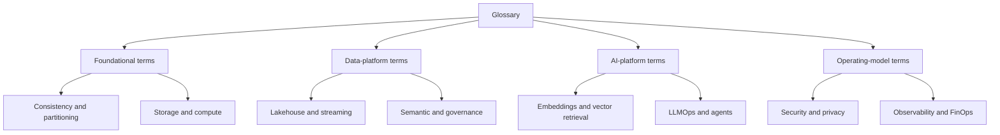
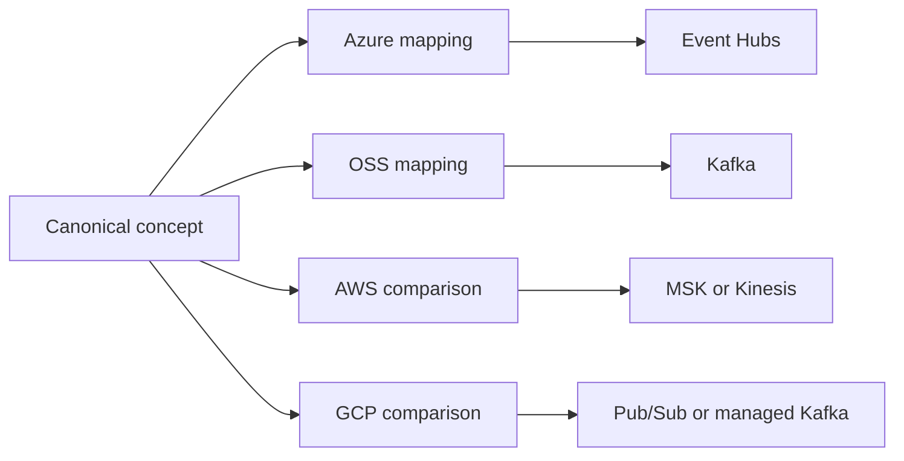
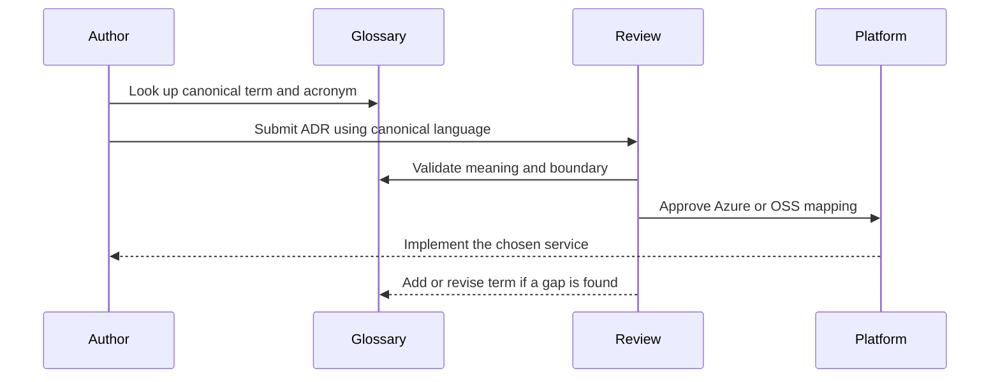

# Glossary

> Part of the **Enterprise Data & AI Architecture Handbook** - Resources / References, Chapter 01.
> A canonical, vendor-aware glossary for the language of enterprise data, cloud, platform, ML, and agentic AI architecture.

---

## Executive Summary

Architecture quality is constrained by language quality. When teams use the same word to mean different things, or different words to mean the same thing, design reviews slow down, migrations get mis-scoped, incident response becomes ambiguous, and expensive platform choices get justified by vocabulary rather than requirements. A glossary is therefore not editorial polish. It is a **control plane for language**.

This chapter defines the recurring terms of the handbook in a **concept-first, vendor-second** way. Each entry answers five questions: what the term means, what acronym it expands to, what it is commonly confused with, which Azure or open-source implementation usually carries the concept in practice, and where the deeper chapter lives in the handbook. The glossary spans data engineering, distributed systems, cloud architecture, security, governance, MLOps, LLMOps, RAG, and agentic AI.

The most important operating principle is simple: **a product name is not a concept**. `Kafka` is not the definition of a replayable log, `Unity Catalog` is not the definition of governance, and `RAG` is not a synonym for any chatbot. The glossary exists to keep the concept stable even when the vendor, tool, or fashion changes.

---

## Learning Objectives

After working through this chapter you should be able to:

- Decode the recurring vocabulary of the handbook without relying on vendor marketing language.
- Expand and correctly use the most common acronyms across data, cloud, security, ML, and AI architecture.
- Distinguish commonly conflated terms such as `lakehouse` vs `data mesh`, `RAG` vs `fine-tuning`, and `exactly-once` vs `idempotent at-least-once`.
- Translate a concept into its usual Azure implementation and its closest OSS, AWS, and GCP comparison points.
- Use canonical terminology in architecture reviews, ADRs, runbooks, interview answers, and migration plans.
- Identify where an imprecise term is hiding an unmade decision.

---

## Business Motivation

Terminology failure is a quiet but expensive class of architectural failure.

- A team says it needs `real-time`, but actually means `within 15 minutes`; the result is an always-on streaming stack for a dashboard that could have been a scheduled batch job.
- An architect says `exactly-once`, and a delivery team hears `duplicates are impossible`; duplicate financial side effects appear because the business operation was never made idempotent.
- Leadership adopts `data mesh` as a slogan, but funds neither a self-serve platform nor computational governance; the organization gets a distributed data swamp with better branding.
- A migration workstream treats `feature store`, `semantic layer`, and `vector database` as interchangeable because all three are `shared metadata-driven serving layers`; the wrong persistence and access pattern is selected.

A canonical glossary lowers onboarding time, reduces review friction, improves architecture and interview quality, and makes cross-cloud comparison honest. In practice it does the same job for language that a platform golden path does for infrastructure: it makes the correct choice easier than the ambiguous one.

---

## History and Evolution

Enterprise-architecture vocabulary accumulated in layers rather than arriving as one coherent system.

- **Database era.** Terms such as `OLTP`, `OLAP`, `star schema`, and `ACID` came from relational and warehouse practice, formalized in the 1980s through early 2000s.
- **Distributed-systems era.** Terms such as `CAP`, `partition tolerance`, `eventual consistency`, `replication`, and `idempotency` entered mainstream architecture vocabulary as internet-scale systems became normal.
- **Cloud era.** `IaC`, `landing zone`, `private endpoint`, `zero trust`, `autoscaling`, and `FinOps` emerged as infrastructure became programmable and spend became elastic rather than fixed.
- **Lakehouse and modern-data-platform era.** `bronze`, `silver`, `gold`, `table format`, `semantic layer`, `data contract`, `data product`, and `governed self-service` became the working language of analytics platforms.
- **ML and LLM era.** `feature store`, `MLOps`, `model registry`, `embedding`, `RAG`, `LLMOps`, `guardrails`, `agent`, and `MCP` appeared as the AI stack differentiated from but remained dependent on the data platform.

Because the vocabulary is layered, not designed top-down, many terms overlap or conflict. That is why a glossary must define both the term and the boundary where it stops being the right term.

---

## Why This Technology Exists

This glossary exists because architecture is a social activity executed through documents, diagrams, code, and review conversations. All four break when language is unstable.

The glossary gives the organization:

- A **canonical concept name** for each recurring idea.
- A safe place for **aliases and acronym expansions**.
- A stable **concept-to-product mapping** that survives vendor change.
- A way to separate **real disagreements about design** from fake disagreements caused by overloaded words.
- A reusable reference for design docs, ADRs, runbooks, interview prep, and migration work.

Without this, every team recreates a private glossary inside its own slide deck or codebase, and the platform slowly fragments at the language layer before it fragments at the technical layer.

---

## Problems It Solves

- **Onboarding ambiguity.** New engineers can look up `SLO`, `RAG`, `CDC`, or `semantic layer` once instead of reverse-engineering usage from code and tribal knowledge.
- **Review friction.** Architecture reviews can challenge the decision itself instead of first debating what each word means.
- **Cross-cloud translation.** Concept-first definitions make it clear when a vendor product is a true equivalent, a partial equivalent, or a misleading near-match.
- **Migration clarity.** Teams can map `replayable log`, `governed catalog`, or `feature store` as concepts instead of trying to clone one provider's product names in another provider.
- **Incident diagnosis.** Runbooks and postmortems can name the failing thing precisely: `checkpoint`, `replication lag`, `private endpoint`, `guardrail`, `prompt injection`, `token budget`.
- **Interview and leadership leverage.** Precise language is a visible proxy for mature architectural judgment.

---

## Problems It Cannot Solve

- It cannot replace an ADR, design doc, or review. The glossary tells you what a term means, not whether the design is wise.
- It cannot remove genuine trade-offs. `Batch` and `streaming` still differ even when both are defined correctly.
- It cannot keep itself current automatically. New services, deprecations, and changing platform boundaries require review.
- It cannot fix organizational incentives that reward buzzword adoption over disciplined implementation.
- It cannot rescue a migration that copies products without understanding the underlying concept.

The glossary is therefore a supporting system. It is necessary for clarity, but insufficient for governance on its own.

---

## Core Concepts

### 1.1 How to read the entries

Each glossary entry follows the same pattern:

- **Term**: the preferred canonical name.
- **Precise definition**: one sentence, written concept-first.
- **Acronym / expansion**: the long form where relevant.
- **Azure / OSS / AWS / GCP**: the most common implementation or comparison anchor, not a claim of perfect equivalence.
- **See also**: the deepest handbook chapter for the concept.

When a product name appears in the mapping column, read it as `this is where the concept most often shows up`, not `this product defines the concept`.

### 1.2 A-C

| Term | Precise definition | Acronym / expansion | Azure / OSS / AWS / GCP | See also |
|---|---|---|---|---|
| ACID | Transaction guarantees that keep a state change atomic, isolated, and durable across failure. | Atomicity, Consistency, Isolation, Durability | Delta Lake on ADLS / PostgreSQL / Aurora / Spanner | [Delta Lake](../../Phase-04/04_Delta_Lake.md) |
| ADR | A short decision record capturing context, decision, consequences, and alternatives for a consequential architecture choice. | Architecture Decision Record | Azure Repos or GitHub markdown / adr-tools / same / same | [Architecture Decision Records](../../Phase-01/03_Architecture_Decision_Records.md) |
| Agent | A model-driven component that can choose or sequence actions through tools, memory, or delegated calls rather than only returning one response. | n/a | Azure AI Foundry Agent Service / LangGraph / Bedrock Agents / Vertex AI Agent Builder | [Agentic AI Architecture](../../Phase-12/05_Agentic_AI_Architecture.md) |
| API | A contract by which one system exposes capabilities or data to another over a defined interface. | Application Programming Interface | API Management / FastAPI or gRPC / API Gateway / Apigee | [API Design REST GraphQL gRPC](../../Phase-14/05_API_Design_REST_GraphQL_gRPC.md) |
| Batch | A processing style in which work is accumulated and executed in discrete runs rather than continuously as events arrive. | n/a | Databricks Jobs / Spark or dbt / Glue or EMR / Dataproc or BigQuery scheduled queries | [Batch Pipeline Design](../../Phase-05/09_Batch_Pipeline_Design.md) |
| Bronze | The raw landing layer in a medallion architecture, optimized for fidelity and replay rather than business usability. | n/a | Delta Bronze tables / Delta or Iceberg raw zone / S3 raw zone / GCS raw zone | [Medallion Architecture](../../Phase-05/03_Medallion_Architecture.md) |
| CAP | A distributed-system framing that says under partition, a system cannot simultaneously provide full consistency and full availability. | Consistency, Availability, Partition Tolerance | Cosmos DB consistency choices / Cassandra / DynamoDB / Spanner or Bigtable depending on mode | [CAP and PACELC](../../Phase-02/04_CAP_and_PACELC.md) |
| CDC | The capture of source-system changes as inserts, updates, and deletes rather than repeated full extracts. | Change Data Capture | Fabric or Databricks Auto Loader plus logs / Debezium / DMS / Datastream | [Batch Pipeline Design](../../Phase-05/09_Batch_Pipeline_Design.md) |
| CI/CD | Automated build, test, packaging, and deployment workflows for code, data, or infrastructure changes. | Continuous Integration / Continuous Delivery or Deployment | GitHub Actions or Azure DevOps / GitHub Actions / CodePipeline / Cloud Build | [DevOps and CI CD](../../Phase-09/03_DevOps_and_CI_CD.md) |
| CQRS | Separation of write and read models so command-side invariants and query-side optimization can evolve independently. | Command Query Responsibility Segregation | Cosmos DB plus projections / Kafka plus read models / DynamoDB plus projections / Bigtable plus projections | [CQRS](../../Phase-14/03_CQRS.md) |

### 1.3 D-H

| Term | Precise definition | Acronym / expansion | Azure / OSS / AWS / GCP | See also |
|---|---|---|---|---|
| Data contract | A versioned agreement about a data product's schema, semantics, quality expectations, and change policy. | n/a | Purview plus CI checks / OpenMetadata plus tests / Glue Data Catalog plus checks / Dataplex plus checks | [Data Contracts](../../Phase-08/07_Data_Contracts.md) |
| Data lake | Low-cost durable storage for raw or semi-structured data, usually with decoupled compute and weak native semantics until layered with more structure. | n/a | ADLS Gen2 / MinIO / S3 / GCS | [Object Storage and Data Lakes](../../Phase-04/03_Object_Storage_and_Data_Lakes.md) |
| Data lakehouse | An object-store-based data platform that adds ACID tables, governance, and warehouse-like semantics to lake storage. | n/a | Azure Databricks plus Delta / Delta or Iceberg / Lake Formation plus Iceberg / BigQuery plus object-store extensions | [Lakehouse Architecture](../../Phase-05/02_Lakehouse_Architecture.md) |
| Data mesh | An operating model that decentralizes domain ownership while requiring a funded self-serve platform and federated computational governance. | n/a | Azure plus Databricks platform pattern / open platform plus policy stack / AWS platform pattern / GCP platform pattern | [Data Mesh Principles](../../Phase-15/01_Data_Mesh_Principles.md) |
| Data product | A discoverable, owned, quality-scoped data artifact with explicit consumers, SLA, contract, and lifecycle. | n/a | Purview plus Databricks SQL asset / OpenMetadata plus warehouse object / DataZone asset / Dataplex asset | [Data Products](../../Phase-15/02_Data_Products.md) |
| Data Vault 2.0 | A modeling style centered on hubs, links, and satellites for auditable integration of changing enterprise data. | n/a | Databricks or Fabric implementation / same / Redshift or EMR implementation / BigQuery implementation | [Data Vault 2.0](../../Phase-06/02_Data_Vault_2_0.md) |
| Delta Lake | An open table format that adds ACID transactions, schema enforcement, and time travel to object storage. | n/a | Delta on ADLS / Delta OSS / Delta on S3 / Delta on GCS | [Delta Lake](../../Phase-04/04_Delta_Lake.md) |
| Dimensional modeling | A business-facing analytics modeling approach built around facts, dimensions, grain, and star schemas. | n/a | Power BI plus lakehouse marts / any warehouse / Redshift model / BigQuery model | [Dimensional Modeling](../../Phase-06/01_Dimensional_Modeling.md) |
| Domain-driven design | A design approach that models software and boundaries around domain language, bounded contexts, and business meaning. | DDD | n/a / same / same / same | [Domain Driven Design](../../Phase-01/05_Domain_Driven_Design.md) |
| ELT | Loading data first into the platform, then transforming it in-place with the platform's compute engine. | Extract, Load, Transform | Databricks or Fabric SQL / dbt / Athena or Redshift SQL / BigQuery SQL | [dbt and Analytics Engineering](../../Phase-05/08_dbt_and_Analytics_Engineering.md) |
| Embedding | A vector representation of text, image, or another object such that geometric distance approximates semantic similarity. | n/a | Azure OpenAI embeddings / sentence-transformers / Titan embeddings / Vertex embeddings | [Embeddings and Semantic Search](../../Phase-13/03_Embeddings_and_Semantic_Search.md) |
| ETL | Transforming data before or during load into the target platform rather than after landing it. | Extract, Transform, Load | ADF data flow / Spark or Informatica / Glue ETL / Dataflow | [Modern Data Stack Overview](../../Phase-05/01_Modern_Data_Stack_Overview.md) |
| Event sourcing | Persisting state as an append-only history of domain events from which current state can be rebuilt. | n/a | Event Hubs or Service Bus plus store / Kafka plus event store / Kinesis or MSK / Pub/Sub plus event store | [Event Sourcing](../../Phase-14/04_Event_Sourcing.md) |
| Feature store | A system that standardizes feature definitions, train-serve consistency, and online or offline retrieval for ML features. | n/a | Databricks Feature Store / Feast / SageMaker Feature Store / Vertex Feature Store | [Feature Stores with Feast](../../Phase-11/02_Feature_Stores_with_Feast.md) |
| FinOps | The cross-functional operating model that makes cloud and platform spend visible, accountable, and optimized through unit economics. | Financial Operations | Azure Cost Management / OpenCost and warehouse tables / CUR plus Cost Explorer / Billing export plus BigQuery | [FinOps and Cost Optimization](../../Phase-18/01_FinOps_and_Cost_Optimization.md) |
| Flink | A stateful stream-processing engine optimized for event time, keyed state, and continuous computation. | Apache Flink | managed or self-hosted on Azure / Flink / Managed Service for Apache Flink / Dataflow alternative rather than direct equivalent | [Streaming Fundamentals](../../Phase-07/01_Streaming_Fundamentals.md) |
| Gold | The curated business-serving layer in medallion architecture, optimized for consumption, trust, and reuse. | n/a | Databricks SQL or Fabric marts / any warehouse mart / Redshift marts / BigQuery marts | [Medallion Architecture](../../Phase-05/03_Medallion_Architecture.md) |
| Governance | The combination of policy, ownership, controls, and enforcement that determines who may do what with data, models, or infrastructure. | n/a | Purview plus Unity Catalog plus Policy / OPA plus catalog / Lake Formation plus IAM / Dataplex plus IAM | [Data Governance Foundations](../../Phase-08/01_Data_Governance_Foundations.md) |
| GraphRAG | A retrieval architecture that combines vector retrieval with graph structure or graph-derived summaries for multi-hop reasoning. | n/a | Azure OpenAI plus AI Search plus graph store / graphrag plus Neo4j or Cosmos Gremlin / Bedrock plus Neptune pattern / Vertex plus graph pattern | [GraphRAG](../../Phase-13/04_GraphRAG.md) |
| HNSW | A graph-based approximate nearest-neighbor index structure used for high-recall vector search at practical latency. | Hierarchical Navigable Small World | Azure AI Search vector index / Qdrant or Milvus / OpenSearch vector engine / Vertex or Matching Engine equivalent | [Vector Databases Qdrant and Milvus](../../Phase-13/01_Vector_Databases_Qdrant_and_Milvus.md) |
| Hudi | An open table format optimized for incremental ingestion, change capture, and mutable record handling on object storage. | Apache Hudi | Hudi on ADLS / Hudi OSS / Hudi on S3 / Hudi on GCS | [Apache Hudi](../../Phase-04/06_Apache_Hudi.md) |

### 1.4 I-P

| Term | Precise definition | Acronym / expansion | Azure / OSS / AWS / GCP | See also |
|---|---|---|---|---|
| IAM | The discipline of authentication, authorization, identity lifecycle, and access-policy enforcement. | Identity and Access Management | Entra ID / Keycloak or Dex / IAM and Identity Center / Cloud IAM | [Identity and Access Management with Entra](../../Phase-10/02_Identity_and_Access_Management_with_Entra.md) |
| IaC | Defining infrastructure declaratively in version-controlled code rather than building it manually through portals. | Infrastructure as Code | Bicep or Terraform / Terraform or Pulumi / CloudFormation or Terraform / Terraform or Deployment Manager alternatives | [Infrastructure as Code with Terraform](../../Phase-09/04_Infrastructure_as_Code_with_Terraform.md) |
| Iceberg | An open table format emphasizing snapshot metadata, engine interoperability, and large-scale table management. | Apache Iceberg | Iceberg on ADLS / Iceberg OSS / Iceberg on S3 / Iceberg on GCS | [Apache Iceberg](../../Phase-04/05_Apache_Iceberg.md) |
| Idempotency | The property that repeating the same operation produces the same business state as applying it once. | n/a | Service Bus plus dedupe or sink logic / Kafka consumer logic / SQS plus sink logic / Pub/Sub plus sink logic | [Message Brokers and Queues](../../Phase-14/07_Message_Brokers_and_Queues.md) |
| Kappa architecture | A streaming-first architecture in which the durable event log is the primary processing source for both current and reprocessed history. | n/a | Event Hubs plus Structured Streaming / Kafka plus Flink / MSK or Kinesis variant / Pub/Sub plus Dataflow variant | [Streaming Fundamentals](../../Phase-07/01_Streaming_Fundamentals.md) |
| Kafka | A distributed replayable log used for event transport, durable retention, and asynchronous decoupling. | Apache Kafka | Event Hubs Kafka endpoint or HDInsight or AKS / Kafka or Redpanda / MSK / Managed Kafka or Pub/Sub comparison | [Apache Kafka](../../Phase-07/02_Apache_Kafka.md) |
| Kubernetes | A container orchestration platform for scheduling, networking, scaling, and operating distributed workloads. | n/a | AKS / Kubernetes / EKS / GKE | [Kubernetes](../../Phase-09/06_Kubernetes.md) |
| Lakehouse | The shortened working term for a data lakehouse: open storage with warehouse-like reliability and governance. | n/a | Azure Databricks or Fabric OneLake plus Delta / Delta or Iceberg stack / S3 plus Iceberg stack / BigQuery plus lakehouse pattern | [Lakehouse Architecture](../../Phase-05/02_Lakehouse_Architecture.md) |
| Lambda architecture | A dual-path architecture with separate batch and speed layers that must later be reconciled. | n/a | no preferred modern default / Spark plus Kafka legacy pattern / Kinesis plus batch path / Pub/Sub plus batch path | [Streaming Patterns and Delivery Semantics](../../Phase-07/08_Streaming_Patterns_and_Delivery_Semantics.md) |
| Lineage | The trace of where data, model inputs, or derived artifacts came from and how they were transformed. | n/a | Purview lineage / OpenLineage or Marquez / Glue or DataZone lineage / Dataplex lineage | [Data Catalog and Lineage](../../Phase-08/02_Data_Catalog_and_Lineage.md) |
| LLM | A generative model trained on large token corpora to predict and generate sequences, usually text, but often multimodal. | Large Language Model | Azure OpenAI / open-weight models / Bedrock hosted models / Vertex Gemini models | [Large Language Model Foundations](../../Phase-12/01_Large_Language_Model_Foundations.md) |
| LLMOps | The operating discipline for versioning, evaluating, deploying, observing, and governing LLM-based systems. | Large Language Model Operations | Azure AI Foundry plus Azure OpenAI / LangSmith plus OSS stack / Bedrock plus guardrail stack / Vertex AI plus eval stack | [LLMOps](../../Phase-12/04_LLMOps.md) |
| Medallion architecture | A layered refinement pattern that moves data from raw to conformed to business-serving zones with explicit trust boundaries. | n/a | Bronze Silver Gold on Delta / same on open formats / same pattern / same pattern | [Medallion Architecture](../../Phase-05/03_Medallion_Architecture.md) |
| Metadata | Data about data, models, systems, or terms: schema, ownership, lineage, classification, freshness, and more. | n/a | Purview and Unity Catalog / OpenMetadata or DataHub / Glue or DataZone / Dataplex | [Metadata Management OpenMetadata and Atlas](../../Phase-08/04_Metadata_Management_OpenMetadata_and_Atlas.md) |
| MLOps | The operating discipline for reproducible training, evaluation, registry, deployment, monitoring, and retraining of ML systems. | Machine Learning Operations | Azure ML and MLflow / MLflow and Kubeflow / SageMaker / Vertex AI | [MLOps and MLflow](../../Phase-11/03_MLOps_and_MLflow.md) |
| Observability | The ability to infer system behavior from telemetry so unknown failures can be diagnosed rather than only known thresholds monitored. | n/a | Azure Monitor and App Insights / OpenTelemetry plus Grafana stack / CloudWatch plus X-Ray / Cloud Monitoring plus Cloud Trace | [Observability with OpenTelemetry](../../Phase-18/02_Observability_with_OpenTelemetry.md) |
| OpenTelemetry | An open standard for telemetry generation and transport across traces, metrics, logs, and related context. | n/a | Azure Monitor OTel distro / OTel Collector and SDKs / ADOT / OTel on GCP | [Observability with OpenTelemetry](../../Phase-18/02_Observability_with_OpenTelemetry.md) |
| PACELC | A framing that extends CAP by saying that else, outside partitions, a system still trades latency against consistency. | Partition, Availability, Consistency, Else Latency, Consistency | Cosmos DB trade-offs / Cassandra or Yugabyte / DynamoDB / Spanner | [CAP and PACELC](../../Phase-02/04_CAP_and_PACELC.md) |
| Parquet | A columnar file format optimized for analytics scanning, compression, and predicate pushdown. | Apache Parquet | Parquet on ADLS / Parquet / Parquet on S3 / Parquet on GCS | [File Formats](../../Phase-04/01_File_Formats.md) |
| Partitioning | Splitting data or traffic into independent units so scale, locality, and fault isolation improve. | n/a | Cosmos DB partition key or Delta partitions / Kafka partitions or table partitions / DynamoDB partition key / Bigtable or BigQuery partitioning | [Partitioning and Sharding](../../Phase-02/03_Partitioning_and_Sharding.md) |
| PII | Information that identifies or can reasonably re-identify a person. | Personally Identifiable Information | Purview sensitivity labels / Presidio and policy / Macie / DLP and Sensitive Data Protection | [Data Privacy and PII Protection](../../Phase-10/07_Data_Privacy_and_PII_Protection.md) |
| Private Link | Private network exposure of a managed service endpoint into a virtual network rather than the public internet. | n/a | Azure Private Link / private load balancers and endpoints pattern / PrivateLink / Private Service Connect | [Network Security and Zero Trust](../../Phase-10/04_Network_Security_and_Zero_Trust.md) |

### 1.5 R-Z

| Term | Precise definition | Acronym / expansion | Azure / OSS / AWS / GCP | See also |
|---|---|---|---|---|
| RAG | Retrieval-augmented generation: retrieval of external context before generation so responses can be grounded in enterprise knowledge. | Retrieval-Augmented Generation | Azure AI Search plus Azure OpenAI / Qdrant or Milvus plus model / Bedrock Knowledge Bases or OpenSearch pattern / Vertex AI Search pattern | [Retrieval Augmented Generation](../../Phase-12/03_Retrieval_Augmented_Generation.md) |
| RBAC | Authorization based on assigned roles rather than arbitrary per-request rules. | Role-Based Access Control | Entra role assignments / Keycloak roles / IAM roles / IAM roles | [Identity and Access Management with Entra](../../Phase-10/02_Identity_and_Access_Management_with_Entra.md) |
| Semantic layer | A governed business abstraction over raw tables that standardizes dimensions, metrics, and business meaning. | n/a | Power BI semantic model or dbt Semantic Layer / Cube or MetricFlow / QuickSight semantic model pattern / LookML or semantic model | [Semantic Layer and Metrics](../../Phase-06/06_Semantic_Layer_and_Metrics.md) |
| Silver | The conformed refinement layer where data has been cleansed, deduplicated, typed, and made reusable. | n/a | Delta Silver tables / same / same / same | [Medallion Architecture](../../Phase-05/03_Medallion_Architecture.md) |
| SLA | A contractual external commitment about service behavior, usually availability, latency, or support response. | Service Level Agreement | n/a / n/a / n/a / n/a | [Reliability and SRE](../../Phase-18/04_Reliability_and_SRE.md) |
| SLI | The measured indicator used to quantify some aspect of service behavior such as latency or freshness. | Service Level Indicator | Azure Monitor or Databricks metrics / Prometheus metric / CloudWatch metric / Cloud Monitoring metric | [Monitoring with Prometheus and Grafana](../../Phase-18/03_Monitoring_with_Prometheus_and_Grafana.md) |
| SLO | The internal target value for one or more SLIs that sets the expected reliability bar. | Service Level Objective | Azure Monitor SLO implementation pattern / Sloth or Pyrra / CloudWatch SLO pattern / native Cloud Monitoring SLOs | [Reliability and SRE](../../Phase-18/04_Reliability_and_SRE.md) |
| Spark | A distributed compute engine for batch and structured streaming data processing. | Apache Spark | Azure Databricks or Synapse Spark / Spark / EMR or Glue / Dataproc | [Apache Spark Internals](../../Phase-05/04_Apache_Spark_Internals.md) |
| Star schema | A dimensional model centered on a fact table connected to conformed dimensions. | n/a | Power BI or SQL warehouse model / any warehouse / Redshift model / BigQuery model | [Dimensional Modeling](../../Phase-06/01_Dimensional_Modeling.md) |
| Streaming | Continuous or near-continuous processing of event arrival rather than accumulation into scheduled batches. | n/a | Event Hubs plus Structured Streaming / Kafka plus Flink / MSK or Kinesis / Pub/Sub plus Dataflow | [Streaming Fundamentals](../../Phase-07/01_Streaming_Fundamentals.md) |
| Table format | The metadata and transaction layer that gives object-store files ACID semantics, snapshots, and schema evolution. | n/a | Delta or Iceberg / Delta, Iceberg, Hudi / Iceberg or Hudi / Iceberg or Delta | [Table Format Comparison](../../Phase-04/07_Table_Format_Comparison.md) |
| Terraform | A declarative IaC tool that provisions cloud resources through providers and maintains dependency graphs in state. | n/a | Terraform for AzureRM / Terraform / Terraform / Terraform | [Infrastructure as Code with Terraform](../../Phase-09/04_Infrastructure_as_Code_with_Terraform.md) |
| Time travel | Querying a prior table snapshot or version as of an earlier point in time. | n/a | Delta or Iceberg table versions / same / same / same | [Delta Lake](../../Phase-04/04_Delta_Lake.md) |
| Unity Catalog | Databricks' catalog, access-control, lineage, and governance system for data and AI assets. | n/a | Azure Databricks Unity Catalog / Apache Polaris or Nessie plus OPA partial comparison / Lake Formation partial comparison / Dataplex plus BigQuery policy partial comparison | [Databricks Platform](../../Phase-05/05_Databricks_Platform.md) |
| Vector database | A system optimized for nearest-neighbor retrieval over embeddings, usually with ANN indexes and metadata filtering. | n/a | Azure AI Search or Cosmos DB vector support / Qdrant, Milvus, pgvector / OpenSearch vector or Aurora pgvector / Matching Engine or pgvector | [Vector Databases Qdrant and Milvus](../../Phase-13/01_Vector_Databases_Qdrant_and_Milvus.md) |
| Watermark | A streaming notion of event-time progress used to decide when late data is still accepted into a window. | n/a | Structured Streaming watermark / Flink watermark / Kinesis windowing analogue / Dataflow watermark | [Streaming Fundamentals](../../Phase-07/01_Streaming_Fundamentals.md) |
| Zero Trust | A security model that assumes breach and requires explicit verification and least privilege rather than implicit network trust. | n/a | Entra plus Private Link plus Policy / SPIFFE plus OPA style stack / IAM plus PrivateLink pattern / IAM plus PSC pattern | [Network Security and Zero Trust](../../Phase-10/04_Network_Security_and_Zero_Trust.md) |
| Z-order | A data-layout optimization that clusters related values to improve data skipping for multidimensional queries. | n/a | Delta Lake OPTIMIZE ZORDER / n/a direct in OSS Delta / n/a / n/a | [Delta Lake](../../Phase-04/04_Delta_Lake.md) |

---

## Internal Working

### 2.1 Canonical-term model

The glossary works as a small metadata system, not a word list. Each entry should have:

- one **canonical term**;
- any **aliases or deprecated synonyms**;
- a **short precise definition**;
- a **scope boundary** stating what the term does not mean;
- one or more **platform mappings**;
- a **chapter anchor** for deeper treatment.

This mirrors the broader handbook pattern that definitions are versioned assets, not free text. It is the terminology equivalent of a [data contract](../../Phase-08/07_Data_Contracts.md): clear owner, explicit change, visible consumers.

### 2.2 Acronym and alias resolution

Acronyms are efficient only after expansion has happened once. In load-bearing documents, use this rule:

1. First mention expands the acronym.
2. Subsequent mentions may use the short form.
3. If an acronym has multiple common expansions, qualify it in context.

Examples:

- `SLA` and `SLO` are related but not interchangeable.
- `IAM` is a discipline, while `Entra ID` is a product.
- `RAG` is an architecture pattern, not a model family.
- `MCP` is a standard for exposing tools, resources, and prompts, not a security layer.

### 2.3 Concept-first, vendor-second mapping

Vendor mappings should always start from the concept. The sequence is:

`concept -> required properties -> preferred platform product -> alternatives -> known gaps`

This is why the glossary treats `replayable log` as primary and `Kafka`, `Event Hubs`, `MSK`, or `Pub/Sub` as mappings rather than definitions. The moment a migration is done product-first, architecture quality usually collapses into superficial name matching.

---

## Architecture

The glossary itself has a useful architecture. It is a five-layer terminology system:

- **Foundational concepts**: storage, compute, networking, consistency, partitioning, and security primitives.
- **Platform concepts**: lakehouse, streaming, orchestration, observability, governance, and FinOps.
- **AI concepts**: feature store, embeddings, vector retrieval, RAG, evaluation, agents, guardrails.
- **Operating-model concepts**: data product, mesh, self-serve platform, ADR, SLO, error budget.
- **Vendor mappings**: Azure-first implementations plus OSS, AWS, and GCP comparisons.

The architectural rule is that definitions move from left to right, never the reverse. A product may instantiate a concept. A product may not redefine the concept.

---

## Components

| Component | What it does | Typical entries |
|---|---|---|
| Core distributed-systems vocabulary | Names the physics and mechanics of distributed state and delivery | CAP, PACELC, partitioning, idempotency, replication, watermark |
| Data-platform vocabulary | Names the storage, transformation, and serving layers of analytics systems | lakehouse, medallion, semantic layer, table format, CDC |
| Cloud-platform vocabulary | Names programmable infrastructure and managed-service boundaries | IaC, private endpoint, autoscaling, landing zone, policy |
| Security and governance vocabulary | Names access, classification, retention, and trust mechanisms | IAM, RBAC, Zero Trust, PII, data contract, lineage |
| ML and AI vocabulary | Names feature, model, retrieval, and orchestration systems | MLOps, feature store, embedding, vector DB, RAG, agent |
| Operating-discipline vocabulary | Names how systems are run, measured, and paid for | SLI, SLO, FinOps, observability, error budget |

The glossary is strongest when each component remains conceptually clean. Mixed layers such as `real-time AI data mesh platform` almost always signal that multiple decisions have been compressed into one imprecise phrase.

---

## Metadata

Each glossary entry should be maintained like a metadata record.

| Field | Why it matters |
|---|---|
| Canonical term | Prevents drift into multiple preferred names for one idea. |
| Aliases | Preserves searchability and migration from old terminology. |
| Definition | Holds the precise meaning in one sentence. |
| Category | Places the term in storage, compute, security, AI, governance, and so on. |
| Common confusion | Captures the highest-value anti-mistake for the term. |
| Platform mapping | Separates the concept from vendor products. |
| Owner | Creates accountability for changes. |
| Last reviewed | Prevents stale vocabulary from persisting indefinitely. |
| Review trigger | Identifies when service retirement, policy change, or platform change should force an update. |

Example entry record:

```yaml
term: RAG
canonical_definition: Retrieval-augmented generation; retrieval of external context before generation so the model can answer from grounded enterprise knowledge.
aliases:
  - retrieval QA
category: AI platform
common_confusions:
  - fine-tuning
  - enterprise search
azure_default: Azure AI Search plus Azure OpenAI
oss_default: Qdrant or Milvus plus vLLM
aws_comparison: Bedrock Knowledge Bases or OpenSearch vector pattern
gcp_comparison: Vertex AI Search plus Gemini pattern
see_also:
  - ../../Phase-12/03_Retrieval_Augmented_Generation.md
owner: enterprise data and AI architecture team
review_trigger:
  - control-plane change
  - major service retirement
  - evaluation-policy change
```

---

## Storage

Storage vocabulary is where many platform conversations go wrong because raw persistence, transactional semantics, and serving shape are often conflated.

- **Data lake** means cheap durable storage, usually object storage, with weak native semantics by default.
- **Lakehouse** means that same storage plus an ACID table format and governance layer.
- **Warehouse** means a strongly managed analytics-serving system, often with tighter compute-storage coupling and stronger serving ergonomics.
- **Table format** means the metadata and transaction layer such as Delta, Iceberg, or Hudi, not the files alone.
- **Time travel** means historical table snapshots, not backup strategy.
- **Compaction** means rewriting small files into fewer large files, not changing business grain.
- **Partitioning** reduces scan scope or isolates load; **clustering** improves locality within partitions.
- **COG** and **GeoParquet** are domain-specific storage terms for geospatial workloads, not general-purpose replacements for Parquet.

Use this cluster with [File Formats](../../Phase-04/01_File_Formats.md), [Delta Lake](../../Phase-04/04_Delta_Lake.md), [Apache Iceberg](../../Phase-04/05_Apache_Iceberg.md), and [Table Format Comparison](../../Phase-04/07_Table_Format_Comparison.md).

---

## Compute

Compute terms determine whether a workload is understood as episodic, continuous, interactive, or autonomous.

- **Batch compute** runs in jobs and normally should scale to zero.
- **Streaming compute** is long-running and pays for standing capacity.
- **Serving compute** exists to respond to live requests under latency SLOs.
- **Serverless** means the consumer does not manage capacity directly, not that cost is zero or scaling is infinite.
- **GPU** is a hardware accelerator choice, not a model strategy.
- **Scheduler** or **orchestrator** coordinates steps; it is not the same thing as the engines that perform the steps.
- **Autoscaling** manages elasticity; it does not remove the need for workload rightsizing.

This vocabulary anchors [Apache Spark Internals](../../Phase-05/04_Apache_Spark_Internals.md), [Kubernetes](../../Phase-09/06_Kubernetes.md), and [Performance Engineering](../../Phase-18/05_Performance_Engineering.md).

---

## Networking

Networking terms matter because the most expensive security mistakes often hide behind fuzzy boundary language.

- **VNet** is the private address space boundary on Azure, not a security model by itself.
- **Private endpoint / Private Link** means a managed service is privately exposed into a network path.
- **Ingress** is traffic entering the system boundary; **egress** is traffic leaving it.
- **NAT** governs address translation for outbound traffic, not application-layer authorization.
- **Service mesh** is an in-cluster traffic-policy and observability layer, not a replacement for identity or governance.
- **CDN** is an edge-distribution optimization, not a general low-latency data architecture.

Precise networking vocabulary becomes critical in [Azure Networking](../../Phase-03/04_Azure_Networking.md) and [Network Security and Zero Trust](../../Phase-10/04_Network_Security_and_Zero_Trust.md).

---

## Security

Security language needs particularly sharp boundaries because many terms sound stronger than they are.

- **Authentication** proves identity; **authorization** decides access.
- **RBAC** is role-based authorization; **ABAC** adds contextual policy conditions.
- **Encryption at rest** protects stored bytes; **encryption in transit** protects data on the wire.
- **CMK** and **BYOK** describe who controls encryption keys and where they originate.
- **Tokenization** or **pseudonymization** preserves reversibility; **anonymization** aims to remove it.
- **Secret** and **key** are not synonyms. A secret may be a password or token; a key is cryptographic material.
- **Zero Trust** does not mean `no private networking`; it means private networking is insufficient without identity and least privilege.

For deeper treatment, pair this glossary cluster with [Identity and Access Management with Entra](../../Phase-10/02_Identity_and_Access_Management_with_Entra.md), [Data Security and Encryption](../../Phase-10/03_Data_Security_and_Encryption.md), [Secrets and Key Management](../../Phase-10/05_Secrets_and_Key_Management.md), and [Data Privacy and PII Protection](../../Phase-10/07_Data_Privacy_and_PII_Protection.md).

---

## Performance

Performance terms are measurement terms, not feelings.

- **Latency** is time per request or operation.
- **Throughput** is work completed per unit time.
- **p95 / p99** are percentile measures of tail behavior, which usually matter more than averages.
- **Backpressure** is the mechanism by which slower downstream components limit upstream flow.
- **Skew** means work or data distribution is imbalanced across partitions or tasks.
- **Cache hit rate** is a reuse metric; a high hit rate can hide staleness or correctness problems if the cache boundary is wrong.
- **Recall@k** and **MRR** are retrieval metrics, not generative quality metrics.

This vocabulary is grounded in [Performance Engineering](../../Phase-18/05_Performance_Engineering.md) and [Embeddings and Semantic Search](../../Phase-13/03_Embeddings_and_Semantic_Search.md).

---

## Scalability

Scalability vocabulary names the shape of growth and where a system bends first.

- **Scale up** adds capacity to one node; **scale out** adds nodes or partitions.
- **Elasticity** means capacity can change with demand; it does not imply low cost or good tuning.
- **Sharding** is partitioning with operational independence; the shard key is therefore a business decision, not only a technical one.
- **Hotspot** means a partition key or downstream dependency concentrates disproportionate load.
- **Statelessness** improves horizontal scale, but only if the state boundary is actually externalized.
- **Decoupling** improves scalability only when the downstream system and its contracts can absorb the delayed work.

See [Partitioning and Sharding](../../Phase-02/03_Partitioning_and_Sharding.md), [Streaming Patterns and Delivery Semantics](../../Phase-07/08_Streaming_Patterns_and_Delivery_Semantics.md), and [Self Serve Data Platform](../../Phase-15/05_Self_Serve_Data_Platform.md).

---

## Fault Tolerance

Fault-tolerance terms should always be read as `what failure is absorbed, how, and at what cost`.

- **Retry** is re-attempt after failure; it is safe only when idempotency or deduplication exists.
- **Checkpoint** is a recovery marker for long-running processing state.
- **Replication** copies state for durability or availability; it does not remove consistency trade-offs.
- **DLQ** is a parking area for undeliverable or failed messages, not a permanent storage strategy.
- **RPO** is acceptable data loss in time terms; **RTO** is acceptable recovery duration.
- **Circuit breaker** sheds or blocks traffic when a dependency is unhealthy.

Use this terminology alongside [Fault Tolerance and Resilience](../../Phase-02/07_Fault_Tolerance_and_Resilience.md), [Message Brokers and Queues](../../Phase-14/07_Message_Brokers_and_Queues.md), and [Reliability and SRE](../../Phase-18/04_Reliability_and_SRE.md).

---

## Cost Optimization

Cost vocabulary clarifies which part of spend is structural and which part is preventable.

- **Unit economics** means cost per business-relevant output such as query, pipeline run, customer, or token.
- **Reservation** and **savings plan** buy lower unit price by committing to baseline usage.
- **Spot** buys lower price in exchange for interruption risk.
- **Scale to zero** removes idle spend; it is often a bigger lever than rightsizing alone.
- **Storage tiering** trades retrieval speed for lower retention cost.
- **PTU** and **token consumption** are two different cost models for LLM workloads.

This is the language of [FinOps and Cost Optimization](../../Phase-18/01_FinOps_and_Cost_Optimization.md). Precision here prevents false savings such as buying long commitments for workloads that are architecturally about to change.

---

## Monitoring

Monitoring vocabulary covers known conditions and explicit alert behavior.

- **Metric** is a measured numeric series.
- **Alert** is a condition and action path, not a dashboard badge.
- **Threshold alert** is a fixed rule over a metric.
- **Heartbeat** or **dead-man's switch** alerts on absence rather than bad values.
- **Synthetic test** checks behavior by actively executing a scenario.
- **Runbook** is the prepared human response path when the alert fires.

Monitoring answers `did the thing we expected to watch go wrong?` It is best grounded by [Monitoring with Prometheus and Grafana](../../Phase-18/03_Monitoring_with_Prometheus_and_Grafana.md).

---

## Observability

Observability vocabulary covers telemetry that lets operators discover why unexpected behavior emerged.

- **Trace** is an end-to-end execution path across components.
- **Span** is one timed operation inside a trace.
- **Context propagation** carries correlation identity across process boundaries.
- **Exemplar** links a metric observation to a representative trace.
- **Profile** captures where compute time or memory is spent.
- **Data observability** tracks freshness, volume, schema, distribution, and lineage behavior in data products.

Monitoring and observability are complementary, not rival terms. That distinction matters in [Observability with OpenTelemetry](../../Phase-18/02_Observability_with_OpenTelemetry.md).

---

## Governance

Governance language is strongest when it separates accountability from machinery.

- **Owner** means the party accountable for correctness, change, and support.
- **Steward** usually means a governance or quality role, not necessarily the engineering owner.
- **Classification** is the sensitivity or control label on an asset.
- **Retention** defines how long data or logs must or may be kept.
- **Sovereignty** is a stronger requirement than simple regional residency.
- **Policy as code** means enforcement rules are executable and versioned, not only written.
- **Contract** means an explicit interface commitment; in data it includes semantics and quality, not just schema.

This vocabulary threads through [Data Governance Foundations](../../Phase-08/01_Data_Governance_Foundations.md), [Data Contracts](../../Phase-08/07_Data_Contracts.md), and [Federated Governance](../../Phase-15/04_Federated_Governance.md).

---

## Trade-offs

Some glossary entries are really trade-off surfaces. The term is only correct once the optimization goal is clear.

| Term pair | What each optimizes | The decision question |
|---|---|---|
| Batch vs streaming | Cost and simplicity vs freshness and continuous state | What freshness has measurable value? |
| Lakehouse vs warehouse | Open storage and engine flexibility vs tightly managed serving ergonomics | Do you need platform openness or mostly curated SQL serving? |
| ETL vs ELT | Pre-load control vs in-platform transformation leverage | Where should transformation complexity and compute live? |
| Semantic layer vs BI logic | Reuse and consistency vs local speed of delivery | Is the metric shared across tools or single-use? |
| RAG vs fine-tuning | Knowledge grounding vs behavior or style adaptation | Is the gap missing context or missing behavior? |
| Agent vs workflow | Adaptive tool choice vs deterministic orchestration | Is autonomy required, or is the process known? |
| Exactly-once vs idempotent at-least-once | Stronger mechanism claims vs realistic business safety | Where is the actual business side effect applied? |
| Zero Trust vs private networking | identity-centric trust model vs network path reduction | Are you reducing exposure or proving access correctness? |

The useful habit is to force the optimization target into the same sentence as the term.

---

## Decision Matrix

Use the matrix below when a team reaches for an ambiguous term.

| If you mean... | Prefer this term | Do not say... | Why |
|---|---|---|---|
| log-based extraction of row changes | CDC | incremental ETL, replication, sync | The mechanism matters for ordering, deletes, and replay. |
| governed reusable business metrics | semantic layer | dashboard logic, reporting layer | The scope is cross-tool semantic consistency. |
| semantic similarity retrieval over embeddings | vector database | feature store | Feature stores optimize point-in-time feature serving, not ANN retrieval. |
| live deterministic step sequencing | workflow | agent | Agent implies autonomy and model-guided action selection. |
| business-safe duplicate handling | idempotency | exactly-once | End-to-end exactly-once is usually a misleading overstatement. |
| domain ownership plus self-serve platform plus computational governance | data mesh | decentralized lakehouse | Mesh is an operating model, not just physical decentralization. |
| object store plus ACID table format and governance | lakehouse | data lake | A lake alone does not imply transactions or governed semantics. |
| model responses grounded in external retrieved context | RAG | fine-tuning | Fine-tuning changes model behavior; RAG changes context. |
| private service exposure inside network boundary | Private Link | zero trust | Private exposure is a network pattern, not a full trust model. |
| service objective target over a measured indicator | SLO | SLA | SLA is contractual; SLO is operational target. |

---

## Design Patterns

High-functioning platform organizations use a few recurring glossary patterns:

- **Concept first, product second**: `replayable log (Event Hubs Kafka endpoint)` is better than `Kafka-like thing in Azure`.
- **First-use expansion**: expand the acronym once, then use the short form.
- **Qualified overloaded terms**: say `sub-second real-time` or `15-minute near-real-time`, not just `real-time`.
- **Explicit boundary note**: define what the term does not include, especially for `data mesh`, `RAG`, and `exactly-once`.
- **Cross-link on first use**: load-bearing documents point to the deeper handbook chapter.
- **Migration through concepts**: rewrite the design in concept vocabulary before mapping to another cloud.

These are the language analogues of good platform interfaces: narrow, explicit, versioned, and reusable.

---

## Anti-patterns

- Treating a vendor product name as the architecture itself.
- Using `AI` when the real meaning is `LLM`, `RAG`, `classification model`, or `workflow with one model call`.
- Saying `exactly-once` for a business process without naming the side-effect boundary.
- Calling a platform `mesh` because ownership is decentralized while platform and governance remain centralized and manual.
- Calling any object-store analytics stack a `lakehouse` without ACID tables and governed serving semantics.
- Rebranding old terms instead of clarifying them, such as calling a metrics catalog a `feature store` or a prompt chain an `agent`.

---

## Common Mistakes

| Mistake | Correction |
|---|---|
| `Kafka gives exactly-once end to end.` | Kafka can participate in stronger delivery semantics, but business correctness still depends on sink behavior and idempotency. |
| `RAG fine-tunes the model on company data.` | RAG retrieves context at inference time; it does not retrain the base model. |
| `Data mesh is a technology stack.` | Data mesh is an operating model that requires platform and governance design. |
| `A private endpoint means we have Zero Trust.` | Private networking reduces exposure; Zero Trust still requires identity, policy, and least privilege. |
| `Feature store and vector DB are both retrieval systems, so either works.` | Feature stores serve point-in-time features by entity key; vector DBs serve semantic similarity by embedding distance. |
| `Time travel is backup.` | Time travel is snapshot queryability within retention policy, not a complete recovery or compliance strategy. |

---

## Best Practices

- Maintain the glossary in version control with named ownership.
- Review terminology whenever a major platform service is adopted, retired, or materially re-scoped.
- Require first-use acronym expansion in ADRs, architecture docs, and exec-facing technical writing.
- Prefer one canonical term with searchable aliases rather than multiple `acceptable` primary names.
- Force ambiguous words to carry qualifiers: time bounds, consistency target, control boundary, or business scope.
- Treat glossary updates as part of architecture work, not editorial cleanup after delivery.

---

## Enterprise Recommendations

For an enterprise-scale handbook, glossary quality improves when it is operated as a small product:

- assign a **single accountable owner** for the canonical list;
- permit **distributed proposals** for new or changed terms through pull request or ADR;
- review quarterly for **new platform drift** and immediately for **service retirement** or major control-plane changes;
- add a **doc-review checklist** item for undefined acronyms and overloaded buzzwords;
- measure glossary success through reduced review ambiguity, faster onboarding, and fewer terminology-based rework loops.

If the organization has a standards board, the glossary should be the thinnest stable language layer beneath it. If the language is unstable, the standards above it will also be unstable.

---

## Azure Implementation

Azure is the primary implementation reference for this handbook, so the glossary should be usable as an Azure translation layer.

| Concept | Azure-first term mapping | Notes |
|---|---|---|
| Identity and authz | Entra ID, managed identity, RBAC, PIM | `IAM` discussions should name whether the concern is identity source, token issuance, role assignment, or just-in-time elevation. |
| Governed storage | ADLS Gen2 plus Delta Lake | `lakehouse` on Azure usually implies object storage plus Delta semantics. |
| Enforcement catalog | Unity Catalog | Governance discussions should distinguish enforcement catalog from discovery catalog. |
| Discovery and lineage | Microsoft Purview | Purview is not the same thing as access enforcement. |
| Replayable log | Event Hubs Standard or Premium, Kafka endpoint where needed | `Kafka` may mean protocol compatibility rather than self-managed brokers. |
| Enterprise queue | Service Bus Premium | `queue` and `log` should not be collapsed into one word. |
| Stream processing | Databricks Structured Streaming, Flink where justified | `real-time` should still be tied to a freshness target. |
| Batch transform | Databricks Jobs, Fabric, Synapse Spark | `serverless` and `job cluster` are different cost and control choices. |
| Vector and hybrid retrieval | Azure AI Search | `vector DB` and `hybrid search` discussions often land here first on Azure. |
| LLM inference | Azure OpenAI, Azure AI Foundry | `model`, `deployment`, and `endpoint` are distinct terms in operations. |
| MLOps | Azure ML or MLflow on Databricks | `registry`, `experiment`, and `endpoint` should be kept distinct. |
| Observability | Azure Monitor, Application Insights, Managed Prometheus, Managed Grafana | `monitoring` and `observability` are related but non-identical layers. |
| Policy as code | Azure Policy plus Bicep or Terraform | `guardrail` should mean enforceable control, not slideware. |
| Network isolation | VNet injection, Private Link, Private DNS | `private` does not mean `authorized`. |

The Azure habit to cultivate is explicit separation of **concept**, **service**, and **SKU or tier**. For example, `queue` means the concept, `Service Bus` is the service, and `Premium` is the tier that changes guarantees and isolation.

---

## Open Source Implementation

The OSS mapping is the portability and principle layer of the glossary.

| Concept | Common OSS mapping | Important distinction |
|---|---|---|
| Governed object storage | MinIO plus Delta or Iceberg | Storage alone does not provide governance. |
| Replayable log | Kafka or Redpanda | `broker` and `queue` semantics still need to be named explicitly. |
| Stream processing | Flink or Spark Structured Streaming | State model and event-time model differ. |
| Orchestration | Airflow, Dagster, Argo Workflows | An orchestrator is not the same thing as an execution engine. |
| Semantic layer | dbt Semantic Layer, Cube, MetricFlow | Avoid embedding business metrics only in BI dashboards. |
| Catalog and metadata | OpenMetadata, DataHub, Atlas | Discovery and policy enforcement are not automatically the same system. |
| Feature store | Feast | Feature registry and online store responsibilities should be distinguished. |
| Vector retrieval | Qdrant, Milvus, pgvector | ANN and metadata filtering capabilities vary materially. |
| LLM serving | vLLM, KServe, Ray Serve | `model host` and `agent runtime` are different layers. |
| Observability | OpenTelemetry, Prometheus, Grafana, Tempo, Loki | OTel is the instrumentation standard; Prometheus is one metrics backend family. |
| Policy as code | OPA, Conftest | Enforcement point placement matters more than policy syntax. |
| Identity | Keycloak, Dex, SPIFFE-based patterns | `identity` and `access policy` remain separate concerns. |

OSS is where concept clarity matters most, because product packaging is weaker and teams are more likely to accidentally reinvent a term boundary inside custom glue code.

---

## AWS Equivalent (comparison only)

AWS mappings are comparison points, not full alternative builds.

| Concept | AWS comparison | Caveat |
|---|---|---|
| Object-store analytics foundation | S3 plus Iceberg or Hudi plus Glue or Lake Formation | The concept is still `lakehouse`; product boundaries differ from Azure. |
| Replayable log | MSK or Kinesis | `Kinesis` is not Kafka; the semantics and ecosystem differ. |
| Queue | SQS and SNS | Queue, topic, and log vocabulary should remain explicit. |
| MLOps | SageMaker | Registry, feature store, and endpoint terms are packaged differently. |
| RAG stack | Bedrock Knowledge Bases or OpenSearch vector pattern | Managed terminology can hide retrieval design choices. |
| LLM hosting | Bedrock | `model access` and `agent runtime` remain separate layers. |
| Observability | CloudWatch, X-Ray, AMP, AMG | OTel keeps instrumentation vocabulary portable. |
| Governance | Lake Formation, Glue, IAM, DataZone | Discovery, access policy, and lineage are still distinct concepts. |

The most common AWS translation mistake is to assume a product with a similar name carries the same semantic boundary. It often does not.

---

## GCP Equivalent (comparison only)

GCP mappings are likewise comparison anchors rather than full builds.

| Concept | GCP comparison | Caveat |
|---|---|---|
| Analytics-serving platform | BigQuery plus Dataplex | BigQuery compresses some storage and serving distinctions that are explicit in lakehouse stacks. |
| Object storage | GCS | The storage concept is stable; the governance and serving overlays differ. |
| Event transport | Pub/Sub or managed Kafka | `topic` is not automatically a replayable log in the Kafka sense. |
| Stream processing | Dataflow | The processing model is similar in many use cases but not identical in language or operations. |
| MLOps | Vertex AI | Registry, feature, and evaluation terminology is packaged differently. |
| RAG | Vertex AI Search and Gemini patterns | `search`, `grounding`, and `agent` terms may be bundled in platform marketing. |
| Observability | Cloud Monitoring and Cloud Trace | Trace vocabulary remains Dapper-influenced and OTel-compatible. |
| Governance | Dataplex and IAM | Discovery, policy, and serving remain conceptually separate. |

The most common GCP translation mistake is to treat `BigQuery` as a universal substitute for every storage, transformation, and serving term. It solves many things, but not all under one semantic boundary.

---

## Migration Considerations

Terminology translation should be done before service translation. Use this migration sequence:

1. Rewrite the current system in **canonical glossary terms**.
2. Mark which terms are **concepts**, which are **controls**, and which are **vendor products**.
3. Translate concept-to-concept across the target platform.
4. Only then choose products, SKUs, and run-time boundaries.

Specific traps to avoid:

- `Kafka` does not translate one-to-one into `Kinesis` or `Pub/Sub`.
- `Lakehouse` may be distributed across multiple target products rather than one product.
- `Feature store` does not become `vector database` simply because both expose retrieval.
- `Zero Trust` should not be reduced to `private endpoints` in the target environment.
- `Agent` should not be translated into `workflow` to preserve the word while discarding the autonomy boundary.

Migration is safest when the glossary defines the invariant and the platform choice becomes an implementation detail.

---

## Mermaid Architecture Diagrams







---

## End-to-End Data Flow

The glossary becomes concrete when applied to one end-to-end platform flow.

| Stage | Preferred term | Why precision matters | Deeper chapter |
|---|---|---|---|
| Source application | OLTP system | Distinguishes transactional source from analytical serving copy. | [Dimensional Modeling](../../Phase-06/01_Dimensional_Modeling.md) |
| Change extraction | CDC | Implies ordered inserts, updates, and deletes rather than periodic full loads. | [Batch Pipeline Design](../../Phase-05/09_Batch_Pipeline_Design.md) |
| Raw landing | Bronze | Signals fidelity-first, replayable ingestion. | [Medallion Architecture](../../Phase-05/03_Medallion_Architecture.md) |
| Conformance | Silver | Signals typed, deduplicated, reusable data. | [Medallion Architecture](../../Phase-05/03_Medallion_Architecture.md) |
| Business serving | Gold plus semantic layer | Separates data serving from metric definition. | [Semantic Layer and Metrics](../../Phase-06/06_Semantic_Layer_and_Metrics.md) |
| Model training | Feature store | Distinguishes reusable features from ad hoc notebook extracts. | [Feature Stores with Feast](../../Phase-11/02_Feature_Stores_with_Feast.md) |
| Knowledge grounding | RAG index | Distinguishes semantic retrieval from training or BI serving. | [Retrieval Augmented Generation](../../Phase-12/03_Retrieval_Augmented_Generation.md) |
| Live model use | endpoint or agent | Distinguishes simple inference from autonomous multi-step execution. | [Agentic AI Architecture](../../Phase-12/05_Agentic_AI_Architecture.md) |
| Operations | SLI, SLO, trace, cost per request | Distinguishes measurement from contractual promise and from raw telemetry. | [Reliability and SRE](../../Phase-18/04_Reliability_and_SRE.md) |

The same business problem often touches all these stages. Without a stable glossary, each team describes the same flow with incompatible vocabulary and loses the shared system view.

---

## Real-world Business Use Cases

- **Architecture review**: define whether a proposal is really `streaming`, `near-real-time batch`, or `event-driven integration` before approving spend.
- **Cloud migration**: map `replayable log`, `lakehouse`, and `semantic layer` as concepts before selecting AWS or GCP services.
- **Incident response**: distinguish `replication lag`, `checkpoint failure`, `SLO burn`, and `guardrail false positive` so the right responder is paged.
- **Vendor evaluation**: compare product claims such as `knowledge base`, `agent`, `data fabric`, or `zero-copy` against canonical concepts.
- **Leadership communication**: turn buzzword-heavy proposals into precise trade-off language for funding and governance decisions.
- **Interview prep**: answer design questions with exact terms rather than fuzzy analogy.

---

## Industry Examples

The same concept often appears under different commercial language:

- **Databricks** emphasizes `lakehouse`, `Unity Catalog`, and `Delta`.
- **Microsoft** splits the same concept space across `ADLS Gen2`, `Fabric`, `Purview`, `Azure AI Search`, and `Azure OpenAI`.
- **AWS** often packages the same conceptual surface into separate services such as `MSK`, `S3`, `Lake Formation`, `Bedrock`, and `SageMaker`.
- **GCP** may compress multiple conceptual layers into `BigQuery`, `Dataplex`, and `Vertex AI`.
- **Open-source ecosystems** expose concepts more explicitly but require more operator discipline to preserve their boundaries.

The lesson is not that one vocabulary is superior. It is that **conceptual portability requires resisting vendor grammar as the primary ontology**.

---

## Case Studies

**Case Study 1 - `Exactly-once` meant `no duplicates ever`.**
An order-processing team heard that its event pipeline had `exactly-once` semantics and removed idempotency checks in the side-effecting payment sink. During a retry storm, the transport behaved as designed, but the payment gateway saw repeated side-effect requests and duplicate captures followed. The failure was not a broker failure. It was a terminology failure: the team had collapsed transport semantics and business semantics into one overloaded phrase. The durable correction was to redefine the platform standard as `idempotent at-least-once for business safety unless a narrower boundary is explicitly proven` and to update design-doc templates to forbid the unqualified phrase `exactly-once`.

**Case Study 2 - `Data mesh` became a rebranding exercise.**
An enterprise renamed central data teams into `domains` and declared the platform a `mesh`. No self-serve platform existed, ownership remained ambiguous, and governance still depended on manual tickets. Six months later, teams were publishing incompatible tables with no contracts, and leadership concluded that `mesh does not work here`. The diagnosis was again linguistic before it was technical: a whole operating model had been replaced by a label. Once the organization rewrote the proposal using canonical terms - `domain ownership`, `self-serve platform`, `federated computational governance`, and `data product` - the real gaps became visible and fundable.

### Architecture Decision Record (ADR-0225): Canonical, Concept-First Terminology with Vendor-Aware Mappings

**Context.** Architecture reviews, migration plans, and AI-platform proposals repeatedly used overloaded terms such as `real-time`, `exactly-once`, `mesh`, `lakehouse`, and `agent` without stable meaning. This produced design rework, mis-scoped migrations, and at least two classes of recurring incident: transport guarantees mistaken for business guarantees (Case Study 1) and organizational slogans mistaken for implemented operating models (Case Study 2).

**Decision.** Adopt this glossary as the canonical language layer for the handbook and associated design work, with the following clauses:

1. **One preferred term per concept.** Aliases may be recorded for searchability, but one canonical term is the standard reference.
2. **Concept first, vendor second.** Definitions are written vendor-neutral; Azure, OSS, AWS, and GCP mappings are secondary fields.
3. **Overloaded terms must be qualified.** Words such as `real-time`, `exactly-once`, `agent`, `mesh`, and `governance` require a scope note or measurable qualifier in load-bearing documents.
4. **First-use acronym expansion is mandatory** in ADRs, architecture reviews, standards, and executive-facing technical docs.
5. **Migration work must translate through concepts** before any product-to-product mapping is approved.
6. **Each glossary entry has an owner, review trigger, and last-reviewed date** so service retirements, policy changes, and platform shifts force updates.
7. **Undefined acronyms and non-canonical buzzwords are review findings**, not stylistic suggestions, in consequential documents.

**Consequences.** Positive: architecture conversations move faster, migration comparisons become more honest, and platform standards are more portable across tools and clouds. Negative: authors spend slightly more effort on first-write precision, and the organization must fund a small maintenance loop for the glossary itself. This is acceptable because multiplied reader and reviewer time is far more expensive than writer effort.

**Alternatives considered.**

- *Ad hoc team-level glossaries*: rejected because they fragment the language layer the same way bespoke platforms fragment the technical layer.
- *Vendor-product-only naming*: rejected because it fails during migration, merger, or multi-cloud comparison.
- *No glossary, rely on review boards*: rejected because reviews then spend time reconstructing terminology rather than judging decisions.

---

## Hands-on Labs

- **Lab 1 - Build a team glossary baseline.** Extract acronyms and overloaded words from five recent ADRs and normalize them into canonical entries with owners and aliases.
- **Lab 2 - Cross-cloud term mapping.** Take one Azure-first design and rewrite every product reference as a canonical concept, then remap it into OSS, AWS, and GCP comparison tables.
- **Lab 3 - Undefined acronym linting.** Add a simple CI check that flags first-use acronyms not present in the glossary or not expanded in the document.
- **Lab 4 - AI vocabulary audit.** Review an internal AI proposal and separate `model`, `prompt`, `RAG`, `agent`, `guardrail`, `evaluation`, and `tool` into precise terms.

---

## Exercises

1. Find five overloaded terms in your current platform documentation and rewrite them with qualifiers or canonical replacements.
2. Compare one architecture diagram and one runbook from your organization. List every acronym that would confuse a strong new hire on day one.
3. Translate a vendor-heavy platform pitch into concept-first language and identify where the real decisions actually are.
4. Pick one term from the glossary and write its `does not mean` boundary in one sentence.
5. Rewrite a migration plan so every line item is concept-first before product-first.

---

## Mini Projects

- **Glossary-as-code repo module**: build a small markdown or YAML-backed glossary with search, owners, aliases, and review dates.
- **Architecture-language checker**: create a script that flags undefined acronyms, forbidden terms such as unqualified `real-time`, and missing glossary references in ADRs.
- **Platform translation guide**: produce a concept-to-product matrix for Azure, OSS, AWS, and GCP covering your organization's top twenty terms.

---

## Capstone Integration

This glossary is the reading companion to the entire handbook. It gives stable language to the distributed-systems trade-offs of [CAP and PACELC](../../Phase-02/04_CAP_and_PACELC.md), the storage and table-format mechanics of [Delta Lake](../../Phase-04/04_Delta_Lake.md) and [Table Format Comparison](../../Phase-04/07_Table_Format_Comparison.md), the platform patterns of [Lakehouse Architecture](../../Phase-05/02_Lakehouse_Architecture.md) and [Medallion Architecture](../../Phase-05/03_Medallion_Architecture.md), the governance mechanics of [Data Governance Foundations](../../Phase-08/01_Data_Governance_Foundations.md), the security vocabulary of [Identity and Access Management with Entra](../../Phase-10/02_Identity_and_Access_Management_with_Entra.md), the ML platform language of [MLOps and MLflow](../../Phase-11/03_MLOps_and_MLflow.md), the AI-system vocabulary of [Retrieval Augmented Generation](../../Phase-12/03_Retrieval_Augmented_Generation.md) and [Agentic AI Architecture](../../Phase-12/05_Agentic_AI_Architecture.md), the graph and vector terminology of [Vector Databases Qdrant and Milvus](../../Phase-13/01_Vector_Databases_Qdrant_and_Milvus.md), the integration language of [Message Brokers and Queues](../../Phase-14/07_Message_Brokers_and_Queues.md), the operating-model vocabulary of [Data Mesh Principles](../../Phase-15/01_Data_Mesh_Principles.md), and the operational language of [FinOps and Cost Optimization](../../Phase-18/01_FinOps_and_Cost_Optimization.md) and [Reliability and SRE](../../Phase-18/04_Reliability_and_SRE.md). It also directly improves the writing and interview disciplines in [Technical Writing](../../Phase-19/04_Technical_Writing.md) and [System Design Interview Prep](../../Phase-20/03_System_Design_Interview_Prep.md).

The capstone lesson is that platform maturity depends as much on shared language as on shared infrastructure.

---

## Interview Questions

1. What is the difference between `RAG`, `fine-tuning`, and `agentic AI`, and why do teams confuse them?
2. When would you say `idempotent at-least-once` instead of `exactly-once`, and why?
3. How would you explain the difference between `data lake`, `lakehouse`, and `warehouse` to a CTO in under a minute?
4. Why is `data mesh` not a synonym for `decentralized storage`?
5. What is the architectural difference between a `feature store` and a `vector database`?

---

## Staff Engineer Questions

1. You inherit a platform where `real-time`, `streaming`, and `event-driven` are used interchangeably. How do you reset the vocabulary without freezing delivery?
2. Show how you would translate an Azure-first architecture into concept-first language before discussing AWS or GCP alternatives.
3. Which glossary terms should be mandatory in a design template for AI systems, and which of them must carry qualifiers?
4. How would you detect and correct a terminology failure before it becomes a platform incident?
5. Where do you draw the line between a glossary concern and an ADR concern?

---

## Architect Questions

1. Design a governance process for introducing, deprecating, or redefining glossary entries at enterprise scale.
2. How do you keep canonical terminology stable when vendors deliberately blur boundaries in product marketing?
3. What migration risks appear when a concept on one cloud is packaged across three products on another cloud?
4. Which overloaded terms are most dangerous in security and AI architecture, and why?
5. How would you enforce terminology discipline in architecture reviews without turning the review board into a bottleneck?

---

## CTO Review Questions

1. Which vocabulary ambiguities in our platform currently hide real cost or governance risk?
2. Where are teams using product names in place of architectural concepts, and what lock-in risk does that create?
3. If we switched primary cloud tomorrow, which terms in our standards would still be valid and which are really product aliases?
4. How much time do our review and onboarding loops waste because core terms are unstable or overloaded?
5. What ownership and review cadence do we have for canonical architecture language itself?

---

## References

- Nygard, Michael. *Documenting Architecture Decisions*.
- Kimball, Ralph. *The Data Warehouse Toolkit*.
- Inmon, Bill. *Building the Data Warehouse*.
- Kreps, Jay. *Questioning the Lambda Architecture*.
- Lewis et al. *Retrieval-Augmented Generation for Knowledge-Intensive NLP Tasks*.
- OpenTelemetry specification and documentation.
- NIST AI RMF 1.0.
- Handbook prerequisites and deep dives: [Architecture Decision Records](../../Phase-01/03_Architecture_Decision_Records.md), [CAP and PACELC](../../Phase-02/04_CAP_and_PACELC.md), [Table Format Comparison](../../Phase-04/07_Table_Format_Comparison.md), [Lakehouse Architecture](../../Phase-05/02_Lakehouse_Architecture.md), [Semantic Layer and Metrics](../../Phase-06/06_Semantic_Layer_and_Metrics.md), [Streaming Patterns and Delivery Semantics](../../Phase-07/08_Streaming_Patterns_and_Delivery_Semantics.md), [Data Governance Foundations](../../Phase-08/01_Data_Governance_Foundations.md), [Identity and Access Management with Entra](../../Phase-10/02_Identity_and_Access_Management_with_Entra.md), [MLOps and MLflow](../../Phase-11/03_MLOps_and_MLflow.md), [Retrieval Augmented Generation](../../Phase-12/03_Retrieval_Augmented_Generation.md), [Vector Databases Qdrant and Milvus](../../Phase-13/01_Vector_Databases_Qdrant_and_Milvus.md), [Message Brokers and Queues](../../Phase-14/07_Message_Brokers_and_Queues.md), [FinOps and Cost Optimization](../../Phase-18/01_FinOps_and_Cost_Optimization.md).

---

## Further Reading

- [Well Architected Framework](../../Phase-03/07_Well_Architected_Framework.md) for the cross-cutting quality language behind many glossary entries.
- [dbt and Analytics Engineering](../../Phase-05/08_dbt_and_Analytics_Engineering.md) for ELT, semantic, and transformation vocabulary in day-to-day analytics practice.
- [Data Catalog and Lineage](../../Phase-08/02_Data_Catalog_and_Lineage.md) for metadata and ownership terminology.
- [Infrastructure as Code with Terraform](../../Phase-09/04_Infrastructure_as_Code_with_Terraform.md) for IaC and policy terminology.
- [Data Privacy and PII Protection](../../Phase-10/07_Data_Privacy_and_PII_Protection.md) for privacy terms that are often misused casually.
- [Large Language Model Foundations](../../Phase-12/01_Large_Language_Model_Foundations.md) for core model and token terminology.
- [Embeddings and Semantic Search](../../Phase-13/03_Embeddings_and_Semantic_Search.md) for retrieval metrics and embedding language.
- [Monitoring with Prometheus and Grafana](../../Phase-18/03_Monitoring_with_Prometheus_and_Grafana.md) for the precise separation between telemetry, alerting, and service objectives.