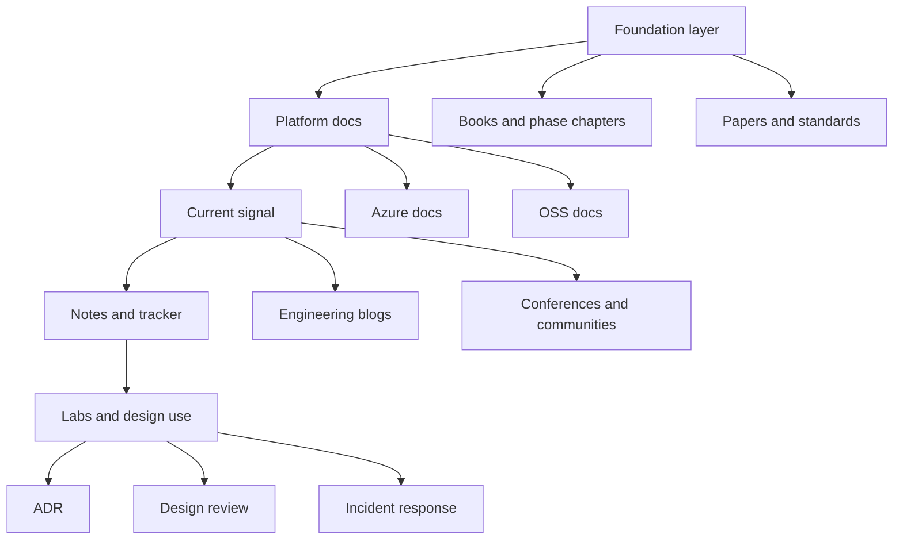
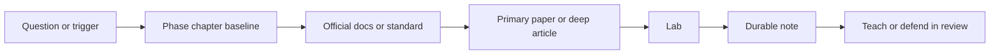
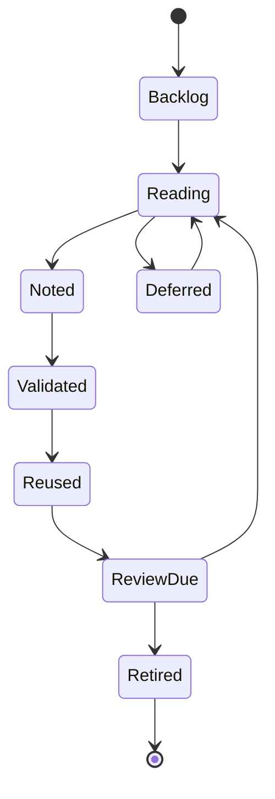

# Reading List and Further Study

> Part of the **Enterprise Data & AI Architecture Handbook** - Resources / References, Chapter 02.
> A curated, opinionated reading and study system for senior engineers, architects, and AI platform leaders who want durable depth rather than fragmented content consumption.

---

## Executive Summary

The fastest way to look current in enterprise data and AI is to consume more content. The fastest way to become genuinely dangerous, however, is to read the **right** material in the **right** sequence, attach it to working systems, and revisit it when a design decision, incident, migration, or investment forces the concept to become concrete. This chapter is therefore not a list of recommended books. It is a **reference architecture for technical study**.

The core idea is simple: build a layered canon. Start with durable conceptual sources such as books, seminal papers, standards, and official platform documentation. Add vendor and OSS references for the platform you actually operate. Then add current-signal sources such as engineering blogs, conference talks, release notes, and communities. The final layer is not more reading. It is **labs, notes, and teaching**. If a resource never changed how you implement, review, govern, or explain a system, it was content consumed, not knowledge absorbed.

This chapter is Azure-first because the handbook is Azure-first, but it remains concept-first. Azure docs, Microsoft Learn paths, Azure Architecture Center guidance, Databricks-on-Azure guidance, and Fabric documentation form the default vendor reading lane. OSS, AWS, and GCP resources are included to sharpen portability and prevent a one-vendor mental model from quietly redefining the underlying concepts.

---

## Learning Objectives

After working through this chapter you should be able to:

- Build a disciplined reading program for enterprise data and AI architecture rather than a loose backlog of bookmarks.
- Distinguish which question calls for a book, a paper, a standard, an official doc set, a blog, a conference talk, or a lab.
- Construct an Azure-first reading path that still preserves concept portability through OSS, AWS, and GCP comparison sources.
- Turn incidents, architecture reviews, and migration work into just-in-time reading triggers.
- Use a repeatable `read -> note -> lab -> teach` loop to convert content into operational judgment.
- Define a team-level canonical reading corpus that improves onboarding, reviews, and platform consistency.

---

## Business Motivation

Poor study habits create real platform cost.

- Teams that learn from product marketing and conference keynote summaries tend to buy vocabulary before they buy understanding.
- Teams that read only official vendor docs tend to internalize one provider's product packaging as if it were the concept itself.
- Teams that read only blogs tend to copy the most interesting solution rather than the least powerful solution that satisfies the requirement.
- Teams that read only books often understand enduring principles but miss current platform constraints, deprecations, and control-plane changes.

The business outcome is familiar: over-engineered streaming, under-governed RAG, brittle Terraform, expensive networking mistakes, copy-pasted security patterns applied without understanding, and architecture reviews that surface the same misconceptions repeatedly. A curated reading system reduces those costs. It also shortens onboarding, improves interview calibration, accelerates migrations, and gives staff-level engineers a durable leverage mechanism: fewer decisions are reinvented from scratch.

---

## History and Evolution

Technical study for architects has shifted in four major stages.

- **Book-first era.** Early architecture and data-platform learning relied on textbooks, vendor manuals, and long-form books. This built durable intuition but updated slowly.
- **Web-docs era.** Official product documentation and architecture centers became the operational source of truth once infrastructure turned programmable and release cadence accelerated.
- **Engineering-blog era.** Companies such as Google, Netflix, Uber, LinkedIn, Airbnb, Spotify, and Databricks made internal architecture thinking partially public through engineering write-ups. These raised the industry's baseline but also made cargo-cult copying easier.
- **AI-summary era.** LLM-assisted reading and summarization lowered access cost, but also created a new failure mode: teams feel familiar with a topic they have never actually traced back to a primary source or implemented in a lab.

The correct response is not nostalgia for books or blind trust in official docs. It is a layered study model where durable sources, operational docs, and current-signal sources are each used for the questions they are best at answering.

---

## Why This Technology Exists

This chapter exists because a mature platform needs a **canonical knowledge supply chain**.

Architecture, governance, incident response, platform engineering, and AI safety all depend on judgments that are formed long before the review meeting where they are expressed. If those judgments are built on shallow or mismatched inputs, the resulting system inherits that weakness. A reading list is therefore a control mechanism: it influences which ideas enter the organization, in what order, with what level of skepticism, and with what validation loop.

The point is not to maximize reading volume. The point is to maximize the probability that when a consequential question appears, the engineer has already seen the principle, knows where to verify it, and can connect it to a real implementation surface.

---

## Problems It Solves

- **Fragmented learning.** Converts a random pile of tabs, bookmarks, and half-remembered talks into a curated canon.
- **One-vendor tunnel vision.** Balances Azure-primary implementation guidance with OSS and comparison sources so the concept remains portable.
- **Stale foundations.** Ensures enduring fundamentals such as [CAP and PACELC](../../Phase-02/04_CAP_and_PACELC.md), [Dimensional Modeling](../../Phase-06/01_Dimensional_Modeling.md), and [Identity and Access Management with Entra](../../Phase-10/02_Identity_and_Access_Management_with_Entra.md) do not get displaced by trend chasing.
- **Shallow implementation.** Forces a lab and note-taking layer so reading turns into operational muscle rather than recognition memory.
- **Onboarding inefficiency.** Gives new team members a sane reading order and a definition of done beyond `read these docs`.
- **Review inconsistency.** Provides common references that make design debates more evidence-driven.

---

## Problems It Cannot Solve

- It cannot replace implementation. Reading about [Kubernetes](../../Phase-09/06_Kubernetes.md) or [Agentic AI Architecture](../../Phase-12/05_Agentic_AI_Architecture.md) does not produce production judgment unless coupled with labs and operations.
- It cannot keep pace by itself. A reading list without review cadence decays into a museum.
- It cannot override incentives. If teams are rewarded for novelty over correctness, the canon will be ignored.
- It cannot resolve all disagreement. Two well-read architects can still rationally disagree on trade-offs.
- It cannot make bad source material good. It only improves selection, sequence, and validation.

This chapter is therefore an operating aid, not a substitute for architecture work.

---

## Core Concepts

### 2.1 Layered canon

A durable reading system has four layers:

- **Foundations**: books, seminal papers, standards, and handbook phase chapters.
- **Operational platform docs**: official Azure, Databricks, Fabric, Entra, Purview, Kubernetes, Terraform, and OSS documentation.
- **Current-signal sources**: release notes, engineering blogs, conference talks, postmortems, and community discussions.
- **Practice layer**: labs, note systems, ADRs, design reviews, and teaching artifacts.

Skipping the foundation layer leads to product-shaped thinking. Skipping the operational-doc layer leads to outdated theory. Skipping the practice layer leads to false confidence.

### 2.2 Source hierarchy by question type

Different sources answer different questions.

- **Books and deep phase chapters** answer `why does this class of system work this way?`
- **Papers** answer `what was the original mechanism or design claim?`
- **Official docs** answer `how does this product or standard behave today?`
- **Engineering blogs** answer `how did another team apply the idea under real constraints?`
- **Communities and talks** answer `what has changed recently, and what pain is surfacing in practice?`

The anti-pattern is asking one source class to answer every question.

### 2.3 Read -> note -> lab -> teach

The loop is load-bearing.

1. Read a primary or operational source.
2. Compress it into a note that states what changed your model.
3. Validate it in a lab or design artifact.
4. Teach or explain it in a review, write-up, or mentoring conversation.

Without steps 2-4, the reading remains passive and decays quickly.

### 2.4 Trigger-based study

The best study plans are not purely calendar-driven. They are also triggered by real platform events:

- architecture review on a topic you cannot yet defend;
- incident exposing a gap in understanding;
- migration or vendor evaluation;
- roadmap bet requiring a new capability;
- interview loop or promotion scope demanding deeper articulation.

This keeps the canon coupled to actual platform demand.

### 2.5 Concept-first, product-second study

Every resource should be categorized as either teaching a **concept**, a **mechanism**, a **product boundary**, or an **operational pattern**. That classification protects the reader from mistaking `Azure AI Search`, `Bedrock`, `BigQuery`, or `Unity Catalog` for the concept itself. This is the same discipline used in the glossary resource and reinforced across [Lakehouse Architecture](../../Phase-05/02_Lakehouse_Architecture.md), [Retrieval Augmented Generation](../../Phase-12/03_Retrieval_Augmented_Generation.md), and [Data Mesh Principles](../../Phase-15/01_Data_Mesh_Principles.md).

---

## Internal Working

### 3.1 Study pipeline

The canonical study pipeline looks like this:

`question -> relevant phase chapter -> official docs / standard -> one primary paper or deep article -> one hands-on lab -> one durable note -> one explanation or review artifact`

The sequence matters. Starting with current-signal content before the baseline chapter or official docs often produces distorted emphasis.

### 3.2 Compression and retrieval

Raw reading notes are not enough. Each note should capture:

- the question that motivated reading;
- the strongest claim or mechanism learned;
- what was surprising or corrected a prior belief;
- one implementation action or lab to run;
- one cross-reference to a handbook chapter;
- a review date.

This makes the note retrievable for future work, rather than a private essay that is never reused.

### 3.3 Review and refresh cadence

Different source classes age differently.

- Books and seminal papers: review yearly or when architecture scope changes.
- Official product docs: recheck when service behavior, tiering, or security posture matters.
- Release notes and blogs: scan weekly or monthly for change signals.
- Internal canon entries: review quarterly and immediately after incidents or large migrations.

The operating principle is `refresh because the world changed, not because the calendar demanded busywork`.

---

## Architecture

The reading system itself has a five-layer architecture:

- **Layer 0 - enduring foundations**: distributed systems, storage, modeling, governance, security, architecture practice.
- **Layer 1 - platform references**: Azure and OSS product docs, standards, and reference architectures.
- **Layer 2 - current signal**: release notes, engineering blogs, conference content, communities.
- **Layer 3 - personal or team knowledge base**: notes, study trackers, reading maps, summaries, ADR excerpts.
- **Layer 4 - application**: labs, design reviews, incident postmortems, migration plans, mentoring, interviews.

Failures at one layer cannot be fixed by over-investing in another. If Layer 0 is weak, more release-note scanning will not help. If Layer 4 is absent, more books will not produce applied judgment.

---

## Components

| Component | Purpose | Best used for | Failure if missing |
|---|---|---|---|
| Handbook phase chapters | baseline shared model | scoped topic onboarding | no common vocabulary |
| Books | durable mental models | foundations, trade-offs, deep context | fashionable but shallow designs |
| Papers and standards | original mechanism | validating claims, tracing lineage | blog-level cargo culting |
| Official docs | current behavior | implementation, limits, SKUs, config | stale or incorrect build decisions |
| Engineering blogs | real-world application | scale stories, migration patterns, failure lessons | lack of pragmatic pattern sense |
| Release notes | currency | avoiding surprise regressions or retirements | stale platform assumptions |
| Conferences and communities | weak-signal detection | trend scanning, ecosystem changes | local maximum thinking |
| Labs | conversion to operational understanding | implementation rehearsal | recognition without skill |
| Notes and trackers | retrieval and reuse | long-term compounding | repeated rereading |
| Certifications | structured survey and baseline signal | breadth and external benchmark | résumé without depth if overused |

---

## Metadata

Treat each reading item like an asset with structured metadata.

Recommended fields:

- title
- source type
- topic
- depth level
- vendor scope
- trigger question
- phase cross-reference
- owner
- review date
- implementation required
- status

Example tracker record:

```yaml
title: ACL-aware retrieval for RAG
source_type: official-docs
topic: rag-security
depth: deep-dive
vendor_scope: azure-primary
trigger_question: How do we preserve source entitlements in retrieval?
phase_refs:
  - ../../Phase-12/03_Retrieval_Augmented_Generation.md
  - ../../Phase-10/02_Identity_and_Access_Management_with_Entra.md
implementation_required: true
status: reading
owner: enterprise-data-ai-architecture
review_date: 2026-09-15
```

This is the study equivalent of the metadata discipline described in [Metadata Management OpenMetadata and Atlas](../../Phase-08/04_Metadata_Management_OpenMetadata_and_Atlas.md).

---

## Storage

The storage problem for learning is not where PDFs live. It is where **durable understanding** lives.

- Store canonical notes in version-controlled markdown.
- Keep excerpts short and attribute the source rather than copying large passages.
- Separate raw capture from refined note. Raw capture is a scratchpad; refined note is reusable knowledge.
- Store phase cross-links next to each note so the handbook remains the primary navigation surface.
- Archive vendor notes with review dates because official docs change faster than most people remember.

The best storage system is boring, searchable, and stable. For most engineers that means Git-backed markdown, not a fragile mix of screenshots, chat transcripts, and browser tabs.

---

## Compute

Learning compute is attention, not CPU.

- Reserve **deep-work blocks** for books, papers, and standards.
- Use **shorter recurring slots** for release notes, blogs, and community scan.
- Tie labs to real platform work so learning produces operational return.
- Time-box topics to avoid endless curiosity loops that never convert into implementation.

As a working heuristic for senior engineers:

- 40 percent foundations and deep docs;
- 30 percent current platform docs and reference architectures;
- 20 percent labs and notes;
- 10 percent current-signal scanning.

Adjust only when a real project or incident justifies it.

---

## Networking

Study scales faster through communities than in isolation, but community signal is noisy and must be filtered.

High-value networks include:

- architecture and platform engineering reading groups;
- internal postmortem and ADR review forums;
- Azure, Databricks, Kubernetes, Kafka, Spark, OpenTelemetry, and ML communities;
- conferences where engineering details survive contact with slides;
- mentorship and peer calibration loops.

Networking should be used to discover **which questions deserve deeper primary-source study**, not to replace primary-source study.

---

## Security

Technical study has its own security requirements.

- Do not paste confidential architecture or customer data into external summarizers.
- Do not rely on AI-generated summaries of security guidance without checking primary docs.
- Treat copied code snippets from blogs as untrusted until validated.
- Respect licensing and internal redistribution boundaries for books, standards, and course materials.
- Keep secrets, endpoint names, and internal network details out of shared notes.

For Azure-heavy teams, security reading should always loop back to [Security Foundations](../../Phase-10/01_Security_Foundations.md), [Network Security and Zero Trust](../../Phase-10/04_Network_Security_and_Zero_Trust.md), and [Data Privacy and PII Protection](../../Phase-10/07_Data_Privacy_and_PII_Protection.md).

---

## Performance

The performance question for a reading system is not `how many items were completed?` It is `how much applied judgment was created per hour spent?`

Useful indicators:

- design-review quality improved;
- fewer architecture misconceptions recur;
- incident remediation becomes faster and more precise;
- onboarding time to useful contribution drops;
- notes and labs are being reused, not just accumulated;
- cross-cloud or OSS comparisons become more honest and less slogan-driven.

This is analogous to the measurement discipline in [Performance Engineering](../../Phase-18/05_Performance_Engineering.md): measure the dominant outcome, not the easiest vanity metric.

---

## Scalability

An individual reading system should scale to team and platform level.

- **Individual scale**: personal note vault, quarterly reading goals, triggered deep dives.
- **Team scale**: canonical reading list per platform domain, reading clubs, shared notes, onboarding tracks.
- **Organization scale**: architecture standards with explicit source references, annual canon review, role-based learning paths.

Scalability fails when the canon depends on one charismatic expert's memory. The reading system must outlive its author.

---

## Fault Tolerance

Reading systems fail through drift, overload, and abandonment. Resilience patterns include:

- keep a small canonical core rather than an infinite backlog;
- record why an item matters before reading it;
- allow graceful degradation from deep study to summary review during busy periods;
- keep labs small and focused so learning is not blocked by environment sprawl;
- retire stale resources explicitly rather than silently leaving them in the canon.

This is the learning analogue of [Reliability and SRE](../../Phase-18/04_Reliability_and_SRE.md): design for sustainable operation, not heroics.

---

## Cost Optimization

Study spend has the same pattern as cloud spend: the biggest waste is not unit price, it is unmeasured unused capacity.

- Buy books you will annotate and revisit, not shelves you will never reopen.
- Pay for conferences only when the learning or networking delta is real.
- Prefer official docs and primary papers over expensive generic courses when the question is operational.
- Use certifications for structured breadth or external signaling, not as the main depth mechanism.
- Reuse one lab environment across multiple topics where possible.

Worked example: an architect spends 30 hours over a quarter.

- **Unstructured path**: 20 hours of videos, 5 hours of random blogs, 5 hours of note cleanup. Output is low recall and no reusable artifact.
- **Structured path**: 8 hours baseline phase chapters, 8 hours official docs, 6 hours one lab, 4 hours notes, 4 hours teaching or ADR support. Output is a reusable mental model and at least one applied artifact.

The second path usually costs less and compounds faster.

---

## Monitoring

Monitoring a reading program means watching the explicit plan.

Track:

- items started, completed, deferred, and retired;
- stale notes past review date;
- labs promised versus labs actually run;
- broken handbook cross-links in notes;
- recurring topic gaps showing up in reviews or incidents.

These are the `known unknown` checks of the study system.

---

## Observability

Observability asks the deeper question: `why are we still making the same architectural mistakes despite reading?`

Signals include:

- repeated misuse of terminology from the glossary resource;
- decisions copied from blog posts without context transfer;
- heavy note activity with little review or implementation reuse;
- teams knowing product names but not control boundaries;
- certifications completed without improvement in design quality.

This section is intentionally distinct from monitoring, following the same separation emphasized in [Observability with OpenTelemetry](../../Phase-18/02_Observability_with_OpenTelemetry.md).

---

## Governance

Every canonical reading program needs lightweight governance.

- assign an owner for the corpus;
- define what counts as canonical, optional, or trend-only material;
- set review cadence and retirement rules;
- require source-class diversity for high-stakes topics;
- tie critical platform standards back to named sources.

Without governance, a reading list quickly becomes either a stale shrine or a popularity contest.

---

## Trade-offs

| Trade-off | First side | Second side | Use when |
|---|---|---|---|
| Books vs docs | depth and conceptual stability | product-current operational detail | choose by whether the question is architectural or implementation-specific |
| Papers vs blogs | original mechanism | pragmatic field story | choose by whether you need first principles or translation |
| Certs vs labs | structured breadth and signaling | actual transfer into skill | labs dominate when implementation judgment is the goal |
| Azure-first vs multi-cloud reading | operational relevance | portability and comparison | Azure-first should be default, not monopoly |
| Reading breadth vs rereading depth | ecosystem awareness | durable intuition | reread when the concept is load-bearing |
| Trend scanning vs canonical study | currency | reliability of understanding | scan to detect change, then dive deep only when justified |

---

## Decision Matrix

| Question type | Start with | Then use | Avoid starting with |
|---|---|---|---|
| `What is this concept?` | relevant handbook phase chapter | book or paper | product marketing or keynote summary |
| `How does Azure do this today?` | official Azure docs | reference architecture, CLI or IaC examples | old blog posts |
| `How does this compare across vendors?` | concept baseline chapter | Azure plus OSS plus AWS and GCP comparison docs | direct product-name matching |
| `Why did another company choose this pattern?` | engineering blog or case study | original paper or deep handbook chapter | copied repo or conference soundbite |
| `Can I operate this safely?` | official docs and security guidance | lab, postmortem, SRE chapter | only tutorial content |
| `Should we adopt this new thing?` | glossary and phase baseline | release notes, design reviews, case studies | social media consensus |
| `How do I prepare for interviews or promotion?` | Phase-19 and Phase-20 chapters | canonical books, review notes, labs | certifications alone |

---

## Design Patterns

- **Read the baseline first**: start with the handbook phase chapter before external detail.
- **Source triangulation**: combine one conceptual source, one official-doc source, and one field-story source.
- **Read for a question**: every reading item must answer a real question.
- **Notes as contracts**: write what changed, what remains unclear, and what must be validated.
- **Lab before opinion**: do not form a strong platform opinion from reading alone when a small lab is practical.
- **Teach to verify**: if you cannot explain it in a design review, you do not yet own it.

---

## Anti-patterns

- Collecting resources faster than you can integrate them.
- Confusing platform familiarity with conceptual mastery.
- Learning only through videos because they feel easier.
- Using blogs as product documentation.
- Reading only one cloud's material and calling the result `architecture`.
- Treating certifications as proof of implementation competence.
- Trusting AI summaries that were never checked against primary sources.

---

## Common Mistakes

| Mistake | Correction |
|---|---|
| `I should read broadly before I go deep.` | Read just enough breadth to scope the question, then go deep where your current platform or decision needs it. |
| `Official docs are enough.` | Official docs explain current behavior; they rarely explain historical design trade-offs or original theory well. |
| `Books are more rigorous than docs, so I can ignore docs.` | Books age; product docs define the current operational truth. |
| `Conference talks are efficient substitutes for papers or docs.` | Talks are good for signal detection, not authoritative mechanism detail. |
| `Certifications prove readiness for staff-level architecture work.` | Certifications can help breadth and signaling, but labs, notes, and reviews prove transfer. |
| `If I understood the summary, I understand the system.` | Understanding is not recognition; verify through implementation or explanation. |

---

## Best Practices

- Keep a small, opinionated canon per topic.
- Review canonical items on a schedule and retire stale ones.
- Pair every deep topic with a lab or architecture artifact.
- Record one `what changed my mind` statement per reading item.
- Build a concept-first comparison table whenever vendor choice is involved.
- Revisit foundational texts after practical experience; rereading later is often higher leverage than reading new material.

---

## Enterprise Recommendations

For enterprise teams, the reading list should be operated like a lightweight platform product.

- create a version-controlled study corpus;
- map it to role paths such as senior engineer, data engineer, architect, and AI platform lead;
- embed source references in standards and review templates;
- require every major platform domain to maintain a top-ten canonical list;
- include trend-scan and deprecation review in platform operating cadence;
- capture the link between incidents and reading updates.

The long-term goal is not more reading. It is fewer preventable misunderstandings in high-cost decisions.

---

## Azure Implementation

Azure should be the primary vendor reading lane for this handbook.

Recommended Azure-first study tracks:

- **Architecture foundations**: Azure Architecture Center, Cloud Adoption Framework, Well-Architected Framework, landing zones, identity, networking, and governance guidance. Pair with [Azure Core Architecture](../../Phase-03/02_Azure_Core_Architecture.md), [Azure Landing Zones](../../Phase-03/03_Azure_Landing_Zones.md), and [Well Architected Framework](../../Phase-03/07_Well_Architected_Framework.md).
- **Data platform**: ADLS Gen2, Databricks, Fabric, ADF, Synapse, Purview, Event Hubs, Cosmos DB, and Databricks-on-Azure documentation. Pair with [Lakehouse Architecture](../../Phase-05/02_Lakehouse_Architecture.md) and [Databricks Platform](../../Phase-05/05_Databricks_Platform.md).
- **Security and governance**: Entra, Private Link, Key Vault, Defender, Purview, compliance, privacy, and policy docs. Pair with [Security Foundations](../../Phase-10/01_Security_Foundations.md) and [Compliance and Regulatory Frameworks](../../Phase-10/06_Compliance_and_Regulatory_Frameworks.md).
- **AI platform**: Azure ML, Azure OpenAI, Azure AI Search, AI Foundry, evaluation and safety docs. Pair with [Azure Machine Learning](../../Phase-11/05_Azure_Machine_Learning.md), [Azure OpenAI and AI Foundry](../../Phase-12/07_Azure_OpenAI_and_AI_Foundry.md), and [Evaluation and Guardrails](../../Phase-12/09_Evaluation_and_Guardrails.md).

Example study-repo scaffold for Azure-first reading notes:

```powershell
$topic = 'phase-12-rag'
$path = ".\learning\$topic"
New-Item -ItemType Directory -Path $path -Force | Out-Null
@"
title: Azure AI Search ACL-aware retrieval
source_type: azure-docs
phase_refs:
  - ../../Handbook/Phase-12/03_Retrieval_Augmented_Generation.md
  - ../../Handbook/Phase-10/02_Identity_and_Access_Management_with_Entra.md
question: How do we preserve source entitlements in retrieval?
review_date: 2026-09-15
status: reading
"@ | Set-Content "$path\note.yaml"
```

The point is not the script. The point is to make reading artifacts reproducible and reviewable in the same way infrastructure artifacts are.

---

## Open Source Implementation

An OSS reading lane keeps concepts portable and exposes the mechanism more directly than managed platforms often do.

Recommended OSS reference families:

- **Data and storage**: Apache Spark, Delta Lake, Apache Iceberg, Apache Hudi, Trino, DuckDB, ClickHouse.
- **Streaming and integration**: Kafka, Flink, Debezium, Airflow, OpenLineage.
- **Governance and metadata**: OpenMetadata, Apache Atlas, DataHub, OPA.
- **Observability and reliability**: OpenTelemetry, Prometheus, Grafana, Tempo, Loki.
- **AI platform**: MLflow, Feast, Ray, LangChain, LlamaIndex, Qdrant, Milvus, Neo4j.

Useful OSS study pattern:

```yaml
topic: table-format-comparison
primary_sources:
  - Delta Lake docs
  - Apache Iceberg docs
  - Apache Hudi docs
validation:
  - create one small table in each format
  - compare schema evolution and time-travel ergonomics
deliverable:
  - one-page recommendation for current platform scope
```

OSS reading is highest leverage when you need to understand the mechanism beneath a managed product boundary.

---

## AWS Equivalent (comparison only)

AWS should be read here as a comparison lane, not a second full study program.

- Use AWS Well-Architected to compare quality-attribute framing against Azure's equivalent.
- Use S3, Lake Formation, Glue, Athena, Redshift, MSK, Kinesis, SageMaker, Bedrock, IAM, and PrivateLink docs to identify product-boundary differences.
- Pay special attention to where AWS splits one concept across several services more explicitly than Azure.
- Read AWS engineering and service docs to prevent Azure product names from becoming the concept in your head.

The right question is not `how do I become an AWS expert too?` It is `which concept boundaries look different enough that my Azure-first assumptions might mislead me?`

---

## GCP Equivalent (comparison only)

GCP should likewise be used as a comparison lane.

- Use Google Cloud Architecture Framework, BigQuery, Dataplex, Pub/Sub, Dataflow, GKE, Vertex AI, and Cloud IAM material to compare packaging and defaults.
- Pay attention to where GCP collapses multiple conceptual layers into one product surface, especially around BigQuery and Vertex AI.
- Use GCP reading to sharpen concept portability rather than to duplicate your Azure study queue.

This comparison lane is especially valuable for topics like [Streaming Fundamentals](../../Phase-07/01_Streaming_Fundamentals.md), [Feature Stores with Feast](../../Phase-11/02_Feature_Stores_with_Feast.md), and [Embeddings and Semantic Search](../../Phase-13/03_Embeddings_and_Semantic_Search.md), where product boundaries differ materially.

---

## Migration Considerations

Moving from ad hoc learning to a governed reading system usually fails for one of three reasons:

- the canon is too large at launch;
- the owner is unclear;
- the team confuses trend scanning with foundational study.

Recommended migration sequence:

1. identify the ten most reused topics in your platform;
2. assign one baseline phase chapter and two external source classes to each;
3. add a note template and review date;
4. tie at least one upcoming project or design review to the canon;
5. retire resources that are stale, duplicative, or hype-only.

Do not attempt to boil the ocean. A small accurate canon beats a giant ignored one.

---

## Mermaid Architecture Diagrams







---

## End-to-End Data Flow

One end-to-end study flow for a real platform question looks like this:

| Step | Action | Example |
|---|---|---|
| Trigger | incident, migration, or roadmap bet raises a knowledge gap | `Should we use hybrid retrieval or pure vector search?` |
| Baseline | read the relevant phase chapter | [Retrieval Augmented Generation](../../Phase-12/03_Retrieval_Augmented_Generation.md) |
| Primary operational source | inspect Azure and OSS docs | Azure AI Search plus Qdrant docs |
| Primary mechanism source | read one deeper article or paper | one ANN or RAG evaluation paper |
| Validation | run a minimal lab | compare recall and latency on a small corpus |
| Compression | write a durable note | what changed, what remains unclear, what to adopt |
| Reuse | apply in ADR or review | recommendation for default retrieval pattern |

The same flow works for landing zones, event delivery semantics, identity, data contracts, or SLO design.

---

## Real-world Business Use Cases

- **Onboarding**: new hires get a role-appropriate study path instead of unstructured `read the docs` advice.
- **Architecture review preparation**: engineers use canonical sources before high-stakes review meetings.
- **Incident remediation**: postmortems feed back into the study canon for the underlying concept.
- **Platform migrations**: teams learn concepts before product-to-product mapping.
- **Leadership development**: staff and principal engineers build durable teaching and design-reference assets.
- **Interview readiness**: system-design depth comes from the same canon rather than a separate cramming corpus.

---

## Industry Examples

Use the industry's public writing in a disciplined way.

- **Google** is strong for distributed-systems mechanism and design-doc culture.
- **Microsoft** is strong for Azure implementation detail, architecture-center guidance, and enterprise control-plane patterns.
- **Databricks** is strong for lakehouse, Delta, Spark, and data-architecture translation into concrete platform practice.
- **Netflix, Uber, LinkedIn, Airbnb, Spotify** are strong for pattern translation at scale, but should be read as context-rich case studies, not templates.
- **Apache and CNCF communities** are strong for mechanism clarity and ecosystem direction.

The rule: take principles aggressively, copy topologies cautiously, and copy product stacks rarely.

---

## Case Studies

**Case Study 1 - The blog-shaped architecture.**
An architecture team needed an enterprise streaming backbone and read mostly conference talks and engineering blogs from internet-scale companies. The material was technically good, but the team skipped the baseline chapters, the official Event Hubs and Service Bus documentation, and any costed right-sizing exercise. It built a Kafka-compatible always-on design for a workload that peaked below a few hundred events per second and only needed fifteen-minute freshness. Six months later the platform was expensive, underused, and burdened by operational complexity. The failure was not reading too little. It was reading the wrong source class first.

**Case Study 2 - The certification-shaped confidence trap.**
A senior engineer completed several data and AI certifications in quick succession and was now treated internally as the topic expert. In design reviews, however, the engineer repeatedly confused `RAG` with fine-tuning, used `exactly-once` without business-boundary qualification, and could not explain why [Data Mesh Principles](../../Phase-15/01_Data_Mesh_Principles.md) required more than decentralized ownership. The issue was not that certifications were useless. The issue was that breadth-signaling had replaced the `read -> note -> lab -> teach` loop that produces durable depth.

### Architecture Decision Record (ADR-0226): Operate a Canonical, Azure-First, Multi-Source Reading System with a Read-Note-Lab-Teach Loop

**Context.** The platform organization had strong motivation to improve architectural depth, but technical study was fragmented across personal bookmarks, random blogs, vendor docs, and ad hoc certification choices. This produced repeated review friction, shallow transfer from trend content into implementation, and inconsistent understanding of foundational topics such as event semantics, governance, and AI safety. Case Study 1 showed over-weighting field stories without baseline or docs. Case Study 2 showed over-weighting breadth credentials without implementation and articulation.

**Decision.** Adopt a canonical reading system with the following clauses:

1. **Azure-first baseline.** Azure documentation and Microsoft architecture guidance are the default operational source layer because Azure is the primary implementation platform for this handbook.
2. **Multi-source minimum.** Consequential topics must be learned from at least one baseline chapter or book, one official doc or standard, and one field-story source where available.
3. **Read -> note -> lab -> teach loop.** No topic is considered absorbed until it has produced a durable note and one practical validation or explanatory artifact.
4. **Concept-first comparisons.** OSS, AWS, and GCP materials are used to preserve portability and expose product-boundary differences, not to run parallel full study programs.
5. **Trigger-based depth.** Incidents, migrations, reviews, and roadmap bets can escalate a topic from backlog to immediate study even if it was not on the calendar.
6. **Owned canon.** Every canonical resource list has an owner, review cadence, and retirement rule.
7. **Certifications are supplementary.** They may support breadth or signaling, but never replace labs and primary-source study for platform-critical topics.

**Consequences.** Positive: faster onboarding, better architecture reviews, fewer repeated misconceptions, more portable mental models, and a clearer connection between learning and platform quality. Negative: some writer and maintainer effort is required to curate the canon, and engineers must spend slightly more time on note and lab discipline than on passive consumption. This cost is accepted because multiplied reviewer time and mis-implementation cost are far larger.

**Alternatives considered.**

- *Let each engineer self-curate freely*: rejected because it maximizes local enthusiasm but not organizational coherence.
- *Official docs only*: rejected because it underweights historical design rationale and field translation.
- *Blogs and conference talks as the primary source*: rejected because they bias toward unusual or scale-specific patterns.
- *Certification-driven learning paths only*: rejected because they optimize for coverage and external signal, not durable operational judgment.

---

## Hands-on Labs

- **Lab 1 - Build the canon.** Create a `learning/` repo folder with five domain folders: distributed-systems, azure-platform, data-platform, ml-platform, ai-platform. Seed each with three canonical items and review dates.
- **Lab 2 - Topic triangulation.** Pick one topic such as `private endpoints for data platforms` or `RAG evaluation`. Read one phase chapter, one Azure doc set, and one field-story article, then produce a one-page synthesis note.
- **Lab 3 - Read-to-lab conversion.** Turn a reading item into a runnable lab: for example, compare Delta, Iceberg, and Hudi locally or test entitlement propagation in a toy RAG system.
- **Lab 4 - Reading drift audit.** Take ten bookmarked resources and classify them as canonical, optional, stale, or trend-only.
- **Lab 5 - Incident-to-canon update.** Use a past incident and add exactly one new or revised study item that would have reduced time to diagnosis or prevention.

---

## Exercises

1. Build a ten-item reading canon for one platform domain you currently own.
2. Identify one topic where your knowledge comes mostly from blogs and rebalance it with a paper or official doc.
3. Identify one topic where your knowledge comes mostly from vendor docs and rebalance it with a book or field story.
4. Rewrite your current study backlog as question-driven items rather than topic labels.
5. Choose one certification you are considering and define what lab work would be required so it produces genuine operational return.

---

## Mini Projects

- **Docs-as-code study system**: build a markdown-based reading canon with owners, review dates, and phase cross-links.
- **Architecture-source map**: for the ten most reused platform topics in your organization, build a source matrix by type: book, phase chapter, doc, blog, lab.
- **Quarterly deprecation watch**: create a lightweight process that scans Azure, Databricks, and OSS release notes for changes affecting your current canon.

---

## Capstone Integration

This chapter exists to help the reader continue beyond the handbook without losing the handbook's structure. The foundational reading lane pairs naturally with [Architecture Governance](../../Phase-01/02_Architecture_Governance.md), [CAP and PACELC](../../Phase-02/04_CAP_and_PACELC.md), and [Distributed Transactions](../../Phase-02/05_Distributed_Transactions.md). The data-platform lane extends [Lakehouse Architecture](../../Phase-05/02_Lakehouse_Architecture.md), [dbt and Analytics Engineering](../../Phase-05/08_dbt_and_Analytics_Engineering.md), and [Semantic Layer and Metrics](../../Phase-06/06_Semantic_Layer_and_Metrics.md). The streaming lane extends [Apache Kafka](../../Phase-07/02_Apache_Kafka.md) and [Streaming Patterns and Delivery Semantics](../../Phase-07/08_Streaming_Patterns_and_Delivery_Semantics.md). The governance and security lane extends [Data Governance Foundations](../../Phase-08/01_Data_Governance_Foundations.md) and [Secrets and Key Management](../../Phase-10/05_Secrets_and_Key_Management.md). The AI lane extends [MLOps and MLflow](../../Phase-11/03_MLOps_and_MLflow.md), [LLMOps](../../Phase-12/04_LLMOps.md), and [Evaluation and Guardrails](../../Phase-12/09_Evaluation_and_Guardrails.md). The operating-discipline lane extends [FinOps and Cost Optimization](../../Phase-18/01_FinOps_and_Cost_Optimization.md) and [Reliability and SRE](../../Phase-18/04_Reliability_and_SRE.md). The leadership and career lanes extend [Technical Writing](../../Phase-19/04_Technical_Writing.md), [System Design Interview Prep](../../Phase-20/03_System_Design_Interview_Prep.md), and [Portfolio and Case Studies](../../Phase-20/06_Portfolio_and_Case_Studies.md).

The capstone lesson is that study should remain phase-shaped even after the handbook ends.

---

## Interview Questions

1. How would you design a reading plan for an engineer moving from data engineering into AI platform architecture?
2. Why is a reading list an architectural control mechanism rather than a personal preference artifact?
3. When would you trust a vendor doc over a field-story blog post, and when would you do the reverse?
4. Why are certifications useful but insufficient for staff-level platform judgment?
5. How do you keep Azure-first study from collapsing into Azure-only thinking?

---

## Staff Engineer Questions

1. Design a canonical study corpus for your current platform team. What is mandatory, optional, and trend-only?
2. How do you tie incidents or roadmap bets into the reading program without turning study into reactive chaos?
3. What source triad would you require before a team adopts a new platform pattern such as GraphRAG or event sourcing?
4. How would you detect that a team is reading plenty but learning poorly?
5. Which topics in your domain deserve annual rereading of foundational sources rather than only current docs?

---

## Architect Questions

1. How do you design a reading system that survives team turnover and platform change?
2. What governance rules would you place around canonical sources in an enterprise architecture function?
3. How would you introduce an OSS comparison lane without creating multi-cloud sprawl in the study program?
4. Which architecture topics are most dangerous to learn primarily from company engineering blogs, and why?
5. How would you justify time spent on notes and labs to leadership that only sees delivery metrics?

---

## CTO Review Questions

1. Which areas of our platform are we currently under-reading relative to the cost of failure?
2. Do we have any domains where product names have displaced concept understanding?
3. How dependent is our architecture quality on a few experts' private reading habits rather than shared canonical sources?
4. Where are we overspending on training or conferences that do not change implementation quality?
5. How would we know, in measurable terms, that our technical-study program is improving platform outcomes?

---

## References

Suggested foundational books, papers, standards, and documentation families:

- *Designing Data-Intensive Applications* by Martin Kleppmann.
- *Site Reliability Engineering* and *The SRE Workbook*.
- *The Data Warehouse Toolkit* by Ralph Kimball.
- *Building the Data Warehouse* by Bill Inmon.
- *Data Mesh* by Zhamak Dehghani.
- *Staff Engineer* by Will Larson.
- *The Manager's Path* by Camille Fournier.
- *The Art of Scalability* and core distributed-systems papers such as MapReduce, Bigtable, Dynamo, Dapper, Spanner, and The Log.
- Delta Lake, Apache Iceberg, Apache Hudi, Spark, Kafka, Flink, Kubernetes, OpenTelemetry, and dbt documentation families.
- Azure Architecture Center, Microsoft Learn, Cloud Adoption Framework, Well-Architected Framework, Azure service documentation for ADLS Gen2, Databricks, Fabric, Purview, Event Hubs, Cosmos DB, Azure ML, Azure OpenAI, and Azure AI Search.
- Handbook anchors: [Architecture Governance](../../Phase-01/02_Architecture_Governance.md), [CAP and PACELC](../../Phase-02/04_CAP_and_PACELC.md), [Azure Core Architecture](../../Phase-03/02_Azure_Core_Architecture.md), [Table Format Comparison](../../Phase-04/07_Table_Format_Comparison.md), [Lakehouse Architecture](../../Phase-05/02_Lakehouse_Architecture.md), [Dimensional Modeling](../../Phase-06/01_Dimensional_Modeling.md), [Streaming Fundamentals](../../Phase-07/01_Streaming_Fundamentals.md), [Data Governance Foundations](../../Phase-08/01_Data_Governance_Foundations.md), [Kubernetes](../../Phase-09/06_Kubernetes.md), [Security Foundations](../../Phase-10/01_Security_Foundations.md), [MLOps and MLflow](../../Phase-11/03_MLOps_and_MLflow.md), [LLMOps](../../Phase-12/04_LLMOps.md), [Embeddings and Semantic Search](../../Phase-13/03_Embeddings_and_Semantic_Search.md), [Data Mesh Principles](../../Phase-15/01_Data_Mesh_Principles.md), [FinOps and Cost Optimization](../../Phase-18/01_FinOps_and_Cost_Optimization.md), and [Technical Leadership](../../Phase-19/01_Technical_Leadership.md).

---

## Further Reading

Recommended next study lanes by goal:

- **Stronger distributed-systems foundations**: revisit [Consensus and Coordination](../../Phase-02/01_Consensus_and_Coordination.md), [Replication and Consistency](../../Phase-02/02_Replication_and_Consistency.md), and [Time Clocks and Ordering](../../Phase-02/06_Time_Clocks_and_Ordering.md), then pair with classic papers.
- **Deeper Azure platform competence**: revisit [Azure Landing Zones](../../Phase-03/03_Azure_Landing_Zones.md), [Azure Networking](../../Phase-03/04_Azure_Networking.md), and [Well Architected Framework](../../Phase-03/07_Well_Architected_Framework.md), then read the current Azure docs for the exact services you operate.
- **Stronger data-platform judgment**: revisit [Databricks Platform](../../Phase-05/05_Databricks_Platform.md), [Semantic Layer and Metrics](../../Phase-06/06_Semantic_Layer_and_Metrics.md), and [Streaming Patterns and Delivery Semantics](../../Phase-07/08_Streaming_Patterns_and_Delivery_Semantics.md), then compare with OSS docs and case studies.
- **Stronger governance and security depth**: revisit [Data Contracts](../../Phase-08/07_Data_Contracts.md), [Network Security and Zero Trust](../../Phase-10/04_Network_Security_and_Zero_Trust.md), and [Data Privacy and PII Protection](../../Phase-10/07_Data_Privacy_and_PII_Protection.md), then map the current controls in your own platform.
- **Stronger AI platform depth**: revisit [Feature Stores with Feast](../../Phase-11/02_Feature_Stores_with_Feast.md), [Evaluation and Guardrails](../../Phase-12/09_Evaluation_and_Guardrails.md), and [GraphRAG](../../Phase-13/04_GraphRAG.md), then read current Azure and OSS implementation guidance side by side.
- **Stronger operating-discipline depth**: revisit [Observability with OpenTelemetry](../../Phase-18/02_Observability_with_OpenTelemetry.md), [Reliability and SRE](../../Phase-18/04_Reliability_and_SRE.md), and [Performance Engineering](../../Phase-18/05_Performance_Engineering.md), then connect them to your current incidents and SLOs.
- **Stronger leadership and articulation**: revisit [Architecture Reviews](../../Phase-19/02_Architecture_Reviews.md), [Technical Writing](../../Phase-19/04_Technical_Writing.md), and [Staff and Principal Promotion](../../Phase-20/05_Staff_and_Principal_Promotion.md), then use your notes in live design and mentoring settings.